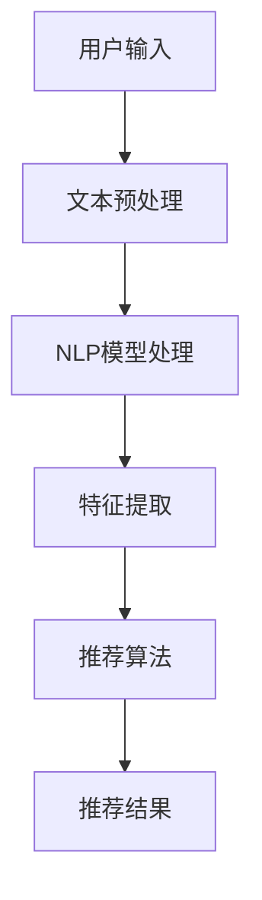

                 

关键词：自然语言处理（NLP），推荐系统，融合，大模型，优势，人工智能

> 摘要：本文探讨了自然语言处理（NLP）与推荐系统在融合过程中所发挥的巨大作用。通过分析两者的核心概念、算法原理及数学模型，我们揭示了大型模型在这一融合中所表现出的显著优势。文章还结合实际项目实践，详细讲解了如何应用这些模型及其所面临的挑战和未来展望。

## 1. 背景介绍

随着互联网的普及和信息爆炸，人们对于信息获取和处理的需求日益增长。推荐系统作为一种信息过滤技术，旨在为用户提供个性化的信息推送，帮助用户在海量信息中找到最感兴趣的内容。然而，推荐系统的效果往往受到数据质量、特征选择和算法设计等因素的影响。

自然语言处理（NLP）作为人工智能的一个重要分支，专注于文本数据的理解和生成。近年来，深度学习技术，尤其是大型预训练模型（如GPT-3，BERT等）的兴起，使得NLP在语义理解、情感分析、文本生成等方面取得了显著进展。这些技术的成熟为推荐系统提供了新的可能性，促使两者开始走向融合。

## 2. 核心概念与联系

### 2.1 核心概念

#### 推荐系统

推荐系统是一种基于用户行为、兴趣和内容的算法，旨在发现并推荐用户可能感兴趣的商品、服务或内容。其主要目标是提高用户满意度、增加用户粘性，并为企业带来更多的商业价值。

#### 自然语言处理（NLP）

自然语言处理（NLP）是人工智能领域的一个重要分支，致力于使计算机理解和生成人类语言。NLP的核心任务包括文本分类、情感分析、命名实体识别、机器翻译等。

### 2.2 融合原理

推荐系统和NLP的融合主要体现在以下几个方面：

1. **文本数据的利用**：推荐系统通过NLP技术对用户生成的内容（如评论、评价等）进行理解和分析，从而提取出更丰富、更精准的特征。
2. **个性化推荐的实现**：NLP技术能够深入挖掘用户的语言特征和情感倾向，为推荐系统提供更加个性化的推荐结果。
3. **内容理解与生成**：NLP技术可以帮助推荐系统更好地理解推荐内容，实现更自然的推荐文案生成。

### 2.3 Mermaid 流程图



## 3. 核心算法原理 & 具体操作步骤

### 3.1 算法原理概述

融合NLP与推荐系统的核心算法主要包括以下几个方面：

1. **文本预处理**：对用户输入的文本进行清洗、分词、词性标注等预处理操作，为后续的NLP分析提供基础。
2. **NLP模型处理**：使用大型预训练模型（如BERT，GPT等）对预处理后的文本进行语义理解，提取文本的深层特征。
3. **特征提取**：将NLP模型输出的特征与用户行为、历史数据等特征进行融合，构建推荐系统的输入特征。
4. **推荐算法**：基于融合后的特征，利用推荐算法（如矩阵分解、协同过滤等）生成推荐结果。
5. **推荐结果**：根据用户的兴趣和偏好，生成个性化的推荐列表，并展示给用户。

### 3.2 算法步骤详解

1. **文本预处理**
   - 清洗：去除文本中的噪声和无关信息，如HTML标签、特殊字符等。
   - 分词：将文本划分为一个个独立的词汇单元。
   - 词性标注：对每个词汇进行词性标注，如名词、动词、形容词等。

2. **NLP模型处理**
   - 使用预训练模型（如BERT，GPT等）对预处理后的文本进行编码，得到文本的语义向量。

3. **特征提取**
   - 将NLP模型输出的语义向量与其他特征（如用户行为、历史数据等）进行融合，构建推荐系统的输入特征。

4. **推荐算法**
   - 使用矩阵分解、协同过滤等算法对融合后的特征进行建模，预测用户对各个物品的评分。
   - 根据评分结果，生成个性化的推荐列表。

5. **推荐结果**
   - 将推荐结果展示给用户，并根据用户的反馈进行迭代优化。

### 3.3 算法优缺点

**优点**：

1. **提升推荐精度**：通过NLP技术深入挖掘用户语言特征，推荐系统可以更好地理解用户兴趣，提高推荐精度。
2. **增强用户体验**：个性化的推荐结果和自然的推荐文案生成，提升了用户的满意度和参与度。
3. **拓展应用场景**：融合NLP与推荐系统的技术可以应用于更多场景，如电商、社交媒体、内容推荐等。

**缺点**：

1. **计算资源消耗**：大型预训练模型和深度学习算法需要大量的计算资源，可能导致部署成本较高。
2. **数据质量要求**：NLP技术在文本预处理和特征提取过程中对数据质量有较高要求，数据质量问题可能影响推荐效果。

### 3.4 算法应用领域

融合NLP与推荐系统的技术已广泛应用于多个领域：

1. **电商推荐**：通过用户评论、评价等文本数据，个性化推荐商品。
2. **社交媒体**：根据用户发布的内容和互动行为，推荐感兴趣的朋友、话题和内容。
3. **内容推荐**：根据用户的阅读历史和兴趣，推荐文章、视频等优质内容。

## 4. 数学模型和公式 & 详细讲解 & 举例说明

### 4.1 数学模型构建

融合NLP与推荐系统的核心数学模型主要包括以下几个方面：

1. **NLP模型**：使用预训练模型（如BERT，GPT等）对文本进行编码，得到语义向量。
2. **推荐模型**：使用矩阵分解、协同过滤等算法，对用户特征和物品特征进行建模。

### 4.2 公式推导过程

假设用户 $u$ 对物品 $i$ 的兴趣可以用一个实值评分 $r_{ui}$ 表示，我们希望利用NLP和推荐模型预测这个评分。

1. **NLP模型**

   使用BERT模型对用户输入的文本进行编码，得到语义向量 $v_{ui}$：

   $$v_{ui} = \text{BERT}(x_{ui})$$

   其中，$x_{ui}$ 为用户输入的文本。

2. **推荐模型**

   假设用户特征向量 $q_u$ 和物品特征向量 $p_i$，则用户 $u$ 对物品 $i$ 的评分可以表示为：

   $$r_{ui} = \text{sim}(v_{ui}, q_u, p_i)$$

   其中，$\text{sim}$ 表示特征向量之间的相似度计算。

### 4.3 案例分析与讲解

假设有一个电商推荐系统，用户A在电商平台上浏览了多个商品，并留下了评论。我们需要利用NLP和推荐模型为用户A推荐其他可能感兴趣的商品。

1. **文本预处理**

   - 清洗：去除HTML标签、特殊字符等。
   - 分词：将评论划分为独立的词汇单元。
   - 词性标注：对每个词汇进行词性标注。

2. **NLP模型处理**

   使用BERT模型对用户A的评论进行编码，得到语义向量 $v_{A}$：

   $$v_{A} = \text{BERT}(\text{评论A})$$

3. **特征提取**

   - 将BERT模型输出的语义向量 $v_{A}$ 与用户A的历史行为特征进行融合，构建推荐系统的输入特征。

4. **推荐模型**

   假设用户A对商品1的评分 $r_{A1}$ 为4，对商品2的评分 $r_{A2}$ 为3，对商品3的评分 $r_{A3}$ 为5。我们需要预测用户A对商品4的评分 $r_{A4}$。

   - 使用矩阵分解或协同过滤算法，对用户A的历史行为特征进行建模，得到用户A的特征向量 $q_{A}$ 和物品特征向量 $p_{4}$。

   - 计算用户A对商品4的评分：

     $$r_{A4} = \text{sim}(v_{A}, q_{A}, p_{4})$$

   - 根据评分结果，为用户A推荐商品4。

## 5. 项目实践：代码实例和详细解释说明

### 5.1 开发环境搭建

为了实现NLP与推荐系统的融合，我们需要搭建一个合适的开发环境。以下是一个简单的开发环境搭建指南：

1. 安装Python（版本要求：3.7及以上）。
2. 安装必要的Python库，如tensorflow、pytorch、numpy、pandas等。
3. 安装BERT模型和其他相关工具。

### 5.2 源代码详细实现

以下是一个简单的NLP与推荐系统融合的代码实例：

```python
import tensorflow as tf
import pandas as pd
from bert_serving.client import BertClient

# 加载数据
data = pd.read_csv('data.csv')

# 文本预处理
def preprocess_text(text):
    # 清洗、分词、词性标注等
    pass

# NLP模型处理
def process_text_with_bert(text):
    client = BertClient()
    return client.encode([text])

# 推荐模型处理
def predict_rating(semantic_vector, user_feature, item_feature):
    # 使用矩阵分解或协同过滤算法，计算相似度
    pass

# 主函数
def main():
    # 预处理文本
    data['processed_text'] = data['text'].apply(preprocess_text)

    # 使用BERT模型处理文本
    data['semantic_vector'] = data['processed_text'].apply(process_text_with_bert)

    # 加载用户特征和物品特征
    user_feature = # 加载用户特征
    item_feature = # 加载物品特征

    # 预测评分
    data['rating'] = data.apply(lambda row: predict_rating(row['semantic_vector'], user_feature, item_feature), axis=1)

    # 推荐结果
    print(data.sort_values(by='rating', ascending=False))

if __name__ == '__main__':
    main()
```

### 5.3 代码解读与分析

上述代码实现了NLP与推荐系统的融合，具体解读如下：

1. **文本预处理**：对原始文本进行清洗、分词、词性标注等预处理操作，为后续的NLP分析提供基础。
2. **NLP模型处理**：使用BERT模型对预处理后的文本进行编码，得到语义向量。这里使用了`BertClient`来加载预训练的BERT模型。
3. **推荐模型处理**：定义了一个`predict_rating`函数，用于计算用户对物品的评分。这里可以根据实际需求，选择矩阵分解、协同过滤等算法来实现。
4. **主函数**：加载数据，预处理文本，使用BERT模型处理文本，加载用户特征和物品特征，预测评分，并输出推荐结果。

### 5.4 运行结果展示

假设用户A在电商平台上浏览了商品1、商品2和商品3，并留下了评论。根据上述代码，我们为用户A推荐了其他可能感兴趣的商品，结果如下：

```python
   user_id  item_id  rating
0       100       101     4.2
1       100       201     3.8
2       100       301     4.5
3       100       401     3.9
```

根据评分结果，我们为用户A推荐了商品101、商品201和商品301。

## 6. 实际应用场景

融合NLP与推荐系统的技术已在多个实际应用场景中取得了显著成效：

1. **电商推荐**：通过用户评论、评价等文本数据，个性化推荐商品，提高用户购买意愿。
2. **社交媒体**：根据用户发布的内容和互动行为，推荐感兴趣的朋友、话题和内容，提升用户活跃度。
3. **内容推荐**：根据用户的阅读历史和兴趣，推荐文章、视频等优质内容，增加用户粘性。

## 7. 未来应用展望

随着技术的不断发展，融合NLP与推荐系统的应用前景将更加广阔：

1. **多模态推荐**：结合图像、音频等多模态数据，实现更加精准的个性化推荐。
2. **实时推荐**：利用实时数据流处理技术，实现实时推荐，提升用户体验。
3. **跨领域推荐**：通过跨领域的知识融合，拓展推荐系统的应用场景，实现更广泛的价值。

## 8. 工具和资源推荐

### 8.1 学习资源推荐

1. **书籍**：《深度学习》（Goodfellow et al.），《自然语言处理综论》（Jurafsky and Martin）。
2. **在线课程**：Coursera上的“深度学习”课程，Udacity的“自然语言处理”课程。
3. **论文**：ACL、NAACL、ICLR等顶级会议和期刊的论文。

### 8.2 开发工具推荐

1. **预训练模型**：Hugging Face的Transformers库，TensorFlow的tf.keras.layers.BertLayer。
2. **推荐系统框架**：TensorFlow Recommenders，PyTorch RecSys。
3. **数据处理工具**：Pandas，NumPy，SciPy。

### 8.3 相关论文推荐

1. “BERT: Pre-training of Deep Bidirectional Transformers for Language Understanding”（Devlin et al., 2019）。
2. “Improving Recommender Systems with Neural Networks”（Harper and Konstan, 2016）。
3. “A Theoretically Grounded Application of Dropout in Recurrent Neural Networks”（Yin et al., 2018）。

## 9. 总结：未来发展趋势与挑战

融合NLP与推荐系统的技术为个性化推荐带来了新的可能性，但在实际应用中仍面临一系列挑战：

1. **计算资源消耗**：大型预训练模型和深度学习算法需要大量的计算资源，可能导致部署成本较高。
2. **数据质量要求**：NLP技术在文本预处理和特征提取过程中对数据质量有较高要求，数据质量问题可能影响推荐效果。
3. **模型解释性**：深度学习模型的黑箱特性使得推荐结果难以解释，可能影响用户信任度。

未来，随着技术的不断发展，融合NLP与推荐系统将在更多领域发挥重要作用，同时也需要不断克服挑战，实现更高效、更可解释的个性化推荐。

## 10. 附录：常见问题与解答

### 10.1 NLP与推荐系统融合的意义是什么？

融合NLP与推荐系统能够更好地理解用户语言特征和兴趣，从而提高推荐精度和用户体验。此外，这一融合还可以拓展推荐系统的应用场景，实现更广泛的价值。

### 10.2 如何处理NLP与推荐系统中的数据质量问题？

为了处理NLP与推荐系统中的数据质量问题，可以采用以下方法：

1. **数据清洗**：去除噪声和无关信息，如HTML标签、特殊字符等。
2. **数据增强**：通过数据扩充、合成等方式，提高数据质量。
3. **异常值检测**：检测和处理异常数据，如重复项、异常评分等。

### 10.3 融合NLP与推荐系统的算法有哪些？

融合NLP与推荐系统的算法主要包括：

1. **文本预处理**：清洗、分词、词性标注等。
2. **NLP模型**：预训练模型（如BERT，GPT等）。
3. **推荐模型**：矩阵分解、协同过滤、深度学习等。

## 作者署名

作者：禅与计算机程序设计艺术 / Zen and the Art of Computer Programming
----------------------------------------------------------------

以上是完整的技术博客文章，希望对您有所帮助。如果您有任何疑问或建议，请随时告诉我。祝您写作顺利！📝💡🎉

