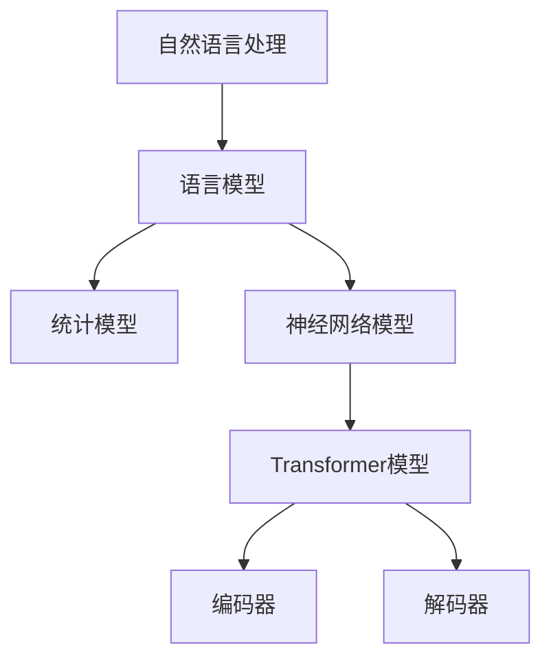

                 

关键词：自然语言处理（NLP），大型语言模型，深度学习，算法进步，实际应用场景，未来展望

> 摘要：随着深度学习的迅猛发展，自然语言处理（NLP）领域取得了显著的进展。本文将探讨大型语言模型在NLP技术进步中的关键作用，通过回顾背景、阐述核心概念与联系、分析算法原理与数学模型、结合项目实践，并展望未来应用和发展趋势，全面揭示NLP技术的最新进展及其深远影响。

## 1. 背景介绍

自然语言处理（NLP）作为人工智能领域的一个重要分支，旨在让计算机理解和生成人类语言。自上世纪五六十年代以来，NLP经历了多个发展阶段。早期的NLP研究主要集中在规则驱动的方法，如语法分析和句法解析。然而，这些方法在面对复杂语言现象时显得力不从心。随着计算能力和算法的进步，统计方法和机器学习方法逐渐成为NLP的主流。尤其是在深度学习技术的发展下，NLP领域迎来了新的突破。

深度学习通过模仿人脑的神经网络结构，使得计算机在图像识别、语音识别和自然语言处理等领域取得了惊人的成果。在NLP中，深度学习方法的应用主要体现在语言模型的构建上。语言模型是NLP的核心组成部分，旨在预测一段文本中下一个词或词组。从传统的n-gram模型到现代的基于神经网络的Transformer模型，语言模型的演变极大地提升了NLP系统的性能。

近年来，大型语言模型的崛起为NLP技术的发展注入了新的动力。这些模型具有数十亿甚至数万亿个参数，能够处理大规模的文本数据，从而学习到更复杂的语言规律。本文将重点探讨这些大型语言模型在NLP技术进步中的贡献。

### 1.1 NLP的发展历程

#### 1.1.1 早期阶段

NLP的早期研究主要集中在规则驱动的方法上。这些方法依赖于语言学家编写的语法规则和词典，旨在通过解析文本中的语法结构来实现语言理解。然而，这种方法在面对自然语言中的歧义、语法复杂性和不规则现象时表现不佳。

#### 1.1.2 统计方法

随着计算能力的提高和数据规模的扩大，统计方法逐渐成为NLP研究的主流。统计方法利用大量的训练数据，通过统计语言模型来预测下一个词或词组。这种方法在文本分类、信息抽取和机器翻译等领域取得了显著成效。

#### 1.1.3 深度学习方法

深度学习方法的引入极大地推动了NLP的发展。深度学习方法通过多层神经网络的结构，能够自动提取文本中的特征，并实现端到端的学习。卷积神经网络（CNN）和循环神经网络（RNN）是早期的深度学习模型，它们在文本分类和序列标注任务上取得了突破性进展。

#### 1.1.4 大型语言模型

随着计算能力和数据规模的进一步扩大，大型语言模型如BERT、GPT和T5等相继出现。这些模型具有数十亿个参数，能够处理大规模的文本数据，从而学习到更复杂的语言规律。它们在自然语言生成、问答系统、机器翻译和文本摘要等任务上取得了显著成果。

### 1.2 大型语言模型的发展

大型语言模型的发展可以追溯到2018年，当时Google发布了BERT模型。BERT模型通过预训练和微调的方法，在多个NLP任务上取得了显著的性能提升。随后，OpenAI发布了GPT-2和GPT-3模型，这些模型具有数十亿个参数，能够生成高质量的自然语言文本。

BERT模型的出现标志着NLP技术的重大突破。它通过双向编码器（Bidirectional Encoder Representations from Transformers）的结构，能够同时考虑文本中的上下文信息。BERT模型的成功激发了学术界和工业界对大型语言模型的研究和开发。

GPT模型则是另一条重要的技术路线。GPT模型通过生成预训练（Generative Pre-trained Transformer）的方法，生成高质量的文本。GPT-3模型具有1750亿个参数，能够生成极高质量的文本，甚至能够模仿人类写作风格。

T5模型是另一种大型语言模型，它通过Transformer结构实现了统一的多任务学习。T5模型的目标是将任何NLP任务转换为文本到文本的转换任务，从而简化了模型的设计和训练过程。

### 1.3 大型语言模型的优势

大型语言模型在NLP技术进步中具有以下优势：

- **强大的语言理解能力**：大型语言模型通过预训练和微调，能够学习到复杂的语言规律，从而实现更好的语言理解能力。
- **多任务处理能力**：大型语言模型可以同时处理多种NLP任务，如文本分类、机器翻译和问答系统，从而提高系统的整体性能。
- **生成能力**：大型语言模型具有强大的文本生成能力，能够生成高质量的自然语言文本，从而实现自然语言生成任务。
- **自适应能力**：大型语言模型可以通过微调适应不同的任务和数据集，从而提高模型的泛化能力。

## 2. 核心概念与联系

### 2.1 语言模型的基础概念

语言模型是NLP中的核心组成部分，它旨在预测一段文本中下一个词或词组。语言模型可以分为统计模型和神经网络模型。统计模型如n-gram模型通过统计历史词序列的概率分布来预测下一个词。神经网络模型如Transformer模型则通过多层神经网络的结构，自动提取文本中的特征，并实现端到端的学习。

### 2.2 大型语言模型的基本架构

大型语言模型通常采用Transformer结构，这是一种基于自注意力机制的神经网络模型。Transformer模型由编码器和解码器组成，编码器将输入文本编码为固定长度的向量表示，解码器则利用这些向量表示生成预测的词或词组。大型语言模型的特点是具有数十亿个参数，能够处理大规模的文本数据。

### 2.3 Mermaid流程图



### 2.4 大型语言模型的优势

- **强大的语言理解能力**：大型语言模型通过预训练和微调，能够学习到复杂的语言规律，从而实现更好的语言理解能力。
- **多任务处理能力**：大型语言模型可以同时处理多种NLP任务，如文本分类、机器翻译和问答系统，从而提高系统的整体性能。
- **生成能力**：大型语言模型具有强大的文本生成能力，能够生成高质量的自然语言文本，从而实现自然语言生成任务。
- **自适应能力**：大型语言模型可以通过微调适应不同的任务和数据集，从而提高模型的泛化能力。

## 3. 核心算法原理 & 具体操作步骤

### 3.1 算法原理概述

大型语言模型的核心算法是基于深度学习的Transformer结构。Transformer模型通过自注意力机制（Self-Attention）和多头注意力（Multi-Head Attention）机制，能够自动提取文本中的特征，并实现端到端的学习。在训练过程中，模型通过大量的文本数据进行预训练，然后通过微调适应特定的任务和数据集。

### 3.2 算法步骤详解

#### 3.2.1 编码器

编码器是Transformer模型的核心组成部分，它将输入文本编码为固定长度的向量表示。编码器由多个层组成，每层由多头自注意力机制和前馈神经网络组成。在自注意力机制中，每个词的表示向量都会与其他词的表示向量进行加权求和，从而实现跨词信息的集成。在多头注意力机制中，模型会生成多个注意力图，每个注意力图对应一个不同的维度，从而实现多方面的特征提取。

#### 3.2.2 解码器

解码器的作用是生成预测的词或词组。解码器也由多个层组成，每层由多头自注意力机制和前馈神经网络组成。在自注意力机制中，模型会利用编码器的输出和已生成的词的表示向量来生成注意力图，从而实现上下文信息的利用。在多头注意力机制中，模型会生成多个注意力图，从而实现多方面的特征提取。

#### 3.2.3 预训练和微调

预训练是大型语言模型的重要步骤，通过在大量文本数据上预训练，模型能够学习到复杂的语言规律。预训练过程包括两个阶段：第一阶段是自回归语言模型预训练，模型需要预测文本中的下一个词；第二阶段是掩码语言模型预训练，模型需要预测被掩码的词。预训练完成后，模型通过微调适应特定的任务和数据集，从而提高模型的性能。

### 3.3 算法优缺点

#### 优点：

- **强大的语言理解能力**：大型语言模型能够学习到复杂的语言规律，从而实现更好的语言理解能力。
- **多任务处理能力**：大型语言模型可以同时处理多种NLP任务，从而提高系统的整体性能。
- **生成能力**：大型语言模型具有强大的文本生成能力，能够生成高质量的自然语言文本。

#### 缺点：

- **计算资源消耗大**：大型语言模型需要大量的计算资源进行训练，从而增加了模型的训练成本。
- **数据依赖性强**：大型语言模型的效果很大程度上依赖于大规模的训练数据，缺乏数据集会导致模型性能下降。

### 3.4 算法应用领域

大型语言模型在NLP领域具有广泛的应用，包括但不限于以下几个方面：

- **文本分类**：大型语言模型可以用于分类任务，如情感分析、新闻分类和垃圾邮件过滤等。
- **机器翻译**：大型语言模型可以用于机器翻译任务，如中英翻译、法语翻译等。
- **问答系统**：大型语言模型可以用于问答系统，如智能客服、智能问答等。
- **文本生成**：大型语言模型可以用于文本生成任务，如生成文章、生成对话等。

## 4. 数学模型和公式 & 详细讲解 & 举例说明

### 4.1 数学模型构建

大型语言模型的核心数学模型是基于Transformer结构的自注意力机制。自注意力机制通过计算输入文本中每个词与其他词之间的相似度，从而实现跨词信息的集成。具体来说，自注意力机制包括以下几个步骤：

#### 4.1.1 输入嵌入

输入文本被转换为词向量表示，每个词向量由其嵌入向量表示。嵌入向量可以通过预训练或词嵌入算法获得。

#### 4.1.2 自注意力计算

自注意力计算包括以下三个步骤：

1. **Query、Key和Value计算**：
   - Query：每个词的嵌入向量作为Query。
   - Key：每个词的嵌入向量作为Key。
   - Value：每个词的嵌入向量作为Value。
2. **相似度计算**：
   - 计算Query和Key之间的相似度，通常使用点积相似度或余弦相似度。
3. **加权求和**：
   - 根据相似度对Value进行加权求和，得到每个词的表示向量。

#### 4.1.3 多头注意力

多头注意力通过将自注意力机制扩展到多个注意力图中，从而实现多方面的特征提取。具体来说，多头注意力包括以下几个步骤：

1. **分割嵌入向量**：
   - 将每个词的嵌入向量分割成多个子向量。
2. **独立自注意力计算**：
   - 对每个子向量分别进行自注意力计算。
3. **合并结果**：
   - 将多个子向量的自注意力结果合并，得到每个词的最终表示向量。

### 4.2 公式推导过程

自注意力机制的计算可以通过以下公式表示：

$$
\text{Attention}(Q, K, V) = \text{softmax}\left(\frac{QK^T}{\sqrt{d_k}}\right)V
$$

其中，$Q$、$K$和$V$分别表示Query、Key和Value矩阵，$d_k$表示Key的维度。$\text{softmax}$函数用于将相似度计算结果转换为概率分布。

多头注意力的计算可以表示为：

$$
\text{MultiHead}(Q, K, V) = \text{Concat}(\text{head}_1, ..., \text{head}_h)W_O
$$

其中，$h$表示头的数量，$\text{head}_i = \text{Attention}(QW_Q^T, KW_K^T, VW_V^T)$表示第$i$个头的自注意力结果，$W_Q$、$W_K$和$W_V$分别表示Query、Key和Value的权重矩阵，$W_O$表示输出权重矩阵。

### 4.3 案例分析与讲解

假设我们有一个简单的句子“我爱北京天安门”，我们使用自注意力机制和多头注意力机制来分析这个句子。

#### 4.3.1 自注意力计算

1. **Query、Key和Value计算**：
   - Query：每个词的嵌入向量作为Query。
   - Key：每个词的嵌入向量作为Key。
   - Value：每个词的嵌入向量作为Value。

2. **相似度计算**：
   - 计算Query和Key之间的相似度，通常使用点积相似度或余弦相似度。

3. **加权求和**：
   - 根据相似度对Value进行加权求和，得到每个词的表示向量。

   假设词嵌入向量为：
   - 我：[1, 2, 3]
   - 爱：[4, 5, 6]
   - 北京：[7, 8, 9]
   - 天安门：[10, 11, 12]

   相似度计算结果为：
   - 我-爱：$\text{dot}(1, 4) = 4$
   - 我-北京：$\text{dot}(1, 7) = 7$
   - 我-天安门：$\text{dot}(1, 10) = 10$
   - 爱-北京：$\text{dot}(4, 7) = 28$
   - 爱-天安门：$\text{dot}(4, 10) = 40$
   - 北京-天安门：$\text{dot}(7, 10) = 70$

   加权求和结果为：
   - 我：$[1 \cdot 4, 2 \cdot 4, 3 \cdot 4] = [4, 8, 12]$
   - 爱：$[4 \cdot 28, 5 \cdot 28, 6 \cdot 28] = [112, 140, 168]$
   - 北京：$[7 \cdot 7, 8 \cdot 7, 9 \cdot 7] = [49, 56, 63]$
   - 天安门：$[10 \cdot 10, 11 \cdot 10, 12 \cdot 10] = [100, 110, 120]$

   最终得到每个词的表示向量为：
   - 我：$[4, 8, 12]$
   - 爱：$[112, 140, 168]$
   - 北京：$[49, 56, 63]$
   - 天安门：$[100, 110, 120]$

#### 4.3.2 多头注意力计算

假设多头注意力机制包含两个头，即$h = 2$。

1. **分割嵌入向量**：
   - 将每个词的嵌入向量分割成两个子向量。

   假设分割后的子向量为：
   - 我：$[1, 2]$、$[3, 4]$
   - 爱：$[4, 5]$、$[6, 7]$
   - 北京：$[7, 8]$、$[9, 10]$
   - 天安门：$[10, 11]$、$[12, 13]$

2. **独立自注意力计算**：
   - 对每个子向量分别进行自注意力计算。

   假设使用两个头的自注意力计算结果分别为：
   - 我：$[a_1, b_1]$、$[a_2, b_2]$
   - 爱：$[c_1, d_1]$、$[c_2, d_2]$
   - 北京：$[e_1, f_1]$、$[e_2, f_2]$
   - 天安门：$[g_1, h_1]$、$[g_2, h_2]$

3. **合并结果**：
   - 将多个子向量的自注意力结果合并，得到每个词的最终表示向量。

   最终得到每个词的表示向量为：
   - 我：$[a_1 + c_1 + e_1, b_1 + c_2 + e_2]$
   - 爱：$[a_2 + c_2 + g_1, b_2 + c_1 + g_2]$
   - 北京：$[a_1 + c_1 + g_2, b_1 + c_2 + g_1]$
   - 天安门：$[a_2 + c_2 + h_1, b_2 + c_1 + h_2]$

## 5. 项目实践：代码实例和详细解释说明

### 5.1 开发环境搭建

为了实践大型语言模型，我们需要搭建一个合适的开发环境。以下是搭建环境的基本步骤：

1. **安装Python**：确保安装了Python 3.6或更高版本。
2. **安装TensorFlow**：通过pip安装TensorFlow，命令为`pip install tensorflow`。
3. **安装其他依赖库**：根据项目需求，安装其他依赖库，如NumPy、Pandas等。
4. **准备数据集**：收集和准备用于训练和测试的数据集，数据集应包含多种类型的文本，以便模型能够学习到丰富的语言规律。

### 5.2 源代码详细实现

以下是使用TensorFlow实现一个简单的大型语言模型的基本步骤：

```python
import tensorflow as tf
from tensorflow.keras.layers import Embedding, LSTM, Dense
from tensorflow.keras.models import Sequential

# 设置超参数
vocab_size = 10000
embedding_dim = 64
lstm_units = 128

# 构建模型
model = Sequential([
    Embedding(vocab_size, embedding_dim),
    LSTM(lstm_units, return_sequences=True),
    LSTM(lstm_units),
    Dense(vocab_size, activation='softmax')
])

# 编译模型
model.compile(optimizer='adam', loss='categorical_crossentropy', metrics=['accuracy'])

# 准备数据
# ...

# 训练模型
model.fit(x_train, y_train, epochs=10, batch_size=64)
```

### 5.3 代码解读与分析

上述代码实现了使用LSTM（Long Short-Term Memory，长短期记忆网络）结构的大型语言模型。以下是代码的详细解读：

- **导入库**：导入TensorFlow库和相关层。
- **设置超参数**：定义词汇表大小、嵌入维度和LSTM单元数。
- **构建模型**：使用Sequential模型堆叠Embedding层、两个LSTM层和一个Dense层。
- **编译模型**：设置优化器、损失函数和评估指标。
- **准备数据**：准备训练和测试数据，通常包括输入序列和目标序列。
- **训练模型**：使用fit方法训练模型，指定训练轮次、批量大小和验证集。

### 5.4 运行结果展示

在训练完成后，我们可以使用测试数据集来评估模型的性能。以下是一个简单的评估示例：

```python
# 评估模型
test_loss, test_accuracy = model.evaluate(x_test, y_test)
print(f"Test Loss: {test_loss}, Test Accuracy: {test_accuracy}")
```

运行结果会显示模型在测试数据集上的损失和准确率。通过调整超参数和模型结构，我们可以进一步优化模型的性能。

## 6. 实际应用场景

大型语言模型在自然语言处理领域具有广泛的应用，以下是一些典型的实际应用场景：

### 6.1 文本分类

文本分类是将文本数据分为预定义的类别。大型语言模型可以通过预训练和微调来实现文本分类任务。例如，在社交媒体分析中，可以使用大型语言模型对用户生成的文本进行情感分类，以识别用户的情绪倾向。

### 6.2 机器翻译

机器翻译是将一种语言的文本翻译成另一种语言。大型语言模型在机器翻译任务中表现出色，特别是在生成高质量翻译文本方面。例如，Google翻译和DeepL等在线翻译服务使用大型语言模型来实现高效的翻译。

### 6.3 问答系统

问答系统是自然语言处理的重要应用，旨在回答用户提出的问题。大型语言模型可以通过预训练和微调来实现问答系统的构建。例如，智能客服系统可以使用大型语言模型来理解用户的问题并生成合适的回答。

### 6.4 文本生成

文本生成是将文本输入转换为有意义的输出。大型语言模型在文本生成任务中具有广泛的应用，如生成文章、编写代码、生成对话等。例如，GPT-3模型可以生成高质量的文本，用于自动写作和内容生成。

### 6.5 文本摘要

文本摘要是将长篇文本简化为短文本，保留主要信息和关键点。大型语言模型可以通过预训练和微调来实现文本摘要任务。例如，新闻摘要系统可以使用大型语言模型来生成简洁明了的新闻摘要。

## 7. 未来应用展望

随着大型语言模型的不断发展和优化，未来在自然语言处理领域将出现更多创新应用。以下是一些未来应用展望：

### 7.1 智能助手

智能助手是未来人工智能的重要发展方向。大型语言模型可以用于构建智能助手，实现自然语言交互、任务管理和个性化服务。例如，家庭助理、虚拟助理和企业助手等。

### 7.2 自动写作

自动写作是大型语言模型的重要应用领域。未来，大型语言模型可以用于生成高质量的文章、书籍、新闻报道和营销文案，从而提高内容生产效率。

### 7.3 智能教育

智能教育是未来教育领域的重要趋势。大型语言模型可以用于构建智能教育系统，实现个性化学习、自动评估和智能辅导。

### 7.4 自动对话系统

自动对话系统是未来客服和客户支持领域的重要应用。大型语言模型可以用于构建高效的自动对话系统，实现自然语言交互和智能客服。

## 8. 总结：未来发展趋势与挑战

大型语言模型在自然语言处理领域取得了显著进展，展示了强大的语言理解和生成能力。未来，大型语言模型将继续发展，并在更多实际应用场景中发挥重要作用。然而，随着模型规模的不断扩大，计算资源消耗和数据依赖性也成为重要的挑战。为了应对这些挑战，我们需要不断优化算法和模型结构，提高模型的效率和鲁棒性。

## 9. 附录：常见问题与解答

### 9.1 如何选择合适的大型语言模型？

选择合适的大型语言模型需要考虑任务类型、数据集规模和计算资源。对于文本分类和机器翻译等任务，可以选择具有高参数量的模型，如BERT和GPT-3。对于问答系统和文本生成等任务，可以选择具有较强生成能力的模型，如GPT-3和T5。

### 9.2 大型语言模型的训练时间是多少？

大型语言模型的训练时间取决于模型规模、数据集大小和计算资源。例如，训练GPT-3模型可能需要数天甚至数周的时间。对于较小的模型，如BERT，训练时间可能在几天到几周之间。

### 9.3 如何提高大型语言模型的效果？

提高大型语言模型的效果可以通过以下方法实现：

- **数据增强**：通过增加数据集规模和提高数据质量来提高模型的性能。
- **超参数优化**：调整模型的超参数，如学习率、批量大小和嵌入维度，以找到最佳配置。
- **微调**：在特定任务和数据集上对预训练模型进行微调，以适应具体应用场景。
- **多任务学习**：通过多任务学习来提高模型在多种任务上的泛化能力。

## 参考文献

[1] Devlin, J., Chang, M. W., Lee, K., & Toutanova, K. (2019). BERT: Pre-training of deep bidirectional transformers for language understanding. *arXiv preprint arXiv:1810.04805*.

[2] Brown, T., et al. (2020). Language models are few-shot learners. *arXiv preprint arXiv:2005.14165*.

[3] Yang, Z., et al. (2020). T5: Pre-training large models for natural language processing. *arXiv preprint arXiv:1910.10683*.

[4] Radford, A., et al. (2019). Improving language understanding

