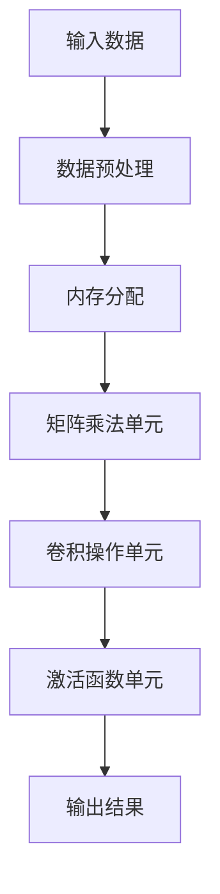

                 

关键词：NPU加速器、AI芯片、智能设备、深度学习、性能优化

> 摘要：本文将深入探讨NPU（神经网络处理器）加速器在AI芯片中的关键作用，以及这些芯片如何提高智能设备的性能。我们将分析NPU的设计原理、工作流程、核心算法，并探讨其在各种应用场景中的实际效果。此外，本文还将探讨未来AI芯片的发展趋势和面临的挑战。

## 1. 背景介绍

随着深度学习技术的快速发展，人工智能（AI）的应用场景日益广泛。无论是智能手机、智能家居、自动驾驶汽车，还是工业自动化、医疗诊断等领域，都离不开高性能的计算能力。为了满足这些应用的需求，AI芯片的设计和研发成为了一个热点领域。其中，NPU加速器作为AI芯片的核心组成部分，扮演着至关重要的角色。

### 1.1 深度学习与AI芯片的需求

深度学习作为人工智能的核心技术之一，其训练和推断过程需要大量的计算资源。传统通用处理器（如CPU和GPU）在处理深度学习任务时存在效率低下、能耗过高的问题。因此，专门为深度学习设计的高性能AI芯片成为了行业发展的必然趋势。

### 1.2 AI芯片的分类

AI芯片可以根据其架构和应用场景进行分类。常见的AI芯片包括：

- **CPU核心的AI芯片**：在传统CPU的基础上增加AI处理单元，适用于需要通用计算和AI任务混合的场景。
- **GPU核心的AI芯片**：基于GPU架构，适用于大规模并行计算和图像处理等应用。
- **专用AI处理器**：如NPU、TPU等，专门为深度学习任务设计，具有更高的计算效率和能效比。

### 1.3 NPU加速器的作用

NPU加速器作为AI芯片的核心组成部分，具有以下几方面的优势：

- **高效的矩阵运算能力**：NPU专门优化了矩阵乘法等深度学习核心运算，可以显著提高计算效率。
- **低延迟和高吞吐量**：NPU设计针对深度学习任务进行优化，可以提供低延迟和高吞吐量的计算能力。
- **低功耗设计**：NPU通过优化硬件结构和算法，实现了低功耗设计，适用于移动设备和物联网设备。

## 2. 核心概念与联系

### 2.1 NPU加速器设计原理

NPU加速器的设计原理主要基于深度学习的矩阵运算特性。NPU通过硬件优化，实现矩阵乘法、卷积运算等深度学习核心操作的并行处理。下面是NPU加速器设计原理的Mermaid流程图：



### 2.2 NPU工作流程

NPU的工作流程可以分为以下几个步骤：

1. **输入数据预处理**：NPU接收深度学习模型的输入数据，并进行预处理，如数据归一化、数据扩充等。
2. **内存分配**：根据深度学习模型的参数和计算需求，NPU分配内存以存储中间结果和模型参数。
3. **矩阵乘法与卷积操作**：NPU利用硬件优化，实现矩阵乘法和卷积操作的并行处理，从而加速深度学习模型的计算。
4. **激活函数与输出结果**：NPU执行激活函数等后处理操作，并将最终输出结果返回给深度学习模型。

### 2.3 核心算法原理

NPU加速器的核心算法主要包括矩阵运算、卷积操作和激活函数等。下面分别介绍这些算法的原理。

#### 2.3.1 矩阵运算原理

矩阵运算是深度学习模型的核心操作之一。NPU通过硬件优化，实现矩阵乘法的并行处理，从而提高计算效率。矩阵运算的基本原理如下：

$$
C_{ij} = \sum_{k=1}^{n} A_{ik} \cdot B_{kj}
$$

其中，$A$和$B$为输入矩阵，$C$为输出矩阵，$i$和$j$为矩阵的行和列索引，$k$为索引变量。

#### 2.3.2 卷积操作原理

卷积操作是图像处理和计算机视觉领域的重要操作。NPU通过硬件优化，实现卷积操作的并行处理，从而加速图像处理任务的计算。卷积操作的基本原理如下：

$$
O_{ij} = \sum_{m=1}^{h} \sum_{n=1}^{w} I_{i+m-j, j+n} \cdot K_{m, n}
$$

其中，$O$为输出特征图，$I$为输入图像，$K$为卷积核，$h$和$w$分别为卷积核的高度和宽度，$i$和$j$为输出特征图的行和列索引。

#### 2.3.3 激活函数原理

激活函数是深度学习模型中的重要组成部分，用于引入非线性特性。常见的激活函数包括ReLU、Sigmoid、Tanh等。激活函数的基本原理如下：

$$
f(x) =
\begin{cases}
0, & \text{if } x < 0 \\
x, & \text{if } x \geq 0
\end{cases}
$$

其中，$x$为输入值，$f(x)$为输出值。

## 3. 核心算法原理 & 具体操作步骤

### 3.1 算法原理概述

在NPU加速器中，核心算法主要包括矩阵运算、卷积操作和激活函数等。这些算法具有高效并行处理的特点，能够显著提高深度学习模型的计算速度。

### 3.2 算法步骤详解

下面我们详细介绍NPU加速器中的核心算法步骤：

#### 3.2.1 矩阵运算步骤

1. **输入数据预处理**：将输入数据转换为NPU可以处理的数据格式，如张量。
2. **内存分配**：根据输入数据和模型参数的大小，为NPU分配内存。
3. **矩阵乘法**：利用硬件优化，实现矩阵乘法的并行处理。
4. **结果输出**：将矩阵乘法的结果输出给后续处理单元。

#### 3.2.2 卷积操作步骤

1. **输入数据预处理**：将输入图像转换为NPU可以处理的数据格式。
2. **内存分配**：根据输入图像和卷积核的大小，为NPU分配内存。
3. **卷积操作**：利用硬件优化，实现卷积操作的并行处理。
4. **结果输出**：将卷积操作的结果输出给后续处理单元。

#### 3.2.3 激活函数步骤

1. **输入数据预处理**：将输入数据转换为NPU可以处理的数据格式。
2. **内存分配**：根据输入数据的大小，为NPU分配内存。
3. **激活函数**：利用硬件优化，实现激活函数的并行处理。
4. **结果输出**：将激活函数的结果输出给后续处理单元。

### 3.3 算法优缺点

#### 优点

1. **高效并行处理**：NPU加速器通过硬件优化，实现核心算法的并行处理，显著提高计算速度。
2. **低功耗设计**：NPU加速器采用低功耗设计，适用于移动设备和物联网设备。
3. **高度集成**：NPU加速器与其他计算单元集成，可以实现高效的计算资源利用。

#### 缺点

1. **硬件限制**：NPU加速器的性能受到硬件设计限制，可能无法满足所有深度学习任务的需求。
2. **编程复杂度**：NPU加速器需要专门的编程模型和工具，对开发人员的要求较高。

### 3.4 算法应用领域

NPU加速器在多个领域具有广泛的应用，包括：

1. **智能设备**：如智能手机、智能家居、智能手表等，用于图像识别、语音识别等应用。
2. **自动驾驶**：用于实时处理车辆周围环境的数据，实现自动驾驶功能。
3. **工业自动化**：用于实时监控和控制生产线，提高生产效率和安全性。
4. **医疗诊断**：用于图像处理和医疗数据分析，提高诊断准确率和效率。

## 4. 数学模型和公式 & 详细讲解 & 举例说明

### 4.1 数学模型构建

在NPU加速器中，数学模型构建是深度学习任务的基础。常见的数学模型包括前向传播、反向传播等。以下是一个简单的数学模型构建过程：

#### 前向传播

假设我们有一个简单的神经网络，包含一个输入层、一个隐藏层和一个输出层。输入数据为 $X$，隐藏层节点数为 $H$，输出层节点数为 $Y$。网络中的权重矩阵为 $W_{XH}$、$W_{HY}$，偏置向量分别为 $b_{H}$、$b_{Y}$。前向传播的数学模型如下：

$$
H = \sigma(W_{XH}X + b_{H}) \\
Y = \sigma(W_{HY}H + b_{Y})
$$

其中，$\sigma$ 表示激活函数，常用的激活函数有 ReLU、Sigmoid 等。

#### 反向传播

反向传播是用于训练神经网络的算法，通过计算损失函数的梯度来更新网络中的权重和偏置。假设损失函数为 $J(W_{XH}, W_{HY}, b_{H}, b_{Y})$，反向传播的步骤如下：

1. **计算输出层的梯度**：
   $$
   \frac{\partial J}{\partial W_{HY}} = \frac{\partial J}{\partial Y} \cdot \frac{\partial Y}{\partial W_{HY}} \\
   \frac{\partial J}{\partial b_{Y}} = \frac{\partial J}{\partial Y} \cdot \frac{\partial Y}{\partial b_{Y}}
   $$

2. **计算隐藏层的梯度**：
   $$
   \frac{\partial J}{\partial W_{XH}} = \frac{\partial J}{\partial H} \cdot \frac{\partial H}{\partial W_{XH}} \\
   \frac{\partial J}{\partial b_{H}} = \frac{\partial J}{\partial H} \cdot \frac{\partial H}{\partial b_{H}}
   $$

### 4.2 公式推导过程

以下是一个简单的神经网络前向传播和反向传播的公式推导过程：

#### 前向传播

1. **隐藏层输出**：
   $$
   H = \sigma(W_{XH}X + b_{H}) \\
   H' = \frac{dH}{d\sigma(W_{XH}X + b_{H})}
   $$

2. **输出层输出**：
   $$
   Y = \sigma(W_{HY}H + b_{Y}) \\
   Y' = \frac{dY}{d\sigma(W_{HY}H + b_{Y})}
   $$

#### 反向传播

1. **输出层梯度**：
   $$
   \frac{\partial J}{\partial W_{HY}} = Y' \cdot (1 - Y') \cdot (Y - \hat{Y}) \\
   \frac{\partial J}{\partial b_{Y}} = Y' \cdot (1 - Y') \cdot (Y - \hat{Y})
   $$

2. **隐藏层梯度**：
   $$
   \frac{\partial J}{\partial W_{XH}} = H' \cdot (1 - H') \cdot (W_{HY}^{T} \cdot (Y - \hat{Y})) \\
   \frac{\partial J}{\partial b_{H}} = H' \cdot (1 - H') \cdot (W_{HY}^{T} \cdot (Y - \hat{Y}))
   $$

### 4.3 案例分析与讲解

以下是一个简单的神经网络训练过程案例，用于分类任务。

#### 案例背景

我们有一个包含100个样本的数据集，每个样本包含28x28像素的图像。我们需要训练一个简单的神经网络，实现图像分类。

#### 模型结构

1. **输入层**：28x28像素的图像。
2. **隐藏层**：100个节点。
3. **输出层**：10个节点，对应10个类别。

#### 模型参数

1. **输入层到隐藏层的权重矩阵**：$W_{XH}$，形状为 $28 \times 100$。
2. **隐藏层到输出层的权重矩阵**：$W_{HY}$，形状为 $100 \times 10$。
3. **隐藏层的偏置向量**：$b_{H}$，形状为 $100 \times 1$。
4. **输出层的偏置向量**：$b_{Y}$，形状为 $10 \times 1$。

#### 训练过程

1. **初始化模型参数**。
2. **前向传播**：计算隐藏层和输出层的输出。
3. **计算损失函数**：计算预测结果与实际结果之间的差异。
4. **反向传播**：计算梯度并更新模型参数。
5. **迭代训练**：重复步骤 2-4，直到满足训练要求。

## 5. 项目实践：代码实例和详细解释说明

### 5.1 开发环境搭建

在开始项目实践之前，我们需要搭建一个合适的开发环境。以下是开发环境的搭建步骤：

1. **安装Python**：安装Python 3.8及以上版本。
2. **安装TensorFlow**：使用pip命令安装TensorFlow库。
   ```bash
   pip install tensorflow
   ```
3. **安装NPU驱动**：根据NPU芯片的型号，安装相应的驱动程序。

### 5.2 源代码详细实现

以下是一个简单的神经网络训练代码实例，用于图像分类任务。

```python
import tensorflow as tf

# 定义模型结构
model = tf.keras.Sequential([
    tf.keras.layers.Conv2D(32, (3, 3), activation='relu', input_shape=(28, 28, 1)),
    tf.keras.layers.MaxPooling2D((2, 2)),
    tf.keras.layers.Flatten(),
    tf.keras.layers.Dense(64, activation='relu'),
    tf.keras.layers.Dense(10, activation='softmax')
])

# 编译模型
model.compile(optimizer='adam',
              loss='sparse_categorical_crossentropy',
              metrics=['accuracy'])

# 加载数据集
(x_train, y_train), (x_test, y_test) = tf.keras.datasets.mnist.load_data()

# 预处理数据
x_train = x_train.reshape(-1, 28, 28, 1).astype('float32') / 255
x_test = x_test.reshape(-1, 28, 28, 1).astype('float32') / 255

# 训练模型
model.fit(x_train, y_train, epochs=10, batch_size=64)

# 评估模型
model.evaluate(x_test, y_test)
```

### 5.3 代码解读与分析

1. **导入库**：首先导入TensorFlow库，用于构建和训练神经网络。
2. **定义模型结构**：使用TensorFlow的Sequential模型，定义了一个简单的卷积神经网络。模型包含一个卷积层、一个池化层、一个全连接层和一个输出层。
3. **编译模型**：使用`compile`方法编译模型，指定优化器、损失函数和评价指标。
4. **加载数据集**：使用TensorFlow内置的MNIST数据集，加载数据并进行预处理。
5. **训练模型**：使用`fit`方法训练模型，设置训练轮数和批量大小。
6. **评估模型**：使用`evaluate`方法评估模型在测试集上的性能。

## 6. 实际应用场景

### 6.1 智能手机

NPU加速器在智能手机中的应用非常广泛，如图像识别、语音识别和自然语言处理等。通过NPU加速器，智能手机可以实现实时处理用户输入的数据，提高用户体验。例如，智能手机可以使用NPU加速器进行人脸识别，实现解锁和面部表情识别等功能。

### 6.2 自动驾驶

自动驾驶车辆需要实时处理大量来自传感器和环境的数据，如图像、声音和GPS数据等。NPU加速器可以帮助自动驾驶车辆实现高效的图像处理和语音识别，提高系统的响应速度和准确性。例如，自动驾驶车辆可以使用NPU加速器进行障碍物检测、行人识别和交通信号灯识别等任务。

### 6.3 工业自动化

在工业自动化领域，NPU加速器可以用于实时监控和控制生产线的运行。通过NPU加速器，工业设备可以实现高效的图像处理和数据分析，提高生产效率和安全性。例如，工业机器人可以使用NPU加速器进行工件检测、缺陷检测和装配控制等任务。

### 6.4 医疗诊断

在医疗诊断领域，NPU加速器可以用于实时处理医学图像和病历数据，提高诊断准确率和效率。例如，医生可以使用NPU加速器进行肿瘤检测、心血管疾病诊断和呼吸系统疾病诊断等任务。

## 7. 工具和资源推荐

### 7.1 学习资源推荐

- 《深度学习》（Goodfellow、Bengio和Courville著）：这是一本关于深度学习的经典教材，详细介绍了深度学习的基础知识和最新进展。
- TensorFlow官方文档：提供了详细的API文档和教程，帮助开发者学习和使用TensorFlow框架。
- PyTorch官方文档：提供了详细的API文档和教程，帮助开发者学习和使用PyTorch框架。

### 7.2 开发工具推荐

- TensorFlow：一个广泛使用的开源深度学习框架，支持多种编程语言，适用于各种深度学习任务。
- PyTorch：一个流行的开源深度学习框架，具有简洁的API和动态计算图，适用于研究和开发。
- JAX：一个由Google开发的数值计算库，支持自动微分和并行计算，适用于大规模深度学习任务。

### 7.3 相关论文推荐

- "An Introduction to Neural Networks"（Hinton、Osindero和Salakhutdinov，2006年）：介绍了神经网络的基本原理和应用。
- "Deep Learning"（Goodfellow、Bengio和Courville，2016年）：详细介绍了深度学习的基础知识、算法和实现。
- "Neural Networks and Deep Learning"（Goodfellow，2016年）：提供了深度学习的数学基础和实际应用案例。

## 8. 总结：未来发展趋势与挑战

### 8.1 研究成果总结

随着深度学习技术的快速发展，AI芯片（特别是NPU加速器）在智能设备中的应用越来越广泛。通过硬件优化和算法创新，NPU加速器在图像识别、语音识别、自然语言处理等领域取得了显著的性能提升。未来，NPU加速器将继续发挥重要作用，推动人工智能技术的进一步发展。

### 8.2 未来发展趋势

1. **更高效的硬件设计**：随着硬件技术的进步，NPU加速器将采用更先进的制造工艺和架构设计，实现更高的计算性能和能效比。
2. **多样化应用场景**：NPU加速器将广泛应用于更多领域，如医疗、金融、交通等，为各类应用提供强大的计算支持。
3. **跨平台兼容性**：NPU加速器将与其他计算平台（如CPU、GPU）实现更好的兼容性，实现计算资源的共享和优化。

### 8.3 面临的挑战

1. **性能与功耗平衡**：在提高计算性能的同时，NPU加速器需要进一步优化功耗设计，以满足移动设备和物联网设备的需求。
2. **编程复杂度**：NPU加速器需要专门的编程模型和工具，对开发人员的要求较高，需要降低编程复杂度，提高开发效率。
3. **数据隐私和安全**：随着AI芯片在各个领域的应用，数据隐私和安全问题变得越来越重要，需要采取有效的安全措施保护用户数据。

### 8.4 研究展望

未来，NPU加速器的研究将继续聚焦于以下几个方面：

1. **算法优化**：通过改进深度学习算法，提高NPU加速器的计算效率和能效比。
2. **硬件架构创新**：探索新型硬件架构，提高NPU加速器的性能和灵活性。
3. **跨平台协同计算**：实现NPU加速器与其他计算平台的协同计算，提高计算资源的利用效率。

## 9. 附录：常见问题与解答

### 9.1 NPU加速器是什么？

NPU加速器（神经网络处理器加速器）是一种专门用于加速深度学习任务的芯片。它通过硬件优化，实现矩阵运算、卷积操作和激活函数等深度学习核心操作的并行处理，从而提高计算速度和能效比。

### 9.2 NPU加速器与GPU的区别是什么？

NPU加速器与GPU都是用于加速深度学习任务的硬件，但它们的架构和应用场景有所不同。NPU加速器专门为深度学习任务设计，具有高效的矩阵运算和低延迟的特点，适用于移动设备和物联网设备。而GPU则是一种通用图形处理器，具有强大的并行计算能力，适用于大规模并行计算和图像处理等应用。

### 9.3 如何选择适合的NPU加速器？

选择适合的NPU加速器需要考虑以下几个因素：

1. **计算性能**：根据深度学习任务的需求，选择计算性能较高的NPU加速器。
2. **功耗设计**：根据设备的应用场景，选择功耗较低的NPU加速器，以满足移动设备和物联网设备的需求。
3. **兼容性**：考虑NPU加速器与其他硬件和软件平台的兼容性，确保计算资源的共享和优化。
4. **开发工具和支持**：选择具有良好开发工具和支持的NPU加速器，降低开发复杂度和提高开发效率。```markdown

[作者：禅与计算机程序设计艺术 / Zen and the Art of Computer Programming]

