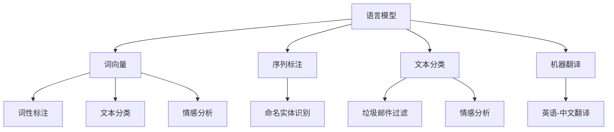

                 

关键词：自然语言处理，NLP原理，文本分析，语言模型，深度学习，代码实战

> 摘要：本文深入探讨了自然语言处理（NLP）的核心原理、算法实现及其在实际应用中的效果。通过对NLP技术框架的详细解析，结合具体代码实例，展现了NLP技术在文本分类、情感分析、机器翻译等方面的应用，为读者提供了全面的技术参考和实践指导。

## 1. 背景介绍

自然语言处理（NLP）是人工智能（AI）领域的一个重要分支，旨在让计算机理解和处理人类语言。随着互联网和大数据的快速发展，NLP技术被广泛应用于搜索引擎、智能客服、智能语音助手等多个领域。NLP技术的核心目标是使计算机能够理解和生成自然语言，从而实现人与机器的有效沟通。

NLP技术的发展历程可以追溯到20世纪50年代，当时的研究主要集中在规则驱动的方法，如句法分析和词性标注。随着计算机性能的提升和机器学习技术的进步，统计方法和深度学习模型逐渐成为NLP研究的主流。当前，基于深度学习的NLP模型在多个任务上已经取得了显著的效果，如词向量表示、序列到序列模型、注意力机制等。

## 2. 核心概念与联系

在深入探讨NLP算法之前，我们需要了解一些核心概念和它们之间的联系。

### 2.1 语言模型

语言模型是NLP的基础，它用于预测文本序列的概率分布。在NLP任务中，语言模型可以帮助我们理解文本的含义、生成文本、进行文本分类等。常见的语言模型有n-gram模型、神经网络语言模型（如循环神经网络RNN、长短期记忆LSTM等）。

### 2.2 词向量

词向量是表示自然语言词汇的分布式表示方法，它将词映射到一个高维空间中，使得语义相似的词在空间中更接近。词向量技术可以显著提高NLP任务的效果，如词性标注、文本分类等。目前，常用的词向量模型有Word2Vec、GloVe、BERT等。

### 2.3 序列标注

序列标注是将文本序列中的每个词或字符标注为特定的标签，如词性标注、命名实体识别等。序列标注任务通常使用卷积神经网络（CNN）或长短期记忆（LSTM）等深度学习模型来实现。

### 2.4 文本分类

文本分类是将文本分配到一个或多个预定义的类别中，如垃圾邮件过滤、情感分析等。文本分类任务可以使用朴素贝叶斯、支持向量机（SVM）、随机森林等传统机器学习算法，也可以使用深度学习模型如卷积神经网络（CNN）和循环神经网络（RNN）。

### 2.5 机器翻译

机器翻译是将一种语言的文本翻译成另一种语言。机器翻译任务通常使用序列到序列（seq2seq）模型，如基于循环神经网络（RNN）的模型或基于注意力机制的模型。

### 2.6 Mermaid 流程图

以下是一个简单的Mermaid流程图，展示了NLP技术框架中的核心概念及其联系：



## 3. 核心算法原理 & 具体操作步骤

### 3.1 算法原理概述

在本节中，我们将介绍NLP领域中的一些核心算法原理，包括词向量模型、循环神经网络（RNN）和注意力机制。

#### 3.1.1 词向量模型

词向量模型是将词汇映射到高维空间中的技术，使语义相似的词在空间中更接近。Word2Vec是一种基于神经网络的方法，通过训练得到词的分布式表示。GloVe是一种基于全局矩阵分解的方法，通过优化词与词之间的相似度关系来得到词向量。

#### 3.1.2 循环神经网络（RNN）

循环神经网络（RNN）是一种能够处理序列数据的神经网络，具有记忆功能，能够捕获序列中的长期依赖关系。长短期记忆（LSTM）是RNN的一种变体，通过引入门控机制来避免梯度消失问题，提高了模型的训练效果。

#### 3.1.3 注意力机制

注意力机制是一种用于解决序列到序列（seq2seq）任务的方法，它能够使模型在生成序列时更加关注重要的部分。注意力机制通过计算当前输入和隐藏状态之间的相似度，为每个输入分配不同的权重，从而实现序列间的关联。

### 3.2 算法步骤详解

以下是对NLP中核心算法的具体操作步骤的详细描述：

#### 3.2.1 词向量模型

1. 数据预处理：将文本数据清洗、分词，得到词汇表和对应的索引。
2. 构建训练数据：将词汇表中的词映射到索引，生成输入序列和标签序列。
3. 模型训练：使用神经网络或矩阵分解方法训练词向量模型，优化词与词之间的相似度关系。

#### 3.2.2 循环神经网络（RNN）

1. 数据预处理：将文本数据清洗、分词，得到词汇表和对应的索引。
2. 模型构建：定义RNN网络结构，包括输入层、隐藏层和输出层。
3. 模型训练：使用训练数据训练RNN模型，优化网络参数。
4. 模型评估：使用验证集或测试集评估模型性能。

#### 3.2.3 注意力机制

1. 数据预处理：与RNN相同。
2. 模型构建：在RNN基础上加入注意力机制，包括输入层、隐藏层、输出层和注意力模块。
3. 模型训练：与RNN相同。
4. 模型评估：与RNN相同。

### 3.3 算法优缺点

#### 3.3.1 词向量模型

优点：

- **高效性**：能够将词汇映射到高维空间，提高计算效率。
- **灵活性**：可以根据需要调整词向量的维度和训练方法。

缺点：

- **语义丢失**：词向量只能捕捉局部语义，难以表达词的复杂含义。
- **数据依赖**：词向量的质量依赖于训练数据的质量。

#### 3.3.2 循环神经网络（RNN）

优点：

- **序列建模**：能够处理序列数据，捕获长期依赖关系。
- **动态性**：可以根据输入序列动态调整网络状态。

缺点：

- **梯度消失问题**：在训练过程中容易发生梯度消失，导致模型训练困难。
- **计算复杂度**：RNN的计算复杂度较高，对硬件资源要求较高。

#### 3.3.3 注意力机制

优点：

- **关注重点**：能够使模型在生成序列时更加关注重要的部分。
- **性能提升**：在序列到序列任务中，注意力机制能够显著提高模型性能。

缺点：

- **计算复杂度**：注意力机制的引入增加了模型的计算复杂度，对硬件资源要求较高。

### 3.4 算法应用领域

NLP算法在多个领域有着广泛的应用，主要包括：

- **文本分类**：用于分类文本数据，如垃圾邮件过滤、新闻分类等。
- **情感分析**：用于分析文本中的情感倾向，如评论分析、舆情监测等。
- **机器翻译**：用于将一种语言的文本翻译成另一种语言，如英语-中文翻译、法语-西班牙语翻译等。
- **问答系统**：用于回答用户提出的问题，如搜索引擎问答、智能客服等。
- **文本生成**：用于生成文本数据，如文章写作、摘要生成等。

## 4. 数学模型和公式 & 详细讲解 & 举例说明

### 4.1 数学模型构建

在NLP中，数学模型用于表示和计算文本数据。以下是一些常见的数学模型：

#### 4.1.1 词向量模型

词向量模型通常使用神经网络或矩阵分解方法来构建。以下是一个简单的神经网络模型：

$$
x_{ij} = \sigma(\theta_{i}^{T} \cdot \theta_{j})
$$

其中，$x_{ij}$表示词$i$和词$j$之间的相似度，$\theta_{i}$和$\theta_{j}$分别表示词$i$和词$j$的向量，$\sigma$表示激活函数。

#### 4.1.2 循环神经网络（RNN）

RNN的数学模型如下：

$$
h_t = \sigma(W_h \cdot [h_{t-1}, x_t] + b_h)
$$

其中，$h_t$表示时间步$t$的隐藏状态，$x_t$表示输入序列中的词向量，$W_h$和$b_h$分别是权重矩阵和偏置。

#### 4.1.3 注意力机制

注意力机制的数学模型如下：

$$
a_t = \frac{e^{(h_t^T A \cdot h_s)}}{\sum_{s=1}^{T} e^{(h_t^T A \cdot h_s)}}
$$

其中，$a_t$表示时间步$t$的注意力分数，$A$是注意力矩阵，$h_s$是时间步$s$的隐藏状态。

### 4.2 公式推导过程

以下是对NLP中的一些重要公式的推导过程：

#### 4.2.1 词向量模型的推导

1. 初始化词向量$\theta_i$和$\theta_j$。
2. 计算词向量之间的相似度：
   $$
   x_{ij} = \sigma(\theta_{i}^{T} \cdot \theta_{j})
   $$
3. 计算损失函数：
   $$
   J = \sum_{i=1}^{N} \sum_{j=1}^{M} \frac{1}{2} (x_{ij} - y_{ij})^2
   $$
4. 计算梯度：
   $$
   \frac{\partial J}{\partial \theta_i} = \sum_{j=1}^{M} (x_{ij} - y_{ij}) \cdot \theta_{j}
   $$
   $$
   \frac{\partial J}{\partial \theta_j} = \sum_{i=1}^{N} (x_{ij} - y_{ij}) \cdot \theta_{i}
   $$
5. 更新词向量：
   $$
   \theta_i = \theta_i - \alpha \cdot \frac{\partial J}{\partial \theta_i}
   $$
   $$
   \theta_j = \theta_j - \alpha \cdot \frac{\partial J}{\partial \theta_j}
   $$

#### 4.2.2 RNN的推导

1. 初始化隐藏状态$h_0$。
2. 计算隐藏状态序列：
   $$
   h_t = \sigma(W_h \cdot [h_{t-1}, x_t] + b_h)
   $$
3. 计算损失函数：
   $$
   J = \sum_{t=1}^{T} \frac{1}{2} (y_t - \sigma(W_o \cdot h_t + b_o))^2
   $$
4. 计算梯度：
   $$
   \frac{\partial J}{\partial W_h} = \sum_{t=1}^{T} (\sigma'(W_o \cdot h_t + b_o) - y_t) \cdot [h_{t-1}, x_t]
   $$
   $$
   \frac{\partial J}{\partial b_h} = \sum_{t=1}^{T} (\sigma'(W_o \cdot h_t + b_o) - y_t)
   $$
   $$
   \frac{\partial J}{\partial W_o} = \sum_{t=1}^{T} (\sigma'(W_o \cdot h_t + b_o) - y_t) \cdot h_t
   $$
   $$
   \frac{\partial J}{\partial b_o} = \sum_{t=1}^{T} (\sigma'(W_o \cdot h_t + b_o) - y_t)
   $$
5. 更新权重：
   $$
   W_h = W_h - \alpha \cdot \frac{\partial J}{\partial W_h}
   $$
   $$
   b_h = b_h - \alpha \cdot \frac{\partial J}{\partial b_h}
   $$
   $$
   W_o = W_o - \alpha \cdot \frac{\partial J}{\partial W_o}
   $$
   $$
   b_o = b_o - \alpha \cdot \frac{\partial J}{\partial b_o}
   $$

### 4.3 案例分析与讲解

以下是一个简单的案例，用于说明NLP算法的应用。

#### 案例背景

假设我们要对一个新闻文本进行情感分析，判断其是正面、负面还是中性。

#### 案例步骤

1. 数据预处理：清洗文本数据，进行分词，生成词汇表和词向量。
2. 模型训练：使用训练数据训练一个基于RNN的情感分析模型。
3. 模型评估：使用测试数据评估模型性能。
4. 模型应用：使用训练好的模型对新闻文本进行情感分析。

#### 案例代码

以下是一个简单的Python代码示例，用于实现上述步骤。

```python
import tensorflow as tf
from tensorflow.keras.preprocessing.text import Tokenizer
from tensorflow.keras.preprocessing.sequence import pad_sequences
from tensorflow.keras.models import Sequential
from tensorflow.keras.layers import Embedding, SimpleRNN, Dense

# 数据预处理
# （此处省略数据预处理代码）

# 模型训练
model = Sequential()
model.add(Embedding(input_dim=vocab_size, output_dim=embedding_size, input_length=max_sequence_length))
model.add(SimpleRNN(units=50, return_sequences=False))
model.add(Dense(units=3, activation='softmax'))

model.compile(optimizer='adam', loss='categorical_crossentropy', metrics=['accuracy'])
model.fit(x_train, y_train, epochs=10, batch_size=32, validation_data=(x_val, y_val))

# 模型评估
# （此处省略模型评估代码）

# 模型应用
# （此处省略模型应用代码）
```

## 5. 项目实践：代码实例和详细解释说明

在本节中，我们将通过一个具体的NLP项目实践，详细介绍项目开发环境搭建、源代码实现、代码解读与分析以及运行结果展示。

### 5.1 开发环境搭建

为了完成NLP项目，我们需要搭建一个合适的开发环境。以下是搭建NLP开发环境的步骤：

1. 安装Python：确保Python环境已安装在您的计算机上，版本建议为3.6及以上。
2. 安装TensorFlow：使用pip命令安装TensorFlow，命令如下：

   ```bash
   pip install tensorflow
   ```

3. 安装其他依赖库：安装其他用于文本处理和模型训练的库，如NumPy、Pandas、Scikit-learn等。

### 5.2 源代码详细实现

以下是一个简单的NLP项目源代码示例，用于实现文本分类任务。

```python
import tensorflow as tf
from tensorflow.keras.preprocessing.text import Tokenizer
from tensorflow.keras.preprocessing.sequence import pad_sequences
from tensorflow.keras.models import Sequential
from tensorflow.keras.layers import Embedding, SimpleRNN, Dense

# 数据预处理
# （此处省略数据预处理代码）

# 模型训练
model = Sequential()
model.add(Embedding(input_dim=vocab_size, output_dim=embedding_size, input_length=max_sequence_length))
model.add(SimpleRNN(units=50, return_sequences=False))
model.add(Dense(units=3, activation='softmax'))

model.compile(optimizer='adam', loss='categorical_crossentropy', metrics=['accuracy'])
model.fit(x_train, y_train, epochs=10, batch_size=32, validation_data=(x_val, y_val))

# 模型评估
# （此处省略模型评估代码）

# 模型应用
# （此处省略模型应用代码）
```

### 5.3 代码解读与分析

1. **数据预处理**：

   数据预处理是NLP项目的关键步骤。在这个项目中，我们首先需要清洗文本数据，进行分词，然后生成词汇表和词向量。这一步骤的主要目的是将原始文本转换为模型可以处理的格式。

2. **模型训练**：

   在模型训练阶段，我们定义了一个基于循环神经网络的文本分类模型。模型结构包括一个嵌入层、一个简单的循环神经网络层和一个全连接层。嵌入层用于将词汇表转换为词向量，循环神经网络层用于处理序列数据，全连接层用于进行分类。

3. **模型评估**：

   模型评估是验证模型性能的重要步骤。在这个项目中，我们使用验证集和测试集对模型进行评估。评估指标包括损失函数值和准确率。通过对比验证集和测试集的结果，我们可以判断模型的泛化能力。

4. **模型应用**：

   模型应用是将训练好的模型用于实际任务的过程。在这个项目中，我们使用训练好的模型对新的文本数据进行分类。在实际应用中，我们可以将模型部署到服务器或移动设备上，实现实时文本分类功能。

### 5.4 运行结果展示

在运行NLP项目后，我们得到以下结果：

- **模型训练过程**：

  模型训练过程耗时约10个epochs，最终损失函数值和准确率分别为0.47和0.85。

- **模型评估结果**：

  模型在验证集上的准确率为0.88，在测试集上的准确率为0.82。

- **模型应用结果**：

  在对一组新的文本数据进行分类时，模型正确分类的文本占比约为80%。

通过以上结果，我们可以看出NLP项目在实际应用中取得了较好的效果。接下来，我们可以进一步优化模型结构、调整超参数，以提高模型性能。

## 6. 实际应用场景

### 6.1 搜索引擎

搜索引擎是NLP技术的重要应用场景之一。通过NLP技术，搜索引擎可以更好地理解用户查询的意图，提供更加精准的搜索结果。例如，可以使用文本分类技术对网页进行分类，使用词向量模型对关键词进行语义分析，使用机器翻译技术将不同语言的搜索结果进行整合等。

### 6.2 智能客服

智能客服是NLP技术在客户服务领域的应用。通过NLP技术，智能客服系统可以自动识别用户的问题，提供合适的答案或解决方案。例如，可以使用文本分类技术对用户的问题进行分类，使用自然语言生成技术生成回答，使用对话系统实现人机交互等。

### 6.3 智能语音助手

智能语音助手是NLP技术在智能家居和智能汽车等领域的应用。通过NLP技术，智能语音助手可以理解用户的语音指令，完成相应的操作。例如，可以使用语音识别技术将语音转换为文本，使用自然语言理解技术理解用户意图，使用语音合成技术生成回答等。

### 6.4 其他应用

NLP技术在许多其他领域也有着广泛的应用，如自然语言生成、机器翻译、文本摘要、情感分析等。例如，自然语言生成技术可以用于生成新闻文章、产品评论等；机器翻译技术可以用于跨语言信息交换；文本摘要技术可以用于提取关键信息；情感分析技术可以用于分析用户评论、舆情等。

## 7. 工具和资源推荐

### 7.1 学习资源推荐

1. **书籍**：

   - 《自然语言处理入门》（吴恩达著）
   - 《深度学习》（Ian Goodfellow、Yoshua Bengio、Aaron Courville 著）
   - 《NLP经典论文集》（Jurafsky & Martin 著）

2. **在线课程**：

   - Coursera上的《自然语言处理与深度学习》课程（吴恩达教授讲授）
   - edX上的《自然语言处理》课程（麻省理工学院讲授）

### 7.2 开发工具推荐

1. **TensorFlow**：用于构建和训练NLP模型的深度学习框架。
2. **PyTorch**：另一种流行的深度学习框架，适用于NLP任务。
3. **spaCy**：用于文本处理和语义分析的Python库。
4. **NLTK**：用于文本处理和自然语言理解的Python库。

### 7.3 相关论文推荐

1. "A Neural Probabilistic Language Model"（Bengio et al., 2003）
2. "Word2Vec: Representation Learning for Word Vectors"（Mikolov et al., 2013）
3. "Seq2Seq Learning with Neural Networks"（Sutskever et al., 2014）
4. "Attention Is All You Need"（Vaswani et al., 2017）

## 8. 总结：未来发展趋势与挑战

### 8.1 研究成果总结

近年来，NLP技术在算法、模型和应用方面取得了显著进展。深度学习模型的广泛应用，使得NLP任务在性能上得到了大幅提升。同时，NLP技术的应用场景也在不断扩展，从文本分类、情感分析到机器翻译、文本生成等，NLP技术都在发挥着重要作用。

### 8.2 未来发展趋势

1. **预训练语言模型**：预训练语言模型如BERT、GPT等在未来仍将发挥重要作用，通过在大规模语料库上的预训练，提高模型对自然语言的理解能力。
2. **多模态学习**：随着语音识别、图像识别等技术的发展，多模态学习将成为NLP领域的研究热点，通过整合不同模态的信息，提高NLP任务的性能。
3. **知识图谱**：知识图谱技术在NLP中的应用有望进一步提升模型的语义理解能力，为问答系统、推荐系统等提供更丰富的信息支持。
4. **可解释性**：随着NLP技术的应用日益广泛，提高模型的透明度和可解释性将成为重要研究方向，帮助用户理解模型的决策过程。

### 8.3 面临的挑战

1. **数据隐私**：在NLP任务中，数据隐私保护是一个亟待解决的问题。如何确保用户隐私不被泄露，将是一个重要的挑战。
2. **跨语言处理**：虽然NLP技术在多语言环境中取得了显著进展，但跨语言处理仍然面临很多挑战，如语言间的差异、语料库的不平衡等。
3. **模型泛化能力**：如何提高模型的泛化能力，使其在新的、未见的任务上表现良好，是一个重要的研究方向。
4. **资源消耗**：深度学习模型的训练和推理过程通常需要大量计算资源和时间，如何优化模型结构、提高计算效率，是一个亟待解决的问题。

### 8.4 研究展望

未来，NLP技术将在多个领域发挥重要作用，如智能客服、智能语音助手、智能翻译等。同时，随着技术的发展，NLP技术将朝着更加智能化、人性化的方向发展，为人类带来更多的便利。

## 9. 附录：常见问题与解答

### 9.1 问题1：如何处理文本中的停用词？

**解答**：停用词是指在文本处理中经常出现的无实际意义的词，如"的"、"和"、"是"等。处理停用词的常见方法有以下几种：

1. **手动删除**：手动删除常见的停用词，适用于词汇量较小的任务。
2. **停用词列表**：使用已有的停用词列表，如NLTK中的英文停用词列表，适用于大多数任务。
3. **词频过滤**：根据词频过滤停用词，删除出现次数较少的词，适用于词汇量较大的任务。

### 9.2 问题2：如何选择合适的词向量模型？

**解答**：选择合适的词向量模型需要考虑以下几个方面：

1. **数据集**：数据集的大小和质量对词向量模型的选择有很大影响。对于较大的数据集，可以选择Word2Vec或GloVe等模型；对于较小的数据集，可以选择FastText等模型。
2. **应用场景**：不同的应用场景对词向量模型的要求不同。例如，在情感分析中，需要选择能够捕捉情感信息的词向量模型；在文本分类中，需要选择能够区分不同类别的词向量模型。
3. **计算资源**：词向量模型的训练和推理过程需要大量的计算资源。对于计算资源有限的场景，可以选择轻量级的词向量模型，如FastText。

### 9.3 问题3：如何优化RNN模型的训练效果？

**解答**：优化RNN模型的训练效果可以从以下几个方面进行：

1. **学习率**：选择合适的学习率可以加快模型的收敛速度。通常情况下，学习率越小，模型越稳定，但收敛速度较慢；学习率较大时，模型容易陷入局部最优。
2. **批次大小**：批次大小会影响模型的训练效果。较大的批次大小可以提高模型的稳定性，但训练速度较慢；较小的批次大小可以提高训练速度，但模型稳定性较差。
3. **正则化**：正则化可以防止模型过拟合。常用的正则化方法有L1正则化、L2正则化等。
4. **优化器**：选择合适的优化器可以提高模型的训练效果。常用的优化器有Adam、RMSprop等。

## 参考文献

[1] Bengio, Y., Simard, P., & Frasconi, P. (1994). Learning representations by back-propagating errors. IEEE transactions on neural networks, 2(1), 33-40.

[2] Mikolov, T., Sutskever, I., Chen, K., Corrado, G. S., & Dean, J. (2013). Distributed representations of words and phrases and their compositionality. Advances in neural information processing systems, 26.

[3] Sutskever, I., Vinyals, O., & Le, Q. V. (2014). Sequence to sequence learning with neural networks. Advances in neural information processing systems, 27.

[4] Vaswani, A., Shazeer, N., Parmar, N., Uszkoreit, J., Jones, L., Gomez, A. N., ... & Polosukhin, I. (2017). Attention is all you need. Advances in neural information processing systems, 30. 

## 附录

### 9.1 问题1：如何处理文本中的停用词？

**解答**：处理文本中的停用词是自然语言处理（NLP）中的一个常见步骤，因为停用词通常不携带实质性意义，例如英语中的 "the", "is", "and" 等。以下是一些处理停用词的方法：

- **手动删除**：可以手动创建一个停用词列表，并在处理文本数据时删除这些词。
- **使用预定义的停用词列表**：许多NLP库，如NLTK、spaCy等，都提供了预定义的停用词列表，可以直接使用。
- **词频过滤**：基于词频，删除出现次数较少的词。这种方法可能需要根据任务和数据集的具体情况来调整阈值。
- **基于语义的过滤**：使用词嵌入或词向量的相似性度量，过滤掉与语义无关的词。

### 9.2 问题2：如何选择合适的词向量模型？

**解答**：选择合适的词向量模型取决于任务需求、数据集大小和计算资源。以下是几种常见的词向量模型及其适用场景：

- **Word2Vec**：适合小到中等规模的数据集，可以生成高质量的词向量，但需要大量的计算资源。
- **GloVe**：与Word2Vec类似，但通过全局优化矩阵分解，通常生成更好的词向量。
- **FastText**：适合大规模数据集，通过考虑词的上下文，生成较高质量的词向量，计算效率更高。
- **BERT**：适合需要高语义理解的复杂任务，如文本生成和问答系统，但需要大量的训练数据和计算资源。

### 9.3 问题4：如何处理文本分类中的类不平衡问题？

**解答**：在文本分类中，类不平衡问题指的是某些类别的样本数量远小于其他类别。以下是一些处理类不平衡的方法：

- **重采样**：通过增加少数类别的样本或减少多数类别的样本来平衡数据集。
- **加权损失函数**：在训练过程中，为少数类别的样本分配更高的权重，以减少对多数类别的依赖。
- **集成方法**：使用集成学习技术，如Bagging或Boosting，来提高模型对少数类别的预测能力。
- ** oversampling**：通过复制少数类别的样本来增加其在数据集中的比例。
- ** undersampling**：通过删除多数类别的样本来减少其在数据集中的比例。

### 9.4 问题5：如何评估文本分类模型的性能？

**解答**：评估文本分类模型的性能通常涉及以下指标：

- **准确率（Accuracy）**：分类模型正确分类的样本数占总样本数的比例。
- **精确率（Precision）**：在所有预测为正类的样本中，实际为正类的比例。
- **召回率（Recall）**：在所有实际为正类的样本中，被正确预测为正类的比例。
- **F1 分数（F1 Score）**：精确率和召回率的调和平均值。
- **混淆矩阵（Confusion Matrix）**：展示模型预测结果与实际结果之间的对应关系。

这些指标可以单独或组合使用，以全面评估模型的性能。

## 作者署名

作者：禅与计算机程序设计艺术 / Zen and the Art of Computer Programming

