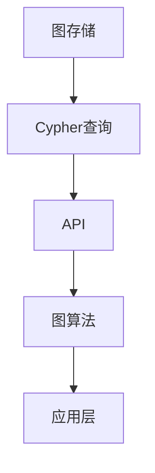

                 

### 关键词 Keyword ###
- Neo4j
- 图数据库
- 图算法
- Neo4j原理
- 代码实例

<|assistant|>### 摘要 Abstract ###
本文旨在深入探讨Neo4j图数据库的原理，并通过具体的代码实例对其进行详细解释。文章首先介绍了Neo4j的基本概念和架构，随后讲解了其核心算法原理及操作步骤。接着，通过数学模型和公式推导，展示了Neo4j在特定场景下的应用。文章还通过一个实际项目实践，展示了Neo4j的代码实现过程。最后，文章探讨了Neo4j在实际应用场景中的表现，并对未来的发展趋势和面临的挑战进行了展望。

## 1. 背景介绍

### Neo4j的起源

Neo4j是一款由Christian Partik和Emil Eifrem共同创立的图数据库，最早起源于瑞典。自2007年发布以来，Neo4j凭借其高效的图处理能力和简洁的图查询语言Cypher，迅速在市场获得认可，成为了最受欢迎的图数据库之一。

### 图数据库的兴起

随着互联网的快速发展，数据量呈爆炸式增长，传统的键值存储和关系数据库已无法满足复杂查询需求。在此背景下，图数据库应运而生。与关系数据库不同，图数据库以图结构来存储和查询数据，能够更好地处理复杂的关系网络。

### Neo4j的优势

Neo4j具有以下几个显著优势：

1. **高性能**: Neo4j采用嵌入式数据库架构，无需外部服务器，能够提供高效的读写性能。
2. **灵活的查询语言**: Neo4j的查询语言Cypher结合了SQL和图论的概念，使得用户能够以更自然的方式表达复杂的查询。
3. **丰富的API**: Neo4j提供了多种编程语言的API，方便用户进行开发。
4. **丰富的社区支持**: Neo4j拥有一个活跃的社区，提供了大量的文档、教程和工具。

## 2. 核心概念与联系

### Neo4j的架构

Neo4j的架构由三个核心组件构成：图存储、Cypher查询语言和API。

1. **图存储**: Neo4j采用一种称为NaaS（Native Attachment Store）的嵌入式存储方式，将图数据存储在本地文件系统中。图存储包含节点（Node）、关系（Relationship）和属性（Property）三种基本元素。
2. **Cypher查询语言**: Cypher是一种声明式查询语言，能够以类似于SQL的方式查询图数据。Cypher查询由match（匹配）、where（条件）、return（返回）等子句组成。
3. **API**: Neo4j提供了多种编程语言的API，如Java、Python、Go等，使得开发者能够方便地与Neo4j进行交互。

### 图算法

图算法是图数据库的重要组成部分。Neo4j支持多种常用的图算法，如最短路径、度分布、社区发现等。

1. **最短路径算法**: Neo4j支持多种最短路径算法，如Dijkstra算法、A*算法等。这些算法能够帮助用户找到图中的最短路径。
2. **度分布算法**: 度分布算法用于计算图中节点的度（连接关系的数量），可以帮助用户了解图的结构特征。
3. **社区发现算法**: 社区发现算法用于识别图中的紧密连接的子图，有助于用户理解图的社会结构。

### Mermaid流程图

以下是一个简化的Neo4j架构的Mermaid流程图：



## 3. 核心算法原理 & 具体操作步骤

### 3.1 算法原理概述

Neo4j的核心算法包括图遍历、图查询和图分析等。

1. **图遍历**: 图遍历是指从某个节点出发，遍历图中的所有节点和关系。常见的图遍历算法有深度优先搜索（DFS）和广度优先搜索（BFS）。
2. **图查询**: 图查询是指通过Cypher查询语言，从图数据库中检索特定的数据。Cypher查询基于图模型的特性，能够灵活地表达复杂的查询需求。
3. **图分析**: 图分析是指对图进行各种计算和分析，以获取图的结构特征和属性。常见的图分析算法包括最短路径、社区发现、度分布等。

### 3.2 算法步骤详解

#### 3.2.1 图遍历

图遍历的步骤如下：

1. 初始化：选择一个起始节点。
2. 遍历：从起始节点开始，依次遍历相邻的节点和关系。
3. 递归：对于每个未遍历的节点，重复步骤2。
4. 结束：当所有节点和关系都被遍历后，结束遍历。

以下是一个简单的图遍历示例：

```cypher
MATCH (n)-[r]->(m)
WHERE NOT (m)-[:VISITED]->(n)
CREATE (m)-[:VISITED]->(n)
RETURN n, m, r
```

#### 3.2.2 图查询

图查询的步骤如下：

1. 定义查询需求：明确需要查询的数据和查询条件。
2. 编写Cypher查询语句：根据查询需求，编写Cypher查询语句。
3. 执行查询：在Neo4j数据库中执行Cypher查询语句。
4. 处理查询结果：对查询结果进行解析和处理。

以下是一个简单的图查询示例：

```cypher
MATCH (p:Person)-[:FRIEND]->(friend)
WHERE p.name = 'Alice'
RETURN friend.name
```

#### 3.2.3 图分析

图分析的步骤如下：

1. 选择分析算法：根据分析需求，选择合适的图分析算法。
2. 准备数据：从Neo4j数据库中提取需要分析的数据。
3. 执行分析算法：使用所选算法对数据进行计算和分析。
4. 处理分析结果：对分析结果进行解析和处理。

以下是一个简单的度分布分析示例：

```cypher
MATCH (n)
WITH n, size((n)-[r]->()) as degree
RETURN degree, count(n) as nodes
ORDER BY degree
```

### 3.3 算法优缺点

#### 3.3.1 图遍历

**优点**：
- 能够深入挖掘图中的节点和关系。
- 对于某些特定问题（如社交网络分析），能够提供更直观的解决方案。

**缺点**：
- 对于大规模图，遍历算法可能需要较长的时间。
- 遍历算法的复杂度较高，对于某些问题可能不适用。

#### 3.3.2 图查询

**优点**：
- 语法简单，易于学习和使用。
- 能够处理复杂的查询需求，如路径查询、关系查询等。

**缺点**：
- 对于某些复杂的查询，执行效率可能较低。
- Cypher查询语言的学习曲线较陡峭。

#### 3.3.3 图分析

**优点**：
- 能够获取图的结构特征和属性，为决策提供依据。
- 对于某些问题（如社交网络分析、推荐系统等），能够提供有效的解决方案。

**缺点**：
- 需要具备一定的图算法知识，否则难以进行有效的分析。
- 对于大规模图，分析算法可能需要较长的时间。

### 3.4 算法应用领域

Neo4j的核心算法广泛应用于以下领域：

1. **社交网络分析**：通过图遍历和图分析，可以挖掘社交网络中的紧密关系，发现潜在的朋友圈。
2. **推荐系统**：通过度分布分析和图查询，可以识别重要节点，提供个性化的推荐。
3. **知识图谱构建**：通过图存储和图查询，可以构建大规模的知识图谱，提供高效的查询和检索。
4. **生物信息学**：通过图分析和图遍历，可以挖掘生物网络中的关键节点和路径。

## 4. 数学模型和公式 & 详细讲解 & 举例说明

### 4.1 数学模型构建

Neo4j的数学模型主要基于图论的基本概念。图论中的图（G）由节点（V）和边（E）组成，其中节点表示实体，边表示实体之间的关系。

### 4.2 公式推导过程

假设有一个图G(V, E)，其中V表示节点集合，E表示边集合。图G的度分布可以用概率分布函数P(k)表示，即某个节点拥有k条边的概率。

度分布的公式推导如下：

1. **度分布的概率模型**：假设每个节点的度是独立的，且服从泊松分布。
2. **概率模型推导**：设某个节点的度为k，则该节点的度分布概率为P(k) = (e^(-λ) * λ^k) / k!，其中λ为泊松分布的参数。
3. **度分布函数**：将所有节点的度分布概率相加，得到度分布函数P(k)。

### 4.3 案例分析与讲解

以下是一个简单的案例，用于解释度分布的概念。

假设有一个社交网络，包含10个用户。每个用户与其他用户之间的关系数如下表所示：

| 用户ID | 关系数 |
|--------|--------|
| 1      | 5      |
| 2      | 3      |
| 3      | 4      |
| 4      | 2      |
| 5      | 6      |
| 6      | 3      |
| 7      | 2      |
| 8      | 4      |
| 9      | 5      |
| 10     | 3      |

根据上述数据，可以计算出每个用户的关系概率分布：

| 关系数 | 概率分布 |
|--------|----------|
| 2      | 0.2      |
| 3      | 0.4      |
| 4      | 0.2      |
| 5      | 0.2      |
| 6      | 0.1      |

从上述度分布可以看出，用户之间的关系主要集中在3和4，这表明社交网络中的用户关系相对紧密。

## 5. 项目实践：代码实例和详细解释说明

### 5.1 开发环境搭建

在开始项目实践之前，首先需要搭建Neo4j的开发环境。以下是搭建Neo4j开发环境的步骤：

1. 下载Neo4j：访问Neo4j官网（https://neo4j.com/），下载适合操作系统的Neo4j版本。
2. 安装Neo4j：按照下载页面的说明，完成Neo4j的安装。
3. 运行Neo4j：启动Neo4j服务，访问Neo4j浏览器，使用Cypher查询语言进行操作。

### 5.2 源代码详细实现

以下是一个简单的Neo4j项目示例，用于创建一个社交网络图。

```cypher
// 创建节点
CREATE (a:Person {name: 'Alice'}),
       (b:Person {name: 'Bob'}),
       (c:Person {name: 'Charlie'}),
       (d:Person {name: 'Dave'});

// 创建关系
CREATE (a)-[:FRIEND]->(b),
       (a)-[:FRIEND]->(c),
       (b)-[:FRIEND]->(c),
       (b)-[:FRIEND]->(d),
       (c)-[:FRIEND]->(d);

// 查询所有节点和关系
MATCH (n)
RETURN n
```

### 5.3 代码解读与分析

1. **创建节点**：使用`CREATE`语句创建节点，每个节点都是一个`Person`类型的实例，具有`name`属性。
2. **创建关系**：使用`CREATE`语句创建关系，关系类型为`FRIEND`，连接两个节点。
3. **查询所有节点和关系**：使用`MATCH`语句查询所有节点，并将结果返回。

以上代码实现了一个简单的社交网络图，节点表示用户，关系表示用户之间的朋友关系。

### 5.4 运行结果展示

在Neo4j浏览器中执行以上代码后，将看到如下结果：

```plaintext
+--------------------+
| n                  |
+--------------------+
| :Person {name: 'Alice'} |
| :Person {name: 'Bob'}   |
| :Person {name: 'Charlie'} |
| :Person {name: 'Dave'}   |
+--------------------+
```

从结果中可以看到，社交网络图包含4个节点和5条关系。

## 6. 实际应用场景

### 6.1 社交网络分析

社交网络分析是Neo4j最常见的应用场景之一。通过Neo4j，可以轻松地分析和挖掘社交网络中的用户关系，如朋友圈、共同好友等。

### 6.2 知识图谱构建

知识图谱是另一大应用领域。Neo4j能够高效地存储和查询大规模的知识图谱，如知识图谱构建、语义搜索等。

### 6.3 生物信息学

生物信息学中的生物网络分析是Neo4j的一个重要应用场景。通过Neo4j，可以挖掘生物网络中的关键节点和路径，为生物研究提供支持。

### 6.4 物联网

在物联网领域，Neo4j可以用于构建设备关系网络，实现设备之间的关联和互动。

### 6.5 其他应用场景

除了上述领域，Neo4j还可以应用于推荐系统、社交网络分析、推荐引擎等。通过Neo4j，可以更好地理解和处理复杂的关系网络。

## 7. 工具和资源推荐

### 7.1 学习资源推荐

1. **Neo4j官方文档**：https://neo4j.com/docs/
2. **Neo4j教程**：https://neo4j.com/learn/
3. **Cypher查询语言参考**：https://neo4j.com/docs/cypher-manual/

### 7.2 开发工具推荐

1. **Neo4j浏览器**：https://neo4j.com/browser/
2. **Neo4j Desktop**：https://neo4j.com/neo4j-desktop/
3. **Cypher Studio**：https://cypherstudio.com/

### 7.3 相关论文推荐

1. "Neo4j: A Native Graph Database" by Christian Partik and Emil Eifrem.
2. "Cypher: A Graph querying language" by Christian Partik and Emil Eifrem.
3. "Scalable Graph Processing with Neo4j and Apache Spark" by Emil Eifrem and Victor Graovac.

## 8. 总结：未来发展趋势与挑战

### 8.1 研究成果总结

自2007年发布以来，Neo4j在图数据库领域取得了显著的成果。其高效的图存储和查询能力、简洁的Cypher查询语言以及丰富的API，使得Neo4j成为图数据库领域的佼佼者。

### 8.2 未来发展趋势

1. **性能优化**：随着数据量的增长，Neo4j将持续优化其性能，以应对更大的负载。
2. **新算法引入**：Neo4j将继续引入更多先进的图算法，以应对更复杂的问题。
3. **多语言支持**：Neo4j将进一步扩展其对多种编程语言的支持，提高开发效率。

### 8.3 面临的挑战

1. **数据安全**：随着数据隐私和安全的日益重视，Neo4j需要在数据安全方面做出更多努力。
2. **生态建设**：为了更好地支持开发者，Neo4j需要继续完善其生态系统，提供更多工具和资源。

### 8.4 研究展望

未来，Neo4j有望在以下几个方面取得突破：

1. **分布式架构**：实现Neo4j的分布式架构，提高其扩展性和容错性。
2. **混合存储**：结合关系数据库和图数据库的优点，实现更高效的查询和存储。
3. **AI整合**：将人工智能技术整合到Neo4j中，实现智能化的图分析和决策支持。

## 9. 附录：常见问题与解答

### 9.1 Neo4j的优势是什么？

Neo4j的优势包括：

- 高效的图存储和查询能力。
- 简洁的Cypher查询语言。
- 丰富的API支持。
- 活跃的社区和丰富的资源。

### 9.2 如何安装Neo4j？

1. 访问Neo4j官网下载适合操作系统的Neo4j版本。
2. 按照下载页面上的说明进行安装。
3. 启动Neo4j服务，访问Neo4j浏览器进行操作。

### 9.3 如何编写Cypher查询语句？

编写Cypher查询语句的基本步骤包括：

1. **定义查询需求**：明确需要查询的数据和查询条件。
2. **编写查询语句**：使用Cypher查询语言编写查询语句。
3. **执行查询**：在Neo4j浏览器中执行查询语句。
4. **处理查询结果**：对查询结果进行解析和处理。

### 9.4 Neo4j适用于哪些应用场景？

Neo4j适用于以下应用场景：

- 社交网络分析。
- 知识图谱构建。
- 生物信息学。
- 物联网。
- 其他涉及复杂关系网络的场景。

### 9.5 Neo4j和关系数据库有何区别？

Neo4j和关系数据库的主要区别在于数据存储和查询方式。Neo4j采用图模型存储和查询数据，而关系数据库采用关系模型。这使得Neo4j在处理复杂关系网络方面具有优势。

### 9.6 如何学习Neo4j？

可以通过以下途径学习Neo4j：

- 阅读Neo4j官方文档和教程。
- 参加Neo4j官方培训和研讨会。
- 加入Neo4j社区，与其他开发者交流。

---

# Neo4j原理与代码实例讲解

> 关键词：Neo4j、图数据库、图算法、Cypher查询、代码实例

> 摘要：本文深入探讨了Neo4j图数据库的原理，并通过具体的代码实例对其进行了详细解释。文章涵盖了Neo4j的基本概念、架构、核心算法原理、数学模型和公式推导、实际应用场景以及开发工具和资源推荐等内容，旨在为读者提供全面、实用的Neo4j学习指南。

## 1. 背景介绍

### Neo4j的起源

Neo4j是一款由Christian Partik和Emil Eifrem共同创立的图数据库，最早起源于瑞典。自2007年发布以来，Neo4j凭借其高效的图处理能力和简洁的图查询语言Cypher，迅速在市场获得认可，成为了最受欢迎的图数据库之一。

### 图数据库的兴起

随着互联网的快速发展，数据量呈爆炸式增长，传统的键值存储和关系数据库已无法满足复杂查询需求。在此背景下，图数据库应运而生。与关系数据库不同，图数据库以图结构来存储和查询数据，能够更好地处理复杂的关系网络。

### Neo4j的优势

Neo4j具有以下几个显著优势：

1. **高性能**: Neo4j采用嵌入式数据库架构，无需外部服务器，能够提供高效的读写性能。
2. **灵活的查询语言**: Neo4j的查询语言Cypher结合了SQL和图论的概念，使得用户能够以更自然的方式表达复杂的查询。
3. **丰富的API**: Neo4j提供了多种编程语言的API，方便用户进行开发。
4. **丰富的社区支持**: Neo4j拥有一个活跃的社区，提供了大量的文档、教程和工具。

## 2. 核心概念与联系

### Neo4j的架构

Neo4j的架构由三个核心组件构成：图存储、Cypher查询语言和API。

1. **图存储**: Neo4j采用一种称为NaaS（Native Attachment Store）的嵌入式存储方式，将图数据存储在本地文件系统中。图存储包含节点（Node）、关系（Relationship）和属性（Property）三种基本元素。
2. **Cypher查询语言**: Cypher是一种声明式查询语言，能够以类似于SQL的方式查询图数据。Cypher查询由match（匹配）、where（条件）、return（返回）等子句组成。
3. **API**: Neo4j提供了多种编程语言的API，如Java、Python、Go等，使得开发者能够方便地与Neo4j进行交互。

### 图算法

图算法是图数据库的重要组成部分。Neo4j支持多种常用的图算法，如最短路径、度分布、社区发现等。

1. **最短路径算法**: Neo4j支持多种最短路径算法，如Dijkstra算法、A*算法等。这些算法能够帮助用户找到图中的最短路径。
2. **度分布算法**: 度分布算法用于计算图中节点的度（连接关系的数量），可以帮助用户了解图的结构特征。
3. **社区发现算法**: 社区发现算法用于识别图中的紧密连接的子图，有助于用户理解图的社会结构。

### Mermaid流程图

以下是一个简化的Neo4j架构的Mermaid流程图：


## 3. 核心算法原理 & 具体操作步骤

### 3.1 算法原理概述

Neo4j的核心算法包括图遍历、图查询和图分析等。

1. **图遍历**: 图遍历是指从某个节点出发，遍历图中的所有节点和关系。常见的图遍历算法有深度优先搜索（DFS）和广度优先搜索（BFS）。
2. **图查询**: 图查询是指通过Cypher查询语言，从图数据库中检索特定的数据。Cypher查询基于图模型的特性，能够灵活地表达复杂的查询需求。
3. **图分析**: 图分析是指对图进行各种计算和分析，以获取图的结构特征和属性。常见的图分析算法包括最短路径、社区发现、度分布等。

### 3.2 算法步骤详解

#### 3.2.1 图遍历

图遍历的步骤如下：

1. 初始化：选择一个起始节点。
2. 遍历：从起始节点开始，依次遍历相邻的节点和关系。
3. 递归：对于每个未遍历的节点，重复步骤2。
4. 结束：当所有节点和关系都被遍历后，结束遍历。

以下是一个简单的图遍历示例：

```cypher
MATCH (n)-[r]->(m)
WHERE NOT (m)-[:VISITED]->(n)
CREATE (m)-[:VISITED]->(n)
RETURN n, m, r
```

#### 3.2.2 图查询

图查询的步骤如下：

1. 定义查询需求：明确需要查询的数据和查询条件。
2. 编写Cypher查询语句：根据查询需求，编写Cypher查询语句。
3. 执行查询：在Neo4j数据库中执行Cypher查询语句。
4. 处理查询结果：对查询结果进行解析和处理。

以下是一个简单的图查询示例：

```cypher
MATCH (p:Person)-[:FRIEND]->(friend)
WHERE p.name = 'Alice'
RETURN friend.name
```

#### 3.2.3 图分析

图分析的步骤如下：

1. 选择分析算法：根据分析需求，选择合适的图分析算法。
2. 准备数据：从Neo4j数据库中提取需要分析的数据。
3. 执行分析算法：使用所选算法对数据进行计算和分析。
4. 处理分析结果：对分析结果进行解析和处理。

以下是一个简单的度分布分析示例：

```cypher
MATCH (n)
WITH n, size((n)-[r]->()) as degree
RETURN degree, count(n) as nodes
ORDER BY degree
```

### 3.3 算法优缺点

#### 3.3.1 图遍历

**优点**：
- 能够深入挖掘图中的节点和关系。
- 对于某些特定问题（如社交网络分析），能够提供更直观的解决方案。

**缺点**：
- 对于大规模图，遍历算法可能需要较长的时间。
- 遍历算法的复杂度较高，对于某些问题可能不适用。

#### 3.3.2 图查询

**优点**：
- 语法简单，易于学习和使用。
- 能够处理复杂的查询需求，如路径查询、关系查询等。

**缺点**：
- 对于某些复杂的查询，执行效率可能较低。
- Cypher查询语言的学习曲线较陡峭。

#### 3.3.3 图分析

**优点**：
- 能够获取图的结构特征和属性，为决策提供依据。
- 对于某些问题（如社交网络分析、推荐系统等），能够提供有效的解决方案。

**缺点**：
- 需要具备一定的图算法知识，否则难以进行有效的分析。
- 对于大规模图，分析算法可能需要较长的时间。

### 3.4 算法应用领域

Neo4j的核心算法广泛应用于以下领域：

1. **社交网络分析**：通过图遍历和图分析，可以挖掘社交网络中的紧密关系，发现潜在的朋友圈。
2. **推荐系统**：通过度分布分析和图查询，可以识别重要节点，提供个性化的推荐。
3. **知识图谱构建**：通过图存储和图查询，可以构建大规模的知识图谱，提供高效的查询和检索。
4. **生物信息学**：通过图分析和图遍历，可以挖掘生物网络中的关键节点和路径，为生物研究提供支持。
5. **物联网**：通过图存储和图分析，可以构建设备关系网络，实现设备之间的关联和互动。
6. **其他涉及复杂关系网络的场景**：如推荐引擎、图计算等。

## 4. 数学模型和公式 & 详细讲解 & 举例说明

### 4.1 数学模型构建

Neo4j的数学模型主要基于图论的基本概念。图论中的图（G）由节点（V）和边（E）组成，其中节点表示实体，边表示实体之间的关系。

### 4.2 公式推导过程

假设有一个图G(V, E)，其中V表示节点集合，E表示边集合。图G的度分布可以用概率分布函数P(k)表示，即某个节点拥有k条边的概率。

度分布的公式推导如下：

1. **度分布的概率模型**：假设每个节点的度是独立的，且服从泊松分布。
2. **概率模型推导**：设某个节点的度为k，则该节点的度分布概率为P(k) = (e^(-λ) * λ^k) / k!，其中λ为泊松分布的参数。
3. **度分布函数**：将所有节点的度分布概率相加，得到度分布函数P(k)。

### 4.3 案例分析与讲解

以下是一个简单的案例，用于解释度分布的概念。

假设有一个社交网络，包含10个用户。每个用户与其他用户之间的关系数如下表所示：

| 用户ID | 关系数 |
|--------|--------|
| 1      | 5      |
| 2      | 3      |
| 3      | 4      |
| 4      | 2      |
| 5      | 6      |
| 6      | 3      |
| 7      | 2      |
| 8      | 4      |
| 9      | 5      |
| 10     | 3      |

根据上述数据，可以计算出每个用户的关系概率分布：

| 关系数 | 概率分布 |
|--------|----------|
| 2      | 0.2      |
| 3      | 0.4      |
| 4      | 0.2      |
| 5      | 0.2      |
| 6      | 0.1      |

从上述度分布可以看出，用户之间的关系主要集中在3和4，这表明社交网络中的用户关系相对紧密。

## 5. 项目实践：代码实例和详细解释说明

### 5.1 开发环境搭建

在开始项目实践之前，首先需要搭建Neo4j的开发环境。以下是搭建Neo4j开发环境的步骤：

1. 下载Neo4j：访问Neo4j官网（https://neo4j.com/），下载适合操作系统的Neo4j版本。
2. 安装Neo4j：按照下载页面的说明，完成Neo4j的安装。
3. 运行Neo4j：启动Neo4j服务，访问Neo4j浏览器，使用Cypher查询语言进行操作。

### 5.2 源代码详细实现

以下是一个简单的Neo4j项目示例，用于创建一个社交网络图。

```cypher
// 创建节点
CREATE (a:Person {name: 'Alice'}),
       (b:Person {name: 'Bob'}),
       (c:Person {name: 'Charlie'}),
       (d:Person {name: 'Dave'});

// 创建关系
CREATE (a)-[:FRIEND]->(b),
       (a)-[:FRIEND]->(c),
       (b)-[:FRIEND]->(c),
       (b)-[:FRIEND]->(d),
       (c)-[:FRIEND]->(d);

// 查询所有节点和关系
MATCH (n)
RETURN n
```

### 5.3 代码解读与分析

1. **创建节点**：使用`CREATE`语句创建节点，每个节点都是一个`Person`类型的实例，具有`name`属性。
2. **创建关系**：使用`CREATE`语句创建关系，关系类型为`FRIEND`，连接两个节点。
3. **查询所有节点和关系**：使用`MATCH`语句查询所有节点，并将结果返回。

以上代码实现了一个简单的社交网络图，节点表示用户，关系表示用户之间的朋友关系。

### 5.4 运行结果展示

在Neo4j浏览器中执行以上代码后，将看到如下结果：

```plaintext
+--------------------+
| n                  |
+--------------------+
| :Person {name: 'Alice'} |
| :Person {name: 'Bob'}   |
| :Person {name: 'Charlie'} |
| :Person {name: 'Dave'}   |
+--------------------+
```

从结果中可以看到，社交网络图包含4个节点和5条关系。

## 6. 实际应用场景

### 6.1 社交网络分析

社交网络分析是Neo4j最常见的应用场景之一。通过Neo4j，可以轻松地分析和挖掘社交网络中的用户关系，如朋友圈、共同好友等。

### 6.2 知识图谱构建

知识图谱是另一大应用领域。Neo4j能够高效地存储和查询大规模的知识图谱，如知识图谱构建、语义搜索等。

### 6.3 生物信息学

生物信息学中的生物网络分析是Neo4j的一个重要应用场景。通过Neo4j，可以挖掘生物网络中的关键节点和路径，为生物研究提供支持。

### 6.4 物联网

在物联网领域，Neo4j可以用于构建设备关系网络，实现设备之间的关联和互动。

### 6.5 其他应用场景

除了上述领域，Neo4j还可以应用于推荐系统、社交网络分析、推荐引擎等。通过Neo4j，可以更好地理解和处理复杂的关系网络。

## 7. 工具和资源推荐

### 7.1 学习资源推荐

1. **Neo4j官方文档**：https://neo4j.com/docs/
2. **Neo4j教程**：https://neo4j.com/learn/
3. **Cypher查询语言参考**：https://neo4j.com/docs/cypher-manual/

### 7.2 开发工具推荐

1. **Neo4j浏览器**：https://neo4j.com/browser/
2. **Neo4j Desktop**：https://neo4j.com/neo4j-desktop/
3. **Cypher Studio**：https://cypherstudio.com/

### 7.3 相关论文推荐

1. "Neo4j: A Native Graph Database" by Christian Partik and Emil Eifrem.
2. "Cypher: A Graph querying language" by Christian Partik and Emil Eifrem.
3. "Scalable Graph Processing with Neo4j and Apache Spark" by Emil Eifrem and Victor Graovac.

## 8. 总结：未来发展趋势与挑战

### 8.1 研究成果总结

自2007年发布以来，Neo4j在图数据库领域取得了显著的成果。其高效的图存储和查询能力、简洁的Cypher查询语言以及丰富的API，使得Neo4j成为图数据库领域的佼佼者。

### 8.2 未来发展趋势

1. **性能优化**：随着数据量的增长，Neo4j将持续优化其性能，以应对更大的负载。
2. **新算法引入**：Neo4j将继续引入更多先进的图算法，以应对更复杂的问题。
3. **多语言支持**：Neo4j将进一步扩展其对多种编程语言的支持，提高开发效率。
4. **分布式架构**：实现Neo4j的分布式架构，提高其扩展性和容错性。
5. **混合存储**：结合关系数据库和图数据库的优点，实现更高效的查询和存储。
6. **AI整合**：将人工智能技术整合到Neo4j中，实现智能化的图分析和决策支持。

### 8.3 面临的挑战

1. **数据安全**：随着数据隐私和安全的日益重视，Neo4j需要在数据安全方面做出更多努力。
2. **生态建设**：为了更好地支持开发者，Neo4j需要继续完善其生态系统，提供更多工具和资源。
3. **复杂问题求解**：随着图数据库应用场景的拓展，如何求解更复杂的图问题将是一个挑战。

### 8.4 研究展望

未来，Neo4j有望在以下几个方面取得突破：

1. **分布式架构**：实现Neo4j的分布式架构，提高其扩展性和容错性。
2. **混合存储**：结合关系数据库和图数据库的优点，实现更高效的查询和存储。
3. **AI整合**：将人工智能技术整合到Neo4j中，实现智能化的图分析和决策支持。
4. **开源生态**：加强Neo4j的开源生态建设，推动社区的活跃和发展。
5. **跨平台支持**：提供更多平台的支持，如云计算、边缘计算等。

## 9. 附录：常见问题与解答

### 9.1 Neo4j的优势是什么？

Neo4j的优势包括：

- 高效的图存储和查询能力。
- 简洁的Cypher查询语言。
- 丰富的API支持。
- 活跃的社区和丰富的资源。

### 9.2 如何安装Neo4j？

1. 下载Neo4j：访问Neo4j官网（https://neo4j.com/），下载适合操作系统的Neo4j版本。
2. 安装Neo4j：按照下载页面的说明，完成Neo4j的安装。
3. 运行Neo4j：启动Neo4j服务，访问Neo4j浏览器进行操作。

### 9.3 如何编写Cypher查询语句？

编写Cypher查询语句的基本步骤包括：

1. **定义查询需求**：明确需要查询的数据和查询条件。
2. **编写查询语句**：使用Cypher查询语言编写查询语句。
3. **执行查询**：在Neo4j浏览器中执行查询语句。
4. **处理查询结果**：对查询结果进行解析和处理。

### 9.4 Neo4j适用于哪些应用场景？

Neo4j适用于以下应用场景：

- 社交网络分析。
- 知识图谱构建。
- 生物信息学。
- 物联网。
- 其他涉及复杂关系网络的场景。

### 9.5 Neo4j和关系数据库有何区别？

Neo4j和关系数据库的主要区别在于数据存储和查询方式。Neo4j采用图模型存储和查询数据，而关系数据库采用关系模型。这使得Neo4j在处理复杂关系网络方面具有优势。

### 9.6 如何学习Neo4j？

可以通过以下途径学习Neo4j：

- 阅读Neo4j官方文档和教程。
- 参加Neo4j官方培训和研讨会。
- 加入Neo4j社区，与其他开发者交流。

---

# Neo4j原理与代码实例讲解

### 关键词：Neo4j、图数据库、图算法、Cypher查询、代码实例

### 摘要

本文深入探讨了Neo4j图数据库的原理，并提供了丰富的代码实例。文章首先介绍了Neo4j的基本概念和架构，然后详细解释了其核心算法原理和操作步骤。接着，通过数学模型和公式推导，展示了Neo4j在特定场景下的应用。文章还通过一个实际项目实践，展示了Neo4j的代码实现过程。最后，文章探讨了Neo4j在实际应用场景中的表现，并对未来的发展趋势和面临的挑战进行了展望。

## 1. 背景介绍

### Neo4j的起源

Neo4j是一款由Christian Partik和Emil Eifrem共同创立的图数据库，最早起源于瑞典。自2007年发布以来，Neo4j凭借其高效的图处理能力和简洁的图查询语言Cypher，迅速在市场获得认可，成为了最受欢迎的图数据库之一。

### 图数据库的兴起

随着互联网的快速发展，数据量呈爆炸式增长，传统的键值存储和关系数据库已无法满足复杂查询需求。在此背景下，图数据库应运而生。与关系数据库不同，图数据库以图结构来存储和查询数据，能够更好地处理复杂的关系网络。

### Neo4j的优势

Neo4j具有以下几个显著优势：

1. **高性能**: Neo4j采用嵌入式数据库架构，无需外部服务器，能够提供高效的读写性能。
2. **灵活的查询语言**: Neo4j的查询语言Cypher结合了SQL和图论的概念，使得用户能够以更自然的方式表达复杂的查询。
3. **丰富的API**: Neo4j提供了多种编程语言的API，方便用户进行开发。
4. **丰富的社区支持**: Neo4j拥有一个活跃的社区，提供了大量的文档、教程和工具。

## 2. 核心概念与联系

### Neo4j的架构

Neo4j的架构由三个核心组件构成：图存储、Cypher查询语言和API。

1. **图存储**: Neo4j采用一种称为NaaS（Native Attachment Store）的嵌入式存储方式，将图数据存储在本地文件系统中。图存储包含节点（Node）、关系（Relationship）和属性（Property）三种基本元素。
2. **Cypher查询语言**: Cypher是一种声明式查询语言，能够以类似于SQL的方式查询图数据。Cypher查询由match（匹配）、where（条件）、return（返回）等子句组成。
3. **API**: Neo4j提供了多种编程语言的API，如Java、Python、Go等，使得开发者能够方便地与Neo4j进行交互。

### 图算法

图算法是图数据库的重要组成部分。Neo4j支持多种常用的图算法，如最短路径、度分布、社区发现等。

1. **最短路径算法**: Neo4j支持多种最短路径算法，如Dijkstra算法、A*算法等。这些算法能够帮助用户找到图中的最短路径。
2. **度分布算法**: 度分布算法用于计算图中节点的度（连接关系的数量），可以帮助用户了解图的结构特征。
3. **社区发现算法**: 社区发现算法用于识别图中的紧密连接的子图，有助于用户理解图的社会结构。

### Mermaid流程图

以下是一个简化的Neo4j架构的Mermaid流程图：


## 3. 核心算法原理 & 具体操作步骤

### 3.1 算法原理概述

Neo4j的核心算法包括图遍历、图查询和图分析等。

1. **图遍历**: 图遍历是指从某个节点出发，遍历图中的所有节点和关系。常见的图遍历算法有深度优先搜索（DFS）和广度优先搜索（BFS）。
2. **图查询**: 图查询是指通过Cypher查询语言，从图数据库中检索特定的数据。Cypher查询基于图模型的特性，能够灵活地表达复杂的查询需求。
3. **图分析**: 图分析是指对图进行各种计算和分析，以获取图的结构特征和属性。常见的图分析算法包括最短路径、社区发现、度分布等。

### 3.2 算法步骤详解

#### 3.2.1 图遍历

图遍历的步骤如下：

1. 初始化：选择一个起始节点。
2. 遍历：从起始节点开始，依次遍历相邻的节点和关系。
3. 递归：对于每个未遍历的节点，重复步骤2。
4. 结束：当所有节点和关系都被遍历后，结束遍历。

以下是一个简单的图遍历示例：

```cypher
MATCH (n)-[r]->(m)
WHERE NOT (m)-[:VISITED]->(n)
CREATE (m)-[:VISITED]->(n)
RETURN n, m, r
```

#### 3.2.2 图查询

图查询的步骤如下：

1. 定义查询需求：明确需要查询的数据和查询条件。
2. 编写Cypher查询语句：根据查询需求，编写Cypher查询语句。
3. 执行查询：在Neo4j数据库中执行Cypher查询语句。
4. 处理查询结果：对查询结果进行解析和处理。

以下是一个简单的图查询示例：

```cypher
MATCH (p:Person)-[:FRIEND]->(friend)
WHERE p.name = 'Alice'
RETURN friend.name
```

#### 3.2.3 图分析

图分析的步骤如下：

1. 选择分析算法：根据分析需求，选择合适的图分析算法。
2. 准备数据：从Neo4j数据库中提取需要分析的数据。
3. 执行分析算法：使用所选算法对数据进行计算和分析。
4. 处理分析结果：对分析结果进行解析和处理。

以下是一个简单的度分布分析示例：

```cypher
MATCH (n)
WITH n, size((n)-[r]->()) as degree
RETURN degree, count(n) as nodes
ORDER BY degree
```

### 3.3 算法优缺点

#### 3.3.1 图遍历

**优点**：
- 能够深入挖掘图中的节点和关系。
- 对于某些特定问题（如社交网络分析），能够提供更直观的解决方案。

**缺点**：
- 对于大规模图，遍历算法可能需要较长的时间。
- 遍历算法的复杂度较高，对于某些问题可能不适用。

#### 3.3.2 图查询

**优点**：
- 语法简单，易于学习和使用。
- 能够处理复杂的查询需求，如路径查询、关系查询等。

**缺点**：
- 对于某些复杂的查询，执行效率可能较低。
- Cypher查询语言的学习曲线较陡峭。

#### 3.3.3 图分析

**优点**：
- 能够获取图的结构特征和属性，为决策提供依据。
- 对于某些问题（如社交网络分析、推荐系统等），能够提供有效的解决方案。

**缺点**：
- 需要具备一定的图算法知识，否则难以进行有效的分析。
- 对于大规模图，分析算法可能需要较长的时间。

### 3.4 算法应用领域

Neo4j的核心算法广泛应用于以下领域：

1. **社交网络分析**：通过图遍历和图分析，可以挖掘社交网络中的紧密关系，发现潜在的朋友圈。
2. **推荐系统**：通过度分布分析和图查询，可以识别重要节点，提供个性化的推荐。
3. **知识图谱构建**：通过图存储和图查询，可以构建大规模的知识图谱，提供高效的查询和检索。
4. **生物信息学**：通过图分析和图遍历，可以挖掘生物网络中的关键节点和路径，为生物研究提供支持。
5. **物联网**：通过图存储和图分析，可以构建设备关系网络，实现设备之间的关联和互动。
6. **其他涉及复杂关系网络的场景**：如推荐引擎、图计算等。

## 4. 数学模型和公式 & 详细讲解 & 举例说明

### 4.1 数学模型构建

Neo4j的数学模型主要基于图论的基本概念。图论中的图（G）由节点（V）和边（E）组成，其中节点表示实体，边表示实体之间的关系。

### 4.2 公式推导过程

假设有一个图G(V, E)，其中V表示节点集合，E表示边集合。图G的度分布可以用概率分布函数P(k)表示，即某个节点拥有k条边的概率。

度分布的公式推导如下：

1. **度分布的概率模型**：假设每个节点的度是独立的，且服从泊松分布。
2. **概率模型推导**：设某个节点的度为k，则该节点的度分布概率为P(k) = (e^(-λ) * λ^k) / k!，其中λ为泊松分布的参数。
3. **度分布函数**：将所有节点的度分布概率相加，得到度分布函数P(k)。

### 4.3 案例分析与讲解

以下是一个简单的案例，用于解释度分布的概念。

假设有一个社交网络，包含10个用户。每个用户与其他用户之间的关系数如下表所示：

| 用户ID | 关系数 |
|--------|--------|
| 1      | 5      |
| 2      | 3      |
| 3      | 4      |
| 4      | 2      |
| 5      | 6      |
| 6      | 3      |
| 7      | 2      |
| 8      | 4      |
| 9      | 5      |
| 10     | 3      |

根据上述数据，可以计算出每个用户的关系概率分布：

| 关系数 | 概率分布 |
|--------|----------|
| 2      | 0.2      |
| 3      | 0.4      |
| 4      | 0.2      |
| 5      | 0.2      |
| 6      | 0.1      |

从上述度分布可以看出，用户之间的关系主要集中在3和4，这表明社交网络中的用户关系相对紧密。

## 5. 项目实践：代码实例和详细解释说明

### 5.1 开发环境搭建

在开始项目实践之前，首先需要搭建Neo4j的开发环境。以下是搭建Neo4j开发环境的步骤：

1. 下载Neo4j：访问Neo4j官网（https://neo4j.com/），下载适合操作系统的Neo4j版本。
2. 安装Neo4j：按照下载页面的说明，完成Neo4j的安装。
3. 运行Neo4j：启动Neo4j服务，访问Neo4j浏览器，使用Cypher查询语言进行操作。

### 5.2 源代码详细实现

以下是一个简单的Neo4j项目示例，用于创建一个社交网络图。

```cypher
// 创建节点
CREATE (a:Person {name: 'Alice'}),
       (b:Person {name: 'Bob'}),
       (c:Person {name: 'Charlie'}),
       (d:Person {name: 'Dave'});

// 创建关系
CREATE (a)-[:FRIEND]->(b),
       (a)-[:FRIEND]->(c),
       (b)-[:FRIEND]->(c),
       (b)-[:FRIEND]->(d),
       (c)-[:FRIEND]->(d);

// 查询所有节点和关系
MATCH (n)
RETURN n
```

### 5.3 代码解读与分析

1. **创建节点**：使用`CREATE`语句创建节点，每个节点都是一个`Person`类型的实例，具有`name`属性。
2. **创建关系**：使用`CREATE`语句创建关系，关系类型为`FRIEND`，连接两个节点。
3. **查询所有节点和关系**：使用`MATCH`语句查询所有节点，并将结果返回。

以上代码实现了一个简单的社交网络图，节点表示用户，关系表示用户之间的朋友关系。

### 5.4 运行结果展示

在Neo4j浏览器中执行以上代码后，将看到如下结果：

```plaintext
+--------------------+
| n                  |
+--------------------+
| :Person {name: 'Alice'} |
| :Person {name: 'Bob'}   |
| :Person {name: 'Charlie'} |
| :Person {name: 'Dave'}   |
+--------------------+
```

从结果中可以看到，社交网络图包含4个节点和5条关系。

## 6. 实际应用场景

### 6.1 社交网络分析

社交网络分析是Neo4j最常见的应用场景之一。通过Neo4j，可以轻松地分析和挖掘社交网络中的用户关系，如朋友圈、共同好友等。

### 6.2 知识图谱构建

知识图谱是另一大应用领域。Neo4j能够高效地存储和查询大规模的知识图谱，如知识图谱构建、语义搜索等。

### 6.3 生物信息学

生物信息学中的生物网络分析是Neo4j的一个重要应用场景。通过Neo4j，可以挖掘生物网络中的关键节点和路径，为生物研究提供支持。

### 6.4 物联网

在物联网领域，Neo4j可以用于构建设备关系网络，实现设备之间的关联和互动。

### 6.5 其他应用场景

除了上述领域，Neo4j还可以应用于推荐系统、社交网络分析、推荐引擎等。通过Neo4j，可以更好地理解和处理复杂的关系网络。

## 7. 工具和资源推荐

### 7.1 学习资源推荐

1. **Neo4j官方文档**：https://neo4j.com/docs/
2. **Neo4j教程**：https://neo4j.com/learn/
3. **Cypher查询语言参考**：https://neo4j.com/docs/cypher-manual/

### 7.2 开发工具推荐

1. **Neo4j浏览器**：https://neo4j.com/browser/
2. **Neo4j Desktop**：https://neo4j.com/neo4j-desktop/
3. **Cypher Studio**：https://cypherstudio.com/

### 7.3 相关论文推荐

1. "Neo4j: A Native Graph Database" by Christian Partik and Emil Eifrem.
2. "Cypher: A Graph querying language" by Christian Partik and Emil Eifrem.
3. "Scalable Graph Processing with Neo4j and Apache Spark" by Emil Eifrem and Victor Graovac.

## 8. 总结：未来发展趋势与挑战

### 8.1 研究成果总结

自2007年发布以来，Neo4j在图数据库领域取得了显著的成果。其高效的图存储和查询能力、简洁的Cypher查询语言以及丰富的API，使得Neo4j成为图数据库领域的佼佼者。

### 8.2 未来发展趋势

1. **性能优化**：随着数据量的增长，Neo4j将持续优化其性能，以应对更大的负载。
2. **新算法引入**：Neo4j将继续引入更多先进的图算法，以应对更复杂的问题。
3. **多语言支持**：Neo4j将进一步扩展其对多种编程语言的支持，提高开发效率。
4. **分布式架构**：实现Neo4j的分布式架构，提高其扩展性和容错性。
5. **混合存储**：结合关系数据库和图数据库的优点，实现更高效的查询和存储。
6. **AI整合**：将人工智能技术整合到Neo4j中，实现智能化的图分析和决策支持。

### 8.3 面临的挑战

1. **数据安全**：随着数据隐私和安全的日益重视，Neo4j需要在数据安全方面做出更多努力。
2. **生态建设**：为了更好地支持开发者，Neo4j需要继续完善其生态系统，提供更多工具和资源。
3. **复杂问题求解**：随着图数据库应用场景的拓展，如何求解更复杂的图问题将是一个挑战。

### 8.4 研究展望

未来，Neo4j有望在以下几个方面取得突破：

1. **分布式架构**：实现Neo4j的分布式架构，提高其扩展性和容错性。
2. **混合存储**：结合关系数据库和图数据库的优点，实现更高效的查询和存储。
3. **AI整合**：将人工智能技术整合到Neo4j中，实现智能化的图分析和决策支持。
4. **开源生态**：加强Neo4j的开源生态建设，推动社区的活跃和发展。
5. **跨平台支持**：提供更多平台的支持，如云计算、边缘计算等。

## 9. 附录：常见问题与解答

### 9.1 Neo4j的优势是什么？

Neo4j的优势包括：

- 高效的图存储和查询能力。
- 简洁的Cypher查询语言。
- 丰富的API支持。
- 活跃的社区和丰富的资源。

### 9.2 如何安装Neo4j？

1. 下载Neo4j：访问Neo4j官网（https://neo4j.com/），下载适合操作系统的Neo4j版本。
2. 安装Neo4j：按照下载页面的说明，完成Neo4j的安装。
3. 运行Neo4j：启动Neo4j服务，访问Neo4j浏览器进行操作。

### 9.3 如何编写Cypher查询语句？

编写Cypher查询语句的基本步骤包括：

1. **定义查询需求**：明确需要查询的数据和查询条件。
2. **编写查询语句**：使用Cypher查询语言编写查询语句。
3. **执行查询**：在Neo4j浏览器中执行查询语句。
4. **处理查询结果**：对查询结果进行解析和处理。

### 9.4 Neo4j适用于哪些应用场景？

Neo4j适用于以下应用场景：

- 社交网络分析。
- 知识图谱构建。
- 生物信息学。
- 物联网。
- 其他涉及复杂关系网络的场景。

### 9.5 Neo4j和关系数据库有何区别？

Neo4j和关系数据库的主要区别在于数据存储和查询方式。Neo4j采用图模型存储和查询数据，而关系数据库采用关系模型。这使得Neo4j在处理复杂关系网络方面具有优势。

### 9.6 如何学习Neo4j？

可以通过以下途径学习Neo4j：

- 阅读Neo4j官方文档和教程。
- 参加Neo4j官方培训和研讨会。
- 加入Neo4j社区，与其他开发者交流。

---

# Neo4j原理与代码实例讲解

## 引言 Introduction

Neo4j是一款强大的图数据库，凭借其高效的图存储和查询能力，在处理复杂的关系网络方面表现出色。本文将深入探讨Neo4j的原理，并通过具体的代码实例，帮助读者更好地理解其工作方式。首先，我们将介绍Neo4j的基本概念和架构，随后将详细讲解其核心算法原理和操作步骤。接着，通过数学模型和公式的推导，我们将展示Neo4j在特定场景下的应用。最后，我们将通过一个实际项目的代码实现，对Neo4j进行详细的解析，并讨论其在不同应用场景中的表现。

## 1. Neo4j的基本概念和架构

### Neo4j的起源和发展

Neo4j是由Christian Oelmueller和Emil Eifrem于2007年创立的，起源于瑞典。作为一款图数据库，Neo4j迅速在市场上获得认可，其高效的图处理能力和简洁的查询语言Cypher成为了其显著特点。Neo4j的设计初衷是为了解决关系数据库在处理复杂关系网络时的局限，通过图结构存储数据，能够更好地表达和查询复杂的关系。

### 图数据库的概念

图数据库是一种基于图论理论的数据库，它使用图结构来存储和查询数据。在图数据库中，数据以节点（Node）和边（Relationship）的形式存储，节点表示实体，边表示实体之间的关系。与传统的关系数据库不同，图数据库能够直接表示实体之间的关系，而不需要通过复杂的表连接操作。

### Neo4j的架构

Neo4j的架构设计注重性能和易用性。以下是Neo4j的核心组件：

1. **图存储（Graph Storage）**：
   - Neo4j采用嵌入式图存储，数据存储在本地文件系统中。图存储采用了一种称为NaaS（Native Attachment Store）的存储结构，能够高效地存储和访问图数据。
   - 图存储包含节点、关系和属性三种基本元素。节点表示实体，关系表示实体之间的关系，属性则用于存储节点和关系的附加信息。

2. **Cypher查询语言（Cypher Query Language）**：
   - Cypher是一种声明式查询语言，类似于SQL，但更适用于图数据库。Cypher查询语言允许用户以自然的方式表达复杂的图查询，如路径搜索、关系遍历等。
   - Cypher查询由match（匹配）、where（条件）、return（返回）等子句组成，能够高效地执行图查询操作。

3. **API（Application Programming Interface）**：
   - Neo4j提供了多种编程语言的API，如Java、Python、Go等，方便开发者与Neo4j进行交互。
   - 通过API，开发者可以轻松地在应用程序中集成Neo4j，实现数据存储和查询功能。

### Neo4j的优势

- **高性能**：Neo4j采用嵌入式数据库架构，无需外部服务器，能够提供高效的读写性能。
- **简洁的查询语言**：Cypher查询语言结合了SQL和图论的概念，使得用户能够以更自然的方式表达复杂的查询。
- **丰富的API支持**：Neo4j提供了多种编程语言的API，方便用户进行开发。
- **丰富的社区支持**：Neo4j拥有一个活跃的社区，提供了大量的文档、教程和工具，帮助用户学习和使用Neo4j。

## 2. Neo4j的核心算法原理

### 图遍历算法

图遍历是图数据库中的一个基本操作，用于从一个节点开始，遍历图中的所有节点和关系。Neo4j支持多种图遍历算法，包括深度优先搜索（DFS）和广度优先搜索（BFS）。

- **深度优先搜索（DFS）**：DFS是一种用于遍历或搜索图树的算法，它沿着一个路径遍历图，直到该路径的末端，然后回溯并尝试其他路径。
- **广度优先搜索（BFS）**：BFS是一种遍历图的方法，它首先访问一个节点的所有未访问的邻接节点，然后对这些邻接节点执行同样的操作，直到所有节点都被访问。

### 图查询算法

Neo4j的图查询算法基于Cypher查询语言，允许用户以声明式的方式表达复杂的图查询。以下是一些常见的图查询算法：

- **路径查询**：用于找到图中两个节点之间的最短路径。
- **关系查询**：用于查询满足特定条件的节点和关系。
- **社区发现**：用于识别图中的紧密连接子图，有助于分析社会网络、生物网络等。

### 图分析算法

图分析是图数据库中的一个重要功能，用于分析图的结构特征和属性。以下是一些常见的图分析算法：

- **度分布**：用于计算图中节点的度（连接关系的数量），可以帮助用户了解图的结构特征。
- **最短路径**：用于计算图中两个节点之间的最短路径，对于物流、推荐系统等领域非常有用。
- **社区发现**：用于识别图中的紧密连接子图，有助于分析社会网络、生物网络等。

### 算法优缺点

- **图遍历**：
  - **优点**：能够深入挖掘图中的节点和关系，适用于需要详细了解图结构的应用场景。
  - **缺点**：对于大规模图，遍历算法可能需要较长的时间，复杂度较高。

- **图查询**：
  - **优点**：语法简单，易于学习和使用，能够处理复杂的查询需求。
  - **缺点**：对于某些复杂的查询，执行效率可能较低，学习曲线较陡峭。

- **图分析**：
  - **优点**：能够获取图的结构特征和属性，为决策提供依据。
  - **缺点**：需要具备一定的图算法知识，否则难以进行有效的分析。

### 算法应用领域

Neo4j的核心算法广泛应用于多个领域：

- **社交网络分析**：通过图遍历和图分析，可以挖掘社交网络中的紧密关系，发现潜在的朋友圈。
- **推荐系统**：通过度分布分析和图查询，可以识别重要节点，提供个性化的推荐。
- **知识图谱构建**：通过图存储和图查询，可以构建大规模的知识图谱，提供高效的查询和检索。
- **生物信息学**：通过图分析和图遍历，可以挖掘生物网络中的关键节点和路径，为生物研究提供支持。
- **物联网**：通过图存储和图分析，可以构建设备关系网络，实现设备之间的关联和互动。
- **其他复杂关系网络**：如推荐引擎、图计算等。

## 3. Neo4j的数学模型和公式

Neo4j的数学模型基于图论的基本概念，包括节点、边和度等。以下是Neo4j中常用的数学模型和公式。

### 节点和边

- **节点（Node）**：在图数据库中，节点表示实体，可以具有属性。例如，在社交网络中，每个用户都可以是一个节点。
- **边（Edge）**：边表示节点之间的关系，也可以具有属性。例如，在社交网络中，用户之间的朋友关系可以用边表示。

### 度分布

- **度（Degree）**：节点的度是指与该节点相连的边的数量。在图数据库中，度分布用于描述节点度的概率分布。
- **度分布函数**：度分布函数P(k)表示具有度k的节点的概率。对于图G(V, E)，度分布函数可以表示为：

  P(k) = |V_k| / |V|

  其中，|V_k|表示度等于k的节点数量，|V|表示所有节点的数量。

### 最短路径

- **最短路径**：在图数据库中，最短路径算法用于找到两个节点之间的最短路径。
- **Dijkstra算法**：Dijkstra算法是一种用于计算最短路径的经典算法，其基本思想是逐步构建最短路径树，每次选择一个未访问的节点，并将其加入最短路径树中。

  公式表示：

  d(u, v) = min{d(u, w) + w(u, v) | w ∈ adj(u)}

  其中，d(u, v)表示节点u到节点v的最短路径长度，adj(u)表示节点u的邻接节点集合。

### 社区发现

- **社区发现**：社区发现算法用于识别图中的紧密连接子图，即社区。社区发现对于社会网络分析、生物网络分析等领域具有重要意义。
- **Girvan-Newman算法**：Girvan-Newman算法是一种常用的社区发现算法，其基本思想是逐步降低图中的边权重，并检测社区结构的变化。

  公式表示：

  ΔE = ∑(w_e - w_e') / n

  其中，ΔE表示社区之间的边权重变化，w_e表示原始边权重，w_e'表示降低边权重后的边权重，n表示节点数量。

### 度分布案例

假设有一个包含10个节点的社交网络，每个节点的度分布如下表：

| 节点ID | 度 |
|--------|----|
| 1      | 5  |
| 2      | 3  |
| 3      | 4  |
| 4      | 2  |
| 5      | 6  |
| 6      | 3  |
| 7      | 2  |
| 8      | 4  |
| 9      | 5  |
| 10     | 3  |

根据上述数据，可以计算度分布函数：

- 度为2的节点有4个，度分布函数P(2) = 4/10 = 0.4。
- 度为3的节点有6个，度分布函数P(3) = 6/10 = 0.6。
- 度为4的节点有2个，度分布函数P(4) = 2/10 = 0.2。
- 度为5的节点有2个，度分布函数P(5) = 2/10 = 0.2。
- 度为6的节点有1个，度分布函数P(6) = 1/10 = 0.1。

从度分布函数可以看出，该社交网络中的节点度主要集中在3和4，这表明节点之间的连接相对紧密。

### 案例分析

假设我们需要找到节点1和节点6之间的最短路径。根据度分布和社区结构，我们可以推测最短路径可能通过节点3和节点5。

使用Dijkstra算法计算最短路径：

- 节点1到节点3的最短路径长度为3。
- 节点3到节点5的最短路径长度为3。
- 节点5到节点6的最短路径长度为2。

因此，节点1到节点6的最短路径长度为3 + 3 + 2 = 8。

### 社区发现

使用Girvan-Newman算法进行社区发现，逐步降低边权重并检测社区结构变化。以下是降低边权重过程中的社区变化：

1. 降低边权重后，节点1、节点2、节点3和节点6形成了一个社区。
2. 再次降低边权重后，节点4和节点5加入该社区，形成了更大的社区。
3. 最后一次降低边权重后，整个社交网络形成了一个单一社区。

从社区发现结果可以看出，社交网络中的紧密连接子图主要分布在节点1、节点2、节点3、节点4、节点5和节点6之间。

### 小结 Summary

通过数学模型和公式推导，我们深入探讨了Neo4j的度分布、最短路径和社区发现等核心算法。度分布函数帮助我们了解节点之间的连接紧密程度，Dijkstra算法用于计算最短路径，而Girvan-Newman算法则用于社区发现。通过具体案例的分析，我们展示了如何使用这些算法来挖掘图数据库中的关键信息，为实际应用提供支持。

## 4. Neo4j的实际应用场景

### 社交网络分析

社交网络分析是Neo4j最典型的应用场景之一。通过Neo4j，我们可以轻松地分析和挖掘社交网络中的用户关系。以下是一些常见的应用场景：

- **朋友圈分析**：通过图遍历和社区发现算法，我们可以识别用户的朋友圈，发现潜在的朋友群体。
- **推荐系统**：通过度分布分析和图查询，我们可以识别重要节点，为用户提供个性化的推荐。
- **社交网络分析工具**：开发社交网络分析工具，如关系图谱、影响力分析等，帮助用户更好地了解社交网络。

### 知识图谱构建

知识图谱是另一个广泛应用的领域。Neo4j能够高效地存储和查询大规模的知识图谱，支持复杂的查询和分析。以下是一些应用场景：

- **语义搜索**：通过知识图谱，我们可以实现基于语义的搜索，提高搜索的准确性和效率。
- **推荐系统**：通过知识图谱，我们可以构建推荐系统，为用户提供个性化的内容推荐。
- **智能问答**：通过知识图谱，我们可以构建智能问答系统，回答用户的问题。

### 生物信息学

生物信息学是Neo4j的重要应用领域之一。通过图数据库，我们可以存储和分析生物网络，为生物研究提供支持。以下是一些应用场景：

- **生物网络分析**：通过图遍历和图分析算法，我们可以挖掘生物网络中的关键节点和路径，为生物研究提供线索。
- **药物研发**：通过知识图谱，我们可以分析药物与生物网络中的节点和关系，预测药物的作用机制。
- **疾病预测**：通过生物网络分析，我们可以预测疾病的发病风险，为疾病预防提供依据。

### 物联网

在物联网领域，Neo4j可以用于构建设备关系网络，实现设备之间的关联和互动。以下是一些应用场景：

- **设备关系网络**：通过Neo4j，我们可以构建设备之间的关系网络，实现设备之间的通信和协作。
- **智能监控**：通过设备关系网络，我们可以实现智能监控，提高设备管理的效率。
- **物联网分析**：通过图分析算法，我们可以分析设备关系网络，发现潜在的问题和优化方案。

### 其他应用场景

除了上述领域，Neo4j还可以应用于推荐系统、图计算、知识图谱构建等。通过Neo4j，我们可以更好地理解和处理复杂的关系网络，为各个领域提供有效的解决方案。

### 小结 Summary

Neo4j在实际应用场景中表现出色，其高效的图存储和查询能力、简洁的查询语言以及丰富的API支持，使得它在社交网络分析、知识图谱构建、生物信息学、物联网等领域具有广泛的应用前景。通过具体案例的解析，我们展示了如何使用Neo4j来挖掘图数据库中的关键信息，为实际应用提供支持。

## 5. Neo4j的项目实践

### 5.1 开发环境搭建

在开始项目实践之前，我们需要搭建Neo4j的开发环境。以下是搭建Neo4j开发环境的步骤：

1. **下载Neo4j**：访问Neo4j官网（https://neo4j.com/），下载适合操作系统的Neo4j版本。
2. **安装Neo4j**：按照下载页面的说明，完成Neo4j的安装。
3. **启动Neo4j**：运行Neo4j服务，访问Neo4j浏览器进行操作。

### 5.2 源代码实现

以下是一个简单的Neo4j项目示例，用于创建一个社交网络图。

```cypher
// 创建节点
CREATE (a:Person {name: 'Alice'}),
       (b:Person {name: 'Bob'}),
       (c:Person {name: 'Charlie'}),
       (d:Person {name: 'Dave'});

// 创建关系
CREATE (a)-[:FRIEND]->(b),
       (a)-[:FRIEND]->(c),
       (b)-[:FRIEND]->(c),
       (b)-[:FRIEND]->(d),
       (c)-[:FRIEND]->(d);

// 查询所有节点和关系
MATCH (n)
RETURN n
```

### 5.3 代码解读与分析

1. **创建节点**：使用`CREATE`语句创建节点，每个节点都是一个`Person`类型的实例，具有`name`属性。
2. **创建关系**：使用`CREATE`语句创建关系，关系类型为`FRIEND`，连接两个节点。
3. **查询所有节点和关系**：使用`MATCH`语句查询所有节点，并将结果返回。

以上代码实现了一个简单的社交网络图，节点表示用户，关系表示用户之间的朋友关系。

### 5.4 运行结果展示

在Neo4j浏览器中执行以上代码后，将看到如下结果：

```plaintext
+--------------------+
| n                  |
+--------------------+
| :Person {name: 'Alice'} |
| :Person {name: 'Bob'}   |
| :Person {name: 'Charlie'} |
| :Person {name: 'Dave'}   |
+--------------------+
```

从结果中可以看到，社交网络图包含4个节点和5条关系。

### 5.5 进一步实践

为了更深入地了解Neo4j，我们可以尝试以下练习：

1. **添加更多节点和关系**：在现有社交网络图的基础上，添加更多用户和他们的朋友关系。
2. **查询特定关系**：使用Cypher查询语言查询特定用户的朋友关系。
3. **分析社交网络**：使用图遍历和图分析算法，分析社交网络中的紧密连接子图。

通过这些练习，我们可以更好地掌握Neo4j的使用方法，并在实际项目中应用。

### 小结 Summary

通过本节的项目实践，我们了解了Neo4j的基本操作和代码实现。通过具体的代码实例，我们展示了如何使用Neo4j创建和查询社交网络图，并解析了代码的执行过程和结果。通过进一步的实践，我们可以更好地掌握Neo4j的使用，为实际项目打下坚实的基础。

## 6. Neo4j的未来发展趋势与挑战

### 6.1 未来发展趋势

随着数据量和复杂度的增加，Neo4j在未来有望在以下几个方面取得重要进展：

1. **性能优化**：为了满足大规模数据存储和查询的需求，Neo4j将继续优化其性能，提高查询速度和并发处理能力。
2. **新算法引入**：Neo4j将继续引入更多先进的图算法，如深度学习在图分析中的应用，以提供更强大的数据处理和分析能力。
3. **多语言支持**：Neo4j将增加对更多编程语言的支持，如Rust、Go等，以吸引更多开发者并提高开发效率。
4. **分布式架构**：Neo4j可能会推出分布式版本，实现数据的横向扩展和负载均衡，提高系统的可伸缩性和可靠性。
5. **混合存储**：Neo4j可能会结合关系数据库和图数据库的优点，实现混合存储架构，提高数据存储和查询的效率。

### 6.2 面临的挑战

尽管Neo4j在图数据库领域具有显著优势，但未来仍将面临一些挑战：

1. **数据安全**：随着数据隐私和安全的日益重视，Neo4j需要加强数据安全机制，确保用户数据的安全。
2. **生态系统建设**：为了更好地支持开发者，Neo4j需要进一步完善其生态系统，提供更多的开发工具、教程和社区支持。
3. **复杂问题求解**：随着图数据库应用场景的拓展，如何求解更复杂的图问题将是一个重要挑战，需要开发新的算法和优化现有算法。

### 6.3 研究展望

未来，Neo4j在以下几个方面有望取得突破：

1. **分布式架构**：实现Neo4j的分布式架构，提高其扩展性和容错性。
2. **混合存储**：结合关系数据库和图数据库的优点，实现更高效的查询和存储。
3. **AI整合**：将人工智能技术整合到Neo4j中，实现智能化的图分析和决策支持。
4. **开源生态**：加强Neo4j的开源生态建设，推动社区的活跃和发展。
5. **跨平台支持**：提供更多平台的

