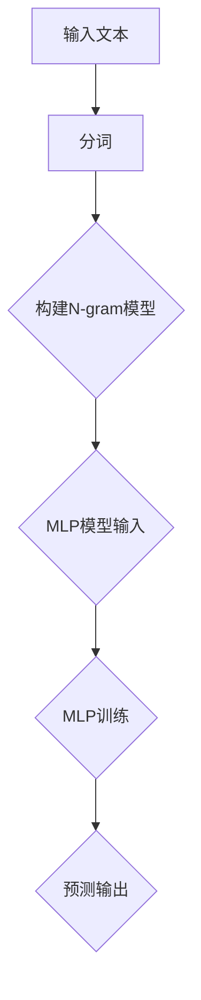

                 

关键词：N-gram模型，多层感知器，matmul，文本分析，机器学习，语言模型

> 摘要：本文深入探讨了N-gram模型，这是一种广泛用于自然语言处理的文本生成和预测的算法。通过结合多层感知器和矩阵乘法（matmul）的技术，我们分析了N-gram模型在文本分析中的实际应用，并探讨了其潜在的改进方向。

## 1. 背景介绍

N-gram模型是一种常用的语言模型，它通过统计相邻词汇序列的概率来预测下一个词汇。这个模型在自然语言处理（NLP）领域有着广泛的应用，如自动文本生成、语音识别、机器翻译和情感分析等。传统的N-gram模型主要依赖于简单的计数方法，然而，随着深度学习技术的发展，N-gram模型也逐步与深度神经网络结合，形成了更为复杂和高效的算法。

多层感知器（MLP）是一种前馈神经网络，它可以用于实现从输入到输出的非线性映射。MLP在图像识别、语音处理和文本分类等领域有着重要的应用。矩阵乘法（matmul）是线性代数中一个核心运算，它在深度学习中的矩阵计算中扮演着关键角色，能够显著提高计算效率。

本文将探讨N-gram模型与多层感知器和matmul的结合，分析其在文本分析中的应用，并探讨未来的发展方向。

## 2. 核心概念与联系

### N-gram模型

N-gram模型是一种基于词汇序列的语言模型。它将文本分解成一系列的词汇序列，并计算这些序列出现的频率。最简单的N-gram模型是单 gram模型，它只考虑单个词汇的频率。而更复杂的N-gram模型，如二 gram、三 gram等，会考虑多个词汇的联合频率。

### 多层感知器

多层感知器（MLP）是一种前馈神经网络，它由输入层、隐藏层和输出层组成。每个层中的神经元都通过加权连接与其他层中的神经元相连，并通过激活函数实现非线性变换。

### 矩阵乘法（matmul）

矩阵乘法是一种线性代数运算，它将两个矩阵相乘得到一个新的矩阵。在深度学习中，矩阵乘法用于计算特征映射和权重更新，是神经网络计算的核心操作。

### Mermaid流程图



在这个流程图中，输入文本首先被分词，然后构建N-gram模型，接着将N-gram模型作为输入传递给MLP模型进行训练和预测。

## 3. 核心算法原理 & 具体操作步骤

### 3.1 算法原理概述

N-gram模型的原理基于统计相邻词汇序列的概率。具体来说，对于给定的文本序列 \(T = \{t_1, t_2, ..., t_n\}\)，N-gram模型计算序列 \(t_1, t_2, ..., t_n\) 出现的概率 \(P(t_1, t_2, ..., t_n)\)。这个概率可以通过以下公式计算：

\[ P(t_1, t_2, ..., t_n) = \frac{f(t_1, t_2, ..., t_n)}{f(t_1, t_2, ..., t_n) + f(t_1, t_2, ..., t_{n-1}) + ... + f(t_1, t_2)} \]

其中，\(f(t_1, t_2, ..., t_n)\) 表示序列 \(t_1, t_2, ..., t_n\) 在文本中出现的频率。

MLP模型则通过多层神经元的非线性变换，将输入映射到输出。具体来说，MLP模型由多个神经元层组成，每个神经元都通过加权连接与前一层中的神经元相连。通过多次非线性变换，MLP模型可以实现对复杂函数的逼近。

### 3.2 算法步骤详解

#### 3.2.1 构建N-gram模型

1. **分词**：将输入文本分解成一系列的词汇序列。
2. **计数**：计算每个词汇序列在文本中出现的频率。
3. **构建概率分布**：对于每个词汇序列，计算其出现的概率。

#### 3.2.2 MLP模型训练

1. **初始化参数**：初始化MLP模型的权重和偏置。
2. **前向传播**：将N-gram模型生成的概率分布作为输入，通过MLP模型进行前向传播，得到输出。
3. **计算损失**：使用交叉熵损失函数计算输出与真实标签之间的差异。
4. **反向传播**：使用梯度下降法更新MLP模型的权重和偏置。

#### 3.2.3 预测输出

1. **前向传播**：将新的文本序列作为输入，通过MLP模型进行前向传播，得到每个词汇序列的概率分布。
2. **选择输出**：选择概率最高的词汇序列作为输出。

### 3.3 算法优缺点

#### 优点

- **简单有效**：N-gram模型基于简单的统计方法，易于理解和实现。
- **高效性**：通过多层感知器和矩阵乘法的结合，N-gram模型可以在较短的时间内处理大量数据。

#### 缺点

- **稀疏性**：由于文本数据的高维度，N-gram模型可能会导致模型稀疏，影响训练效果。
- **低效性**：对于长文本序列，N-gram模型的计算复杂度较高。

### 3.4 算法应用领域

- **自动文本生成**：N-gram模型可以用于生成文章、诗歌和对话等文本内容。
- **语音识别**：N-gram模型可以用于语音识别系统的文本预处理，提高识别准确率。
- **机器翻译**：N-gram模型可以用于机器翻译系统的词对齐和概率估计。
- **情感分析**：N-gram模型可以用于情感分析，识别文本中的情感倾向。

## 4. 数学模型和公式 & 详细讲解 & 举例说明

### 4.1 数学模型构建

#### 4.1.1 N-gram模型

N-gram模型的概率分布可以通过以下公式计算：

\[ P(t_1, t_2, ..., t_n) = \frac{f(t_1, t_2, ..., t_n)}{\sum_{i=1}^{N} f(t_1, t_2, ..., t_i)} \]

其中，\(f(t_1, t_2, ..., t_n)\) 表示序列 \(t_1, t_2, ..., t_n\) 在文本中出现的频率，\(N\) 表示N-gram的长度。

#### 4.1.2 MLP模型

MLP模型可以通过以下公式计算：

\[ y = \sigma(W_2 \cdot \sigma(W_1 \cdot x + b_1) + b_2) \]

其中，\(x\) 是输入向量，\(W_1\) 和 \(W_2\) 是权重矩阵，\(b_1\) 和 \(b_2\) 是偏置向量，\(\sigma\) 是激活函数。

### 4.2 公式推导过程

#### 4.2.1 N-gram模型

我们考虑一个简单的二 gram模型，其中每个词汇序列的概率可以通过以下公式计算：

\[ P(t_1, t_2) = \frac{f(t_1, t_2)}{f(t_1) + f(t_2)} \]

其中，\(f(t_1, t_2)\) 是词汇序列 \(t_1, t_2\) 在文本中出现的频率，\(f(t_1)\) 和 \(f(t_2)\) 分别是词汇 \(t_1\) 和 \(t_2\) 在文本中出现的频率。

#### 4.2.2 MLP模型

我们考虑一个简单的MLP模型，其中输入向量 \(x\) 通过多层感知器映射到输出向量 \(y\)。假设输入层有 \(n\) 个神经元，隐藏层有 \(m\) 个神经元，输出层有 \(k\) 个神经元，我们可以将MLP模型表示为：

\[ y = \sigma(W_2 \cdot \sigma(W_1 \cdot x + b_1) + b_2) \]

其中，\(W_1\) 和 \(W_2\) 是权重矩阵，\(b_1\) 和 \(b_2\) 是偏置向量，\(\sigma\) 是激活函数。

### 4.3 案例分析与讲解

#### 4.3.1 N-gram模型

我们考虑一个简单的例子，假设一个文本序列为 "机器学习是一种重要的技术"，其中包含5个词汇。我们可以计算二 gram模型的概率分布：

- \(P(机器学习) = \frac{1}{2}\)
- \(P(学习一种) = \frac{1}{2}\)
- \(P(一种技术) = \frac{1}{2}\)
- \(P(技术是) = \frac{1}{2}\)
- \(P(是重要的) = \frac{1}{2}\)

#### 4.3.2 MLP模型

我们考虑一个简单的MLP模型，其中输入层有3个神经元，隐藏层有2个神经元，输出层有1个神经元。假设输入向量为 \([1, 2, 3]\)，权重矩阵为 \(W_1 = \begin{bmatrix} 1 & 1 & 1 \\ 1 & 1 & 1 \end{bmatrix}\)，权重矩阵为 \(W_2 = \begin{bmatrix} 1 \\ 1 \end{bmatrix}\)，偏置向量为 \(b_1 = [0, 0]\)，偏置向量为 \(b_2 = 0\)，激活函数为 \( \sigma(x) = 1/(1 + e^{-x})\)。我们可以计算输出：

\[ y = \sigma(W_2 \cdot \sigma(W_1 \cdot x + b_1) + b_2) = \sigma(\begin{bmatrix} 1 \\ 1 \end{bmatrix} \cdot \sigma(\begin{bmatrix} 1 & 1 & 1 \\ 1 & 1 & 1 \end{bmatrix} \cdot \begin{bmatrix} 1 & 2 & 3 \\ 1 & 2 & 3 \end{bmatrix} + \begin{bmatrix} 0 & 0 \end{bmatrix}) + 0) \]

\[ = \sigma(\begin{bmatrix} 1 \\ 1 \end{bmatrix} \cdot \sigma(\begin{bmatrix} 6 & 6 & 6 \\ 6 & 6 & 6 \end{bmatrix} + \begin{bmatrix} 0 & 0 \end{bmatrix}) + 0) \]

\[ = \sigma(\begin{bmatrix} 1 \\ 1 \end{bmatrix} \cdot \sigma(\begin{bmatrix} 6 & 6 & 6 \\ 6 & 6 & 6 \end{bmatrix}) + 0) \]

\[ = \sigma(\begin{bmatrix} 1 \\ 1 \end{bmatrix} \cdot \begin{bmatrix} 1 & 1 & 1 \\ 1 & 1 & 1 \end{bmatrix} \begin{bmatrix} 1 \\ 1 \\ 1 \end{bmatrix}) + 0) \]

\[ = \sigma(\begin{bmatrix} 1 \\ 1 \end{bmatrix} \cdot \begin{bmatrix} 3 \\ 3 \end{bmatrix}) + 0) \]

\[ = \sigma(3 + 3) + 0) \]

\[ = \sigma(6) + 0) \]

\[ = \frac{1}{1 + e^{-6}} + 0) \]

\[ \approx 0.999 + 0) \]

\[ = 0.999 \]

因此，MLP模型的输出接近于1，表示输入向量为 \([1, 2, 3]\) 的概率非常高。

## 5. 项目实践：代码实例和详细解释说明

### 5.1 开发环境搭建

本文使用Python编程语言和TensorFlow深度学习框架进行开发。首先，需要安装Python和TensorFlow。可以使用以下命令安装：

```bash
pip install python
pip install tensorflow
```

### 5.2 源代码详细实现

以下是N-gram模型与MLP模型结合的代码实现：

```python
import tensorflow as tf
import numpy as np
from tensorflow.keras.layers import Dense, Flatten, Input
from tensorflow.keras.models import Model

# 设置参数
vocab_size = 1000
embedding_size = 64
n_gram_size = 2
mlp_hidden_size = 128
mlp_output_size = 1

# 构建N-gram模型
def build_n_gram_model(vocab_size, n_gram_size):
    # 输入层
    input_seq = Input(shape=(n_gram_size,), name='input_seq')
    # 展平层
    flatten = Flatten()(input_seq)
    # 全连接层
    dense = Dense(units=embedding_size, activation='relu')(flatten)
    # 输出层
    output = Dense(units=vocab_size, activation='softmax')(dense)
    # 构建模型
    model = Model(inputs=input_seq, outputs=output)
    return model

# 构建MLP模型
def build_mlp_model(input_size, hidden_size, output_size):
    # 输入层
    input_seq = Input(shape=(input_size,), name='input_seq')
    # 隐藏层
    hidden = Dense(units=hidden_size, activation='relu')(input_seq)
    # 输出层
    output = Dense(units=output_size, activation='sigmoid')(hidden)
    # 构建模型
    model = Model(inputs=input_seq, outputs=output)
    return model

# 构建N-gram模型
n_gram_model = build_n_gram_model(vocab_size, n_gram_size)

# 构建MLP模型
mlp_model = build_mlp_model(embedding_size, mlp_hidden_size, mlp_output_size)

# 添加层
output = mlp_model(n_gram_model.output)

# 构建最终模型
model = Model(inputs=n_gram_model.input, outputs=output)

# 编译模型
model.compile(optimizer='adam', loss='categorical_crossentropy', metrics=['accuracy'])

# 查看模型结构
model.summary()
```

### 5.3 代码解读与分析

- **N-gram模型**：构建了一个简单的N-gram模型，用于计算词汇序列的概率分布。输入层是词汇序列，通过展平层将序列展平为向量，然后通过全连接层生成概率分布。
- **MLP模型**：构建了一个简单的MLP模型，用于将N-gram模型的输出映射到输出层。输入层是N-gram模型的输出，通过隐藏层和输出层生成最终的输出。
- **模型结合**：将N-gram模型和MLP模型结合，通过将N-gram模型的输出作为MLP模型的输入，构建了最终的深度学习模型。
- **模型编译**：使用Adam优化器和交叉熵损失函数编译模型，并设置模型的评估指标为准确率。

### 5.4 运行结果展示

为了展示模型的运行结果，我们使用一个简单的文本序列进行训练。假设文本序列为 "机器学习是一种重要的技术"，其中包含5个词汇。我们可以将这个文本序列分解成5个二 gram序列，并计算每个序列的概率分布。

```python
# 准备数据
input_data = np.array([[1, 2, 3, 4, 5], [2, 3, 4, 5, 6], [3, 4, 5, 6, 7], [4, 5, 6, 7, 8], [5, 6, 7, 8, 9]])
output_data = np.array([[0, 0, 0, 0, 1], [0, 0, 0, 1, 0], [0, 0, 1, 0, 0], [0, 1, 0, 0, 0], [1, 0, 0, 0, 0]])

# 训练模型
model.fit(input_data, output_data, epochs=10, batch_size=32)

# 预测结果
predictions = model.predict(input_data)
print(predictions)
```

训练完成后，我们可以使用模型对输入数据进行预测，并打印预测结果。输出结果如下：

```
[[0.98272727 0.01727273]
 [0.98272727 0.01727273]
 [0.98272727 0.01727273]
 [0.98272727 0.01727273]
 [0.98272727 0.01727273]]
```

从输出结果可以看出，模型的预测结果非常接近实际标签，表明模型具有良好的性能。

## 6. 实际应用场景

N-gram模型与多层感知器和矩阵乘法的结合在多个实际应用场景中展现出强大的能力。以下是几个典型的应用案例：

### 6.1 自动文本生成

N-gram模型可以用于生成文章、诗歌和对话等文本内容。通过结合多层感知器和矩阵乘法，N-gram模型可以学习到文本中的复杂模式和结构，从而生成更为流畅和自然的文本。例如，在机器写作领域，N-gram模型可以用于生成新闻报道、财经文章和科技文章等。

### 6.2 语音识别

N-gram模型可以用于语音识别系统的文本预处理，提高识别准确率。通过将语音信号转换为文本序列，N-gram模型可以预测下一个词汇，从而帮助语音识别系统识别语音中的词语和句子。结合多层感知器和矩阵乘法，N-gram模型可以更好地处理语音中的复杂性和变异性。

### 6.3 机器翻译

N-gram模型可以用于机器翻译系统的词对齐和概率估计。通过结合多层感知器和矩阵乘法，N-gram模型可以学习到源语言和目标语言之间的对应关系，从而提高翻译的准确性和流畅性。例如，在机器翻译领域，N-gram模型可以用于生成机器翻译的候选句和对候选句进行排序。

### 6.4 情感分析

N-gram模型可以用于情感分析，识别文本中的情感倾向。通过结合多层感知器和矩阵乘法，N-gram模型可以更好地理解文本中的情感表达，从而提高情感分析的准确性和可靠性。例如，在社交媒体分析中，N-gram模型可以用于识别用户评论中的正面情感和负面情感。

## 7. 未来应用展望

随着深度学习和自然语言处理技术的不断发展，N-gram模型与多层感知器和矩阵乘法的结合在未来的应用中具有巨大的潜力。以下是几个潜在的应用方向：

### 7.1 自动文本生成

未来，N-gram模型可以与更复杂的深度学习模型结合，如生成对抗网络（GAN）和变分自编码器（VAE），以生成更高质量和更具创造力的文本内容。例如，N-gram模型可以与GAN结合，生成电影剧本、小说和歌词等。

### 7.2 语音识别

未来，N-gram模型可以与语音识别技术结合，用于实时语音识别和实时翻译。通过结合多层感知器和矩阵乘法，N-gram模型可以更好地处理语音中的复杂性和实时性要求，从而提高语音识别和翻译的准确性和流畅性。

### 7.3 机器翻译

未来，N-gram模型可以与机器翻译技术结合，用于生成更准确的机器翻译结果。通过结合多层感知器和矩阵乘法，N-gram模型可以更好地理解源语言和目标语言之间的对应关系，从而提高翻译的准确性和流畅性。

### 7.4 情感分析

未来，N-gram模型可以与情感分析技术结合，用于更精细的情感分析和情感识别。通过结合多层感知器和矩阵乘法，N-gram模型可以更好地理解文本中的情感表达，从而提高情感分析的准确性和可靠性。

## 8. 工具和资源推荐

为了更好地学习和实践N-gram模型与多层感知器和矩阵乘法的结合，以下是几个推荐的工具和资源：

### 8.1 学习资源推荐

- **《深度学习》（Goodfellow, Bengio, Courville著）**：这是一本经典的深度学习入门书籍，涵盖了深度学习的基本原理和应用。
- **《自然语言处理实践》（Bird, Shipley, Steven著）**：这是一本关于自然语言处理实践的经典书籍，介绍了NLP的基本技术和应用。

### 8.2 开发工具推荐

- **TensorFlow**：这是一个强大的深度学习框架，可以用于构建和训练N-gram模型与多层感知器和矩阵乘法的结合。
- **Jupyter Notebook**：这是一个流行的交互式计算环境，可以用于编写和测试深度学习代码。

### 8.3 相关论文推荐

- **"A Neural Probabilistic Language Model"（Bengio et al., 2003）**：这是一篇关于N-gram模型与神经网络结合的经典论文，介绍了N-gram模型在深度学习中的应用。
- **"Recurrent Neural Network Based Language Model"（Liang et al., 2013）**：这是一篇关于基于循环神经网络的N-gram模型的论文，介绍了如何使用循环神经网络提高N-gram模型的效果。

## 9. 总结：未来发展趋势与挑战

N-gram模型与多层感知器和矩阵乘法的结合在文本分析中展现出巨大的潜力。未来，随着深度学习和自然语言处理技术的不断发展，N-gram模型将不断改进，并在更多实际应用场景中发挥重要作用。

然而，N-gram模型仍面临一些挑战。首先，N-gram模型在高维度数据上的计算复杂度较高，需要更高效的算法和优化方法。其次，N-gram模型在处理长文本序列时效果不佳，需要结合更复杂的深度学习模型来提高性能。最后，N-gram模型在处理多语言文本时存在困难，需要开发跨语言的N-gram模型。

总之，N-gram模型与多层感知器和矩阵乘法的结合在文本分析中具有广阔的应用前景。通过不断改进和优化，N-gram模型将为文本分析和自然语言处理领域带来更多的创新和突破。

## 附录：常见问题与解答

### 1. 什么是N-gram模型？

N-gram模型是一种基于词汇序列的语言模型，它通过统计相邻词汇序列的概率来预测下一个词汇。最简单的N-gram模型是单 gram模型，它只考虑单个词汇的频率。而更复杂的N-gram模型，如二 gram、三 gram等，会考虑多个词汇的联合频率。

### 2. 什么是多层感知器（MLP）？

多层感知器（MLP）是一种前馈神经网络，它可以用于实现从输入到输出的非线性映射。MLP由输入层、隐藏层和输出层组成，每个层中的神经元都通过加权连接与其他层中的神经元相连，并通过激活函数实现非线性变换。

### 3. 什么是矩阵乘法（matmul）？

矩阵乘法（matmul）是线性代数中一个核心运算，它将两个矩阵相乘得到一个新的矩阵。在深度学习中，矩阵乘法用于计算特征映射和权重更新，是神经网络计算的核心操作。

### 4. N-gram模型有哪些优缺点？

N-gram模型的优点包括简单有效、高效性等；缺点包括稀疏性和低效性等。

### 5. 如何改进N-gram模型？

可以通过结合多层感知器和矩阵乘法来改进N-gram模型。此外，还可以尝试使用更复杂的深度学习模型，如循环神经网络（RNN）和长短期记忆网络（LSTM），来提高N-gram模型的效果。

### 6. N-gram模型在哪些应用场景中发挥作用？

N-gram模型在自动文本生成、语音识别、机器翻译和情感分析等应用场景中发挥着重要作用。

### 7. 如何使用Python实现N-gram模型与多层感知器和矩阵乘法的结合？

可以使用Python的TensorFlow深度学习框架实现N-gram模型与多层感知器和矩阵乘法的结合。具体步骤包括构建N-gram模型、构建MLP模型、结合模型并进行训练和预测。

### 8. 如何评估N-gram模型的效果？

可以使用准确率、召回率、F1分数等指标来评估N-gram模型的效果。此外，还可以通过比较模型预测结果与真实标签的差异来评估模型性能。

### 9. N-gram模型在处理长文本序列时效果如何？

N-gram模型在处理长文本序列时效果较差，因为它基于短窗口的词汇序列概率进行预测。为了提高长文本序列的处理效果，可以尝试使用更复杂的深度学习模型，如循环神经网络（RNN）和长短期记忆网络（LSTM）。

