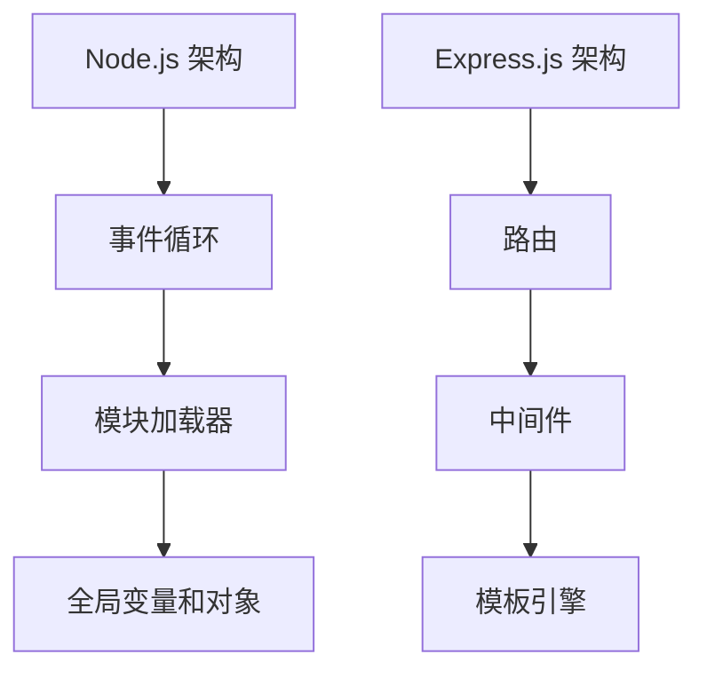

                 

关键词：Node.js，Express，JavaScript，服务器端开发，应用架构，性能优化

摘要：本文将深入探讨 Node.js 和 Express.js 在现代 Web 应用开发中的应用。我们将从背景介绍出发，逐步讲解核心概念、算法原理、数学模型、实际应用案例，并总结其未来发展。

## 1. 背景介绍

在 Web 开发领域，服务器端技术的演变可谓日新月异。随着 JavaScript 的崛起，Node.js 和 Express.js 成为了服务器端开发的重要工具。Node.js 是一个基于 Chrome V8 引擎的 JavaScript 运行时环境，它允许开发者使用 JavaScript 编写后端代码。Express.js 则是一个轻量级的 Web 应用框架，它为 Node.js 提供了一套易于使用的 API。

Node.js 和 Express.js 的流行，主要得益于以下几个原因：

1. **单线程非阻塞 I/O**：Node.js 采用事件驱动、非阻塞 I/O 模型，能够高效处理大量并发请求。
2. **JavaScript 一致性**：由于 Node.js 和前端 JavaScript 使用相同的语言，使得开发者可以更加高效地进行全栈开发。
3. **模块化**：Node.js 和 Express.js 支持模块化开发，便于代码管理和复用。
4. **生态丰富**：Node.js 拥有庞大的生态系统，丰富的第三方模块为开发者提供了多样化的选择。

## 2. 核心概念与联系

### 2.1 Node.js 的架构

Node.js 的核心是 V8 引擎，它负责解析和执行 JavaScript 代码。Node.js 的运行时环境还包括：

- **事件循环**：负责处理异步任务，确保非阻塞 I/O。
- **模块加载器**：负责加载和解析 Node.js 模块。
- **全局变量和对象**：如 `process`、`Buffer` 等。

### 2.2 Express.js 的核心概念

Express.js 是一个 Web 应用框架，它提供了丰富的中间件、路由和模板等功能。其核心概念包括：

- **路由**：定义 URL 和处理函数之间的映射关系。
- **中间件**：用于处理 HTTP 请求和响应的函数。
- **模板引擎**：用于渲染 HTML 页面。

### 2.3 Mermaid 流程图



## 3. 核心算法原理 & 具体操作步骤

### 3.1 算法原理概述

Node.js 的核心算法原理是基于事件驱动模型，这保证了 I/O 操作的高效性和异步性。在 Express.js 中，算法原理主要体现在路由解析和中间件处理。

### 3.2 算法步骤详解

1. **Node.js 事件循环**：
   - 执行栈中的代码顺序执行。
   - 当执行到一个异步操作时，将其放入事件队列。
   - 当主线程空闲时，事件循环从事件队列中取一个事件执行。

2. **Express.js 路由解析**：
   - 通过 URL 和 HTTP 方法匹配路由。
   - 调用相应的处理函数。

3. **中间件处理**：
   - 中间件函数按顺序执行。
   - 每个中间件可以修改请求和响应对象，或者决定是否继续执行下一个中间件。

### 3.3 算法优缺点

**优点**：
- **高效性**：非阻塞 I/O，能够处理大量并发请求。
- **一致性**：前端和后端使用相同语言，提高开发效率。

**缺点**：
- **单线程模型**：对于需要大量计算的任务，可能无法充分利用多核 CPU。
- **异步编程**：异步编程模型复杂，初学者难以理解。

### 3.4 算法应用领域

Node.js 和 Express.js 广泛应用于实时 Web 应用、API 服务、物联网等场景。

## 4. 数学模型和公式 & 详细讲解 & 举例说明

### 4.1 数学模型构建

在 Node.js 和 Express.js 中，我们可以使用数学模型来优化性能和资源利用。

### 4.2 公式推导过程

设 \( N \) 为并发请求数，\( T \) 为处理单个请求的时间，\( P \) 为系统性能。

\[ P = \frac{N}{T} \]

### 4.3 案例分析与讲解

假设我们有一个服务，每秒可以处理 100 个请求，每个请求处理时间平均为 0.1 秒。则：

\[ P = \frac{100}{0.1} = 1000 \]

这意味着我们的系统每秒可以处理 1000 个请求。

## 5. 项目实践：代码实例和详细解释说明

### 5.1 开发环境搭建

1. 安装 Node.js：
   ```bash
   npm install -g nodejs
   ```

2. 安装 Express.js：
   ```bash
   npm install express
   ```

### 5.2 源代码详细实现

以下是一个简单的 Express.js 应用示例：

```javascript
const express = require('express');
const app = express();

app.get('/', (req, res) => {
  res.send('Hello, World!');
});

const port = 3000;
app.listen(port, () => {
  console.log(`Server running on http://localhost:${port}`);
});
```

### 5.3 代码解读与分析

- `require('express')`：引入 Express 模块。
- `app.get('/')`：定义一个路由，处理根路径的 GET 请求。
- `res.send('Hello, World!')`：向客户端发送响应。

### 5.4 运行结果展示

运行以上代码后，在浏览器中访问 `http://localhost:3000`，会看到如下输出：

```plaintext
Hello, World!
```

## 6. 实际应用场景

Node.js 和 Express.js 在多个领域有广泛应用，包括：

- **实时聊天应用**：如 Slack、Discord。
- **API 服务**：如 RESTful API、GraphQL 服务。
- **物联网应用**：如智能家居、智能城市。

## 7. 工具和资源推荐

### 7.1 学习资源推荐

- 《Node.js 实战》
- 《Express.js 实战》
- Node.js 官方文档
- Express.js 官方文档

### 7.2 开发工具推荐

- Visual Studio Code
- IntelliJ IDEA
- Node.js CLI

### 7.3 相关论文推荐

- 《Node.js: single-threaded asynchronous programming on JavaScript》
- 《Express.js: Fast, unopinionated, minimalist web framework for Node.js》

## 8. 总结：未来发展趋势与挑战

Node.js 和 Express.js 在未来将继续发展，面临以下挑战：

- **性能优化**：如何在保持高性能的同时，更好地利用多核 CPU。
- **安全性**：随着应用场景的扩展，如何确保系统的安全性。
- **全栈开发**：如何更好地整合前端和后端开发，提高开发效率。

## 9. 附录：常见问题与解答

### Q: Node.js 是什么？

A: Node.js 是一个基于 Chrome V8 引擎的 JavaScript 运行时环境，它允许开发者使用 JavaScript 编写后端代码。

### Q: Express.js 是什么？

A: Express.js 是一个轻量级的 Web 应用框架，它为 Node.js 提供了一套易于使用的 API。

### Q: Node.js 和 Express.js 的优点是什么？

A: Node.js 和 Express.js 的优点包括单线程非阻塞 I/O、JavaScript 一致性、模块化等。

---

作者：禅与计算机程序设计艺术 / Zen and the Art of Computer Programming
----------------------------------------------------------------

以上就是本文的完整内容，希望对您有所帮助。在未来的发展中，Node.js 和 Express.js 将继续发挥重要作用，为 Web 开发带来更多的可能。

