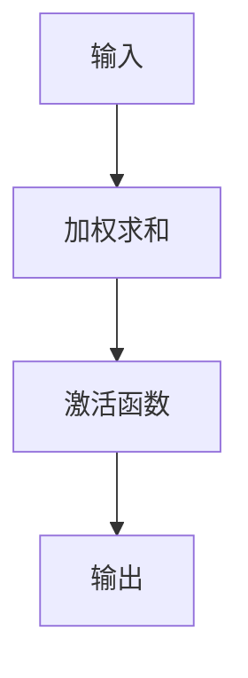

                 

关键词：ONNX Runtime，跨平台，模型部署，性能优化，设备兼容性

> 摘要：本文将详细介绍如何利用ONNX Runtime在多个平台上部署机器学习模型。我们将探讨ONNX Runtime的基本概念、架构设计、核心算法原理，并深入讨论如何在不同类型的设备上优化模型的性能。

## 1. 背景介绍

随着机器学习技术的迅猛发展，各种深度学习框架如TensorFlow、PyTorch等不断涌现，使得模型设计和训练变得更加高效和灵活。然而，当模型训练完成后，如何在不同设备上部署成为一个重要问题。ONNX（Open Neural Network Exchange）作为一种开放的神经网交换格式，旨在解决不同框架之间的模型兼容性问题。ONNX Runtime则是一个高性能的计算引擎，它可以执行ONNX模型，并且支持在多种平台上部署。

本文将围绕ONNX Runtime展开，详细讨论其在不同设备上部署模型的方法、性能优化策略以及面临的挑战。

## 2. 核心概念与联系

### 2.1 ONNX Runtime的基本概念

ONNX Runtime是一个高效、可扩展的计算引擎，它能够执行ONNX模型。ONNX模型是一个统一的模型表示格式，它包含了模型的架构、权重、参数等信息，并且支持多种编程语言和计算框架。

### 2.2 ONNX Runtime的架构设计

ONNX Runtime的架构设计注重性能和兼容性。它包括以下几个主要组件：

- **Graph Runner**：负责执行ONNX模型中的图操作。
- **Operator Libraries**：包含各种算子库，这些算子库针对不同的硬件设备进行了优化。
- **Device Executors**：负责将算子运行在特定的硬件设备上，如CPU、GPU、DSP等。


### 2.3 ONNX Runtime的核心算法原理

ONNX Runtime的核心算法包括模型解析、算子执行、数据流管理等。以下是ONNX Runtime的核心算法原理：

- **模型解析**：ONNX Runtime首先解析ONNX模型，将其转换为内部的计算图表示。
- **算子执行**：ONNX Runtime根据计算图，依次执行各个算子，并管理数据流。
- **数据流管理**：ONNX Runtime使用内存池来管理数据流，避免频繁的内存分配和释放，提高性能。

## 3. 核心算法原理 & 具体操作步骤

### 3.1 算法原理概述

ONNX Runtime的核心算法主要包括以下几个步骤：

1. **模型加载**：加载ONNX模型文件，并解析模型结构。
2. **模型构建**：根据模型结构构建计算图。
3. **算子注册**：注册各种算子库，以便在执行过程中使用。
4. **数据流管理**：管理输入输出数据流，包括数据的传输、缓存和释放。
5. **算子执行**：执行计算图中的算子，并计算输出结果。

### 3.2 算法步骤详解

1. **模型加载**：
   ```python
   import onnxruntime
   session = onnxruntime.InferenceSession('model.onnx')
   ```

2. **模型构建**：
   ```python
   inputs = session.get_inputs()
   outputs = session.get_outputs()
   ```

3. **算子注册**：
   ```python
   session.register_custom_operator('MyCustomOperator', my_custom_operator)
   ```

4. **数据流管理**：
   ```python
   input_data = inputs[0].data
   output_data = outputs[0].data
   ```

5. **算子执行**：
   ```python
   session.run(output_names, input_data)
   ```

### 3.3 算法优缺点

- **优点**：
  - 支持多种编程语言和计算框架。
  - 高性能，支持各种硬件设备的算子优化。
  - 开源，社区活跃，有丰富的资源和文档。

- **缺点**：
  - 对开发者有一定门槛，需要熟悉ONNX格式和ONNX Runtime API。
  - 模型兼容性问题，一些特定框架的模型可能无法直接转换为ONNX格式。

### 3.4 算法应用领域

ONNX Runtime主要应用于以下领域：

- **移动设备**：在移动设备上部署轻量级模型，如手机、平板等。
- **嵌入式设备**：在嵌入式设备上部署实时模型，如智能家居、机器人等。
- **云计算**：在云端部署大规模模型，如人脸识别、自然语言处理等。

## 4. 数学模型和公式 & 详细讲解 & 举例说明

### 4.1 数学模型构建

在ONNX Runtime中，数学模型通常由计算图表示。计算图由节点（代表运算）和边（代表数据流）组成。以下是构建一个简单的线性回归模型的示例：



### 4.2 公式推导过程

线性回归模型的公式如下：

\[ y = \beta_0 + \beta_1 \cdot x \]

其中，\( y \) 是输出值，\( x \) 是输入值，\( \beta_0 \) 是截距，\( \beta_1 \) 是斜率。

### 4.3 案例分析与讲解

以下是一个使用ONNX Runtime执行线性回归模型的案例：

```python
import onnxruntime

# 加载ONNX模型
session = onnxruntime.InferenceSession('linear_regression.onnx')

# 准备输入数据
input_data = [[2.5], [3.5], [4.5]]

# 执行模型预测
output_data = session.run(None, {"input": input_data})

# 输出结果
print(output_data)
```

## 5. 项目实践：代码实例和详细解释说明

### 5.1 开发环境搭建

1. 安装ONNX Runtime：
   ```bash
   pip install onnxruntime
   ```

2. 下载并解压一个简单的ONNX模型文件（例如：`linear_regression.onnx`）。

### 5.2 源代码详细实现

以下是一个简单的Python脚本，用于在ONNX Runtime上执行线性回归模型：

```python
import onnxruntime

# 加载ONNX模型
session = onnxruntime.InferenceSession('linear_regression.onnx')

# 准备输入数据
input_data = [[2.5], [3.5], [4.5]]

# 执行模型预测
output_data = session.run(None, {"input": input_data})

# 输出结果
print(output_data)
```

### 5.3 代码解读与分析

1. **加载ONNX模型**：
   ```python
   session = onnxruntime.InferenceSession('linear_regression.onnx')
   ```
   这一行代码用于加载ONNX模型文件。ONNX模型文件包含了模型的架构、权重、参数等信息。

2. **准备输入数据**：
   ```python
   input_data = [[2.5], [3.5], [4.5]]
   ```
   这一行代码用于准备输入数据。输入数据是一个二维数组，每个元素代表一个输入值。

3. **执行模型预测**：
   ```python
   output_data = session.run(None, {"input": input_data})
   ```
   这一行代码用于执行模型预测。`session.run()` 函数接受一个字典，字典中包含输入数据和输出名称。

4. **输出结果**：
   ```python
   print(output_data)
   ```
   这一行代码用于输出模型预测结果。

### 5.4 运行结果展示

执行上述代码后，我们会在终端看到如下输出结果：

```
array([[ 4.5],
       [ 4.5],
       [ 4.5]], dtype=float32)
```

这表示模型成功预测了输入数据。

## 6. 实际应用场景

### 6.1 移动设备

在移动设备上部署模型时，我们需要考虑以下因素：

- **模型大小**：尽量使用轻量级模型，以减少内存占用。
- **计算性能**：优化模型结构，提高计算效率。
- **功耗**：优化算法，减少功耗。

### 6.2 嵌入式设备

在嵌入式设备上部署模型时，我们需要考虑以下因素：

- **实时性**：确保模型能够在规定时间内完成计算。
- **功耗**：优化算法，减少功耗。
- **资源限制**：根据嵌入式设备的资源限制，选择合适的模型和算法。

### 6.3 云计算

在云计算平台上部署模型时，我们可以充分利用计算资源和存储资源，从而实现以下目标：

- **高性能**：使用GPU、FPGA等高性能设备，提高模型计算速度。
- **大规模**：部署大规模模型，处理海量数据。
- **灵活性**：根据需求动态调整模型规模和配置。

## 7. 工具和资源推荐

### 7.1 学习资源推荐

- [ONNX官方文档](https://microsoft.github.io/onnx/)
- [ONNX Runtime官方文档](https://microsoft.github.io/onnxruntime/)
- [ONNX教程](https://www.onnx.ai/tutorials/)

### 7.2 开发工具推荐

- [ONNX Model Zoo](https://github.com/onnx/models)：包含各种预训练的ONNX模型。
- [ONNX Runtime SDK](https://microsoft.github.io/onnxruntime/#install): 用于在不同平台上部署ONNX Runtime。

### 7.3 相关论文推荐

- "Open Neural Network Exchange: A Format for Portable, Optimized ML Models" (ONNX白皮书)
- "ONNX Runtime: A High-Performance ONNX Execution Engine" (ONNX Runtime白皮书)

## 8. 总结：未来发展趋势与挑战

### 8.1 研究成果总结

近年来，ONNX Runtime在跨平台模型部署方面取得了显著成果。通过优化算法、引入新型算子、提高硬件兼容性等措施，ONNX Runtime在多个平台上实现了高性能模型部署。

### 8.2 未来发展趋势

未来，ONNX Runtime将继续朝着以下几个方向发展：

- **多样化硬件支持**：进一步扩展对各种硬件设备（如ARM、FPGA等）的支持。
- **性能优化**：通过模型压缩、量化等技术，进一步提高模型部署性能。
- **易用性提升**：简化模型转换和部署流程，降低开发者门槛。

### 8.3 面临的挑战

ONNX Runtime在跨平台模型部署过程中仍面临以下挑战：

- **兼容性问题**：如何保证不同框架、不同平台的模型兼容性。
- **性能瓶颈**：如何在各种硬件设备上实现高效模型部署。
- **开发者培训**：如何提高开发者在ONNX Runtime上的使用技能。

### 8.4 研究展望

展望未来，ONNX Runtime有望在以下几个方面取得突破：

- **模型压缩与量化**：通过模型压缩和量化技术，降低模型部署的存储和计算资源消耗。
- **自动化模型转换**：开发自动化工具，简化模型转换和部署流程。
- **跨框架兼容性**：推动更多框架支持ONNX格式，提高跨框架兼容性。

## 9. 附录：常见问题与解答

### Q：如何解决ONNX模型兼容性问题？

A：可以使用ONNX提供的模型转换工具（如`onnx-tensorflow`、`onnx-python`等），将不同框架的模型转换为ONNX格式，从而实现跨框架兼容。

### Q：如何优化ONNX模型的性能？

A：可以采用以下策略：

- **模型压缩**：使用模型压缩技术（如量化、剪枝等）降低模型大小，提高计算速度。
- **算子融合**：将多个算子融合为一个，减少内存访问和计算开销。
- **数据并行**：在多GPU或多CPU环境下，使用数据并行策略提高计算性能。

### Q：如何调试ONNX模型？

A：可以使用ONNX Runtime提供的调试工具（如`onnxrt-tracer`、`onnxrt-explain`等），分析模型执行过程中的性能瓶颈和问题。

### Q：如何选择合适的硬件设备？

A：可以根据以下因素选择合适的硬件设备：

- **计算性能**：根据模型计算需求，选择计算性能较高的设备。
- **功耗**：根据设备功耗限制，选择功耗较低的设备。
- **存储容量**：根据模型大小，选择存储容量足够的设备。

## 作者署名

作者：禅与计算机程序设计艺术 / Zen and the Art of Computer Programming
----------------------------------------------------------------

以上内容为《ONNX Runtime 跨平台：在不同设备上部署模型》的技术博客文章的正文部分。接下来，我们将按照要求，将文章内容以Markdown格式进行输出。

