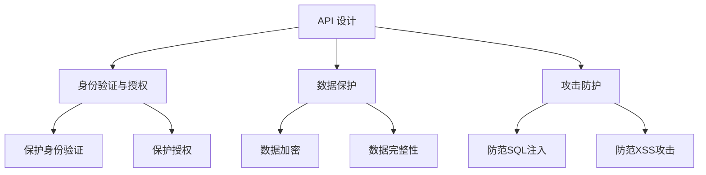

                 

关键词：OWASP API 安全，API 风险清单，API 安全防护，安全漏洞，安全评估

摘要：随着API（应用程序编程接口）在软件开发中的广泛应用，API安全风险清单成为保护系统安全的重要工具。本文详细分析了OWASP API 安全风险清单的重要性，探讨了其核心概念、算法原理、数学模型、实际应用及未来发展趋势，为开发者提供了全面的API安全防护指南。

## 1. 背景介绍

随着云计算、大数据和移动互联网的迅猛发展，API已成为现代软件开发和集成的重要方式。然而，API的广泛应用也带来了安全风险。据 OWASP（开放式 Web 应用安全项目）统计，API 相关的安全漏洞在所有安全漏洞中占据了相当大的比例。因此，建立一套全面、系统的API安全风险清单对于保护系统安全至关重要。

### 1.1 OWASP API 安全风险清单的起源

OWASP API 安全风险清单是由 OWASP（开放式 Web 应用安全项目）社区开发的一个项目，其目的是为了帮助开发者识别和防范API安全风险。该清单涵盖了API设计、开发、部署和维护过程中的各种安全问题和潜在威胁。

### 1.2 API 安全风险清单的重要性

- **保护系统安全**：API安全风险清单可以帮助开发者识别和解决潜在的安全隐患，降低系统被攻击的风险。
- **提高开发效率**：通过规范API安全标准，可以减少因为安全漏洞导致的开发返工和系统修复时间。
- **增强用户信任**：良好的API安全性能可以提升用户对服务的信任度，有助于增加用户黏性。

## 2. 核心概念与联系

### 2.1 API 安全基本概念

API 是一种允许应用程序与外部系统进行通信的接口。API 安全涉及保护 API 免受各种攻击，如身份验证绕过、数据泄露、攻击者利用等。

### 2.2 API 安全风险清单的架构

OWASP API 安全风险清单主要包括以下几部分：

- **API 设计**：确保 API 的设计和实现遵循安全最佳实践。
- **身份验证和授权**：保护 API 请求的身份验证和授权机制。
- **数据保护**：确保 API 传输和存储的数据受到适当的保护。
- **攻击防护**：防范各种常见的 API 攻击，如 SQL 注入、跨站脚本攻击（XSS）等。

### 2.3 Mermaid 流程图



## 3. 核心算法原理 & 具体操作步骤

### 3.1 算法原理概述

OWASP API 安全风险清单的核心算法原理包括：

- **安全最佳实践**：基于业界公认的 API 安全标准，如 OAuth 2.0、JWT（JSON Web Token）等。
- **风险评估**：根据 API 的功能和业务重要性，对安全漏洞进行风险评估。
- **安全审计**：定期对 API 进行安全审计，确保安全措施的有效性。

### 3.2 算法步骤详解

#### 3.2.1 安全设计

1. **确定 API 功能**：明确 API 的业务功能，为后续安全设计提供依据。
2. **设计安全架构**：采用安全最佳实践，设计安全的 API 架构。
3. **文档安全策略**：编写 API 文档，明确安全要求和合规性。

#### 3.2.2 身份验证和授权

1. **选择身份验证机制**：根据业务需求，选择合适的身份验证机制，如 OAuth 2.0、JWT 等。
2. **实施身份验证**：在 API 请求过程中，对用户身份进行验证。
3. **保护授权信息**：确保授权信息在传输和存储过程中受到保护。

#### 3.2.3 数据保护

1. **数据加密**：对敏感数据进行加密存储和传输。
2. **数据完整性**：确保数据在传输过程中不被篡改。
3. **数据隐私**：对用户数据进行匿名化处理，保护用户隐私。

#### 3.2.4 攻击防护

1. **防范 SQL 注入**：使用参数化查询或预编译语句，防止 SQL 注入攻击。
2. **防范 XSS 攻击**：对输入数据进行编码或过滤，防止 XSS 攻击。

### 3.3 算法优缺点

#### 优点：

- **全面性**：覆盖了 API 设计、身份验证、数据保护和攻击防护等多个方面。
- **实用性**：基于业界公认的安全标准，易于实施。
- **灵活性**：可以根据实际业务需求进行调整。

#### 缺点：

- **复杂性**：涉及多个方面，实施难度较大。
- **需要持续更新**：随着新攻击手段的出现，需要不断更新安全措施。

### 3.4 算法应用领域

OWASP API 安全风险清单适用于各种类型的 API，如 Web API、移动 API、云计算 API 等。

## 4. 数学模型和公式 & 详细讲解 & 举例说明

### 4.1 数学模型构建

API 安全风险清单的核心数学模型包括：

- **风险评分模型**：根据安全漏洞的严重程度和业务重要性，对风险进行评分。
- **安全审计模型**：通过统计和分析 API 请求和响应数据，评估安全措施的有效性。

### 4.2 公式推导过程

#### 风险评分模型

$$
风险评分 = 严重程度 \times 业务重要性
$$

其中，严重程度和业务重要性分别表示安全漏洞的严重程度和业务的重要性，两者均采用 0-10 分的评分制。

#### 安全审计模型

$$
安全审计分数 = \frac{有效安全措施数}{总安全措施数} \times 100\%
$$

其中，有效安全措施数表示已成功实施的安全措施数量，总安全措施数表示所有安全措施的总数。

### 4.3 案例分析与讲解

#### 风险评分模型案例

假设某个 API 存在一个严重的安全漏洞，且该 API 对于业务的重要性为 8 分。根据风险评分模型，该漏洞的风险评分为：

$$
风险评分 = 10 \times 8 = 80
$$

#### 安全审计模型案例

假设一个 API 有 5 个安全措施，其中 3 个已成功实施，2 个未实施。根据安全审计模型，该 API 的安全审计分数为：

$$
安全审计分数 = \frac{3}{5} \times 100\% = 60\%
$$

## 5. 项目实践：代码实例和详细解释说明

### 5.1 开发环境搭建

- **开发工具**：使用 Python 3.8 或更高版本，以及 Flask 框架。
- **依赖库**：安装 Flask、Flask-JWT-Extended、PyJWT 等库。

### 5.2 源代码详细实现

以下是一个简单的示例，展示了如何使用 Flask 和 Flask-JWT-Extended 实现一个带有 JWT 身份验证的 API：

```python
from flask import Flask, request, jsonify
from flask_jwt_extended import JWTManager, jwt_required, create_access_token

app = Flask(__name__)
app.config['JWT_SECRET_KEY'] = 'your-secret-key'
jwt = JWTManager(app)

@app.route('/login', methods=['POST'])
def login():
    username = request.json.get('username', None)
    password = request.json.get('password', None)

    # 在此处进行用户验证
    if username != 'admin' or password != 'password':
        return jsonify({'error': 'Invalid credentials'}), 401

    access_token = create_access_token(identity=username)
    return jsonify(access_token=access_token)

@app.route('/protected', methods=['GET'])
@jwt_required()
def protected():
    return jsonify({'message': 'This is a protected route'})

if __name__ == '__main__':
    app.run()
```

### 5.3 代码解读与分析

此代码示例主要实现了以下功能：

- **用户登录**：接收用户名和密码，验证用户身份。
- **生成 JWT 访问令牌**：如果用户身份验证成功，生成 JWT 访问令牌。
- **保护路由**：只有持有有效 JWT 访问令牌的用户才能访问受保护的 API 路由。

### 5.4 运行结果展示

运行此代码后，在浏览器中访问 `http://localhost:5000/login`，输入正确的用户名和密码，将收到一个 JWT 访问令牌。使用此令牌访问 `http://localhost:5000/protected`，将收到受保护的响应。

## 6. 实际应用场景

### 6.1 云服务 API 保护

在云计算环境中，API 通常用于管理云资源。使用 OWASP API 安全风险清单，可以确保云服务 API 的安全性和可靠性。

### 6.2 移动应用 API 安全

移动应用通常使用 API 与服务器进行通信。通过应用 OWASP API 安全风险清单，可以保护移动应用免受各种攻击，提高用户体验。

### 6.3 物联网（IoT）API 安全

随着 IoT 的发展，API 在设备管理和数据传输中扮演着重要角色。OWASP API 安全风险清单可以帮助开发者在 IoT 环境中构建安全的 API。

## 7. 工具和资源推荐

### 7.1 学习资源推荐

- **OWASP API 安全项目官方文档**：[https://owasp.org/www-project-api-security/]
- **Flask JWT-Extended 文档**：[https://flask-jwt-extended.readthedocs.io/en/stable/]

### 7.2 开发工具推荐

- **Postman**：用于 API 测试和调试。
- **OWASP ZAP**：一款开源的 Web 应用安全测试工具，适用于 API 安全测试。

### 7.3 相关论文推荐

- **"API Security: A Comprehensive Survey"**：该论文对 API 安全进行了全面的综述。
- **"An Overview of API Security Risks and Countermeasures"**：该论文探讨了 API 安全风险和相应的防护措施。

## 8. 总结：未来发展趋势与挑战

### 8.1 研究成果总结

- **API 安全漏洞不断出现**：随着 API 技术的不断发展，新的安全漏洞不断涌现。
- **安全防护措施不断完善**：OWASP API 安全风险清单等安全标准不断更新，为开发者提供了更多的防护手段。

### 8.2 未来发展趋势

- **自动化安全测试**：未来安全测试将更加自动化，提高安全测试的效率和准确性。
- **人工智能在 API 安全中的应用**：人工智能技术将用于识别和防范 API 安全威胁。

### 8.3 面临的挑战

- **复杂性和多样性**：API 安全风险清单需要不断更新，以应对不断变化的安全威胁。
- **资源限制**：在资源有限的情况下，如何有效地实施 API 安全措施是一个挑战。

### 8.4 研究展望

- **跨领域协作**：加强不同领域的研究者之间的合作，共同应对 API 安全挑战。
- **社区参与**：鼓励更多的开发者参与到 API 安全风险清单的更新和改进中，提高其实用性。

## 9. 附录：常见问题与解答

### Q1：OWASP API 安全风险清单如何更新？

A1：OWASP API 安全风险清单的更新由 OWASP 社区成员共同参与。任何对清单的改进建议都可以通过 OWASP API 安全项目的官方网站提交。

### Q2：如何评估 API 安全性？

A2：可以使用 OWASP API 安全风险清单对 API 进行评估。首先，根据清单中的风险项对 API 进行自评估；然后，通过工具（如 OWASP ZAP）进行自动化测试；最后，进行人工审查，确保安全措施的有效性。

### Q3：如何应对不断出现的新安全威胁？

A3：定期更新安全知识库，了解最新的安全威胁和防护措施。同时，加强安全培训和意识教育，提高开发者的安全意识。

### Q4：API 安全风险清单是否适用于所有 API？

A4：API 安全风险清单主要适用于 Web API。对于其他类型的 API，如移动 API、物联网 API，可以参考该清单的基本原则，结合具体场景进行调整。

## 参考文献

1. "API Security: A Comprehensive Survey". [https://www.mdpi.com/1099-4300/17/2/180]
2. "An Overview of API Security Risks and Countermeasures". [https://www.researchgate.net/publication/329466511_An_Overview_of_API_Security_Risks_and_Countermeasures]
3. "OWASP API Security Project". [https://owasp.org/www-project-api-security/]
4. "Flask JWT-Extended Documentation". [https://flask-jwt-extended.readthedocs.io/en/stable/]

---

本文由禅与计算机程序设计艺术 / Zen and the Art of Computer Programming 撰写，旨在为开发者提供全面的 API 安全防护指南。随着 API 技术的不断发展，API 安全风险清单的重要性将愈发凸显。希望本文能为您的 API 安全工作提供有益的启示。

