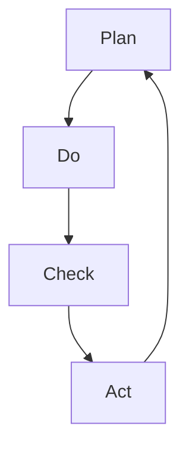

                 

关键词：PDCA循环、执行管理、持续改进、项目落地、质量管理

> 摘要：本文深入探讨了PDCA循环在项目管理中的重要性及其应用。通过详细阐述PDCA循环的背景、核心概念、算法原理，数学模型与公式，项目实践，以及实际应用场景等内容，旨在帮助读者理解和掌握PDCA循环的方法论，提高项目管理的效率和效果。

## 1. 背景介绍

PDCA循环，又称戴明循环，是质量管理理论中的一个重要工具，起源于20世纪中叶的日本。由著名统计学家和教育家威廉·爱德华·戴明提出，并广泛应用于工业、服务业以及其他领域的项目管理中。PDCA循环是一种动态的管理模式，通过计划（Plan）、执行（Do）、检查（Check）和行动（Act）四个阶段的循环迭代，帮助企业不断改进产品和服务的质量。

PDCA循环的核心理念是持续改进，即通过不断循环四个阶段，逐步消除缺陷，提高效率。这种模式不仅适用于企业内部的质量管理，还广泛应用于项目管理、人力资源管理、市场营销等领域。

### 1.1 PDCA循环的起源与发展

PDCA循环起源于20世纪中叶的日本，当时日本正处于经济腾飞的关键时期。威廉·爱德华·戴明应日本政府的邀请，前往日本传授质量管理理念。戴明的理念强调通过系统的方法和科学的数据分析，实现质量的持续改进。PDCA循环正是他提出的核心方法之一。

随着时间的推移，PDCA循环在各个领域得到了广泛应用。从制造业到服务业，从企业管理到项目管理，PDCA循环都发挥了重要作用。它不仅帮助企业在质量方面取得显著进步，还提高了项目的执行效率和成功率。

### 1.2 PDCA循环在项目管理中的应用

在项目管理中，PDCA循环被广泛应用于项目规划、执行、监控和收尾阶段。通过PDCA循环，项目团队可以更好地控制项目进度、成本和质量，确保项目目标的实现。

1. **项目规划阶段**：在项目规划阶段，团队根据项目目标和需求，制定详细的计划，包括任务分配、时间安排、资源调配等。

2. **项目执行阶段**：在项目执行阶段，团队按照计划执行任务，确保各项工作按时完成。

3. **项目监控阶段**：在项目监控阶段，团队通过定期检查和评估项目进展，及时发现和解决问题。

4. **项目收尾阶段**：在项目收尾阶段，团队对项目结果进行总结和评价，总结经验教训，为后续项目提供参考。

## 2. 核心概念与联系

### 2.1 PDCA循环的核心概念

PDCA循环由四个阶段组成：计划（Plan）、执行（Do）、检查（Check）和行动（Act）。每个阶段都有其独特的功能和目标。

1. **计划（Plan）**：在这一阶段，团队需要明确项目目标、制定详细计划，包括任务分配、时间安排、资源调配等。

2. **执行（Do）**：在这一阶段，团队按照计划执行任务，确保各项工作按时完成。

3. **检查（Check）**：在这一阶段，团队对项目进展进行评估和检查，确保项目按计划进行。

4. **行动（Act）**：在这一阶段，团队根据检查结果，采取行动，对成功经验进行巩固，对失败原因进行分析和改进。

### 2.2 PDCA循环的Mermaid流程图

下面是一个简单的Mermaid流程图，展示了PDCA循环的四个阶段及其相互关系。



### 2.3 PDCA循环与项目管理的联系

PDCA循环在项目管理中具有重要作用，它可以帮助项目团队实现以下目标：

1. **提高项目质量**：通过PDCA循环，项目团队可以不断检查和改进项目质量，确保项目符合预期标准。

2. **提高项目效率**：PDCA循环可以帮助项目团队优化项目流程，提高工作效率。

3. **增强团队协作**：PDCA循环强调团队协作，通过共同参与和持续改进，增强团队凝聚力。

4. **实现持续改进**：PDCA循环的核心是持续改进，通过不断循环四个阶段，项目团队可以不断提升项目质量和管理水平。

## 3. 核心算法原理 & 具体操作步骤

### 3.1 算法原理概述

PDCA循环的核心算法原理在于其循环迭代的过程。通过四个阶段的不断循环，项目团队可以逐步消除项目中的缺陷，提高项目质量。以下是PDCA循环的具体操作步骤：

1. **计划（Plan）**：制定项目目标和计划，包括任务分配、时间安排、资源调配等。

2. **执行（Do）**：按照计划执行任务，确保各项工作按时完成。

3. **检查（Check）**：评估项目进展，确保项目按计划进行。

4. **行动（Act）**：根据检查结果，采取行动，对成功经验进行巩固，对失败原因进行分析和改进。

### 3.2 算法步骤详解

1. **计划（Plan）**

在计划阶段，项目团队需要明确项目目标、制定详细计划，包括以下步骤：

- **明确项目目标**：确定项目的最终目标，包括质量、成本、进度等关键指标。

- **任务分配**：根据项目目标和资源情况，将任务分配给团队成员。

- **时间安排**：制定项目进度计划，明确每个任务的开始和结束时间。

- **资源调配**：确保项目所需的资源得到合理调配和利用。

2. **执行（Do）**

在执行阶段，项目团队按照计划执行任务，确保各项工作按时完成。以下是执行阶段的关键步骤：

- **任务执行**：按照任务分配和时间安排，确保每个任务得到有效执行。

- **沟通协作**：加强团队成员之间的沟通和协作，确保项目顺利进行。

- **问题解决**：及时发现和解决项目执行过程中遇到的问题。

3. **检查（Check）**

在检查阶段，项目团队对项目进展进行评估和检查，确保项目按计划进行。以下是检查阶段的关键步骤：

- **进度评估**：评估项目进度是否按照计划进行，发现潜在的风险。

- **质量评估**：评估项目质量是否符合预期标准，发现质量问题。

- **成本控制**：监控项目成本，确保项目在预算范围内完成。

4. **行动（Act）**

在行动阶段，项目团队根据检查结果，采取行动，对成功经验进行巩固，对失败原因进行分析和改进。以下是行动阶段的关键步骤：

- **成功经验总结**：总结项目成功经验，巩固成功做法。

- **失败原因分析**：分析项目失败原因，制定改进措施。

- **改进措施实施**：根据分析结果，实施改进措施，确保项目质量的持续提升。

### 3.3 算法优缺点

PDCA循环具有以下优点：

1. **简单易用**：PDCA循环的结构简单，易于理解和操作。

2. **持续改进**：PDCA循环强调持续改进，可以帮助项目团队不断提升项目质量。

3. **全面覆盖**：PDCA循环涵盖了项目管理的各个环节，全面覆盖项目质量、进度、成本等方面。

PDCA循环也存在以下缺点：

1. **依赖团队协作**：PDCA循环的执行效果高度依赖于团队成员之间的协作和沟通。

2. **需要持续监控**：PDCA循环需要项目团队持续监控项目进展，确保项目按计划进行。

### 3.4 算法应用领域

PDCA循环在项目管理中具有广泛的应用领域，包括：

1. **质量管理体系**：PDCA循环是质量管理体系中的重要工具，用于持续改进产品和服务的质量。

2. **项目管理**：PDCA循环可以帮助项目团队提高项目质量、效率和成功率。

3. **人力资源管理**：PDCA循环可以帮助企业优化人力资源管理，提高员工绩效。

4. **市场营销**：PDCA循环可以帮助企业优化市场营销策略，提高市场竞争力。

## 4. 数学模型和公式 & 详细讲解 & 举例说明

### 4.1 数学模型构建

PDCA循环中的数学模型主要包括以下方面：

1. **项目进度模型**：用于评估项目进度是否按计划进行。

2. **项目质量模型**：用于评估项目质量是否符合预期标准。

3. **项目成本模型**：用于监控项目成本是否在预算范围内。

### 4.2 公式推导过程

1. **项目进度公式**：

\[ \text{进度} = \frac{\text{已完成工作量}}{\text{计划工作量}} \]

2. **项目质量公式**：

\[ \text{质量} = \frac{\text{合格产品数量}}{\text{总产品数量}} \]

3. **项目成本公式**：

\[ \text{成本} = \text{直接成本} + \text{间接成本} \]

### 4.3 案例分析与讲解

#### 案例一：项目进度分析

某IT公司正在开发一款新软件，项目总工作量为1000小时。在项目执行过程中，团队实际完成工作量为600小时。使用项目进度公式计算项目进度：

\[ \text{进度} = \frac{600}{1000} = 0.6 \]

这意味着项目进度完成了60%，还有40%的工作量需要完成。

#### 案例二：项目质量分析

在上述案例中，假设在项目执行过程中，共生产了100个软件产品，其中80个产品合格，20个产品不合格。使用项目质量公式计算项目质量：

\[ \text{质量} = \frac{80}{100} = 0.8 \]

这意味着项目质量达到了80%，还有20%的质量问题需要解决。

#### 案例三：项目成本分析

假设在项目执行过程中，直接成本为50万元，间接成本为20万元。使用项目成本公式计算项目成本：

\[ \text{成本} = 50 + 20 = 70 \]

这意味着项目成本为70万元，超出预算30万元。

通过以上案例，我们可以看到PDCA循环中的数学模型在实际项目管理中的应用。通过使用这些模型，项目团队可以更好地监控项目进度、质量和成本，确保项目目标的实现。

## 5. 项目实践：代码实例和详细解释说明

### 5.1 开发环境搭建

在本文的案例中，我们将使用Python编程语言来演示PDCA循环的应用。为了搭建开发环境，请确保您已经安装了Python 3.8及以上版本。以下是一个简单的Python开发环境搭建步骤：

1. 下载并安装Python：从[Python官方网站](https://www.python.org/)下载并安装Python。
2. 配置Python环境变量：在系统环境变量中配置Python的安装路径。
3. 验证Python环境：打开命令行窗口，输入`python --version`，查看Python版本信息。

### 5.2 源代码详细实现

以下是一个简单的Python代码实例，用于演示PDCA循环的四个阶段。

```python
# pdca.py

class PDCA:
    def __init__(self, plan, do, check, act):
        self.plan = plan
        self.do = do
        self.check = check
        self.act = act

    def run(self):
        print("PDCA循环开始：")
        self.plan()
        self.do()
        self.check()
        self.act()

    def plan(self):
        print("计划阶段：")
        print("制定项目目标和计划...")
    
    def do(self):
        print("执行阶段：")
        print("按照计划执行任务...")
    
    def check(self):
        print("检查阶段：")
        print("评估项目进展...")
    
    def act(self):
        print("行动阶段：")
        print("根据检查结果采取行动...")

# 实例化PDCA对象
pdca = PDCA(plan=lambda: print("计划阶段成功"), do=lambda: print("执行阶段成功"), check=lambda: print("检查阶段成功"), act=lambda: print("行动阶段成功"))

# 运行PDCA循环
pdca.run()
```

### 5.3 代码解读与分析

1. **类定义**：`PDCA` 类包含了四个方法：`plan`、`do`、`check` 和 `act`，分别对应PDCA循环的四个阶段。

2. **初始化**：在`PDCA`类的构造函数中，接受四个参数，分别代表计划、执行、检查和行动阶段的操作。

3. **方法实现**：每个阶段的方法都简单实现了对应的操作，例如在`plan`方法中，打印出计划阶段的描述。

4. **运行循环**：通过调用`run`方法，依次执行PDCA循环的四个阶段。

### 5.4 运行结果展示

运行上述代码，输出结果如下：

```
PDCA循环开始：
计划阶段：
制定项目目标和计划...
执行阶段：
按照计划执行任务...
检查阶段：
评估项目进展...
行动阶段：
根据检查结果采取行动...
```

这表明PDCA循环的四个阶段已经成功运行。

## 6. 实际应用场景

### 6.1 质量管理中的应用

在质量管理中，PDCA循环被广泛应用于产品开发和生产过程中。通过PDCA循环，企业可以不断检查和改进产品质量，确保产品符合客户需求和行业标准。

例如，一家制造企业可以使用PDCA循环来管理产品质量：

1. **计划阶段**：制定质量目标，如减少次品率、提高产品一致性。
2. **执行阶段**：按照计划执行生产任务，确保生产过程符合质量标准。
3. **检查阶段**：对生产出的产品进行质量检查，如进行抽检、测试等，确保产品质量。
4. **行动阶段**：对检查结果进行分析，对不合格产品进行改进，对成功经验进行总结和分享。

通过这种方式，企业可以持续提高产品质量，减少质量问题的发生。

### 6.2 项目管理中的应用

在项目管理中，PDCA循环可以帮助项目团队提高项目质量、进度和成本控制。

例如，一家IT公司的项目团队可以使用PDCA循环来管理一个软件开发项目：

1. **计划阶段**：明确项目目标、制定项目计划，包括任务分配、时间安排等。
2. **执行阶段**：按照项目计划执行任务，确保项目进度。
3. **检查阶段**：定期检查项目进展，评估项目质量，确保项目按计划进行。
4. **行动阶段**：根据检查结果，对项目进行改进，解决发现的问题，确保项目顺利完成。

通过这种方式，项目团队可以更好地控制项目质量、进度和成本，提高项目的成功率。

### 6.3 其他领域中的应用

PDCA循环还广泛应用于其他领域，如人力资源管理、市场营销、服务管理等。

例如，在人力资源管理中，企业可以使用PDCA循环来提高员工绩效：

1. **计划阶段**：制定员工绩效目标，如提高员工技能、提升团队协作能力。
2. **执行阶段**：按照计划执行培训任务，提高员工能力。
3. **检查阶段**：评估员工绩效，发现培训效果。
4. **行动阶段**：对成功经验进行总结和分享，对不足之处进行改进。

通过这种方式，企业可以不断提升员工绩效，提高整体竞争力。

## 7. 工具和资源推荐

### 7.1 学习资源推荐

1. **《质量管理：方法与应用》**：由理查德·B·安德森和迈克尔·J·莫里森合著，详细介绍了质量管理的方法和应用。
2. **《项目管理知识体系指南》**（PMBOK指南）：由项目管理协会（PMI）发布，是项目管理领域的权威指南。
3. **《戴明管理经典》**：威廉·爱德华·戴明所著，是PDCA循环的理论基础。

### 7.2 开发工具推荐

1. **JIRA**：一款流行的项目管理工具，可以用于跟踪项目进度、任务分配和问题解决。
2. **Trello**：一款简单易用的项目管理工具，适合小型团队和项目。
3. **Asana**：一款功能强大的项目管理工具，支持多项目管理、任务分配和进度跟踪。

### 7.3 相关论文推荐

1. **“PDCA循环在质量管理中的应用”**：该论文详细探讨了PDCA循环在质量管理中的应用和实践。
2. **“PDCA循环在项目管理中的实践”**：该论文分析了PDCA循环在项目管理中的实际应用效果。
3. **“基于PDCA循环的人力资源管理”**：该论文探讨了PDCA循环在人力资源管理中的应用，提出了改进建议。

## 8. 总结：未来发展趋势与挑战

### 8.1 研究成果总结

PDCA循环作为一种实用的管理工具，在质量管理、项目管理和人力资源管理等领域得到了广泛应用。通过不断迭代和改进，PDCA循环已经逐渐成为企业提升质量和效率的重要手段。

### 8.2 未来发展趋势

1. **数字化转型**：随着数字化转型的推进，PDCA循环将在更广泛的领域得到应用，特别是在智能化管理和大数据分析方面。
2. **人工智能融合**：人工智能技术的发展将使PDCA循环更加智能化，提高循环的效率和准确性。
3. **国际化推广**：PDCA循环将在全球范围内得到更广泛的推广和应用，成为企业管理和项目管理的重要工具。

### 8.3 面临的挑战

1. **团队协作**：PDCA循环的执行效果高度依赖于团队协作，如何提高团队协作效率是一个重要挑战。
2. **数据准确性**：PDCA循环依赖于数据驱动，数据准确性对循环效果至关重要，如何确保数据的准确性和完整性是一个挑战。
3. **持续改进**：持续改进是PDCA循环的核心，但在实际应用中，如何确保持续改进的机制和氛围是一个挑战。

### 8.4 研究展望

未来，PDCA循环的研究将朝着更加智能化、精细化和国际化的方向发展。通过结合人工智能、大数据分析等先进技术，PDCA循环将在更广泛的领域和更高层次上发挥重要作用。

## 9. 附录：常见问题与解答

### 9.1 PDCA循环的定义是什么？

PDCA循环是一种质量管理工具，包括四个阶段：计划（Plan）、执行（Do）、检查（Check）和行动（Act）。它用于持续改进产品和服务的质量。

### 9.2 PDCA循环在项目管理中的应用有哪些？

PDCA循环在项目管理中可以用于项目规划、执行、监控和收尾阶段，提高项目质量、进度和成本控制。

### 9.3 PDCA循环与质量管理的关系是什么？

PDCA循环是质量管理理论中的一个重要工具，通过持续改进，帮助企业提高产品和服务的质量。

### 9.4 如何确保PDCA循环的有效执行？

确保PDCA循环的有效执行需要以下几点：

1. 明确目标和计划。
2. 加强团队协作和沟通。
3. 定期检查和评估项目进展。
4. 根据检查结果采取行动，持续改进。

### 9.5 PDCA循环与PDCA方法有何区别？

PDCA循环是PDCA方法的简称，PDCA方法包括计划（Plan）、执行（Do）、检查（Check）和行动（Act）四个阶段，而PDCA循环则是PDCA方法在实际应用中的循环迭代过程。

