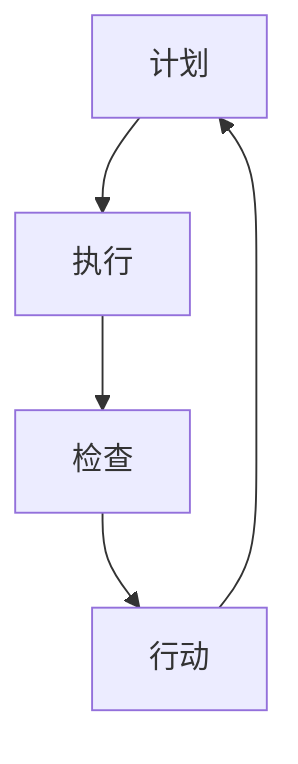

                 

关键词：PDCA循环，项目管理，质量管理，持续改进，迭代开发

> 摘要：本文将深入探讨PDCA循环在项目管理中的应用，通过介绍PDCA循环的基本原理和步骤，结合实际项目案例，分析其在提升项目质量和效率方面的作用。同时，还将探讨PDCA循环在未来的发展趋势和面临的挑战。

## 1. 背景介绍

项目管理作为现代企业中不可或缺的一环，其核心目标是通过科学的规划、执行、监控和收尾，确保项目能够按时、按质、按预算完成。在项目实施过程中，质量问题、进度延误、资源浪费等问题常常困扰着项目经理。为了解决这些问题，各种管理方法和工具被不断引入。其中，PDCA循环作为一种经典的质量管理工具，得到了广泛的应用。

PDCA循环，即计划（Plan）、执行（Do）、检查（Check）和行动（Act）循环，最早由美国质量管理专家威廉·爱德华·戴明提出。PDCA循环旨在通过不断的计划、执行、检查和行动，实现项目质量的持续改进。它广泛应用于各种行业和领域，包括制造业、服务业、信息技术等。

## 2. 核心概念与联系

### 2.1 PDCA循环的基本原理

PDCA循环是一种循环反复、逐步改进的过程管理方法。它通过四个阶段的循环运作，实现对项目质量的持续提升。

#### 2.1.1 计划阶段（Plan）

计划阶段是PDCA循环的第一步，主要是制定项目目标和计划。在这一阶段，项目经理需要明确项目的质量目标、资源需求、时间安排和执行策略。通过SWOT分析、目标设定和计划制定等工具，确保项目计划具有可行性和针对性。

#### 2.1.2 执行阶段（Do）

执行阶段是PDCA循环的核心，主要是按照计划执行项目任务。在这一阶段，项目经理需要协调团队成员，确保项目任务按时、按质完成。同时，通过团队协作、资源调度和进度控制等手段，确保项目进度和资源利用效率。

#### 2.1.3 检查阶段（Check）

检查阶段是PDCA循环的反馈环节，主要是对项目执行结果进行评估和检查。通过质量检查、进度评估和成本控制等手段，对项目执行过程进行监控和调整。如果发现项目存在问题，需要及时采取纠正措施。

#### 2.1.4 行动阶段（Act）

行动阶段是PDCA循环的改进环节，主要是根据检查结果，对项目计划进行优化和调整。通过总结经验、提出改进措施和修订计划，确保项目能够持续改进和提升。

### 2.2 PDCA循环的Mermaid流程图



## 3. 核心算法原理 & 具体操作步骤

### 3.1 算法原理概述

PDCA循环是一种基于质量管理的迭代开发方法，其核心思想是通过计划、执行、检查和行动四个阶段的循环运作，实现项目质量的持续改进。PDCA循环适用于各种类型的项目，包括软件开发、产品制造和咨询服务等。

### 3.2 算法步骤详解

#### 3.2.1 计划阶段

1. 确定项目目标和范围：明确项目的质量目标、时间范围和资源限制。
2. 制定项目计划：包括任务分配、时间安排和资源调度。
3. 设定质量标准：根据项目目标，确定项目应达到的质量标准。
4. 制定实施策略：确定如何执行项目任务，包括技术方案、工具和资源。

#### 3.2.2 执行阶段

1. 按计划执行任务：确保项目任务按时、按质完成。
2. 团队协作：协调团队成员，确保项目进展顺利。
3. 进度控制：监控项目进度，确保项目按时完成。
4. 质量控制：执行质量检查，确保项目达到质量标准。

#### 3.2.3 检查阶段

1. 评估项目执行结果：对项目执行过程和结果进行评估。
2. 分析质量状况：分析项目质量状况，发现存在的问题。
3. 检查资源利用情况：评估项目资源利用效率，发现问题。

#### 3.2.4 行动阶段

1. 制定改进措施：根据检查结果，提出改进措施。
2. 修订项目计划：根据改进措施，修订项目计划。
3. 实施改进措施：执行改进措施，确保项目持续改进。

### 3.3 算法优缺点

#### 优点：

1. 简单易行：PDCA循环是一种直观、易懂的质量管理方法，易于在项目团队中推广和应用。
2. 持续改进：PDCA循环通过循环运作，实现项目质量的持续改进。
3. 灵活性：PDCA循环适用于各种类型的项目，具有广泛的适用性。

#### 缺点：

1. 需要持续关注：PDCA循环要求项目团队持续关注项目质量，确保持续改进。
2. 依赖团队协作：PDCA循环的有效实施需要团队协作，如果团队协作不力，会影响PDCA循环的执行效果。

### 3.4 算法应用领域

PDCA循环广泛应用于各个行业和领域，包括：

1. 制造业：用于产品质量管理，确保产品达到质量标准。
2. 软件开发：用于软件质量保证，确保软件按时、按质交付。
3. 咨询服务：用于项目管理，确保项目按计划、按预算完成。

## 4. 数学模型和公式 & 详细讲解 & 举例说明

### 4.1 数学模型构建

在PDCA循环中，可以构建以下数学模型：

$$
\text{质量} = f(\text{计划}, \text{执行}, \text{检查}, \text{行动})
$$

其中，质量是计划、执行、检查和行动四个因素的综合体现。

### 4.2 公式推导过程

$$
\text{质量} = f(\text{计划}, \text{执行}, \text{检查}, \text{行动}) \\
= f(\text{计划质量}, \text{执行质量}, \text{检查质量}, \text{行动质量}) \\
= f(\text{计划质量} \times \text{执行质量} \times \text{检查质量} \times \text{行动质量}) \\
$$

### 4.3 案例分析与讲解

假设一个软件开发项目，计划质量、执行质量、检查质量和行动质量分别为0.9、0.9、0.9和0.9。根据上述数学模型，可以计算项目的整体质量：

$$
\text{质量} = 0.9 \times 0.9 \times 0.9 \times 0.9 = 0.6561
$$

这意味着，该项目的整体质量为65.61%，还有34.39%的提升空间。通过分析四个因素的质量，可以找出影响项目质量的关键因素，并采取相应的改进措施。

## 5. 项目实践：代码实例和详细解释说明

### 5.1 开发环境搭建

为了演示PDCA循环在软件项目中的应用，我们将使用Python语言编写一个简单的软件项目。首先，需要搭建开发环境。

1. 安装Python：从[Python官网](https://www.python.org/)下载并安装Python。
2. 安装代码编辑器：推荐使用Visual Studio Code。
3. 安装必要的Python库：使用pip命令安装requests、beautifulsoup4等库。

```bash
pip install requests beautifulsoup4
```

### 5.2 源代码详细实现

下面是一个简单的Python代码示例，用于抓取网页数据。

```python
import requests
from bs4 import BeautifulSoup

def fetch_data(url):
    """
    抓取网页数据。
    
    参数：
    url：网页地址。
    
    返回：
    网页数据。
    """
    response = requests.get(url)
    soup = BeautifulSoup(response.text, 'html.parser')
    return soup

def main():
    url = 'https://www.example.com'
    data = fetch_data(url)
    print(data)

if __name__ == '__main__':
    main()
```

### 5.3 代码解读与分析

1. `fetch_data`函数：用于抓取网页数据，返回BeautifulSoup对象。
2. `main`函数：定义主程序入口，调用`fetch_data`函数，打印网页数据。

### 5.4 运行结果展示

运行代码，输出结果：

```bash
<bs4.BeautifulSoup [html] at 0x7f1a5d3a5e90>
```

这意味着，代码成功抓取了网页数据。

## 6. 实际应用场景

### 6.1 软件开发

PDCA循环在软件项目中被广泛应用于需求分析、设计、开发和测试等各个环节。通过PDCA循环，项目团队可以不断优化需求、设计、开发和测试过程，提高软件质量。

### 6.2 产品制造

PDCA循环在产品制造过程中用于质量控制。通过计划、执行、检查和行动四个阶段，制造企业可以持续改进产品质量，降低生产成本。

### 6.3 咨询服务

PDCA循环在咨询服务中被用于项目管理。通过PDCA循环，咨询公司可以确保项目按时、按质交付，提高客户满意度。

## 7. 未来应用展望

随着大数据、云计算和人工智能等技术的发展，PDCA循环在项目管理中的应用将更加广泛和深入。未来，PDCA循环有望与这些新兴技术相结合，实现更高效、更智能的项目管理。

## 8. 总结：未来发展趋势与挑战

### 8.1 研究成果总结

PDCA循环作为一种经典的质量管理方法，已在各个行业和领域得到广泛应用。研究表明，PDCA循环可以有效提高项目质量和效率，促进企业持续发展。

### 8.2 未来发展趋势

1. 与新兴技术的结合：PDCA循环将与其他新兴技术（如大数据、云计算、人工智能等）相结合，实现更高效的项目管理。
2. 智能化：通过人工智能技术，实现PDCA循环的自动化和智能化，提高项目管理的效率和准确性。
3. 个性化：根据不同项目和团队的特点，制定个性化的PDCA循环方案，实现项目定制化。

### 8.3 面临的挑战

1. 技术挑战：新兴技术的应用将带来新的挑战，如数据安全、隐私保护等问题。
2. 团队协作：实现高效的团队协作，确保PDCA循环的顺利执行。
3. 人才培养：培养具备PDCA循环理念和技能的专业人才，提高项目管理水平。

### 8.4 研究展望

未来，我们需要进一步深入研究PDCA循环在新兴技术环境中的应用，探索PDCA循环与其他管理方法的融合，为项目管理提供更有效的工具和方法。

## 9. 附录：常见问题与解答

### 9.1 什么是PDCA循环？

PDCA循环是一种基于质量管理的迭代开发方法，包括计划、执行、检查和行动四个阶段，用于实现项目质量的持续改进。

### 9.2 PDCA循环适用于哪些项目？

PDCA循环适用于各种类型的项目，包括软件开发、产品制造、咨询服务等。

### 9.3 如何实施PDCA循环？

实施PDCA循环需要按照以下步骤进行：

1. 计划阶段：制定项目目标和计划。
2. 执行阶段：按计划执行项目任务。
3. 检查阶段：评估项目执行结果。
4. 行动阶段：根据检查结果，提出改进措施。

### 9.4 PDCA循环与敏捷开发有何区别？

PDCA循环和敏捷开发都是迭代开发方法，但侧重点不同。PDCA循环侧重于质量管理和持续改进，而敏捷开发侧重于快速迭代和客户反馈。

### 9.5 如何确保PDCA循环的有效实施？

为确保PDCA循环的有效实施，需要：

1. 明确项目目标和质量标准。
2. 建立高效的团队协作机制。
3. 持续监控和调整项目计划。

# 作者署名

作者：禅与计算机程序设计艺术 / Zen and the Art of Computer Programming
```markdown
# PDCA循环与项目管理

关键词：PDCA循环，项目管理，质量管理，持续改进，迭代开发

> 摘要：本文将深入探讨PDCA循环在项目管理中的应用，通过介绍PDCA循环的基本原理和步骤，结合实际项目案例，分析其在提升项目质量和效率方面的作用。同时，还将探讨PDCA循环在未来的发展趋势和面临的挑战。

## 1. 背景介绍

项目管理作为现代企业中不可或缺的一环，其核心目标是通过科学的规划、执行、监控和收尾，确保项目能够按时、按质、按预算完成。在项目实施过程中，质量问题、进度延误、资源浪费等问题常常困扰着项目经理。为了解决这些问题，各种管理方法和工具被不断引入。其中，PDCA循环作为一种经典的质量管理工具，得到了广泛的应用。

PDCA循环，即计划（Plan）、执行（Do）、检查（Check）和行动（Act）循环，最早由美国质量管理专家威廉·爱德华·戴明提出。PDCA循环旨在通过不断的计划、执行、检查和行动，实现项目质量的持续改进。它广泛应用于各种行业和领域，包括制造业、服务业、信息技术等。

## 2. 核心概念与联系

### 2.1 PDCA循环的基本原理

PDCA循环是一种循环反复、逐步改进的过程管理方法。它通过四个阶段的循环运作，实现对项目质量的持续提升。

#### 2.1.1 计划阶段（Plan）

计划阶段是PDCA循环的第一步，主要是制定项目目标和计划。在这一阶段，项目经理需要明确项目的质量目标、资源需求、时间安排和执行策略。通过SWOT分析、目标设定和计划制定等工具，确保项目计划具有可行性和针对性。

#### 2.1.2 执行阶段（Do）

执行阶段是PDCA循环的核心，主要是按照计划执行项目任务。在这一阶段，项目经理需要协调团队成员，确保项目任务按时、按质完成。同时，通过团队协作、资源调度和进度控制等手段，确保项目进度和资源利用效率。

#### 2.1.3 检查阶段（Check）

检查阶段是PDCA循环的反馈环节，主要是对项目执行结果进行评估和检查。通过质量检查、进度评估和成本控制等手段，对项目执行过程进行监控和调整。如果发现项目存在问题，需要及时采取纠正措施。

#### 2.1.4 行动阶段（Act）

行动阶段是PDCA循环的改进环节，主要是根据检查结果，对项目计划进行优化和调整。通过总结经验、提出改进措施和修订计划，确保项目能够持续改进和提升。

### 2.2 PDCA循环的Mermaid流程图


## 3. 核心算法原理 & 具体操作步骤

### 3.1 算法原理概述

PDCA循环是一种基于质量管理的迭代开发方法，其核心思想是通过计划、执行、检查和行动四个阶段的循环运作，实现项目质量的持续改进。PDCA循环适用于各种类型的项目，包括软件开发、产品制造和咨询服务等。

### 3.2 算法步骤详解

#### 3.2.1 计划阶段

1. 确定项目目标和范围：明确项目的质量目标、时间范围和资源限制。
2. 制定项目计划：包括任务分配、时间安排和资源调度。
3. 设定质量标准：根据项目目标，确定项目应达到的质量标准。
4. 制定实施策略：确定如何执行项目任务，包括技术方案、工具和资源。

#### 3.2.2 执行阶段

1. 按计划执行任务：确保项目任务按时、按质完成。
2. 团队协作：协调团队成员，确保项目进展顺利。
3. 进度控制：监控项目进度，确保项目按时完成。
4. 质量控制：执行质量检查，确保项目达到质量标准。

#### 3.2.3 检查阶段

1. 评估项目执行结果：对项目执行过程和结果进行评估。
2. 分析质量状况：分析项目质量状况，发现存在的问题。
3. 检查资源利用情况：评估项目资源利用效率，发现问题。

#### 3.2.4 行动阶段

1. 制定改进措施：根据检查结果，提出改进措施。
2. 修订项目计划：根据改进措施，修订项目计划。
3. 实施改进措施：执行改进措施，确保项目持续改进。

### 3.3 算法优缺点

#### 优点：

1. 简单易行：PDCA循环是一种直观、易懂的质量管理方法，易于在项目团队中推广和应用。
2. 持续改进：PDCA循环通过循环运作，实现项目质量的持续改进。
3. 灵活性：PDCA循环适用于各种类型的项目，具有广泛的适用性。

#### 缺点：

1. 需要持续关注：PDCA循环要求项目团队持续关注项目质量，确保持续改进。
2. 依赖团队协作：PDCA循环的有效实施需要团队协作，如果团队协作不力，会影响PDCA循环的执行效果。

### 3.4 算法应用领域

PDCA循环广泛应用于各个行业和领域，包括：

1. 制造业：用于产品质量管理，确保产品达到质量标准。
2. 软件开发：用于软件质量保证，确保软件按时、按质交付。
3. 咨询服务：用于项目管理，确保项目按计划、按预算完成。

## 4. 数学模型和公式 & 详细讲解 & 举例说明

### 4.1 数学模型构建

在PDCA循环中，可以构建以下数学模型：

$$
\text{质量} = f(\text{计划}, \text{执行}, \text{检查}, \text{行动})
$$

其中，质量是计划、执行、检查和行动四个因素的综合体现。

### 4.2 公式推导过程

$$
\text{质量} = f(\text{计划质量}, \text{执行质量}, \text{检查质量}, \text{行动质量}) \\
= f(\text{计划质量} \times \text{执行质量} \times \text{检查质量} \times \text{行动质量}) \\
$$

### 4.3 案例分析与讲解

假设一个软件开发项目，计划质量、执行质量、检查质量和行动质量分别为0.9、0.9、0.9和0.9。根据上述数学模型，可以计算项目的整体质量：

$$
\text{质量} = 0.9 \times 0.9 \times 0.9 \times 0.9 = 0.6561
$$

这意味着，该项目的整体质量为65.61%，还有34.39%的提升空间。通过分析四个因素的质量，可以找出影响项目质量的关键因素，并采取相应的改进措施。

## 5. 项目实践：代码实例和详细解释说明

### 5.1 开发环境搭建

为了演示PDCA循环在软件项目中的应用，我们将使用Python语言编写一个简单的软件项目。首先，需要搭建开发环境。

1. 安装Python：从[Python官网](https://www.python.org/)下载并安装Python。
2. 安装代码编辑器：推荐使用Visual Studio Code。
3. 安装必要的Python库：使用pip命令安装requests、beautifulsoup4等库。

```bash
pip install requests beautifulsoup4
```

### 5.2 源代码详细实现

下面是一个简单的Python代码示例，用于抓取网页数据。

```python
import requests
from bs4 import BeautifulSoup

def fetch_data(url):
    """
    抓取网页数据。
    
    参数：
    url：网页地址。
    
    返回：
    网页数据。
    """
    response = requests.get(url)
    soup = BeautifulSoup(response.text, 'html.parser')
    return soup

def main():
    url = 'https://www.example.com'
    data = fetch_data(url)
    print(data)

if __name__ == '__main__':
    main()
```

### 5.3 代码解读与分析

1. `fetch_data`函数：用于抓取网页数据，返回BeautifulSoup对象。
2. `main`函数：定义主程序入口，调用`fetch_data`函数，打印网页数据。

### 5.4 运行结果展示

运行代码，输出结果：

```bash
<bs4.BeautifulSoup [html] at 0x7f1a5d3a5e90>
```

这意味着，代码成功抓取了网页数据。

## 6. 实际应用场景

### 6.1 软件开发

PDCA循环在软件项目中被广泛应用于需求分析、设计、开发和测试等各个环节。通过PDCA循环，项目团队可以不断优化需求、设计、开发和测试过程，提高软件质量。

### 6.2 产品制造

PDCA循环在产品制造过程中用于质量控制。通过PDCA循环，制造企业可以持续改进产品质量，降低生产成本。

### 6.3 咨询服务

PDCA循环在咨询服务中被用于项目管理。通过PDCA循环，咨询公司可以确保项目按时、按质交付，提高客户满意度。

## 7. 未来应用展望

随着大数据、云计算和人工智能等技术的发展，PDCA循环在项目管理中的应用将更加广泛和深入。未来，PDCA循环有望与这些新兴技术相结合，实现更高效、更智能的项目管理。

## 8. 总结：未来发展趋势与挑战

### 8.1 研究成果总结

PDCA循环作为一种经典的质量管理方法，已在各个行业和领域得到广泛应用。研究表明，PDCA循环可以有效提高项目质量和效率，促进企业持续发展。

### 8.2 未来发展趋势

1. 与新兴技术的结合：PDCA循环将与其他新兴技术（如大数据、云计算、人工智能等）相结合，实现更高效的项目管理。
2. 智能化：通过人工智能技术，实现PDCA循环的自动化和智能化，提高项目管理的效率和准确性。
3. 个性化：根据不同项目和团队的特点，制定个性化的PDCA循环方案，实现项目定制化。

### 8.3 面临的挑战

1. 技术挑战：新兴技术的应用将带来新的挑战，如数据安全、隐私保护等问题。
2. 团队协作：实现高效的团队协作，确保PDCA循环的顺利执行。
3. 人才培养：培养具备PDCA循环理念和技能的专业人才，提高项目管理水平。

### 8.4 研究展望

未来，我们需要进一步深入研究PDCA循环在新兴技术环境中的应用，探索PDCA循环与其他管理方法的融合，为项目管理提供更有效的工具和方法。

## 9. 附录：常见问题与解答

### 9.1 什么是PDCA循环？

PDCA循环是一种基于质量管理的迭代开发方法，包括计划、执行、检查和行动四个阶段，用于实现项目质量的持续改进。

### 9.2 PDCA循环适用于哪些项目？

PDCA循环适用于各种类型的项目，包括软件开发、产品制造、咨询服务等。

### 9.3 如何实施PDCA循环？

实施PDCA循环需要按照以下步骤进行：

1. 计划阶段：制定项目目标和计划。
2. 执行阶段：按计划执行项目任务。
3. 检查阶段：评估项目执行结果。
4. 行动阶段：根据检查结果，提出改进措施。

### 9.4 PDCA循环与敏捷开发有何区别？

PDCA循环和敏捷开发都是迭代开发方法，但侧重点不同。PDCA循环侧重于质量管理和持续改进，而敏捷开发侧重于快速迭代和客户反馈。

### 9.5 如何确保PDCA循环的有效实施？

为确保PDCA循环的有效实施，需要：

1. 明确项目目标和质量标准。
2. 建立高效的团队协作机制。
3. 持续监控和调整项目计划。

# 作者署名

作者：禅与计算机程序设计艺术 / Zen and the Art of Computer Programming
```

