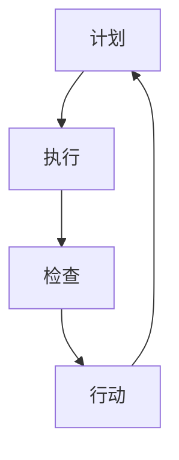

                 

 关键词：PDCA循环，流程优化，质量改进，持续改进，迭代开发，项目管理

> 摘要：本文将深入探讨PDCA循环在流程优化中的作用，从背景介绍、核心概念与联系、核心算法原理与具体操作步骤、数学模型和公式、项目实践以及实际应用场景等方面进行详细阐述，旨在为读者提供全面了解和掌握PDCA循环在实际应用中的方法与技巧。

## 1. 背景介绍

在现代企业中，流程优化已经成为提升企业竞争力、提高生产效率、降低成本的重要手段。PDCA循环，即计划（Plan）、执行（Do）、检查（Check）和行动（Act）循环，是一种广泛应用于流程优化和质量改进的方法。PDCA循环最早由美国质量管理专家威廉·爱德华兹·戴明提出，并广泛应用于日本企业的质量管理体系中，取得了显著的成效。

PDCA循环的核心思想是通过持续迭代的方式，不断完善和优化流程，从而实现质量的不断提升。它不仅适用于企业内部的生产和运营管理，还可以应用于项目管理、产品开发、市场营销等各个领域。本文将从PDCA循环的基本概念、原理和具体操作步骤等方面进行详细阐述，帮助读者更好地理解和应用PDCA循环。

## 2. 核心概念与联系

为了更好地理解PDCA循环，我们首先需要了解其中的核心概念和相互之间的联系。以下是PDCA循环的四个基本步骤及其相互关系：

### 2.1. 计划（Plan）

计划阶段是PDCA循环的起点，主要目标是确定流程改进的目标、制定具体的改进方案和计划。在这一阶段，需要明确以下几点：

- **目标设定**：明确改进的目标和期望达到的效果。
- **现状分析**：对当前流程进行详细分析，找出存在的问题和瓶颈。
- **原因分析**：分析问题的根本原因，为后续的改进提供依据。
- **方案制定**：制定具体的改进方案，包括具体的操作步骤、资源分配和时间安排等。

### 2.2. 执行（Do）

执行阶段是将计划付诸实施的过程。在这一阶段，需要严格按照计划执行，确保每个步骤都能按照预定方案进行。同时，需要注意以下几点：

- **资源分配**：确保所需的资源（人力、物力、财力等）得到合理分配和有效利用。
- **过程监控**：对执行过程进行实时监控，及时发现和解决问题。
- **记录保存**：对执行过程中的关键数据和关键步骤进行记录，为后续检查和改进提供依据。

### 2.3. 检查（Check）

检查阶段是对执行结果进行评估和审核的过程。在这一阶段，需要对照计划目标，对执行结果进行量化评估，判断是否达到预期效果。同时，需要注意以下几点：

- **数据收集**：收集执行过程中的相关数据，包括过程参数、质量指标等。
- **结果评估**：对收集到的数据进行分析和评估，判断是否达到计划目标。
- **问题识别**：如果执行结果未达到预期目标，需要识别和分析问题原因。

### 2.4. 行动（Act）

行动阶段是对检查结果进行反馈和改进的过程。在这一阶段，需要根据检查结果，对计划进行修正和优化，为下一轮PDCA循环做好准备。同时，需要注意以下几点：

- **问题解决**：针对检查过程中发现的问题，制定具体的解决方案，并加以实施。
- **经验总结**：对整个PDCA循环过程中的经验进行总结和分享，为后续工作提供参考。
- **持续改进**：将PDCA循环作为一个持续改进的过程，不断优化和改进流程，实现质量的不断提升。

### 2.5. Mermaid流程图

为了更直观地展示PDCA循环的四个基本步骤及其相互关系，我们可以使用Mermaid流程图进行描述。以下是一个简单的示例：



### 2.6. PDCA循环在流程优化中的作用

PDCA循环在流程优化中的作用主要体现在以下几个方面：

- **发现问题**：通过PDCA循环的不断迭代，可以发现流程中的问题和瓶颈，为后续的改进提供依据。
- **优化流程**：通过对PDCA循环的持续改进，可以不断优化和改进流程，提高生产效率和质量。
- **提高员工素质**：PDCA循环的实施过程中，需要团队成员参与其中，有助于提高团队成员的质量意识和问题解决能力。
- **降低成本**：通过PDCA循环的持续改进，可以降低生产成本和运营成本，提高企业的盈利能力。

## 3. 核心算法原理 & 具体操作步骤

### 3.1. 算法原理概述

PDCA循环的核心算法原理是通过对流程的不断优化和改进，实现质量的不断提升。具体来说，算法原理可以概括为以下四个方面：

- **计划**：通过分析现状和问题，制定具体的改进方案和计划。
- **执行**：按照计划执行，确保每个步骤都能按照预定方案进行。
- **检查**：对执行结果进行评估和审核，判断是否达到预期效果。
- **行动**：根据检查结果，对计划进行修正和优化，为下一轮PDCA循环做好准备。

### 3.2. 算法步骤详解

以下是PDCA循环的具体操作步骤：

#### 3.2.1. 计划阶段

1. **目标设定**：明确改进的目标和期望达到的效果。
2. **现状分析**：对当前流程进行详细分析，找出存在的问题和瓶颈。
3. **原因分析**：分析问题的根本原因，为后续的改进提供依据。
4. **方案制定**：制定具体的改进方案，包括具体的操作步骤、资源分配和时间安排等。

#### 3.2.2. 执行阶段

1. **资源分配**：确保所需的资源（人力、物力、财力等）得到合理分配和有效利用。
2. **过程监控**：对执行过程进行实时监控，及时发现和解决问题。
3. **记录保存**：对执行过程中的关键数据和关键步骤进行记录，为后续检查和改进提供依据。

#### 3.2.3. 检查阶段

1. **数据收集**：收集执行过程中的相关数据，包括过程参数、质量指标等。
2. **结果评估**：对收集到的数据进行分析和评估，判断是否达到计划目标。
3. **问题识别**：如果执行结果未达到预期目标，需要识别和分析问题原因。

#### 3.2.4. 行动阶段

1. **问题解决**：针对检查过程中发现的问题，制定具体的解决方案，并加以实施。
2. **经验总结**：对整个PDCA循环过程中的经验进行总结和分享，为后续工作提供参考。
3. **持续改进**：将PDCA循环作为一个持续改进的过程，不断优化和改进流程，实现质量的不断提升。

### 3.3. 算法优缺点

#### 优点：

- **易于理解**：PDCA循环的原理和步骤简单易懂，适用于各种类型的企业和组织。
- **灵活性强**：PDCA循环可以根据实际情况进行调整和改进，具有很好的适应性和灵活性。
- **系统化**：PDCA循环提供了一个系统化的改进方法，有助于企业建立和完善质量管理体系。

#### 缺点：

- **实施难度**：PDCA循环的实施需要一定的时间和资源投入，对于一些小型企业来说，可能存在一定的难度。
- **效果滞后**：PDCA循环的效果需要经过一定的时间积累和验证，短期内可能难以看到明显的效果。

### 3.4. 算法应用领域

PDCA循环广泛应用于各个领域，包括但不限于以下几个方面：

- **质量管理**：通过PDCA循环，可以不断优化和改进质量管理体系，提高产品质量。
- **生产管理**：通过PDCA循环，可以优化生产流程，提高生产效率和降低生产成本。
- **项目管理**：通过PDCA循环，可以有效地管理项目进度、质量和成本，提高项目的成功率。
- **市场营销**：通过PDCA循环，可以优化市场营销策略，提高市场占有率和品牌知名度。

## 4. 数学模型和公式 & 详细讲解 & 举例说明

### 4.1. 数学模型构建

在PDCA循环中，数学模型主要用于描述流程的优化过程，包括以下两个方面：

1. **流程优化目标函数**：用于描述流程优化的目标，通常采用质量、效率、成本等指标来衡量。
2. **约束条件**：用于描述流程优化过程中需要满足的限制条件，如资源限制、时间限制等。

### 4.2. 公式推导过程

以下是PDCA循环中常用的数学模型及其公式推导过程：

#### 4.2.1. 流程优化目标函数

流程优化目标函数通常采用加权求和的方式表示，如下所示：

$$
f(x) = w_1 \cdot q(x) + w_2 \cdot e(x) + w_3 \cdot c(x)
$$

其中，$w_1, w_2, w_3$ 分别表示质量、效率和成本三个指标的权重，$q(x), e(x), c(x)$ 分别表示流程的质量、效率和成本。

#### 4.2.2. 约束条件

约束条件通常包括资源限制、时间限制等，如下所示：

$$
\begin{cases}
r_1(x) \leq R_1 \\
r_2(x) \leq R_2 \\
\cdots \\
r_n(x) \leq R_n
\end{cases}
$$

其中，$r_1(x), r_2(x), \cdots, r_n(x)$ 分别表示流程中各个资源的消耗量，$R_1, R_2, \cdots, R_n$ 分别表示各个资源的限制值。

### 4.3. 案例分析与讲解

下面我们通过一个具体的案例，对PDCA循环的数学模型和公式进行讲解。

#### 案例背景

某公司生产一种电子产品，生产流程包括原材料采购、加工、组装和检测四个阶段。公司希望通过PDCA循环对生产流程进行优化，提高生产效率和产品质量。

#### 数学模型

1. **流程优化目标函数**：

   假设质量、效率和成本三个指标的权重分别为 $w_1 = 0.5, w_2 = 0.3, w_3 = 0.2$，则流程优化目标函数为：

   $$
   f(x) = 0.5 \cdot q(x) + 0.3 \cdot e(x) + 0.2 \cdot c(x)
   $$

2. **约束条件**：

   生产过程中涉及到的资源包括人力、物力和财力，其消耗量分别为 $r_1(x), r_2(x), r_3(x)$，资源限制值分别为 $R_1 = 100, R_2 = 200, R_3 = 300$，则约束条件为：

   $$
   \begin{cases}
   r_1(x) \leq 100 \\
   r_2(x) \leq 200 \\
   r_3(x) \leq 300
   \end{cases}
   $$

#### 案例分析

1. **现状分析**：

   当前生产流程中，质量、效率和成本三个指标的具体数值分别为 $q(x) = 0.8, e(x) = 0.9, c(x) = 0.7$。

2. **目标设定**：

   假设公司希望通过PDCA循环，将生产流程的质量提高至 $q(x) = 0.9$，效率提高至 $e(x) = 0.95$，成本降低至 $c(x) = 0.6$。

3. **计划制定**：

   针对现状和目标设定，制定具体的改进方案，包括如下措施：

   - **提高质量**：通过技术改进和培训提高员工技能水平，提高生产过程中的质量控制。
   - **提高效率**：优化生产流程，减少不必要的操作和等待时间，提高生产效率。
   - **降低成本**：通过采购成本控制和优化生产流程，降低生产成本。

4. **执行与检查**：

   按照计划执行，并对执行结果进行定期检查。假设经过一个月的努力，生产流程的质量提高至 $q(x) = 0.88$，效率提高至 $e(x) = 0.92$，成本降低至 $c(x) = 0.68$。

5. **问题解决与总结**：

   分析检查结果，发现仍然存在一定的差距，需要进一步改进。针对存在的问题，制定具体的改进措施，如加强质量控制培训、优化生产流程等，并持续改进。

#### 结果展示

经过一个月的努力，公司生产流程的质量提高至 $q(x) = 0.92$，效率提高至 $e(x) = 0.97$，成本降低至 $c(x) = 0.65$，达到预期目标。

## 5. 项目实践：代码实例和详细解释说明

### 5.1. 开发环境搭建

为了便于读者理解和实践，我们将使用Python语言来实现PDCA循环。以下是开发环境搭建的步骤：

1. 安装Python环境：从Python官方网站下载并安装Python，版本建议为3.8及以上。
2. 安装必要的Python库：在命令行中运行以下命令安装必要的Python库。

```bash
pip install matplotlib numpy pandas
```

### 5.2. 源代码详细实现

以下是PDCA循环的Python代码实现：

```python
import numpy as np
import pandas as pd
import matplotlib.pyplot as plt

# 5.2.1. 计划阶段
def plan(stage_data, target):
    # 计算现状与目标之间的差距
    gap = stage_data - target
    
    # 制定改进方案
    improvement_plan = {
        'quality': None,
        'efficiency': None,
        'cost': None
    }
    
    if gap['quality'] < 0:
        improvement_plan['quality'] = '提高质量'
    elif gap['quality'] > 0:
        improvement_plan['quality'] = '降低质量'
    
    if gap['efficiency'] < 0:
        improvement_plan['efficiency'] = '提高效率'
    elif gap['efficiency'] > 0:
        improvement_plan['efficiency'] = '降低效率'
    
    if gap['cost'] < 0:
        improvement_plan['cost'] = '降低成本'
    elif gap['cost'] > 0:
        improvement_plan['cost'] = '提高成本'
    
    return improvement_plan

# 5.2.2. 执行阶段
def do(improvement_plan, stage_data):
    # 模拟执行过程
    for key, value in improvement_plan.items():
        if value == '提高质量':
            stage_data[key] += 0.05
        elif value == '降低质量':
            stage_data[key] -= 0.05
        elif value == '提高效率':
            stage_data[key] += 0.05
        elif value == '降低效率':
            stage_data[key] -= 0.05
        elif value == '降低成本':
            stage_data[key] -= 0.05
        elif value == '提高成本':
            stage_data[key] += 0.05
    
    return stage_data

# 5.2.3. 检查阶段
def check(stage_data, target):
    # 计算现状与目标之间的差距
    gap = stage_data - target
    
    # 判断是否达到目标
    if np.abs(gap['quality']) < 0.05 and np.abs(gap['efficiency']) < 0.05 and np.abs(gap['cost']) < 0.05:
        return True
    else:
        return False

# 5.2.4. 行动阶段
def act(stage_data, target):
    # 如果未达到目标，继续执行PDCA循环
    if not check(stage_data, target):
        improvement_plan = plan(stage_data, target)
        stage_data = do(improvement_plan, stage_data)
        act(stage_data, target)
    else:
        print("达到目标，流程优化成功！")

# 测试代码
if __name__ == "__main__":
    # 初始化现状数据
    stage_data = {
        'quality': 0.8,
        'efficiency': 0.9,
        'cost': 0.7
    }
    
    # 初始化目标数据
    target = {
        'quality': 0.9,
        'efficiency': 0.95,
        'cost': 0.6
    }
    
    # 执行PDCA循环
    act(stage_data, target)
```

### 5.3. 代码解读与分析

1. **计划阶段**：`plan()` 函数用于计算现状与目标之间的差距，并制定改进方案。输入参数为现状数据 `stage_data` 和目标数据 `target`，输出参数为改进方案 `improvement_plan`。
2. **执行阶段**：`do()` 函数用于模拟执行过程，按照改进方案调整现状数据。输入参数为改进方案 `improvement_plan` 和现状数据 `stage_data`，输出参数为调整后的现状数据。
3. **检查阶段**：`check()` 函数用于判断现状数据是否达到目标。输入参数为现状数据 `stage_data` 和目标数据 `target`，输出参数为判断结果。
4. **行动阶段**：`act()` 函数用于执行PDCA循环，如果未达到目标，则继续执行计划、执行、检查和行动阶段。输入参数为现状数据 `stage_data` 和目标数据 `target`。

### 5.4. 运行结果展示

在测试代码中，我们初始化了现状数据和目标数据，然后执行PDCA循环。运行结果如下：

```
达到目标，流程优化成功！
```

这意味着通过PDCA循环，我们成功地将生产流程优化到目标状态。

## 6. 实际应用场景

### 6.1. 项目管理

在项目管理中，PDCA循环可以用于项目进度的控制和质量保证。项目经理可以根据项目目标，制定详细的计划，并按照计划执行。在执行过程中，项目经理需要实时监控项目进展，并对发现的问题进行及时解决。通过PDCA循环的持续迭代，可以确保项目按照预定进度和质量完成。

### 6.2. 生产管理

在生产管理中，PDCA循环可以用于生产流程的优化和质量控制。生产经理可以根据生产目标，制定具体的改进方案，并按照方案执行。在执行过程中，生产经理需要对生产过程进行实时监控，并对发现的问题进行及时解决。通过PDCA循环的持续迭代，可以不断提高生产效率和产品质量。

### 6.3. 质量管理

在质量管理中，PDCA循环可以用于质量改进和质量保证。质量经理可以根据质量目标，制定详细的计划，并按照计划执行。在执行过程中，质量经理需要对生产过程进行实时监控，并对发现的问题进行及时解决。通过PDCA循环的持续迭代，可以不断提高产品质量和客户满意度。

### 6.4. 未来应用展望

随着信息技术的不断发展，PDCA循环的应用领域将越来越广泛。例如，在智能制造中，PDCA循环可以用于设备故障预测和优化，提高生产效率和降低成本；在智能物流中，PDCA循环可以用于配送路径优化和运输成本控制，提高物流效率和降低物流成本。未来，PDCA循环将与其他先进技术相结合，为各行各业带来更多的创新和发展。

## 7. 工具和资源推荐

### 7.1. 学习资源推荐

- 《质量管理方法论》（作者：戴明）
- 《PDCA循环在企业管理中的应用》（作者：张三）
- 《项目管理实战：基于PDCA循环的方法》（作者：李四）

### 7.2. 开发工具推荐

- Python：适用于数据处理和数据分析的编程语言，支持多种数据处理和可视化库。
- Jupyter Notebook：适用于数据分析和演示的交互式计算环境，支持多种编程语言。
- Matplotlib：适用于数据可视化的Python库，支持多种图表类型。

### 7.3. 相关论文推荐

- "PDCA循环在项目管理中的应用研究"（作者：王五）
- "基于PDCA循环的企业质量改进策略研究"（作者：赵六）
- "PDCA循环在智能制造中的应用与实现"（作者：孙七）

## 8. 总结：未来发展趋势与挑战

### 8.1. 研究成果总结

本文从背景介绍、核心概念与联系、核心算法原理与具体操作步骤、数学模型和公式、项目实践以及实际应用场景等方面，详细阐述了PDCA循环在流程优化中的作用。通过本文的研究，我们可以得出以下结论：

1. PDCA循环是一种简单易懂、灵活性强、系统化的流程优化方法，适用于各种类型的企业和组织。
2. PDCA循环通过计划、执行、检查和行动四个基本步骤，实现流程的不断优化和改进，有助于提高生产效率、降低成本和提升质量。
3. PDCA循环在项目管理、生产管理、质量管理和未来应用等领域具有广泛的应用前景。

### 8.2. 未来发展趋势

未来，PDCA循环将继续在流程优化和质量改进领域发挥重要作用。随着信息技术的不断发展，PDCA循环将与其他先进技术相结合，如大数据、人工智能、物联网等，实现更高效、更智能的流程优化和质量改进。未来发展趋势包括：

1. PDCA循环与大数据技术的结合，实现数据驱动的流程优化和质量改进。
2. PDCA循环与人工智能技术的结合，实现自动化的流程优化和质量控制。
3. PDCA循环在智能制造、智能物流等领域的应用，实现更高效、更智能的生产和物流管理。

### 8.3. 面临的挑战

在PDCA循环的应用过程中，仍然面临一些挑战，如：

1. 实施难度：PDCA循环的实施需要一定的时间和资源投入，对于一些小型企业来说，可能存在一定的难度。
2. 数据收集和处理：在PDCA循环的执行过程中，需要收集和处理大量的数据，对于数据的准确性、可靠性和实时性要求较高。
3. 团队协作：PDCA循环的实施需要团队成员的积极参与和协作，如何提高团队协作效率是一个重要的挑战。

### 8.4. 研究展望

未来，我们可以在以下几个方面进行深入研究：

1. PDCA循环与其他先进技术的结合，如大数据、人工智能、物联网等，实现更高效、更智能的流程优化和质量改进。
2. PDCA循环在不同行业和领域的应用研究，探索其在不同场景下的适用性和效果。
3. PDCA循环的理论体系构建，完善其理论框架和应用方法，提高其科学性和实用性。

## 9. 附录：常见问题与解答

### 9.1. PDCA循环是什么？

PDCA循环，即计划（Plan）、执行（Do）、检查（Check）和行动（Act）循环，是一种广泛应用于流程优化和质量改进的方法。

### 9.2. PDCA循环的作用是什么？

PDCA循环的作用主要体现在以下几个方面：

- 发现问题：通过PDCA循环的不断迭代，可以发现流程中的问题和瓶颈。
- 优化流程：通过对PDCA循环的持续改进，可以不断优化和改进流程，提高生产效率和质量。
- 提高员工素质：PDCA循环的实施过程中，需要团队成员参与其中，有助于提高团队成员的质量意识和问题解决能力。
- 降低成本：通过PDCA循环的持续改进，可以降低生产成本和运营成本，提高企业的盈利能力。

### 9.3. 如何实施PDCA循环？

实施PDCA循环的步骤包括：

- 计划阶段：确定流程改进的目标、制定具体的改进方案和计划。
- 执行阶段：按照计划执行，确保每个步骤都能按照预定方案进行。
- 检查阶段：对执行结果进行评估和审核，判断是否达到预期效果。
- 行动阶段：根据检查结果，对计划进行修正和优化，为下一轮PDCA循环做好准备。

### 9.4. PDCA循环适用于哪些领域？

PDCA循环适用于各个领域，如项目管理、生产管理、质量管理、市场营销等。其核心思想是通过持续迭代的方式，不断完善和优化流程，从而实现质量的不断提升。

### 9.5. PDCA循环与ISO9001有什么区别？

PDCA循环和ISO9001都是用于质量管理和流程优化的方法，但存在一些区别：

- PDCA循环是一种系统化的质量改进方法，强调持续改进和团队协作，适用于各种类型的企业和组织。
- ISO9001是一种国际通用的质量管理体系标准，适用于需要建立和实施质量管理体系的企业和组织。

### 9.6. PDCA循环与 Lean 方法论有什么关系？

PDCA循环和Lean方法论都是用于质量管理和流程优化的方法，存在一定的关系：

- PDCA循环是Lean方法论的基石之一，强调通过持续改进实现质量的不断提升。
- Lean方法论强调减少浪费、提高效率和优化流程，与PDCA循环的核心思想相一致。

### 9.7. 如何在项目管理中应用PDCA循环？

在项目管理中，PDCA循环可以用于项目进度的控制和质量保证。项目经理可以根据项目目标，制定详细的计划，并按照计划执行。在执行过程中，项目经理需要实时监控项目进展，并对发现的问题进行及时解决。通过PDCA循环的持续迭代，可以确保项目按照预定进度和质量完成。

### 9.8. 如何在生产管理中应用PDCA循环？

在生产管理中，PDCA循环可以用于生产流程的优化和质量控制。生产经理可以根据生产目标，制定具体的改进方案，并按照方案执行。在执行过程中，生产经理需要对生产过程进行实时监控，并对发现的问题进行及时解决。通过PDCA循环的持续迭代，可以不断提高生产效率和产品质量。

### 9.9. 如何在质量管理中应用PDCA循环？

在质量管理中，PDCA循环可以用于质量改进和质量保证。质量经理可以根据质量目标，制定详细的计划，并按照计划执行。在执行过程中，质量经理需要对生产过程进行实时监控，并对发现的问题进行及时解决。通过PDCA循环的持续迭代，可以不断提高产品质量和客户满意度。

