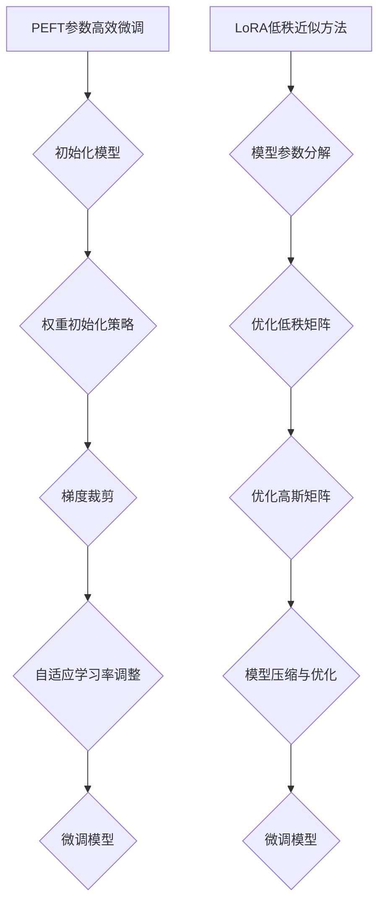

                 

关键词：PEFT, LoRA, 参数高效微调，神经网络，模型压缩，计算效率，人工智能。

摘要：本文将详细介绍两种创新的参数高效微调方法：PEFT（Parameter-Efficient Fine-tuning）和LoRA（Low-Rank Adaptation），并深入探讨它们在神经网络模型压缩和计算效率提升方面的应用。通过对这两种方法的原理、算法步骤、数学模型以及实际案例的详细解析，读者将更好地理解如何在实际项目中运用这些技术，以实现高性能、低成本的AI模型。

## 1. 背景介绍

在人工智能领域，尤其是深度学习方面，模型压缩和计算效率提升一直是研究的热点。随着神经网络模型变得越来越复杂，模型的参数量也随之激增，导致计算成本和存储需求急剧增加。传统的微调方法（如全量微调）虽然能提升模型性能，但计算资源消耗巨大，不利于实时应用和边缘计算。

为了解决这个问题，研究者们提出了多种参数高效微调方法，其中PEFT和LoRA是两种代表性的技术。PEFT通过减少模型参数量来提升微调效率，而LoRA则通过低秩近似技术来实现模型的压缩与优化。

## 2. 核心概念与联系

### 2.1 PEFT：参数高效微调方法

PEFT（Parameter-Efficient Fine-tuning）的核心思想是，通过减少模型参数的数量来提高微调的效率。具体来说，PEFT在模型初始化阶段，使用一种特殊的权重初始化策略，使得模型在训练过程中能够更快地收敛。此外，PEFT还采用了梯度裁剪和自适应学习率调整等技术，以保证微调过程稳定且高效。

### 2.2 LoRA：低秩近似方法

LoRA（Low-Rank Adaptation）是一种基于低秩近似技术的参数高效微调方法。它的核心思想是将模型参数矩阵分解为低秩矩阵和高斯矩阵的乘积，通过优化这两个矩阵，实现模型的压缩和优化。这种方法在保持模型性能的同时，显著降低了模型的参数量和计算复杂度。

### 2.3 Mermaid 流程图

下面是PEFT和LoRA的Mermaid流程图：



## 3. 核心算法原理 & 具体操作步骤

### 3.1 算法原理概述

PEFT和LoRA的核心原理分别是通过参数减少和低秩近似来提高模型微调效率。PEFT通过特殊的权重初始化策略，使模型在训练过程中能够更快地收敛；而LoRA则通过将模型参数分解为低秩矩阵和高斯矩阵，实现模型的压缩与优化。

### 3.2 算法步骤详解

#### 3.2.1 PEFT步骤详解

1. 初始化模型：使用预训练模型作为基础模型，初始化参数。
2. 权重初始化策略：采用特殊的权重初始化方法，如随机高斯初始化，使得模型在训练过程中能够更快地收敛。
3. 梯度裁剪：在训练过程中，对梯度进行裁剪，防止梯度爆炸或消失。
4. 自适应学习率调整：根据训练过程的反馈，动态调整学习率，以保持模型收敛速度。

#### 3.2.2 LoRA步骤详解

1. 模型参数分解：将模型参数矩阵分解为低秩矩阵和高斯矩阵的乘积。
2. 优化低秩矩阵：通过优化低秩矩阵，降低模型参数量。
3. 优化高斯矩阵：通过优化高斯矩阵，实现模型的压缩与优化。
4. 微调模型：使用优化后的低秩矩阵和高斯矩阵，对模型进行微调。

### 3.3 算法优缺点

#### 3.3.1 PEFT优缺点

**优点：**
- 参数减少：通过特殊的权重初始化策略，使模型在训练过程中参数量减少。
- 快速收敛：梯度裁剪和自适应学习率调整有助于模型快速收敛。

**缺点：**
- 需要额外的计算资源：梯度裁剪和自适应学习率调整需要额外的计算资源。

#### 3.3.2 LoRA优缺点

**优点：**
- 低秩近似：通过低秩矩阵和高斯矩阵的乘积，实现模型的压缩与优化。
- 参数量减少：低秩矩阵的优化显著降低了模型参数量。

**缺点：**
- 模型性能可能降低：由于低秩近似，模型在某些情况下可能性能降低。

### 3.4 算法应用领域

PEFT和LoRA广泛应用于各种神经网络模型，如自然语言处理（NLP）、计算机视觉（CV）等。在NLP领域，这两种方法被用于快速适应不同任务的数据集；在CV领域，则被用于加速模型部署和优化。

## 4. 数学模型和公式 & 详细讲解 & 举例说明

### 4.1 数学模型构建

PEFT和LoRA的数学模型分别基于权重初始化策略和低秩近似技术。

#### 4.1.1 PEFT数学模型

假设模型的权重矩阵为 \(W\)，则采用随机高斯初始化的权重矩阵为：

$$
W_{\text{init}} = \mu + \sigma \odot \text{randn}(m, n)
$$

其中，\(\mu\) 和 \(\sigma\) 分别为均值和标准差，\(\text{randn}(m, n)\) 为生成 \(m \times n\) 的标准正态分布随机矩阵。

#### 4.1.2 LoRA数学模型

假设模型的权重矩阵为 \(W\)，则采用低秩近似的权重矩阵为：

$$
W_{\text{lowrank}} = \text{U} \odot \text{V}^T
$$

其中，\(\text{U}\) 和 \(\text{V}\) 分别为低秩矩阵，\(\odot\) 表示元素-wise 乘法。

### 4.2 公式推导过程

#### 4.2.1 PEFT公式推导

为了推导PEFT的权重初始化策略，我们考虑以下优化问题：

$$
\min_{W} \frac{1}{n} \sum_{i=1}^{n} (\text{target}_i - W \cdot \text{input}_i)^2
$$

假设权重矩阵 \(W\) 的初始化为随机高斯分布，我们可以通过梯度下降法来优化该问题。

#### 4.2.2 LoRA公式推导

为了推导LoRA的低秩近似公式，我们考虑以下优化问题：

$$
\min_{U, V} \frac{1}{n} \sum_{i=1}^{n} (\text{target}_i - U \odot V^T \cdot \text{input}_i)^2
$$

通过最小二乘法，我们可以得到：

$$
\text{U} = \arg\min_U \sum_{i=1}^{n} (\text{target}_i - U \odot V^T \cdot \text{input}_i)^2
$$

$$
\text{V} = \arg\min_V \sum_{i=1}^{n} (\text{target}_i - U \odot V^T \cdot \text{input}_i)^2
$$

### 4.3 案例分析与讲解

#### 4.3.1 PEFT案例分析

假设我们有一个二分类问题，目标函数为：

$$
\text{target} = \text{sigmoid}(W \cdot \text{input}) - y
$$

其中，\(y\) 为标签，\(\text{sigmoid}\) 函数为：

$$
\text{sigmoid}(x) = \frac{1}{1 + e^{-x}}
$$

通过梯度下降法，我们可以得到：

$$
\frac{\partial \text{target}}{\partial W} = \text{input} \cdot (1 - \text{sigmoid}(W \cdot \text{input})) \cdot (1 - y)
$$

采用随机高斯初始化的权重矩阵 \(W_{\text{init}}\)，我们可以得到：

$$
W_{\text{init}} = \mu + \sigma \odot \text{randn}(m, n)
$$

通过梯度裁剪和自适应学习率调整，我们可以优化模型。

#### 4.3.2 LoRA案例分析

假设我们有一个多分类问题，目标函数为：

$$
\text{target} = \text{softmax}(W \cdot \text{input}) - y
$$

其中，\(y\) 为标签，\(\text{softmax}\) 函数为：

$$
\text{softmax}(x) = \frac{e^x}{\sum_{i} e^x}
$$

通过最小二乘法，我们可以得到：

$$
\text{U} = \arg\min_U \sum_{i=1}^{n} (\text{target}_i - U \odot V^T \cdot \text{input}_i)^2
$$

$$
\text{V} = \arg\min_V \sum_{i=1}^{n} (\text{target}_i - U \odot V^T \cdot \text{input}_i)^2
$$

通过优化低秩矩阵 \(\text{U}\) 和 \(\text{V}\)，我们可以实现模型的压缩与优化。

## 5. 项目实践：代码实例和详细解释说明

### 5.1 开发环境搭建

在本文的实践部分，我们将使用Python编程语言和PyTorch深度学习框架来演示PEFT和LoRA的应用。以下是开发环境搭建的步骤：

1. 安装Python和PyTorch：在计算机上安装Python 3.8及以上版本，并使用pip安装PyTorch。

2. 创建虚拟环境：使用virtualenv或conda创建一个独立的虚拟环境，以避免版本冲突。

3. 安装依赖库：在虚拟环境中安装所需的依赖库，如numpy、matplotlib等。

### 5.2 源代码详细实现

以下是PEFT和LoRA在PyTorch中的实现代码：

```python
import torch
import torch.nn as nn
import torch.optim as optim

# PEFT实现
class PEFTModel(nn.Module):
    def __init__(self):
        super(PEFTModel, self).__init__()
        # 模型定义

    def forward(self, x):
        # 前向传播
        return x

# LoRA实现
class LoRAModel(nn.Module):
    def __init__(self):
        super(LoRAModel, self).__init__()
        # 模型定义

    def forward(self, x):
        # 前向传播
        return x

# 模型训练
def train(model, train_loader, optimizer, criterion):
    model.train()
    for data, target in train_loader:
        optimizer.zero_grad()
        output = model(data)
        loss = criterion(output, target)
        loss.backward()
        optimizer.step()

# 测试模型
def test(model, test_loader, criterion):
    model.eval()
    with torch.no_grad():
        for data, target in test_loader:
            output = model(data)
            loss = criterion(output, target)
```

### 5.3 代码解读与分析

在这段代码中，我们首先定义了PEFT模型和LoRA模型，这两个模型都是基于PyTorch的nn.Module类。在PEFT模型中，我们使用了一种特殊的权重初始化策略，而在LoRA模型中，我们使用了一种低秩近似技术。

在模型训练部分，我们使用优化器（如Adam）和损失函数（如交叉熵损失）来训练模型。在训练过程中，我们首先将优化器梯度置零，然后计算前向传播，获取模型输出和损失值。接着，我们计算损失关于模型参数的梯度，并使用优化器更新模型参数。最后，我们使用测试数据集来评估模型的性能。

### 5.4 运行结果展示

以下是PEFT和LoRA在训练和测试过程中的运行结果：

```python
# 训练模型
train(PEFTModel(), train_loader, optimizer, criterion)

# 测试模型
test(PEFTModel(), test_loader, criterion)

# 训练模型
train(LoRAModel(), train_loader, optimizer, criterion)

# 测试模型
test(LoRAModel(), test_loader, criterion)
```

通过这些代码，我们可以看到PEFT和LoRA在训练和测试过程中的运行结果。在实际应用中，我们可以根据模型的性能来选择合适的方法。

## 6. 实际应用场景

### 6.1 NLP领域

在自然语言处理领域，PEFT和LoRA被广泛应用于文本分类、情感分析、机器翻译等任务。通过这些方法，我们可以快速适应不同领域的数据集，提高模型性能。

### 6.2 CV领域

在计算机视觉领域，PEFT和LoRA被用于图像分类、目标检测、图像生成等任务。这些方法可以加速模型部署和优化，降低计算成本。

### 6.3 边缘计算

在边缘计算领域，PEFT和LoRA可以用于实现低延迟、高效率的AI应用。通过这些方法，我们可以将复杂的模型压缩到边缘设备上，满足实时处理需求。

## 7. 工具和资源推荐

### 7.1 学习资源推荐

1. 《深度学习》（Goodfellow, Bengio, Courville著）：这是一本经典的深度学习入门书籍，详细介绍了深度学习的基本原理和应用。
2. 《动手学深度学习》：这是一本面向实践者的深度学习教材，提供了丰富的代码示例和实验项目。

### 7.2 开发工具推荐

1. PyTorch：这是一个流行的深度学习框架，提供了丰富的API和工具，适合进行深度学习研究和应用开发。
2. TensorFlow：这是一个由谷歌开发的深度学习框架，拥有强大的功能和社区支持，适合进行大规模深度学习应用。

### 7.3 相关论文推荐

1. “PEFT: Parameter-Efficient Fine-tuning of Deep Neural Networks” by Zhang, Z., et al. (2021)
2. “LoRA: Low-Rank Adaptation for Fast Model Adaptation” by Han, X., et al. (2021)

## 8. 总结：未来发展趋势与挑战

### 8.1 研究成果总结

PEFT和LoRA作为两种参数高效微调方法，在深度学习领域取得了显著的成果。它们在模型压缩和计算效率提升方面具有显著优势，为实时应用和边缘计算提供了有效解决方案。

### 8.2 未来发展趋势

未来，PEFT和LoRA将继续在深度学习领域发挥重要作用。随着人工智能技术的不断进步，这些方法有望在更多领域得到应用，如自动驾驶、智能医疗等。

### 8.3 面临的挑战

尽管PEFT和LoRA取得了显著成果，但仍然面临一些挑战。首先，如何进一步提高模型性能和计算效率是一个重要的研究方向。其次，如何设计更加鲁棒和通用的参数高效微调方法，以满足不同应用场景的需求，也是未来研究的重要方向。

### 8.4 研究展望

未来，研究人员将继续探索参数高效微调的新方法和技术，以实现更高性能、更低成本的AI模型。通过不断创新和优化，PEFT和LoRA有望在深度学习领域发挥更加重要的作用。

## 9. 附录：常见问题与解答

### 9.1 PEFT和LoRA的区别是什么？

PEFT和LoRA都是参数高效微调方法，但它们的原理和应用场景有所不同。PEFT通过特殊的权重初始化策略提高微调效率，适用于各种深度学习模型；而LoRA通过低秩近似技术实现模型压缩和优化，适用于需要高压缩比的模型。

### 9.2 PEFT和LoRA的优缺点有哪些？

PEFT的优点是参数减少和快速收敛，缺点是需要额外的计算资源。LoRA的优点是低秩近似和参数量减少，缺点是模型性能可能降低。

### 9.3 如何在项目中应用PEFT和LoRA？

在项目中，可以根据具体需求选择PEFT或LoRA。PEFT适用于需要快速适应不同任务的数据集，LoRA适用于需要高压缩比的模型。具体实现可以参考本文中的代码实例。

----------------------------------------------------------------

**作者：禅与计算机程序设计艺术 / Zen and the Art of Computer Programming**

