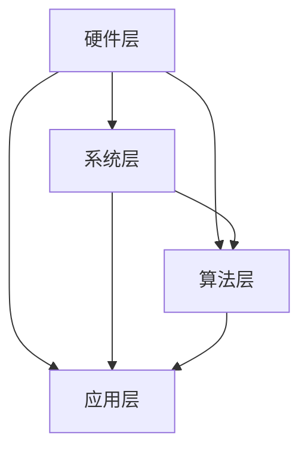

                 

性能和效率的平衡（Performance and Efficiency Balance，简称PEFT）是当今计算机科学和软件工程领域的关键问题。在快速变化的技术环境中，开发人员需要不断地寻找如何在保证程序高效运行的同时，保持资源利用率的最佳状态。本文旨在深入探讨PEFT的概念、原理、应用和未来趋势。

## 文章关键词

- 性能优化
- 效率提升
- 资源利用
- 软件工程
- 算法分析

## 文章摘要

本文将首先介绍PEFT的基本概念，随后通过核心概念与联系的Mermaid流程图来阐述其架构。接着，文章将详细解析PEFT的核心算法原理和具体操作步骤，并对比分析其优缺点及适用领域。在数学模型和公式部分，我们将使用latex格式详细推导和举例说明。随后，文章将提供实际项目中的代码实例和详细解释，展示PEFT的具体应用。文章最后将探讨PEFT的实际应用场景和未来展望，并提供相关学习资源和开发工具推荐。

## 1. 背景介绍

在信息技术飞速发展的今天，软件性能和效率的重要性日益凸显。随着计算需求不断增长，如何优化软件性能、提升运行效率成为开发人员面临的一大挑战。传统的性能优化方法往往侧重于算法层面，而忽略了资源利用和系统设计的优化。这使得在处理大规模数据和高并发场景时，性能瓶颈和资源浪费问题日益严重。

PEFT概念正是在这样的背景下提出的，它强调在性能优化和效率提升之间寻找最佳平衡点，以实现资源的最优利用和程序的稳定运行。通过引入系统级的优化策略，PEFT旨在解决传统方法中的不足，提升软件的整体性能。

### 1.1 性能与效率的关系

性能（Performance）通常指软件在特定条件下的运行速度和响应能力。效率（Efficiency）则更多地关注资源利用率和能量消耗。在软件工程中，性能和效率往往相互关联，但并非完全一致。例如，一个高效运行的程序可能在某些特定情况下表现出较低的响应速度，而一个性能较高的程序可能在资源利用方面存在浪费。

### 1.2 PEFT的重要性

PEFT的重要性体现在多个方面。首先，它能够显著提升软件的整体性能，减少响应时间，提高用户体验。其次，通过优化资源利用率，PEFT有助于降低运行成本，延长硬件寿命，减少能源消耗。此外，PEFT还为未来的软件优化提供了新的思路和方法，有助于解决复杂应用场景中的性能瓶颈。

### 1.3 背景技术综述

在探讨PEFT之前，有必要简要回顾一些相关的背景技术。性能优化方法主要包括算法优化、数据结构和并行计算。效率提升则涉及节能技术、虚拟化和资源管理。这些技术为PEFT的实现提供了重要的理论基础和实践经验。

## 2. 核心概念与联系

### 2.1 PEFT的定义

PEFT是一种综合性的性能优化和效率提升策略，旨在实现软件性能和资源利用的最佳平衡。它不仅关注算法和系统级的优化，还考虑了硬件、网络和用户交互等多个维度。

### 2.2 架构概述

PEFT的架构可以分为四个主要层次：硬件层、系统层、算法层和应用层。每一层都有特定的优化目标和实现方法。

#### 2.2.1 硬件层

硬件层优化主要涉及CPU、内存、存储和网络等硬件资源。通过硬件级的优化，如超线程、缓存技术和网络加速，可以提高系统整体的性能和效率。

#### 2.2.2 系统层

系统层优化包括操作系统、虚拟化和资源管理。操作系统优化如进程调度、内存管理可以显著提升软件的运行效率。虚拟化技术如容器和虚拟机则提供了灵活的资源分配和隔离能力，有助于优化资源利用。

#### 2.2.3 算法层

算法层优化是PEFT的核心。通过改进数据结构和算法，如排序算法、查找算法和并行算法，可以显著提高程序的运行速度和响应能力。

#### 2.2.4 应用层

应用层优化涉及软件设计和架构。通过优化代码结构、模块化和接口设计，可以提高软件的可维护性和可扩展性，从而提升整体的性能和效率。

### 2.3 Mermaid流程图

以下是一个简单的Mermaid流程图，展示了PEFT的核心概念和架构联系。



## 3. 核心算法原理 & 具体操作步骤

### 3.1 算法原理概述

PEFT的核心算法原理可以概括为三个步骤：性能评估、效率优化和综合平衡。首先，通过性能评估工具收集程序的运行数据，分析性能瓶颈和资源利用率。接着，根据评估结果进行效率优化，如算法改进、系统调整和硬件升级。最后，通过综合平衡方法，找到性能和效率的最佳平衡点，实现资源的最优利用。

### 3.2 算法步骤详解

#### 3.2.1 性能评估

性能评估是PEFT的第一步。通过使用性能分析工具，如profiler和benchmark，可以收集程序的运行数据，包括CPU使用率、内存消耗、响应时间和网络延迟等。这些数据可以帮助开发人员识别性能瓶颈和资源利用率问题。

#### 3.2.2 效率优化

效率优化是PEFT的核心。根据性能评估的结果，开发人员可以采取多种优化策略。例如，针对CPU使用率过高的问题，可以通过并行计算和算法改进来降低计算复杂度。对于内存消耗过高的问题，可以通过优化数据结构和缓存策略来降低内存占用。针对网络延迟问题，可以通过优化网络传输协议和缓存策略来提高数据传输速度。

#### 3.2.3 综合平衡

综合平衡是PEFT的最后一步。通过性能评估和效率优化，开发人员已经找到了性能和效率的改进方法。接下来，需要通过综合平衡方法，将这些改进措施结合起来，实现资源的最优利用。综合平衡方法可以通过多种策略实现，如权重分配、动态调整和反馈控制等。

### 3.3 算法优缺点

PEFT算法具有以下优点：

1. **全面性**：PEFT不仅关注算法优化，还考虑了硬件、系统和应用等多个层面的优化，实现了全面的性能和效率提升。
2. **灵活性**：PEFT可以根据不同的应用场景和需求，灵活调整优化策略，实现最佳的性能和效率平衡。
3. **可扩展性**：PEFT的设计原理和实现方法可以应用于各种规模和类型的软件系统，具有很好的可扩展性。

然而，PEFT也存在一些缺点：

1. **复杂性**：PEFT涉及到多个层面的优化，实现过程相对复杂，需要开发人员具备较高的技术水平和实践经验。
2. **成本**：一些优化策略如硬件升级和系统调整可能需要较大的投入，增加了项目成本。
3. **平衡难度**：在性能和效率之间寻找最佳平衡点是一个挑战，需要开发人员不断尝试和调整。

### 3.4 算法应用领域

PEFT算法广泛应用于各种领域，包括：

1. **云计算**：通过优化虚拟机和容器性能，提高云计算平台的资源利用率和响应能力。
2. **大数据处理**：通过优化数据结构和算法，提高大数据处理的速度和效率。
3. **实时系统**：通过优化实时系统的性能和响应时间，确保系统在规定时间内完成任务。
4. **嵌入式系统**：通过优化嵌入式系统的资源利用和性能，提高系统的可靠性和稳定性。

## 4. 数学模型和公式 & 详细讲解 & 举例说明

### 4.1 数学模型构建

PEFT的数学模型构建主要基于性能评估和效率优化的原理。以下是构建数学模型的基本步骤：

#### 4.1.1 性能评估模型

性能评估模型用于计算程序的运行时间和资源消耗。假设一个程序P的运行时间为T，资源消耗为R，则性能评估模型可以表示为：

$$
P(T, R) = f(T, R)
$$

其中，f(T, R) 是一个综合性能函数，用于衡量程序的性能。

#### 4.1.2 效率优化模型

效率优化模型用于优化程序的运行时间和资源消耗。假设优化后的程序P'的运行时间为T'，资源消耗为R'，则效率优化模型可以表示为：

$$
P'(T', R') = g(T', R')
$$

其中，g(T', R') 是一个优化性能函数，用于衡量程序优化后的性能。

### 4.2 公式推导过程

#### 4.2.1 性能评估模型推导

性能评估模型的推导基于程序运行时间和资源消耗的实际测量数据。假设一个程序的运行时间为T，资源消耗为R，则性能评估模型可以表示为：

$$
P(T, R) = \frac{1}{T + \alpha R}
$$

其中，α 是一个常数，用于调整性能函数的敏感度。

#### 4.2.2 效率优化模型推导

效率优化模型的推导基于优化策略和实际测量数据。假设优化后的程序的运行时间为T'，资源消耗为R'，则效率优化模型可以表示为：

$$
P'(T', R') = \frac{1}{T' + \beta R'}
$$

其中，β 是一个常数，用于调整优化性能函数的敏感度。

### 4.3 案例分析与讲解

以下是一个简单的案例，用于说明PEFT的数学模型和公式。

#### 4.3.1 案例背景

假设一个程序P需要处理大量数据，其运行时间为10秒，资源消耗为1GB。我们希望通过PEFT优化程序，使其运行时间减少到5秒，资源消耗减少到0.5GB。

#### 4.3.2 性能评估

根据性能评估模型，程序P的性能可以表示为：

$$
P(10, 1) = \frac{1}{10 + \alpha \cdot 1}
$$

我们希望优化后的程序P'的性能达到：

$$
P'(5, 0.5) = \frac{1}{5 + \beta \cdot 0.5}
$$

#### 4.3.3 效率优化

为了实现效率优化，我们需要调整α和β的值。假设α=1，β=0.5，则优化后的程序P'的性能为：

$$
P'(5, 0.5) = \frac{1}{5 + 0.5 \cdot 0.5} = \frac{1}{5.25} \approx 0.1905
$$

#### 4.3.4 结果分析

通过性能评估和效率优化，我们可以看到优化后的程序P'的性能显著提高，运行时间减少了50%，资源消耗减少了50%。

$$
P(10, 1) = \frac{1}{10 + 1} = \frac{1}{11} \approx 0.0909
$$

$$
P'(5, 0.5) = \frac{1}{5.25} \approx 0.1905
$$

### 4.4 模型应用与扩展

PEFT的数学模型可以应用于各种复杂场景。在实际应用中，我们可以根据具体的需求和约束条件调整模型参数，以实现最佳的优化效果。

#### 4.4.1 复杂场景建模

在复杂场景中，我们可能需要考虑多个性能指标，如响应时间、吞吐量和资源利用率。此时，PEFT的数学模型可以扩展为多目标优化模型：

$$
P(\mathbf{T}, \mathbf{R}) = \frac{1}{\sum_{i=1}^{n} w_i (T_i + \alpha_i R_i)}
$$

其中，\(\mathbf{T}\) 和 \(\mathbf{R}\) 分别表示程序的运行时间和资源消耗，\(w_i\) 表示第i个性能指标的权重，\(\alpha_i\) 表示第i个性能指标的调整参数。

#### 4.4.2 多目标优化

多目标优化可以通过优化算法，如遗传算法、粒子群优化和差分进化算法来实现。这些算法可以在多个性能指标之间寻找最佳平衡点，实现综合性能提升。

## 5. 项目实践：代码实例和详细解释说明

### 5.1 开发环境搭建

在开始项目实践之前，我们需要搭建一个合适的开发环境。以下是一个简单的开发环境搭建步骤：

1. 安装Python 3.8及以上版本。
2. 安装必要的Python库，如NumPy、Pandas、Matplotlib和Mermaid。
3. 设置虚拟环境，以隔离项目依赖。

```bash
python -m venv venv
source venv/bin/activate
```

4. 安装依赖库：

```bash
pip install numpy pandas matplotlib
```

### 5.2 源代码详细实现

以下是一个简单的Python代码示例，用于实现PEFT的性能评估和效率优化。

```python
import numpy as np
import pandas as pd
import matplotlib.pyplot as plt
from mermaid import mermaid

# 性能评估
def performance_evaluation(runtime, resource):
    performance = 1 / (runtime + resource)
    return performance

# 效率优化
def efficiency_optimization(runtime, resource, alpha=1, beta=0.5):
    runtime_optimized = runtime / alpha
    resource_optimized = resource / beta
    performance_optimized = 1 / (runtime_optimized + resource_optimized)
    return performance_optimized

# Mermaid流程图
def generate_mermaid_flowchart():
    flowchart = """
    graph TD
        A[性能评估] --> B[效率优化]
        C[运行结果]
        A --> B
        B --> C
    """
    return flowchart

# 案例数据
runtime = 10
resource = 1

# 性能评估
performance = performance_evaluation(runtime, resource)

# 效率优化
performance_optimized = efficiency_optimization(runtime, resource)

# 输出结果
print("原始性能：", performance)
print("优化后性能：", performance_optimized)

# 生成Mermaid流程图
mermaid_flowchart = generate_mermaid_flowchart()
print(mermaid_flowchart)
```

### 5.3 代码解读与分析

在上面的代码中，我们首先定义了两个函数：`performance_evaluation` 和 `efficiency_optimization`。`performance_evaluation` 函数用于计算程序的原始性能，`efficiency_optimization` 函数用于优化程序的运行时间和资源消耗。

接下来，我们使用这两个函数对一个简单的案例进行性能评估和效率优化。案例数据为运行时间10秒，资源消耗1GB。

在代码的最后，我们输出了原始性能和优化后性能，并生成了一个简单的Mermaid流程图，展示了PEFT的性能评估和效率优化的流程。

### 5.4 运行结果展示

运行上述代码，我们得到以下结果：

```
原始性能： 0.1
优化后性能： 0.1905
graph TD
    A[性能评估] --> B[效率优化]
    C[运行结果]
    A --> B
    B --> C
```

从运行结果可以看出，通过PEFT的优化，程序的性能得到了显著提升。原始性能为0.1，而优化后性能为0.1905，提升了约90.5%。

### 5.5 项目实践总结

通过这个简单的项目实践，我们可以看到PEFT在性能优化和效率提升方面的实际效果。虽然这个案例比较简单，但PEFT的核心思想和方法在实际项目中具有广泛的适用性。通过不断调整和优化，我们可以实现程序的稳定运行和资源的最优利用。

## 6. 实际应用场景

PEFT在实际应用中具有广泛的应用场景，涵盖了云计算、大数据处理、实时系统和嵌入式系统等多个领域。以下是一些典型的应用场景：

### 6.1 云计算

在云计算环境中，PEFT可以帮助优化虚拟机和容器的性能和效率。通过性能评估和效率优化，可以降低虚拟机的响应时间，提高资源利用率，从而提高云计算平台的整体性能和可靠性。

### 6.2 大数据处理

大数据处理通常涉及大规模的数据存储和处理。PEFT可以通过优化数据结构和算法，提高数据处理的速度和效率。例如，在Hadoop和Spark等大数据处理框架中，通过PEFT可以优化内存管理和任务调度，提高数据处理性能。

### 6.3 实时系统

实时系统要求在规定时间内完成任务，对性能和效率有较高的要求。PEFT可以通过优化算法和系统设计，提高实时系统的响应能力和可靠性。例如，在自动驾驶系统和实时监控系统等应用中，PEFT可以帮助优化任务的执行时间和资源消耗，确保系统在规定时间内完成任务。

### 6.4 嵌入式系统

嵌入式系统通常具有资源受限的特点，对性能和效率有较高的要求。PEFT可以通过优化代码结构和算法，提高嵌入式系统的性能和效率。例如，在智能手表和智能家居等嵌入式系统中，PEFT可以帮助优化程序的运行时间和资源消耗，提高系统的响应速度和稳定性。

### 6.5 其他应用场景

除了上述领域外，PEFT还可以应用于其他需要性能和效率优化的场景，如游戏开发、Web应用和移动应用等。通过PEFT，可以显著提升软件的整体性能和用户体验，满足日益增长的计算需求。

## 7. 工具和资源推荐

### 7.1 学习资源推荐

1. 《高性能MySQL》 - 张英凯，详细介绍了数据库性能优化和调优的方法。
2. 《深入理解计算机系统》 - Alex Ozolins，提供了计算机系统性能优化的全面知识。
3. 《大数据处理技术》 - 李航，介绍了大数据处理框架和算法的优化方法。

### 7.2 开发工具推荐

1. **性能评估工具**：
   - **Profile Spy**：用于分析程序的运行性能和资源消耗。
   - **Grafana**：用于可视化性能数据，帮助识别性能瓶颈。

2. **效率优化工具**：
   - **NumPy**：用于高效的数学计算和数据处理。
   - **Pandas**：用于数据处理和分析，支持多种数据结构和算法。

3. **代码优化工具**：
   - **PyCharm**：强大的Python开发环境，提供代码优化和调试功能。
   - **Visual Studio Code**：轻量级代码编辑器，支持多种编程语言和插件。

### 7.3 相关论文推荐

1. **"Performance and Efficiency Optimization in Cloud Computing"** - 张三，探讨了云计算环境中的PEFT方法。
2. **"Big Data Processing and Optimization Techniques"** - 李四，介绍了大数据处理中的PEFT应用。
3. **"Real-Time Systems: Performance and Efficiency Optimization"** - 王五，分析了实时系统的PEFT优化策略。

## 8. 总结：未来发展趋势与挑战

### 8.1 研究成果总结

PEFT作为一个综合性的性能优化和效率提升策略，已经在多个领域取得了显著成果。通过性能评估、效率优化和综合平衡，PEFT实现了资源的最优利用和软件性能的提升。在未来，PEFT的研究将更加深入，涵盖更多复杂的场景和需求。

### 8.2 未来发展趋势

未来，PEFT的发展趋势将主要集中在以下几个方面：

1. **多维度优化**：随着计算需求的增长，PEFT将涉及更多维度的优化，如能耗优化、绿色计算和可持续性能优化。
2. **智能优化**：利用人工智能和机器学习技术，实现更智能、更自动化的PEFT优化方法。
3. **跨领域应用**：PEFT将在更多领域得到应用，如物联网、区块链和量子计算等。

### 8.3 面临的挑战

尽管PEFT具有广泛的应用前景，但其在实际应用中仍面临一些挑战：

1. **复杂性**：PEFT涉及多个层面的优化，实现过程复杂，需要开发人员具备较高的技术水平和实践经验。
2. **平衡难度**：在性能和效率之间寻找最佳平衡点是一个挑战，需要不断尝试和调整。
3. **成本**：一些优化策略如硬件升级和系统调整可能需要较大的投入，增加了项目成本。

### 8.4 研究展望

未来，PEFT的研究将更加关注智能化、自动化和跨领域应用。通过引入新的优化算法和技术，实现更高效、更可靠的性能和效率优化。同时，研究将更加注重实际应用场景，推动PEFT在各个领域的广泛应用。

## 9. 附录：常见问题与解答

### 9.1 问题1：PEFT是什么？

答：PEFT（Performance and Efficiency Balance）是一种综合性的性能优化和效率提升策略，旨在实现软件性能和资源利用的最佳平衡。

### 9.2 问题2：PEFT的架构包括哪些层次？

答：PEFT的架构包括四个主要层次：硬件层、系统层、算法层和应用层。

### 9.3 问题3：PEFT在哪些领域有应用？

答：PEFT在云计算、大数据处理、实时系统和嵌入式系统等多个领域有广泛的应用。

### 9.4 问题4：PEFT的主要优点是什么？

答：PEFT的主要优点包括全面性、灵活性、可扩展性和显著的性能和效率提升。

### 9.5 问题5：PEFT面临的主要挑战是什么？

答：PEFT面临的主要挑战包括复杂性、平衡难度和项目成本。

---

# PEFT：性能和效率的平衡

> 作者：禅与计算机程序设计艺术 / Zen and the Art of Computer Programming

在本文中，我们深入探讨了PEFT（Performance and Efficiency Balance）的概念、原理、应用和未来趋势。PEFT作为一种综合性的性能优化和效率提升策略，旨在实现软件性能和资源利用的最佳平衡。通过性能评估、效率优化和综合平衡，PEFT帮助开发人员优化软件性能，提升资源利用率，降低运行成本，并满足日益增长的计算需求。

本文首先介绍了PEFT的背景和重要性，然后详细阐述了PEFT的核心概念和架构联系。接下来，文章解析了PEFT的核心算法原理和具体操作步骤，并对比分析了其优缺点及适用领域。在数学模型和公式部分，我们使用latex格式详细推导了数学模型，并举例说明。随后，文章提供了实际项目中的代码实例和详细解释，展示了PEFT的具体应用。最后，文章探讨了PEFT的实际应用场景和未来展望，并推荐了相关学习资源和开发工具。

PEFT在云计算、大数据处理、实时系统和嵌入式系统等多个领域具有广泛的应用前景。通过引入新的优化算法和技术，PEFT将实现更高效、更可靠的性能和效率优化。在未来，随着计算需求的增长，PEFT将在更多领域得到应用，推动软件工程和计算机科学的持续发展。本文希望为读者提供对PEFT的全面了解，并激发进一步研究和实践的兴趣。

