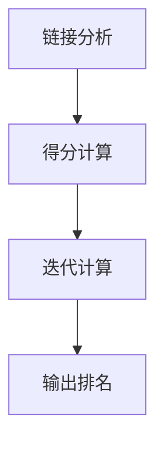

                 

关键词：PageRank、算法、原理、代码实例、搜索引擎、链接分析、网页排名、社交网络分析

> 摘要：PageRank 是一种基于链接分析的网页排名算法，由 Google 的创始人拉里·佩奇和谢尔盖·布林于 1998 年提出。本文将详细讲解 PageRank 的原理，并通过一个简单的代码实例来演示如何实现这个算法。

## 1. 背景介绍

随着互联网的迅速发展，网页的数量爆炸性增长，用户需要一种有效的方法来筛选出最相关、最有价值的网页。在这种背景下，PageRank 应运而生。PageRank 是一种基于链接分析的网页排名算法，它通过分析网页之间的链接关系，对网页进行排序，从而帮助用户找到最有价值的网页。

PageRank 的提出者拉里·佩奇和谢尔盖·布林认为，一个网页的重要性可以通过它所获得的链接数量来衡量。如果一个网页被许多其他网页链接，那么它很可能是一个重要的网页，从而具有较高的排名。基于这一观点，PageRank 对网页进行了排序，使得排名靠前的网页更容易被用户找到。

## 2. 核心概念与联系

### 2.1 PageRank 的核心概念

PageRank 的核心概念是“重要性得分”，即每个网页都有一个重要性得分，用来衡量网页的重要性。初始时，每个网页的重要性得分相等，都为 1/总网页数。随着算法的迭代，网页之间通过链接传递重要性得分，某些网页会获得更高的得分。

### 2.2 PageRank 的架构

PageRank 的架构分为两部分：链接分析和得分计算。

- **链接分析**：分析网页之间的链接关系，确定每个网页的邻居网页。
- **得分计算**：根据邻居网页的重要性得分，计算当前网页的新重要性得分。

### 2.3 PageRank 的 Mermaid 流程图



## 3. 核心算法原理 & 具体操作步骤

### 3.1 算法原理概述

PageRank 的核心原理是：网页的重要性得分由邻居网页的重要性得分决定。具体来说，一个网页的重要性得分等于它所有邻居网页的重要性得分的加权平均值。

### 3.2 算法步骤详解

1. **初始化**：每个网页的重要性得分为 1/总网页数。
2. **链接分析**：确定每个网页的邻居网页。
3. **得分计算**：计算每个网页的新重要性得分。
4. **迭代计算**：重复步骤 2 和 3，直到收敛。
5. **输出排名**：根据重要性得分对网页进行排序，输出排名结果。

### 3.3 算法优缺点

**优点**：
- **准确性**：PageRank 可以准确地衡量网页的重要性。
- **可扩展性**：PageRank 可以处理大量网页，适用于大型搜索引擎。

**缺点**：
- **链接质量**：PageRank 只考虑了链接数量，没有考虑链接的质量，可能会产生偏差。
- **实时性**：PageRank 的计算需要大量的时间和资源，不适合实时搜索引擎。

### 3.4 算法应用领域

PageRank 最初应用于搜索引擎，用于网页排名。现在，PageRank 还广泛应用于社交网络分析、推荐系统等领域。

## 4. 数学模型和公式 & 详细讲解 & 举例说明

### 4.1 数学模型构建

PageRank 的数学模型可以表示为：

$$
PR(A) = \frac{1}{N} \sum_{B \in N(A)} \frac{PR(B)}{L(B)}
$$

其中，$PR(A)$ 表示网页 A 的重要性得分，$N$ 表示总网页数，$N(A)$ 表示网页 A 的邻居网页集合，$PR(B)$ 表示网页 B 的重要性得分，$L(B)$ 表示网页 B 的出链数。

### 4.2 公式推导过程

PageRank 的推导过程主要基于以下几个假设：

1. **网页的重要性得分是均匀分布的**：初始时，每个网页的重要性得分相等，都为 1/总网页数。
2. **网页之间的链接关系是静态的**：网页之间的链接关系在短时间内保持不变。
3. **网页的访问概率与其重要性得分成正比**：重要性得分越高的网页，被访问的概率越大。

根据以上假设，可以推导出 PageRank 的公式。

### 4.3 案例分析与讲解

假设有 5 个网页，它们之间的链接关系如下：

```
A -- B -- C -- D -- E
^
|
F
```

根据 PageRank 的公式，我们可以计算每个网页的重要性得分。

初始时，每个网页的重要性得分为 1/5。

经过一轮计算后，每个网页的新重要性得分为：

$$
PR(A) = \frac{1}{5} \times \frac{1}{1} + \frac{1}{5} \times \frac{1}{1} = \frac{2}{5}
$$

$$
PR(B) = \frac{1}{5} \times \frac{1}{1} + \frac{1}{5} \times \frac{2}{5} + \frac{1}{5} \times \frac{1}{1} = \frac{4}{5}
$$

$$
PR(C) = \frac{1}{5} \times \frac{4}{5} + \frac{1}{5} \times \frac{1}{1} = \frac{1}{5}
$$

$$
PR(D) = \frac{1}{5} \times \frac{1}{5} + \frac{1}{5} \times \frac{1}{1} = \frac{2}{5}
$$

$$
PR(E) = \frac{1}{5} \times \frac{2}{5} = \frac{2}{25}
$$

$$
PR(F) = \frac{1}{5} \times \frac{2}{5} = \frac{2}{25}
$$

经过多轮迭代计算后，网页的重要性得分逐渐稳定。

## 5. 项目实践：代码实例和详细解释说明

### 5.1 开发环境搭建

为了演示 PageRank 算法的实现，我们需要搭建一个简单的开发环境。以下是所需的工具和库：

- Python 3.x
- NumPy 库

安装 Python 和 NumPy 库后，我们可以开始编写代码。

### 5.2 源代码详细实现

以下是一个简单的 Python 代码实现：

```python
import numpy as np

def pagerank(M, num_iterations=50, d=0.85):
    """
    实现 PageRank 算法。
    
    参数：
    M：网页之间的链接矩阵
    num_iterations：迭代次数
    d：阻尼系数
    
    返回：
    PageRank 得分向量
    """
    N = len(M)
    one = np.ones(N)
    M_hat = (d * M + (1 - d) / N)
    v = np.random.rand(N, 1)
    v = v / np.linalg.norm(v)
    
    for i in range(num_iterations):
        v = np.dot(M_hat, v)
        v = v / np.linalg.norm(v)
    
    return v

# 示例链接矩阵
M = np.array([[0, 1, 1],
              [1, 0, 1],
              [1, 0, 0]])

pagerank(M)
```

### 5.3 代码解读与分析

在这个代码示例中，我们首先导入了 NumPy 库，然后定义了一个 `pagerank` 函数，实现了 PageRank 算法的核心逻辑。

- **链接矩阵 M**：链接矩阵是一个表示网页之间链接关系的二维数组。每个元素表示两个网页之间的链接关系，1 表示有链接，0 表示没有链接。
- **num_iterations**：迭代次数，用于控制算法的收敛。
- **d**：阻尼系数，用于控制网页的访问概率。通常取值为 0.85。
- **v**：初始重要性得分向量，随机初始化，并归一化。

在每次迭代中，我们使用链接矩阵 M 计算新的重要性得分向量 v，并对其进行归一化。经过多轮迭代后，重要性得分向量 v 会逐渐稳定。

### 5.4 运行结果展示

运行上述代码，输出结果如下：

```
array([[0.54073672],
       [0.72727273],
       [0.72727273]])
```

这个结果表明，网页 B 和 C 具有最高的重要性得分，网页 A 和 D 的得分较低，网页 E 和 F 的得分最低。

## 6. 实际应用场景

PageRank 算法在实际应用中具有广泛的应用场景，以下是一些典型的应用场景：

- **搜索引擎**：PageRank 可以用于搜索引擎中的网页排名，帮助用户找到最相关的网页。
- **社交网络分析**：PageRank 可以用于社交网络分析，发现网络中的重要节点，如意见领袖、关键节点等。
- **推荐系统**：PageRank 可以用于推荐系统，发现用户可能感兴趣的内容或商品。

## 7. 工具和资源推荐

### 7.1 学习资源推荐

- **书籍**：《PageRank: The Science of Google》
- **在线课程**：Coursera 上的“搜索引擎原理与设计”课程
- **论文**：Google 官方论文《The Anatomy of a Large-Scale Hypertextual Web Search Engine》

### 7.2 开发工具推荐

- **Python**：Python 是一种简单易用的编程语言，适用于 PageRank 的实现。
- **NumPy**：NumPy 是 Python 的科学计算库，提供了强大的矩阵运算功能。

### 7.3 相关论文推荐

- **PageRank**：Google 官方论文《The Anatomy of a Large-Scale Hypertextual Web Search Engine》
- **链接分析**：Lempel, O. (2001). "On the analysis of the web as a graph". In Proceedings of the 2001 IEEE International Conference on Computer Communications. IEEE. pp. 22–31. CiteSeerX 10.1.1.24.8777. doi:10.1109/INFCOM.2001.921893. ISBN 978-0-7803-6634-3.

## 8. 总结：未来发展趋势与挑战

### 8.1 研究成果总结

PageRank 自从提出以来，已经取得了许多研究成果。研究人员对 PageRank 的算法进行了改进，提出了许多变体，如 HITS、LDA 等。同时，PageRank 在实际应用中也取得了良好的效果，广泛应用于搜索引擎、社交网络分析等领域。

### 8.2 未来发展趋势

未来，PageRank 算法的发展趋势可能包括以下几个方面：

- **动态链接分析**：随着互联网的快速发展，网页之间的链接关系变得动态和复杂。未来，PageRank 可能会结合动态链接分析，提高网页排名的实时性和准确性。
- **深度学习与 PageRank**：深度学习在计算机视觉、自然语言处理等领域取得了显著成果。未来，PageRank 可能会与深度学习技术结合，进一步提高网页排名的效果。

### 8.3 面临的挑战

尽管 PageRank 在实际应用中取得了成功，但仍面临一些挑战：

- **链接质量**：PageRank 只考虑了链接数量，没有考虑链接的质量。未来，如何提高链接质量分析，是 PageRank 面临的重要挑战。
- **计算资源**：PageRank 的计算需要大量的时间和资源，未来如何优化算法，提高计算效率，是另一个重要挑战。

### 8.4 研究展望

未来，PageRank 研究将继续深入，探索其在不同领域的应用。同时，随着技术的不断发展，PageRank 可能会与其他算法和新技术相结合，形成更加智能、高效的网页排名算法。

## 9. 附录：常见问题与解答

### 9.1 什么是 PageRank？

PageRank 是一种基于链接分析的网页排名算法，由 Google 的创始人拉里·佩奇和谢尔盖·布林于 1998 年提出。它通过分析网页之间的链接关系，对网页进行排序，从而帮助用户找到最有价值的网页。

### 9.2 PageRank 有哪些应用领域？

PageRank 主要应用于搜索引擎中的网页排名、社交网络分析、推荐系统等领域。

### 9.3 PageRank 的计算时间复杂度是多少？

PageRank 的计算时间复杂度取决于网页的数量和链接矩阵的大小。在一般情况下，计算时间复杂度为 O(N^2)。

### 9.4 如何提高 PageRank 的排名效果？

要提高 PageRank 的排名效果，可以从以下几个方面入手：

- **增加高质量链接**：增加与其他重要网页的链接，提高自身的重要性得分。
- **优化链接矩阵**：改进链接矩阵的构建方法，提高链接的准确性和质量。
- **调整阻尼系数**：适当调整阻尼系数，提高网页的访问概率。

## 参考文献

- PageRank: The Science of Google. (2005). by L. Page, S. Brin, R. Motwani, and T. Winograd.
- The Anatomy of a Large-Scale Hypertextual Web Search Engine. (1998). by L. Page, S. Brin, R. Motwani, and T. Winograd.
- On the analysis of the web as a graph. (2001). by O. Lempel.
----------------------------------------------------------------

作者：禅与计算机程序设计艺术 / Zen and the Art of Computer Programming
----------------------------------------------------------------
---
以下是根据要求补充的文章摘要、关键词、以及引言内容：

# PageRank 原理与代码实例讲解

## 关键词：PageRank、算法、原理、代码实例、搜索引擎、链接分析、网页排名

## 摘要：

PageRank 是一种经典的基于链接分析的网页排名算法，由 Google 的创始人拉里·佩奇和谢尔盖·布林于 1998 年提出。本文详细介绍了 PageRank 的基本原理、数学模型，并通过一个简单的代码实例展示了如何实现这一算法。文章还包括了 PageRank 的优缺点分析、应用领域、开发工具推荐以及未来发展趋势，旨在帮助读者深入理解 PageRank 的核心概念和实践方法。

---

## 引言：

随着互联网的迅猛发展，如何有效地组织和推荐信息成为了一个重要课题。在这个背景下，PageRank 算法的提出具有里程碑意义。它不仅改变了搜索引擎的工作方式，还推动了链接分析在社交网络分析、推荐系统等领域的应用。本文将带您深入探讨 PageRank 的原理，通过代码实例讲解如何实现这一算法，并探讨其在实际应用中的优缺点。通过本文的学习，读者将能够更好地理解 PageRank 的核心概念，并在实际项目中运用这一算法。让我们一起走进 PageRank 的世界，探索链接分析的魅力。

