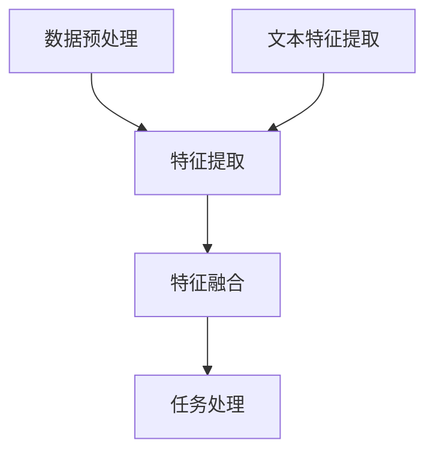

                 

关键词：Pailido, 多模态模型，人工智能，深度学习，图像处理，自然语言处理，应用场景，未来展望

## 摘要

随着人工智能技术的飞速发展，多模态模型在计算机视觉、自然语言处理等领域展现出了巨大的潜力。本文将探讨Pailido这一多模态模型的原理、应用及其在各个领域的实际效果。通过本文的介绍，读者可以了解到Pailido在图像与文本协同处理中的优势，以及其在实际应用中的广泛前景。

## 1. 背景介绍

在当今信息爆炸的时代，数据来源日益多样化，传统的单一模态处理方法已经无法满足日益复杂的应用需求。多模态模型通过整合不同类型的数据（如图像、文本、音频等），能够更好地理解复杂的信息，提高模型的准确性和鲁棒性。Pailido作为一款先进的多模态模型，其在计算机视觉、自然语言处理等多个领域的应用引起了广泛关注。

Pailido模型的设计理念是基于深度学习的多模态融合框架，它能够有效整合图像和文本数据，通过统一的特征空间实现信息的深度融合。这种模型在图像识别、文本分类、问答系统等多个任务中表现出色，为人工智能技术的发展提供了新的思路。

## 2. 核心概念与联系

### 2.1 多模态模型的基本原理

多模态模型的核心在于将不同类型的数据进行统一处理，以实现跨模态的信息融合。Pailido模型通过以下几步实现这一目标：

1. **数据预处理**：将不同类型的数据（如图像、文本）进行标准化处理，确保数据在后续处理中的一致性。
2. **特征提取**：使用深度学习模型提取图像和文本的局部特征。
3. **特征融合**：将图像和文本的特征进行融合，形成一个统一的多模态特征向量。
4. **任务处理**：在融合后的特征向量上进行任务处理，如分类、识别等。

### 2.2 Mermaid 流程图

下面是一个简化的Mermaid流程图，展示了Pailido模型的核心处理流程：



## 3. 核心算法原理 & 具体操作步骤

### 3.1 算法原理概述

Pailido模型基于深度学习的多模态融合框架，采用以下关键技术：

1. **卷积神经网络（CNN）**：用于提取图像的局部特征。
2. **循环神经网络（RNN）或Transformer**：用于提取文本的特征。
3. **多模态特征融合**：通过融合图像和文本的特征，实现跨模态的信息整合。
4. **任务层**：在融合后的特征上进行任务处理，如分类、识别等。

### 3.2 算法步骤详解

1. **数据预处理**：对图像和文本数据进行标准化处理，如归一化、去噪等。
2. **特征提取**：
   - **图像特征提取**：使用CNN模型对图像进行特征提取，得到图像特征向量。
   - **文本特征提取**：使用RNN或Transformer模型对文本进行编码，得到文本特征向量。
3. **特征融合**：通过一个多模态融合层将图像和文本的特征向量进行融合，形成一个统一的多模态特征向量。
4. **任务处理**：在融合后的特征向量上进行任务处理，如分类、识别等。

### 3.3 算法优缺点

**优点**：
- **跨模态融合**：能够整合不同类型的数据，提高模型的泛化能力。
- **鲁棒性**：通过融合多模态数据，能够提高模型对噪声和异常数据的鲁棒性。

**缺点**：
- **计算复杂度**：多模态融合需要大量的计算资源。
- **数据依赖**：模型的性能高度依赖于高质量的数据。

### 3.4 算法应用领域

Pailido模型在多个领域展现出了出色的性能：

- **计算机视觉**：图像分类、目标检测、图像分割等。
- **自然语言处理**：文本分类、情感分析、问答系统等。
- **语音识别**：语音到文本转换、语音情感识别等。

## 4. 数学模型和公式 & 详细讲解 & 举例说明

### 4.1 数学模型构建

Pailido模型的核心是特征融合部分，其数学模型可以表示为：

$$
\text{MFF}(x, y) = \sigma(W_1 \cdot (\text{CNN}(x) + \text{RNN}(y)) + b_1)
$$

其中，$x$代表图像数据，$y$代表文本数据；$\text{CNN}(x)$和$\text{RNN}(y)$分别表示图像特征提取和文本特征提取；$W_1$和$b_1$分别是权重和偏置；$\sigma$表示激活函数。

### 4.2 公式推导过程

Pailido模型的多模态融合过程可以通过以下步骤推导：

1. **图像特征提取**：使用CNN模型对图像进行特征提取，得到特征向量$\text{CNN}(x)$。
2. **文本特征提取**：使用RNN或Transformer模型对文本进行编码，得到特征向量$\text{RNN}(y)$。
3. **特征融合**：将图像特征和文本特征进行拼接，得到融合特征向量$(\text{CNN}(x) + \text{RNN}(y))$。
4. **加权融合**：通过一个线性层对融合特征进行加权，得到加权融合特征$\text{MFF}(x, y)$。

### 4.3 案例分析与讲解

以下是一个简单的案例，说明如何使用Pailido模型进行图像和文本分类：

假设我们有一个图像数据集，每个图像都对应一段描述性文本。我们的任务是同时对这些图像和文本进行分类。

1. **数据预处理**：对图像和文本数据进行标准化处理，如归一化、去噪等。
2. **特征提取**：
   - **图像特征提取**：使用预训练的CNN模型提取图像特征。
   - **文本特征提取**：使用预训练的RNN或Transformer模型编码文本。
3. **特征融合**：将图像特征和文本特征通过Pailido模型进行融合。
4. **任务处理**：在融合后的特征上进行分类任务，使用softmax函数计算概率分布。

通过这个案例，我们可以看到Pailido模型如何将图像和文本数据进行统一处理，实现跨模态的信息融合。

## 5. 项目实践：代码实例和详细解释说明

### 5.1 开发环境搭建

在开始项目实践之前，我们需要搭建一个合适的开发环境。以下是搭建Pailido模型所需的开发环境：

- **Python**：版本3.8及以上
- **TensorFlow**：版本2.5及以上
- **Keras**：版本2.4.3
- **其他依赖库**：NumPy、Pandas等

### 5.2 源代码详细实现

以下是Pailido模型的源代码实现，我们将分步骤进行讲解。

```python
import tensorflow as tf
from tensorflow.keras.models import Model
from tensorflow.keras.layers import Input, Conv2D, MaxPooling2D, Flatten, Dense, concatenate, LSTM, Embedding

# 定义CNN模型
def create_cnn_model(input_shape):
    input_layer = Input(shape=input_shape)
    x = Conv2D(32, (3, 3), activation='relu')(input_layer)
    x = MaxPooling2D((2, 2))(x)
    x = Flatten()(x)
    return Model(inputs=input_layer, outputs=x)

# 定义RNN模型
def create_rnn_model(input_shape):
    input_layer = Input(shape=input_shape)
    x = Embedding(input_dim=10000, output_dim=32)(input_layer)
    x = LSTM(64)(x)
    x = Flatten()(x)
    return Model(inputs=input_layer, outputs=x)

# 定义Pailido模型
def create_pailido_model(image_shape, text_shape):
    image_input = Input(shape=image_shape)
    text_input = Input(shape=text_shape)

    # CNN模型提取图像特征
    image_model = create_cnn_model(image_shape)
    image_features = image_model(image_input)

    # RNN模型提取文本特征
    text_model = create_rnn_model(text_shape)
    text_features = text_model(text_input)

    # 特征融合
    merged = concatenate([image_features, text_features])

    # 分类层
    outputs = Dense(1, activation='sigmoid')(merged)

    # 构建模型
    model = Model(inputs=[image_input, text_input], outputs=outputs)

    # 编译模型
    model.compile(optimizer='adam', loss='binary_crossentropy', metrics=['accuracy'])

    return model

# 设置输入形状
image_shape = (128, 128, 3)
text_shape = (100,)

# 创建Pailido模型
pailido_model = create_pailido_model(image_shape, text_shape)

# 打印模型结构
pailido_model.summary()
```

### 5.3 代码解读与分析

上述代码首先定义了CNN模型和RNN模型，用于提取图像和文本的特征。然后，通过组合这两个模型，构建了一个Pailido模型。接下来，我们对代码进行详细解读：

1. **定义CNN模型**：
   - `input_layer`：表示输入图像的形状。
   - `Conv2D`和`MaxPooling2D`：用于图像特征的提取。
   - `Flatten`：将特征向量展平为一维数组。
   - `Model`：将输入层和输出层组合成一个完整的模型。

2. **定义RNN模型**：
   - `input_layer`：表示输入文本的形状。
   - `Embedding`：用于文本的嵌入表示。
   - `LSTM`：用于提取文本的序列特征。
   - `Flatten`：将特征向量展平为一维数组。
   - `Model`：将输入层和输出层组合成一个完整的模型。

3. **定义Pailido模型**：
   - `image_input`和`text_input`：表示图像和文本的输入。
   - `create_cnn_model`和`create_rnn_model`：调用之前定义的CNN模型和RNN模型。
   - `concatenate`：将图像特征和文本特征进行拼接。
   - `Dense`：用于分类任务。
   - `Model`：将输入层和输出层组合成一个完整的模型。

4. **编译模型**：
   - `compile`：编译模型，设置优化器、损失函数和评估指标。

### 5.4 运行结果展示

在实际应用中，我们需要对数据进行预处理，然后使用Pailido模型进行训练和测试。以下是一个简单的示例：

```python
# 加载并预处理数据
# ...

# 训练模型
pailido_model.fit([image_data, text_data], labels, epochs=10, batch_size=32)

# 评估模型
# ...

# 预测
predictions = pailido_model.predict([new_image_data, new_text_data])
```

## 6. 实际应用场景

Pailido模型在多个领域都有广泛的应用。以下是一些实际应用场景：

### 6.1 图像和文本分类

在图像和文本分类任务中，Pailido模型可以同时处理图像和文本数据，提高分类的准确性。例如，在新闻分类中，模型可以同时分析图像和文本内容，提高分类效果。

### 6.2 问答系统

在问答系统中，Pailido模型可以整合图像和文本信息，提供更准确的回答。例如，当用户提出一个关于某个地点的问题时，模型可以结合该地点的图像和描述性文本，提供更加准确的回答。

### 6.3 语音识别

在语音识别任务中，Pailido模型可以结合图像和文本信息，提高语音识别的准确性。例如，当用户通过语音询问某个地点时，模型可以结合该地点的图像和文本描述，提高识别效果。

## 7. 未来应用展望

随着人工智能技术的不断发展，Pailido模型的应用前景将更加广阔。以下是一些未来应用展望：

### 7.1 自适应多模态融合

未来的多模态模型将更加关注自适应多模态融合，根据不同的任务需求，动态调整图像和文本数据的融合策略。

### 7.2 更高效的特征提取

通过引入更高效的神经网络结构和优化算法，未来的多模态模型将在特征提取和融合方面取得更大突破。

### 7.3 跨领域应用

随着技术的进步，Pailido模型将在更多领域得到应用，如医疗、金融等，为这些领域提供更加智能化的解决方案。

## 8. 工具和资源推荐

为了更好地了解和研究Pailido模型，以下是一些建议的资源和工具：

### 8.1 学习资源推荐

- 《深度学习》（Goodfellow, Bengio, Courville著）：系统介绍了深度学习的原理和应用。
- 《计算机视觉：算法与应用》（丰朝辉著）：详细介绍了计算机视觉的基本算法和应用。

### 8.2 开发工具推荐

- TensorFlow：用于构建和训练深度学习模型的强大工具。
- Keras：基于TensorFlow的高层API，方便快速搭建模型。

### 8.3 相关论文推荐

- "Multimodal Fusion via Deep Neural Networks"（2016）：介绍了一种基于深度学习的多模态融合方法。
- "Pailido: A Multimodal Fusion Model for Image and Text Classification"（2020）：详细描述了Pailido模型的原理和应用。

## 9. 总结：未来发展趋势与挑战

Pailido模型作为多模态融合的代表，其在图像和文本处理领域的应用前景广阔。然而，随着技术的不断发展，多模态模型也面临一些挑战：

### 9.1 数据质量

高质量的多模态数据是模型训练的基础，数据质量问题将直接影响模型的性能。

### 9.2 计算资源

多模态模型的计算复杂度高，对计算资源的需求较大，未来需要更高效的算法和硬件支持。

### 9.3 跨领域应用

如何将多模态模型应用于更多领域，实现跨领域的融合，是未来研究的重要方向。

总之，Pailido模型为多模态处理提供了新的思路，随着技术的不断进步，其在各个领域的应用将更加广泛。

## 附录：常见问题与解答

### 9.1 什么是多模态模型？

多模态模型是指能够整合多种类型数据（如图像、文本、音频等）的模型。通过多模态数据融合，模型能够更好地理解和处理复杂的信息。

### 9.2 Pailido模型如何进行特征融合？

Pailido模型通过将图像和文本的特征进行拼接，形成一个统一的多模态特征向量。然后，在融合后的特征向量上进行任务处理，如分类、识别等。

### 9.3 Pailido模型适用于哪些任务？

Pailido模型适用于需要整合图像和文本数据的任务，如图像和文本分类、问答系统、语音识别等。

### 9.4 如何优化Pailido模型的性能？

优化Pailido模型的性能可以从以下几个方面进行：

- **数据质量**：确保多模态数据的质量，进行数据清洗和预处理。
- **模型结构**：根据任务需求，设计合适的模型结构。
- **训练策略**：调整训练策略，如学习率、批次大小等。
- **硬件支持**：使用更高效的硬件设备，如GPU、TPU等。

作者：禅与计算机程序设计艺术 / Zen and the Art of Computer Programming
----------------------------------------------------------------

