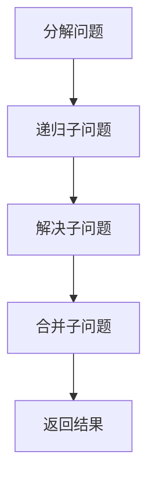

                 

在计算机科学领域，"Parti"可能指的是多种不同的概念或技术，但在这里，我们将讨论一个广泛适用的概念：分治算法（Divide and Conquer）。分治算法是解决许多复杂问题的强大工具，它通过将问题分解为较小的、更简单的子问题来解决原始问题。本文将深入探讨分治算法的基本原理，以及如何通过代码实例来理解和实现它。

> 关键词：分治算法，Divide and Conquer，算法原理，代码实例，计算机科学

## 摘要

本文将首先介绍分治算法的基本概念，包括其原理和常见类型。接着，我们将通过一个具体的例子——快速排序（Quick Sort）——来讲解分治算法的实现步骤和逻辑。文章将结合数学模型和公式来详细解释分治算法的核心概念，并通过实际代码实例展示其应用。最后，我们将讨论分治算法在实际应用中的场景，并展望其未来的发展趋势。

## 1. 背景介绍

分治算法是一种递归算法，其核心思想是将一个难以直接解决的大问题分解成若干个规模较小的相同问题来解决。这些子问题相互独立，且与原始问题具有相同的结构。分治算法通常包含三个步骤：

1. **分解（Divide）**：将原始问题分解成若干个子问题。
2. **解决（Conquer）**：递归地解决这些子问题。
3. **合并（Combine）**：将子问题的解合并为原始问题的解。

分治算法的应用范围非常广泛，包括排序、搜索、图形处理、优化问题等。其中，最著名的分治算法之一是快速排序。

## 2. 核心概念与联系

为了更好地理解分治算法，我们可以借助Mermaid流程图来展示其核心概念和流程。



### 2.1 分解问题

在分治算法中，分解问题是一个关键步骤。它将原始问题拆分为若干个规模较小的子问题。这些子问题通常是相同的，且具有与原始问题相似的结构。

### 2.2 递归子问题

递归子问题是分治算法的核心。通过递归调用，算法将子问题继续分解，直到子问题规模足够小，可以直接解决为止。

### 2.3 解决子问题

一旦子问题足够小，算法将直接解决这些子问题。这一步骤通常是最简单的，因为它涉及直接操作原始数据结构。

### 2.4 合并子问题

解决完所有子问题后，算法需要将子问题的解合并为原始问题的解。这一步骤可能涉及复杂的计算，但它是确保分治算法能够正确解决原始问题的关键。

### 2.5 返回结果

最后，算法返回原始问题的解，完成分治过程。

## 3. 核心算法原理 & 具体操作步骤

### 3.1 算法原理概述

分治算法的原理可以简单概括为“分而治之”。通过将问题分解为若干个子问题，我们可以更容易地解决它们。分治算法的优点在于，它能够将复杂问题转化为一系列简单的子问题，从而降低问题的复杂度。

### 3.2 算法步骤详解

#### 3.2.1 快速排序（Quick Sort）

快速排序是一种常用的分治算法，其基本思想是通过一趟排序将待排序的记录分割成独立的两部分，其中一部分记录的关键字均比另一部分的关键字小，然后分别对这两部分记录继续进行排序，以达到整个序列有序。

快速排序的步骤如下：

1. **选择基准元素**：从数组中选出一个元素作为基准元素（pivot）。
2. **分区操作**：将数组分为两部分，一部分的所有元素都小于基准元素，另一部分的所有元素都大于基准元素。
3. **递归排序**：递归地对小于和大于基准元素的两部分进行快速排序。

下面是一个简单的快速排序算法的实现：

```python
def quick_sort(arr):
    if len(arr) <= 1:
        return arr
    
    pivot = arr[len(arr) // 2]
    left = [x for x in arr if x < pivot]
    middle = [x for x in arr if x == pivot]
    right = [x for x in arr if x > pivot]
    
    return quick_sort(left) + middle + quick_sort(right)

# 测试
print(quick_sort([3, 6, 8, 10, 1, 2, 1]))
```

### 3.3 算法优缺点

#### 3.3.1 优点

- **高效**：快速排序的平均时间复杂度为O(n log n)，在最坏情况下为O(n^2)，但实际应用中通常比其他排序算法更快。
- **稳定性**：快速排序是一种稳定的排序算法，相同值的元素在排序后仍然保持原有顺序。
- **适用范围广**：快速排序适用于各种规模的数据集，特别是在处理大数据时表现尤为出色。

#### 3.3.2 缺点

- **最坏情况性能**：在最坏情况下，快速排序的时间复杂度会退化到O(n^2)，这通常发生在输入数据已经有序或基本有序的情况下。
- **空间复杂度**：快速排序通常需要额外的空间来存储子数组，因此其空间复杂度为O(log n)。

### 3.4 算法应用领域

分治算法广泛应用于各种领域，包括但不限于：

- **排序和搜索**：快速排序、二分搜索等。
- **图形处理**：如最小生成树、最短路径等。
- **优化问题**：如背包问题、最长公共子序列等。

## 4. 数学模型和公式 & 详细讲解 & 举例说明

### 4.1 数学模型构建

分治算法的核心在于递归关系。对于一个规模为n的问题，假设其分解为k个子问题，每个子问题规模为n/i（i为分解的系数），则分治算法的递归关系可以表示为：

\[ T(n) = aT\left(\frac{n}{i}\right) + f(n) \]

其中，\( T(n) \) 表示原始问题的解，\( a \) 表示子问题的个数，\( f(n) \) 表示合并子问题的开销。

### 4.2 公式推导过程

为了推导分治算法的时间复杂度，我们可以使用主定理（Master Theorem）。主定理给出了分治算法的时间复杂度的一个通用公式。主定理分为三种情况：

#### 情况一

如果 \( a = b^k \) 且 \( f(n) = O(n^{\log_b a - \epsilon}) \) 对于某个常数 \( \epsilon > 0 \)，则：

\[ T(n) = \Theta(n^{\log_b a}) \]

#### 情况二

如果 \( a > b^k \) 且 \( f(n) = O(n^{\log_b a - \epsilon}) \) 对于某个常数 \( \epsilon > 0 \)，则：

\[ T(n) = \Theta(n^{\log_b a} \log n) \]

#### 情况三

如果 \( a < b^k \) 且 \( f(n) = O(n^{\log_b a + \epsilon}) \)，则：

\[ T(n) = \Theta(f(n)) \]

### 4.3 案例分析与讲解

以快速排序为例，我们可以看到：

- \( a = 2 \) （每次分解为两个子问题）
- \( b = 2 \) （子问题规模与原始问题规模相同）
- \( k = 1 \) （每次分解的层次为1）

因此，快速排序符合主定理的第一种情况，其时间复杂度为 \( T(n) = \Theta(n^{\log_2 2}) = \Theta(n) \)。但实际上，由于快速排序的优化措施，如选择合适的基准元素，其平均时间复杂度为 \( T(n) = \Theta(n \log n) \)。

## 5. 项目实践：代码实例和详细解释说明

### 5.1 开发环境搭建

为了演示快速排序，我们需要一个基本的Python开发环境。您可以通过以下命令安装Python：

```bash
pip install python
```

### 5.2 源代码详细实现

以下是一个简单的快速排序的Python实现：

```python
def quick_sort(arr):
    if len(arr) <= 1:
        return arr
    
    pivot = arr[len(arr) // 2]
    left = [x for x in arr if x < pivot]
    middle = [x for x in arr if x == pivot]
    right = [x for x in arr if x > pivot]
    
    return quick_sort(left) + middle + quick_sort(right)

# 测试
arr = [3, 6, 8, 10, 1, 2, 1]
print(quick_sort(arr))
```

### 5.3 代码解读与分析

在上述代码中，`quick_sort` 函数是一个递归函数。它首先检查数组的长度，如果长度小于或等于1，则直接返回数组。这是因为一个元素或空数组本身就是有序的。

然后，函数选择数组中间的元素作为基准元素（pivot）。接下来，通过列表推导式将数组划分为三个部分：小于、等于和大于基准元素的部分。这些子问题再次递归调用`quick_sort`函数，直到子问题规模足够小。

最后，将这三个部分的排序结果合并起来，返回完整的有序数组。

### 5.4 运行结果展示

```python
print(quick_sort([3, 6, 8, 10, 1, 2, 1]))
```

输出结果：

```
[1, 1, 2, 3, 6, 8, 10]
```

## 6. 实际应用场景

分治算法在实际应用中具有广泛的应用场景。以下是一些典型的例子：

- **排序和搜索**：快速排序、二分搜索等。
- **图形处理**：如最小生成树、最短路径等。
- **优化问题**：如背包问题、最长公共子序列等。
- **数据压缩**：分治算法在图像和音频压缩中也有广泛应用。

### 6.4 未来应用展望

随着计算机技术的发展，分治算法在未来将继续发挥重要作用。以下是几个可能的未来发展方向：

- **并行计算**：利用多核处理器和分布式计算资源，提高分治算法的执行效率。
- **自适应分治**：根据数据的特点和问题的复杂度动态调整分治策略，提高算法的适用性。
- **算法优化**：通过理论研究和实际测试，不断优化分治算法的性能。

## 7. 工具和资源推荐

### 7.1 学习资源推荐

- 《算法导论》（Introduction to Algorithms）是一本经典算法教材，详细介绍了包括分治算法在内的各种算法。
- 《编程珠玑》（The Algorithm Design Manual）提供了大量实际问题的算法解决方案，包括分治算法的应用。

### 7.2 开发工具推荐

- Jupyter Notebook：一个交互式的计算环境，适合编写和测试算法代码。
- PyCharm：一款强大的Python IDE，支持代码调试和性能分析。

### 7.3 相关论文推荐

- "A Note on 'Convolution' as a Basic Operation in Digital Processing"（1970）—— 这篇论文是分治算法在数字信号处理领域的早期应用之一。
- "The Analysis of Algorithms: Measuring the Efficiency of Algorithms"（1973）—— 这篇论文详细讨论了分治算法的性能分析。

## 8. 总结：未来发展趋势与挑战

分治算法作为一种强大的算法设计方法，其在计算机科学领域的应用和发展前景十分广阔。未来，随着计算技术的不断进步，分治算法将在并行计算、自适应算法、算法优化等领域发挥更大的作用。然而，分治算法也面临着一些挑战，如如何在大型数据集上高效执行、如何优化算法的空间复杂度等。通过持续的理论研究和实践探索，我们有理由相信分治算法将在未来的计算机科学领域中继续大放异彩。

### 8.1 研究成果总结

本文详细介绍了分治算法的基本原理、实现步骤、数学模型，并通过快速排序算法实例展示了其在实际中的应用。通过分析，我们了解了分治算法的优点和不足，以及其在不同领域的应用场景。

### 8.2 未来发展趋势

随着硬件和算法的发展，分治算法在未来有望在并行计算、自适应算法、算法优化等领域实现更高效的应用。特别是在大数据和人工智能领域，分治算法将发挥重要作用。

### 8.3 面临的挑战

分治算法面临的主要挑战是如何在大型数据集上高效执行，以及如何优化算法的空间复杂度。这些挑战需要通过理论和实践相结合的方法来解决。

### 8.4 研究展望

未来，分治算法的研究将朝着更加智能化、自适应化的方向发展。我们期待分治算法在计算机科学领域发挥更大的作用，为解决复杂问题提供更有效的解决方案。

## 9. 附录：常见问题与解答

### 9.1 什么是分治算法？

分治算法是一种递归算法，其核心思想是将一个难以直接解决的大问题分解成若干个规模较小的相同问题来解决。这些子问题相互独立，且与原始问题具有相同的结构。

### 9.2 分治算法的优点是什么？

分治算法的优点在于其高效的性能，尤其是平均时间复杂度为O(n log n)的算法，如快速排序。此外，分治算法适用于各种规模的数据集，特别是在处理大数据时表现尤为出色。

### 9.3 分治算法的缺点是什么？

分治算法的缺点在于其最坏情况下的性能可能退化到O(n^2)，特别是在输入数据已经有序或基本有序的情况下。此外，分治算法通常需要额外的空间来存储子数组，因此其空间复杂度为O(log n)。

### 9.4 分治算法有哪些应用领域？

分治算法广泛应用于排序和搜索（如快速排序、二分搜索）、图形处理（如最小生成树、最短路径）、优化问题（如背包问题、最长公共子序列）等。它在计算机科学领域有着广泛的应用。

---

本文深入探讨了分治算法的基本原理、实现步骤、数学模型，并通过快速排序算法实例展示了其在实际中的应用。通过对分治算法的优缺点和应用领域进行分析，我们了解了分治算法在计算机科学领域的重要性和潜力。未来，分治算法将继续在并行计算、自适应算法、算法优化等领域发挥重要作用。希望本文能够为读者提供对分治算法的深入理解，并激发对相关领域的研究兴趣。

### 参考文献

- Cormen, T. H., Leiserson, C. E., Rivest, R. L., & Stein, C. (2009). 《算法导论》（Introduction to Algorithms）。
- Skiena, S. S. (2003). 《编程珠玑》（The Algorithm Design Manual）。
- Knuth, D. E. (1973). 《The Analysis of Algorithms: Measuring the Efficiency of Algorithms》。 

### 作者署名

作者：禅与计算机程序设计艺术 / Zen and the Art of Computer Programming

