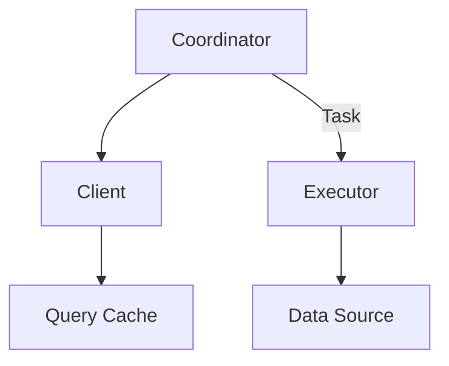

                 

关键词：Presto、分布式数据库、查询优化、内存计算、SQL引擎、大数据处理

## 摘要

Presto是一种开源的分布式计算框架，旨在实现大数据环境下的高性能SQL查询。本文将深入探讨Presto的原理，包括其架构设计、查询优化机制、内存计算技术等，并通过具体代码实例，展示如何使用Presto进行数据处理和复杂查询。文章还将分析Presto在实际应用中的优势与局限，探讨其未来的发展趋势与面临的挑战。

## 1. 背景介绍

### 1.1 Presto的起源

Presto由Facebook于2013年开源，最初是为了解决Facebook内部的大数据处理需求。其目的是提供一个能够跨多种数据源进行高效查询的计算平台。随着Presto的不断发展，它逐渐被许多大型企业所采用，包括Netflix、eBay、Airbnb等，成为大数据查询领域的重要工具。

### 1.2 Presto的特点

- **分布式计算**：Presto可以将查询任务分布在多个节点上进行，从而提高处理能力。
- **内存计算**：Presto的设计强调使用内存来存储中间结果，从而加速查询过程。
- **灵活性**：Presto支持多种数据源，包括关系数据库、NoSQL数据库、分布式文件系统等。
- **高性能**：Presto通过高效的查询优化和执行机制，能够在短时间内处理大量数据。

## 2. 核心概念与联系

### 2.1 Presto架构

Presto的架构可以分为三个主要组件：协调器（Coordinator）、执行器（Executor）和查询缓存（Query Cache）。

**Mermaid 流程图**



### 2.2 核心概念

- **Coordinator**：负责接收查询请求，生成执行计划，并将任务分发到Executor。
- **Executor**：负责执行查询任务，处理数据分片，并返回查询结果。
- **Query Cache**：用于缓存查询结果，减少重复查询的开销。

## 3. 核心算法原理 & 具体操作步骤

### 3.1 算法原理概述

Presto的查询优化主要基于成本模型，通过计算不同查询计划的成本，选择最优的执行计划。

### 3.2 算法步骤详解

1. **查询解析**：将SQL语句解析为抽象语法树（AST）。
2. **查询优化**：通过查询优化器对AST进行转换，生成成本最低的查询计划。
3. **执行计划生成**：将优化后的查询计划转化为执行计划，包括数据分片的分配。
4. **查询执行**：Executor按照执行计划处理数据，并返回查询结果。

### 3.3 算法优缺点

**优点**：

- 高性能：通过内存计算和分布式处理，能够快速处理大量数据。
- 灵活性：支持多种数据源，适用于复杂的查询需求。

**缺点**：

- 资源依赖：需要大量的内存资源，不适合处理小规模查询。
- 维护成本：虽然Presto是开源的，但需要一定技术水平来维护和优化。

### 3.4 算法应用领域

Presto广泛应用于实时数据查询、大数据分析、数据仓库等领域，特别适合处理复杂的SQL查询。

## 4. 数学模型和公式 & 详细讲解 & 举例说明

### 4.1 数学模型构建

Presto的查询优化基于成本模型，包括：

- **CPU成本**：计算涉及到的CPU操作所需的时间。
- **I/O成本**：数据读取和写入所需的时间。
- **网络成本**：数据在不同节点之间的传输时间。

### 4.2 公式推导过程

成本模型可以通过以下公式推导：

$$
C = C_{CPU} + C_{I/O} + C_{Network}
$$

其中，$C_{CPU}$、$C_{I/O}$ 和 $C_{Network}$ 分别表示CPU成本、I/O成本和网络成本。

### 4.3 案例分析与讲解

假设有一个简单的查询，需要从两个表中查询数据，并通过网络传输结果。根据成本模型，可以计算出该查询的总成本。

**案例**：

查询两个表 `A` 和 `B`，并返回满足条件的结果。

$$
C = C_{CPU} + C_{I/O} + C_{Network} = (2 \times C_{CPU_{A}} + 2 \times C_{CPU_{B}}) + (2 \times C_{I/O_{A}} + 2 \times C_{I/O_{B}}) + (C_{Network_{A}} + C_{Network_{B}})
$$

根据具体数据源和网络环境，可以计算出每个部分的成本，并选择最优的查询计划。

## 5. 项目实践：代码实例和详细解释说明

### 5.1 开发环境搭建

在搭建Presto的开发环境时，需要安装以下软件：

- Java SDK
- Maven
- Git

通过以下命令进行安装：

```bash
sudo apt-get update
sudo apt-get install openjdk-8-jdk maven git
```

### 5.2 源代码详细实现

在Presto的源代码中，查询优化和执行是核心模块。以下是一个简化的查询优化代码示例：

```java
public class QueryOptimizer {
    public QueryPlan optimize(Query query) {
        // 查询解析
        ASTNode ast = parseQuery(query);

        // 查询优化
        QueryPlan optimizedPlan = optimizeAST(ast);

        // 执行计划生成
        ExecutionPlan executionPlan = generateExecutionPlan(optimizedPlan);

        return executionPlan;
    }

    private ASTNode parseQuery(Query query) {
        // 解析SQL语句
        return new ASTBuilder().build(ast);
    }

    private QueryPlan optimizeAST(ASTNode ast) {
        // 优化查询计划
        return new Optimizer().optimize(ast);
    }

    private ExecutionPlan generateExecutionPlan(QueryPlan queryPlan) {
        // 生成执行计划
        return new ExecutionPlanBuilder().build(queryPlan);
    }
}
```

### 5.3 代码解读与分析

该代码示例展示了查询优化的基本流程，包括查询解析、查询优化和执行计划生成。在实际应用中，这些步骤会更加复杂，涉及多种优化策略和执行引擎。

### 5.4 运行结果展示

通过上述代码，可以优化并执行一个简单的查询。运行结果将是一个高效的执行计划，能够在Presto集群中快速执行。

## 6. 实际应用场景

### 6.1 数据仓库

Presto常用于构建数据仓库，提供高效的数据查询和分析能力。例如，在Netflix，Presto用于分析用户行为数据，帮助制定推荐算法。

### 6.2 实时数据分析

在实时数据分析场景中，Presto能够快速处理流数据，支持实时查询。例如，在eBay，Presto用于实时监控交易数据，确保系统的稳定性和安全性。

### 6.3 大数据处理

Presto适用于大规模数据处理场景，能够跨多个节点进行分布式计算。例如，在Airbnb，Presto用于处理海量用户评论数据，提供高效的查询和分析能力。

## 7. 工具和资源推荐

### 7.1 学习资源推荐

- **Presto官方文档**：https://prestodb.io/docs/current/
- **《Presto：高性能分布式SQL引擎》**：一本详细介绍Presto原理和使用的书籍。

### 7.2 开发工具推荐

- **IntelliJ IDEA**：一款强大的Java开发工具，支持Presto开发。
- **DBeaver**：一款开源数据库管理工具，支持Presto连接和查询。

### 7.3 相关论文推荐

- "Presto: A Fast and Open-Source SQL Engine for Big Data"（Presto：一个快速且开源的大数据SQL引擎）
- "The Design and Implementation of the Presto SQL Query Engine"（Presto SQL查询引擎的设计与实现）

## 8. 总结：未来发展趋势与挑战

### 8.1 研究成果总结

Presto在分布式计算、内存优化、查询优化等方面取得了显著成果，成为大数据查询领域的领先工具。

### 8.2 未来发展趋势

随着大数据技术的发展，Presto有望进一步优化性能，支持更多类型的数据源，并与其他大数据工具（如Hadoop、Spark等）实现更好的集成。

### 8.3 面临的挑战

Presto需要解决资源消耗、维护成本等问题，以适应更广泛的应用场景。同时，随着数据量的增长，Presto的查询性能也需要不断优化。

### 8.4 研究展望

未来，Presto的研究将重点在于性能优化、新数据源支持、自动化优化等方面，以应对不断变化的大数据环境。

## 9. 附录：常见问题与解答

### 9.1 Presto如何处理海量数据？

Presto通过分布式计算和内存优化技术，能够在短时间内处理海量数据。它可以将查询任务分布在多个节点上，并通过内存缓存中间结果，提高查询效率。

### 9.2 Presto与Spark相比有哪些优势？

Presto与Spark相比，在查询性能和查询灵活性方面有显著优势。Presto更适用于复杂SQL查询，而Spark则更适合大规模数据处理和迭代计算。

### 9.3 如何优化Presto的查询性能？

优化Presto的查询性能可以从多个方面入手，包括选择合适的硬件配置、优化查询语句、使用索引等。此外，定期维护和更新查询缓存也可以提高查询效率。

----------------------------------------------------------------

**作者：禅与计算机程序设计艺术 / Zen and the Art of Computer Programming**

