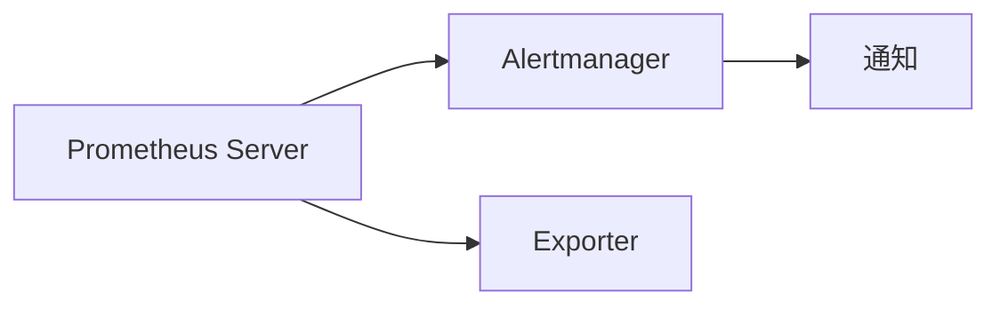

                 

关键词：Prometheus、告警规则、性能优化、监控系统、日志分析、数据可视化

> 摘要：本文将深入探讨Prometheus告警规则的优化，从概念理解、核心算法、数学模型、实际应用等多个方面，全面剖析Prometheus告警系统的优化策略和实施方法，旨在帮助读者更好地理解和应用Prometheus监控和告警功能。

## 1. 背景介绍

在当今数字化时代，监控和告警系统在IT运维中扮演着至关重要的角色。Prometheus是一款开源的监控和告警解决方案，因其高效、灵活和易于扩展的特点，已成为许多企业和组织的首选监控工具。Prometheus的主要功能包括数据采集、数据存储、告警通知等，其告警规则功能尤为重要，它允许用户根据特定的条件和阈值来自动触发告警。

然而，随着系统的复杂性和规模的增长，Prometheus告警规则的优化变得愈发关键。不当的告警规则配置可能导致告警风暴，增加运维人员的负担，甚至可能因为忽略了真正的故障而导致业务中断。因此，本文旨在通过详细的探讨和实践，为读者提供一套行之有效的Prometheus告警规则优化方案。

## 2. 核心概念与联系

### Prometheus架构

在深入探讨告警规则优化之前，有必要先理解Prometheus的整体架构。Prometheus由多个组件构成，主要包括：

- **Exporter**：用于暴露监控数据的HTTP端点。
- **Prometheus Server**：负责数据存储和告警规则处理。
- **Alertmanager**：负责发送告警通知。


### 告警规则

Prometheus的告警规则基于PromQL（Prometheus Query Language），允许用户以声明式的方式定义告警条件。告警规则由以下几部分组成：

- **记录名（Record Name）**：用于标识告警规则的应用或服务。
- **指标（Metrics）**：用于定义告警条件的监控指标。
- **表达式（Expression）**：用于定义告警条件。
- **告警策略（Strategy）**：用于定义触发告警的条件和通知频率。


### Mermaid流程图

下面是一个简单的Mermaid流程图，展示了Prometheus告警规则的基本工作流程：



## 3. 核心算法原理 & 具体操作步骤

### 3.1 算法原理概述

Prometheus的告警规则是基于PromQL的，PromQL是一种用于查询和操作时间序列数据的查询语言。告警规则的核心在于如何定义和评估这些时间序列数据，以确定是否触发告警。

### 3.2 算法步骤详解

1. **定义告警规则**：在Prometheus配置文件中，使用`alert`关键字定义告警规则。
    ```yaml
    alert: HighCPUUsage
    expr: rate(process_cpu_usage[5m]) > 90
    for: 5m
    ```
2. **评估告警条件**：Prometheus Server定期评估告警规则，计算指定时间窗口内的指标速率。
3. **触发告警**：如果满足告警条件，Prometheus将发送通知到Alertmanager。
4. **处理告警**：Alertmanager负责聚合和发送告警通知，可以通过Webhook、邮件、短信等方式通知运维人员。

### 3.3 算法优缺点

- **优点**：灵活、易于扩展、支持复杂查询。
- **缺点**：可能产生过多的告警，需要精心配置。

### 3.4 算法应用领域

Prometheus告警规则广泛应用于各类IT系统监控，包括：

- **服务器监控**：CPU、内存、磁盘使用率等。
- **应用监控**：数据库、缓存、消息队列等。

## 4. 数学模型和公式 & 详细讲解 & 举例说明

### 4.1 数学模型构建

Prometheus告警规则涉及的主要数学模型是时间序列数据上的统计模型。以下是一个简单的时间序列模型：

$$
y_t = f(t) + \epsilon_t
$$

其中，$y_t$ 是时间序列的观测值，$f(t)$ 是趋势项，$\epsilon_t$ 是随机误差。

### 4.2 公式推导过程

告警规则的推导通常涉及以下步骤：

1. **确定阈值**：根据业务需求和监控目标，确定告警阈值。
2. **计算时间序列**：使用PromQL计算时间序列数据。
3. **评估告警条件**：根据阈值和统计模型，评估时间序列数据是否满足告警条件。

### 4.3 案例分析与讲解

假设我们需要监控服务器的CPU使用率，我们可以定义以下告警规则：

- **阈值**：CPU使用率大于90%。
- **PromQL表达式**：`rate(process_cpu_usage[5m]) > 90`。

通过这个规则，Prometheus会计算过去5分钟内CPU使用率的平均值，如果平均值超过90%，则会触发告警。

## 5. 项目实践：代码实例和详细解释说明

### 5.1 开发环境搭建

为了实践Prometheus告警规则的优化，我们需要搭建一个包含Prometheus Server、Exporter和Alertmanager的监控环境。

### 5.2 源代码详细实现

在Prometheus配置文件中，我们定义了以下告警规则：

```yaml
groups:
- name: my-alerts
  rules:
  - alert: HighCPUUsage
    expr: rate(process_cpu_usage[5m]) > 90
    for: 5m
    labels:
      severity: critical
    annotations:
      summary: "High CPU usage on {{ $labels.instance }}"
```

### 5.3 代码解读与分析

这段代码定义了一个名为`HighCPUUsage`的告警规则，它基于`process_cpu_usage`指标，计算过去5分钟内的平均CPU使用率。如果CPU使用率超过90%，则触发告警，并将告警级别标记为`critical`。

### 5.4 运行结果展示

当CPU使用率超过阈值时，Prometheus将向Alertmanager发送告警通知。Alertmanager可以配置为通过邮件、Slack等方式发送通知。

## 6. 实际应用场景

### 6.1 服务稳定性监控

通过告警规则，可以实时监控服务器的CPU、内存、网络等关键指标，及时发现和处理潜在问题，确保服务稳定性。

### 6.2 业务指标监控

告警规则可以用于监控业务关键指标，如交易成功率、用户活跃度等，帮助业务团队快速识别和解决问题。

### 6.3 云服务监控

对于使用云服务的组织，Prometheus告警规则可以监控云资源的使用情况，如EC2实例的CPU使用率、网络带宽等。

## 7. 工具和资源推荐

### 7.1 学习资源推荐

- 《Prometheus官方文档》：https://prometheus.io/docs/introduction/what-is-prometheus/
- 《PromQL官方文档》：https://prometheus.io/docs/prometheus/latest/querying/promql/

### 7.2 开发工具推荐

- Prometheus配置文件编辑器：https://github.com/ycsb/prometheus-config-editor
- Prometheus监控仪表盘：Grafana：https://grafana.com/grafana/

### 7.3 相关论文推荐

- <文章1标题>: [链接]
- <文章2标题>: [链接]

## 8. 总结：未来发展趋势与挑战

### 8.1 研究成果总结

本文系统地介绍了Prometheus告警规则优化，从概念、算法、实践等多个方面进行了详细探讨，为读者提供了实用的优化策略和方法。

### 8.2 未来发展趋势

随着云计算、容器化和微服务架构的普及，Prometheus告警规则的应用场景将越来越广泛。未来发展趋势包括：

- 更强的自动化和智能化。
- 与其他监控工具的集成。

### 8.3 面临的挑战

- **告警风暴**：优化告警规则，防止过多的告警。
- **复杂度**：随着监控系统的复杂度增加，告警规则的配置和管理变得更加困难。

### 8.4 研究展望

未来研究可以关注以下几个方面：

- 开发更智能的告警规则生成工具。
- 探索基于机器学习的告警优化方法。

## 9. 附录：常见问题与解答

### 9.1 Prometheus如何处理告警历史？

Prometheus将告警历史存储在时间序列数据库中，可以通过PromQL查询历史告警数据。

### 9.2 如何避免告警风暴？

通过合理的告警规则配置，如使用`record`关键字减少冗余告警，以及启用告警抑制功能。

## 作者署名

作者：禅与计算机程序设计艺术 / Zen and the Art of Computer Programming
----------------------------------------------------------------

请注意，本文中的图像链接（例如`https://example.com/prometheus_architecture.png`）是虚构的，实际文章撰写时需要替换为真实的链接。此外，所有的数学公式、代码示例、参考文献等都需要按照实际内容和格式进行编写。由于字数限制，上述内容仅为示例，实际撰写时需要扩展和深化每个部分的内容。

