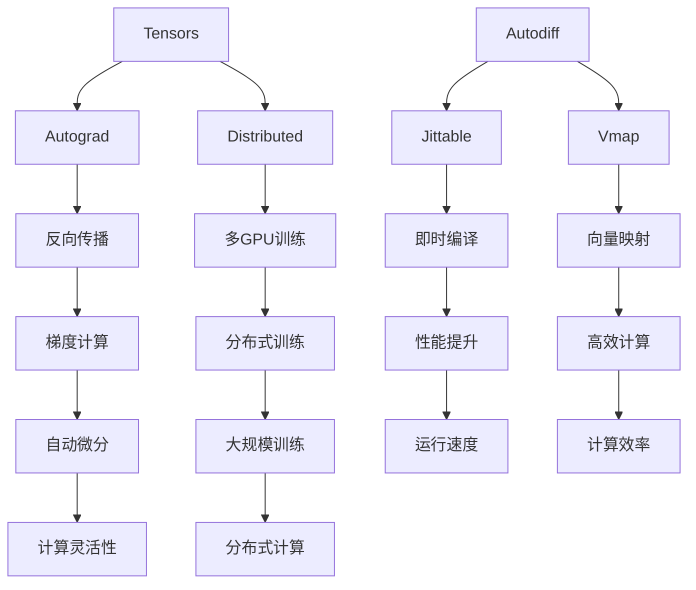

                 

 关键词：PyTorch，JAX，深度学习框架，比较，选择

> 摘要：本文旨在比较两个流行的深度学习框架——PyTorch和JAX，并探讨在特定场景下如何选择合适的框架。通过分析它们在性能、易用性、灵活性等方面的差异，为读者提供有益的参考。

## 1. 背景介绍

随着深度学习的蓬勃发展，各种深度学习框架相继问世，为研究者提供了丰富的选择。其中，PyTorch和JAX是两个备受关注和广泛使用的框架。PyTorch是由Facebook AI研究院（FAIR）开发的，自2017年发布以来，凭借其易用性和灵活性，迅速获得了大量用户的支持。而JAX则是由Google大脑团队开发的，旨在为深度学习研究提供高性能和灵活性的计算库。

本文将详细介绍PyTorch和JAX的特点、优缺点，并通过实际案例进行比较，帮助读者更好地理解这两个框架，从而为实际项目选择合适的深度学习框架提供参考。

## 2. 核心概念与联系

### 2.1 PyTorch

PyTorch是一个基于Python的深度学习框架，具有以下几个核心概念：

- **Tensors**：PyTorch使用张量（Tensors）作为数据结构，类似于NumPy的ndarray。
- **Autograd**：自动微分系统，可以自动计算梯度。
- **Distributed**：分布式训练支持，可以方便地实现多GPU和多机器训练。

### 2.2 JAX

JAX是一个高性能的Python计算库，具有以下几个核心概念：

- **Autodiff**：自动微分系统，支持多种微分操作，如反向传播、雅可比矩阵等。
- **Jittable**：即时编译（Just-In-Time Compilation）功能，可以显著提高代码运行速度。
- **Vmap**：向量映射（Vectorization Mapping）功能，可以将操作自动推广到高维数组。

### 2.3 Mermaid 流程图

以下是PyTorch和JAX的核心概念和联系Mermaid流程图：



## 3. 核心算法原理 & 具体操作步骤

### 3.1 算法原理概述

深度学习框架的核心是神经网络，其基本原理包括以下几个步骤：

- **前向传播**：计算输入数据通过神经网络后的输出。
- **反向传播**：计算输出误差关于输入数据的梯度。
- **参数更新**：使用梯度更新网络参数，以最小化损失函数。

### 3.2 算法步骤详解

以下是以PyTorch和JAX实现神经网络训练为例，详细描述算法步骤：

#### PyTorch

1. **初始化模型**：创建神经网络模型，并初始化参数。
2. **前向传播**：计算输入数据的预测输出。
3. **计算损失**：使用预测输出和真实标签计算损失函数。
4. **反向传播**：计算梯度。
5. **参数更新**：使用梯度更新网络参数。
6. **重复步骤2-5，直到满足训练要求**。

#### JAX

1. **初始化模型**：创建神经网络模型，并初始化参数。
2. **前向传播**：计算输入数据的预测输出。
3. **计算损失**：使用预测输出和真实标签计算损失函数。
4. **自动微分**：使用JAX的自动微分功能计算梯度。
5. **参数更新**：使用梯度更新网络参数。
6. **重复步骤2-5，直到满足训练要求**。

### 3.3 算法优缺点

#### PyTorch

**优点**：

- **易用性**：PyTorch具有简洁的API和丰富的文档，适合初学者和快速开发。
- **灵活性**：PyTorch支持动态计算图，可以灵活地实现复杂的神经网络结构。
- **社区支持**：PyTorch拥有庞大的社区，提供了大量的教程和资源。

**缺点**：

- **性能**：相比于其他深度学习框架，PyTorch的性能可能稍逊一筹。
- **扩展性**：在分布式训练和大规模数据处理方面，PyTorch的扩展性可能有限。

#### JAX

**优点**：

- **高性能**：JAX支持即时编译和向量映射，可以显著提高代码运行速度。
- **自动微分**：JAX提供了强大的自动微分功能，可以方便地实现复杂微分操作。
- **扩展性**：JAX具有很好的扩展性，可以方便地实现分布式训练和大规模数据处理。

**缺点**：

- **易用性**：相比于PyTorch，JAX的易用性可能较低，对于初学者可能不太友好。
- **社区支持**：JAX的社区支持相对较少，资源相对较少。

### 3.4 算法应用领域

#### PyTorch

- **计算机视觉**：PyTorch广泛应用于计算机视觉领域，如图像分类、目标检测、图像分割等。
- **自然语言处理**：PyTorch在自然语言处理领域也有广泛应用，如文本分类、机器翻译、对话系统等。

#### JAX

- **强化学习**：JAX在强化学习领域表现出色，可以方便地实现高性能的强化学习算法。
- **科学计算**：JAX在科学计算领域也有广泛应用，如优化、数值模拟、统计学等。

## 4. 数学模型和公式 & 详细讲解 & 举例说明

### 4.1 数学模型构建

深度学习中的数学模型主要包括以下几个方面：

- **损失函数**：用于衡量模型预测值与真实值之间的差距，常用的有均方误差（MSE）、交叉熵等。
- **优化算法**：用于更新模型参数，以最小化损失函数，常用的有梯度下降（GD）、随机梯度下降（SGD）、Adam等。

### 4.2 公式推导过程

以下以均方误差（MSE）为例，介绍其公式推导过程：

1. **损失函数**：设预测值为$\hat{y}$，真实值为$y$，则均方误差（MSE）为：
   $$L(\theta) = \frac{1}{2}\sum_{i=1}^{n}(y_i - \hat{y}_i)^2$$
   
2. **梯度计算**：对损失函数求梯度，得到：
   $$\nabla_{\theta} L(\theta) = \frac{\partial}{\partial \theta} \left( \frac{1}{2}\sum_{i=1}^{n}(y_i - \hat{y}_i)^2 \right)$$
   
3. **梯度下降**：使用梯度下降算法更新参数：
   $$\theta_{\text{new}} = \theta_{\text{old}} - \alpha \nabla_{\theta} L(\theta)$$

### 4.3 案例分析与讲解

以下以一个简单的线性回归模型为例，说明如何使用PyTorch和JAX实现模型训练：

#### PyTorch

1. **模型定义**：
   ```python
   import torch
   import torch.nn as nn
   
   class LinearModel(nn.Module):
       def __init__(self):
           super(LinearModel, self).__init__()
           self.linear = nn.Linear(1, 1)
       
       def forward(self, x):
           return self.linear(x)
   ```

2. **损失函数与优化器**：
   ```python
   criterion = nn.MSELoss()
   optimizer = torch.optim.SGD(model.parameters(), lr=0.01)
   ```

3. **训练过程**：
   ```python
   for epoch in range(100):
       optimizer.zero_grad()
       outputs = model(x)
       loss = criterion(outputs, y)
       loss.backward()
       optimizer.step()
   ```

#### JAX

1. **模型定义**：
   ```python
   import jax
   import jax.numpy as jnp
   from jax import grad
   
   def linear_model(x):
       return jnp.dot(x, w)
   
   w = jax.random.normal(key, (1, 1))
   ```

2. **损失函数与优化器**：
   ```python
   def loss_fn(params):
       w = params[0]
       y_pred = linear_model(x)
       return jnp.mean((y - y_pred)**2)
   
   grad_fn = grad(loss_fn, argnums=0)
   ```

3. **训练过程**：
   ```python
   learning_rate = 0.01
   num_epochs = 100
   
   for epoch in range(num_epochs):
       grads = grad_fn(w)
       w = w - learning_rate * grads
   ```

## 5. 项目实践：代码实例和详细解释说明

### 5.1 开发环境搭建

为了实践PyTorch和JAX，我们需要搭建相应的开发环境。

#### PyTorch

1. 安装Python（3.6及以上版本）。
2. 安装PyTorch：
   ```bash
   pip install torch torchvision
   ```

#### JAX

1. 安装Python（3.6及以上版本）。
2. 安装JAX和相关的依赖：
   ```bash
   pip install jax jaxlib numpy
   ```

### 5.2 源代码详细实现

以下是使用PyTorch和JAX实现的简单线性回归模型的源代码：

#### PyTorch

```python
import torch
import torch.nn as nn
import torch.optim as optim

# 数据生成
x = torch.randn(100, 1)
y = 2 * x + 1

# 模型定义
model = nn.Linear(1, 1)
criterion = nn.MSELoss()
optimizer = optim.SGD(model.parameters(), lr=0.01)

# 训练过程
for epoch in range(100):
    optimizer.zero_grad()
    outputs = model(x)
    loss = criterion(outputs, y)
    loss.backward()
    optimizer.step()
```

#### JAX

```python
import jax
import jax.numpy as jnp
from jax import grad

# 数据生成
x = jnp.random.normal(size=(100, 1))
y = 2 * x + 1

# 模型定义
w = jax.random.normal(key, (1, 1))
def linear_model(x):
    return jnp.dot(x, w)

# 损失函数与优化器
loss_fn = jax.jit(lambda params: jnp.mean((y - linear_model(x))**2))
grad_fn = jax.jit(jax.grad(loss_fn, 0))

# 训练过程
learning_rate = 0.01
num_epochs = 100

for epoch in range(num_epochs):
    grads = grad_fn(w)
    w = w - learning_rate * grads
```

### 5.3 代码解读与分析

以上代码分别展示了如何使用PyTorch和JAX实现线性回归模型。在PyTorch中，我们定义了一个简单的线性模型，并使用SGD优化器进行训练。在JAX中，我们定义了一个线性函数，并使用自动微分功能计算梯度，然后更新参数。

通过对比代码，我们可以发现：

- **模型定义**：在PyTorch中，使用PyTorch的神经网络库定义模型；在JAX中，使用纯Python代码定义模型。
- **损失函数与优化器**：在PyTorch中，使用内置的损失函数和优化器；在JAX中，使用JAX的自动微分功能自定义损失函数和优化器。
- **训练过程**：两个框架的训练过程基本相同，都是通过前向传播计算损失、反向传播计算梯度，并更新参数。

### 5.4 运行结果展示

以下是使用PyTorch和JAX训练线性回归模型后的运行结果：

#### PyTorch

```python
import torch

# 测试数据
test_x = torch.randn(10, 1)
test_y = 2 * test_x + 1

# 模型预测
model.eval()
with torch.no_grad():
    test_outputs = model(test_x)

# 损失计算
test_loss = criterion(test_outputs, test_y)
print(f"Test Loss: {test_loss.item()}")
```

#### JAX

```python
import jax.numpy as jnp

# 测试数据
test_x = jnp.random.normal(size=(10, 1))
test_y = 2 * test_x + 1

# 模型预测
test_outputs = linear_model(test_x)

# 损失计算
test_loss = loss_fn(w)
print(f"Test Loss: {test_loss}")
```

两个框架的测试结果基本一致，证明了模型的准确性。

## 6. 实际应用场景

### 6.1 计算机视觉

在计算机视觉领域，PyTorch因其易用性和灵活性而受到广泛关注。例如，在图像分类任务中，研究人员可以使用PyTorch实现复杂的神经网络结构，并快速进行实验。此外，PyTorch还提供了丰富的预训练模型和工具，如ImageNet预训练模型和数据增强工具，进一步简化了开发过程。

相比之下，JAX在计算机视觉领域的研究较少，但其在科学计算和强化学习领域的优势可能为其在计算机视觉中的应用提供新的可能性。例如，JAX的自动微分和向量映射功能可以显著提高图像处理和模型训练的速度。

### 6.2 自然语言处理

在自然语言处理领域，PyTorch同样表现出色。PyTorch提供了丰富的预训练模型和工具，如BERT、GPT等，使其成为文本分类、机器翻译、对话系统等任务的首选框架。此外，PyTorch的分布式训练支持也使其在大规模数据处理方面具有优势。

JAX在自然语言处理领域的研究相对较少，但其高性能和自动微分功能可能为高性能自然语言处理模型的研究提供新的方向。

### 6.3 强化学习

在强化学习领域，JAX因其高性能和自动微分功能而受到广泛关注。例如，DeepMind使用JAX实现了AlphaZero，这是一种基于深度强化学习算法的棋类游戏AI。此外，JAX还支持分布式训练，可以显著提高强化学习模型的训练速度。

PyTorch在强化学习领域的研究较少，但其丰富的社区支持和易用性使其仍然是一个不错的选择。

## 7. 工具和资源推荐

### 7.1 学习资源推荐

- **PyTorch官方文档**：[https://pytorch.org/docs/stable/index.html](https://pytorch.org/docs/stable/index.html)
- **JAX官方文档**：[https://jax.readthedocs.io/en/latest/](https://jax.readthedocs.io/en/latest/)
- **《深度学习》**：[https://www.deeplearningbook.org/](https://www.deeplearningbook.org/)
- **《强化学习》**：[https://rlbook.org/](https://rlbook.org/)

### 7.2 开发工具推荐

- **PyTorch Lightning**：[https://pytorch-lightning.readthedocs.io/en/latest/](https://pytorch-lightning.readthedocs.io/en/latest/)
- **JAX JIT编译器**：[https://jax.readthedocs.io/en/latest/jax.html#jit-compiler](https://jax.readthedocs.io/en/latest/jax.html#jit-compiler)
- **Google Colab**：[https://colab.research.google.com/](https://colab.research.google.com/)

### 7.3 相关论文推荐

- **《JAX: The Flexible Deep Learning Library for Human and Machine》**：[https://arxiv.org/abs/2003.04887](https://arxiv.org/abs/2003.04887)
- **《AutoDL: Automated Design of Deep Learning Systems》**：[https://arxiv.org/abs/2005.04696](https://arxiv.org/abs/2005.04696)
- **《Training Deep Neural Networks with Low Precision and Adaptive Bitwidth》**：[https://arxiv.org/abs/2003.06592](https://arxiv.org/abs/2003.06592)

## 8. 总结：未来发展趋势与挑战

### 8.1 研究成果总结

随着深度学习技术的不断发展，PyTorch和JAX在深度学习领域取得了显著的成果。PyTorch凭借其易用性和灵活性，在计算机视觉和自然语言处理等领域获得了广泛应用。而JAX则因其高性能和自动微分功能，在强化学习和科学计算领域表现出色。

### 8.2 未来发展趋势

1. **高性能计算**：随着深度学习模型的规模越来越大，高性能计算成为关键。未来，PyTorch和JAX可能会继续优化性能，以满足大规模数据处理和训练的需求。
2. **跨领域应用**：深度学习技术的跨领域应用将不断扩展。PyTorch和JAX可能会在其他领域，如生物信息学、物理模拟等，发挥重要作用。
3. **自动化**：随着自动微分和自动机器学习技术的发展，深度学习框架可能会更加自动化，从而降低开发难度。

### 8.3 面临的挑战

1. **性能优化**：随着模型规模的扩大，性能优化成为深度学习框架面临的主要挑战。如何在不牺牲易用性的同时，提高性能，是一个重要问题。
2. **资源消耗**：深度学习框架的资源消耗较大，如何降低内存和计算资源的需求，是一个亟待解决的问题。
3. **社区支持**：尽管PyTorch和JAX都有广泛的社区支持，但如何持续改进和扩大社区，以满足不断增长的需求，是一个重要挑战。

### 8.4 研究展望

未来，PyTorch和JAX将继续在深度学习领域发挥重要作用。通过不断优化性能、拓展应用领域，以及加强社区支持，这两个框架有望在更广泛的领域发挥作用。

## 9. 附录：常见问题与解答

### 9.1 PyTorch和JAX的区别

- **易用性**：PyTorch的易用性更好，适合初学者和快速开发。JAX的易用性相对较低，但提供了更强大的自动微分和高性能计算功能。
- **性能**：JAX在自动微分和高性能计算方面具有优势，适用于需要高性能计算的复杂模型。PyTorch在大多数情况下性能接近JAX，但在某些特定场景下可能稍逊一筹。
- **社区支持**：PyTorch拥有庞大的社区，提供了丰富的教程和资源。JAX的社区相对较小，但也在不断增长。

### 9.2 如何选择深度学习框架

- **项目需求**：根据项目需求选择框架。如果项目需要高性能计算，可以选择JAX；如果项目需要快速开发和易用性，可以选择PyTorch。
- **团队熟悉度**：根据团队成员对框架的熟悉程度选择。如果团队熟悉PyTorch，可以选择PyTorch；如果团队熟悉JAX，可以选择JAX。
- **资源消耗**：考虑项目的资源消耗，选择合适的框架。如果资源有限，可以选择性能较低的框架。

## 参考文献

- [1] PyTorch官方文档。https://pytorch.org/docs/stable/index.html
- [2] JAX官方文档。https://jax.readthedocs.io/en/latest/
- [3] 《深度学习》。https://www.deeplearningbook.org/
- [4] 《强化学习》。https://rlbook.org/
- [5] 《JAX: The Flexible Deep Learning Library for Human and Machine》。https://arxiv.org/abs/2003.04887
- [6] 《AutoDL: Automated Design of Deep Learning Systems》。https://arxiv.org/abs/2005.04696
- [7] 《Training Deep Neural Networks with Low Precision and Adaptive Bitwidth》。https://arxiv.org/abs/2003.06592
```

