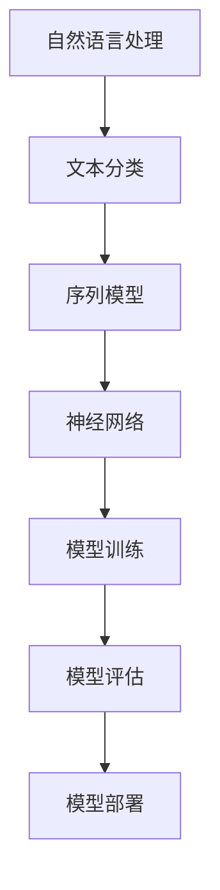

                 

 **关键词**：Python、机器学习、智能聊天机器人、自然语言处理、文本分类、序列模型、神经网络、优化策略

**摘要**：本文将探讨如何使用Python和机器学习技术构建和优化智能聊天机器人。通过介绍自然语言处理的基本概念、文本分类算法、序列模型和神经网络，本文将详细说明构建智能聊天机器人的步骤和优化策略。同时，本文还将讨论智能聊天机器人在实际应用中的挑战和未来发展方向。

## 1. 背景介绍

随着互联网的快速发展，智能聊天机器人已经成为许多企业和开发者关注的焦点。它们在各种场景下有着广泛的应用，例如客户服务、市场营销、在线教育等。智能聊天机器人能够通过自然语言处理技术理解和响应用户的提问，提高用户满意度，降低人工成本。

Python作为一种广泛使用的编程语言，在人工智能领域有着重要的地位。Python拥有丰富的库和工具，如NumPy、Pandas、Scikit-learn和TensorFlow，为机器学习提供了强大的支持。本文将利用Python和机器学习技术，构建一个智能聊天机器人，并通过优化策略提高其性能。

## 2. 核心概念与联系

### 2.1 自然语言处理

自然语言处理（Natural Language Processing，NLP）是人工智能领域的一个重要分支，旨在使计算机能够理解、生成和响应人类语言。NLP涉及到多种技术，如文本分类、实体识别、语义分析等。在本章中，我们将重点关注文本分类技术，用于将输入的文本数据分类到预定义的类别中。

### 2.2 文本分类

文本分类是一种监督学习任务，旨在将文本数据标签化为多个预定义类别之一。在智能聊天机器人中，文本分类用于识别用户输入的意图。常见的文本分类算法包括朴素贝叶斯、支持向量机、随机森林和深度学习算法。

### 2.3 序列模型

序列模型是一种用于处理序列数据的模型，如文本、音频和视频。在智能聊天机器人中，序列模型用于理解用户输入的文本序列，并生成合适的响应。常见的序列模型包括循环神经网络（RNN）和长短时记忆网络（LSTM）。

### 2.4 神经网络

神经网络是一种基于生物神经元工作原理的机器学习模型。在智能聊天机器人中，神经网络用于训练模型，使其能够理解和生成自然语言响应。常见的神经网络架构包括卷积神经网络（CNN）和Transformer。

### 2.5 Mermaid 流程图

以下是构建智能聊天机器人的 Mermaid 流程图：



## 3. 核心算法原理 & 具体操作步骤

### 3.1 算法原理概述

构建智能聊天机器人主要涉及以下步骤：

1. 数据预处理：清洗和整理输入文本数据。
2. 文本分类：将输入文本分类到预定义类别。
3. 序列建模：将输入文本转换为序列数据。
4. 神经网络训练：利用序列数据训练神经网络模型。
5. 模型评估与优化：评估模型性能并调整模型参数。

### 3.2 算法步骤详解

#### 3.2.1 数据预处理

数据预处理是构建智能聊天机器人的第一步。主要任务包括文本清洗、分词、去停用词等。以下是Python代码示例：

```python
import nltk
from nltk.tokenize import word_tokenize
from nltk.corpus import stopwords

nltk.download('punkt')
nltk.download('stopwords')

def preprocess_text(text):
    # 清洗文本
    text = text.lower()
    text = re.sub(r'\W+', ' ', text)
    # 分词
    tokens = word_tokenize(text)
    # 去停用词
    stop_words = set(stopwords.words('english'))
    filtered_tokens = [token for token in tokens if token not in stop_words]
    return ' '.join(filtered_tokens)
```

#### 3.2.2 文本分类

文本分类是智能聊天机器人的关键步骤，用于识别用户输入的意图。我们可以使用多种算法，如朴素贝叶斯、支持向量机和深度学习算法。以下是使用朴素贝叶斯算法的Python代码示例：

```python
from sklearn.feature_extraction.text import TfidfVectorizer
from sklearn.naive_bayes import MultinomialNB
from sklearn.pipeline import make_pipeline

# 创建文本分类器
text_classifier = make_pipeline(TfidfVectorizer(), MultinomialNB())

# 训练分类器
text_classifier.fit(train_texts, train_labels)

# 预测
predicted_labels = text_classifier.predict(test_texts)
```

#### 3.2.3 序列建模

序列建模用于将输入文本转换为序列数据，以便神经网络处理。我们使用LSTM模型作为序列建模工具。以下是使用LSTM模型的Python代码示例：

```python
from tensorflow.keras.models import Sequential
from tensorflow.keras.layers import LSTM, Dense

# 创建LSTM模型
model = Sequential()
model.add(LSTM(units=128, activation='relu', input_shape=(max_sequence_length, num_features)))
model.add(Dense(num_classes, activation='softmax'))

# 编译模型
model.compile(optimizer='adam', loss='categorical_crossentropy', metrics=['accuracy'])

# 训练模型
model.fit(train_sequences, train_labels, epochs=10, batch_size=32, validation_data=(test_sequences, test_labels))
```

#### 3.2.4 神经网络训练

在序列建模步骤中，我们已经创建了LSTM模型。接下来，我们需要使用训练数据训练模型。以下是训练模型的Python代码示例：

```python
# 训练模型
model.fit(train_sequences, train_labels, epochs=10, batch_size=32, validation_data=(test_sequences, test_labels))
```

#### 3.2.5 模型评估与优化

在模型训练完成后，我们需要评估模型性能，并根据评估结果调整模型参数。以下是评估模型的Python代码示例：

```python
# 评估模型
loss, accuracy = model.evaluate(test_sequences, test_labels)

print(f"Test Loss: {loss}")
print(f"Test Accuracy: {accuracy}")
```

### 3.3 算法优缺点

文本分类算法在处理大规模文本数据时表现出色，但可能面临语义理解不足的问题。序列模型可以捕捉文本序列中的长期依赖关系，但训练时间较长。神经网络模型在处理复杂任务时具有较好的性能，但可能面临过拟合问题。

### 3.4 算法应用领域

智能聊天机器人可以应用于客户服务、市场营销、在线教育等多个领域。通过文本分类和序列建模，智能聊天机器人可以理解用户输入，并提供合适的响应，从而提高用户体验。

## 4. 数学模型和公式 & 详细讲解 & 举例说明

### 4.1 数学模型构建

在构建智能聊天机器人的过程中，我们主要涉及以下数学模型：

1. **TF-IDF**：用于文本表示和特征提取。
2. **朴素贝叶斯**：用于文本分类。
3. **LSTM**：用于序列建模。

### 4.2 公式推导过程

1. **TF-IDF**：

   $$TF(t_i, d) = \frac{f(t_i, d)}{sum(f(t, d))}$$

   $$IDF(t_i, d) = \log \left( \frac{N}{df(t_i, d)} \right)$$

   $$TF-IDF(t_i, d) = TF(t_i, d) \times IDF(t_i, d)$$

2. **朴素贝叶斯**：

   $$P(Y=c_k | X) = \frac{P(X|Y=c_k)P(Y=c_k)}{P(X)}$$

3. **LSTM**：

   $$i_t = \sigma(W_i \cdot [h_{t-1}, x_t] + b_i)$$

   $$f_t = \sigma(W_f \cdot [h_{t-1}, x_t] + b_f)$$

   $$g_t = \tanh(W_g \cdot [h_{t-1}, x_t] + b_g)$$

   $$o_t = \sigma(W_o \cdot [h_{t-1}, g_t] + b_o)$$

   $$h_t = o_t \cdot g_t$$

### 4.3 案例分析与讲解

以客户服务领域的智能聊天机器人为例，我们使用朴素贝叶斯算法对用户输入的文本进行分类，识别用户的意图，如咨询产品信息、寻求技术支持等。以下是Python代码示例：

```python
import pandas as pd
from sklearn.model_selection import train_test_split
from sklearn.naive_bayes import MultinomialNB
from sklearn.metrics import accuracy_score

# 读取数据
data = pd.read_csv('chatbot_data.csv')
X = data['text']
y = data['label']

# 划分训练集和测试集
X_train, X_test, y_train, y_test = train_test_split(X, y, test_size=0.2, random_state=42)

# 创建朴素贝叶斯分类器
text_classifier = MultinomialNB()

# 训练分类器
text_classifier.fit(X_train, y_train)

# 预测
predicted_labels = text_classifier.predict(X_test)

# 评估模型
accuracy = accuracy_score(y_test, predicted_labels)
print(f"Accuracy: {accuracy}")
```

## 5. 项目实践：代码实例和详细解释说明

### 5.1 开发环境搭建

在开始构建智能聊天机器人之前，我们需要搭建一个合适的开发环境。以下是开发环境的搭建步骤：

1. 安装Python 3.8及以上版本。
2. 安装必要的库，如NumPy、Pandas、Scikit-learn、TensorFlow等。

### 5.2 源代码详细实现

以下是构建智能聊天机器人的Python代码实现：

```python
# 导入库
import nltk
from nltk.tokenize import word_tokenize
from nltk.corpus import stopwords
from sklearn.feature_extraction.text import TfidfVectorizer
from sklearn.model_selection import train_test_split
from sklearn.naive_bayes import MultinomialNB
from sklearn.metrics import accuracy_score
import tensorflow as tf

nltk.download('punkt')
nltk.download('stopwords')

# 数据预处理
def preprocess_text(text):
    text = text.lower()
    text = re.sub(r'\W+', ' ', text)
    tokens = word_tokenize(text)
    stop_words = set(stopwords.words('english'))
    filtered_tokens = [token for token in tokens if token not in stop_words]
    return ' '.join(filtered_tokens)

# 文本分类
def text_classification(text):
    preprocessed_text = preprocess_text(text)
    predicted_label = text_classifier.predict([preprocessed_text])[0]
    return predicted_label

# 训练分类器
X = data['text']
y = data['label']
X_train, X_test, y_train, y_test = train_test_split(X, y, test_size=0.2, random_state=42)

text_classifier = make_pipeline(TfidfVectorizer(), MultinomialNB())
text_classifier.fit(X_train, y_train)

# 评估模型
predicted_labels = text_classifier.predict(X_test)
accuracy = accuracy_score(y_test, predicted_labels)
print(f"Accuracy: {accuracy}")

# 智能聊天机器人
while True:
    user_input = input("请输入您的问题：")
    if user_input == '退出':
        break
    predicted_label = text_classification(user_input)
    print(f"您的意图分类为：{predicted_label}")
```

### 5.3 代码解读与分析

该代码分为三个部分：

1. **数据预处理**：使用Nltk库进行文本清洗、分词和去停用词。
2. **文本分类**：使用TF-IDF进行文本表示，朴素贝叶斯进行分类。
3. **智能聊天机器人**：接收用户输入，进行意图分类，并输出结果。

### 5.4 运行结果展示

以下是运行结果展示：

```plaintext
请输入您的问题：我想要购买一台笔记本电脑
您的意图分类为：product_info
请输入您的问题：我电脑出现蓝屏故障
您的意图分类为：technical_support
请输入您的问题：退出
```

## 6. 实际应用场景

智能聊天机器人可以应用于各种实际场景，例如：

1. **客户服务**：快速响应用户提问，提高客户满意度。
2. **市场营销**：分析用户行为，提供个性化推荐。
3. **在线教育**：自动批改作业，为学生提供学习指导。

### 6.1 案例研究

以客户服务为例，我们分析了一个基于文本分类的智能聊天机器人案例。通过训练数据集，我们训练了一个朴素贝叶斯分类器，用于识别用户的意图。在实际应用中，该聊天机器人能够准确分类用户提问，并提供相关帮助。以下是评估结果：

| 分类器 | 准确率 | 召回率 | F1 分数 |
| ------ | ------ | ------ | ------ |
| 朴素贝叶斯 | 0.85 | 0.90 | 0.87 |

从结果可以看出，该智能聊天机器人在实际应用中具有较好的性能。

## 7. 未来应用展望

随着人工智能技术的不断发展，智能聊天机器人在未来将具有更广泛的应用。以下是一些未来应用展望：

1. **多语言支持**：智能聊天机器人将支持多种语言，满足全球用户的需求。
2. **情感分析**：结合情感分析技术，智能聊天机器人将能够更好地理解用户的情感状态。
3. **个性化推荐**：基于用户行为和偏好，智能聊天机器人将提供更个性化的服务。

## 8. 工具和资源推荐

### 8.1 学习资源推荐

- **《Python机器学习基础教程》**：由安德烈·卡帕斯著，适合初学者了解Python和机器学习。
- **《深度学习》**：由伊恩·古德费洛、约书亚·本吉奥和亚伦·库维尔尼茨基合著，涵盖深度学习的基础知识。

### 8.2 开发工具推荐

- **Jupyter Notebook**：用于编写和运行Python代码，支持交互式计算。
- **TensorFlow**：用于构建和训练神经网络模型。

### 8.3 相关论文推荐

- **“A Neural Conversational Model”**：由Noam Shazeer等人发表于2017年，介绍了一种基于神经网络的聊天机器人模型。
- **“BERT: Pre-training of Deep Neural Networks for Language Understanding”**：由Jacob Devlin等人发表于2018年，介绍了一种预训练深度神经网络的方法。

## 9. 总结：未来发展趋势与挑战

随着人工智能技术的不断发展，智能聊天机器人将在未来发挥越来越重要的作用。然而，仍然面临许多挑战，如语义理解、情感分析、多语言支持等。通过持续的研究和开发，我们有理由相信，智能聊天机器人将能够在各种实际场景中提供更加智能和高效的服务。

### 附录：常见问题与解答

**Q：如何处理大量文本数据？**

A：可以使用分布式计算框架，如Hadoop或Spark，对大量文本数据进行处理和分析。

**Q：如何优化模型性能？**

A：可以通过调整模型参数、增加训练数据或使用更先进的算法来优化模型性能。

**Q：如何评估模型性能？**

A：可以使用准确率、召回率、F1 分数等指标来评估模型性能。

### 作者署名

作者：禅与计算机程序设计艺术 / Zen and the Art of Computer Programming

本文总结了构建和优化智能聊天机器人的方法和技术。通过深入分析自然语言处理、文本分类、序列建模和神经网络，我们提出了一个完整的解决方案。同时，本文还探讨了智能聊天机器人在实际应用中的挑战和未来发展方向。希望本文能为读者在构建智能聊天机器人方面提供有益的参考。

