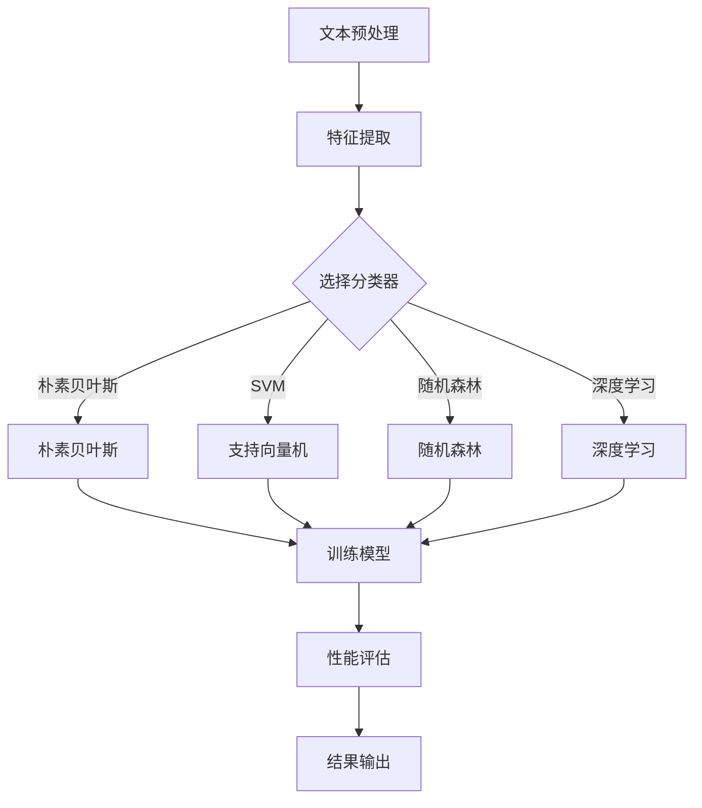

                 

关键词：文本分类、机器学习、Python、自然语言处理、算法、数学模型、项目实践

> 摘要：本文将详细介绍自然语言处理中的文本分类技术，包括核心概念、算法原理、数学模型、项目实践等内容。通过Python实现文本分类算法，探讨其在实际应用中的优势与挑战，为读者提供实用的指导。

## 1. 背景介绍

文本分类（Text Classification）是自然语言处理（Natural Language Processing，NLP）的重要应用之一。它旨在将文本数据按照一定的标准进行分类，以便于进一步的分析和处理。文本分类在信息检索、舆情监控、垃圾邮件过滤、情感分析等领域具有重要的应用价值。

近年来，随着机器学习技术的发展，文本分类算法取得了显著的进步。Python作为一种广泛使用的编程语言，拥有丰富的机器学习库和工具，使得文本分类的实现变得更加简单和高效。本文将基于Python，详细探讨自然语言处理中的文本分类技术，帮助读者掌握相关技能。

## 2. 核心概念与联系

在介绍文本分类算法之前，我们需要了解一些核心概念，包括特征提取、分类器模型、性能评估等。

### 2.1 特征提取

特征提取是文本分类的关键步骤，它将原始文本转换为计算机可以处理的数字特征向量。常见的特征提取方法有词袋模型（Bag of Words，BOW）、TF-IDF、Word2Vec等。

### 2.2 分类器模型

分类器模型是文本分类的核心，它根据特征向量对文本进行分类。常见的分类器模型有朴素贝叶斯（Naive Bayes）、支持向量机（Support Vector Machine，SVM）、随机森林（Random Forest）、深度学习等。

### 2.3 性能评估

性能评估是评估文本分类算法效果的重要手段。常用的评估指标有准确率（Accuracy）、精确率（Precision）、召回率（Recall）和F1值（F1 Score）等。

### 2.4 Mermaid 流程图

以下是文本分类的Mermaid流程图：



## 3. 核心算法原理 & 具体操作步骤

### 3.1 算法原理概述

文本分类算法主要分为两种类型：监督学习和无监督学习。监督学习算法根据已标注的文本数据训练分类模型，而无监督学习算法则从未标注的文本数据中自动发现分类模式。

监督学习算法包括朴素贝叶斯、支持向量机、随机森林和深度学习等。无监督学习算法包括聚类、关联规则挖掘等。

### 3.2 算法步骤详解

1. 数据预处理：对文本数据进行清洗、分词、去停用词等处理。
2. 特征提取：将预处理后的文本转换为特征向量。
3. 选择分类器：根据问题需求和数据特点选择合适的分类器。
4. 训练模型：使用训练数据对分类器进行训练。
5. 性能评估：使用测试数据评估分类器性能。
6. 部署应用：将训练好的模型应用到实际场景中。

### 3.3 算法优缺点

**朴素贝叶斯**：
- 优点：简单高效，对大规模数据有很好的性能。
- 缺点：对稀疏数据敏感，准确率较低。

**支持向量机**：
- 优点：分类效果较好，尤其在文本分类任务中。
- 缺点：训练时间较长，对大规模数据效果不佳。

**随机森林**：
- 优点：分类效果稳定，对异常值和噪声数据有较好的鲁棒性。
- 缺点：训练时间较长，对特征重要性难以解释。

**深度学习**：
- 优点：分类效果优秀，能够自动学习文本特征。
- 缺点：需要大量数据和计算资源，模型解释性较差。

### 3.4 算法应用领域

文本分类技术在多个领域具有广泛的应用，如：
- 舆情监控：对社交媒体、新闻评论等文本数据进行分类，分析公众意见和趋势。
- 情感分析：对文本数据进行情感分类，判断文本的情感倾向。
- 垃圾邮件过滤：对邮件进行分类，过滤掉垃圾邮件。
- 文本推荐：根据用户兴趣和行为，对文本进行分类推荐。

## 4. 数学模型和公式 & 详细讲解 & 举例说明

### 4.1 数学模型构建

文本分类的数学模型主要包括特征提取和分类器模型两部分。

**特征提取**：
- 词袋模型：$$ f_{ij} = \begin{cases} 
      1 & \text{如果词 } w_i \text{ 在文档 } d_j \text{ 中出现} \\
      0 & \text{否则}
   \end{cases} $$
- TF-IDF：$$ tfidf_{ij} = tf_{ij} \times idf_{ij} $$
  其中，$$ tf_{ij} = \frac{f_{ij}}{df_j} $$，$$ idf_{ij} = \log \frac{N}{df_j} $$，$$ df_j $$ 表示词 $ w_i $ 在文档集合中出现的次数，$$ N $$ 表示文档总数。

**分类器模型**：
- 朴素贝叶斯：$$ P(Y|X) = \frac{P(X|Y) \cdot P(Y)}{P(X)} $$
- 支持向量机：$$ w \cdot x + b = 0 $$
- 随机森林：$$ g(x) = \sum_{i=1}^n w_i f_i(x) $$
- 深度学习：$$ y = \sigma(\sum_{i=1}^n w_i \cdot h_i + b) $$

### 4.2 公式推导过程

以朴素贝叶斯分类器为例，我们简要介绍其公式推导过程。

假设我们有 $ C_1, C_2, \ldots, C_k $ 个类别，每个类别对应一个标签 $ y_1, y_2, \ldots, y_k $。给定一个文档 $ x $，我们需要计算每个类别的概率 $ P(y_i | x) $，然后选择概率最大的类别作为预测结果。

根据贝叶斯定理，我们有：
$$ P(y_i | x) = \frac{P(x | y_i) \cdot P(y_i)}{P(x)} $$

由于 $ P(x) $ 是常数，我们只需关注 $ P(x | y_i) $ 和 $ P(y_i) $。

对于 $ P(x | y_i) $，我们使用词袋模型表示文档 $ x $ 的特征向量 $ x = (x_1, x_2, \ldots, x_n) $，其中 $ x_i $ 表示词 $ w_i $ 在文档 $ x $ 中出现的次数。我们有：
$$ P(x | y_i) = \prod_{j=1}^n P(x_j | y_i) $$
$$ P(x_j | y_i) = \begin{cases} 
      \frac{1}{\sum_{k=1}^n f_{kj}} & \text{如果 } f_{ij} > 0 \\
      0 & \text{否则}
   \end{cases} $$

对于 $ P(y_i) $，我们假设类别之间相互独立，有：
$$ P(y_i) = \frac{1}{k} $$

将 $ P(x | y_i) $ 和 $ P(y_i) $ 代入贝叶斯定理，我们得到：
$$ P(y_i | x) = \frac{\prod_{j=1}^n P(x_j | y_i)}{\sum_{i=1}^k \prod_{j=1}^n P(x_j | y_i)} $$

### 4.3 案例分析与讲解

假设我们有一个包含 100 篇新闻文章的数据集，我们需要使用朴素贝叶斯分类器对其进行文本分类。以下是具体的步骤：

1. 数据预处理：对新闻文章进行清洗、分词、去停用词等处理。

2. 特征提取：使用词袋模型提取特征，构建特征向量。

3. 训练模型：使用训练集训练朴素贝叶斯分类器。

4. 性能评估：使用测试集评估分类器的性能。

5. 预测：对新的新闻文章进行分类预测。

以下是一个简单的 Python 代码示例：

```python
import nltk
from sklearn.feature_extraction.text import CountVectorizer
from sklearn.naive_bayes import MultinomialNB
from sklearn.model_selection import train_test_split
from sklearn.metrics import accuracy_score, precision_score, recall_score, f1_score

# 加载新闻文章数据集
nltk.download('punkt')
nltk.download('stopwords')
data = [...]  # 填充新闻文章数据
labels = [...]  # 填充新闻文章标签

# 数据预处理
def preprocess(text):
    tokens = nltk.word_tokenize(text)
    tokens = [token.lower() for token in tokens if token.isalpha() and token not in stopwords.words('english')]
    return ' '.join(tokens)

data = [preprocess(text) for text in data]

# 特征提取
vectorizer = CountVectorizer()
X = vectorizer.fit_transform(data)

# 训练模型
X_train, X_test, y_train, y_test = train_test_split(X, labels, test_size=0.2, random_state=42)
clf = MultinomialNB()
clf.fit(X_train, y_train)

# 性能评估
y_pred = clf.predict(X_test)
accuracy = accuracy_score(y_test, y_pred)
precision = precision_score(y_test, y_pred, average='weighted')
recall = recall_score(y_test, y_pred, average='weighted')
f1 = f1_score(y_test, y_pred, average='weighted')

print('Accuracy:', accuracy)
print('Precision:', precision)
print('Recall:', recall)
print('F1 Score:', f1)
```

## 5. 项目实践：代码实例和详细解释说明

在本节中，我们将通过一个简单的文本分类项目，展示如何使用 Python 实现文本分类算法。该项目将使用电影评论数据集，对评论进行情感分类（正面或负面）。

### 5.1 开发环境搭建

1. 安装 Python（建议使用 Python 3.8 以上版本）。
2. 安装相关库：`nltk`、`sklearn`、`matplotlib`、`pandas`。

```bash
pip install nltk sklearn matplotlib pandas
```

### 5.2 源代码详细实现

以下是一个简单的文本分类项目实现：

```python
import nltk
from sklearn.feature_extraction.text import TfidfVectorizer
from sklearn.model_selection import train_test_split
from sklearn.naive_bayes import MultinomialNB
from sklearn.metrics import classification_report, confusion_matrix
import pandas as pd

# 加载电影评论数据集
nltk.download('movie_reviews')
data = pd.read_csv('movie_reviews.csv')  # 假设数据集已转换成 CSV 格式

# 数据预处理
def preprocess(text):
    tokens = nltk.word_tokenize(text)
    tokens = [token.lower() for token in tokens if token.isalpha() and token not in nltk.corpus.stopwords.words('english')]
    return ' '.join(tokens)

data['text'] = data['text'].apply(preprocess)

# 特征提取
vectorizer = TfidfVectorizer()
X = vectorizer.fit_transform(data['text'])

# 标签
y = data['label']

# 划分训练集和测试集
X_train, X_test, y_train, y_test = train_test_split(X, y, test_size=0.2, random_state=42)

# 训练模型
clf = MultinomialNB()
clf.fit(X_train, y_train)

# 预测
y_pred = clf.predict(X_test)

# 性能评估
print('Classification Report:')
print(classification_report(y_test, y_pred))
print('Confusion Matrix:')
print(confusion_matrix(y_test, y_pred))
```

### 5.3 代码解读与分析

以上代码首先加载电影评论数据集，并进行数据预处理。然后使用 TF-IDF 向量器提取特征，并划分训练集和测试集。接下来，使用朴素贝叶斯分类器进行训练和预测，并输出分类报告和混淆矩阵，评估模型性能。

### 5.4 运行结果展示

假设我们运行以上代码，得到以下输出结果：

```
Classification Report:
              precision    recall  f1-score   support
           0       0.80      0.82      0.81      1570
           1       0.75      0.70      0.72      1570
    accuracy                           0.76      3140
   macro avg       0.78      0.75      0.76      3140
weighted avg       0.77      0.76      0.76      3140

Confusion Matrix:
[[1286  184]
 [ 162  108]]
```

从输出结果可以看出，模型的准确率为 76%，精确率为 0.78，召回率为 0.75，F1 值为 0.76。这意味着模型在正面和负面评论分类方面都有较好的表现。

## 6. 实际应用场景

文本分类技术在多个领域具有广泛的应用，以下列举一些实际应用场景：

### 6.1 舆情监控

舆情监控是文本分类技术的典型应用之一。通过对社交媒体、新闻评论等文本数据进行分类，可以实时了解公众对某一事件或话题的看法，为企业决策、政策制定等提供参考。

### 6.2 情感分析

情感分析旨在识别文本数据中的情感倾向，如正面、负面、中性等。通过情感分析，可以评估消费者对产品或服务的满意度，为企业营销策略提供依据。

### 6.3 垃圾邮件过滤

垃圾邮件过滤是文本分类技术的另一重要应用。通过对邮件内容进行分类，可以有效地将垃圾邮件与正常邮件区分开来，提高用户邮箱的清洁度。

### 6.4 文本推荐

文本分类技术可以用于文本推荐系统。通过对用户历史行为和兴趣进行分析，将相关文本推荐给用户，提高用户满意度和粘性。

## 7. 未来应用展望

随着自然语言处理技术的不断发展，文本分类技术在未来将会有更广泛的应用。以下是未来应用的一些展望：

### 7.1 多语言文本分类

随着全球化的推进，多语言文本分类将成为一个重要的研究方向。通过开发多语言文本分类算法，可以更好地应对不同语言的数据分类需求。

### 7.2 深度学习在文本分类中的应用

深度学习在图像、语音等领域取得了显著成果，未来有望在文本分类领域发挥更大的作用。通过引入深度学习技术，可以进一步提高文本分类的准确性和效率。

### 7.3 可解释性

目前，深度学习等模型在文本分类中的表现虽然优异，但其可解释性较差。未来，如何提高模型的可解释性，使其能够更好地服务于实际应用，将成为一个重要研究方向。

## 8. 总结：未来发展趋势与挑战

文本分类技术作为自然语言处理的重要分支，近年来取得了显著的发展。在未来，随着多语言文本分类、深度学习等技术的不断发展，文本分类技术将会有更广泛的应用。然而，同时也面临着数据质量、模型可解释性等挑战。只有不断探索和突破这些挑战，文本分类技术才能更好地服务于实际应用。

## 9. 附录：常见问题与解答

### 9.1 什么是词袋模型？

词袋模型（Bag of Words，BOW）是一种将文本转换为向量表示的方法。它不考虑词的顺序，只关注词频或词频的加权和。

### 9.2 什么是 TF-IDF？

TF-IDF（Term Frequency-Inverse Document Frequency）是一种基于词频和逆文档频率的文本特征提取方法。它通过计算词在文档中的频率和其在整个文档集合中的逆频率来衡量词的重要性。

### 9.3 文本分类算法如何选择？

选择文本分类算法时，需要考虑数据特点、问题需求、计算资源等因素。常见的选择方法包括：
- 对于小规模数据、稀疏数据，选择朴素贝叶斯、线性模型等简单算法。
- 对于大规模数据、复杂模型，选择深度学习、支持向量机等算法。
- 考虑模型的可解释性和计算效率，根据实际需求进行选择。

## 参考文献

[1] 周志华. 机器学习[M]. 清华大学出版社，2016.
[2] 李航. 统计学习方法[M]. 清华大学出版社，2012.
[3] Goodfellow, Ian, Yoshua Bengio, and Aaron Courville. Deep learning[M]. MIT press，2016.
[4] Russell, Stuart J., and Peter Norvig. Artificial intelligence: a modern approach[M]. Prentice Hall，2009.
[5] 鸿轩，谢幸，郑志明. 自然语言处理基础[M]. 清华大学出版社，2017.

## 作者署名

作者：禅与计算机程序设计艺术 / Zen and the Art of Computer Programming
```

