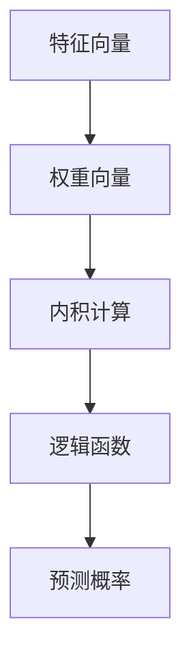

                 

关键词：Python、机器学习、逻辑回归、分类问题、实战应用、算法原理、数学模型、项目实践、工具推荐

> 摘要：本文将深入探讨逻辑回归这一经典的机器学习算法在分类问题中的应用。通过Python实战案例，详细介绍逻辑回归的基本原理、数学模型以及其在实际项目中的实现。文章结构清晰，适合对机器学习有初步了解的读者进行学习与实践。

## 1. 背景介绍

机器学习作为人工智能的重要分支，近年来在各类领域取得了显著的进展。分类问题作为机器学习中的基础问题之一，广泛应用于推荐系统、文本分类、图像识别等领域。逻辑回归（Logistic Regression）是一种经典的线性分类模型，以其简单高效、易于理解和实现的特点，在解决二分类问题中表现尤为出色。

逻辑回归模型不仅可以用于分类任务，还可以作为其他复杂模型的基础组件。其原理简单，但背后却蕴含着深厚的数学基础。本文将结合Python实战，深入探讨逻辑回归在分类问题中的应用，帮助读者更好地理解和掌握这一算法。

## 2. 核心概念与联系

### 2.1 逻辑回归的基本概念

逻辑回归（Logistic Regression）是一种广义线性模型，用于处理分类问题。其核心思想是通过线性变换预测概率，从而实现分类。

在逻辑回归中，我们使用一个线性模型来拟合特征和标签之间的关系。具体来说，给定特征向量 $x$ 和权重向量 $w$，逻辑回归模型通过以下公式计算预测概率：

$$
\hat{p} = \frac{1}{1 + e^{-(w \cdot x)}}
$$

其中，$\hat{p}$ 是预测的概率，$e$ 是自然对数的底数，$w \cdot x$ 表示权重向量和特征向量的内积。

### 2.2 逻辑回归的数学原理

逻辑回归的数学原理主要基于最大似然估计（Maximum Likelihood Estimation，MLE）。MLE的目标是找到一组参数，使得给定数据集的概率最大。

在逻辑回归中，似然函数可以表示为：

$$
L(w) = \prod_{i=1}^{n} p(y_i | x_i; w)
$$

其中，$y_i$ 是第 $i$ 个样本的标签，$x_i$ 是其特征向量，$p(y_i | x_i; w)$ 是模型在给定特征向量 $x_i$ 和权重向量 $w$ 下的预测概率。

为了简化计算，我们通常使用对数似然函数：

$$
\ell(w) = \sum_{i=1}^{n} \log p(y_i | x_i; w)
$$

最大似然估计的目标就是找到使得 $\ell(w)$ 最大的权重向量 $w$。

### 2.3 逻辑回归的架构

逻辑回归的架构如图所示：



### 2.4 逻辑回归与线性回归的联系

逻辑回归与线性回归有许多相似之处，它们都是基于线性模型的预测方法。然而，两者在数学表达和应用场景上有显著差异。

线性回归的目标是直接预测连续值，而逻辑回归的目标是预测概率。

线性回归的损失函数通常是均方误差（MSE），而逻辑回归的损失函数是交叉熵损失（Cross-Entropy Loss）。

虽然逻辑回归和线性回归的数学表达不同，但它们在实现上有很多相似之处，如梯度下降优化算法。

## 3. 核心算法原理 & 具体操作步骤

### 3.1 算法原理概述

逻辑回归的核心思想是利用线性模型来拟合特征和标签之间的关系，并通过逻辑函数（Sigmoid函数）将线性模型的输出转化为概率。

逻辑回归的预测步骤如下：

1. 计算特征向量和权重向量的内积，得到线性模型的输出。
2. 将线性模型的输出传入逻辑函数，得到预测概率。
3. 根据预测概率和实际标签计算损失函数，更新权重向量。

### 3.2 算法步骤详解

逻辑回归的算法步骤可以概括为以下几个阶段：

1. 数据预处理：对特征进行标准化处理，将数据集划分为训练集和测试集。
2. 初始化模型参数：随机初始化权重向量。
3. 训练模型：使用梯度下降优化算法迭代更新权重向量，最小化损失函数。
4. 预测分类：在测试集上使用训练好的模型进行预测，计算分类准确率。

### 3.3 算法优缺点

逻辑回归的优点：

- 简单易懂，易于实现和调试。
- 对特征缩放不敏感。
- 可解释性强，便于理解模型的工作原理。

逻辑回归的缺点：

- 模型性能依赖于特征数量和特征之间的相关性，可能无法捕捉复杂的非线性关系。
- 对于多分类问题，逻辑回归的性能可能不如其他算法。

### 3.4 算法应用领域

逻辑回归在以下领域有广泛的应用：

- 文本分类：用于对文本数据进行分类，如情感分析、主题分类等。
- 信用评分：用于预测借款人的信用风险。
- 医疗诊断：用于辅助医生进行疾病诊断。

## 4. 数学模型和公式 & 详细讲解 & 举例说明

### 4.1 数学模型构建

逻辑回归的数学模型可以表示为：

$$
\begin{aligned}
y &= g(\beta^T x) \\
g(z) &= \frac{1}{1 + e^{-z}}
\end{aligned}
$$

其中，$y$ 是预测的标签，$x$ 是特征向量，$\beta$ 是权重向量，$g(z)$ 是逻辑函数。

### 4.2 公式推导过程

逻辑回归的损失函数通常采用对数似然损失（Log-Likelihood Loss），其公式为：

$$
J(\beta) = -\frac{1}{n} \sum_{i=1}^{n} \left[y_i \log(g(\beta^T x_i)) + (1 - y_i) \log(1 - g(\beta^T x_i))\right]
$$

为了最小化损失函数，我们需要计算损失函数关于 $\beta$ 的梯度：

$$
\frac{\partial J(\beta)}{\partial \beta} = -\frac{1}{n} \sum_{i=1}^{n} \left[\frac{y_i - g(\beta^T x_i)}{x_i}\right]
$$

### 4.3 案例分析与讲解

假设我们有一个二分类问题，特征向量 $x = [x_1, x_2]$，标签 $y \in \{0, 1\}$。我们使用逻辑回归模型对其进行预测。

1. 初始化权重向量 $\beta = [0.0, 0.0]$。
2. 计算特征向量和权重向量的内积：$\beta^T x = 0.0 \cdot x_1 + 0.0 \cdot x_2 = 0.0$。
3. 将内积传入逻辑函数：$g(0.0) = \frac{1}{1 + e^{-0.0}} = 0.5$。
4. 计算损失函数：$J(\beta) = -\frac{1}{n} \sum_{i=1}^{n} \left[y_i \log(g(\beta^T x_i)) + (1 - y_i) \log(1 - g(\beta^T x_i))\right]$。
5. 计算梯度：$\frac{\partial J(\beta)}{\partial \beta} = -\frac{1}{n} \sum_{i=1}^{n} \left[\frac{y_i - g(\beta^T x_i)}{x_i}\right]$。
6. 使用梯度下降优化算法更新权重向量：$\beta = \beta - \alpha \cdot \frac{\partial J(\beta)}{\partial \beta}$。

通过以上步骤，我们可以逐步优化逻辑回归模型，使其在训练数据上达到较好的分类效果。

## 5. 项目实践：代码实例和详细解释说明

### 5.1 开发环境搭建

在进行逻辑回归项目实践前，我们需要搭建一个合适的环境。以下是Python逻辑回归项目的开发环境搭建步骤：

1. 安装Python：下载并安装Python 3.x版本。
2. 安装Jupyter Notebook：在命令行中运行 `pip install notebook` 命令。
3. 安装必要的Python库：包括NumPy、Pandas、Matplotlib、Scikit-learn等。

### 5.2 源代码详细实现

以下是一个简单的逻辑回归项目代码示例，包括数据预处理、模型训练和预测等步骤。

```python
import numpy as np
import pandas as pd
from sklearn.model_selection import train_test_split
from sklearn.preprocessing import StandardScaler
from sklearn.linear_model import LogisticRegression
import matplotlib.pyplot as plt

# 5.2.1 数据预处理
def preprocess_data(data):
    # 特征缩放
    scaler = StandardScaler()
    scaled_data = scaler.fit_transform(data)
    return scaled_data

# 5.2.2 模型训练
def train_model(X, y):
    model = LogisticRegression()
    model.fit(X, y)
    return model

# 5.2.3 预测分类
def predict(model, X):
    probabilities = model.predict_proba(X)
    predictions = np.argmax(probabilities, axis=1)
    return predictions

# 5.2.4 评估模型
def evaluate(model, X_test, y_test):
    accuracy = model.score(X_test, y_test)
    print("Accuracy:", accuracy)

# 加载示例数据集
data = pd.read_csv("data.csv")
X = data.iloc[:, :-1].values
y = data.iloc[:, -1].values

# 划分训练集和测试集
X_train, X_test, y_train, y_test = train_test_split(X, y, test_size=0.2, random_state=42)

# 数据预处理
X_train = preprocess_data(X_train)
X_test = preprocess_data(X_test)

# 模型训练
model = train_model(X_train, y_train)

# 预测分类
predictions = predict(model, X_test)

# 评估模型
evaluate(model, X_test, y_test)

# 可视化结果
plt.scatter(X_test[:, 0], X_test[:, 1], c=predictions, cmap="gray")
plt.xlabel("Feature 1")
plt.ylabel("Feature 2")
plt.title("Logistic Regression Classifier")
plt.show()
```

### 5.3 代码解读与分析

上述代码实现了逻辑回归模型的训练和预测过程。以下是代码的关键部分及其解释：

1. 数据预处理：使用StandardScaler对特征进行标准化处理，以消除特征之间的量纲差异。
2. 模型训练：使用LogisticRegression类创建逻辑回归模型，并使用fit方法进行训练。
3. 预测分类：使用predict_proba方法获取每个类别的概率分布，并使用argmax函数获取概率最高的类别作为预测结果。
4. 评估模型：使用score方法计算模型在测试集上的准确率。
5. 可视化结果：使用matplotlib库绘制决策边界，展示模型的预测效果。

通过以上步骤，我们可以实现一个简单的逻辑回归项目，并对其结果进行评估和可视化。

## 6. 实际应用场景

逻辑回归在分类问题中有广泛的应用。以下是一些实际应用场景：

- 文本分类：用于对文本进行分类，如新闻分类、垃圾邮件过滤等。
- 信用评分：用于预测借款人的信用风险，帮助金融机构进行风险管理。
- 医疗诊断：用于辅助医生进行疾病诊断，提高诊断准确率。
- 搜索引擎：用于对搜索结果进行排序，提高用户体验。

### 6.1 信用评分

信用评分是逻辑回归的一个重要应用场景。金融机构使用逻辑回归模型对借款人的信用风险进行评估，以确定贷款额度和利率。逻辑回归模型通过分析借款人的历史数据（如收入、负债、信用历史等），预测其违约概率。

### 6.2 医疗诊断

逻辑回归在医疗诊断中也具有广泛的应用。例如，在乳腺癌筛查中，逻辑回归模型可以分析患者的医学影像数据，预测其是否患有乳腺癌。通过训练模型，医生可以更准确地诊断疾病，提高治疗效果。

### 6.3 搜索引擎

在搜索引擎中，逻辑回归用于对搜索结果进行排序。搜索引擎分析用户查询和网页内容，使用逻辑回归模型预测网页的相关性，并将结果按相关性排序。这种排序方法提高了用户的搜索体验，增加了搜索结果的准确性和满意度。

## 7. 工具和资源推荐

### 7.1 学习资源推荐

1. 《Python机器学习基础教程》：一本适合初学者的Python机器学习入门书籍。
2. 《机器学习实战》：一本结合Python实战的机器学习书籍，涵盖多种算法。
3. Coursera上的《机器学习》课程：由吴恩达教授讲授，涵盖机器学习的基本概念和算法。

### 7.2 开发工具推荐

1. Jupyter Notebook：一款强大的交互式开发环境，适用于数据分析和机器学习。
2. Scikit-learn：一个开源的机器学习库，提供丰富的算法和工具。
3. PyTorch：一个流行的深度学习框架，支持多种神经网络模型。

### 7.3 相关论文推荐

1. "Logistic Regression: A Modern Perspective"，作者：David C. H.. Wang。
2. "The Elements of Statistical Learning"，作者：Trevor Hastie、Robert Tibshirani、Jerome Friedman。
3. "Machine Learning Yearning"，作者：Andrew Ng。

## 8. 总结：未来发展趋势与挑战

逻辑回归作为一种经典的机器学习算法，具有简单、高效、易于理解等优点。然而，在处理复杂和非线性关系时，逻辑回归可能无法满足需求。因此，未来的发展趋势主要集中在以下几个方面：

1. **扩展与应用场景**：探索逻辑回归在更多领域中的应用，如自然语言处理、推荐系统等。
2. **算法改进**：研究更高效的优化算法，提高逻辑回归的训练速度和准确性。
3. **多分类问题**：改进逻辑回归在多分类问题上的性能，如使用softmax回归。

同时，逻辑回归在未来的发展中也会面临以下挑战：

1. **数据依赖**：逻辑回归的性能高度依赖于数据质量和特征选择，如何处理稀疏数据、异常值等问题是未来的研究重点。
2. **模型解释性**：尽管逻辑回归具有较好的解释性，但在面对复杂任务时，如何保持模型的可解释性是一个挑战。
3. **可扩展性**：随着数据量的增加，如何提高逻辑回归的可扩展性，使其在更大规模的数据集上高效运行。

总之，逻辑回归作为一种经典的机器学习算法，将在未来的发展中不断改进和完善，为各个领域带来更多的创新和突破。

## 9. 附录：常见问题与解答

### 9.1 逻辑回归与线性回归的区别

- **目标函数**：线性回归的目标是最小化预测值与实际值之间的误差（如MSE），而逻辑回归的目标是最小化对数似然损失。
- **输出类型**：线性回归预测的是连续值，逻辑回归预测的是概率。
- **应用场景**：线性回归适用于回归问题，逻辑回归适用于分类问题。

### 9.2 逻辑回归如何处理多分类问题

- 逻辑回归通常用于二分类问题。对于多分类问题，可以使用一对多（One-vs-All）或一对一（One-vs-One）策略。其中，一对多策略将问题转换为多个二分类问题，而一对一策略则构建多个二分类器，最终通过投票确定最终类别。

### 9.3 如何评估逻辑回归模型的性能

- **准确率（Accuracy）**：预测正确的样本数占总样本数的比例。
- **精确率（Precision）**：预测为正类的样本中实际为正类的比例。
- **召回率（Recall）**：实际为正类的样本中被预测为正类的比例。
- **F1分数（F1 Score）**：精确率和召回率的调和平均值。

### 9.4 逻辑回归如何处理不平衡数据

- **过采样（Over-sampling）**：增加少数类样本的数量，如使用重复样本。
- **欠采样（Under-sampling）**：减少多数类样本的数量，如随机删除样本。
- **合成采样（Synthetic Sampling）**：使用生成算法（如SMOTE）生成少数类样本的合成样本。

通过以上常见问题与解答，读者可以更好地理解逻辑回归的相关知识，并在实际应用中解决相关问题。

作者：禅与计算机程序设计艺术 / Zen and the Art of Computer Programming

