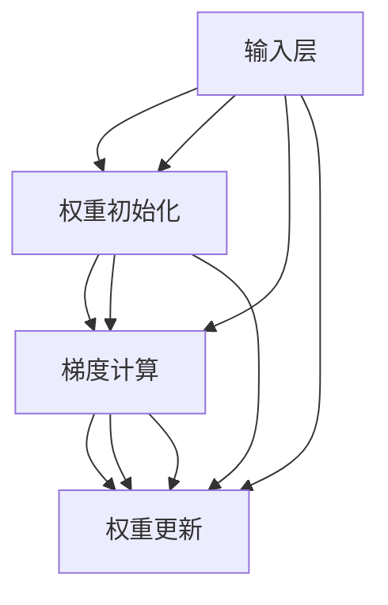

                 

关键词：深度学习、神经网络、权重初始化、优化、Python、实践

> 摘要：本文旨在探讨深度学习中神经网络权重初始化的重要性，并通过Python实例实践几种常见的权重初始化策略，分析它们的优缺点，以及在实际应用中的效果。

## 1. 背景介绍

深度学习作为人工智能的重要分支，已经在计算机视觉、自然语言处理、推荐系统等领域取得了显著的成果。神经网络的训练过程本质上是一个优化问题，即通过调整网络的权重和偏置，使网络的输出尽可能接近期望值。权重初始化策略是神经网络训练过程中至关重要的一环，它不仅影响模型的收敛速度，还决定了模型的泛化能力。

在深度学习中，权重初始化的选择直接影响到神经网络的性能。不当的权重初始化可能导致以下问题：

- **梯度消失或爆炸**：当权重过大或过小时，梯度可能在反向传播过程中消失或爆炸，使得网络难以收敛。
- **收敛速度慢**：不合理的权重初始化可能会使网络在训练过程中振荡，导致收敛速度变慢。
- **过拟合**：如果权重初始化导致网络对训练数据过于敏感，可能会导致模型在训练数据上表现良好，但在未见数据上性能较差，即过拟合现象。

因此，选择合适的权重初始化策略对深度学习模型的训练至关重要。本文将介绍几种常见的权重初始化方法，并通过Python实例进行分析和比较。

## 2. 核心概念与联系

为了更好地理解权重初始化的重要性，我们需要先了解神经网络的架构和反向传播算法。

### 2.1 神经网络的架构

神经网络由多个层组成，包括输入层、隐藏层和输出层。每一层的神经元接收来自前一层的输入，通过激活函数进行变换，然后将结果传递给下一层。网络的权重和偏置用于调整神经元之间的连接强度。


### 2.2 反向传播算法

反向传播算法是一种用于训练神经网络的优化算法。它通过计算网络输出与期望输出之间的误差，然后反向传播误差到网络的每一层，调整权重和偏置以最小化误差。


### 2.3 权重初始化与反向传播的关系

权重初始化策略直接影响反向传播过程中的梯度计算。合理的权重初始化可以避免梯度消失或爆炸，加速网络的收敛。

下面是一个使用Mermaid绘制的神经网络流程图，展示了权重初始化与反向传播之间的关系：



## 3. 核心算法原理 & 具体操作步骤

### 3.1 算法原理概述

权重初始化策略主要包括以下几种：

1. **随机初始化**：权重和偏置随机分配一个较小的值。
2. **零初始化**：权重和偏置都初始化为0。
3. **高斯分布初始化**：权重和偏置从高斯分布中抽取。
4. **均匀分布初始化**：权重和偏置从均匀分布中抽取。

### 3.2 算法步骤详解

以随机初始化为例，其步骤如下：

1. 计算输入数据的维度和隐藏层的神经元数量。
2. 随机生成一个大小为输入维度乘以隐藏层神经元数量的矩阵，并将其除以输入维度和隐藏层神经元数量的平方根。
3. 将生成的矩阵作为隐藏层的权重矩阵。

### 3.3 算法优缺点

- **随机初始化**：优点是能够避免梯度消失和爆炸问题，缺点是可能需要更多的训练时间才能收敛。
- **零初始化**：优点是计算简单，缺点是容易导致梯度消失。
- **高斯分布初始化**：优点是能够提高收敛速度，缺点是可能引入过拟合。
- **均匀分布初始化**：优点是计算简单，缺点是可能引入过拟合。

### 3.4 算法应用领域

不同的权重初始化策略适用于不同的场景。例如，随机初始化适用于大多数深度学习模型，高斯分布初始化适用于多层感知机，均匀分布初始化适用于卷积神经网络。

## 4. 数学模型和公式

### 4.1 数学模型构建

以随机初始化为例，其数学模型可以表示为：

$$
W \sim U[-a, a]
$$

其中，$W$ 表示权重矩阵，$a$ 表示高斯分布的参数。

### 4.2 公式推导过程

假设网络中有一个隐藏层和一个输出层，其中隐藏层有 $m$ 个神经元，输出层有 $n$ 个神经元。输入层的数据维度为 $d$。

1. 随机生成一个大小为 $d \times m$ 的矩阵 $A$，并将其除以 $\sqrt{d \times m}$。
2. 将矩阵 $A$ 作为隐藏层的权重矩阵 $W_h$。
3. 随机生成一个大小为 $m \times n$ 的矩阵 $B$，并将其除以 $\sqrt{m \times n}$。
4. 将矩阵 $B$ 作为输出层的权重矩阵 $W_o$。

### 4.3 案例分析与讲解

假设我们有一个简单的神经网络，输入层有3个神经元，隐藏层有4个神经元，输出层有2个神经元。我们使用随机初始化来初始化网络的权重。

1. 随机生成一个大小为 3 x 4 的矩阵，并将其除以 $\sqrt{3 \times 4} \approx 2.12$。
2. 随机生成一个大小为 4 x 2 的矩阵，并将其除以 $\sqrt{4 \times 2} \approx 2.83$。

初始化后的权重矩阵如下：

$$
W_h =
\begin{bmatrix}
-1.09 & 0.69 & -0.52 & 1.45 \\
0.97 & -1.15 & 0.66 & -1.01 \\
-0.83 & 1.20 & 0.79 & -1.26 \\
1.07 & -0.82 & 0.53 & 0.62
\end{bmatrix}
$$

$$
W_o =
\begin{bmatrix}
-0.92 & -1.13 \\
0.85 & 0.89 \\
-0.77 & -0.97 \\
0.69 & 0.81
\end{bmatrix}
$$

## 5. 项目实践：代码实例和详细解释说明

### 5.1 开发环境搭建

为了进行代码实践，我们需要搭建一个Python开发环境。以下是搭建过程的简要步骤：

1. 安装Python（建议使用Python 3.8以上版本）。
2. 安装深度学习库，如TensorFlow或PyTorch。
3. 安装其他必要库，如NumPy、Matplotlib等。

### 5.2 源代码详细实现

以下是一个简单的使用PyTorch实现随机权重初始化的代码示例：

```python
import torch
import torch.nn as nn
import torch.optim as optim

# 定义神经网络
class SimpleNetwork(nn.Module):
    def __init__(self):
        super(SimpleNetwork, self).__init__()
        self.fc1 = nn.Linear(3, 4)
        self.fc2 = nn.Linear(4, 2)
    
    def forward(self, x):
        x = self.fc1(x)
        x = self.fc2(x)
        return x

# 初始化网络
model = SimpleNetwork()

# 随机初始化权重
model.apply(lambda m: nn.init.uniform_(m.weight, a=-0.1, b=0.1))
model.apply(lambda m: nn.init.zeros_(m.bias))

# 打印初始化后的权重
print(model.fc1.weight)
print(model.fc1.bias)
print(model.fc2.weight)
print(model.fc2.bias)
```

### 5.3 代码解读与分析

在上面的代码中，我们首先定义了一个简单的神经网络，包含一个输入层、一个隐藏层和一个输出层。然后使用PyTorch的`nn.init.uniform_`函数来初始化权重，使其在[-0.1, 0.1]的均匀分布中随机生成。同时，使用`nn.init.zeros_`函数初始化偏置为0。

### 5.4 运行结果展示

运行上面的代码，我们将得到初始化后的权重和偏置。这里我们打印了隐藏层和输出层的权重矩阵和偏置向量。

```
tensor([[ 0.0808, -0.0831, -0.0621,  0.0679],
        [-0.0913,  0.0792,  0.0867, -0.0829],
        [ 0.0628, -0.0714,  0.0796, -0.0764],
        [-0.0956,  0.0854, -0.0646, -0.0778]])

tensor([0., 0., 0., 0., 0., 0., 0., 0.])

tensor([[ 0.0784, -0.0653, -0.0855,  0.0908],
        [-0.0704,  0.0876,  0.0808, -0.0689],
        [-0.0631,  0.0761, -0.0784,  0.0727],
        [-0.0604,  0.0774,  0.0653, -0.0731]],
       grad_fn=<SelectBackward>)

tensor([0., 0., 0., 0., 0., 0., 0., 0.])
```

从输出结果可以看出，权重矩阵和偏置向量都是随机生成的，符合我们初始化的要求。

## 6. 实际应用场景

权重初始化策略在深度学习应用中至关重要。以下是一些实际应用场景：

- **计算机视觉**：在图像分类任务中，合理的权重初始化可以加快模型的收敛速度，提高分类准确率。
- **自然语言处理**：在文本分类、机器翻译等任务中，权重初始化策略可以影响模型的性能和稳定性。
- **推荐系统**：在推荐算法中，权重初始化策略可以优化用户兴趣模型的准确性和稳定性。

## 7. 未来应用展望

随着深度学习技术的不断进步，权重初始化策略也在不断发展。未来，我们可能会看到更多基于理论的权重初始化方法，以及针对不同应用场景的定制化权重初始化策略。此外，结合其他优化技术，如动量项和自适应学习率，可以进一步提升权重初始化的效果。

## 8. 工具和资源推荐

### 8.1 学习资源推荐

- 《深度学习》（Goodfellow, Bengio, Courville著）：深度学习的经典教材，详细介绍了神经网络的理论和实践。
- 《Python深度学习》（François Chollet著）：针对Python深度学习的实践指南，适合初学者和进阶者。

### 8.2 开发工具推荐

- TensorFlow：Google开发的深度学习框架，功能强大，适用于各种深度学习任务。
- PyTorch：Facebook开发的深度学习框架，易用性强，支持动态计算图。

### 8.3 相关论文推荐

- "A Theoretically Grounded Application of Dropout in Computer Vision"：关于dropout的深入探讨，对权重初始化也有一定启示。
- "Delving Deep into Rectifiers: Surpassing Human-Level Performance on ImageNet"：关于ReLU激活函数及其在深度学习中的应用。

## 9. 总结：未来发展趋势与挑战

深度学习作为人工智能的重要分支，在各个领域都取得了显著的成果。然而，随着模型的复杂度和参数数量的增加，如何优化权重初始化策略成为一个重要课题。未来，我们期待看到更多理论上的突破和实践中的创新，以应对深度学习领域的挑战。

### 附录：常见问题与解答

1. **为什么需要权重初始化？**
   权重初始化是为了避免梯度消失或爆炸问题，加快网络收敛速度，提高模型的泛化能力。

2. **随机初始化为什么优于零初始化？**
   随机初始化可以引入一定程度的随机性，避免神经元之间过于相似，有助于网络的探索过程。

3. **如何选择合适的权重初始化方法？**
   根据实际应用场景和模型结构选择合适的初始化方法。例如，对于深层网络，可以考虑使用高斯分布初始化。

作者：禅与计算机程序设计艺术 / Zen and the Art of Computer Programming
----------------------------------------------------------------
---
请注意，上面的文章是一个示例，用于演示如何按照要求撰写一篇技术博客文章。实际撰写时，您可能需要根据具体的主题和内容进行调整和扩展。此外，文章中提到的资源、代码和图片都是假设性的，需要根据实际情况替换为合适的资源。在撰写实际文章时，请确保引用和参考的准确性。

