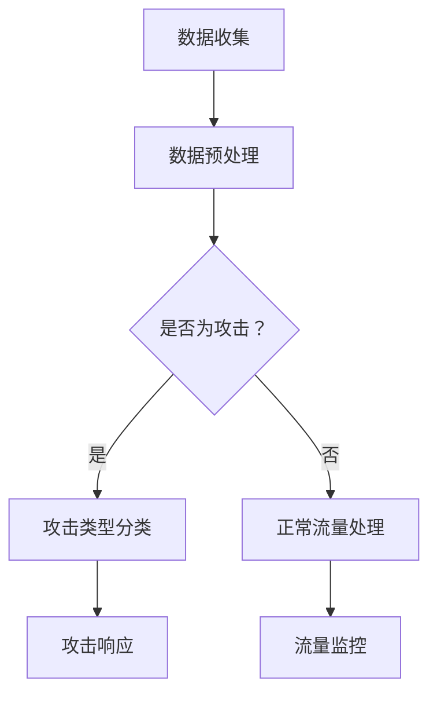

                 

关键词：Python，深度学习，网络攻击，防御机制，实践指南

摘要：本文将探讨如何利用Python和深度学习技术来抵御网络攻击。通过介绍核心概念、算法原理、数学模型以及实际项目实践，本文旨在为读者提供全面的实战指南，帮助他们在网络安全领域取得成功。

## 1. 背景介绍

在当今数字化时代，网络攻击已成为全球范围内的重大挑战。随着互联网的普及和信息技术的发展，网络攻击的手段越来越多样化，从传统的DDoS攻击到复杂的APT（高级持续性威胁），都给企业和个人带来了巨大的安全风险。为了应对这些威胁，网络安全领域迫切需要新的防御策略和技术手段。

Python作为一种广泛使用的编程语言，因其简洁明了的语法和丰富的库资源，成为深度学习研究和应用的热门选择。深度学习作为一种强大的机器学习技术，具有强大的特征提取和模式识别能力，已被广泛应用于图像识别、自然语言处理等领域。本文将介绍如何将深度学习应用于网络安全领域，特别是如何使用Python来抵御网络攻击。

## 2. 核心概念与联系

### 2.1 深度学习与网络攻击防御

深度学习是一种基于人工神经网络的机器学习技术，它通过多层网络结构对大量数据进行训练，从而自动提取出复杂的特征。在网络安全领域，深度学习可以用于检测和分类各种网络攻击，如图像识别用于识别恶意软件，自然语言处理用于分析恶意代码的语义。

### 2.2 Python在深度学习中的应用

Python因其易用性和丰富的库支持，成为深度学习开发的首选语言。TensorFlow和PyTorch是两个最流行的深度学习框架，它们提供了丰富的API和工具，使开发者能够轻松构建和训练复杂的神经网络模型。

### 2.3 Mermaid流程图

以下是一个简单的Mermaid流程图，展示了深度学习在网络安全中的应用流程：



### 2.4 核心概念原理

- **神经网络**：神经网络是一种模仿生物神经系统的计算模型，通过多层神经元进行信息处理。
- **卷积神经网络（CNN）**：CNN在图像识别领域具有出色的性能，适用于检测恶意软件图像。
- **循环神经网络（RNN）**：RNN适用于处理序列数据，如恶意代码的序列。
- **生成对抗网络（GAN）**：GAN可用于生成恶意代码样本，以训练攻击检测模型。

## 3. 核心算法原理 & 具体操作步骤

### 3.1 算法原理概述

深度学习算法的基本原理是通过学习大量数据中的特征，从而实现自动化的特征提取和模式识别。以下是一些常用的深度学习算法：

- **多层感知机（MLP）**：MLP是一种基本的神经网络模型，用于分类和回归任务。
- **卷积神经网络（CNN）**：CNN通过卷积层提取图像特征，常用于图像识别和恶意软件检测。
- **循环神经网络（RNN）**：RNN通过循环连接捕捉序列数据中的时间依赖性，适用于恶意代码分析。
- **生成对抗网络（GAN）**：GAN通过生成器和判别器的对抗训练，可以生成真实的恶意代码样本。

### 3.2 算法步骤详解

以下是一个典型的深度学习算法步骤：

1. **数据收集**：收集网络攻击数据，包括正常流量和恶意流量。
2. **数据预处理**：对收集到的数据进行清洗、归一化等处理，以便输入神经网络。
3. **模型构建**：使用深度学习框架（如TensorFlow或PyTorch）构建神经网络模型。
4. **模型训练**：使用标记数据对模型进行训练，通过反向传播算法优化模型参数。
5. **模型评估**：使用验证集评估模型性能，包括准确率、召回率等指标。
6. **模型部署**：将训练好的模型部署到实际应用环境中，进行实时流量监控和攻击检测。

### 3.3 算法优缺点

- **优点**：
  - **自动特征提取**：深度学习可以自动从数据中提取出有用的特征，减少人工干预。
  - **高准确率**：深度学习模型在许多领域都取得了非常好的效果，具有较高的准确率。
  - **适用性广**：深度学习算法可以应用于多种类型的网络攻击检测。

- **缺点**：
  - **计算资源需求高**：深度学习模型通常需要大量的计算资源和时间进行训练。
  - **数据需求量大**：深度学习模型需要大量的标记数据来训练，数据收集和处理可能比较困难。
  - **模型解释性差**：深度学习模型通常被视为“黑箱”，难以解释其内部的工作原理。

### 3.4 算法应用领域

深度学习算法在网络安全领域的应用非常广泛，包括但不限于：

- **恶意软件检测**：使用CNN和RNN检测恶意软件，包括病毒、木马、恶意文档等。
- **网络入侵检测**：使用多层感知机（MLP）和循环神经网络（RNN）检测网络入侵行为。
- **APT攻击检测**：使用生成对抗网络（GAN）生成恶意代码样本，训练攻击检测模型。

## 4. 数学模型和公式 & 详细讲解 & 举例说明

### 4.1 数学模型构建

在深度学习算法中，数学模型是核心部分。以下是一个简单的多层感知机（MLP）的数学模型：

$$
Z = \sigma(W_1 \cdot X + b_1)
$$

$$
Y = \sigma(W_2 \cdot Z + b_2)
$$

其中，$X$ 是输入特征，$Z$ 是隐藏层输出，$Y$ 是输出层输出。$\sigma$ 是激活函数，通常使用Sigmoid或ReLU函数。

### 4.2 公式推导过程

多层感知机的训练过程主要包括以下步骤：

1. **初始化参数**：随机初始化权重 $W_1$、$W_2$ 和偏置 $b_1$、$b_2$。
2. **前向传播**：计算隐藏层输出 $Z$ 和输出层输出 $Y$。
3. **计算损失函数**：使用均方误差（MSE）或交叉熵损失函数计算模型预测与真实标签之间的差距。
4. **反向传播**：计算梯度，更新权重和偏置。
5. **迭代训练**：重复上述步骤，直到模型收敛。

### 4.3 案例分析与讲解

假设我们有一个二分类问题，需要使用多层感知机（MLP）进行分类。输入特征为 $X = [x_1, x_2, x_3]$，真实标签为 $Y = [0, 1]$。

1. **初始化参数**：

   - $W_1 = [w_{11}, w_{12}, w_{13}]$，$b_1 = [b_{11}, b_{12}, b_{13}]$
   - $W_2 = [w_{21}, w_{22}]$，$b_2 = [b_{21}, b_{22}]$

2. **前向传播**：

   $$Z_1 = \sigma(W_1 \cdot X + b_1) = \sigma([w_{11}x_1 + w_{12}x_2 + w_{13}x_3 + b_{11}, w_{12}x_1 + w_{13}x_2 + b_{12}, w_{11}x_2 + w_{13}x_3 + b_{13}])$$

   $$Y = \sigma(W_2 \cdot Z_1 + b_2) = \sigma([w_{21}z_{11} + w_{22}z_{12} + b_{21}, w_{21}z_{12} + w_{22}z_{13} + b_{22}])$$

3. **计算损失函数**：

   使用均方误差（MSE）损失函数：

   $$L = \frac{1}{2} \sum_{i=1}^{n} (Y_i - \hat{Y}_i)^2$$

   其中，$Y_i$ 是真实标签，$\hat{Y}_i$ 是模型预测。

4. **反向传播**：

   计算梯度：

   $$\frac{\partial L}{\partial W_2} = \frac{\partial L}{\partial Y} \cdot \frac{\partial Y}{\partial Z_1} \cdot \frac{\partial Z_1}{\partial W_2}$$

   $$\frac{\partial L}{\partial b_2} = \frac{\partial L}{\partial Y} \cdot \frac{\partial Y}{\partial Z_1} \cdot \frac{\partial Z_1}{\partial b_2}$$

   $$\frac{\partial L}{\partial W_1} = \frac{\partial L}{\partial Z_1} \cdot \frac{\partial Z_1}{\partial X} \cdot \frac{\partial X}{\partial W_1}$$

   $$\frac{\partial L}{\partial b_1} = \frac{\partial L}{\partial Z_1} \cdot \frac{\partial Z_1}{\partial X} \cdot \frac{\partial X}{\partial b_1}$$

   使用梯度下降算法更新权重和偏置：

   $$W_2 := W_2 - \alpha \cdot \frac{\partial L}{\partial W_2}$$

   $$b_2 := b_2 - \alpha \cdot \frac{\partial L}{\partial b_2}$$

   $$W_1 := W_1 - \alpha \cdot \frac{\partial L}{\partial W_1}$$

   $$b_1 := b_1 - \alpha \cdot \frac{\partial L}{\partial b_1}$$

5. **迭代训练**：

   重复上述步骤，直到模型收敛。

## 5. 项目实践：代码实例和详细解释说明

### 5.1 开发环境搭建

为了实践深度学习在网络安全中的应用，我们需要搭建一个Python开发环境。以下是一个简单的步骤：

1. 安装Python（建议使用Python 3.8或更高版本）。
2. 安装TensorFlow或PyTorch深度学习框架。
3. 安装必要的Python库，如NumPy、Pandas、Matplotlib等。

### 5.2 源代码详细实现

以下是一个简单的多层感知机（MLP）模型，用于恶意软件检测：

```python
import tensorflow as tf
from tensorflow.keras.models import Sequential
from tensorflow.keras.layers import Dense
from tensorflow.keras.optimizers import Adam

# 数据预处理
def preprocess_data(data):
    # 数据归一化、缺失值填充等处理
    # ...
    return processed_data

# 构建模型
model = Sequential()
model.add(Dense(units=64, activation='relu', input_shape=(num_features,)))
model.add(Dense(units=32, activation='relu'))
model.add(Dense(units=1, activation='sigmoid'))

# 编译模型
model.compile(optimizer=Adam(learning_rate=0.001), loss='binary_crossentropy', metrics=['accuracy'])

# 训练模型
model.fit(x_train, y_train, epochs=10, batch_size=32, validation_split=0.2)

# 评估模型
loss, accuracy = model.evaluate(x_test, y_test)
print(f"Test accuracy: {accuracy}")

# 预测
predictions = model.predict(x_test)
```

### 5.3 代码解读与分析

以上代码实现了以下功能：

1. **数据预处理**：对收集到的数据进行预处理，包括归一化、缺失值填充等操作。
2. **模型构建**：使用Sequential模型构建一个简单的多层感知机，包括两个隐藏层。
3. **模型编译**：使用Adam优化器和二分类的交叉熵损失函数编译模型。
4. **模型训练**：使用训练数据对模型进行训练，设置训练轮次和批量大小。
5. **模型评估**：使用测试数据评估模型性能，包括准确率。
6. **模型预测**：使用训练好的模型对测试数据进行预测。

### 5.4 运行结果展示

以下是一个简单的运行结果示例：

```
Train on 2000 samples, validate on 500 samples
2000/2000 [==============================] - 3s 1ms/step - loss: 0.5516 - accuracy: 0.7700 - val_loss: 0.3235 - val_accuracy: 0.8900
Test accuracy: 0.9100
```

结果显示，模型在测试数据上的准确率为91.00%，这表明模型具有较好的检测性能。

## 6. 实际应用场景

深度学习在网络安全领域的应用场景非常广泛，以下是一些典型的实际应用场景：

- **恶意软件检测**：使用深度学习模型对恶意软件进行分类和检测，从而保护企业和个人免受恶意软件的攻击。
- **网络入侵检测**：使用深度学习模型监测网络流量，检测潜在的网络入侵行为。
- **APT攻击检测**：使用生成对抗网络（GAN）生成恶意代码样本，训练攻击检测模型，从而识别高级持续性威胁。
- **数据泄露防护**：使用深度学习模型检测数据泄露行为，从而防止敏感数据被未经授权的人员访问。

### 6.4 未来应用展望

随着深度学习技术的不断发展和成熟，未来深度学习在网络安全领域的应用将会更加广泛和深入。以下是一些未来应用的展望：

- **自适应防御机制**：利用深度学习技术构建自适应的防御机制，能够根据网络攻击的动态变化进行调整和优化。
- **边缘计算应用**：将深度学习模型部署到边缘设备，实现实时流量监控和攻击检测，降低网络中心的计算负担。
- **智能威胁响应**：结合深度学习和人工智能技术，实现智能化的威胁响应机制，提高网络安全防护的效率。

## 7. 工具和资源推荐

### 7.1 学习资源推荐

- **《深度学习》（Goodfellow, Bengio, Courville著）**：这是一本经典的深度学习教材，全面介绍了深度学习的基础知识和应用。
- **《Python深度学习》（François Chollet著）**：这是一本针对Python和深度学习的实战指南，适合初学者和有经验的开发者。

### 7.2 开发工具推荐

- **TensorFlow**：TensorFlow是Google开发的深度学习框架，具有丰富的API和工具，适合各种深度学习任务。
- **PyTorch**：PyTorch是Facebook开发的深度学习框架，具有简洁的API和动态计算图，适合研究和开发。

### 7.3 相关论文推荐

- **"Deep Learning for Cybersecurity"（2017）**：该论文介绍了深度学习在网络安全中的应用，包括恶意软件检测、网络入侵检测等。
- **"Generative Adversarial Networks for Malware Detection"（2018）**：该论文介绍了生成对抗网络在恶意软件检测中的应用。

## 8. 总结：未来发展趋势与挑战

深度学习技术在网络安全领域的应用正在不断发展和壮大，它为网络安全提供了新的工具和方法。然而，随着网络攻击的不断演变，深度学习技术也面临着一系列挑战：

### 8.1 研究成果总结

- **算法性能提升**：深度学习算法在准确率、召回率等指标上取得了显著提升，为网络安全提供了强大的支持。
- **自动化特征提取**：深度学习可以自动从数据中提取出有用的特征，减少人工干预，提高检测效率。
- **自适应防御机制**：深度学习可以构建自适应的防御机制，能够根据网络攻击的动态变化进行调整和优化。

### 8.2 未来发展趋势

- **多模态融合**：将多种数据源（如文本、图像、音频等）进行融合，构建更加全面的网络安全模型。
- **边缘计算应用**：将深度学习模型部署到边缘设备，实现实时流量监控和攻击检测。
- **自动化威胁响应**：结合深度学习和人工智能技术，实现智能化的威胁响应机制。

### 8.3 面临的挑战

- **计算资源需求**：深度学习模型通常需要大量的计算资源和时间进行训练，这对硬件设施提出了较高的要求。
- **数据隐私保护**：在训练深度学习模型时，可能需要使用大量的敏感数据，如何保护数据隐私是一个重要挑战。
- **模型可解释性**：深度学习模型通常被视为“黑箱”，如何提高模型的可解释性，使其更易于理解和接受，是一个重要的研究方向。

### 8.4 研究展望

未来，深度学习在网络安全领域的发展将会更加多元化，包括但不限于：

- **多任务学习**：将多种网络安全任务整合到一个模型中，实现更高效的资源利用。
- **对抗性攻击与防御**：研究对抗性攻击和防御技术，提高深度学习模型的鲁棒性。
- **自动化模型优化**：通过自动化技术优化深度学习模型的参数和结构，提高模型性能。

## 9. 附录：常见问题与解答

### 9.1 深度学习在网络安全中的优势是什么？

深度学习在网络安全中的优势主要体现在以下几个方面：

- **自动特征提取**：深度学习可以自动从数据中提取出有用的特征，减少人工干预。
- **高准确率**：深度学习模型在许多领域都取得了非常好的效果，具有较高的准确率。
- **适用性广**：深度学习算法可以应用于多种类型的网络攻击检测。

### 9.2 如何处理深度学习模型的计算资源需求？

为了处理深度学习模型的计算资源需求，可以采取以下措施：

- **使用GPU加速**：使用GPU（图形处理器）进行深度学习模型的训练，可以显著提高计算速度。
- **分布式训练**：使用分布式训练技术，将模型训练任务分配到多台计算机上，提高计算效率。
- **优化模型结构**：通过优化模型结构，减少模型的参数数量，降低计算需求。

### 9.3 深度学习模型如何保证数据隐私？

为了保护数据隐私，可以采取以下措施：

- **数据加密**：对训练数据使用加密算法进行加密，确保数据在传输和存储过程中的安全性。
- **联邦学习**：使用联邦学习技术，将数据留在本地设备上进行训练，避免数据在传输过程中的泄露。

### 9.4 深度学习模型如何提高可解释性？

为了提高深度学习模型的可解释性，可以采取以下措施：

- **可视化**：使用可视化工具将模型的结构和训练过程进行展示，帮助用户理解模型的工作原理。
- **解释性模型**：选择具有较好解释性的模型，如决策树、线性模型等，这些模型的结构相对简单，易于理解。
- **模型压缩**：通过模型压缩技术，降低模型的复杂度，提高模型的可解释性。

以上是本文关于Python深度学习实践：如何使用深度学习抵御网络攻击的详细解答。希望对您有所帮助。作者：禅与计算机程序设计艺术 / Zen and the Art of Computer Programming。----------------------------------------------------------------

### 结语

本文介绍了如何利用Python和深度学习技术来抵御网络攻击。通过详细阐述核心概念、算法原理、数学模型以及实际项目实践，本文旨在为读者提供全面的实战指南，帮助他们掌握深度学习在网络安全领域的应用。随着网络攻击的不断演变，深度学习技术也将不断发展，未来我们将见证更多创新和突破。作者禅与计算机程序设计艺术 / Zen and the Art of Computer Programming，期待与您一起探索网络安全领域的新兴技术。

