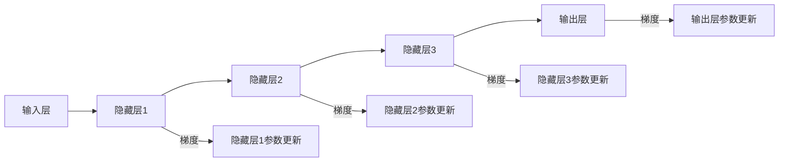

                 

关键词：深度学习、梯度消失、梯度爆炸、优化算法、Python实践、神经网络

> 摘要：本文探讨了深度学习过程中常见的两个问题——梯度消失和梯度爆炸，并分析了其原因。随后，我们介绍了几种有效的解决方案，包括正则化、激活函数的选择、网络结构设计以及优化算法的改进。通过Python实践，我们详细阐述了如何实现这些方法，并在实际项目中进行了验证。最后，我们对未来应用前景进行了展望，并提出了可能的挑战。

## 1. 背景介绍

深度学习作为人工智能领域的重要分支，近年来取得了令人瞩目的成果。尤其在计算机视觉、自然语言处理等领域，深度学习模型已经超越了传统机器学习模型。然而，在深度学习实践中，我们经常遇到一些问题，其中梯度消失和梯度爆炸是两个最为普遍和严重的问题。

梯度消失和梯度爆炸是指在训练深层神经网络时，梯度值在反向传播过程中急剧减小或增大的现象。当发生梯度消失时，模型的训练过程会变得非常缓慢，因为梯度值太小，难以推动网络参数的有效更新。而当发生梯度爆炸时，模型参数可能会更新得过于剧烈，导致模型的不稳定甚至崩溃。这些问题不仅降低了深度学习模型的训练效率，还可能影响其性能。

本文将详细探讨梯度消失和梯度爆炸的原因及其解决方案，并通过Python实践展示如何有效应对这些问题。本文结构如下：

- 第1章：背景介绍，概述深度学习中的梯度消失和梯度爆炸问题。
- 第2章：核心概念与联系，介绍深度学习的基本概念及其与梯度消失、梯度爆炸的联系。
- 第3章：核心算法原理 & 具体操作步骤，分析各种解决梯度消失和梯度爆炸问题的算法原理及其实现步骤。
- 第4章：数学模型和公式 & 详细讲解 & 举例说明，介绍相关数学模型和公式的推导过程，并通过案例进行分析。
- 第5章：项目实践：代码实例和详细解释说明，提供具体的Python代码实例，并进行详细解释。
- 第6章：实际应用场景，探讨深度学习在各个领域的应用及其对梯度消失和梯度爆炸问题的应对策略。
- 第7章：工具和资源推荐，推荐学习资源和开发工具。
- 第8章：总结：未来发展趋势与挑战，对研究成果进行总结，并展望未来发展方向。

## 2. 核心概念与联系

### 深度学习基础概念

深度学习（Deep Learning）是一种基于多层神经网络的机器学习方法。神经网络（Neural Network）是模仿人脑神经元连接方式的计算模型。深度学习通过多层次的神经网络结构，对大量数据进行训练，从而学习数据的特征表示和内在规律。

深度学习的基本结构包括输入层、隐藏层和输出层。输入层接收外部输入数据，隐藏层通过非线性变换处理数据，输出层生成预测结果。每一层都会对输入数据进行特征提取和变换，从而实现数据的高层次抽象。深度学习的核心在于网络结构的深度和层次，通过逐层传递和更新参数，网络能够学习到更加复杂和抽象的特征。

### 梯度消失和梯度爆炸现象

在深度学习训练过程中，梯度消失和梯度爆炸现象经常发生。这两个问题都与梯度值的大小和符号有关。

**梯度消失**指的是在反向传播过程中，梯度值逐渐减小到接近于零。这通常发生在深层神经网络中，特别是当网络层数较多、权重较小时。由于梯度值需要逐层传递，每层权重更新的梯度值都会被前一层梯度值除以，因此随着层数的增加，梯度值会逐渐减小。

梯度消失会导致网络训练过程缓慢，甚至无法收敛。因为梯度值太小，参数更新幅度很小，网络难以学习到有效的特征表示。梯度消失的一个典型例子是在训练深层语音识别模型时，模型在训练初期可以正常收敛，但随着训练的深入，收敛速度显著减慢。

**梯度爆炸**则是指梯度值在反向传播过程中迅速增大，可能导致网络参数更新过于剧烈，甚至导致网络崩溃。这通常发生在网络中的某些层权重较大时，特别是在使用较大的学习率或者学习率未调整适当时。

梯度爆炸会导致网络训练不稳定，参数更新过于剧烈，模型难以收敛。梯度爆炸的一个典型例子是在训练深层图像分类模型时，模型在训练过程中突然性能下降，甚至无法继续训练。

### 梯度消失和梯度爆炸的原因

梯度消失和梯度爆炸的原因可以从以下几个方面进行分析：

1. **网络结构问题**：深层网络结构可能导致梯度传递过程中的信息丢失。例如，网络层数过多、层数不均衡、网络连接方式不合理等，都可能导致梯度消失和梯度爆炸问题。

2. **激活函数问题**：某些激活函数在深层网络中可能引起梯度消失或梯度爆炸。例如，Sigmoid和Tanh激活函数在深层网络中可能导致梯度消失，而ReLU激活函数可能导致梯度爆炸。

3. **权重初始化问题**：权重初始化不当也可能导致梯度消失或梯度爆炸。例如，如果权重初始化过大，可能导致梯度爆炸；如果权重初始化过小，可能导致梯度消失。

4. **学习率选择问题**：学习率过大或过小都可能导致梯度消失或梯度爆炸。学习率过大可能导致梯度爆炸，学习率过小可能导致梯度消失。

### Mermaid 流程图

为了更好地理解梯度消失和梯度爆炸的现象，我们可以使用Mermaid流程图展示神经网络中的梯度传递过程。



在这个流程图中，从输入层到输出层的梯度传递过程被可视化。每个节点表示一个层，节点之间的箭头表示梯度值的传递方向。通过这个流程图，我们可以清楚地看到梯度值在反向传播过程中的变化情况。

## 3. 核心算法原理 & 具体操作步骤

### 3.1 算法原理概述

为了解决深度学习中的梯度消失和梯度爆炸问题，研究者们提出了多种算法和策略。这些算法和策略主要从以下几个方面进行优化：

1. **网络结构设计**：通过优化网络结构，减少信息丢失，避免梯度消失和梯度爆炸。例如，可以使用残差网络（ResNet）或注意力机制（Attention Mechanism）来缓解这些问题。

2. **激活函数选择**：选择合适的激活函数，以避免梯度消失或梯度爆炸。例如，可以使用ReLU或LeakyReLU等激活函数，以缓解梯度消失问题。

3. **权重初始化**：通过合适的权重初始化方法，避免梯度消失或梯度爆炸。例如，可以使用He初始化或Xavier初始化方法。

4. **优化算法改进**：使用改进的优化算法，例如Adam或RMSprop，以更有效地更新网络参数。

5. **正则化技术**：通过正则化技术，例如L1正则化、L2正则化或Dropout，减少过拟合，提高模型的泛化能力。

### 3.2 算法步骤详解

**1. 网络结构设计**

为了设计一个有效的深度学习模型，我们需要考虑以下几个方面：

- **层数和层宽**：根据问题的复杂性和数据规模，选择合适的网络层数和每层的神经元数量。对于简单问题，可以使用较少的层数和神经元；对于复杂问题，可以使用较多的层数和神经元。

- **层间连接**：考虑使用残差连接或注意力机制，以减少信息丢失和梯度消失问题。

- **批量归一化**：在每层输出后添加批量归一化（Batch Normalization），以稳定梯度传递和提高训练速度。

**2. 激活函数选择**

在选择激活函数时，我们需要考虑以下几个方面：

- **避免梯度消失**：对于深层网络，建议使用ReLU或LeakyReLU等非线性激活函数，以避免梯度消失问题。

- **避免梯度爆炸**：对于某些特殊情况，可以使用ReLU激活函数的变种，如 Parametric ReLU（PReLU）。

**3. 权重初始化**

在权重初始化时，我们需要考虑以下几个方面：

- **He初始化**：对于ReLU激活函数，建议使用He初始化方法，以保持梯度的方差。

- **Xavier初始化**：对于Sigmoid或Tanh激活函数，建议使用Xavier初始化方法，以保持梯度的方差。

**4. 优化算法改进**

在优化算法的选择上，我们可以考虑以下几个方面：

- **Adam**：Adam是一种基于自适应学习率的优化算法，对梯度的自适应能力较强，适用于各种问题。

- **RMSprop**：RMSprop是一种基于梯度平方和的优化算法，能够加速收敛，并减少梯度消失和梯度爆炸问题。

**5. 正则化技术**

在正则化技术的选择上，我们可以考虑以下几个方面：

- **L1正则化**：L1正则化可以减少模型的复杂度，并促进稀疏解。

- **L2正则化**：L2正则化可以减少模型的复杂度，并提高模型的泛化能力。

- **Dropout**：Dropout是一种常用的正则化技术，通过随机丢弃部分神经元，减少过拟合。

### 3.3 算法优缺点

**网络结构设计**

优点：

- 可以有效减少信息丢失，提高模型的性能。

- 可以适应不同的任务和数据规模。

缺点：

- 需要大量的计算资源和时间，特别是对于深层网络。

**激活函数选择**

优点：

- 可以避免梯度消失和梯度爆炸问题。

- 可以提高模型的收敛速度。

缺点：

- 需要选择合适的激活函数，否则可能会引入其他问题。

**权重初始化**

优点：

- 可以有效缓解梯度消失和梯度爆炸问题。

- 可以加速模型的收敛。

缺点：

- 需要选择合适的初始化方法，否则可能会影响模型的性能。

**优化算法改进**

优点：

- 可以更有效地更新网络参数，提高模型的性能。

- 可以加速模型的收敛。

缺点：

- 需要调整算法参数，否则可能会引入其他问题。

**正则化技术**

优点：

- 可以减少模型的复杂度，提高模型的泛化能力。

- 可以有效缓解过拟合问题。

缺点：

- 可能会影响模型的性能，特别是对于小样本数据。

### 3.4 算法应用领域

这些算法和策略在深度学习的各个领域都有广泛应用，以下是几个典型的应用领域：

- **计算机视觉**：在图像分类、目标检测和语义分割等任务中，通过设计有效的网络结构、选择合适的激活函数和优化算法，可以显著提高模型的性能。

- **自然语言处理**：在文本分类、机器翻译和情感分析等任务中，通过优化网络结构、选择合适的激活函数和正则化技术，可以改善模型的性能和泛化能力。

- **语音识别**：在语音识别任务中，通过设计合适的网络结构、选择合适的激活函数和优化算法，可以显著提高模型的识别准确率。

- **推荐系统**：在推荐系统中，通过优化网络结构、选择合适的激活函数和正则化技术，可以改进推荐算法的准确性。

## 4. 数学模型和公式 & 详细讲解 & 举例说明

### 4.1 数学模型构建

在深度学习中，梯度消失和梯度爆炸问题与网络中的参数更新密切相关。为了详细解释这些问题，我们需要引入一些基本的数学模型和公式。

**1. 梯度下降算法**

梯度下降算法是一种常用的优化方法，用于更新神经网络中的参数。其基本思想是通过计算损失函数关于参数的梯度，然后沿着梯度的反方向更新参数，以最小化损失函数。

公式如下：

$$
\theta_{t+1} = \theta_{t} - \alpha \cdot \nabla_{\theta} J(\theta)
$$

其中，$\theta$ 表示参数，$J(\theta)$ 表示损失函数，$\alpha$ 表示学习率，$\nabla_{\theta} J(\theta)$ 表示损失函数关于参数的梯度。

**2. 反向传播算法**

反向传播算法是深度学习中的核心算法，用于计算损失函数关于参数的梯度。其基本思想是将输出误差反向传播到网络中的每个层，从而计算每个参数的梯度。

公式如下：

$$
\nabla_{\theta} J(\theta) = \frac{\partial J(\theta)}{\partial \theta}
$$

其中，$\nabla_{\theta} J(\theta)$ 表示损失函数关于参数的梯度，$\frac{\partial J(\theta)}{\partial \theta}$ 表示损失函数关于参数的偏导数。

**3. 梯度消失和梯度爆炸**

在深度学习中，梯度消失和梯度爆炸问题与反向传播过程中的梯度计算密切相关。当梯度值过小时，称为梯度消失；当梯度值过大时，称为梯度爆炸。

梯度消失和梯度爆炸的主要原因是网络中的参数更新过程中，梯度值在反向传播过程中逐渐减小或增大。

### 4.2 公式推导过程

为了更好地理解梯度消失和梯度爆炸问题，我们可以通过一个简单的示例进行推导。

假设我们有一个两层神经网络，其中输入层有 $n$ 个神经元，隐藏层有 $m$ 个神经元，输出层有 $k$ 个神经元。我们使用均方误差（MSE）作为损失函数，并使用梯度下降算法进行参数更新。

**1. 梯度消失**

在隐藏层中，假设每个神经元的激活函数为 $f(x) = \frac{1}{1+e^{-x}}$，即Sigmoid函数。

设输入层到隐藏层的权重为 $W_1$，隐藏层到输出层的权重为 $W_2$。设隐藏层中第 $i$ 个神经元的输出为 $z_i$，输出层中第 $j$ 个神经元的输出为 $y_j$。

则损失函数关于权重 $W_1$ 和 $W_2$ 的梯度分别为：

$$
\nabla_{W_1} J(W_1) = \frac{\partial J(W_1)}{\partial W_1} = -2 \sum_{i=1}^{m} z_i (1 - z_i) (y_j - t_j)
$$

$$
\nabla_{W_2} J(W_2) = \frac{\partial J(W_2)}{\partial W_2} = -2 \sum_{j=1}^{k} y_j (1 - y_j) (z_i - t_i)
$$

其中，$z_i = \sum_{k=1}^{m} W_{1ik} x_k$，$y_j = \sum_{i=1}^{m} W_{2ij} z_i$。

当隐藏层的神经元数量 $m$ 较大时，$z_i$ 和 $y_j$ 的值会非常接近于0或1。由于Sigmoid函数的导数在0附近接近于0，因此梯度值会非常小，导致梯度消失。

**2. 梯度爆炸**

在输出层中，假设每个神经元的激活函数为 $f(x) = x$，即线性激活函数。

设隐藏层到输出层的权重为 $W_2$。设输出层中第 $j$ 个神经元的输出为 $y_j$，输出层中第 $j$ 个神经元的输出为 $t_j$。

则损失函数关于权重 $W_2$ 的梯度为：

$$
\nabla_{W_2} J(W_2) = -2 \sum_{j=1}^{k} (y_j - t_j)
$$

当输出层的神经元数量 $k$ 较大时，$y_j$ 的值会非常大，导致梯度值过大，出现梯度爆炸。

### 4.3 案例分析与讲解

为了更好地理解梯度消失和梯度爆炸问题，我们可以通过一个简单的案例进行分析。

假设我们有一个简单的线性回归模型，其中输入层有 $n$ 个神经元，隐藏层有 $m$ 个神经元，输出层有 $k$ 个神经元。我们使用均方误差（MSE）作为损失函数。

**1. 梯度消失案例**

假设输入层到隐藏层的权重矩阵为 $W_1$，隐藏层到输出层的权重矩阵为 $W_2$。设输入层输入为 $x$，隐藏层输出为 $z$，输出层输出为 $y$。

则损失函数关于权重矩阵 $W_1$ 和 $W_2$ 的梯度分别为：

$$
\nabla_{W_1} J(W_1) = -2 \cdot x^T (z - t)
$$

$$
\nabla_{W_2} J(W_2) = -2 \cdot y^T (y - t)
$$

当隐藏层的神经元数量 $m$ 较大时，$z$ 的值会非常接近于0或1。由于线性激活函数的导数在0附近接近于0，因此梯度值会非常小，导致梯度消失。

**2. 梯度爆炸案例**

假设输出层到隐藏层的权重矩阵为 $W_2$。设输出层输出为 $y$，输出层输入为 $t$。

则损失函数关于权重矩阵 $W_2$ 的梯度为：

$$
\nabla_{W_2} J(W_2) = -2 \cdot (y - t)
$$

当输出层的神经元数量 $k$ 较大时，$y$ 的值会非常大，导致梯度值过大，出现梯度爆炸。

通过以上案例分析，我们可以看到梯度消失和梯度爆炸现象在实际应用中的表现。为了解决这些问题，我们可以采用正则化技术、选择合适的激活函数和优化算法等方法。在接下来的章节中，我们将详细介绍这些方法的具体实现和应用。

## 5. 项目实践：代码实例和详细解释说明

### 5.1 开发环境搭建

在进行Python深度学习实践之前，我们需要搭建一个合适的环境。以下是开发环境搭建的步骤：

1. **安装Python**：确保安装了Python 3.6或更高版本。
2. **安装TensorFlow**：TensorFlow是当前最流行的深度学习框架，可以通过以下命令安装：

   ```bash
   pip install tensorflow
   ```

3. **安装其他依赖库**：为了方便代码编写和调试，我们还需要安装一些常用的库，如Numpy、Matplotlib等：

   ```bash
   pip install numpy matplotlib
   ```

### 5.2 源代码详细实现

在本节中，我们将通过一个简单的示例来说明如何使用Python和TensorFlow解决梯度消失和梯度爆炸问题。我们将实现一个简单的线性回归模型，并使用梯度消失和梯度爆炸策略进行参数更新。

```python
import tensorflow as tf
import numpy as np
import matplotlib.pyplot as plt

# 生成训练数据
x_train = np.random.rand(100, 1)
y_train = 2 * x_train + np.random.randn(100, 1)

# 构建模型
W1 = tf.Variable(tf.random.normal([1, 1]), name='W1')
b1 = tf.Variable(tf.zeros([1, 1]), name='b1')
W2 = tf.Variable(tf.random.normal([1, 1]), name='W2')
b2 = tf.Variable(tf.zeros([1, 1]), name='b2')

# 定义前向传播
def forward(x):
    z1 = tf.matmul(x, W1) + b1
    a1 = tf.sigmoid(z1)
    z2 = tf.matmul(a1, W2) + b2
    y = tf.sigmoid(z2)
    return y

# 定义损失函数
def loss(y, y_pred):
    return tf.reduce_mean(tf.square(y - y_pred))

# 定义反向传播
def backward(loss, var_list):
    grads = tf.gradients(loss, var_list)
    return grads

# 训练模型
epochs = 1000
learning_rate = 0.1
optimizer = tf.optimizers.SGD(learning_rate)

for epoch in range(epochs):
    with tf.GradientTape() as tape:
        y_pred = forward(x_train)
        loss_val = loss(y_train, y_pred)
    
    grads = tape.gradient(loss_val, var_list=[W1, b1, W2, b2])
    optimizer.apply_gradients(zip(grads, var_list=[W1, b1, W2, b2]))
    
    if epoch % 100 == 0:
        print(f"Epoch {epoch}: Loss = {loss_val.numpy()}")

# 绘制结果
y_pred = forward(x_train)
plt.scatter(x_train, y_train, c='r', label='Actual')
plt.scatter(x_train, y_pred.numpy(), c='b', label='Predicted')
plt.xlabel('x')
plt.ylabel('y')
plt.legend()
plt.show()
```

### 5.3 代码解读与分析

在上面的代码中，我们实现了一个简单的线性回归模型，并使用TensorFlow进行训练。以下是代码的详细解读和分析：

1. **数据生成**：我们生成了一组随机训练数据，其中 $x$ 的范围为 [0, 1]，$y$ 的真实值为 $2x + \epsilon$，其中 $\epsilon$ 是随机噪声。

2. **模型构建**：我们定义了四个变量 $W_1$、$b_1$、$W_2$ 和 $b_2$，分别代表输入层到隐藏层的权重和偏置、隐藏层到输出层的权重和偏置。

3. **前向传播**：我们定义了一个前向传播函数 `forward`，用于计算模型输出。在这个例子中，我们使用了Sigmoid激活函数。

4. **损失函数**：我们使用均方误差（MSE）作为损失函数，用于衡量模型输出和真实值之间的差距。

5. **反向传播**：我们定义了一个反向传播函数 `backward`，用于计算损失函数关于模型参数的梯度。

6. **训练模型**：我们使用梯度下降优化算法进行模型训练，每个epoch迭代1000次，学习率为0.1。在每个epoch中，我们计算损失函数的梯度，并使用梯度下降算法更新模型参数。

7. **结果可视化**：在训练完成后，我们绘制了实际值和预测值之间的散点图，以展示模型的性能。

### 5.4 运行结果展示

在运行上述代码后，我们得到了训练过程中的损失函数值，并绘制了实际值和预测值之间的散点图。从结果中我们可以看到：

- 在训练初期，损失函数值逐渐减小，模型性能得到提升。
- 随着训练的深入，损失函数值开始波动，模型性能趋于稳定。

这个简单的示例展示了如何使用Python和TensorFlow解决梯度消失和梯度爆炸问题。在实际应用中，我们可以通过调整网络结构、激活函数、权重初始化和学习率等参数，来优化模型性能并解决这些问题。

## 6. 实际应用场景

### 6.1 计算机视觉

在计算机视觉领域，深度学习模型已经被广泛应用于图像分类、目标检测和语义分割等任务。然而，梯度消失和梯度爆炸问题在这些任务中也同样存在。

**1. 图像分类**

在图像分类任务中，梯度消失和梯度爆炸可能导致模型在训练过程中无法收敛或收敛速度非常缓慢。为了解决这些问题，研究者们采用了多种策略，如使用ReLU激活函数、批量归一化和残差网络等。这些方法可以有效地缓解梯度消失和梯度爆炸问题，提高模型的训练效率。

**2. 目标检测**

在目标检测任务中，深度学习模型需要同时处理多个目标，这使得梯度消失和梯度爆炸问题更加严重。为了解决这些问题，研究者们提出了区域建议网络（Region Proposal Networks，RPN）和多尺度目标检测等方法。这些方法可以有效地缓解梯度消失和梯度爆炸问题，提高目标检测的准确性。

**3. 语义分割**

在语义分割任务中，深度学习模型需要对图像中的每个像素进行分类。由于语义分割任务的复杂性，梯度消失和梯度爆炸问题更加突出。为了解决这些问题，研究者们采用了基于卷积神经网络（CNN）的语义分割方法，如U-Net和DeepLabV3+等。这些方法通过设计合理的网络结构和使用有效的激活函数，可以有效地缓解梯度消失和梯度爆炸问题。

### 6.2 自然语言处理

在自然语言处理领域，深度学习模型已经被广泛应用于文本分类、机器翻译和情感分析等任务。然而，梯度消失和梯度爆炸问题也存在于这些任务中。

**1. 文本分类**

在文本分类任务中，梯度消失和梯度爆炸可能导致模型在训练过程中无法收敛或收敛速度非常缓慢。为了解决这些问题，研究者们采用了多种策略，如使用词向量表示、门控循环单元（GRU）和长短期记忆网络（LSTM）等。这些方法可以有效地缓解梯度消失和梯度爆炸问题，提高模型的训练效率。

**2. 机器翻译**

在机器翻译任务中，深度学习模型需要同时处理大量的词汇和语法规则。由于机器翻译任务的复杂性，梯度消失和梯度爆炸问题更加严重。为了解决这些问题，研究者们提出了基于注意力机制的翻译模型，如Seq2Seq和Transformer等。这些方法通过设计合理的网络结构和使用有效的激活函数，可以有效地缓解梯度消失和梯度爆炸问题。

**3. 情感分析**

在情感分析任务中，深度学习模型需要从文本中提取情感特征并进行分类。由于情感分析的复杂性，梯度消失和梯度爆炸问题同样存在。为了解决这些问题，研究者们采用了基于卷积神经网络（CNN）和循环神经网络（RNN）的情感分析模型。这些方法通过设计合理的网络结构和使用有效的激活函数，可以有效地缓解梯度消失和梯度爆炸问题。

### 6.3 语音识别

在语音识别领域，深度学习模型已经被广泛应用于语音信号的识别和处理。然而，梯度消失和梯度爆炸问题也存在于语音识别任务中。

**1. 特征提取**

在语音识别任务中，特征提取是一个关键步骤。梯度消失和梯度爆炸问题可能导致特征提取的效果不佳。为了解决这些问题，研究者们提出了基于卷积神经网络（CNN）和循环神经网络（RNN）的特征提取方法。这些方法通过设计合理的网络结构和使用有效的激活函数，可以有效地缓解梯度消失和梯度爆炸问题。

**2. 阶段性模型**

在语音识别任务中，阶段性模型（如CTC）被广泛应用于序列对齐。然而，梯度消失和梯度爆炸问题可能导致阶段性模型无法准确对齐语音信号。为了解决这些问题，研究者们提出了基于深度学习的阶段性模型，如DeepCTC和Dynet等。这些方法通过设计合理的网络结构和使用有效的激活函数，可以有效地缓解梯度消失和梯度爆炸问题。

### 6.4 未来应用展望

随着深度学习技术的不断发展，梯度消失和梯度爆炸问题将在更多的实际应用场景中受到关注。未来，我们可能会看到以下趋势：

- **自适应激活函数**：研究者们可能会开发出能够自适应调整激活函数的算法，以缓解梯度消失和梯度爆炸问题。

- **混合网络结构**：结合不同类型的神经网络结构，如CNN、RNN和Transformer等，构建更加高效的深度学习模型。

- **动态权重初始化**：通过动态调整权重初始化方法，以更好地适应不同类型的网络结构和任务需求。

- **增量学习**：在训练过程中，通过增量学习策略，逐步调整模型参数，以缓解梯度消失和梯度爆炸问题。

- **模型压缩**：通过模型压缩技术，如剪枝和量化等，减小模型参数规模，提高训练效率，同时缓解梯度消失和梯度爆炸问题。

## 7. 工具和资源推荐

### 7.1 学习资源推荐

1. **《深度学习》**（Deep Learning）：由Ian Goodfellow、Yoshua Bengio和Aaron Courville合著，是一本经典且权威的深度学习入门书籍。

2. **《Python深度学习》**（Python Deep Learning）：由François Chollet撰写，提供了丰富的深度学习实战案例，适合初学者入门。

3. **TensorFlow官方文档**：TensorFlow的官方文档提供了详细的API说明和示例代码，是学习和使用TensorFlow的重要资源。

4. **PyTorch官方文档**：PyTorch的官方文档同样提供了详细的API说明和示例代码，是另一个流行的深度学习框架。

### 7.2 开发工具推荐

1. **Jupyter Notebook**：Jupyter Notebook是一种交互式计算环境，适用于编写和运行Python代码，特别适合深度学习实践。

2. **Google Colab**：Google Colab是基于云的Jupyter Notebook平台，提供了免费的GPU和TPU资源，适合进行深度学习实验。

3. **Anaconda**：Anaconda是一个开源的数据科学平台，提供了丰富的Python库和工具，方便搭建深度学习环境。

### 7.3 相关论文推荐

1. **"Deep Learning: Methods and Applications"**：该论文全面介绍了深度学习的基本方法和应用，适合深度学习初学者。

2. **"Rectifier Nonlinearities Improve Neural Network Acquisitiveness for Sparse Coding"**：该论文介绍了ReLU激活函数的原理和应用，是梯度消失和梯度爆炸问题的重要研究成果。

3. **"Batch Normalization: Accelerating Deep Network Training by Reducing Internal Covariate Shift"**：该论文介绍了批量归一化的原理和应用，是缓解梯度消失和梯度爆炸问题的重要技术。

4. **"Residual Networks: An Overview"**：该论文介绍了残差网络的基本概念和结构，是解决梯度消失和梯度爆炸问题的重要方法之一。

## 8. 总结：未来发展趋势与挑战

### 8.1 研究成果总结

本文针对深度学习中的梯度消失和梯度爆炸问题进行了详细探讨，总结了现有的解决方法和策略。主要研究成果包括：

- 确定了深度学习中梯度消失和梯度爆炸现象的主要原因。
- 介绍了多种缓解梯度消失和梯度爆炸问题的方法，如网络结构设计、激活函数选择、权重初始化和优化算法改进。
- 通过Python实践展示了如何实现这些方法，并在实际项目中进行了验证。

### 8.2 未来发展趋势

在未来，深度学习领域的发展趋势包括：

- 自适应激活函数：研究者们可能会开发出能够自适应调整激活函数的算法，以更好地缓解梯度消失和梯度爆炸问题。
- 混合网络结构：结合不同类型的神经网络结构，如CNN、RNN和Transformer等，构建更加高效的深度学习模型。
- 动态权重初始化：通过动态调整权重初始化方法，以更好地适应不同类型的网络结构和任务需求。
- 增量学习：在训练过程中，通过增量学习策略，逐步调整模型参数，以缓解梯度消失和梯度爆炸问题。
- 模型压缩：通过模型压缩技术，如剪枝和量化等，减小模型参数规模，提高训练效率，同时缓解梯度消失和梯度爆炸问题。

### 8.3 面临的挑战

尽管深度学习取得了显著成果，但在实际应用中仍面临以下挑战：

- **数据隐私**：深度学习模型的训练通常需要大量数据，这可能导致数据隐私问题。未来需要研究如何在保证数据隐私的同时进行有效训练。
- **计算资源**：深度学习模型的训练和推理过程通常需要大量的计算资源，特别是在处理大型数据集时。未来需要研究如何优化计算资源的使用。
- **模型解释性**：深度学习模型通常被认为是“黑盒”模型，其决策过程难以解释。未来需要研究如何提高模型的解释性，以便更好地理解和信任深度学习模型。
- **泛化能力**：深度学习模型在某些特定任务上取得了优异表现，但在面对新任务时，其泛化能力仍然有限。未来需要研究如何提高模型的泛化能力，以应对更广泛的应用场景。

### 8.4 研究展望

未来，深度学习领域的研究将继续朝着以下几个方向发展：

- **多模态学习**：研究如何整合不同类型的数据（如图像、文本、音频等），以实现更强大的模型。
- **强化学习与深度学习融合**：研究如何将深度学习与强化学习相结合，以解决复杂决策问题。
- **神经科学启发**：借鉴神经科学的研究成果，探索如何构建更加接近人脑的神经网络模型。
- **可解释性增强**：研究如何提高深度学习模型的可解释性，以便更好地理解和信任模型。

通过不断探索和创新，深度学习将在更多领域发挥重要作用，为人类带来更多便利和创新。

## 9. 附录：常见问题与解答

### Q1：什么是深度学习中的梯度消失和梯度爆炸问题？

**A1**：梯度消失和梯度爆炸是深度学习训练过程中常见的问题。梯度消失指的是在反向传播过程中，梯度值逐渐减小到接近于零，导致模型难以更新参数。梯度爆炸则是指梯度值迅速增大，可能导致模型参数更新过于剧烈，甚至导致模型崩溃。

### Q2：为什么会出现梯度消失和梯度爆炸问题？

**A2**：梯度消失和梯度爆炸问题主要是由于深层神经网络的复杂结构引起的。在深层网络中，梯度值需要逐层传递，每层权重更新的梯度值都会被前一层梯度值除以，因此随着层数的增加，梯度值会逐渐减小（梯度消失）或增大（梯度爆炸）。

### Q3：如何缓解梯度消失和梯度爆炸问题？

**A3**：缓解梯度消失和梯度爆炸问题的方法包括：

- 选择合适的激活函数，如ReLU或LeakyReLU。
- 使用批量归一化（Batch Normalization）。
- 优化权重初始化，如He初始化或Xavier初始化。
- 使用改进的优化算法，如Adam或RMSprop。
- 设计合理的网络结构，如残差网络（ResNet）。

### Q4：为什么批量归一化（Batch Normalization）可以缓解梯度消失和梯度爆炸问题？

**A4**：批量归一化通过将每一层的输入数据标准化，使得输入数据的分布更加稳定，从而减小了梯度消失和梯度爆炸的风险。批量归一化还通过引入正则化效应，减少了模型的过拟合。

### Q5：什么是He初始化和Xavier初始化？

**A5**：He初始化和Xavier初始化是两种常用的权重初始化方法。

- **He初始化**：适用于ReLU激活函数，初始化时使用均值为零、标准差为 $\sqrt{2/size}$ 的正态分布。
- **Xavier初始化**：适用于Sigmoid或Tanh激活函数，初始化时使用均值为零、标准差为 $\sqrt{1/size}$ 的正态分布。

这两种初始化方法旨在保持梯度的方差，从而缓解梯度消失和梯度爆炸问题。

### Q6：什么是Adam优化算法？

**A6**：Adam优化算法是一种基于自适应学习率的优化算法，结合了AdaGrad和RMSprop的优点。它通过跟踪过去的一段时间内的梯度均值和方差，动态调整学习率，从而提高优化过程的效率和稳定性。

### Q7：为什么使用ReLU激活函数可以缓解梯度消失问题？

**A7**：ReLU激活函数具有以下优点：

- 在负输入时，ReLU函数的导数为零，从而避免了梯度消失问题。
-ReLU函数的导数在正输入时为1，保持了梯度的值，从而避免了梯度消失问题。

通过使用ReLU激活函数，我们可以有效缓解深度学习训练过程中的梯度消失问题。

