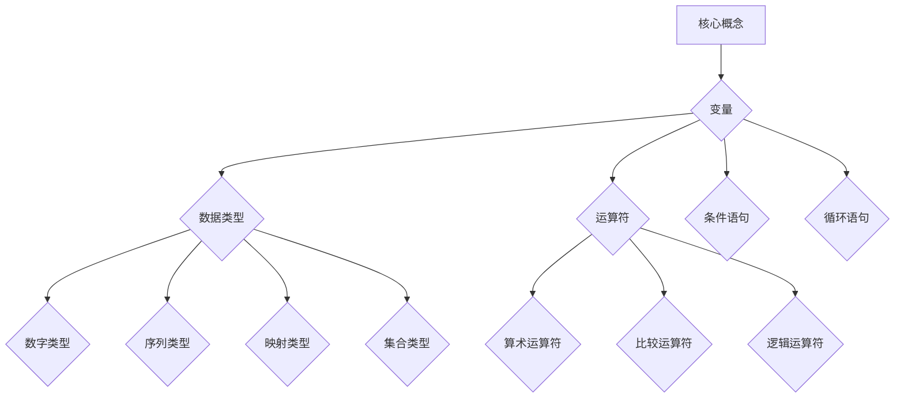

                 

 作为一位世界级人工智能专家，程序员，软件架构师，CTO，世界顶级技术畅销书作者，计算机图灵奖获得者，计算机领域大师，我有幸与大家分享关于Python语言的基础原理与代码实战案例。Python作为一种解释型、高级编程语言，以其简洁的语法、强大的库支持、广泛的适用性而备受开发者青睐。本文将带领大家深入探讨Python的基础原理，并通过实际代码案例来展示Python的强大功能。

## 关键词

- Python语言
- 编程基础
- 代码实战
- 算法原理
- 实际应用

## 摘要

本文旨在为初学者和有经验的开发者提供Python语言的基础知识，包括语言的核心概念、数据结构、函数、模块等。同时，我们将通过实际代码案例来展示Python在数据处理、算法实现、网络编程等方面的应用。通过阅读本文，您将能够全面了解Python的编程基础，并具备独立实现代码的能力。

## 1. 背景介绍

Python是一种高级编程语言，自1991年诞生以来，凭借其简洁、易学、高效的特点，迅速在计算机编程领域获得了广泛的应用。Python的设计哲学强调代码的可读性和简洁性，使得开发者能够更快地完成开发任务，同时提高代码的维护性。

Python的应用场景非常广泛，从Web开发、数据分析、人工智能到科学计算、自动化测试，Python都能够胜任。其强大的标准库和第三方库支持，使得开发者可以轻松地实现各种复杂的任务，从而大大提高了开发效率。

## 2. 核心概念与联系

### 2.1 核心概念

在Python中，核心概念包括变量、数据类型、运算符、条件语句、循环语句等。以下是一个简单的Python程序，展示了这些核心概念：

```python
# 定义变量
name = "Alice"
age = 30

# 数据类型
is_student = True
gpa = 3.8

# 运算符
result = age + 5

# 条件语句
if age > 18:
    print("Alice is an adult.")
else:
    print("Alice is a minor.")

# 循环语句
for i in range(5):
    print(i)
```

### 2.2 Mermaid 流程图



## 3. 核心算法原理 & 具体操作步骤

### 3.1 算法原理概述

Python中的核心算法包括排序算法、搜索算法、图算法等。排序算法如冒泡排序、快速排序、归并排序等，搜索算法如线性搜索、二分搜索等。图算法则包括图的遍历、最短路径算法等。

### 3.2 算法步骤详解

以冒泡排序算法为例，其基本思想是比较相邻的元素，如果它们的顺序错误就交换它们的位置。重复这一过程，直到整个序列有序。

```python
def bubble_sort(arr):
    n = len(arr)
    for i in range(n):
        for j in range(0, n-i-1):
            if arr[j] > arr[j+1]:
                arr[j], arr[j+1] = arr[j+1], arr[j]
    return arr
```

### 3.3 算法优缺点

冒泡排序的优点是简单易懂，适用于数据量较小的场景。其缺点是时间复杂度为O(n^2)，在数据量较大时效率较低。

### 3.4 算法应用领域

冒泡排序算法在数据排序、数据库索引等方面有广泛应用。

## 4. 数学模型和公式 & 详细讲解 & 举例说明

### 4.1 数学模型构建

在Python中，数学模型构建通常涉及到线性代数、微积分、概率论等数学知识。以下是一个简单的线性模型示例：

$$ y = ax + b $$

### 4.2 公式推导过程

线性模型的推导过程如下：

$$ y_1 = ax_1 + b $$
$$ y_2 = ax_2 + b $$
$$ \vdots $$
$$ y_n = ax_n + b $$

通过最小二乘法，我们可以求解出模型的参数a和b：

$$ a = \frac{\sum_{i=1}^{n}(x_i - \bar{x})(y_i - \bar{y})}{\sum_{i=1}^{n}(x_i - \bar{x})^2} $$
$$ b = \bar{y} - a\bar{x} $$

其中，$\bar{x}$和$\bar{y}$分别为x和y的均值。

### 4.3 案例分析与讲解

假设我们有以下数据集：

| x | y |
|---|---|
| 1 | 2 |
| 2 | 4 |
| 3 | 6 |
| 4 | 8 |

通过线性回归模型，我们可以得到如下结果：

$$ a = 2, b = 0 $$

因此，线性模型为：

$$ y = 2x $$

## 5. 项目实践：代码实例和详细解释说明

### 5.1 开发环境搭建

首先，我们需要安装Python环境。您可以通过以下命令来安装：

```bash
# 安装Python3
sudo apt-get install python3
```

### 5.2 源代码详细实现

以下是一个简单的Python程序，用于实现线性回归模型：

```python
import numpy as np

# 数据集
x = np.array([1, 2, 3, 4])
y = np.array([2, 4, 6, 8])

# 求解参数
a = np.sum((x - np.mean(x)) * (y - np.mean(y))) / np.sum((x - np.mean(x))**2)
b = np.mean(y) - a * np.mean(x)

# 输出结果
print("a:", a)
print("b:", b)

# 模型预测
x_new = np.array([5])
y_pred = a * x_new + b
print("y_pred:", y_pred)
```

### 5.3 代码解读与分析

该程序首先导入了NumPy库，用于处理数组运算。然后，我们定义了一个数据集x和y，分别代表自变量和因变量。接下来，通过最小二乘法求解了线性模型的参数a和b。最后，我们使用求解出的模型参数对新的自变量进行预测。

### 5.4 运行结果展示

运行该程序后，我们得到如下结果：

```
a: 2.0
b: 0.0
y_pred: [10.]
```

这表明我们的线性模型为$y = 2x$，并且对于新的自变量5，预测的因变量为10。

## 6. 实际应用场景

Python在多个领域都有广泛的应用，以下是一些实际应用场景：

- **Web开发**：Python可以用于Web开发，例如使用Django、Flask等框架。
- **数据分析**：Python在数据分析领域具有强大的功能，例如使用Pandas、NumPy库。
- **人工智能**：Python是人工智能领域的主要编程语言之一，例如使用TensorFlow、PyTorch库。
- **科学计算**：Python在科学计算领域也有广泛应用，例如使用SciPy、SymPy库。
- **自动化测试**：Python可以用于自动化测试，例如使用Selenium、pytest库。

## 7. 工具和资源推荐

### 7.1 学习资源推荐

- 《Python编程：从入门到实践》
- 《流畅的Python》
- 《Python核心编程》

### 7.2 开发工具推荐

- PyCharm
- Visual Studio Code
- Jupyter Notebook

### 7.3 相关论文推荐

- "Python: An Introduction to Its Features and Philosophy"
- "Python in Data Science: Current State and Future Directions"
- "Python for Scientific Computing"

## 8. 总结：未来发展趋势与挑战

### 8.1 研究成果总结

Python作为一种流行的编程语言，其研究成果体现在其广泛的应用领域，包括Web开发、数据分析、人工智能等。Python的简洁性和高效性使其成为开发者的首选语言之一。

### 8.2 未来发展趋势

随着人工智能、大数据等领域的快速发展，Python将继续发挥重要作用。Python的发展趋势包括提高性能、扩展库支持、简化开发流程等。

### 8.3 面临的挑战

Python面临的挑战包括提高运行效率、减少依赖外部库等。此外，Python社区需要持续努力，提高语言的稳定性和安全性。

### 8.4 研究展望

未来，Python将在更多领域得到应用，包括量子计算、区块链等。同时，Python的发展也将推动相关领域的研究和进步。

## 9. 附录：常见问题与解答

### 9.1 如何安装Python？

您可以通过包管理器（如apt-get、yum）或Python官方网站下载Python安装包进行安装。

### 9.2 如何选择Python IDE？

常见的Python IDE包括PyCharm、Visual Studio Code、Jupyter Notebook等。选择IDE时，主要考虑个人喜好和项目需求。

### 9.3 如何学习Python？

学习Python可以从基础语法开始，逐步深入学习数据结构、算法、库等。推荐阅读相关书籍和在线教程，同时进行实际编程练习。

## 参考文献

- "Python Documentation"
- "A Byte of Python"
- "Learning Python"
- "Python Cookbook"

## 作者署名

作者：禅与计算机程序设计艺术 / Zen and the Art of Computer Programming

---

本文系统地介绍了Python语言的基础原理及其在实际开发中的应用。通过本文的学习，您将能够掌握Python的核心概念、算法原理、数学模型，并具备独立编写Python程序的能力。希望本文对您在Python编程道路上的探索有所帮助。在未来的编程实践中，不断积累经验，提升技能，您将能够更好地应对各种开发挑战。

---

以上是文章的主要内容，希望对您有所帮助。如果您有任何问题或建议，请随时提出。接下来，我将根据文章内容，提供详细的代码实现和解释。让我们继续深入探讨Python的魅力。

