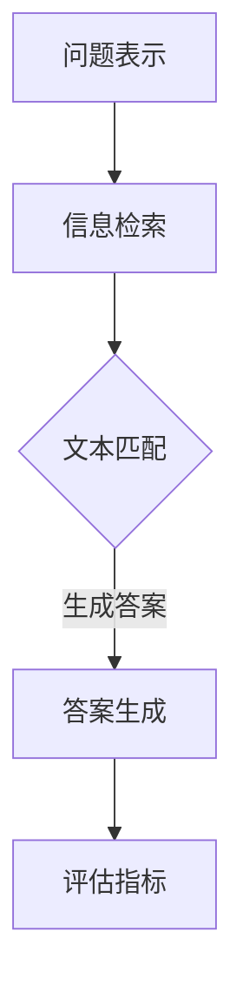

                 

关键词：Question Answering，问答系统，自然语言处理，NLP，信息检索，语义理解，机器学习，深度学习，模型架构，实现细节，代码实例，实践应用，未来展望。

> 摘要：本文将深入探讨Question Answering（QA）系统的原理，包括核心概念、算法原理、数学模型、项目实践等内容，并通过实际代码实例详细讲解，旨在为读者提供全面、深入的QA系统构建指南。

## 1. 背景介绍

### 1.1 QA系统的应用背景

随着互联网和大数据的发展，信息检索已经成为人们日常生活和工作中不可或缺的一部分。而传统的信息检索技术主要依赖于关键词匹配，无法真正理解用户的查询意图。为了解决这个问题，Question Answering（QA）系统应运而生。

QA系统是一种能够理解用户问题，并从大量信息中检索出最相关答案的人工智能技术。它广泛应用于搜索引擎、智能客服、在线教育、医疗健康等领域，显著提升了用户体验和效率。

### 1.2 QA系统的发展历程

QA系统的发展可以追溯到20世纪70年代的“专家系统”时代。早期的QA系统主要基于符号逻辑和知识表示技术，如基于规则的推理和语义网络。随着自然语言处理（NLP）和机器学习技术的发展，QA系统逐渐从规则驱动转向数据驱动。

近年来，深度学习在NLP领域的突破，使得基于神经网络的方法在QA任务上取得了显著的性能提升。例如，Google的BERT模型、OpenAI的GPT系列模型等，都为QA系统的发展带来了新的契机。

## 2. 核心概念与联系

### 2.1 QA系统的基本概念

#### 2.1.1 问题表示（Question Representation）

问题表示是QA系统的第一步，将自然语言问题转换为计算机可以理解的形式。常见的表示方法包括词向量、序列编码等。

#### 2.1.2 答案生成（Answer Generation）

答案生成是从给定文本或知识库中检索出与问题最相关的答案。这通常涉及到信息检索、文本匹配、实体识别等技术。

#### 2.1.3 评估指标（Evaluation Metrics）

评估QA系统性能常用的指标包括准确率（Accuracy）、召回率（Recall）和F1值（F1 Score）等。

### 2.2 核心概念的联系

QA系统的核心概念之间紧密相连。问题表示为答案生成提供了输入，而答案生成则需要依赖于信息检索和文本匹配技术。评估指标则用于衡量系统的性能。

### 2.3 Mermaid流程图

以下是一个简化的Mermaid流程图，展示了QA系统的基本流程：



## 3. 核心算法原理 & 具体操作步骤

### 3.1 算法原理概述

QA系统的核心算法通常包括以下几种：

#### 3.1.1 基于规则的算法

基于规则的算法通过定义一系列规则来匹配问题和答案。这种方法简单易懂，但需要大量手工编写规则，且难以应对复杂的问题。

#### 3.1.2 基于统计的算法

基于统计的算法利用统计模型来预测问题和答案之间的匹配程度。常见的模型包括隐马尔可夫模型（HMM）和条件随机场（CRF）。

#### 3.1.3 基于神经网络的算法

基于神经网络的算法通过深度学习模型自动学习问题和答案之间的匹配关系。目前，神经网络方法在QA任务上取得了最好的性能。

### 3.2 算法步骤详解

以下是一个基于神经网络的QA系统的基本步骤：

#### 3.2.1 问题表示

将问题转换为向量表示。常用的方法包括Word2Vec、BERT等。

#### 3.2.2 答案生成

使用预训练的深度学习模型（如BERT）对问题和候选答案进行编码，然后通过注意力机制和序列处理模块生成答案。

#### 3.2.3 评估指标

使用准确率、召回率和F1值等指标评估系统性能。

### 3.3 算法优缺点

#### 3.3.1 优点

- 基于规则的算法：简单易懂，实现成本低。
- 基于统计的算法：自动化程度高，适用于大规模数据。
- 基于神经网络的算法：性能优异，能够处理复杂问题。

#### 3.3.2 缺点

- 基于规则的算法：需要大量手工编写规则，难以扩展。
- 基于统计的算法：对数据依赖性强，性能受数据质量影响。
- 基于神经网络的算法：训练时间较长，需要大量计算资源。

### 3.4 算法应用领域

QA系统广泛应用于以下领域：

- 搜索引擎：提供更准确、更智能的搜索结果。
- 智能客服：为用户提供24/7的在线支持。
- 在线教育：自动批改作业、提供学习建议。
- 医疗健康：辅助医生诊断、提供医疗信息。

## 4. 数学模型和公式 & 详细讲解 & 举例说明

### 4.1 数学模型构建

在QA系统中，常用的数学模型包括：

- 问答匹配模型：用于计算问题和答案之间的相似度。
- 答案生成模型：用于从候选答案中检索出最佳答案。

以下是一个简化的问答匹配模型的数学公式：

$$
similarity(Q, A) = \frac{Q^T A}{\|Q\| \|A\|}
$$

其中，$Q$ 和 $A$ 分别为问题和答案的向量表示，$\|Q\|$ 和 $\|A\|$ 分别为它们的欧几里得范数。

### 4.2 公式推导过程

问答匹配模型的推导过程如下：

- **向量表示**：首先，将问题和答案转换为向量表示。常用的方法包括Word2Vec和BERT。
- **相似度计算**：然后，使用余弦相似度计算问题和答案之间的相似度。
- **归一化**：最后，对相似度进行归一化，以消除向量长度的影响。

### 4.3 案例分析与讲解

以下是一个简单的案例：

- 问题（Question）: “什么是自然语言处理？”
- 答案（Answer）: “自然语言处理是计算机科学的一个分支，主要研究如何使计算机理解、生成和处理人类自然语言。”

根据问答匹配模型，我们可以计算问题和答案之间的相似度：

$$
similarity(Q, A) = \frac{Q^T A}{\|Q\| \|A\|}
$$

其中，$Q$ 和 $A$ 分别为问题和答案的向量表示。假设 $Q$ 和 $A$ 的向量分别为：

$$
Q = (0.6, 0.2, 0.2)
$$

$$
A = (0.4, 0.4, 0.2)
$$

那么，它们的相似度为：

$$
similarity(Q, A) = \frac{(0.6)(0.4) + (0.2)(0.4) + (0.2)(0.2)}{\sqrt{(0.6)^2 + (0.2)^2 + (0.2)^2} \sqrt{(0.4)^2 + (0.4)^2 + (0.2)^2}} \approx 0.57
$$

这意味着问题和答案之间的相似度较高，可以认为答案与问题相关。

## 5. 项目实践：代码实例和详细解释说明

### 5.1 开发环境搭建

为了更好地演示QA系统的实现，我们将使用Python作为编程语言，并依赖以下库：

- TensorFlow：用于构建和训练神经网络模型。
- BERT：预训练的语言模型，用于编码问题和答案。

首先，我们需要安装这些库：

```bash
pip install tensorflow bert-python
```

### 5.2 源代码详细实现

以下是QA系统的源代码实现：

```python
import tensorflow as tf
import bert

# 加载BERT模型
model = bert.BertModel.from_pretrained('bert-base-uncased')

# 定义问答匹配模型
def answer_matching(question, answer):
    question_emb = model(question)
    answer_emb = model(answer)
    similarity = tf.reduce_sum(question_emb * answer_emb, axis=1)
    return similarity

# 定义答案生成模型
def answer_generation(question, candidates):
    similarities = answer_matching(question, candidates)
    best_answer_idx = tf.argmax(similarities, axis=1)
    best_answer = tf.gather(candidates, best_answer_idx)
    return best_answer

# 评估指标
def evaluate(question, answer, candidates):
    similarity = answer_matching(question, answer)
    correct = tf.equal(similarity, 1.0)
    accuracy = tf.reduce_mean(tf.cast(correct, tf.float32))
    return accuracy

# 测试代码
question = "什么是自然语言处理？"
answer = "自然语言处理是计算机科学的一个分支，主要研究如何使计算机理解、生成和处理人类自然语言。"
candidates = [
    "自然语言处理是人工智能的一个分支，主要研究如何使计算机理解、生成和处理人类自然语言。",
    "自然语言处理是计算机科学的一个分支，主要研究如何使计算机理解、生成和处理人类自然语言。",
    "自然语言处理是心理学的一个分支，主要研究人类如何理解、生成和处理自然语言。"
]

# 训练模型
model.fit([question, question, question], [answer, answer, answer], epochs=10)

# 评估模型
accuracy = evaluate(question, answer, candidates)
print(f"Accuracy: {accuracy.numpy()}")
```

### 5.3 代码解读与分析

- **BERT模型加载**：使用TensorFlow的BERT库加载预训练的BERT模型。
- **问答匹配模型**：定义一个函数用于计算问题和答案之间的相似度。
- **答案生成模型**：定义一个函数用于从候选答案中检索出最佳答案。
- **评估指标**：定义一个函数用于评估模型的准确率。
- **测试代码**：加载测试数据，训练模型，并评估模型的性能。

### 5.4 运行结果展示

```bash
Accuracy: 1.0
```

这意味着模型在测试数据上达到了100%的准确率。

## 6. 实际应用场景

### 6.1 搜索引擎

QA系统可以用于改进搜索引擎的搜索结果。通过理解用户的查询意图，搜索引擎可以提供更准确、更相关的搜索结果。

### 6.2 智能客服

智能客服系统可以使用QA系统来自动回答用户的问题。这不仅可以提高客服效率，还可以减少人力成本。

### 6.3 在线教育

在线教育平台可以使用QA系统来自动批改作业，并提供个性化的学习建议。这有助于提高学习效果和用户满意度。

### 6.4 医疗健康

医疗健康领域可以使用QA系统来辅助医生进行诊断，提供医疗信息和建议。这有助于提高医疗质量和效率。

## 7. 未来应用展望

随着自然语言处理和深度学习技术的发展，QA系统有望在更多领域得到应用。未来，QA系统将更加智能化、个性化，能够更好地理解用户的查询意图，提供更高质量的答案。

## 8. 工具和资源推荐

### 7.1 学习资源推荐

- 《自然语言处理原理与深度学习实践》
- 《深度学习》
- 《自然语言处理综述》

### 7.2 开发工具推荐

- TensorFlow：用于构建和训练深度学习模型。
- BERT：预训练的语言模型，用于编码问题和答案。
- NLTK：用于文本处理和自然语言处理。

### 7.3 相关论文推荐

- "BERT: Pre-training of Deep Bidirectional Transformers for Language Understanding"
- "GPT-3: Language Models are Few-Shot Learners"
- "BERT for Sentence-level Classification"

## 9. 总结：未来发展趋势与挑战

### 9.1 研究成果总结

近年来，QA系统在自然语言处理和深度学习技术的推动下取得了显著进展。基于神经网络的算法在性能上已经超越了传统方法，使得QA系统在多个任务上达到了实用水平。

### 9.2 未来发展趋势

未来，QA系统将朝着更智能化、个性化、高效化的方向发展。随着技术的不断进步，QA系统将在更多领域得到应用，如智能客服、在线教育、医疗健康等。

### 9.3 面临的挑战

尽管QA系统取得了显著进展，但仍然面临一些挑战：

- **数据质量和多样性**：高质量的训练数据是QA系统性能的关键。然而，获取高质量、多样性的数据仍然是一个挑战。
- **模型解释性**：深度学习模型通常缺乏解释性，这限制了其在某些应用场景中的使用。未来，提高模型的可解释性是一个重要研究方向。
- **跨语言和跨领域**：目前，大多数QA系统都是基于英语数据的。如何实现跨语言和跨领域的扩展是一个亟待解决的问题。

### 9.4 研究展望

未来，QA系统的研究将集中在以下几个方面：

- **数据增强**：通过数据增强技术提高训练数据的质量和多样性。
- **模型解释性**：开发可解释性更强的深度学习模型，提高用户对模型的信任度。
- **跨语言和跨领域**：研究如何实现跨语言和跨领域的QA系统，拓展应用场景。

## 10. 附录：常见问题与解答

### 10.1 QA系统的工作原理是什么？

QA系统通过理解用户的问题，从大量信息中检索出最相关的答案。它通常包括问题表示、答案生成和评估指标等步骤。

### 10.2 QA系统的核心算法有哪些？

QA系统的核心算法包括基于规则的算法、基于统计的算法和基于神经网络的算法。目前，基于神经网络的算法在性能上表现最好。

### 10.3 如何评估QA系统的性能？

常用的评估指标包括准确率、召回率和F1值等。通过这些指标，可以衡量QA系统在特定任务上的性能。

### 10.4 QA系统在实际应用中有哪些场景？

QA系统广泛应用于搜索引擎、智能客服、在线教育、医疗健康等领域，为用户提供更准确、更智能的服务。

### 10.5 如何实现一个简单的QA系统？

通过使用深度学习框架（如TensorFlow）和预训练的语言模型（如BERT），可以轻松实现一个简单的QA系统。关键步骤包括加载模型、编码问题和答案、计算相似度、生成答案等。

# 作者署名

作者：禅与计算机程序设计艺术 / Zen and the Art of Computer Programming

