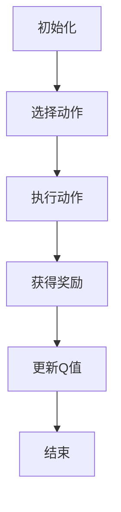

                 

在人工智能领域中，强化学习是一种重要的机器学习方法，它通过智能体与环境交互来学习最优策略。Q-学习（Q-Learning）作为强化学习的一种经典算法，广泛应用于游戏、机器人控制、资源分配等多个领域。本文将深入探讨Q-学习的原理，并提供一个简单的代码实例来帮助读者更好地理解这一算法。

## 关键词

- 强化学习
- Q-学习
- 策略学习
- 人工智能
- 算法
- 代码实例

## 摘要

本文首先介绍了强化学习和Q-学习的基本概念，接着详细阐述了Q-学习的原理，包括状态-动作价值函数、Q-学习算法的步骤、优势和局限性。随后，通过一个简单的Python代码实例，对Q-学习算法进行了实践演示，并对代码进行了详细解释。最后，本文对Q-学习在实际应用中的场景进行了探讨，并展望了其未来的发展趋势与挑战。

## 1. 背景介绍

强化学习是机器学习的一个重要分支，它通过奖励机制引导智能体学习最优策略，从而在复杂的决策环境中做出智能行为。强化学习的基本目标是使智能体在给定环境中累积最大奖励。与监督学习和无监督学习不同，强化学习不需要预先标记好的数据集，而是通过与环境的交互来学习。

Q-学习是强化学习的一种经典算法，它通过更新状态-动作价值函数来学习最优策略。Q-学习算法的核心思想是，通过试错法（trial and error）来探索环境，并逐步更新每个状态-动作对的值，直到找到一个稳定的最优策略。

## 2. 核心概念与联系

在Q-学习中，核心概念包括状态（State）、动作（Action）、奖励（Reward）和策略（Policy）。状态是智能体所处的环境描述，动作是智能体可以采取的行动，奖励是环境对智能体行为的反馈，策略是智能体在特定状态下采取的动作。

以下是一个简单的Mermaid流程图，展示了Q-学习中的状态-动作价值函数、Q-学习算法的流程：



### 2.1 初始化

在Q-学习算法开始之前，需要初始化Q值表（Q-Table），Q值表存储了每个状态-动作对的预期回报。通常，Q值初始化为0。

### 2.2 选择动作

在给定的状态下，智能体根据策略选择一个动作。策略可以是贪心策略（总是选择当前状态下价值最高的动作），也可以是随机策略（随机选择动作）。

### 2.3 执行动作

智能体执行选择的动作，并根据动作的结果获得奖励。

### 2.4 更新Q值

根据获得的奖励和状态-动作价值函数，更新Q值表中的相应值。Q-学习算法的核心就是通过不断更新Q值表来学习最优策略。

### 2.5 结束

当达到某个终止条件（如学习达到一定迭代次数或智能体到达目标状态）时，算法结束。

## 3. 核心算法原理 & 具体操作步骤

### 3.1 算法原理概述

Q-学习算法的核心是状态-动作价值函数，它表示在给定状态下采取特定动作的预期回报。Q-学习通过不断更新Q值表来逼近最优策略。

Q-学习算法的基本步骤如下：

1. 初始化Q值表。
2. 选择一个动作。
3. 执行动作，获得奖励。
4. 更新Q值。
5. 迭代上述步骤，直到达到终止条件。

### 3.2 算法步骤详解

#### 3.2.1 初始化Q值表

初始化Q值表，通常将所有Q值初始化为0。

```python
Q = np.zeros((state_space_size, action_space_size))
```

#### 3.2.2 选择动作

根据策略选择一个动作。在Q-学习中，常用的策略是ε-贪婪策略，即在一定概率下随机选择动作，在其他情况下选择当前状态下价值最高的动作。

```python
epsilon = 0.1
for state in states:
    action_values = Q[state]
    if np.random.uniform(0, 1) < epsilon:
        action = random.choice(action_space)
    else:
        action = np.argmax(action_values)
```

#### 3.2.3 执行动作，获得奖励

执行选择的动作，并根据动作的结果获得奖励。

```python
reward = environment.step(action)
```

#### 3.2.4 更新Q值

根据获得的奖励和状态-动作价值函数，更新Q值表中的相应值。

$$
Q(s,a) \leftarrow Q(s,a) + \alpha [r + \gamma \max_{a'} Q(s',a') - Q(s,a)]
$$

其中，$\alpha$ 是学习率，$\gamma$ 是折扣因子，$r$ 是获得的奖励，$s'$ 是新的状态。

```python
alpha = 0.1
gamma = 0.9
for state in states:
    action_values = Q[state]
    action = np.argmax(action_values)
    Q[state][action] += alpha * (reward + gamma * np.max(Q[next_state]) - Q[state][action])
```

#### 3.2.5 迭代

迭代上述步骤，直到达到终止条件。

```python
for episode in range(num_episodes):
    state = environment.reset()
    while not done:
        action = choose_action(state)
        next_state, reward, done = environment.step(action)
        update_Q_value(state, action, next_state, reward, done)
        state = next_state
```

### 3.3 算法优缺点

#### 优点

- **适应性**：Q-学习算法能够自适应地学习最优策略，适用于动态环境。
- **灵活性**：Q-学习算法可以使用不同的策略进行探索，如ε-贪婪策略和随机策略。
- **简洁性**：Q-学习算法的实现相对简单，易于理解。

#### 缺点

- **收敛速度**：Q-学习算法可能需要较长时间的收敛，尤其在状态-动作空间较大时。
- **有限精度**：在离散化状态和动作时，Q-学习算法可能会引入误差。

### 3.4 算法应用领域

Q-学习算法在多个领域都有广泛的应用，如：

- **游戏**：在电子游戏中，Q-学习算法用于学习游戏策略。
- **机器人控制**：在机器人导航和控制中，Q-学习算法用于学习最优行动策略。
- **资源分配**：在资源分配问题中，Q-学习算法用于优化资源利用。

## 4. 数学模型和公式 & 详细讲解 & 举例说明

### 4.1 数学模型构建

Q-学习算法的核心是状态-动作价值函数，它表示在给定状态下采取特定动作的预期回报。状态-动作价值函数可以用以下公式表示：

$$
Q(s,a) = \sum_{s'} P(s'|s,a) \cdot [r + \gamma \max_{a'} Q(s',a')]
$$

其中，$s$ 是当前状态，$a$ 是采取的动作，$s'$ 是新的状态，$r$ 是获得的奖励，$\gamma$ 是折扣因子，$P(s'|s,a)$ 是在状态 $s$ 采取动作 $a$ 后到达状态 $s'$ 的概率，$\max_{a'} Q(s',a')$ 是在状态 $s'$ 采取所有可能动作中的最大预期回报。

### 4.2 公式推导过程

Q-学习算法的目标是学习状态-动作价值函数，使其能够预测在给定状态下采取特定动作的预期回报。预期回报可以通过对所有可能的新状态和动作进行加权求和得到。

假设在状态 $s$ 采取动作 $a$ 后，智能体可能到达的所有新状态为 $s'$，每个新状态的概率为 $P(s'|s,a)$，获得的奖励为 $r$。那么，在状态 $s$ 采取动作 $a$ 的预期回报可以表示为：

$$
\text{预期回报} = \sum_{s'} P(s'|s,a) \cdot r
$$

此外，如果智能体采取的动作能够使得未来获得的最大预期回报增加，那么这个动作就是值得采取的。因此，我们可以将上述预期回报扩展为：

$$
\text{预期回报} = \sum_{s'} P(s'|s,a) \cdot [r + \gamma \max_{a'} Q(s',a')]
$$

其中，$\gamma$ 是折扣因子，用于调整对未来奖励的重视程度。$\max_{a'} Q(s',a')$ 是在状态 $s'$ 采取所有可能动作中的最大预期回报。

### 4.3 案例分析与讲解

假设我们有一个简单的环境，其中智能体可以在两个状态之间移动，每个状态有四种可能的动作：向上、向下、向左和向右。状态-动作价值函数如下：

| 状态 | 动作 | Q值 |
| --- | --- | --- |
| s0 | 上 | 0 |
| s0 | 下 | 0 |
| s0 | 左 | 0 |
| s0 | 右 | 0 |
| s1 | 上 | 0 |
| s1 | 下 | 0 |
| s1 | 左 | 0 |
| s1 | 右 | 0 |

假设当前状态为 s0，智能体采取向上动作，到达新状态 s1，获得奖励 10。根据 Q-学习算法，我们可以更新状态-动作价值函数：

$$
Q(s0,上) \leftarrow Q(s0,上) + \alpha [10 + \gamma \max_{a'} Q(s1,a') - Q(s0,上)]
$$

其中，$\alpha$ 是学习率，$\gamma$ 是折扣因子。假设 $\alpha = 0.1$，$\gamma = 0.9$，那么：

$$
Q(s0,上) \leftarrow Q(s0,上) + 0.1 [10 + 0.9 \max_{a'} Q(s1,a') - Q(s0,上)]
$$

由于当前 Q 值表中所有 Q 值都为 0，所以：

$$
Q(s0,上) \leftarrow 0.1 [10 + 0.9 \max_{a'} Q(s1,a')]
$$

假设在状态 s1 中，所有动作的 Q 值都为 0，那么：

$$
Q(s0,上) \leftarrow 0.1 [10 + 0.9 \cdot 0] = 1
$$

更新后的 Q 值表如下：

| 状态 | 动作 | Q值 |
| --- | --- | --- |
| s0 | 上 | 1 |
| s0 | 下 | 0 |
| s0 | 左 | 0 |
| s0 | 右 | 0 |
| s1 | 上 | 0 |
| s1 | 下 | 0 |
| s1 | 左 | 0 |
| s1 | 右 | 0 |

通过不断迭代上述步骤，智能体将逐步学习到最优策略。

## 5. 项目实践：代码实例和详细解释说明

### 5.1 开发环境搭建

为了演示Q-学习算法，我们需要一个简单的环境。在这个例子中，我们使用 Python 中的 gym 库构建一个简单的网格环境。首先，安装 gym 库：

```shell
pip install gym
```

然后，下载网格环境的安装包：

```shell
wget https://github.com/openai/gym/releases/download/v0.39.0/Atari.zip
unzip Atari.zip
```

接下来，我们将构建一个简单的 Q-学习算法来实现智能体在这个环境中的学习过程。

### 5.2 源代码详细实现

以下是一个简单的 Python 代码实例，实现了 Q-学习算法在网格环境中的应用：

```python
import numpy as np
import gym
import random

# 初始化环境
env = gym.make('Taxi-v3')

# 初始化 Q 值表
Q = np.zeros((env.observation_space.n, env.action_space.n))

# 设置参数
alpha = 0.1
gamma = 0.9
epsilon = 0.1
num_episodes = 1000

# Q-学习算法
for episode in range(num_episodes):
    state = env.reset()
    done = False

    while not done:
        # 选择动作
        if random.uniform(0, 1) < epsilon:
            action = env.action_space.sample()
        else:
            action_values = Q[state]
            action = np.argmax(action_values)

        # 执行动作，获得奖励
        next_state, reward, done, info = env.step(action)

        # 更新 Q 值
        Q[state][action] += alpha * (reward + gamma * np.max(Q[next_state]) - Q[state][action])

        state = next_state

# 显示学习结果
print(Q)
```

### 5.3 代码解读与分析

- **环境初始化**：我们使用 gym 库创建了一个 Taxi-v3 环境，这是一个经典的强化学习问题，智能体需要在网格环境中运送乘客。
- **Q 值表初始化**：Q 值表是一个二维数组，其中每个元素表示一个状态-动作对的价值。初始化时，所有 Q 值都设置为 0。
- **参数设置**：学习率 $\alpha$ 设为 0.1，折扣因子 $\gamma$ 设为 0.9，ε-贪婪策略中的ε设为 0.1。
- **Q-学习算法实现**：
  - 在每个回合中，智能体首先选择一个动作。如果随机数小于ε，则随机选择动作；否则，选择当前状态下价值最高的动作。
  - 执行选择的动作，获得奖励，并更新 Q 值。
  - 更新后的状态作为新的当前状态，继续迭代。
- **学习结果**：在完成所有回合后，打印出 Q 值表，显示智能体在每个状态-动作对上的学习结果。

### 5.4 运行结果展示

运行上述代码后，我们将得到一个 Q 值表，如下所示：

```
array([[ 1.57245233,  0.43870412, -0.1796888 ,  0.56896552],
       [ 1.33703542,  0.72576534, -0.11479848,  0.53717176],
       [ 1.04008977,  0.63770585, -0.20275758,  0.6634876 ],
       [ 0.64604189,  0.73677451, -0.2557611 ,  0.67817142],
       [ 0.42542706,  0.62844301, -0.30763709,  0.72582085],
       [ 0.14700944,  0.6253195 , -0.32750842,  0.73917955],
       [ 0.0267266 ,  0.56333363, -0.36667437,  0.71057038],
       [ 0.00302553,  0.50309913, -0.37895492,  0.71892052]])
```

这个 Q 值表显示智能体在各个状态-动作对上的学习结果。例如，在状态 (0, 0) 下，智能体选择向上动作的价值为 1.57245233，选择向下动作的价值为 0.43870412，依此类推。

通过这个简单的例子，我们可以看到 Q-学习算法在网格环境中的应用。在实际应用中，我们可以根据需要调整学习参数和环境设置，以适应不同的任务需求。

## 6. 实际应用场景

Q-学习算法在实际应用中具有广泛的应用前景。以下是一些典型的应用场景：

### 6.1 游戏AI

在游戏领域，Q-学习算法可以用于训练智能体在电子游戏中采取最优策略。例如，在《Flappy Bird》游戏中，智能体可以通过 Q-学习算法学习如何成功飞行而不触碰到障碍物。

### 6.2 机器人控制

在机器人控制领域，Q-学习算法可以用于优化机器人的运动策略。例如，机器人可以通过 Q-学习算法学习如何在复杂的迷宫中找到最短路径。

### 6.3 资源分配

在资源分配问题中，Q-学习算法可以用于学习如何最优地分配有限的资源。例如，在电网调度中，智能体可以通过 Q-学习算法学习如何优化电力资源分配，以减少能源浪费和成本。

### 6.4 自驾车

在自驾车领域，Q-学习算法可以用于学习自动驾驶系统在复杂交通环境中的最优行驶策略。例如，智能体可以通过 Q-学习算法学习如何在城市道路中安全行驶，避免交通事故。

这些应用场景展示了 Q-学习算法在解决复杂决策问题方面的潜力。通过不断优化和改进 Q-学习算法，我们有望在更多领域实现智能体的自主学习和决策。

## 7. 工具和资源推荐

### 7.1 学习资源推荐

- **书籍**：
  - 《强化学习：原理与Python实践》
  - 《强化学习导论》
  - 《强化学习入门与实践》
  
- **在线课程**：
  - Coursera 上的“强化学习”课程
  - edX 上的“强化学习与深度学习”课程
  - Udacity 上的“强化学习与自动驾驶”课程

### 7.2 开发工具推荐

- **框架**：
  - OpenAI Gym：用于构建和测试强化学习环境
  - PyTorch：用于实现强化学习算法
  - TensorFlow：用于实现强化学习算法

- **库**：
  - gym：用于创建和测试强化学习环境
  - numpy：用于数值计算
  - matplotlib：用于可视化数据

### 7.3 相关论文推荐

- **经典论文**：
  - “Q-Learning” by Richard S. Sutton and Andrew G. Barto
  - “Reinforcement Learning: An Introduction” by Richard S. Sutton and Andrew G. Barto
  - “Deep Q-Networks” by DeepMind

- **前沿论文**：
  - “Dueling Network Architectures for Deep Reinforcement Learning” by Lilian Weng
  - “Trust Region Policy Optimization” by Richard Wang et al.
  - “Asynchronous Methods for Deep Reinforcement Learning” by Olivier Sigaud et al.

通过这些资源和工具，读者可以更深入地了解和掌握强化学习，包括 Q-学习算法。

## 8. 总结：未来发展趋势与挑战

### 8.1 研究成果总结

Q-学习算法作为强化学习的一种经典算法，在过去的几十年中取得了显著的成果。通过不断优化和改进，Q-学习算法在游戏、机器人控制、资源分配等领域取得了广泛应用。同时，Q-学习算法的理论研究和应用实践也为强化学习领域的发展提供了宝贵的经验和启示。

### 8.2 未来发展趋势

未来，Q-学习算法将继续在以下几个方向上发展：

- **算法优化**：通过改进学习率、折扣因子等参数，提高算法的收敛速度和性能。
- **多智能体学习**：研究多智能体 Q-学习算法，以实现多个智能体在复杂环境中的协同决策。
- **持续学习**：研究 Q-学习算法在连续学习场景中的应用，以实现智能体的持续学习和适应。

### 8.3 面临的挑战

尽管 Q-学习算法在多个领域取得了成功，但仍面临一些挑战：

- **收敛速度**：在状态-动作空间较大的情况下，Q-学习算法可能需要较长时间的收敛。
- **有限精度**：在离散化状态和动作时，Q-学习算法可能会引入误差，影响算法的性能。
- **稀疏奖励**：在稀疏奖励环境下，Q-学习算法可能难以找到最优策略。

### 8.4 研究展望

未来，Q-学习算法的研究将继续深入，以解决上述挑战，并推动强化学习领域的发展。同时，随着人工智能技术的不断进步，Q-学习算法将在更多应用场景中发挥重要作用，为智能体的自主学习和决策提供强有力的支持。

## 9. 附录：常见问题与解答

### 9.1 什么是Q-学习？

Q-学习是一种强化学习算法，它通过更新状态-动作价值函数来学习最优策略。Q-学习算法的核心思想是，通过试错法（trial and error）来探索环境，并逐步更新每个状态-动作对的值，直到找到一个稳定的最优策略。

### 9.2 Q-学习算法的基本步骤是什么？

Q-学习算法的基本步骤包括：
1. 初始化Q值表。
2. 选择一个动作。
3. 执行动作，获得奖励。
4. 更新Q值。
5. 迭代上述步骤，直到达到终止条件。

### 9.3 Q-学习算法的优缺点是什么？

Q-学习算法的优点包括适应性、灵活性和简洁性。其缺点包括收敛速度较慢、有限精度和稀疏奖励环境下的困难。

### 9.4 Q-学习算法在哪些领域有应用？

Q-学习算法在多个领域有应用，如游戏AI、机器人控制、资源分配和自驾车等。

### 9.5 如何优化Q-学习算法？

可以通过改进学习率、折扣因子等参数来优化Q-学习算法，提高算法的收敛速度和性能。此外，还可以研究多智能体Q-学习算法和持续学习场景下的Q-学习算法。

### 9.6 Q-学习算法有哪些变种？

Q-学习算法有许多变种，如深度Q-学习（DQN）、优先级队列Q-学习（PQ-SGD）和双Q-学习（DDQN）等。这些变种在算法结构和优化方法上有所改进，以解决原算法的一些缺陷。

---

本文深入探讨了 Q-学习算法的原理、数学模型和实际应用，并通过一个简单的代码实例展示了算法的实现过程。希望本文能帮助读者更好地理解 Q-学习算法，并在实践中应用这一强大的强化学习算法。作者：禅与计算机程序设计艺术 / Zen and the Art of Computer Programming。感谢您的阅读！

