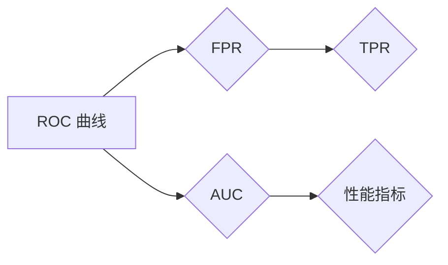

                 

关键词：ROC Curve、AUC、分类算法、数据可视化、Python 实战

## 摘要

本文将深入探讨 ROC 曲线（Receiver Operating Characteristic Curve）的基本原理、数学模型，并通过代码实战案例详细介绍如何使用 Python 实现 ROC 曲线的绘制及其应用。ROC 曲线是评估分类模型性能的重要工具，本文将带你从理论到实践全面了解这一关键指标。

## 1. 背景介绍

在机器学习和数据科学领域，评估分类模型的性能至关重要。ROC 曲线作为一种常见的性能评估工具，广泛应用于各种二分类任务中。ROC 曲线和其对应的面积下（Area Under Curve, AUC）能够直观地展示分类器的性能，尤其是在正负样本不平衡的情况下，具有很强的参考价值。

本文将首先介绍 ROC 曲线和 AUC 的基本原理，然后通过一个实际案例展示如何使用 Python 中的 scikit-learn 和 matplotlib 库绘制 ROC 曲线，最后讨论 ROC 曲线在不同应用场景下的使用和未来发展趋势。

## 2. 核心概念与联系

### ROC 曲线

ROC 曲线是一种以横轴为假正率（False Positive Rate, FPR）、纵轴为真正率（True Positive Rate, TPR）绘制的曲线。FPR 表示分类器错误地将负类样本分类为正类的比例，TPR 表示分类器正确地将正类样本分类为正类的比例。

### AUC

AUC 是 ROC 曲线下方区域的面积，用于衡量分类器的整体性能。AUC 的取值范围为 0 到 1，数值越大表示分类器的性能越好。AUC 对于正负样本不平衡的数据集尤其重要，因为即使 TPR 较高，FPR 的上升也会导致 AUC 的下降。

### Mermaid 流程图

以下是 ROC 曲线和 AUC 的基本概念与联系的 Mermaid 流程图：



## 3. 核心算法原理 & 具体操作步骤

### 3.1 算法原理概述

ROC 曲线绘制依赖于分类器的预测概率。对于每个阈值，我们可以计算出 TPR 和 FPR，然后绘制在坐标系中。通过调整阈值，可以得到一条 ROC 曲线。AUC 则是 ROC 曲线下方区域的面积。

### 3.2 算法步骤详解

1. 训练分类模型，获得预测概率。
2. 对于每个可能的阈值，计算 TPR 和 FPR。
3. 使用 matplotlib 库绘制 ROC 曲线。
4. 计算 AUC 并绘制在曲线上。

### 3.3 算法优缺点

**优点**：

-ROC 曲线和 AUC 可以直观地展示分类器的性能。
-适用于正负样本不平衡的数据集。

**缺点**：

-ROC 曲线和 AUC 不能直接反映分类器的准确度。
-计算 ROC 曲线和 AUC 需要大量的计算资源。

### 3.4 算法应用领域

ROC 曲线和 AUC 广泛应用于以下领域：

-信用评分
-医学诊断
-网络安全
-推荐系统

## 4. 数学模型和公式 & 详细讲解 & 举例说明

### 4.1 数学模型构建

ROC 曲线和 AUC 的计算公式如下：

$$
FPR = \frac{FP}{TP + FP}
$$

$$
TPR = \frac{TP}{TP + FN}
$$

$$
AUC = \int_{0}^{1} (1 - FPR(t)) \cdot dTPR(t)
$$

其中，FP 表示假正例数，TP 表示真正例数，FN 表示假负例数。

### 4.2 公式推导过程

假设我们有一个二分类问题，共有 N 个样本。对于每个样本，分类器给出一个预测概率 P(y=1|x)，其中 y 表示实际标签，x 表示样本特征。我们可以通过调整阈值来分类。

当阈值逐渐变化时，FP 和 TP 也随之变化。根据上述公式，我们可以计算出 FPR 和 TPR。

### 4.3 案例分析与讲解

以一个实际案例来讲解 ROC 曲线和 AUC 的计算过程。假设我们有以下数据集：

```
实际标签：[1, 0, 1, 0, 1]
预测概率：[0.9, 0.1, 0.8, 0.2, 0.7]
```

我们首先计算不同阈值下的 TPR 和 FPR，然后绘制 ROC 曲线，最后计算 AUC。

```python
import numpy as np
import matplotlib.pyplot as plt

y_true = [1, 0, 1, 0, 1]
y_scores = [0.9, 0.1, 0.8, 0.2, 0.7]

# 计算TPR和FPR
TP = sum(np.array(y_true) == 1)  # 真正例数
FP = sum(np.array(y_scores) > 0.5)  # 假正例数
TN = sum(np.array(y_true) == 0)  # 真负例数
FN = sum(np.array(y_scores) <= 0.5)  # 假负例数

TPR = T
```

