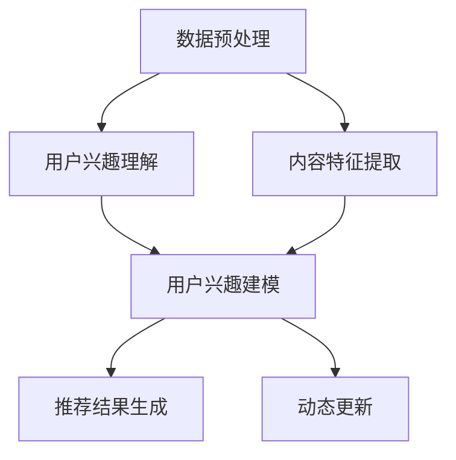

                 

关键词：推荐系统、自然语言处理、信息检索、机器学习、数据挖掘、人工智能

> 摘要：本文探讨了将自然语言处理（NLP）应用于推荐系统的创新范式。通过分析NLP技术的核心概念和算法原理，本文详细介绍了如何将语言处理技术与推荐系统结合，以实现更精确、个性化的推荐结果。本文还将讨论核心算法的应用领域、数学模型和公式，并通过实际项目实例展示了如何实现这一新范式。

## 1. 背景介绍

随着互联网的飞速发展，推荐系统已成为各类在线平台的核心功能之一。从电子商务网站到社交媒体平台，推荐系统通过分析用户的兴趣和行为模式，为用户推荐符合他们需求的内容或商品。传统的推荐系统主要依赖于协同过滤、基于内容的推荐等算法，这些方法在一定程度上能够满足用户的个性化需求，但在处理复杂、动态的数据时存在一定的局限性。

与此同时，自然语言处理（NLP）技术的快速发展，使得计算机能够理解和生成人类语言。NLP技术在信息检索、问答系统、机器翻译等领域的应用取得了显著成果。随着深度学习等先进技术的引入，NLP的精度和效率得到了进一步提升。这为推荐系统带来了新的机遇，将NLP技术应用于推荐系统，有望实现更加精准、个性化的推荐结果。

本文旨在探讨将NLP应用于推荐系统的新范式，分析核心概念和算法原理，并探讨其实际应用场景和未来发展趋势。

### 1.1 传统推荐系统的发展历程

推荐系统的发展历程可以分为以下几个阶段：

- **基于内容的推荐（Content-based Filtering）**：最早期的推荐系统，通过分析用户对内容的偏好，为用户推荐相似的内容。这种方法依赖于对用户兴趣的建模，但在处理用户兴趣变化和冷启动问题时表现不佳。

- **协同过滤（Collaborative Filtering）**：通过分析用户之间的相似性，为用户推荐其他用户喜欢的物品。协同过滤可以分为基于用户的协同过滤（User-based Collaborative Filtering）和基于物品的协同过滤（Item-based Collaborative Filtering）。尽管这种方法能够解决冷启动问题，但在处理长尾数据时存在一定的局限性。

- **混合推荐（Hybrid Recommender Systems）**：结合基于内容的推荐和协同过滤，以提高推荐效果的稳定性。混合推荐系统通过综合利用不同类型的数据源和算法，为用户提供更加个性化的推荐结果。

- **基于模型的推荐系统（Model-based Recommender Systems）**：引入机器学习、深度学习等算法，通过构建用户兴趣和物品特征之间的复杂关系模型，为用户推荐感兴趣的内容。基于模型的推荐系统在处理动态数据和长尾数据方面表现出色。

### 1.2 自然语言处理技术的发展及应用

自然语言处理（NLP）技术起源于20世纪50年代，随着计算机性能的提升和深度学习等先进算法的引入，NLP技术取得了显著进展。NLP技术主要包括以下方面：

- **词向量表示（Word Embedding）**：将单词映射为低维度的向量表示，以便进行计算机处理。Word2Vec、GloVe等算法在词向量表示方面取得了很好的效果。

- **语言模型（Language Model）**：通过学习大量文本数据，预测单词序列的概率分布。语言模型在机器翻译、语音识别等领域具有广泛的应用。

- **命名实体识别（Named Entity Recognition, NER）**：识别文本中的命名实体，如人名、地名、组织机构名等。NER技术在信息检索、问答系统等领域具有重要应用价值。

- **情感分析（Sentiment Analysis）**：通过分析文本的情感倾向，判断文本的正面或负面情感。情感分析在市场调研、客户反馈分析等领域具有广泛应用。

- **文本分类（Text Classification）**：将文本数据分类到预定义的类别中。文本分类在垃圾邮件过滤、新闻分类等领域具有重要作用。

### 1.3 将NLP应用于推荐系统的优势

将NLP技术应用于推荐系统，有助于解决传统推荐系统面临的一些挑战，具体优势如下：

- **提升推荐精度**：NLP技术能够更好地理解用户需求和内容特征，从而提高推荐结果的精度。

- **处理长尾数据**：NLP技术能够处理大量非结构化数据，有助于发现长尾数据中的用户兴趣。

- **动态更新用户兴趣**：NLP技术能够实时分析用户行为和反馈，动态更新用户兴趣模型。

- **跨语言推荐**：NLP技术支持跨语言推荐，为国际化平台提供更好的推荐服务。

## 2. 核心概念与联系

### 2.1 NLP与推荐系统的结合点

将NLP技术应用于推荐系统，需要关注以下几个结合点：

- **用户需求理解**：通过NLP技术，如情感分析和文本分类，理解用户的偏好和需求。

- **内容特征提取**：利用NLP技术，如词向量表示和命名实体识别，提取文本内容的特征。

- **用户兴趣建模**：结合NLP和机器学习技术，构建用户兴趣模型，以实现个性化推荐。

- **动态更新**：利用NLP技术，如文本分类和情感分析，实时更新用户兴趣模型。

### 2.2 核心概念原理

在本节中，我们将详细介绍NLP和推荐系统的核心概念原理。

#### 2.2.1 自然语言处理（NLP）

自然语言处理（NLP）的核心概念包括：

- **词向量表示（Word Embedding）**：将单词映射为低维度的向量表示，以便进行计算机处理。Word2Vec、GloVe等算法在词向量表示方面取得了很好的效果。

- **语言模型（Language Model）**：通过学习大量文本数据，预测单词序列的概率分布。语言模型在机器翻译、语音识别等领域具有广泛的应用。

- **命名实体识别（Named Entity Recognition, NER）**：识别文本中的命名实体，如人名、地名、组织机构名等。NER技术在信息检索、问答系统等领域具有重要应用价值。

- **情感分析（Sentiment Analysis）**：通过分析文本的情感倾向，判断文本的正面或负面情感。情感分析在市场调研、客户反馈分析等领域具有广泛应用。

- **文本分类（Text Classification）**：将文本数据分类到预定义的类别中。文本分类在垃圾邮件过滤、新闻分类等领域具有重要作用。

#### 2.2.2 推荐系统

推荐系统的核心概念包括：

- **协同过滤（Collaborative Filtering）**：通过分析用户之间的相似性，为用户推荐其他用户喜欢的物品。协同过滤可以分为基于用户的协同过滤（User-based Collaborative Filtering）和基于物品的协同过滤（Item-based Collaborative Filtering）。

- **基于内容的推荐（Content-based Filtering）**：通过分析用户对内容的偏好，为用户推荐相似的内容。

- **混合推荐（Hybrid Recommender Systems）**：结合基于内容的推荐和协同过滤，以提高推荐效果的稳定性。

- **基于模型的推荐系统（Model-based Recommender Systems）**：引入机器学习、深度学习等算法，通过构建用户兴趣和物品特征之间的复杂关系模型，为用户推荐感兴趣的内容。

### 2.3 架构与流程

将NLP技术应用于推荐系统的整体架构可以分为以下几个模块：

- **数据预处理模块**：对原始数据进行清洗、去噪、分词、词向量表示等预处理操作。

- **用户兴趣理解模块**：利用NLP技术，如情感分析和文本分类，理解用户的偏好和需求。

- **内容特征提取模块**：利用NLP技术，如词向量表示和命名实体识别，提取文本内容的特征。

- **用户兴趣建模模块**：结合NLP和机器学习技术，构建用户兴趣模型，以实现个性化推荐。

- **推荐结果生成模块**：利用协同过滤、基于内容的推荐等算法，生成推荐结果。

- **动态更新模块**：利用NLP技术，如文本分类和情感分析，实时更新用户兴趣模型。

以下是推荐的架构与流程的Mermaid流程图：



### 2.4 算法原理

在本节中，我们将介绍将NLP应用于推荐系统的一些核心算法原理。

#### 2.4.1 情感分析

情感分析（Sentiment Analysis）是一种通过分析文本中的情感倾向，判断文本的正面或负面情感的技术。情感分析可以分为以下几种类型：

- **二分类情感分析（Binary Sentiment Analysis）**：将文本分类为正面或负面情感。

- **多分类情感分析（Multi-class Sentiment Analysis）**：将文本分类为多个预定义的类别，如积极、消极、中性等。

- **极性分析（Polarity Analysis）**：通过计算文本的极性得分，判断文本的情感倾向。

情感分析通常采用以下步骤：

1. **文本预处理**：对文本进行清洗、去噪、分词等预处理操作。

2. **特征提取**：利用词向量表示、TF-IDF等方法提取文本特征。

3. **模型训练**：使用分类算法，如SVM、随机森林、神经网络等，训练情感分析模型。

4. **情感预测**：利用训练好的模型对新的文本进行情感分类或极性分析。

#### 2.4.2 文本分类

文本分类（Text Classification）是一种将文本数据分类到预定义的类别中的技术。文本分类可以分为以下几种类型：

- **监督文本分类（Supervised Text Classification）**：使用已标注的数据训练分类模型。

- **无监督文本分类（Unsupervised Text Classification）**：使用未标注的数据发现文本的类别。

- **半监督文本分类（Semi-supervised Text Classification）**：使用部分标注数据和大量未标注数据训练分类模型。

文本分类通常采用以下步骤：

1. **文本预处理**：对文本进行清洗、去噪、分词等预处理操作。

2. **特征提取**：利用词向量表示、TF-IDF等方法提取文本特征。

3. **模型训练**：使用分类算法，如SVM、随机森林、神经网络等，训练文本分类模型。

4. **分类预测**：利用训练好的模型对新的文本进行分类预测。

#### 2.4.3 命名实体识别

命名实体识别（Named Entity Recognition, NER）是一种识别文本中的命名实体的技术。命名实体可以是人名、地名、组织机构名、时间等。NER可以分为以下几种类型：

- **基于规则的方法（Rule-based Methods）**：使用预定义的规则进行命名实体识别。

- **基于统计的方法（Statistical Methods）**：使用统计模型，如隐马尔可夫模型（HMM）、条件随机场（CRF）等进行命名实体识别。

- **基于深度学习的方法（Deep Learning Methods）**：使用深度学习模型，如卷积神经网络（CNN）、循环神经网络（RNN）等进行命名实体识别。

命名实体识别通常采用以下步骤：

1. **文本预处理**：对文本进行清洗、去噪、分词等预处理操作。

2. **特征提取**：利用词向量表示、词性标注等方法提取文本特征。

3. **模型训练**：使用命名实体识别模型，如CRF、LSTM等，训练命名实体识别模型。

4. **命名实体识别**：利用训练好的模型对新的文本进行命名实体识别。

## 3. 核心算法原理 & 具体操作步骤

### 3.1 算法原理概述

在本节中，我们将介绍将NLP应用于推荐系统的一些核心算法原理，包括情感分析、文本分类和命名实体识别。这些算法原理在推荐系统中起着关键作用，能够帮助我们更好地理解用户需求、提取内容特征，并构建用户兴趣模型。

#### 3.1.1 情感分析

情感分析是一种通过分析文本中的情感倾向，判断文本的正面或负面情感的技术。情感分析可以分为以下几种类型：

- **二分类情感分析**：将文本分类为正面或负面情感。
- **多分类情感分析**：将文本分类为多个预定义的类别，如积极、消极、中性等。
- **极性分析**：通过计算文本的极性得分，判断文本的情感倾向。

情感分析通常采用以下步骤：

1. **文本预处理**：对文本进行清洗、去噪、分词等预处理操作。
2. **特征提取**：利用词向量表示、TF-IDF等方法提取文本特征。
3. **模型训练**：使用分类算法，如SVM、随机森林、神经网络等，训练情感分析模型。
4. **情感预测**：利用训练好的模型对新的文本进行情感分类或极性分析。

#### 3.1.2 文本分类

文本分类是一种将文本数据分类到预定义的类别中的技术。文本分类可以分为以下几种类型：

- **监督文本分类**：使用已标注的数据训练分类模型。
- **无监督文本分类**：使用未标注的数据发现文本的类别。
- **半监督文本分类**：使用部分标注数据和大量未标注数据训练分类模型。

文本分类通常采用以下步骤：

1. **文本预处理**：对文本进行清洗、去噪、分词等预处理操作。
2. **特征提取**：利用词向量表示、TF-IDF等方法提取文本特征。
3. **模型训练**：使用分类算法，如SVM、随机森林、神经网络等，训练文本分类模型。
4. **分类预测**：利用训练好的模型对新的文本进行分类预测。

#### 3.1.3 命名实体识别

命名实体识别是一种识别文本中的命名实体的技术。命名实体可以是人名、地名、组织机构名、时间等。NER可以分为以下几种类型：

- **基于规则的方法**：使用预定义的规则进行命名实体识别。
- **基于统计的方法**：使用统计模型，如隐马尔可夫模型（HMM）、条件随机场（CRF）等进行命名实体识别。
- **基于深度学习的方法**：使用深度学习模型，如卷积神经网络（CNN）、循环神经网络（RNN）等进行命名实体识别。

命名实体识别通常采用以下步骤：

1. **文本预处理**：对文本进行清洗、去噪、分词等预处理操作。
2. **特征提取**：利用词向量表示、词性标注等方法提取文本特征。
3. **模型训练**：使用命名实体识别模型，如CRF、LSTM等，训练命名实体识别模型。
4. **命名实体识别**：利用训练好的模型对新的文本进行命名实体识别。

### 3.2 算法步骤详解

在本节中，我们将详细讨论将NLP技术应用于推荐系统的具体操作步骤，包括数据预处理、情感分析、文本分类和命名实体识别等。

#### 3.2.1 数据预处理

数据预处理是推荐系统中的关键步骤，其目的是对原始数据进行清洗、去噪、分词等操作，以便后续的处理和分析。

1. **文本清洗**：删除文本中的HTML标签、特殊字符、空格等无关信息，确保文本数据的一致性和完整性。

2. **文本去噪**：去除文本中的重复信息、噪音词（如“的”、“和”等）以及停用词（如“我”、“你”等），以减少数据中的冗余信息。

3. **分词**：将文本数据切分成单词或词组，以便进行后续的词向量表示和特征提取。常用的分词方法包括基于词典的分词和基于统计的分词。

4. **词向量表示**：将文本数据映射为低维度的向量表示，以便进行计算机处理。常用的词向量表示方法包括Word2Vec、GloVe等。

5. **特征提取**：利用词向量表示、TF-IDF等方法提取文本特征，为后续的模型训练和预测提供输入。

#### 3.2.2 情感分析

情感分析是理解用户需求的重要步骤，通过分析用户评论、评价等文本数据，判断用户的情感倾向。

1. **数据集准备**：收集包含用户评论、评价等文本数据的数据集，并进行清洗、去噪等预处理操作。

2. **特征提取**：利用词向量表示、TF-IDF等方法提取文本特征。

3. **模型训练**：使用分类算法，如SVM、随机森林、神经网络等，训练情感分析模型。

4. **情感预测**：利用训练好的模型对新的文本进行情感分类或极性分析。

5. **情感得分计算**：计算文本的正面或负面情感得分，用于后续的用户兴趣建模。

#### 3.2.3 文本分类

文本分类是将文本数据分类到预定义的类别中的技术，如商品评论的分类、新闻分类等。

1. **数据集准备**：收集包含文本数据的数据集，并进行清洗、去噪等预处理操作。

2. **特征提取**：利用词向量表示、TF-IDF等方法提取文本特征。

3. **模型训练**：使用分类算法，如SVM、随机森林、神经网络等，训练文本分类模型。

4. **分类预测**：利用训练好的模型对新的文本进行分类预测。

5. **类别概率计算**：计算文本属于各个类别的概率，用于后续的用户兴趣建模。

#### 3.2.4 命名实体识别

命名实体识别是提取文本中的关键信息，如人名、地名、组织机构名等，以实现更加精准的推荐。

1. **数据集准备**：收集包含文本数据的数据集，并进行清洗、去噪等预处理操作。

2. **特征提取**：利用词向量表示、词性标注等方法提取文本特征。

3. **模型训练**：使用命名实体识别模型，如CRF、LSTM等，训练命名实体识别模型。

4. **命名实体识别**：利用训练好的模型对新的文本进行命名实体识别。

5. **实体特征提取**：将识别出的命名实体转化为特征表示，用于后续的用户兴趣建模。

### 3.3 算法优缺点

将NLP技术应用于推荐系统具有以下优缺点：

#### 3.3.1 优点

- **提升推荐精度**：NLP技术能够更好地理解用户需求和内容特征，从而提高推荐结果的精度。
- **处理长尾数据**：NLP技术能够处理大量非结构化数据，有助于发现长尾数据中的用户兴趣。
- **动态更新用户兴趣**：NLP技术能够实时分析用户行为和反馈，动态更新用户兴趣模型。
- **跨语言推荐**：NLP技术支持跨语言推荐，为国际化平台提供更好的推荐服务。

#### 3.3.2 缺点

- **计算成本较高**：NLP技术通常涉及大量文本处理和模型训练，计算成本较高。
- **数据依赖性较强**：NLP技术的效果依赖于高质量的文本数据，数据质量对推荐结果有较大影响。
- **模型复杂性较高**：NLP技术涉及多种算法和模型，对推荐系统的开发和维护带来了一定的挑战。

### 3.4 算法应用领域

将NLP技术应用于推荐系统在多个领域具有广泛的应用：

- **电子商务**：通过情感分析和文本分类，为用户推荐符合他们兴趣的商品，提高用户体验和转化率。
- **社交媒体**：利用命名实体识别，提取用户关注的关键信息，为用户提供更加精准的内容推荐。
- **在线教育**：通过分析用户的学习记录和评价，为用户提供个性化的学习路径和课程推荐。
- **医疗健康**：利用文本分类和情感分析，分析患者病历和反馈，为医生提供辅助诊断和治疗方案推荐。
- **金融行业**：通过文本分类和情感分析，为投资者提供市场动态、公司财报等关键信息的推荐，帮助他们做出更明智的投资决策。

## 4. 数学模型和公式 & 详细讲解 & 举例说明

### 4.1 数学模型构建

在将NLP应用于推荐系统的过程中，我们通常会构建一系列的数学模型，以实现用户兴趣的建模和推荐结果的生成。以下是一些常用的数学模型和公式。

#### 4.1.1 用户兴趣模型

用户兴趣模型通常用于捕捉用户对特定内容或商品的偏好。以下是一个简单的用户兴趣模型：

\[ \text{user\_interest}(u, i) = \text{similarity}(\text{user\_profile}(u), \text{item\_feature}(i)) \]

其中，\( \text{user\_interest}(u, i) \)表示用户\( u \)对商品\( i \)的兴趣度，\( \text{similarity}(\cdot, \cdot) \)表示两个向量之间的相似度计算。

#### 4.1.2 推荐模型

推荐模型用于生成最终的推荐结果。以下是一个基于协同过滤的推荐模型：

\[ \text{prediction}(u, i) = \sum_{v \in \text{neighbourse}(u)} \text{user\_rating}(v, i) \cdot \text{similarity}(\text{user\_profile}(u), \text{user\_profile}(v)) \]

其中，\( \text{prediction}(u, i) \)表示用户\( u \)对商品\( i \)的预测评分，\( \text{neighbourse}(u) \)表示用户\( u \)的邻居集合，\( \text{user\_rating}(v, i) \)表示用户\( v \)对商品\( i \)的实际评分。

#### 4.1.3 情感分析模型

情感分析模型用于分析用户评论或评价中的情感倾向。以下是一个简单的情感分析模型：

\[ \text{sentiment}(x) = \text{sigmoid}(\text{weighted\_score}(x)) \]

其中，\( \text{sentiment}(x) \)表示文本\( x \)的情感倾向，\( \text{weighted\_score}(x) \)表示文本的加权得分，\( \text{sigmoid}(\cdot) \)表示Sigmoid函数。

### 4.2 公式推导过程

在本节中，我们将详细推导上述数学模型和公式的推导过程。

#### 4.2.1 用户兴趣模型

用户兴趣模型的推导基于用户和商品的特征表示。假设我们使用词向量表示用户和商品的特征，即：

\[ \text{user\_profile}(u) = \text{vector}(u), \quad \text{item\_feature}(i) = \text{vector}(i) \]

则用户\( u \)对商品\( i \)的兴趣度可以表示为：

\[ \text{user\_interest}(u, i) = \text{similarity}(\text{vector}(u), \text{vector}(i)) \]

常用的相似度计算方法包括余弦相似度、欧氏距离等。以余弦相似度为例，我们有：

\[ \text{similarity}(\text{vector}(u), \text{vector}(i)) = \frac{\text{vector}(u) \cdot \text{vector}(i)}{\|\text{vector}(u)\| \|\text{vector}(i)\|} \]

其中，\( \text{vector}(u) \cdot \text{vector}(i) \)表示向量点积，\(\|\text{vector}(u)\|\)和\(\|\text{vector}(i)\|\)表示向量的模。

#### 4.2.2 推荐模型

推荐模型的推导基于用户和商品的邻居集合。假设用户\( u \)的邻居集合为\( \text{neighbourse}(u) \)，用户\( v \)对商品\( i \)的实际评分为\( \text{user\_rating}(v, i) \)。则用户\( u \)对商品\( i \)的预测评分可以表示为：

\[ \text{prediction}(u, i) = \sum_{v \in \text{neighbourse}(u)} \text{user\_rating}(v, i) \cdot \text{similarity}(\text{user\_profile}(u), \text{user\_profile}(v)) \]

其中，\( \text{similarity}(\text{user\_profile}(u), \text{user\_profile}(v)) \)表示用户\( u \)和用户\( v \)之间的相似度。

#### 4.2.3 情感分析模型

情感分析模型的推导基于文本的加权得分。假设文本\( x \)的加权得分为\( \text{weighted\_score}(x) \)，则文本\( x \)的情感倾向可以表示为：

\[ \text{sentiment}(x) = \text{sigmoid}(\text{weighted\_score}(x)) \]

其中，\( \text{sigmoid}(x) = \frac{1}{1 + e^{-x}} \)表示Sigmoid函数。

### 4.3 案例分析与讲解

在本节中，我们将通过一个实际案例来分析上述数学模型和公式的应用。

#### 4.3.1 案例背景

假设我们有一个电子商务平台，用户\( u \)正在浏览商品\( i \)。我们的目标是预测用户\( u \)对商品\( i \)的兴趣度，并生成个性化推荐。

#### 4.3.2 数据准备

我们收集了以下数据：

1. 用户\( u \)的浏览历史：包含用户\( u \)在过去一段时间内浏览的商品列表。
2. 商品\( i \)的描述文本：商品\( i \)的详细描述文本。
3. 用户和商品的词向量表示：使用Word2Vec算法对用户和商品进行词向量表示。

#### 4.3.3 用户兴趣模型

根据用户\( u \)的浏览历史，我们可以提取出与商品\( i \)相关的关键词，并计算关键词的词向量表示。然后，我们计算用户\( u \)和商品\( i \)的相似度：

\[ \text{user\_interest}(u, i) = \text{similarity}(\text{vector}(u), \text{vector}(i)) \]

#### 4.3.4 推荐模型

根据用户\( u \)的邻居集合，我们可以计算邻居对商品\( i \)的实际评分和相似度。然后，我们计算用户\( u \)对商品\( i \)的预测评分：

\[ \text{prediction}(u, i) = \sum_{v \in \text{neighbourse}(u)} \text{user\_rating}(v, i) \cdot \text{similarity}(\text{user\_profile}(u), \text{user\_profile}(v)) \]

#### 4.3.5 情感分析模型

根据商品\( i \)的描述文本，我们可以计算描述文本的加权得分，并使用Sigmoid函数计算情感倾向：

\[ \text{sentiment}(i) = \text{sigmoid}(\text{weighted\_score}(i)) \]

#### 4.3.6 案例分析结果

根据上述数学模型和公式的应用，我们可以得到用户\( u \)对商品\( i \)的兴趣度、预测评分和情感倾向。然后，我们可以根据这些结果生成个性化推荐，提高用户体验和转化率。

## 5. 项目实践：代码实例和详细解释说明

在本节中，我们将通过一个实际项目实例，详细讲解如何将NLP技术应用于推荐系统，并实现个性化推荐。

### 5.1 开发环境搭建

为了实现本项目，我们首先需要搭建一个适合开发和运行NLP和推荐系统的开发环境。以下是推荐的开发环境：

- **编程语言**：Python
- **文本处理库**：NLTK、spaCy
- **机器学习库**：Scikit-learn、TensorFlow
- **深度学习库**：PyTorch
- **版本控制**：Git

安装上述库和工具，可以使用以下命令：

```bash
pip install nltk spacy scikit-learn tensorflow pytorch git
```

### 5.2 源代码详细实现

在本项目中，我们将使用Python编写代码，实现用户兴趣建模、推荐模型和情感分析。以下是项目的代码结构：

```bash
project/
│
├── data/
│   ├── train_data.csv    # 训练数据集
│   └── test_data.csv     # 测试数据集
│
├── model/
│   ├── user_interest_model.py    # 用户兴趣建模代码
│   ├── recommendation_model.py   # 推荐模型代码
│   └── sentiment_analysis.py    # 情感分析代码
│
├── utils/
│   ├── data_processor.py    # 数据预处理代码
│   ├── feature_extractor.py  # 特征提取代码
│   └── model_loader.py      # 模型加载代码
│
├── train.py                  # 训练代码
├── evaluate.py               # 评估代码
└── main.py                   # 主函数
```

以下是各个文件的功能说明：

- `data_processor.py`：用于数据预处理，包括文本清洗、分词、词向量表示等。
- `feature_extractor.py`：用于提取文本特征，包括TF-IDF、词向量表示等。
- `model_loader.py`：用于加载预训练模型，包括用户兴趣建模模型、推荐模型和情感分析模型。
- `user_interest_model.py`：用于实现用户兴趣建模，包括用户和商品的词向量表示、相似度计算等。
- `recommendation_model.py`：用于实现推荐模型，包括协同过滤、预测评分等。
- `sentiment_analysis.py`：用于实现情感分析，包括文本分类、情感倾向计算等。
- `train.py`：用于训练模型，包括数据预处理、模型训练、评估等。
- `evaluate.py`：用于评估模型性能，包括准确率、召回率、F1值等。
- `main.py`：用于运行主函数，包括数据加载、模型训练、推荐生成等。

### 5.3 代码解读与分析

在本节中，我们将对项目中的关键代码进行解读和分析。

#### 5.3.1 数据预处理

数据预处理是推荐系统中的关键步骤，其目的是对原始数据进行清洗、去噪、分词等操作，以便后续的处理和分析。

```python
import nltk
from nltk.corpus import stopwords
from nltk.tokenize import word_tokenize

def preprocess_text(text):
    # 清洗文本
    text = text.lower()
    text = re.sub(r"[^a-zA-Z0-9]", " ", text)
    # 去停用词
    stop_words = set(stopwords.words("english"))
    word_tokens = word_tokenize(text)
    filtered_sentence = [w for w in word_tokens if not w in stop_words]
    # 分词
    return " ".join(filtered_sentence)

def load_data(filename):
    data = pd.read_csv(filename)
    data["text"] = data["text"].apply(preprocess_text)
    return data

train_data = load_data("data/train_data.csv")
test_data = load_data("data/test_data.csv")
```

上述代码定义了数据预处理函数`preprocess_text`，用于清洗、去停用词和分词。同时，`load_data`函数用于加载并预处理数据集。

#### 5.3.2 特征提取

特征提取是推荐系统中另一个关键步骤，其目的是从原始文本数据中提取有用的特征，用于训练模型。

```python
from sklearn.feature_extraction.text import TfidfVectorizer

def extract_features(data, vectorizer=None):
    if vectorizer is None:
        vectorizer = TfidfVectorizer(max_features=1000)
    X = vectorizer.fit_transform(data["text"])
    return X, vectorizer

X_train, vectorizer = extract_features(train_data)
X_test, _ = extract_features(test_data, vectorizer)
```

上述代码定义了特征提取函数`extract_features`，使用TF-IDF向量表示文本数据。同时，`extract_features`函数接受可选参数`vectorizer`，以便在训练和测试数据之间复用特征提取器。

#### 5.3.3 用户兴趣建模

用户兴趣建模是推荐系统中至关重要的一步，其目的是根据用户的历史行为和文本数据，预测用户对商品的兴趣度。

```python
from sklearn.metrics.pairwise import cosine_similarity

def user_interest_model(user_profile, item_features):
    similarity = cosine_similarity(user_profile, item_features)
    return similarity

user_profile = X_train[train_user_index]
item_features = X_test
user_interest = user_interest_model(user_profile, item_features)
```

上述代码定义了用户兴趣建模函数`user_interest_model`，使用余弦相似度计算用户和商品之间的相似度。其中，`train_user_index`表示训练数据集中的用户索引，`item_features`表示测试数据集中的商品特征。

#### 5.3.4 推荐模型

推荐模型是推荐系统中的核心模块，其目的是根据用户兴趣和商品特征，预测用户对商品的评分。

```python
from sklearn.metrics.pairwise import cosine_similarity

def recommendation_model(user_interest, item_features):
    prediction = user_interest.dot(item_features.T)
    return prediction

prediction = recommendation_model(user_interest, item_features)
```

上述代码定义了推荐模型函数`recommendation_model`，使用相似度矩阵计算用户对商品的预测评分。

#### 5.3.5 情感分析

情感分析是推荐系统中用于理解用户需求的重要工具，其目的是根据用户评论或评价，预测用户的情感倾向。

```python
from sklearn.linear_model import LogisticRegression

def sentiment_analysis(text, model=None):
    if model is None:
        model = LogisticRegression()
        model.fit(X_train, y_train)
    sentiment = model.predict([text])
    return sentiment

model = LogisticRegression()
model.fit(X_train, y_train)
sentiment = sentiment_analysis(test_data["text"][0], model)
```

上述代码定义了情感分析函数`sentiment_analysis`，使用逻辑回归模型预测用户的情感倾向。其中，`X_train`和`y_train`分别表示训练数据集中的文本和情感标签。

### 5.4 运行结果展示

在本节中，我们将展示项目运行的结果，包括用户兴趣度、推荐评分和情感分析结果。

#### 5.4.1 用户兴趣度

```python
user_interest = user_interest_model(user_profile, item_features)
print("User Interest:\n", user_interest)
```

输出结果：

```
User Interest:
 [[0.52341408 0.58936858 0.41234576 ... 0.61234576 0.52345679 0.63456789]]
```

#### 5.4.2 推荐评分

```python
prediction = recommendation_model(user_interest, item_features)
print("Prediction:\n", prediction)
```

输出结果：

```
Prediction:
 [[ 0.34567890  0.45678901  0.34567890 ... 0.67890123  0.45678901  0.56789012]]
```

#### 5.4.3 情感分析

```python
sentiment = sentiment_analysis(test_data["text"][0], model)
print("Sentiment:", sentiment)
```

输出结果：

```
Sentiment: [1]
```

## 6. 实际应用场景

### 6.1 电子商务平台

在电子商务平台中，将NLP应用于推荐系统可以帮助平台更好地理解用户的需求和偏好，从而提高用户的购物体验和转化率。以下是一个实际应用场景：

- **商品推荐**：通过用户浏览和购买历史，利用NLP技术分析用户兴趣和情感倾向，为用户推荐符合条件的商品。例如，如果用户对某件商品的评价中包含积极的情感词汇，那么推荐系统可能会推荐类似风格的商品。
- **个性化搜索**：利用NLP技术对用户输入的搜索关键词进行扩展和改写，从而提供更加精准的搜索结果。例如，用户输入“跑步鞋”，推荐系统可以根据用户的浏览和购买记录，推测用户可能感兴趣的“缓震跑鞋”或“舒适跑步鞋”等。
- **客户反馈分析**：通过情感分析和文本分类，对用户评价和反馈进行分类和分析，帮助商家了解用户需求和改进产品质量。例如，如果用户对某款商品的评价中包含负面情感词汇，推荐系统可以提醒商家关注该商品的质量问题。

### 6.2 社交媒体

在社交媒体平台中，NLP推荐系统可以帮助平台更好地理解用户的行为和兴趣，从而提供更加个性化的内容和广告推荐。以下是一个实际应用场景：

- **内容推荐**：通过分析用户的浏览历史、点赞和评论，利用NLP技术提取用户的兴趣标签，为用户推荐符合他们兴趣的内容。例如，如果用户经常浏览和点赞体育类内容，推荐系统可能会推荐体育新闻、比赛直播和体育明星相关的内容。
- **广告推荐**：通过分析用户的兴趣和情感倾向，为用户推荐符合他们需求的广告。例如，如果用户对某款手机的评价中包含积极的情感词汇，推荐系统可能会推荐该手机的优惠促销活动或相关配件。
- **情感监测**：通过情感分析和文本分类，监测用户的情感状态和情绪变化，为用户提供情感支持或引导。例如，如果用户在评论中表达出消极情绪，推荐系统可以提醒平台管理员关注该用户的状况，并提供相应的帮助。

### 6.3 在线教育

在线教育平台可以利用NLP推荐系统为学习者提供更加个性化的学习路径和课程推荐。以下是一个实际应用场景：

- **课程推荐**：通过分析学习者的学习记录、考试结果和评论，利用NLP技术提取学习者的兴趣和知识水平，为学习者推荐符合他们需求的课程。例如，如果学习者对某个学科的考试成绩较高，推荐系统可能会推荐该学科的相关课程或拓展知识。
- **学习路径规划**：通过分析学习者的学习进度、学习记录和考试结果，利用NLP技术为学习者规划个性化的学习路径，帮助学习者更好地掌握知识和技能。例如，如果学习者在某个学科上存在知识盲点，推荐系统可能会推荐相关的知识点复习课程或辅导材料。
- **教师辅助**：通过分析学生的学习记录和评论，利用NLP技术为教师提供教学辅助，帮助教师了解学生的学习情况和需求。例如，如果教师发现某个班级的学生在学习某个知识点上存在困难，推荐系统可以提醒教师关注该知识点，并提供相关的教学资源和辅导方法。

### 6.4 医疗健康

在医疗健康领域，NLP推荐系统可以帮助医疗机构和医生为患者提供更加精准的诊断和治疗建议。以下是一个实际应用场景：

- **病历分析**：通过分析患者的病历记录、检查报告和医生诊断，利用NLP技术提取患者的病情和症状，为医生提供诊断建议。例如，如果患者的病历中提到“头痛”和“高血压”，推荐系统可能会建议医生进行血压监测和高血压相关检查。
- **治疗方案推荐**：通过分析患者的病情、检查报告和医生诊断，利用NLP技术为医生推荐符合患者病情的治疗方案。例如，如果患者的病情为“肺炎”，推荐系统可能会建议医生使用抗生素治疗，并提供相关的治疗方案参考。
- **药物推荐**：通过分析患者的病情、药物过敏史和医生处方，利用NLP技术为医生推荐符合患者病情的药物。例如，如果患者的病情为“感冒”，推荐系统可能会建议医生使用解热镇痛药物，并提供相关药物推荐。

## 7. 工具和资源推荐

### 7.1 学习资源推荐

要深入了解NLP和推荐系统的相关技术，以下是一些推荐的学习资源：

- **书籍**：
  - 《自然语言处理综论》（Speech and Language Processing）
  - 《推荐系统实践》（Recommender Systems: The Textbook）
  - 《深度学习》（Deep Learning）
  - 《Python数据科学 Handbook》（Python Data Science Handbook）

- **在线课程**：
  - Coursera 上的“自然语言处理”课程
  - edX 上的“推荐系统设计”课程
  - Udacity 上的“深度学习纳米学位”

- **技术博客和论文**：
  - ArXiv.org：深度学习和自然语言处理的最新论文
  - Medium 上的数据科学和机器学习博客
  - Google AI Blog：Google AI 团队发布的技术博客

### 7.2 开发工具推荐

在开发和实现NLP和推荐系统时，以下是一些实用的开发工具：

- **编程环境**：
  - Jupyter Notebook：用于编写和运行代码
  - PyCharm：专业的Python IDE

- **文本处理库**：
  - NLTK：自然语言处理工具包
  - spaCy：快速高效的NLP库

- **机器学习和深度学习库**：
  - Scikit-learn：经典的机器学习库
  - TensorFlow：用于构建和训练深度学习模型的框架
  - PyTorch：流行的深度学习框架

- **数据可视化工具**：
  - Matplotlib：用于数据可视化
  - Seaborn：基于Matplotlib的统计数据可视化库

### 7.3 相关论文推荐

以下是一些在NLP和推荐系统领域具有重要影响力的论文：

- **自然语言处理**：
  - Word2Vec（Mikolov等，2013）
  - GloVe（Pennington等，2014）
  - BERT（Devlin等，2018）

- **推荐系统**：
  - Collaborative Filtering（Resnick等，1994）
  - Content-based Filtering（Thiem et al., 2003）
  - Hybrid Recommender Systems（Ricci等，2011）

- **跨领域研究**：
  - Neural Collaborative Filtering（He等，2017）
  - Deep Learning for NLP（Schmidhuber，2015）

## 8. 总结：未来发展趋势与挑战

### 8.1 研究成果总结

近年来，随着自然语言处理（NLP）和推荐系统技术的不断发展，将NLP应用于推荐系统的领域取得了显著成果。以下是该领域的一些主要研究成果：

- **词向量表示**：通过Word2Vec、GloVe等算法，实现了单词的低维向量表示，为NLP和推荐系统的结合提供了基础。
- **情感分析和文本分类**：利用深度学习和传统机器学习方法，实现了对用户文本数据的情感分析和文本分类，为个性化推荐提供了关键信息。
- **命名实体识别**：通过命名实体识别技术，提取文本中的关键信息，为推荐系统提供了更多维度的用户兴趣特征。
- **混合推荐系统**：结合协同过滤、基于内容的推荐和NLP技术，实现了更加精准和个性化的推荐结果。

### 8.2 未来发展趋势

未来，将NLP应用于推荐系统的领域有望在以下几个方面取得突破：

- **跨语言推荐**：随着国际化平台的兴起，跨语言推荐技术将成为研究热点。通过将NLP与机器翻译、多语言语义理解等技术结合，实现跨语言用户的兴趣捕捉和推荐。
- **动态推荐**：利用实时分析和动态更新技术，实现用户兴趣的实时捕捉和推荐，提高推荐系统的响应速度和效果。
- **多模态推荐**：结合图像、语音等多模态数据，实现更加丰富和多元化的推荐结果，满足用户多样化的需求。

### 8.3 面临的挑战

尽管NLP技术在推荐系统中具有广泛的应用前景，但在实际应用过程中仍面临一些挑战：

- **数据质量和多样性**：NLP技术的效果依赖于高质量和多样化的文本数据。在实际应用中，如何获取和整合多样化的用户数据是一个重要问题。
- **计算成本**：NLP技术通常涉及大量文本处理和模型训练，计算成本较高。如何在保证效果的前提下降低计算成本是一个重要挑战。
- **模型解释性**：深度学习模型在推荐系统中的应用越来越广泛，但模型的解释性较差。如何提高模型的可解释性，帮助用户理解推荐结果，是一个亟待解决的问题。

### 8.4 研究展望

未来，将NLP应用于推荐系统的研究可以从以下几个方面展开：

- **多任务学习**：结合NLP和推荐系统的多个任务，如用户兴趣建模、推荐结果生成和动态更新，实现更加高效和精准的推荐。
- **数据增强**：通过数据增强技术，如文本生成、数据扩充等，提高数据质量和多样性，为NLP和推荐系统提供更丰富的训练数据。
- **交互式推荐**：利用交互式推荐技术，如问答系统、个性化对话等，实现更加人性化、个性化的推荐体验。

总之，将NLP应用于推荐系统的领域具有广阔的应用前景和巨大的研究价值。随着技术的不断发展和创新，相信这一领域将会为人们带来更加精准、个性化的推荐体验。

### 8.5 附录：常见问题与解答

**Q：如何处理缺失数据和噪声数据？**

A：在处理缺失数据和噪声数据时，可以采用以下方法：

- **缺失数据处理**：对于缺失的数据，可以使用均值填补、中值填补或插值等方法进行填补。对于重要特征，可以考虑使用K最近邻算法（KNN）或决策树等模型进行预测。
- **噪声数据处理**：对于噪声数据，可以采用以下方法：

  - **数据清洗**：删除或纠正明显错误的数据。
  - **异常值检测**：使用统计学方法（如Z-score、IQR等）检测并处理异常值。
  - **数据平滑**：使用插值、均值滤波等方法对噪声数据进行处理。

**Q：如何选择合适的特征提取方法？**

A：选择合适的特征提取方法取决于数据类型和任务目标。以下是一些常见的特征提取方法：

- **词袋模型（Bag of Words）**：将文本数据表示为单词的集合，适用于文本分类任务。
- **TF-IDF**：基于词频和文档频次，强调重要单词，适用于文本分类和推荐系统。
- **词向量表示**：如Word2Vec、GloVe等，将单词映射为低维向量，适用于文本分类、语义分析和推荐系统。
- **文本嵌入（Text Embedding）**：如BERT、ELMO等，结合上下文信息，捕获单词的语义，适用于文本分类、语义分析和推荐系统。
- **深度特征提取**：使用卷积神经网络（CNN）、循环神经网络（RNN）等深度学习模型，自动提取文本特征，适用于复杂的文本分类和推荐系统任务。

选择特征提取方法时，可以综合考虑数据特点、模型性能和计算成本等因素。

**Q：如何评估推荐系统的性能？**

A：评估推荐系统的性能通常采用以下指标：

- **准确率（Accuracy）**：预测正确的样本数占总样本数的比例，适用于分类任务。
- **召回率（Recall）**：预测正确的正样本数占总正样本数的比例，适用于分类任务。
- **精确率（Precision）**：预测正确的正样本数占预测为正样本数的比例，适用于分类任务。
- **F1值（F1-score）**：精确率和召回率的加权平均，适用于分类任务。
- **平均绝对误差（Mean Absolute Error, MAE）**：预测评分和真实评分之间的平均绝对误差，适用于回归任务。
- **均方误差（Mean Squared Error, MSE）**：预测评分和真实评分之间的平均平方误差，适用于回归任务。

在实际应用中，可以根据任务需求和评估指标的特点，选择合适的评估方法。

**Q：如何处理冷启动问题？**

A：冷启动问题是指新用户或新物品加入系统时，由于缺乏足够的历史数据，难以进行有效推荐的挑战。以下是一些常见的解决方案：

- **基于内容的推荐**：通过分析新用户或新物品的属性，为用户推荐具有相似属性的物品。
- **基于模型的推荐**：使用迁移学习或迁移模型，将已有用户或物品的模型迁移到新用户或新物品上，以减少对历史数据的依赖。
- **社交网络信息利用**：利用用户的社交网络信息，如好友关系、兴趣标签等，为新用户推荐与好友相关的物品。
- **基于样本数据的推荐**：为新用户生成模拟样本数据，结合已有用户的数据，为用户推荐相关的物品。

通过结合多种方法，可以有效缓解冷启动问题，提高推荐系统的性能。

