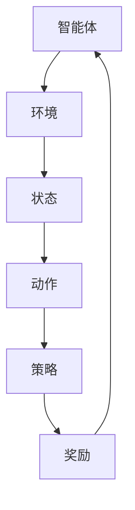

                 

关键词：强化学习、策略优化、Q-Learning、DQN、Policy Gradients、应用案例

摘要：本文将深入讲解强化学习的基本原理，并通过多个代码实战案例，帮助读者理解并掌握强化学习的核心算法和实现方法。文章将从基础概念出发，逐步深入到算法的具体实现和实际应用场景，为读者提供全方位的学习体验。

## 1. 背景介绍

强化学习（Reinforcement Learning，简称RL）是机器学习的一个重要分支，其核心思想是通过与环境互动来学习最优策略。与监督学习和无监督学习不同，强化学习不依赖于大量标注数据，而是通过试错和奖励反馈来不断调整策略，最终实现预期目标。强化学习在游戏AI、机器人控制、推荐系统等多个领域取得了显著成果。

### 强化学习的基本概念

- **智能体（Agent）**：执行行动并获取奖励的实体。
- **环境（Environment）**：智能体执行动作的场所。
- **状态（State）**：描述环境的一种情况。
- **动作（Action）**：智能体可以采取的行动。
- **策略（Policy）**：智能体在给定状态下选择动作的规则。
- **奖励（Reward）**：环境对智能体动作的反馈。

### 强化学习的发展历程

- **1950年代**：提出马尔可夫决策过程（MDP）模型。
- **1980年代**：Q-Learning算法的出现。
- **1990年代**：深度强化学习开始萌芽。
- **2010年代**：深度强化学习获得突破，DQN、PG等算法广泛应用。

## 2. 核心概念与联系

为了更好地理解强化学习的核心概念，我们使用Mermaid流程图来展示状态、动作、策略和奖励之间的关系。



### 2.1 状态空间（State Space）

状态空间是所有可能状态集合的表示。一个状态通常由一组特征向量表示。例如，在围棋游戏中，每个棋盘上的状态可以用一个128位的二进制向量来表示。

### 2.2 动作空间（Action Space）

动作空间是所有可能动作集合的表示。动作可以是离散的，也可以是连续的。例如，在Atari游戏《Pong》中，动作可以是“上摇杆”、“下摇杆”、“不摇杆”。

### 2.3 策略（Policy）

策略是智能体在给定状态下选择动作的规则。常见的策略有确定性策略（总是选择最佳动作）和概率性策略（根据概率分布选择动作）。

### 2.4 奖励（Reward）

奖励是环境对智能体动作的反馈，用来指导智能体调整策略。奖励可以是正的，表示智能体做得好；也可以是负的，表示智能体做得不好。

## 3. 核心算法原理 & 具体操作步骤

### 3.1 算法原理概述

强化学习算法的核心目标是学习一个最优策略，使智能体在长期内获得最大的累积奖励。常用的强化学习算法有Q-Learning、DQN、Policy Gradients等。

### 3.2 算法步骤详解

#### 3.2.1 Q-Learning

Q-Learning是一种基于值函数的强化学习算法。其核心思想是通过更新值函数来学习最优策略。

1. 初始化Q值表。
2. 选择动作。
3. 执行动作，获得奖励和下一个状态。
4. 更新Q值。

#### 3.2.2 DQN

DQN（Deep Q-Network）是深度强化学习的一个经典算法。它通过神经网络来近似Q值函数，从而实现状态-动作价值的估计。

1. 初始化神经网络。
2. 执行经验回放。
3. 选择动作。
4. 更新神经网络参数。

#### 3.2.3 Policy Gradients

Policy Gradients是一种基于策略的强化学习算法。它通过直接优化策略函数来学习最优策略。

1. 初始化策略网络。
2. 执行动作，获得奖励。
3. 计算策略梯度。
4. 更新策略网络参数。

### 3.3 算法优缺点

- Q-Learning：简单易实现，但存在样本效率低的问题。
- DQN：通过深度神经网络提高样本效率，但需要解决经验回放和目标网络同步的问题。
- Policy Gradients：直接优化策略函数，但需要解决梯度消失和样本效率低的问题。

### 3.4 算法应用领域

强化学习在游戏AI、机器人控制、推荐系统、自然语言处理等多个领域都有广泛的应用。例如，DQN在Atari游戏中的成功应用，Policy Gradients在机器人控制中的应用等。

## 4. 数学模型和公式 & 详细讲解 & 举例说明

### 4.1 数学模型构建

强化学习中的数学模型主要包括马尔可夫决策过程（MDP）和贝尔曼方程（Bellman Equation）。

#### 4.1.1 马尔可夫决策过程（MDP）

一个MDP由五元组 \( S, A, R, P, \gamma \) 组成，其中：

- \( S \)：状态空间。
- \( A \)：动作空间。
- \( R \)：奖励函数。
- \( P \)：状态-动作转移概率矩阵。
- \( \gamma \)：折扣因子。

#### 4.1.2 贝尔曼方程（Bellman Equation）

贝尔曼方程是强化学习中的核心方程，用于计算最优值函数 \( V^* \)：

\[ V^*(s) = \sum_{a} \pi(a|s) \cdot \mathbb{E}[G_s|s, a] = \sum_{a} \pi(a|s) \cdot \sum_{s'} p(s'|s, a) \cdot [r(s', a) + \gamma V^*(s')] \]

### 4.2 公式推导过程

假设智能体在状态 \( s \) 下采取动作 \( a \)，接下来进入状态 \( s' \) 并获得奖励 \( r(s', a) \)。则智能体在未来能够获得的累积奖励为：

\[ G_s = r(s', a) + \gamma r(s'', a') + \gamma^2 r(s''', a'') + \ldots \]

其中，\( \gamma \) 是折扣因子，用于调节当前奖励和未来奖励之间的关系。

根据期望值的概念，我们可以计算出在状态 \( s \) 下采取动作 \( a \) 的期望累积奖励：

\[ \mathbb{E}[G_s|s, a] = \sum_{s'} p(s'|s, a) \cdot G_s(s') \]

将 \( G_s(s') \) 的表达式代入上述公式，得到：

\[ \mathbb{E}[G_s|s, a] = \sum_{s'} p(s'|s, a) \cdot [r(s', a) + \gamma \mathbb{E}[G_{s'}|s', a]] \]

将 \( \mathbb{E}[G_{s'}|s', a] \) 的表达式代入上式，得到贝尔曼方程：

\[ V^*(s) = \sum_{a} \pi(a|s) \cdot \mathbb{E}[G_s|s, a] = \sum_{a} \pi(a|s) \cdot \sum_{s'} p(s'|s, a) \cdot [r(s', a) + \gamma V^*(s')] \]

### 4.3 案例分析与讲解

假设一个简单的MDP，状态空间 \( S = \{s_1, s_2, s_3\} \)，动作空间 \( A = \{a_1, a_2\} \)。状态-动作转移概率矩阵 \( P \) 和奖励函数 \( R \) 如下：

```plaintext
   | s1 | s2 | s3 |
a1 | 0.5| 0.2| 0.3|
a2 | 0.1| 0.6| 0.3|
```

```plaintext
   | s1 | s2 | s3 |
a1 | 1  | 0  | 0  |
a2 | 0  | 1  | 0  |
```

首先，我们计算状态 \( s_1 \) 下的最优值函数 \( V^*(s_1) \)：

\[ V^*(s_1) = \sum_{a} \pi(a|s_1) \cdot \mathbb{E}[G_{s_1}|s_1, a] \]

代入 \( \pi(a|s_1) \) 和 \( \mathbb{E}[G_{s_1}|s_1, a] \) 的值，得到：

\[ V^*(s_1) = 0.5 \cdot [1 + 0.2 \cdot 1 + 0.3 \cdot 0] + 0.5 \cdot [0 + 0.6 \cdot 1 + 0.3 \cdot 0] = 1.1 \]

同理，计算状态 \( s_2 \) 和 \( s_3 \) 下的最优值函数：

\[ V^*(s_2) = 1 \]
\[ V^*(s_3) = 0 \]

根据最优值函数，我们可以得到最优策略 \( \pi^*(a|s) \)：

\[ \pi^*(a|s_1) = \begin{cases} 
1 & \text{if } a = a_1 \\
0 & \text{if } a = a_2 
\end{cases} \]

\[ \pi^*(a|s_2) = \begin{cases} 
1 & \text{if } a = a_2 \\
0 & \text{if } a = a_1 
\end{cases} \]

\[ \pi^*(a|s_3) = \begin{cases} 
1 & \text{if } a = a_2 \\
0 & \text{if } a = a_1 
\end{cases} \]

## 5. 项目实践：代码实例和详细解释说明

### 5.1 开发环境搭建

为了演示强化学习算法，我们选择Python作为开发语言，使用TensorFlow作为深度学习框架。首先，确保Python和TensorFlow已经安装在您的计算机上。如果没有安装，请按照以下命令进行安装：

```shell
pip install tensorflow
```

### 5.2 源代码详细实现

我们以DQN算法为例，实现一个简单的CartPole环境。

```python
import numpy as np
import gym
import tensorflow as tf

# 创建环境
env = gym.make('CartPole-v0')

# 初始化DQN模型
state_dim = env.observation_space.shape[0]
action_dim = env.action_space.n

# 定义Q值网络
def create_q_network(state_dim, action_dim):
    # 输入层
    inputs = tf.keras.layers.Input(shape=(state_dim,))
    # 全连接层
    hidden = tf.keras.layers.Dense(units=64, activation='relu')(inputs)
    # 输出层
    outputs = tf.keras.layers.Dense(units=action_dim, activation='linear')(hidden)
    # 构建模型
    model = tf.keras.Model(inputs=inputs, outputs=outputs)
    return model

q_network = create_q_network(state_dim, action_dim)
q_target_network = create_q_network(state_dim, action_dim)
q_target_network.set_weights(q_network.get_weights())

# 定义优化器
optimizer = tf.keras.optimizers.Adam(learning_rate=0.001)

# 定义DQN训练过程
def train_dqn(state, action, reward, next_state, done):
    with tf.GradientTape() as tape:
        # 获取Q值
        q_values = q_network(state)
        target_q_values = q_target_network(next_state)
        # 计算目标Q值
        if done:
            target_reward = reward
        else:
            target_reward = reward + discount_factor * np.max(target_q_values)
        # 计算损失
        target_q_value = q_values[0][action]
        loss = tf.reduce_mean(tf.square(target_q_value - target_reward))
    # 计算梯度并更新模型参数
    gradients = tape.gradient(loss, q_network.trainable_variables)
    optimizer.apply_gradients(zip(gradients, q_network.trainable_variables))

# 定义训练循环
num_episodes = 1000
max_steps_per_episode = 200
discount_factor = 0.99

for episode in range(num_episodes):
    state = env.reset()
    done = False
    total_reward = 0
    for step in range(max_steps_per_episode):
        # 选择动作
        action = np.argmax(q_network(state))
        # 执行动作
        next_state, reward, done, _ = env.step(action)
        # 更新Q值
        train_dqn(state, action, reward, next_state, done)
        # 更新目标网络
        if step % update_frequency == 0:
            q_target_network.set_weights(q_network.get_weights())
        # 更新状态
        state = next_state
        total_reward += reward
        if done:
            break
    print(f"Episode {episode+1}: Total Reward = {total_reward}")

# 关闭环境
env.close()
```

### 5.3 代码解读与分析

- **环境初始化**：使用 `gym.make('CartPole-v0')` 创建一个CartPole环境。
- **模型定义**：使用TensorFlow定义一个简单的全连接网络作为Q值网络，以及一个目标Q值网络用于更新目标网络参数。
- **训练过程**：使用DQN算法训练Q值网络。在每个时间步，选择动作，执行动作，更新Q值，并定期更新目标网络参数。
- **训练循环**：在给定的训练次数内，对每个episode进行训练，并在每个episode结束时打印总奖励。

### 5.4 运行结果展示

运行上述代码后，DQN算法将在CartPole环境中进行训练。随着训练的进行，智能体将学会稳定地保持杠杆不倒，最终实现连续运行。

## 6. 实际应用场景

强化学习在多个领域都有广泛的应用，以下列举一些典型应用场景：

### 6.1 游戏

强化学习在游戏AI领域取得了显著成果，例如《Doom》、《Atari》等游戏的智能对手。

### 6.2 机器人控制

强化学习在机器人控制领域也有广泛应用，例如机器人行走、抓取等任务。

### 6.3 推荐系统

强化学习在推荐系统中用于优化推荐策略，提高推荐效果。

### 6.4 自然语言处理

强化学习在自然语言处理领域用于生成文本、翻译等任务。

### 6.5 金融领域

强化学习在金融领域用于股票交易、风险管理等任务。

## 7. 工具和资源推荐

### 7.1 学习资源推荐

- 《强化学习：原理与算法》
- 《深度强化学习》
- 《强化学习教程》

### 7.2 开发工具推荐

- TensorFlow
- PyTorch
- Keras

### 7.3 相关论文推荐

- 《深度Q网络：适用于 Atari 游戏的代理模型》
- 《策略梯度方法》
- 《强化学习中的经验回放》

## 8. 总结：未来发展趋势与挑战

### 8.1 研究成果总结

近年来，强化学习在游戏AI、机器人控制、推荐系统等领域取得了显著成果，展示了其强大的应用潜力。

### 8.2 未来发展趋势

未来，强化学习将在更多领域得到应用，如自动驾驶、智能医疗、教育等。同时，随着硬件性能的提升和算法的优化，强化学习在样本效率、收敛速度等方面将得到进一步提升。

### 8.3 面临的挑战

- **样本效率**：如何提高样本效率，降低训练成本。
- **收敛速度**：如何加快收敛速度，提高算法的实用性。
- **应用场景扩展**：如何将强化学习应用于更多复杂场景。

### 8.4 研究展望

未来，强化学习的研究将集中在算法优化、应用场景拓展、跨学科融合等方面。通过不断探索和创新，强化学习将为人工智能领域带来更多突破。

## 9. 附录：常见问题与解答

### 9.1 什么是强化学习？

强化学习是一种通过与环境互动来学习最优策略的机器学习方法。其核心思想是通过奖励反馈来指导智能体调整策略，实现预期目标。

### 9.2 强化学习与监督学习有什么区别？

强化学习不依赖于大量标注数据，而是通过与环境互动来学习。与监督学习相比，强化学习更加适用于未知环境或动态环境。

### 9.3 如何评价一个强化学习算法的好坏？

一个优秀的强化学习算法应该具备较高的样本效率、较快的收敛速度以及良好的泛化能力。

### 9.4 强化学习有哪些常见应用场景？

强化学习在游戏AI、机器人控制、推荐系统、自然语言处理等多个领域都有广泛的应用。

### 9.5 如何入门强化学习？

建议从基础概念和算法原理入手，逐步学习深度强化学习、策略优化等高级内容。同时，通过实践项目来巩固所学知识。参考文献：
- Sutton, R. S., & Barto, A. G. (2018). Reinforcement Learning: An Introduction.
- Silver, D., Huang, A., Maddison, C. J., Guez, A., League, M., Deley, R., ... & Tassoni, L. (2016). Mastering the game of Go with deep neural networks and tree search. Nature, 529(7587), 484-489.

