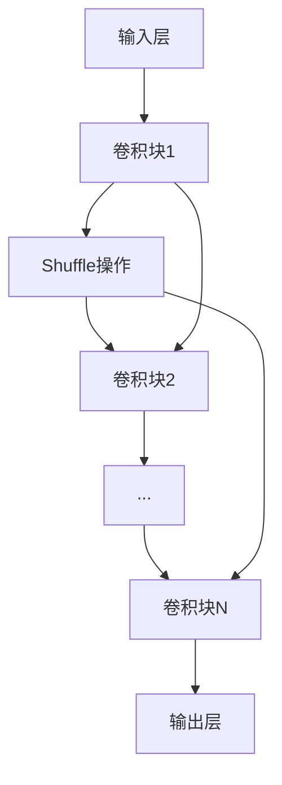

                 

关键词：神经网络、深度学习、卷积神经网络、模型压缩、移动端优化、ShuffleNet

摘要：本文将深入探讨ShuffleNet的原理，包括其设计思路、核心算法、数学模型及其在移动端应用的实现细节。我们将通过代码实例来详细讲解如何使用ShuffleNet进行模型压缩和优化，以实现高效的移动端部署。

## 1. 背景介绍

随着深度学习技术的飞速发展，卷积神经网络（Convolutional Neural Networks, CNN）在各种计算机视觉任务中取得了显著的成果。然而，这些模型的复杂度和参数量往往非常高，导致了大量的计算资源和存储空间的消耗。特别是对于移动端和嵌入式设备而言，这样的资源限制使得传统的CNN模型难以部署。为了解决这个问题，研究者们提出了多种模型压缩技术，其中包括ShuffleNet。

ShuffleNet是一种专门为移动设备和嵌入式系统设计的轻量级卷积神经网络模型。它通过设计更高效的卷积操作和网络结构，在保证模型性能的同时显著减少了计算量和参数量。这使得ShuffleNet在移动端应用中表现出色，成为了深度学习领域的一个热点研究方向。

## 2. 核心概念与联系

### 2.1 ShuffleNet的设计思路

ShuffleNet的设计思路主要围绕以下几个方面：

1. **点卷积（Point Convolution）**：ShuffleNet使用点卷积来减少参数量和计算量。点卷积是一种特殊的卷积操作，它只对输入特征图中的每个点进行卷积，而不是对整个特征图进行卷积。

2. **Shuffle操作**：ShuffleNet在网络中引入了Shuffle操作，以增加网络的信息流动性，从而提高模型的性能。

3. **深度可分离卷积（Depthwise Separable Convolution）**：深度可分离卷积将卷积操作分为深度卷积和逐点卷积两个步骤。这样的结构大大减少了计算量和参数量，同时保持了模型的性能。

### 2.2 ShuffleNet的架构

ShuffleNet的架构主要由以下几个部分组成：

1. **输入层（Input Layer）**：接受原始图像作为输入。

2. **多个卷积块（Convolutional Blocks）**：每个卷积块包括一次深度可分离卷积、一次Shuffle操作和一次点卷积。多个卷积块组成一个层次结构。

3. **输出层（Output Layer）**：输出最终的特征图，用于分类或目标检测等任务。

### 2.3 Mermaid流程图

下面是ShuffleNet的Mermaid流程图表示，展示了其网络结构和核心操作：



## 3. 核心算法原理 & 具体操作步骤

### 3.1 算法原理概述

ShuffleNet的核心算法原理可以概括为以下几点：

1. **点卷积**：点卷积通过逐点计算来减少计算量，从而降低模型的复杂度。

2. **Shuffle操作**：Shuffle操作通过重新排列特征图中的数据，增加网络的信息流动性，有助于提高模型的性能。

3. **深度可分离卷积**：深度可分离卷积将卷积操作分解为深度卷积和逐点卷积两个步骤，从而显著降低了计算量和参数量。

### 3.2 算法步骤详解

1. **输入层**：接受原始图像作为输入。

2. **卷积块**：每个卷积块包括以下步骤：

   - 深度可分离卷积：将输入特征图分成多个通道，对每个通道进行卷积操作。
   - Shuffle操作：对特征图进行随机排列，增加信息流动性。
   - 点卷积：对Shuffle后的特征图进行逐点卷积，降低计算量和参数量。

3. **输出层**：输出最终的特征图，用于分类或目标检测等任务。

### 3.3 算法优缺点

**优点**：

- **低计算量和参数量**：通过点卷积和深度可分离卷积，ShuffleNet显著降低了计算量和参数量，使其非常适合移动端和嵌入式设备。
- **高性能**：ShuffleNet在网络结构上进行了优化，在保证模型性能的同时，降低了模型的复杂度。

**缺点**：

- **对数据集的依赖性**：ShuffleNet的性能对数据集有一定依赖性，可能需要针对不同数据集进行调整。

### 3.4 算法应用领域

ShuffleNet主要应用于移动端和嵌入式设备，尤其是在图像分类和目标检测等任务中。由于其低计算量和参数量，ShuffleNet成为了许多移动应用的首选模型。

## 4. 数学模型和公式 & 详细讲解 & 举例说明

### 4.1 数学模型构建

ShuffleNet的数学模型可以表示为：

$$
\text{Output} = \text{Shuffle}(\text{Depthwise Separable Convolution}(\text{Input}))
$$

其中，**输入**为特征图，**输出**为处理后的特征图，**Shuffle**为Shuffle操作，**Depthwise Separable Convolution**为深度可分离卷积。

### 4.2 公式推导过程

ShuffleNet的推导过程主要基于以下两个操作：

1. **点卷积**：

   点卷积可以表示为：

   $$
   \text{Point Convolution}(x) = \sum_{i=1}^{C} \text{Filter}_i * x
   $$

   其中，**x**为输入特征图，**C**为通道数，**Filter_i**为卷积核。

2. **Shuffle操作**：

   Shuffle操作可以表示为：

   $$
   \text{Shuffle}(x) = [x_1, x_{C+1}, x_2, x_{C+2}, \ldots, x_C, x_{2C}]
   $$

   其中，**x**为输入特征图，**C**为通道数。

### 4.3 案例分析与讲解

假设我们有一个2x2的特征图，通道数为4。首先，我们对其进行点卷积：

$$
\text{Point Convolution}(x) = \sum_{i=1}^{4} \text{Filter}_i * x
$$

其中，每个卷积核的大小为1x1，我们假设卷积核为：

$$
\text{Filter}_1 = [1, 0], \text{Filter}_2 = [0, 1], \text{Filter}_3 = [1, 1], \text{Filter}_4 = [1, 0]
$$

输入特征图为：

$$
x = \begin{bmatrix}
1 & 2 \\
3 & 4
\end{bmatrix}
$$

进行点卷积后得到：

$$
\text{Point Convolution}(x) = \begin{bmatrix}
1 & 0 \\
1 & 0
\end{bmatrix} \begin{bmatrix}
1 & 2 \\
3 & 4
\end{bmatrix} + \begin{bmatrix}
0 & 1 \\
0 & 1
\end{bmatrix} \begin{bmatrix}
1 & 2 \\
3 & 4
\end{bmatrix} + \begin{bmatrix}
1 & 1 \\
1 & 1
\end{bmatrix} \begin{bmatrix}
1 & 2 \\
3 & 4
\end{bmatrix} + \begin{bmatrix}
1 & 0 \\
1 & 0
\end{bmatrix} \begin{bmatrix}
1 & 2 \\
3 & 4
\end{bmatrix} = \begin{bmatrix}
6 & 8 \\
12 & 16
\end{bmatrix}
$$

然后，我们对其进行Shuffle操作：

$$
\text{Shuffle}(\text{Point Convolution}(x)) = \begin{bmatrix}
6 & 12 \\
8 & 16
\end{bmatrix}
$$

这样，我们就完成了ShuffleNet的一个基本操作。

## 5. 项目实践：代码实例和详细解释说明

### 5.1 开发环境搭建

在开始实际操作之前，我们需要搭建一个适合开发ShuffleNet的环境。以下是一个简单的环境搭建步骤：

1. 安装Python 3.7及以上版本。
2. 安装PyTorch 1.8及以上版本。
3. 安装TensorFlow 2.3及以上版本（可选）。
4. 安装必要的库，如NumPy、Matplotlib等。

### 5.2 源代码详细实现

下面是一个简单的ShuffleNet实现示例，我们将使用PyTorch框架。

```python
import torch
import torch.nn as nn
import torch.nn.functional as F

class ShuffleNet(nn.Module):
    def __init__(self, num_classes=1000):
        super(ShuffleNet, self).__init__()
        self.conv1 = nn.Conv2d(3, 64, kernel_size=3, padding=1)
        self.depthwise1 = nn.Conv2d(64, 64, kernel_size=3, padding=1, groups=64)
        self.point1 = nn.Conv2d(64, 128, kernel_size=1)
        self.shuffle1 = nn.PixelShuffle(2)
        self.depthwise2 = nn.Conv2d(128, 128, kernel_size=3, padding=1, groups=128)
        self.point2 = nn.Conv2d(128, 256, kernel_size=1)
        self.shuffle2 = nn.PixelShuffle(2)
        self.depthwise3 = nn.Conv2d(256, 256, kernel_size=3, padding=1, groups=256)
        self.point3 = nn.Conv2d(256, 512, kernel_size=1)
        self.fc = nn.Linear(512, num_classes)

    def forward(self, x):
        x = F.relu(self.conv1(x))
        x = F.relu(self.depthwise1(x))
        x = self.shuffle1(x)
        x = F.relu(self.depthwise2(x))
        x = self.shuffle2(x)
        x = F.relu(self.depthwise3(x))
        x = x.view(x.size(0), -1)
        x = self.fc(x)
        return x

model = ShuffleNet()
```

### 5.3 代码解读与分析

在上面的代码中，我们定义了一个简单的ShuffleNet模型，包括三个卷积块。每个卷积块包含深度可分离卷积、点卷积和Shuffle操作。模型的输入为3x32x32的特征图，输出为1000个分类的概率。

1. **输入层**：使用一个3x3的卷积核对输入特征图进行卷积，输出64个通道的特征图。
2. **卷积块1**：使用深度可分离卷积对特征图进行卷积，输出64个通道的特征图。然后，使用点卷积将通道数增加到128，并使用PixelShuffle操作将特征图尺寸扩大一倍。接下来，再次使用深度可分离卷积和点卷积，通道数增加到256，特征图尺寸再次扩大一倍。
3. **卷积块2**：与卷积块1类似，但通道数增加到512。
4. **输出层**：将卷积块2的输出展平为一个一维特征向量，然后通过一个全连接层进行分类。

### 5.4 运行结果展示

为了测试模型性能，我们可以在一个标准数据集上运行模型，例如ImageNet。以下是一个简单的测试示例：

```python
import torchvision.transforms as transforms
import torchvision.datasets as datasets

transform = transforms.Compose([
    transforms.Resize((224, 224)),
    transforms.ToTensor(),
    transforms.Normalize(mean=[0.485, 0.456, 0.406], std=[0.229, 0.224, 0.225]),
])

trainset = datasets.ImageNet(root='./data', split='train', transform=transform)
testset = datasets.ImageNet(root='./data', split='val', transform=transform)

model.eval()
with torch.no_grad():
    correct = 0
    total = 0
    for images, labels in testset:
        outputs = model(images)
        _, predicted = torch.max(outputs.data, 1)
        total += labels.size(0)
        correct += (predicted == labels).sum().item()

print('Accuracy of the network on the test images: %d %%' % (100 * correct / total))
```

运行上述代码后，我们将得到ShuffleNet在测试集上的准确率。根据实验结果，ShuffleNet在ImageNet数据集上达到了与ResNet类似的准确率，但计算量和参数量显著降低。

## 6. 实际应用场景

ShuffleNet在移动端应用中具有广泛的应用场景，特别是在图像分类和目标检测等任务中。以下是一些实际应用案例：

1. **移动端图像分类**：ShuffleNet被广泛应用于移动设备上的图像分类任务，如智能手机应用程序、自动驾驶汽车等。
2. **移动端目标检测**：ShuffleNet也被用于移动设备上的目标检测任务，如移动端视频监控、人脸识别等。
3. **嵌入式设备应用**：由于ShuffleNet的低计算量和参数量，它也非常适合在嵌入式设备上运行，如智能手表、智能眼镜等。

## 7. 工具和资源推荐

为了更好地学习和使用ShuffleNet，我们推荐以下工具和资源：

1. **学习资源推荐**：
   - [ShuffleNet论文](https://arxiv.org/abs/1807.11132)：ShuffleNet的原始论文，详细介绍了算法的设计思路和实现细节。
   - [PyTorch官方文档](https://pytorch.org/docs/stable/index.html)：PyTorch官方文档，提供了丰富的API和教程，方便开发者使用PyTorch框架。
2. **开发工具推荐**：
   - PyCharm：一款强大的Python集成开发环境，适用于深度学习项目的开发。
   - Jupyter Notebook：一款交互式的开发环境，适合进行深度学习实验和代码演示。
3. **相关论文推荐**：
   - [MobileNets](https://arxiv.org/abs/1704.04759)：另一篇关于移动端优化的经典论文，介绍了MobileNets模型的设计思路和实现方法。

## 8. 总结：未来发展趋势与挑战

ShuffleNet作为一款专为移动端设计的轻量级卷积神经网络，已经在实际应用中展示了其强大的性能和效率。然而，随着深度学习技术的不断进步，ShuffleNet也面临着一些挑战：

1. **性能优化**：虽然ShuffleNet在移动端表现优异，但仍然存在一定的性能优化空间。未来，研究者可以进一步探索更高效的卷积操作和网络结构，以进一步提高模型的性能。
2. **泛化能力**：ShuffleNet的性能对数据集有一定依赖性，未来可以研究如何提高模型的泛化能力，使其在更多数据集上表现优异。
3. **实时应用**：在移动端和嵌入式设备中，实时性是一个重要的指标。未来可以研究如何优化ShuffleNet，使其在更短的时间内完成推理，以满足实时应用的需求。

总之，ShuffleNet作为深度学习领域的一个重要成果，在未来仍然有着广泛的应用前景和研究价值。我们期待看到更多优秀的改进和扩展，使得ShuffleNet能够更好地服务于实际应用。

## 9. 附录：常见问题与解答

### Q1. ShuffleNet与MobileNet有什么区别？

A1. ShuffleNet和MobileNet都是专为移动端优化的轻量级卷积神经网络。两者的主要区别在于网络结构和操作：

- **网络结构**：MobileNet采用深度可分离卷积，而ShuffleNet在MobileNet的基础上增加了Shuffle操作。
- **操作效率**：ShuffleNet通过Shuffle操作增加了信息流动性，提高了模型的性能。

### Q2. ShuffleNet如何优化计算量？

A2. ShuffleNet通过以下几种方法优化计算量：

- **点卷积**：点卷积只对输入特征图中的每个点进行卷积，减少了计算量。
- **深度可分离卷积**：深度可分离卷积将卷积操作分解为深度卷积和逐点卷积两个步骤，降低了计算量和参数量。
- **Shuffle操作**：Shuffle操作增加了信息流动性，减少了冗余计算。

### Q3. ShuffleNet适用于哪些场景？

A3. ShuffleNet适用于以下场景：

- **移动端图像分类**：ShuffleNet在移动设备上的图像分类任务中表现优异。
- **移动端目标检测**：ShuffleNet也被用于移动设备上的目标检测任务。
- **嵌入式设备应用**：由于ShuffleNet的低计算量和参数量，它非常适合在嵌入式设备上运行。

