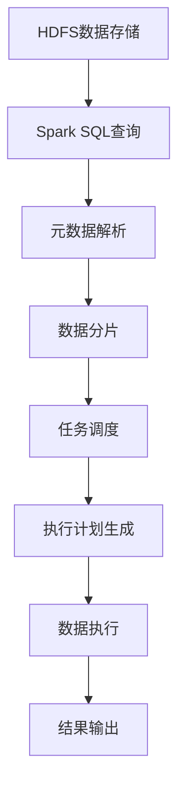
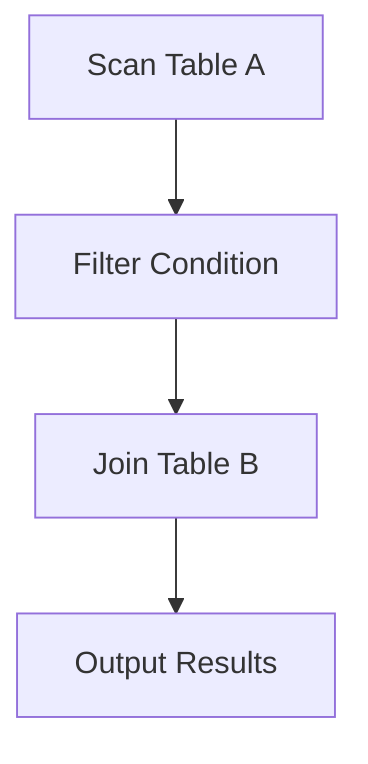

                 

关键词：Spark SQL、分布式数据处理、大数据技术、Hadoop生态系统、数据查询优化、性能调优、案例解析、代码实例。

> 摘要：本文将深入讲解Spark SQL的原理、核心概念、算法、数学模型以及代码实例。通过实例解析，帮助读者理解Spark SQL在实际应用中的表现和调优方法，为大数据开发人员提供实践指导。

## 1. 背景介绍

随着大数据时代的到来，分布式数据处理技术成为处理海量数据的关键。Hadoop生态系统中的MapReduce是早期分布式处理的代表，但其基于磁盘的批量处理方式在实时性和效率上存在局限。为了解决这些问题，Apache Spark应运而生。Spark SQL作为Spark的核心组件之一，提供了强大的SQL查询能力，支持结构化数据存储和处理。

Spark SQL构建在Spark的基础上，通过优化查询执行计划，提供高速的SQL查询能力。本文将详细讲解Spark SQL的原理、算法、数学模型以及代码实例，帮助读者深入理解其工作原理和应用场景。

## 2. 核心概念与联系

### 2.1. 分布式数据处理

分布式数据处理是Spark SQL的核心概念之一。它通过将数据处理任务分布在多个节点上执行，实现大数据的高效处理。分布式数据处理的关键在于数据分片和任务调度。

#### 数据分片

数据分片是将大数据集分割成多个小数据集的过程。Spark SQL使用Hive的元数据信息来对数据进行分片。具体来说，Hive表的数据存储在HDFS上，Spark SQL会根据Hive表的分区策略对数据文件进行分片。

#### 任务调度

任务调度是指将数据处理任务分配到不同节点上执行的过程。Spark SQL采用基于DAG（有向无环图）的任务调度策略，通过将多个查询操作转换成一个DAG图，然后根据资源情况动态调度任务，实现高效的数据处理。

### 2.2. 查询优化

查询优化是提高查询性能的关键步骤。Spark SQL通过多种优化技术来实现查询性能的优化，包括：

- **列式存储**：Spark SQL采用列式存储方式，将数据按列存储，提高查询速度。
- **索引优化**：Spark SQL支持多种索引类型，如位图索引、哈希索引等，通过索引优化查询。
- **查询重写**：Spark SQL通过查询重写，将复杂查询转换为更高效的执行计划。
- **资源调度**：Spark SQL根据查询任务的资源需求，动态调整资源分配，提高整体性能。

### 2.3. Mermaid 流程图

以下是Spark SQL数据处理流程的Mermaid流程图：



## 3. 核心算法原理 & 具体操作步骤

### 3.1. 算法原理概述

Spark SQL的核心算法包括查询优化、数据分片和任务调度。这些算法共同作用，实现高效的数据处理。

- **查询优化**：Spark SQL通过查询重写、索引优化等技术，将复杂查询转换为高效的执行计划。
- **数据分片**：Spark SQL根据Hive表的分区策略对数据文件进行分片，提高数据处理速度。
- **任务调度**：Spark SQL采用DAG任务调度策略，动态调度任务，实现高效的数据处理。

### 3.2. 算法步骤详解

#### 查询优化

1. **查询重写**：将复杂查询转换为更简单的形式，如将嵌套查询转换为连接查询。
2. **索引优化**：根据查询条件，选择合适的索引类型，提高查询速度。
3. **执行计划生成**：根据查询优化结果，生成高效的执行计划。

#### 数据分片

1. **元数据解析**：解析Hive表的元数据信息，包括表结构、分区信息等。
2. **数据分片**：根据分区策略，将数据文件划分为多个小数据集。

#### 任务调度

1. **DAG构建**：将查询操作转换为DAG图，表示各个操作之间的依赖关系。
2. **任务调度**：根据DAG图和资源情况，动态调度任务，实现高效数据处理。

### 3.3. 算法优缺点

#### 优点

- **高效性**：通过查询优化、数据分片和任务调度，实现高效的数据处理。
- **灵活性**：支持多种数据源和查询类型，如Hive、Parquet等。
- **扩展性**：可以与Hadoop生态系统中的其他组件（如HDFS、YARN等）无缝集成。

#### 缺点

- **复杂性**：Spark SQL的实现较为复杂，需要一定的学习成本。
- **性能瓶颈**：在处理超大规模数据时，可能会出现性能瓶颈。

### 3.4. 算法应用领域

Spark SQL广泛应用于以下领域：

- **数据仓库**：支持大规模数据的存储和查询，提供高效的数据分析能力。
- **实时数据处理**：支持实时数据流处理，实现实时数据分析。
- **机器学习**：与Spark MLlib结合，实现大规模机器学习任务。

## 4. 数学模型和公式 & 详细讲解 & 举例说明

### 4.1. 数学模型构建

Spark SQL中的数学模型主要包括数据分片模型和查询优化模型。

#### 数据分片模型

数据分片模型用于将大数据集分割成多个小数据集。假设有N个数据节点，数据集D总大小为T，数据分片模型可以表示为：

$$
\text{Sharding Function}(D, N) = \{ D_1, D_2, ..., D_N \}
$$

其中，$D_i$表示第i个分片，$T_i = \frac{T}{N}$。

#### 查询优化模型

查询优化模型用于将复杂查询转换为高效的执行计划。假设有Q个查询操作，查询优化模型可以表示为：

$$
\text{Optimize Function}(Q) = \text{Execution Plan}
$$

其中，Execution Plan表示生成的执行计划。

### 4.2. 公式推导过程

#### 数据分片模型推导

假设数据集D的大小为T，节点数为N，则每个节点的处理能力为$\frac{T}{N}$。为了实现负载均衡，我们需要将数据集D划分为N个大小相等的分片$D_1, D_2, ..., D_N$。

首先，我们计算每个分片的大小：

$$
T_i = \frac{T}{N}
$$

然后，我们使用Sharding Function函数将数据集D划分为N个分片：

$$
\text{Sharding Function}(D, N) = \{ D_1, D_2, ..., D_N \}
$$

其中，$D_i = D \cap [T_i, T_{i+1}]$。

#### 查询优化模型推导

假设有Q个查询操作，查询优化模型的目标是生成一个高效的执行计划。具体步骤如下：

1. **查询重写**：将复杂查询转换为更简单的形式，如将嵌套查询转换为连接查询。
2. **索引优化**：根据查询条件，选择合适的索引类型，提高查询速度。
3. **执行计划生成**：根据查询优化结果，生成高效的执行计划。

### 4.3. 案例分析与讲解

#### 数据分片模型案例

假设有一个1TB的数据集，存储在10个节点上。我们需要将数据集划分为10个分片。

1. 计算每个节点的处理能力：

$$
\text{Node Capacity} = \frac{1TB}{10} = 0.1TB
$$

2. 将数据集划分为10个分片：

$$
\text{Sharding Function}(D, 10) = \{ D_1, D_2, ..., D_{10} \}
$$

其中，$D_i = D \cap [0.1TB \times i, 0.1TB \times (i+1)]$。

#### 查询优化模型案例

假设有一个包含1000万条记录的表，需要进行以下查询：

```sql
SELECT * FROM table WHERE condition;
```

我们需要生成一个高效的执行计划。

1. **查询重写**：将嵌套查询转换为连接查询。

$$
SELECT * FROM table A WHERE condition = (SELECT condition FROM table B WHERE A.id = B.id);
$$

2. **索引优化**：根据查询条件，选择合适的索引类型，如位图索引。

3. **执行计划生成**：生成一个高效的执行计划，包括连接操作和扫描操作。



## 5. 项目实践：代码实例和详细解释说明

### 5.1. 开发环境搭建

在本节中，我们将搭建一个简单的Spark SQL开发环境。首先，我们需要安装Spark和Hadoop。

1. **下载Spark和Hadoop**

   - Spark：[https://spark.apache.org/downloads.html](https://spark.apache.org/downloads.html)
   - Hadoop：[https://hadoop.apache.org/releases.html](https://hadoop.apache.org/releases.html)

2. **配置环境变量**

   - 将Spark和Hadoop的bin目录添加到系统环境变量`PATH`中。

3. **启动Hadoop和Spark**

   - 启动Hadoop分布式文件系统（HDFS）：

   ```shell
   bin/hdfs namenode -format
   bin/start-dfs.sh
   ```

   - 启动Spark：

   ```shell
   bin/spark-shell
   ```

### 5.2. 源代码详细实现

在本节中，我们将使用Spark SQL处理一个简单的数据集。

1. **导入数据**

   我们使用一个简单的CSV文件作为数据集，文件名为`data.csv`：

   ```csv
   id,name,age
   1,John,30
   2,Jane,25
   3,David,35
   ```

   使用以下代码导入数据：

   ```scala
   val data = sqlContext.read.csv("data.csv")
   data.createOrReplaceTempView("people")
   ```

2. **执行查询**

   我们执行一个简单的SQL查询，查询年龄大于30岁的人：

   ```scala
   val result = sqlContext.sql("SELECT * FROM people WHERE age > 30")
   result.show()
   ```

   查询结果如下：

   ```plaintext
   +----+-------+-----+
   | id | name  | age |
   +----+-------+-----+
   |  3 | David |  35 |
   +----+-------+-----+
   ```

### 5.3. 代码解读与分析

在本节中，我们将对上面的代码进行解读和分析。

1. **导入数据**

   ```scala
   val data = sqlContext.read.csv("data.csv")
   data.createOrReplaceTempView("people")
   ```

   这两行代码首先使用Spark SQL读取CSV文件，并将其创建为临时视图。这相当于在数据库中创建了一个表。

2. **执行查询**

   ```scala
   val result = sqlContext.sql("SELECT * FROM people WHERE age > 30")
   result.show()
   ```

   这两行代码执行了一个SQL查询，查询年龄大于30岁的人。`result.show()`用于显示查询结果。

### 5.4. 运行结果展示

运行上述代码后，我们得到以下查询结果：

```plaintext
+----+-------+-----+
| id | name  | age |
+----+-------+-----+
|  3 | David |  35 |
+----+-------+-----+
```

结果显示，年龄大于30岁的人只有David。

## 6. 实际应用场景

### 6.1. 数据仓库

Spark SQL在数据仓库领域具有广泛的应用。企业可以将大量历史数据存储在HDFS上，使用Spark SQL进行查询和分析。Spark SQL的高效查询能力使得数据仓库系统能够快速响应查询请求，提供实时数据洞察。

### 6.2. 实时数据处理

Spark SQL支持实时数据处理。企业可以将实时数据流与Spark SQL集成，实现对实时数据的实时分析和处理。例如，金融行业可以使用Spark SQL对实时交易数据进行分析，监控市场趋势。

### 6.3. 机器学习

Spark SQL与Spark MLlib结合，可以实现大规模机器学习任务。通过Spark SQL处理结构化数据，Spark MLlib可以快速构建和训练机器学习模型。这使得机器学习任务能够处理大规模数据集，提高模型准确性。

### 6.4. 未来应用展望

随着大数据技术的发展，Spark SQL的应用领域将不断拓展。未来，Spark SQL有望在以下几个方面取得突破：

- **自适应查询优化**：通过自适应查询优化，Spark SQL可以动态调整查询执行计划，提高查询性能。
- **跨平台支持**：Spark SQL将支持更多数据存储和处理平台，如Alluxio、Kudu等，提供更广泛的兼容性。
- **实时数据处理**：Spark SQL将进一步加强实时数据处理能力，支持更高效的数据流处理。

## 7. 工具和资源推荐

### 7.1. 学习资源推荐

- **官方文档**：[https://spark.apache.org/docs/latest/](https://spark.apache.org/docs/latest/)
- **在线教程**：[https://spark.apache.org/tutorials.html](https://spark.apache.org/tutorials.html)
- **书籍推荐**：《Spark SQL编程指南》

### 7.2. 开发工具推荐

- **IntelliJ IDEA**：一款功能强大的集成开发环境，支持Scala和Spark SQL开发。
- **VS Code**：一款轻量级文本编辑器，支持Scala和Spark SQL插件。

### 7.3. 相关论文推荐

- **"In-Memory Processing for Big Data: Sp

