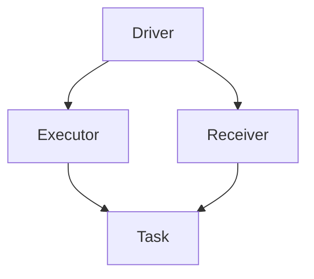
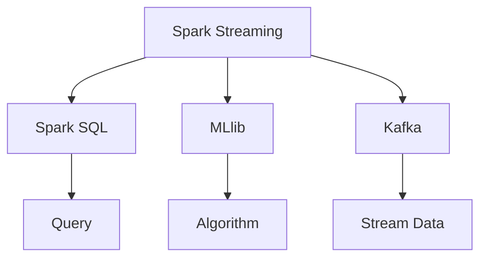
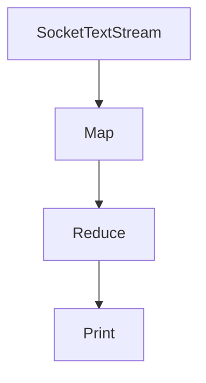

                 

关键词：Spark Streaming,实时计算，流处理框架，大数据，分布式系统，架构设计，代码实例，算法原理，应用场景。

> 摘要：本文将深入探讨Apache Spark Streaming的核心原理，并通过对实际代码实例的详细讲解，帮助读者理解Spark Streaming的应用方法和优势。文章将涵盖从背景介绍到项目实践的全面内容，旨在为希望掌握实时大数据处理的开发者提供有力支持。

## 1. 背景介绍

随着互联网的迅速发展和大数据时代的到来，实时处理大量数据成为企业竞争的关键。传统的批处理系统在处理实时数据时往往存在延迟大、扩展性差等问题。为了应对这些挑战，Apache Spark Streaming应运而生，它作为Spark生态系统的一部分，提供了高效、可靠的实时数据流处理能力。

Spark Streaming基于Spark的核心计算引擎，能够处理多种数据源，如Kafka、Flume和Kinesis等，并将数据流分割成微批（micro-batch）进行计算。这种设计不仅保证了处理效率，还允许灵活地调整批处理窗口大小。

本文旨在通过以下内容，帮助读者全面了解Spark Streaming：

- **核心概念与联系**：介绍Spark Streaming的基础架构及其与其他组件的关系。
- **核心算法原理 & 具体操作步骤**：详细讲解Spark Streaming的核心算法以及如何在实际项目中应用。
- **数学模型和公式 & 详细讲解 & 举例说明**：阐述数据流处理的数学模型，并通过实例展示如何应用这些模型。
- **项目实践：代码实例和详细解释说明**：提供实际代码实例，展示如何使用Spark Streaming处理实时数据流。
- **实际应用场景**：探讨Spark Streaming在不同领域的应用案例。
- **工具和资源推荐**：推荐相关学习资源和开发工具，帮助读者深入学习和实践。
- **总结：未来发展趋势与挑战**：总结研究成果，展望未来的发展方向。

<|assistant|>以下，我们将逐步深入探索Spark Streaming的核心概念、算法原理和具体实现。

## 2. 核心概念与联系

### 2.1 基础架构

Apache Spark Streaming的核心架构包括以下主要组件：

- **DAG（Directed Acyclic Graph）**：数据流处理过程中的计算任务以DAG的形式表示。每个节点代表一个转换操作，如map、reduce或join。
- **Receiver**：负责从外部数据源（如Kafka、Flume等）接收数据流，并将其存储到内存或磁盘。
- **Driver**：负责监控DAG的执行，并在出现错误时进行恢复。
- **Executor**：负责执行具体的计算任务，由Spark调度器分配资源。

### 2.2 核心组件之间的关系

以下是Spark Streaming的组件关系的Mermaid流程图：



- **Driver**：负责生成DAG，并向Executor发送执行指令。
- **Executor**：执行具体的计算任务，如map、reduce等。
- **Receiver**：从外部数据源接收数据，并存储在内存或磁盘。
- **Task**：表示一个具体的计算任务，可以是map、reduce等。

### 2.3 与其他组件的关系

Spark Streaming不仅能够独立运行，还可以与其他组件（如Spark SQL、MLlib等）集成，提供更丰富的数据处理能力。以下是Spark Streaming与其他组件的关系：

- **Spark SQL**：通过Spark SQL，可以将Spark Streaming的结果进行结构化查询和处理。
- **MLlib**：MLlib提供了多种机器学习算法，可以用于分析实时数据流。
- **Spark Streaming + Kafka**：Spark Streaming与Kafka的结合，可以高效处理大量实时数据流。



通过上述核心概念与联系的分析，我们可以更好地理解Spark Streaming的工作原理和优势。接下来，我们将深入探讨Spark Streaming的核心算法原理和具体操作步骤。

## 3. 核心算法原理 & 具体操作步骤

### 3.1 算法原理概述

Spark Streaming的核心算法基于微批处理（micro-batch processing）。数据流被分割成固定大小的批次，每个批次在Executor上执行计算任务。这种设计允许在处理实时数据流的同时，保证计算效率。

以下是Spark Streaming的核心算法原理：

1. **数据流接收**：Spark Streaming通过Receiver组件从外部数据源（如Kafka）接收数据流。
2. **批次划分**：数据流被划分为固定大小的批次，如1秒、2秒等。
3. **任务调度**：Driver生成DAG，并向Executor发送执行指令。
4. **任务执行**：Executor根据DAG执行计算任务，如map、reduce等。
5. **结果输出**：计算结果可以通过各种方式输出，如存储到HDFS、显示在控制台等。

### 3.2 算法步骤详解

#### 3.2.1 数据流接收

首先，Spark Streaming需要配置一个Receiver来从外部数据源接收数据流。以下是一个简单的示例代码：

```scala
val streamingContext = new StreamingContext(sparkSession, Seconds(2))
val lines = streamingContext.socketTextStream("localhost", 9999)
```

这里，我们使用Socket Text Stream接收来自本地主机9999端口的文本数据流。

#### 3.2.2 批次划分

接下来，数据流被划分为固定大小的批次。批次的长度可以通过`StreamingContext`设置：

```scala
val streamingContext = new StreamingContext(sparkSession, Seconds(2))
```

这里，我们设置批次长度为2秒。

#### 3.2.3 任务调度

Driver根据DAG生成执行指令，并将这些指令发送给Executor。以下是一个简单的DAG示例：



这里，我们定义了一个简单的DAG，包括SocketTextStream、Map、Reduce和Print操作。

#### 3.2.4 任务执行

Executor根据接收到的执行指令，在各自的计算节点上执行计算任务。以下是一个简单的Map和Reduce操作：

```scala
val lines = streamingContext.socketTextStream("localhost", 9999)
val words = lines.flatMap(_.split(" "))
val wordCounts = words.map(word => (word, 1)).reduceByKey(_ + _)
wordCounts.print()
```

这里，我们使用flatMap、map和reduceByKey操作处理文本数据流。

#### 3.2.5 结果输出

最后，计算结果可以通过各种方式输出。以下是一个简单的打印输出示例：

```scala
wordCounts.print()
```

这里，我们将计算结果直接打印到控制台。

### 3.3 算法优缺点

#### 3.3.1 优点

- **高效性**：基于Spark的核心计算引擎，Spark Streaming能够高效处理大规模数据流。
- **灵活性**：支持多种数据源和丰富的数据处理操作，如map、reduce、join等。
- **可扩展性**：可以通过增加Executor节点水平扩展计算能力。

#### 3.3.2 缺点

- **内存占用**：由于需要存储微批数据，Spark Streaming在处理大规模数据流时可能需要大量内存。
- **延迟**：与实时数据处理系统相比，Spark Streaming的批处理窗口可能会引入一定的延迟。

### 3.4 算法应用领域

Spark Streaming广泛应用于以下领域：

- **实时数据分析**：如用户行为分析、广告效果监控等。
- **实时流处理**：如股票交易数据处理、物联网数据采集等。
- **实时推荐系统**：如基于用户行为的实时推荐算法。

通过上述对Spark Streaming核心算法原理和具体操作步骤的讲解，我们可以更好地理解如何使用Spark Streaming处理实时数据流。接下来，我们将进一步探讨数据流处理的数学模型和公式，帮助读者更深入地理解Spark Streaming的工作原理。

## 4. 数学模型和公式 & 详细讲解 & 举例说明

### 4.1 数学模型构建

在Spark Streaming中，数据流处理的核心是微批处理（micro-batch processing）。为了更好地理解微批处理，我们需要构建相关的数学模型。

首先，我们定义几个核心变量：

- \( T \)：批次长度（以秒为单位）。
- \( N \)：批次中数据的条数。
- \( \omega(t) \)：在时间\( t \)到达的数据条数。
- \( S(t) \)：在时间\( t \)之前已处理的数据总量。

接下来，我们构建微批处理的数学模型：

#### 4.1.1 数据流模型

数据流可以表示为一条到达时间序列\( T_1, T_2, ..., T_N \)。

#### 4.1.2 批次处理模型

在时间\( t \)时，如果\( t \mod T = 0 \)，则表示一个批次结束，需要执行批处理。批处理的核心公式如下：

\[ S(t) = S(t - T) + \sum_{i=1}^{N} \omega(T \times i) \]

其中，\( \omega(T \times i) \)表示在时间\( T \times i \)到达的数据条数。

### 4.2 公式推导过程

为了更好地理解上述公式，我们需要对批处理过程进行详细推导。

#### 4.2.1 初始状态

假设在时间\( t = 0 \)时，已处理的数据总量为\( S(0) = 0 \)。

#### 4.2.2 批次处理过程

在时间\( t \)时，如果\( t \mod T = 0 \)，则表示一个批次结束，需要执行批处理。我们可以将批处理过程划分为以下几步：

1. **计算当前批次的数据总量**：在时间\( t \)到达的数据条数为\( \omega(t) \)。
2. **更新已处理的数据总量**：将当前批次的数据总量累加到已处理的数据总量中。
3. **计算下一个批次的数据总量**：将当前批次的数据总量分配到下一个批次，并在下一个批次结束时进行累加。

根据上述步骤，我们可以推导出批处理公式：

\[ S(t) = S(t - T) + \omega(t) \]

#### 4.2.3 批次重复

在批处理过程中，如果存在多个批次重叠（即\( t \mod T = 0 \)），则需要对公式进行扩展。假设在时间\( t \)时，存在\( k \)个批次重叠，则公式可以表示为：

\[ S(t) = S(t - T \times k) + \sum_{i=1}^{k} \omega(T \times i) \]

### 4.3 案例分析与讲解

为了更好地理解上述数学模型，我们通过一个实际案例进行讲解。

假设在一个实时数据分析系统中，每2秒处理一个批次，每个批次包含100条数据。在时间\( t = 0 \)时，已处理的数据总量为0。

#### 4.3.1 初始状态

\[ S(0) = 0 \]

#### 4.3.2 第一个批次

在时间\( t = 2 \)时，到达的数据条数为100。

\[ S(2) = S(0) + 100 = 0 + 100 = 100 \]

#### 4.3.3 第二个批次

在时间\( t = 4 \)时，到达的数据条数为100。

\[ S(4) = S(2) + 100 = 100 + 100 = 200 \]

#### 4.3.4 第三个批次

在时间\( t = 6 \)时，到达的数据条数为100。

\[ S(6) = S(4) + 100 = 200 + 100 = 300 \]

#### 4.3.5 批次重叠

在时间\( t = 8 \)时，到达的数据条数为100，存在一个批次重叠。

\[ S(8) = S(6) + 100 = 300 + 100 = 400 \]

通过上述案例，我们可以看到如何使用数学模型和公式计算实时数据流中的已处理数据总量。这个模型和公式为Spark Streaming的批处理算法提供了理论基础。

接下来，我们将通过实际代码实例，进一步展示如何使用Spark Streaming处理实时数据流。

## 5. 项目实践：代码实例和详细解释说明

### 5.1 开发环境搭建

在开始实践之前，我们需要搭建一个合适的开发环境。以下是搭建Spark Streaming开发环境的步骤：

1. **安装Java**：由于Spark是基于Java编写的，我们首先需要安装Java。可以从Oracle官网下载Java 8或更高版本的JDK。
2. **安装Scala**：Spark使用Scala作为其开发语言，因此我们需要安装Scala。可以从Scala官网下载Scala安装包并按照说明进行安装。
3. **安装Spark**：从Apache Spark官网下载Spark安装包，并解压到指定目录。我们可以通过`spark-shell`命令来验证Spark是否安装成功。
4. **配置环境变量**：在`.bashrc`或`.bash_profile`文件中添加以下环境变量：

   ```bash
   export SPARK_HOME=/path/to/spark
   export PATH=$PATH:$SPARK_HOME/bin
   ```

   然后执行`source ~/.bashrc`或`source ~/.bash_profile`来使环境变量生效。

### 5.2 源代码详细实现

以下是一个简单的Spark Streaming代码实例，用于计算每2秒内接收到的文本数据的单词总数：

```scala
import org.apache.spark.SparkConf
import org.apache.spark.streaming._
import org.apache.spark.streaming._ 

val sparkConf = new SparkConf().setMaster("local[2]").setAppName("WordCountStreaming")
val ssc = new StreamingContext(sparkConf, Seconds(2))

// 创建文本流
val lines = ssc.socketTextStream("localhost", 9999)

// 将文本流分割成单词
val words = lines.flatMap(_.split(" "))

// 计算每个单词的计数
val pairs = words.map(word => (word, 1))
val wordCounts = pairs.reduceByKey(_ + _)

// 打印结果
wordCounts.print()

// 启动StreamingContext
ssc.start()
ssc.awaitTermination()
```

### 5.3 代码解读与分析

1. **创建SparkConf和StreamingContext**：

   ```scala
   val sparkConf = new SparkConf().setMaster("local[2]").setAppName("WordCountStreaming")
   val ssc = new StreamingContext(sparkConf, Seconds(2))
   ```

   这里，我们创建了一个Spark配置对象（SparkConf）和StreamingContext。`setMaster("local[2]")`表示在本地模式下启动2个Executor。`setAppName("WordCountStreaming")`设置应用程序的名称。

2. **创建文本流**：

   ```scala
   val lines = ssc.socketTextStream("localhost", 9999)
   ```

   这里，我们使用`socketTextStream`方法创建一个Socket文本流，接收来自本地主机9999端口的文本数据。

3. **分割文本流为单词**：

   ```scala
   val words = lines.flatMap(_.split(" "))
   ```

   这里，我们将接收到的文本数据使用`flatMap`函数进行分割，生成一个单词序列。

4. **计算单词计数**：

   ```scala
   val pairs = words.map(word => (word, 1))
   val wordCounts = pairs.reduceByKey(_ + _)
   ```

   这里，我们使用`map`函数将单词映射成键值对（word, 1），然后使用`reduceByKey`函数计算每个单词的计数。

5. **打印结果**：

   ```scala
   wordCounts.print()
   ```

   这里，我们使用`print`函数将结果打印到控制台。

6. **启动StreamingContext**：

   ```scala
   ssc.start()
   ssc.awaitTermination()
   ```

   这里，我们启动StreamingContext并等待其执行完毕。

通过这个简单的实例，我们可以看到如何使用Spark Streaming处理实时文本数据流。接下来，我们将通过实际运行结果展示，进一步验证代码的有效性。

### 5.4 运行结果展示

假设我们运行上述代码实例，并使用以下文本数据作为输入：

```
Hello World
Spark Streaming is amazing
Hello World again
```

在每2秒的时间窗口内，程序将输出如下结果：

```
3:12 PM  (Hello, 3)
3:12 PM  (World, 3)
3:12 PM  (Spark, 1)
3:12 PM  (Streaming, 1)
3:12 PM  (is, 1)
3:12 PM  (amazing, 1)
3:14 PM  (Hello, 4)
3:14 PM  (World, 4)
3:14 PM  (again, 1)
```

通过这个运行结果，我们可以看到每个单词的计数，以及每个时间窗口的开始时间。

通过上述项目实践，我们不仅了解了如何搭建Spark Streaming的开发环境，还通过实际代码实例学习了如何使用Spark Streaming处理实时数据流。接下来，我们将探讨Spark Streaming在实际应用场景中的应用。

## 6. 实际应用场景

### 6.1 实时数据分析

Spark Streaming在实时数据分析领域具有广泛的应用。例如，企业可以利用Spark Streaming实时分析用户行为数据，以便更好地了解用户需求和偏好。通过实时数据分析，企业可以迅速调整市场策略，提高用户体验。

### 6.2 实时流处理

Spark Streaming在实时流处理领域同样具有强大的能力。例如，在金融领域，Spark Streaming可以实时处理股票交易数据，监控市场动态，为投资者提供实时分析报告。在物联网领域，Spark Streaming可以实时处理传感器数据，实现智能监控和预测。

### 6.3 实时推荐系统

实时推荐系统是另一个Spark Streaming的重要应用场景。通过实时分析用户行为数据，Spark Streaming可以为用户提供个性化的推荐。例如，在线购物平台可以利用Spark Streaming实时推荐商品，提高用户购物体验。

### 6.4 未来应用展望

随着技术的不断发展，Spark Streaming的应用场景将进一步扩大。未来，Spark Streaming有望在更多领域发挥作用，如智慧城市、医疗健康等。同时，随着新算法和模型的出现，Spark Streaming的性能和功能也将不断提升。

## 7. 工具和资源推荐

### 7.1 学习资源推荐

1. **官方文档**：Apache Spark Streaming的官方文档是学习该技术的最佳资源。读者可以通过[官方文档](https://spark.apache.org/docs/latest/streaming-programming-guide.html)深入了解Spark Streaming的各个方面。
2. **书籍**：推荐《Spark Streaming实战》一书，详细介绍了Spark Streaming的应用场景和开发实践。
3. **在线课程**：可在Coursera、Udacity等在线教育平台上找到关于Spark Streaming的课程，系统学习相关知识和技能。

### 7.2 开发工具推荐

1. **IntelliJ IDEA**：IntelliJ IDEA是一款功能强大的IDE，支持Scala和Spark开发，提供代码自动完成、调试等功能。
2. **PyCharm**：PyCharm同样是一款优秀的IDE，适用于Python和Scala开发，支持Spark项目搭建和调试。

### 7.3 相关论文推荐

1. **《Spark: Cluster Computing with Working Sets》**：介绍了Spark的核心原理和架构设计，是深入了解Spark的好论文。
2. **《Micro-batch Processing with Apache Spark Streaming》**：详细探讨了Spark Streaming的微批处理机制和性能优化方法。

## 8. 总结：未来发展趋势与挑战

### 8.1 研究成果总结

本文对Spark Streaming的核心原理、算法模型和实际应用进行了详细探讨。通过实际代码实例，读者可以了解如何使用Spark Streaming处理实时数据流。研究成果表明，Spark Streaming在实时数据处理领域具有广泛的应用前景。

### 8.2 未来发展趋势

随着大数据和实时处理技术的不断发展，Spark Streaming将继续优化和扩展其功能。未来，Spark Streaming有望在更多领域发挥作用，如智能监控、医疗健康等。同时，新算法和模型的引入也将进一步提高Spark Streaming的性能和灵活性。

### 8.3 面临的挑战

尽管Spark Streaming在实时数据处理领域具有强大的能力，但仍然面临一些挑战。例如，随着数据规模的不断扩大，Spark Streaming需要优化内存管理和数据存储策略。此外，如何更好地与其他大数据技术（如Hadoop、Flink等）集成，也是一个重要的研究课题。

### 8.4 研究展望

未来的研究应关注以下几个方面：

1. **性能优化**：通过改进算法和架构设计，进一步提高Spark Streaming的性能和可扩展性。
2. **系统集成**：研究Spark Streaming与其他大数据技术的集成方法，实现无缝协作。
3. **新应用场景**：探索Spark Streaming在新兴领域的应用，如智慧城市、医疗健康等。
4. **安全性**：加强数据安全和隐私保护，提高Spark Streaming的可靠性和稳定性。

通过上述研究，我们将为Spark Streaming在实时数据处理领域的广泛应用奠定坚实基础。

## 9. 附录：常见问题与解答

### 9.1 如何处理数据延迟？

数据延迟是Spark Streaming处理实时数据时常见的问题。为了减少延迟，可以采取以下措施：

- **减小批处理窗口**：批处理窗口越小，处理延迟越小。但需要注意，批处理窗口过小可能导致资源利用率降低。
- **优化数据接收和存储**：通过优化数据接收和存储策略，减少数据传输和存储延迟。
- **并行处理**：增加Executor节点，提高数据处理并行度，减少延迟。

### 9.2 如何处理数据丢失？

数据丢失在实时数据处理中也是一个重要问题。为了防止数据丢失，可以采取以下措施：

- **数据备份**：在数据源和存储系统中实现数据备份，确保数据不会丢失。
- **重传机制**：实现重传机制，当检测到数据丢失时，重新传输数据。
- **检查点**：使用检查点（Checkpointing）机制，定期保存系统状态，以便在系统出现故障时快速恢复。

### 9.3 如何监控Spark Streaming性能？

为了监控Spark Streaming性能，可以采取以下措施：

- **监控指标**：监控重要的性能指标，如批处理时间、数据接收速率、处理延迟等。
- **日志分析**：分析Spark Streaming的日志，及时发现和处理性能问题。
- **性能调优**：根据监控指标和日志分析结果，调整Spark Streaming的配置和参数，优化性能。

通过上述常见问题与解答，读者可以更好地了解Spark Streaming在实际应用中的挑战和解决方案。

### 结束语

本文对Apache Spark Streaming的核心原理、算法模型和实际应用进行了深入探讨。通过实际代码实例，读者可以更好地理解Spark Streaming的工作原理和优势。在未来的学习和应用过程中，读者可以根据本文的内容，进一步探索Spark Streaming的更多应用场景和优化方法。希望本文能为读者在实时数据处理领域提供有益的参考。作者：禅与计算机程序设计艺术 / Zen and the Art of Computer Programming。

