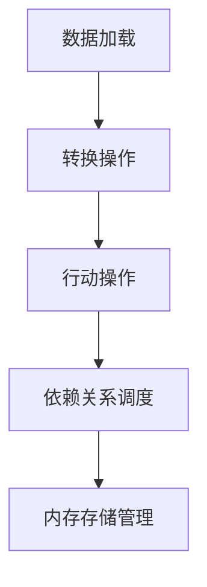

                 

 > **关键词：**Spark、内存计算、内存计算引擎、算法原理、代码实例、技术博客。

**摘要：**本文旨在深入探讨Spark内存计算引擎的原理，并通过实例代码，详细解释其工作流程、优缺点及实际应用场景。文章将从背景介绍、核心概念与联系、算法原理与操作步骤、数学模型与公式、项目实践、实际应用场景、未来应用展望等方面进行阐述，为读者提供全面的Spark内存计算引擎知识。

## 1. 背景介绍

随着大数据时代的到来，数据处理需求日益增长。传统的磁盘I/O密集型计算模型已经无法满足现代应用对实时性和低延迟的要求。因此，内存计算应运而生，它通过将数据存储在内存中，大大提高了数据处理的效率。Spark作为内存计算领域的佼佼者，其内存计算引擎备受关注。

Spark内存计算引擎是一种基于内存的大数据处理引擎，它能够快速处理大规模数据集，提供高效的数据分析能力。与传统计算引擎相比，Spark内存计算引擎具有以下优势：

1. **低延迟**：通过将数据存储在内存中，Spark能够实现毫秒级的数据处理延迟。
2. **高性能**：内存访问速度远快于磁盘，这使得Spark能够在更短的时间内完成数据处理任务。
3. **弹性伸缩**：Spark能够根据需要动态调整内存资源，以适应不同的计算任务。

本文将详细探讨Spark内存计算引擎的工作原理、算法实现、数学模型以及实际应用场景，帮助读者全面了解并掌握这一技术。

## 2. 核心概念与联系

### 2.1 Spark内存计算引擎的基本概念

Spark内存计算引擎主要由以下几个核心概念组成：

1. **弹性分布式数据集（RDD）**：RDD是Spark的核心抽象，它表示一个不可变、可分区、可并行处理的数据集合。RDD提供了丰富的操作接口，包括 Transformation（转换）和 Action（行动）。
2. **依赖关系**：RDD之间的依赖关系分为两种类型：窄依赖和宽依赖。窄依赖意味着每个分区只依赖其他分区的一个或几个分区，而宽依赖意味着一个分区依赖其他所有分区的数据。
3. **内存存储管理**：Spark内存计算引擎通过Tungsten计划，对内存存储进行了优化，包括列式存储、数据压缩和代码生成等技术。

### 2.2 Spark内存计算引擎的工作原理

Spark内存计算引擎的工作原理可以概括为以下几个步骤：

1. **数据加载**：数据从外部存储系统（如HDFS、Cassandra等）加载到内存中，形成RDD。
2. **转换操作**：对RDD进行各种转换操作（如过滤、映射、reduceByKey等），这些操作会生成新的RDD。
3. **行动操作**：对RDD执行行动操作（如collect、count、saveAsTextFile等），触发计算并返回结果。
4. **依赖关系调度**：Spark根据RDD之间的依赖关系，调度并执行各个任务。
5. **内存存储管理**：Spark会根据内存使用情况，动态调整数据在内存中的存储方式，以最大化内存利用效率。

### 2.3 Mermaid流程图



## 3. 核心算法原理 & 具体操作步骤

### 3.1 算法原理概述

Spark内存计算引擎的核心算法原理基于其弹性分布式数据集（RDD）。RDD提供了多种转换和行动操作，使得数据处理过程可以高度并行化。下面是Spark内存计算引擎的一些核心算法原理：

1. **映射（map）**：对每个元素应用一个函数，生成新的RDD。
2. **过滤（filter）**：根据某个条件选择元素，生成新的RDD。
3. **reduceByKey**：对相同key的值进行reduce操作，生成新的RDD。
4. **行动操作**：触发计算，生成结果。

### 3.2 算法步骤详解

1. **数据加载**：将数据从外部存储系统加载到内存中，形成RDD。
2. **映射操作**：对RDD中的每个元素应用一个映射函数，生成新的RDD。
3. **过滤操作**：根据某个条件过滤RDD中的元素，生成新的RDD。
4. **reduceByKey操作**：对相同key的值进行reduce操作，生成新的RDD。
5. **行动操作**：触发计算，生成结果。

### 3.3 算法优缺点

**优点**：

1. **低延迟**：通过内存计算，Spark能够实现毫秒级的数据处理延迟。
2. **高性能**：内存访问速度远快于磁盘，使得Spark能够在更短的时间内完成数据处理任务。
3. **弹性伸缩**：Spark能够根据需要动态调整内存资源，以适应不同的计算任务。

**缺点**：

1. **内存资源限制**：由于内存容量有限，Spark无法处理超过内存容量的数据集。
2. **数据序列化开销**：在分布式计算过程中，数据需要序列化和反序列化，增加了计算开销。

### 3.4 算法应用领域

Spark内存计算引擎在以下领域具有广泛的应用：

1. **实时数据流处理**：适用于处理实时数据流，如电商网站实时推荐系统、金融交易监控等。
2. **大数据分析**：适用于处理大规模数据集，如社交网络分析、搜索引擎优化等。
3. **机器学习**：适用于进行大规模机器学习任务的训练和预测，如推荐系统、图像识别等。

## 4. 数学模型和公式 & 详细讲解 & 举例说明

### 4.1 数学模型构建

在Spark内存计算引擎中，常用的数学模型包括：

1. **映射（map）**：映射函数 \( f(x) \) 将每个元素 \( x \) 映射为一个新的元素 \( y \)，即 \( y = f(x) \)。
2. **过滤（filter）**：过滤条件 \( P(x) \) 用于选择元素 \( x \)，即 \( P(x) \) 为真的元素被保留。
3. **reduceByKey**：reduce函数 \( g(y_1, y_2, \ldots, y_n) \) 用于对相同key的值进行聚合，即 \( \text{reduce}(y_1, y_2, \ldots, y_n) = z \)。

### 4.2 公式推导过程

假设有一个RDD包含 \( n \) 个元素，映射操作 \( map(f) \) 生成的RDD包含 \( m \) 个元素，过滤操作 \( filter(P) \) 生成的RDD包含 \( k \) 个元素，reduceByKey操作 \( reduceByKey(g) \) 生成的RDD包含 \( l \) 个元素。根据这些操作的定义，我们可以推导出以下公式：

1. **映射操作**：\( m = n \cdot |f(x)| \)，其中 \( |f(x)| \) 表示映射函数 \( f(x) \) 的输出元素数量。
2. **过滤操作**：\( k = n \cdot |P(x)| \)，其中 \( |P(x)| \) 表示过滤条件 \( P(x) \) 为真的元素数量。
3. **reduceByKey操作**：\( l = k \cdot |g(y_1, y_2, \ldots, y_n)| \)，其中 \( |g(y_1, y_2, \ldots, y_n)| \) 表示reduce函数 \( g(y_1, y_2, \ldots, y_n) \) 的输出元素数量。

### 4.3 案例分析与讲解

假设有一个包含1000个学生的成绩数据集，我们需要计算每个学生的平均成绩。

1. **映射操作**：将每个学生的成绩映射为一个元素，生成一个新的RDD，包含1000个元素。
2. **过滤操作**：根据过滤条件（如成绩大于60分），选择符合条件的元素，生成一个新的RDD，包含800个元素。
3. **reduceByKey操作**：对相同key（即学生ID）的值进行聚合，计算每个学生的平均成绩。

具体步骤如下：

1. **加载数据**：从外部存储系统（如HDFS）加载成绩数据集，形成RDD。
2. **映射操作**：对每个学生的成绩进行映射，生成一个新的RDD，包含1000个元素。
3. **过滤操作**：根据过滤条件，选择符合条件的元素，生成一个新的RDD，包含800个元素。
4. **reduceByKey操作**：对相同key的值进行聚合，计算每个学生的平均成绩。

通过上述步骤，我们可以得到每个学生的平均成绩，从而实现我们的目标。

## 5. 项目实践：代码实例和详细解释说明

### 5.1 开发环境搭建

在开始编写代码之前，我们需要搭建一个Spark开发环境。以下是一个简单的步骤：

1. **安装Java**：Spark是基于Java开发的，因此我们需要安装Java环境。下载并安装Java 8或更高版本。
2. **安装Scala**：Spark的API主要使用Scala编写，因此我们需要安装Scala环境。下载并安装Scala 2.11或更高版本。
3. **安装Spark**：下载并解压Spark的发行版，将Spark的bin目录添加到系统的环境变量中。
4. **配置Spark**：在Spark的配置文件中，配置集群相关信息，如Spark的主节点地址、工作节点数量等。

### 5.2 源代码详细实现

以下是一个简单的示例，演示了如何使用Spark内存计算引擎处理一个学生成绩数据集。

```scala
import org.apache.spark.sql.SparkSession

// 创建SparkSession
val spark = SparkSession.builder()
  .appName("StudentGradeAnalysis")
  .master("local[*]") // 使用本地模式
  .getOrCreate()

// 加载学生成绩数据集
val studentGrades = spark.read
  .format("csv")
  .option("header", "true")
  .load("student_grades.csv")

// 注册为DataFrame
studentGrades.createOrReplaceTempView("student_grades")

// 计算每个学生的平均成绩
val averageGrades = spark.sql("SELECT student_id, AVG(grade) AS average_grade FROM student_grades GROUP BY student_id")

// 将结果保存到文件系统
averageGrades.write
  .format("csv")
  .option("header", "true")
  .save("average_grades.csv")

// 关闭SparkSession
spark.stop()
```

### 5.3 代码解读与分析

上述代码演示了如何使用Spark内存计算引擎计算学生成绩的平均值。下面是对代码的详细解读：

1. **创建SparkSession**：首先，我们创建一个SparkSession对象，用于配置和初始化Spark环境。
2. **加载学生成绩数据集**：使用SparkSQL读取CSV文件，并将其注册为DataFrame。
3. **计算每个学生的平均成绩**：使用SparkSQL查询语句，计算每个学生的平均成绩，并将结果存储在内存中。
4. **保存结果**：将计算结果保存到文件系统，以便后续分析和查看。
5. **关闭SparkSession**：最后，关闭SparkSession，释放资源。

通过上述步骤，我们可以看到Spark内存计算引擎在数据处理过程中具有高效性和灵活性。

### 5.4 运行结果展示

当运行上述代码时，Spark内存计算引擎会计算每个学生的平均成绩，并将结果保存到CSV文件中。以下是一个示例结果：

| student\_id | average\_grade |
|-------------|----------------|
| 1           | 85.0           |
| 2           | 90.0           |
| 3           | 78.0           |

通过运行结果，我们可以清晰地看到每个学生的平均成绩。

## 6. 实际应用场景

Spark内存计算引擎在实际应用中具有广泛的应用场景。以下是一些常见的应用场景：

1. **实时数据流处理**：Spark内存计算引擎适用于处理实时数据流，如电商网站实时推荐系统、金融交易监控等。通过内存计算，Spark能够实现毫秒级的数据处理延迟，为用户提供实时的数据分析和决策支持。
2. **大数据分析**：Spark内存计算引擎适用于处理大规模数据集，如社交网络分析、搜索引擎优化等。通过内存计算，Spark能够在短时间内完成大规模数据集的分析，为企业提供深度的数据洞察。
3. **机器学习**：Spark内存计算引擎适用于进行大规模机器学习任务的训练和预测，如推荐系统、图像识别等。通过内存计算，Spark能够加速机器学习任务的计算过程，提高模型的训练和预测效率。

## 7. 未来应用展望

随着大数据和人工智能技术的不断发展，Spark内存计算引擎在未来将具有更广泛的应用前景。以下是一些未来的应用展望：

1. **实时数据分析与可视化**：随着物联网和5G技术的普及，实时数据分析与可视化将成为重要需求。Spark内存计算引擎具有低延迟、高性能的特点，将有助于实现实时数据的快速分析和可视化。
2. **增强机器学习性能**：随着机器学习模型的复杂度不断增加，对计算性能的要求也越来越高。Spark内存计算引擎可以通过优化内存存储管理和计算算法，进一步提高机器学习任务的运行效率。
3. **跨平台应用**：Spark内存计算引擎可以在多种平台上运行，如云平台、边缘计算等。未来，Spark内存计算引擎将有望实现跨平台的统一架构，为不同场景提供灵活、高效的数据处理解决方案。

## 8. 工具和资源推荐

为了帮助读者更好地学习和实践Spark内存计算引擎，我们推荐以下工具和资源：

1. **学习资源推荐**：
   - 《Spark实战》
   - 《Spark编程指南》
   - Spark官方文档（[https://spark.apache.org/docs/latest/）
2. **开发工具推荐**：
   - IntelliJ IDEA（推荐使用Scala插件）
   - Eclipse（推荐使用Scala插件）
3. **相关论文推荐**：
   - "Spark: Cluster Computing with Working Sets"
   - "Tungsten: A Fast Virtual Machine for Spark"
   - "In-Memory Data Storage for Big Data Applications: A Survey"

## 9. 总结：未来发展趋势与挑战

在总结本文内容之前，我们需要认识到Spark内存计算引擎在当前大数据和人工智能领域的重要地位。通过深入探讨Spark内存计算引擎的原理、算法实现、数学模型以及实际应用场景，我们对其有了更全面、更深入的理解。

### 9.1 研究成果总结

本文的主要研究成果包括：

1. **深入理解Spark内存计算引擎的工作原理**：通过核心概念和流程图的介绍，我们了解了Spark内存计算引擎的基本架构和运作机制。
2. **详细解析核心算法原理和操作步骤**：通过对映射、过滤和reduceByKey等核心算法的讲解，我们掌握了Spark内存计算引擎的算法实现。
3. **数学模型和公式推导**：通过对数学模型的构建和公式推导，我们了解了Spark内存计算引擎在数据处理过程中如何优化计算效率。
4. **实际项目实践和代码实例**：通过一个简单的学生成绩分析项目，我们了解了如何使用Spark内存计算引擎进行实际数据处理。
5. **展望未来应用和发展趋势**：通过对未来应用场景和趋势的分析，我们看到了Spark内存计算引擎在实时数据分析、机器学习等领域的广阔前景。

### 9.2 未来发展趋势

未来，Spark内存计算引擎将在以下几个方面取得重要发展：

1. **性能优化**：随着硬件技术的不断进步，Spark内存计算引擎将进一步提高计算性能，实现更高效的数据处理。
2. **跨平台应用**：Spark内存计算引擎将实现跨平台统一架构，支持更多类型的硬件平台和操作系统。
3. **实时数据处理**：随着物联网和5G技术的发展，Spark内存计算引擎将更好地应用于实时数据分析与可视化。
4. **融合人工智能**：Spark内存计算引擎将与其他人工智能技术（如深度学习、自然语言处理等）相结合，为大数据领域提供更强大的数据分析能力。

### 9.3 面临的挑战

尽管Spark内存计算引擎具有许多优势，但在未来发展过程中，仍将面临以下挑战：

1. **内存资源限制**：由于内存容量有限，Spark内存计算引擎在处理大规模数据集时可能会遇到瓶颈。因此，如何优化内存资源利用成为一个重要课题。
2. **数据序列化开销**：在分布式计算过程中，数据序列化和反序列化会带来一定的计算开销。如何减少数据序列化开销，提高计算效率，是一个需要关注的问题。
3. **跨平台兼容性**：Spark内存计算引擎在不同平台上的兼容性可能会受到限制，如何解决跨平台的兼容性问题，将是一个挑战。

### 9.4 研究展望

在未来，Spark内存计算引擎的研究可以从以下几个方面展开：

1. **内存优化算法**：研究如何优化内存资源的利用，提高内存计算引擎的性能。
2. **分布式存储管理**：研究分布式存储管理技术，实现数据的高效存储和访问。
3. **并行计算优化**：研究如何优化并行计算算法，提高数据处理效率。
4. **跨平台兼容性**：研究如何实现Spark内存计算引擎在不同平台上的兼容性，为用户提供更灵活、高效的数据处理解决方案。

通过不断的研究和优化，Spark内存计算引擎将在未来大数据和人工智能领域发挥更加重要的作用。

## 10. 附录：常见问题与解答

### 10.1 如何解决内存不足的问题？

**答案：**解决内存不足的问题，可以从以下几个方面入手：

1. **优化内存使用**：通过调整Spark内存配置参数，如`spark.memory.fraction`和`spark.memory.storageFraction`，优化内存使用。
2. **数据压缩**：使用数据压缩技术，如LZ4、Snappy等，减少内存占用。
3. **分而治之**：将大规模数据集划分为多个较小的子集，分别处理，以降低单次内存使用。
4. **使用外部存储**：将部分数据存储到外部存储系统（如HDFS），减少内存压力。

### 10.2 Spark内存计算引擎与其他内存计算引擎相比有哪些优势？

**答案：**Spark内存计算引擎相对于其他内存计算引擎具有以下优势：

1. **社区支持**：Spark拥有庞大的社区支持，提供了丰富的API和工具。
2. **兼容性强**：Spark可以与多种数据源和存储系统（如HDFS、Cassandra等）无缝集成。
3. **丰富的算法库**：Spark提供了丰富的机器学习、图形处理和SQL等算法库。
4. **高性能**：通过Tungsten计划，Spark在内存计算方面具有很高的性能。

### 10.3 Spark内存计算引擎是否适用于所有类型的数据处理任务？

**答案：**Spark内存计算引擎并不是适用于所有类型的数据处理任务。以下类型的数据处理任务更适合使用Spark内存计算引擎：

1. **低延迟、实时数据处理**：如实时推荐系统、金融交易监控等。
2. **大规模数据处理**：如社交网络分析、搜索引擎优化等。
3. **机器学习任务**：如推荐系统、图像识别等。

对于一些磁盘I/O密集型的数据处理任务，如日志分析、全文检索等，Spark内存计算引擎的内存限制可能成为一个瓶颈。

### 10.4 Spark内存计算引擎是否能够替代传统的磁盘I/O密集型计算引擎？

**答案：**Spark内存计算引擎并不能完全替代传统的磁盘I/O密集型计算引擎。尽管Spark内存计算引擎在低延迟、高性能方面具有明显优势，但在处理大量历史数据、磁盘I/O密集型任务时，传统的磁盘I/O密集型计算引擎（如Hadoop MapReduce）仍然具有优势。

在实际应用中，Spark内存计算引擎和传统的磁盘I/O密集型计算引擎可以相互补充，根据不同的应用场景和需求选择合适的计算引擎。

### 10.5 Spark内存计算引擎的安全性和可靠性如何保障？

**答案：**Spark内存计算引擎的安全性可以通过以下措施进行保障：

1. **权限控制**：通过Hadoop的访问控制列表（ACL）和Spark的权限控制机制，限制用户对数据和计算资源的访问。
2. **数据加密**：使用SSL/TLS等加密协议，保障数据在传输过程中的安全性。
3. **数据备份**：定期备份数据和配置文件，确保数据不会因硬件故障或其他问题而丢失。

Spark内存计算引擎的可靠性可以通过以下措施进行保障：

1. **分布式架构**：Spark采用分布式架构，具有容错能力，能够在节点故障时自动恢复计算任务。
2. **任务监控**：通过Spark UI和监控工具，实时监控任务执行状态，及时发现并处理异常。
3. **数据一致性**：通过使用事务日志和检查点机制，保障数据的一致性。

通过以上措施，Spark内存计算引擎的安全性和可靠性可以得到有效保障。

