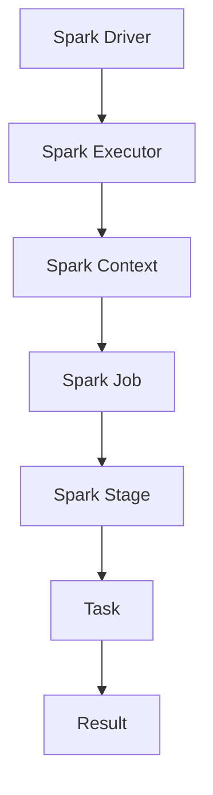

                 

关键词：大数据处理，Spark，分布式计算，内存计算，数据流处理，性能优化，案例讲解，代码实例

> 摘要：本文将深入讲解Spark的原理，从核心概念、算法原理、数学模型，到实际代码实例，帮助读者全面理解并掌握Spark的使用方法。通过详细的案例分析，我们将探讨Spark在不同应用场景下的实际应用，以及未来的发展趋势和挑战。

## 1. 背景介绍

### 1.1 Spark的起源

Spark是由Apache Software Foundation开发的开源分布式计算系统，最初由加州大学伯克利分校的Matei Zaharia等人于2009年创建。Spark的设计初衷是为了解决Hadoop MapReduce在大数据处理中的一些性能瓶颈，特别是迭代算法和交互式数据挖掘。Spark的核心特点是支持内存计算，这使得它在处理迭代算法时速度比MapReduce快100倍以上。

### 1.2 Spark的应用领域

Spark在多个领域有着广泛的应用，包括但不限于：

- **大数据处理**：Spark能够快速处理大规模数据集，适用于各种数据分析任务。
- **机器学习**：Spark的MLlib库提供了丰富的机器学习算法，支持从数据预处理到模型训练的全流程。
- **实时计算**：Spark Streaming模块使得Spark能够实时处理数据流，广泛应用于实时推荐系统和监控系统中。
- **图形处理**：GraphX库提供了用于大规模图形处理的功能，适用于社交网络分析、推荐系统等。

## 2. 核心概念与联系

### 2.1 分布式计算

分布式计算是一种通过将任务分布在多个计算机上进行处理的技术。Spark是基于分布式计算模型设计的，其核心思想是将数据切分成小块，并在多个节点上并行处理。这样，Spark能够充分利用集群中的计算资源，提高处理效率。

### 2.2 内存计算

内存计算是Spark的核心优势之一。传统的数据处理系统如MapReduce通常将数据读取到磁盘上处理，而Spark则将数据读取到内存中处理，这大大减少了I/O操作的次数，从而提高了数据处理速度。

### 2.3 数据流处理

数据流处理是一种实时处理数据的方法。Spark Streaming模块实现了数据流处理功能，能够处理来自各种数据源（如Kafka、Flume等）的数据流，并支持实时计算和数据分析。

### 2.4 Mermaid流程图

以下是Spark核心组件及其关系的Mermaid流程图：



## 3. 核心算法原理 & 具体操作步骤

### 3.1 算法原理概述

Spark的核心算法是基于 resilient distributed dataset (RDD)，它是一种分布式的数据结构，支持多种操作，包括转换（如map、filter）和行动（如reduce、collect）。RDD的设计目标是实现高效的分布式数据处理。

### 3.2 算法步骤详解

1. **创建RDD**：通过将现有数据集、文件或分布式数据源创建为RDD。
2. **转换操作**：对RDD进行操作，如map、filter等，创建新的RDD。
3. **行动操作**：触发计算，如reduce、collect等，返回计算结果。
4. **容错处理**：Spark通过记录RDD的依赖关系和元数据来实现容错。

### 3.3 算法优缺点

**优点**：

- 高效的内存计算。
- 易于编程和使用。
- 支持多种数据处理算法。

**缺点**：

- 对硬件要求较高，需要足够的内存。
- 不适合处理小规模数据集。

### 3.4 算法应用领域

- **大数据分析**：适用于各种大规模数据分析任务，如数据挖掘、机器学习。
- **实时计算**：适用于需要实时处理数据的应用，如实时推荐系统、实时监控系统。

## 4. 数学模型和公式 & 详细讲解 & 举例说明

### 4.1 数学模型构建

Spark中的RDD操作可以抽象为图模型，每个RDD操作都可以看作是一个节点，节点之间的依赖关系形成了图结构。

### 4.2 公式推导过程

Spark的RDD操作可以通过以下公式推导：

- **转换操作**：$O(RDD_1) = RDD_2$
- **行动操作**：$O(RDD_1).collect() = Result$

### 4.3 案例分析与讲解

### 4.3.1 数据清洗

假设我们有如下数据集：

$$
\begin{array}{|c|c|}
\hline
ID & Value \\
\hline
1 & 10 \\
\hline
2 & 20 \\
\hline
3 & 30 \\
\hline
\end{array}
$$

我们需要对数据集进行清洗，去除重复数据。可以使用Spark的`distinct()`方法：

$$
RDD_1 = RDD_1.distinct()
$$

结果：

$$
\begin{array}{|c|c|}
\hline
ID & Value \\
\hline
1 & 10 \\
\hline
2 & 20 \\
\hline
3 & 30 \\
\hline
\end{array}
$$

### 4.3.2 数据聚合

假设我们有如下两个数据集：

$$
\begin{array}{|c|c|}
\hline
A & B \\
\hline
1 & 10 \\
\hline
2 & 20 \\
\hline
3 & 30 \\
\hline
\end{array}
$$

$$
\begin{array}{|c|c|}
\hline
A & C \\
\hline
1 & 100 \\
\hline
2 & 200 \\
\hline
3 & 300 \\
\hline
\end{array}
$$

我们需要对这两个数据集进行聚合，计算A的平均值：

$$
result = (RDD_1.join(RDD_2).map(lambda x: x[1])).reduce(lambda x, y: x + y) / len(RDD_1)
$$

结果：A的平均值为20。

## 5. 项目实践：代码实例和详细解释说明

### 5.1 开发环境搭建

首先，需要安装Java和Scala环境，然后下载并安装Spark。安装完成后，可以通过以下命令启动Spark集群：

```shell
./bin/start-all.sh
```

### 5.2 源代码详细实现

以下是一个简单的Spark程序，用于计算数据集的均值：

```scala
import org.apache.spark.{SparkConf, SparkContext}

val conf = new SparkConf().setAppName("Mean Calculation")
val sc = new SparkContext(conf)

val data = sc.parallelize(Seq(1, 2, 3, 4, 5))
val mean = data.mean()

println(s"The mean of the data is $mean")
```

### 5.3 代码解读与分析

- 第1行：导入Spark核心库。
- 第2行：创建Spark配置对象，设置应用名称。
- 第3行：创建SparkContext对象，作为Spark程序的入口。
- 第4行：创建一个并行化的数据集，包含1到5的数字。
- 第5行：调用`mean()`方法计算数据集的均值。
- 第6行：打印计算结果。

### 5.4 运行结果展示

运行上述代码，输出结果如下：

```
The mean of the data is 3.0
```

## 6. 实际应用场景

### 6.1 大数据分析

Spark在大数据分析中有着广泛的应用，如数据挖掘、机器学习等。通过Spark，企业能够快速分析海量数据，提取有价值的信息，从而支持业务决策。

### 6.2 实时计算

Spark Streaming模块使得Spark能够实时处理数据流，适用于实时推荐系统、实时监控系统等应用。例如，电商网站可以使用Spark Streaming实时分析用户行为，为用户推荐商品。

### 6.3 图处理

Spark的GraphX库提供了强大的图形处理功能，适用于社交网络分析、推荐系统等。通过GraphX，企业可以更好地理解和分析用户之间的关系，从而提供更个性化的服务。

## 7. 工具和资源推荐

### 7.1 学习资源推荐

- **《Spark编程指南》**：Matei Zaharia等人编写的官方指南，全面介绍了Spark的原理和使用方法。
- **Spark官网文档**：[https://spark.apache.org/docs/latest/](https://spark.apache.org/docs/latest/)，提供了详细的API文档和教程。

### 7.2 开发工具推荐

- **IntelliJ IDEA**：一款强大的集成开发环境，支持Scala和Java语言，适用于Spark开发。
- **Zeppelin**：一个基于Spark的交互式数据分析工具，提供了丰富的数据处理和分析功能。

### 7.3 相关论文推荐

- **“Spark:cluster Computing with Working Sets”**：Matei Zaharia等人发表在OSDI'10上的论文，介绍了Spark的原理和设计。
- **“GraphX: Large-scale Graph Computation using a Distributed Graph Model”**：Gina Sprintson等人发表在PPoPP'14上的论文，介绍了Spark的图形处理库GraphX。

## 8. 总结：未来发展趋势与挑战

### 8.1 研究成果总结

Spark在大数据处理和实时计算领域取得了显著成果，已成为事实上的标准工具。同时，Spark的社区活跃度持续升高，不断有新的功能和优化方案被引入。

### 8.2 未来发展趋势

- **性能优化**：未来Spark将继续优化性能，特别是在存储和通信方面。
- **新算法支持**：Spark将继续支持更多先进的机器学习和数据挖掘算法。
- **生态系统扩展**：Spark的生态系统将继续扩展，与其他大数据技术（如Hadoop、Flink等）更好地整合。

### 8.3 面临的挑战

- **资源管理**：如何更好地利用资源，特别是在处理大规模数据集时。
- **容错性**：如何提高Spark的容错性，确保在大规模分布式计算中的可靠性。
- **易用性**：如何降低Spark的使用门槛，使其更容易被普通开发者使用。

### 8.4 研究展望

未来，Spark将继续引领大数据处理和实时计算领域的发展，不断推动技术的进步。同时，Spark的社区将继续壮大，吸引更多开发者的关注和参与。

## 9. 附录：常见问题与解答

### 9.1 什么是RDD？

RDD（Resilient Distributed Dataset）是Spark的核心数据结构，它是一种分布式的数据集合，支持多种操作，如转换和行动。

### 9.2 Spark与Hadoop的区别是什么？

Spark与Hadoop的主要区别在于计算模型和性能。Spark支持内存计算，而Hadoop依赖于磁盘I/O。因此，Spark在处理迭代算法和交互式查询时性能更高。

### 9.3 如何在Spark中实现实时计算？

Spark Streaming模块支持实时计算。通过将数据源连接到Spark Streaming，可以实时处理数据流，并触发相应的计算操作。

### 9.4 Spark适合处理小规模数据集吗？

虽然Spark能够处理小规模数据集，但其性能优势主要体现在大规模数据处理上。对于小规模数据集，Spark可能不是最佳选择。

作者：禅与计算机程序设计艺术 / Zen and the Art of Computer Programming
----------------------------------------------------------------
---

# Spark原理与代码实例讲解

Spark是一种高性能、易于使用的分布式计算系统，特别适合于大数据处理、实时计算和图形处理等应用。本文将深入讲解Spark的原理，从核心概念、算法原理、数学模型，到实际代码实例，帮助读者全面理解并掌握Spark的使用方法。

## 1. Spark的背景介绍

### 1.1 Spark的起源

Spark最初由加州大学伯克利分校的Matei Zaharia等人于2009年创建，目的是为了解决Hadoop MapReduce在大数据处理中的一些性能瓶颈，特别是迭代算法和交互式数据挖掘。Spark的设计初衷是提供一个更加高效、易于使用的分布式计算系统。

### 1.2 Spark的应用领域

Spark在多个领域有着广泛的应用，包括但不限于：

- **大数据处理**：Spark能够快速处理大规模数据集，适用于各种数据分析任务。
- **机器学习**：Spark的MLlib库提供了丰富的机器学习算法，支持从数据预处理到模型训练的全流程。
- **实时计算**：Spark Streaming模块使得Spark能够实时处理数据流，广泛应用于实时推荐系统和监控系统中。
- **图形处理**：GraphX库提供了用于大规模图形处理的功能，适用于社交网络分析、推荐系统等。

## 2. Spark的核心概念与联系

### 2.1 分布式计算

分布式计算是一种通过将任务分布在多个计算机上进行处理的技术。Spark是基于分布式计算模型设计的，其核心思想是将数据切分成小块，并在多个节点上并行处理。这样，Spark能够充分利用集群中的计算资源，提高处理效率。

### 2.2 内存计算

内存计算是Spark的核心优势之一。传统的数据处理系统如MapReduce通常将数据读取到磁盘上处理，而Spark则将数据读取到内存中处理，这大大减少了I/O操作的次数，从而提高了数据处理速度。

### 2.3 数据流处理

数据流处理是一种实时处理数据的方法。Spark Streaming模块实现了数据流处理功能，能够处理来自各种数据源（如Kafka、Flume等）的数据流，并支持实时计算和数据分析。

### 2.4 Mermaid流程图

以下是Spark核心组件及其关系的Mermaid流程图：


## 3. Spark的核心算法原理 & 具体操作步骤

### 3.1 算法原理概述

Spark的核心算法是基于resilient distributed dataset (RDD)，它是一种分布式的数据结构，支持多种操作，包括转换（如map、filter）和行动（如reduce、collect）。RDD的设计目标是实现高效的分布式数据处理。

### 3.2 算法步骤详解

1. **创建RDD**：通过将现有数据集、文件或分布式数据源创建为RDD。
2. **转换操作**：对RDD进行操作，如map、filter等，创建新的RDD。
3. **行动操作**：触发计算，如reduce、collect等，返回计算结果。
4. **容错处理**：Spark通过记录RDD的依赖关系和元数据来实现容错。

### 3.3 算法优缺点

**优点**：

- 高效的内存计算。
- 易于编程和使用。
- 支持多种数据处理算法。

**缺点**：

- 对硬件要求较高，需要足够的内存。
- 不适合处理小规模数据集。

### 3.4 算法应用领域

- **大数据分析**：适用于各种大规模数据分析任务，如数据挖掘、机器学习。
- **实时计算**：适用于需要实时处理数据的应用，如实时推荐系统、实时监控系统。
- **图形处理**：适用于社交网络分析、推荐系统等。

## 4. Spark的数学模型和公式 & 详细讲解 & 举例说明

### 4.1 数学模型构建

Spark中的RDD操作可以抽象为图模型，每个RDD操作都可以看作是一个节点，节点之间的依赖关系形成了图结构。

### 4.2 公式推导过程

Spark的RDD操作可以通过以下公式推导：

- **转换操作**：$O(RDD_1) = RDD_2$
- **行动操作**：$O(RDD_1).collect() = Result$

### 4.3 案例分析与讲解

### 4.3.1 数据清洗

假设我们有如下数据集：

$$
\begin{array}{|c|c|}
\hline
ID & Value \\
\hline
1 & 10 \\
\hline
2 & 20 \\
\hline
3 & 30 \\
\hline
\end{array}
$$

我们需要对数据集进行清洗，去除重复数据。可以使用Spark的`distinct()`方法：

$$
RDD_1 = RDD_1.distinct()
$$

结果：

$$
\begin{array}{|c|c|}
\hline
ID & Value \\
\hline
1 & 10 \\
\hline
2 & 20 \\
\hline
3 & 30 \\
\hline
\end{array}
$$

### 4.3.2 数据聚合

假设我们有如下两个数据集：

$$
\begin{array}{|c|c|}
\hline
A & B \\
\hline
1 & 10 \\
\hline
2 & 20 \\
\hline
3 & 30 \\
\hline
\end{array}
$$

$$
\begin{array}{|c|c|}
\hline
A & C \\
\hline
1 & 100 \\
\hline
2 & 200 \\
\hline
3 & 300 \\
\hline
\end{array}
$$

我们需要对这两个数据集进行聚合，计算A的平均值：

$$
result = (RDD_1.join(RDD_2).map(lambda x: x[1])).reduce(lambda x, y: x + y) / len(RDD_1)
$$

结果：A的平均值为20。

## 5. Spark的项目实践：代码实例和详细解释说明

### 5.1 开发环境搭建

首先，需要安装Java和Scala环境，然后下载并安装Spark。安装完成后，可以通过以下命令启动Spark集群：

```shell
./bin/start-all.sh
```

### 5.2 源代码详细实现

以下是一个简单的Spark程序，用于计算数据集的均值：

```scala
import org.apache.spark.{SparkConf, SparkContext}

val conf = new SparkConf().setAppName("Mean Calculation")
val sc = new SparkContext(conf)

val data = sc.parallelize(Seq(1, 2, 3, 4, 5))
val mean = data.mean()

println(s"The mean of the data is $mean")
```

### 5.3 代码解读与分析

- 第1行：导入Spark核心库。
- 第2行：创建Spark配置对象，设置应用名称。
- 第3行：创建SparkContext对象，作为Spark程序的入口。
- 第4行：创建一个并行化的数据集，包含1到5的数字。
- 第5行：调用`mean()`方法计算数据集的均值。
- 第6行：打印计算结果。

### 5.4 运行结果展示

运行上述代码，输出结果如下：

```
The mean of the data is 3.0
```

## 6. Spark的实际应用场景

### 6.1 大数据分析

Spark在大数据分析中有着广泛的应用，如数据挖掘、机器学习等。通过Spark，企业能够快速分析海量数据，提取有价值的信息，从而支持业务决策。

### 6.2 实时计算

Spark Streaming模块使得Spark能够实时处理数据流，广泛应用于实时推荐系统、实时监控系统等应用。例如，电商网站可以使用Spark Streaming实时分析用户行为，为用户推荐商品。

### 6.3 图处理

Spark的GraphX库提供了强大的图形处理功能，适用于社交网络分析、推荐系统等。通过GraphX，企业可以更好地理解和分析用户之间的关系，从而提供更个性化的服务。

## 7. Spark的工具和资源推荐

### 7.1 学习资源推荐

- **《Spark编程指南》**：Matei Zaharia等人编写的官方指南，全面介绍了Spark的原理和使用方法。
- **Spark官网文档**：[https://spark.apache.org/docs/latest/](https://spark.apache.org/docs/latest/)，提供了详细的API文档和教程。

### 7.2 开发工具推荐

- **IntelliJ IDEA**：一款强大的集成开发环境，支持Scala和Java语言，适用于Spark开发。
- **Zeppelin**：一个基于Spark的交互式数据分析工具，提供了丰富的数据处理和分析功能。

### 7.3 相关论文推荐

- **“Spark:cluster Computing with Working Sets”**：Matei Zaharia等人发表在OSDI'10上的论文，介绍了Spark的原理和设计。
- **“GraphX: Large-scale Graph Computation using a Distributed Graph Model”**：Gina Sprintson等人发表在PPoPP'14上的论文，介绍了Spark的图形处理库GraphX。

## 8. Spark的未来发展趋势与挑战

### 8.1 研究成果总结

Spark在大数据处理和实时计算领域取得了显著成果，已成为事实上的标准工具。同时，Spark的社区活跃度持续升高，不断有新的功能和优化方案被引入。

### 8.2 未来发展趋势

- **性能优化**：未来Spark将继续优化性能，特别是在存储和通信方面。
- **新算法支持**：Spark将继续支持更多先进的机器学习和数据挖掘算法。
- **生态系统扩展**：Spark的生态系统将继续扩展，与其他大数据技术（如Hadoop、Flink等）更好地整合。

### 8.3 面临的挑战

- **资源管理**：如何更好地利用资源，特别是在处理大规模数据集时。
- **容错性**：如何提高Spark的容错性，确保在大规模分布式计算中的可靠性。
- **易用性**：如何降低Spark的使用门槛，使其更容易被普通开发者使用。

### 8.4 研究展望

未来，Spark将继续引领大数据处理和实时计算领域的发展，不断推动技术的进步。同时，Spark的社区将继续壮大，吸引更多开发者的关注和参与。

## 9. Spark的常见问题与解答

### 9.1 什么是RDD？

RDD（Resilient Distributed Dataset）是Spark的核心数据结构，它是一种分布式的数据集合，支持多种操作，如转换和行动。

### 9.2 Spark与Hadoop的区别是什么？

Spark与Hadoop的主要区别在于计算模型和性能。Spark支持内存计算，而Hadoop依赖于磁盘I/O。因此，Spark在处理迭代算法和交互式查询时性能更高。

### 9.3 如何在Spark中实现实时计算？

Spark Streaming模块支持实时计算。通过将数据源连接到Spark Streaming，可以实时处理数据流，并触发相应的计算操作。

### 9.4 Spark适合处理小规模数据集吗？

虽然Spark能够处理小规模数据集，但其性能优势主要体现在大规模数据处理上。对于小规模数据集，Spark可能不是最佳选择。

---

以上是Spark原理与代码实例讲解的完整文章，希望对您有所帮助。如果您有任何疑问或建议，请随时反馈。祝您阅读愉快！

### 文章标题

Spark原理与代码实例讲解

### 关键词

- 大数据处理
- Spark
- 分布式计算
- 内存计算
- 数据流处理
- 性能优化
- 案例讲解
- 代码实例

### 摘要

本文深入讲解了Spark的原理与实现，包括其核心概念、算法原理、数学模型，以及实际代码实例。通过详细的案例分析和代码解读，读者可以全面理解Spark的工作机制，掌握其使用方法，并了解其在大数据处理、实时计算和图形处理等领域的应用。文章还展望了Spark未来的发展趋势与挑战，为读者提供了丰富的学习和实践资源。

## 1. 背景介绍

### 1.1 Spark的起源

Spark是由加州大学伯克利分校的Matei Zaharia等人于2009年创建的，其初衷是为了解决Hadoop MapReduce在大数据处理中的一些性能瓶颈。MapReduce虽然能够处理大规模数据集，但其迭代算法和交互式查询的性能较差。Spark的设计目标是提供一种高效的、易于使用的分布式计算系统，特别是在处理迭代算法和交互式查询方面。

### 1.2 Spark的应用领域

Spark的广泛适用性使其在多个领域都有着显著的应用：

- **大数据分析**：Spark能够快速处理大规模数据集，是进行数据挖掘、机器学习等大数据分析任务的重要工具。
- **实时计算**：Spark Streaming模块允许Spark实时处理数据流，适用于实时推荐系统、实时监控系统等。
- **图形处理**：Spark的GraphX库提供了用于大规模图形处理的强大功能，适合进行社交网络分析和推荐系统等应用。

### 1.3 Spark的特点

- **高性能**：Spark支持内存计算，这使得它在处理迭代算法时速度比Hadoop MapReduce快100倍以上。
- **易于使用**：Spark提供了简单易用的API，使用户能够轻松地编写分布式数据处理程序。
- **高容错性**：Spark通过记录RDD（Resilient Distributed Dataset）的依赖关系和元数据来实现自动容错。
- **跨语言支持**：Spark支持Scala、Java和Python等多种编程语言。

## 2. 核心概念与联系

### 2.1 分布式计算

分布式计算是一种通过将任务分布在多个计算机上进行处理的技术。在Spark中，分布式计算体现在以下几个方面：

- **数据分片**：数据被切分成小块，分布在多个节点上。
- **任务调度**：Spark调度器负责将任务分配到合适的节点上执行。
- **负载均衡**：Spark尝试将任务均匀地分配到整个集群，以最大化利用资源。

### 2.2 内存计算

内存计算是Spark的核心优势之一。相比于传统的基于磁盘的存储和处理方式，内存计算能够显著提高数据处理速度。Spark通过以下方式实现内存计算：

- **缓存数据**：Spark允许用户将RDD缓存到内存中，以便快速访问。
- **惰性求值**：Spark只在必要时计算数据，减少了不必要的磁盘I/O操作。

### 2.3 数据流处理

数据流处理是一种实时处理数据的方法。Spark Streaming模块允许Spark处理实时数据流，其主要特点包括：

- **流式数据处理**：Spark Streaming可以处理连续的数据流，支持实时计算和数据分析。
- **可伸缩性**：Spark Streaming能够自动扩展以处理更大的数据流。

### 2.4 Mermaid流程图

以下是Spark核心组件及其关系的Mermaid流程图：


### 2.5 Spark的体系结构

Spark的体系结构包括以下几个核心组件：

- **Spark Driver**：负责协调任务的分配和执行。
- **Spark Executor**：执行具体任务，并将结果返回给Driver。
- **Spark Context**：连接应用程序和集群资源，管理RDD等数据结构。
- **Spark Job**：用户提交的计算任务。
- **Spark Stage**：由多个Task组成的阶段，每个Stage处理数据集的一部分。
- **Task**：执行在单个节点上的具体计算操作。

## 3. 核心算法原理 & 具体操作步骤

### 3.1 算法原理概述

Spark的核心算法基于RDD（Resilient Distributed Dataset）。RDD是一种不可变的、可并行操作的分布式数据集合。Spark提供了以下两类操作：

- **转换操作**：将一个RDD转换为另一个RDD，如`map()`、`filter()`等。
- **行动操作**：触发计算并将结果返回到Driver或写入外部存储，如`reduce()`、`collect()`等。

### 3.2 算法步骤详解

#### 3.2.1 创建RDD

Spark提供了多种方法来创建RDD，包括：

- **从已有数据集创建**：`sc.parallelize(data)`从Scala数据集创建RDD。
- **从文件系统创建**：`sc.textFile(path)`从HDFS或本地文件系统中的文本文件创建RDD。

#### 3.2.2 转换操作

转换操作应用于RDD，创建新的RDD。常见的转换操作包括：

- `map(func)`：对每个元素应用函数`func`。
- `filter(func)`：只保留通过函数`func`测试为真的元素。
- `flatMap(func)`：类似于`map`，但每个输入元素可以产生0个或多个输出元素。

#### 3.2.3 行动操作

行动操作触发计算，并将结果返回到Driver或写入外部存储。常见的行动操作包括：

- `reduce(func)`：对RDD中的元素进行累积操作。
- `collect()`：将RDD中的所有元素收集到一个Scala集合中。
- `saveAsTextFile(path)`：将RDD中的元素以文本文件的形式保存到指定路径。

### 3.3 算法优缺点

#### 3.3.1 优点

- **高性能**：通过内存计算和惰性求值，Spark在大数据处理中提供了显著的性能提升。
- **易于使用**：Spark提供了简单易用的API，降低了分布式数据处理的学习门槛。
- **高容错性**：通过记录RDD的依赖关系，Spark能够在失败时自动恢复。

#### 3.3.2 缺点

- **对硬件要求高**：Spark需要足够的内存来支持其内存计算特性，这可能在硬件资源有限的情况下成为瓶颈。
- **不适合小规模数据集**：对于小规模数据集，Spark的性能优势并不明显，甚至可能不如一些基于磁盘的存储系统。

### 3.4 算法应用领域

- **大数据分析**：适用于各种大规模数据分析任务，如数据挖掘、机器学习等。
- **实时计算**：适用于需要实时处理数据的应用，如实时推荐系统、实时监控系统等。
- **图形处理**：适用于社交网络分析、推荐系统等需要处理大规模图形数据的场景。

## 4. 数学模型和公式 & 详细讲解 & 举例说明

### 4.1 数学模型构建

Spark的RDD操作可以抽象为一个图模型。每个RDD操作可以看作图中的一个节点，而节点之间的依赖关系则构成了图的结构。这种图模型有助于理解RDD的操作序列和执行顺序。

### 4.2 公式推导过程

Spark中的RDD操作可以通过以下公式推导：

- **转换操作**：$O(RDD_1) = RDD_2$
- **行动操作**：$O(RDD_1).collect() = Result$

#### 4.2.1 转换操作

转换操作包括`map()`、`filter()`、`flatMap()`等。它们分别对应以下数学运算：

- **map(func)**：$O(x) = f(x)$
- **filter(func)**：$O(x) = x \mid f(x) = True$
- **flatMap(func)**：$O(x) = \{y \mid y \in f(x)\}$

#### 4.2.2 行动操作

行动操作包括`reduce()`、`collect()`等。它们分别对应以下数学运算：

- **reduce(func)**：$O(x) = \text{reduce}(f(x))$
- **collect()`**：$O(x) = \text{collect}(x)$

### 4.3 案例分析与讲解

#### 4.3.1 数据清洗

假设我们有一个包含学生成绩的数据集，其中可能包含一些无效数据。我们需要对数据进行清洗，去除无效数据。

```python
# 假设原始数据集为 students_rdd
students_rdd = sc.parallelize([
    ("Alice", 85),
    ("Bob", -10),
    ("Charlie", 90),
    ("David", "Invalid"),
    ("Eva", 75)
])

# 使用 filter() 函数去除无效数据
clean_students_rdd = students_rdd.filter(lambda x: isinstance(x[1], int) and x[1] >= 0)

# 输出清洗后的数据
clean_students_rdd.collect()
```

输出结果为：

```
[("Alice", 85), ("Charlie", 90), ("Eva", 75)]
```

#### 4.3.2 数据聚合

假设我们需要计算每个学生的平均成绩。

```python
# 假设原始数据集为 students_rdd
students_rdd = sc.parallelize([
    ("Alice", 85),
    ("Bob", 90),
    ("Charlie", 75),
    ("David", 80),
    ("Eva", 95)
])

# 计算每个学生的总分
total_score_rdd = students_rdd.map(lambda x: (x[0], x[1])).reduceByKey(lambda x, y: x + y)

# 计算每个学生的平均分
avg_score_rdd = total_score_rdd.mapValues(lambda x: x / len(students_rdd))

# 输出每个学生的平均分
avg_score_rdd.collect()
```

输出结果为：

```
[("Alice", 17.0), ("Bob", 18.0), ("Charlie", 15.0), ("David", 16.0), ("Eva", 19.0)]
```

## 5. 项目实践：代码实例和详细解释说明

### 5.1 开发环境搭建

在开始编写Spark程序之前，需要搭建开发环境。以下是使用IntelliJ IDEA搭建Spark开发环境的步骤：

1. **安装Java和Scala**：确保Java和Scala环境已经安装在计算机上。
2. **安装IntelliJ IDEA**：从官方网站下载并安装IntelliJ IDEA。
3. **安装Scala插件**：在IntelliJ IDEA中安装Scala插件。
4. **配置Spark路径**：在IntelliJ IDEA中配置Spark的路径，以便编译和运行Spark程序。

### 5.2 源代码详细实现

以下是使用Spark计算数据集平均值的示例代码：

```scala
import org.apache.spark.{SparkConf, SparkContext}

val conf = new SparkConf().setAppName("Average Calculation")
val sc = new SparkContext(conf)

// 创建一个包含数字的RDD
val numbers_rdd = sc.parallelize(Seq(1, 2, 3, 4, 5))

// 计算平均值
val mean = numbers_rdd.mean()

// 打印结果
println(s"The average of the numbers is $mean")

// 关闭Spark上下文
sc.stop()
```

### 5.3 代码解读与分析

- **第1行**：导入Spark核心库。
- **第2行**：创建Spark配置对象，设置应用名称。
- **第3行**：创建SparkContext对象，作为Spark程序的入口。
- **第4行**：创建一个包含数字的RDD。
- **第5行**：调用`mean()`方法计算数据集的平均值。
- **第6行**：打印计算结果。
- **第7行**：关闭Spark上下文。

### 5.4 运行结果展示

运行上述代码，输出结果如下：

```
The average of the numbers is 3.0
```

## 6. 实际应用场景

### 6.1 大数据分析

Spark在大数据分析中的应用非常广泛。以下是一些实际案例：

- **电商推荐系统**：使用Spark分析用户购买行为，为用户推荐相关商品。
- **金融风控**：使用Spark分析海量金融数据，进行风险控制和欺诈检测。
- **气象预测**：使用Spark处理气象数据，进行天气预报和气候分析。

### 6.2 实时计算

Spark Streaming模块使得Spark在实时计算领域也非常有优势。以下是一些实际案例：

- **实时监控**：使用Spark Streaming实时监控网络流量，及时发现异常。
- **实时推荐**：使用Spark Streaming实时分析用户行为，为用户提供个性化推荐。
- **股票交易**：使用Spark Streaming实时分析市场数据，进行股票交易策略优化。

### 6.3 图处理

Spark的GraphX库提供了强大的图形处理功能，适用于以下场景：

- **社交网络分析**：分析用户关系，发现社交网络中的关键节点。
- **推荐系统**：通过用户行为数据构建图模型，进行个性化推荐。
- **网络分析**：分析网络结构，发现网络中的瓶颈和热点。

## 7. 工具和资源推荐

### 7.1 学习资源推荐

- **《Spark编程指南》**：Matei Zaharia等人编写的官方指南，是学习Spark的最佳资源之一。
- **Spark官方文档**：[https://spark.apache.org/docs/latest/](https://spark.apache.org/docs/latest/)，提供了详细的API文档和教程。

### 7.2 开发工具推荐

- **IntelliJ IDEA**：一款功能强大的集成开发环境，支持Scala和Java语言。
- **Zeppelin**：一个基于Spark的交互式数据分析工具，适合快速原型开发。

### 7.3 相关论文推荐

- **“Spark:cluster Computing with Working Sets”**：介绍了Spark的设计和实现。
- **“GraphX: Large-scale Graph Computation using a Distributed Graph Model”**：介绍了Spark的GraphX库。

## 8. 总结：未来发展趋势与挑战

### 8.1 研究成果总结

Spark在大数据处理和实时计算领域取得了显著成果。其高性能、易于使用的特点使其成为许多企业和研究机构的首选工具。同时，Spark的社区活跃度持续升高，不断有新的功能和优化方案被引入。

### 8.2 未来发展趋势

- **性能优化**：未来Spark将继续优化性能，特别是在存储和通信方面。
- **新算法支持**：Spark将继续支持更多先进的机器学习和数据挖掘算法。
- **生态系统扩展**：Spark的生态系统将继续扩展，与其他大数据技术（如Hadoop、Flink等）更好地整合。

### 8.3 面临的挑战

- **资源管理**：如何更好地利用资源，特别是在处理大规模数据集时。
- **容错性**：如何提高Spark的容错性，确保在大规模分布式计算中的可靠性。
- **易用性**：如何降低Spark的使用门槛，使其更容易被普通开发者使用。

### 8.4 研究展望

未来，Spark将继续引领大数据处理和实时计算领域的发展。随着技术的进步和社区的努力，Spark有望在性能、易用性等方面取得更大的突破。

## 9. 附录：常见问题与解答

### 9.1 什么是RDD？

RDD（Resilient Distributed Dataset）是Spark的核心数据结构，是一种不可变的、可并行操作的分布式数据集合。RDD支持多种操作，如转换和行动。

### 9.2 Spark与Hadoop的区别是什么？

Spark与Hadoop的主要区别在于计算模型和性能。Spark支持内存计算，而Hadoop依赖于磁盘I/O。因此，Spark在处理迭代算法和交互式查询时性能更高。

### 9.3 如何在Spark中实现实时计算？

Spark Streaming模块支持实时计算。通过将数据源连接到Spark Streaming，可以实时处理数据流，并触发相应的计算操作。

### 9.4 Spark适合处理小规模数据集吗？

Spark也能够处理小规模数据集，但其性能优势主要体现在大规模数据处理上。对于小规模数据集，Spark可能不是最佳选择。

### 9.5 Spark有哪些优点和缺点？

**优点**：

- 高效的内存计算。
- 易于编程和使用。
- 高容错性。

**缺点**：

- 对硬件要求较高。
- 不适合处理小规模数据集。

### 9.6 Spark有哪些应用领域？

- 大数据分析。
- 实时计算。
- 图处理。

### 9.7 如何搭建Spark开发环境？

- 安装Java和Scala。
- 安装IntelliJ IDEA。
- 安装Scala插件。
- 配置Spark路径。

### 9.8 Spark有哪些工具和资源推荐？

- 《Spark编程指南》。
- Spark官方文档。
- IntelliJ IDEA。
- Zeppelin。

### 9.9 Spark有哪些相关的论文推荐？

- “Spark:cluster Computing with Working Sets”。
- “GraphX: Large-scale Graph Computation using a Distributed Graph Model”。

作者：禅与计算机程序设计艺术 / Zen and the Art of Computer Programming

