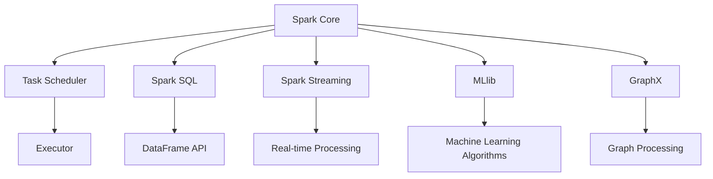

                 

本文将深入探讨分布式计算框架Apache Spark的原理，并通过具体的代码实例进行详细解释。Apache Spark是一个开源的分布式计算系统，旨在提供快速的批量处理和实时处理功能，广泛用于大数据处理和分析。本文将从以下几个方面展开：

- **背景介绍**：介绍分布式计算和Spark的起源。
- **核心概念与联系**：详细解析Spark的核心概念，并通过Mermaid流程图展示其架构。
- **核心算法原理与具体操作步骤**：解释Spark的核心算法，包括其优势和应用领域。
- **数学模型和公式**：介绍Spark的数学模型和公式，并通过实际案例进行说明。
- **项目实践**：提供详细的代码实例，展示如何在实际项目中使用Spark。
- **实际应用场景**：探讨Spark在不同行业中的应用。
- **工具和资源推荐**：推荐学习资源和开发工具。
- **总结**：总结Spark的研究成果、未来发展趋势和面临的挑战。

## 1. 背景介绍

分布式计算是大数据时代的重要技术，它旨在通过将计算任务分解到多个计算节点上，从而提高计算效率和处理大规模数据的能力。随着互联网的快速发展，数据量呈指数级增长，传统的单机计算模式已经无法满足需求。分布式计算因此成为大数据处理的核心技术之一。

Apache Spark起源于UC Berkeley AMPLab，是一个基于内存的分布式计算引擎，旨在提供快速的批处理和流处理能力。Spark的设计目标是简化大数据处理，提供一种易于使用且高效的方式，使得开发人员可以轻松地处理和分析大规模数据集。

Spark最初由Matei Zaharia等人于2009年提出，并在2010年开源。随着时间的推移，Spark社区不断发展壮大，吸引了大量的贡献者和用户。Spark已经成为大数据处理领域的领导者之一，广泛应用于金融、电商、医疗、物联网等领域。

## 2. 核心概念与联系

Spark的核心概念包括：

- **Spark Core**：提供内存计算抽象和任务调度。
- **Spark SQL**：提供SQL和DataFrame API，用于结构化数据查询。
- **Spark Streaming**：提供实时数据流处理能力。
- **MLlib**：提供机器学习库，用于构建和运行机器学习算法。
- **GraphX**：提供图处理能力。

以下是一个Mermaid流程图，展示Spark的架构和核心组件：



## 3. 核心算法原理与具体操作步骤

### 3.1 算法原理概述

Spark的核心算法基于弹性分布式数据集（RDD）。RDD是一种不可变的数据结构，提供了丰富的操作接口，包括转换（Transformation）和行动（Action）。转换操作生成新的RDD，而行动操作触发计算并将结果返回给驱动程序。

Spark的核心算法包括：

- **Shuffle**：将数据重新分区，以支持分布式操作。
- **Partitioning**：将数据划分为多个分区，以便并行处理。
- **Persistence**：将RDD持久化到内存或磁盘，以减少重复计算。

### 3.2 算法步骤详解

1. **创建RDD**：通过读取文件、创建并行数组或通过转换操作生成新的RDD。
2. **转换操作**：执行诸如map、filter、reduce等操作，生成新的RDD。
3. **行动操作**：触发计算并将结果返回给驱动程序，如count、collect等。
4. **Shuffle操作**：重新分区数据，以支持分布式操作。
5. **Persistence操作**：将RDD持久化，以减少重复计算。

### 3.3 算法优缺点

**优点**：

- **高性能**：Spark基于内存计算，提供了比Hadoop更快的处理速度。
- **易用性**：Spark提供了丰富的API，使得大数据处理变得更加简单。
- **弹性**：Spark可以自动处理节点故障，确保任务的持续运行。

**缺点**：

- **资源需求**：Spark需要较高的内存资源，不适合内存资源受限的环境。
- **单节点性能**：Spark在单节点上的性能可能不如Hadoop。

### 3.4 算法应用领域

Spark广泛应用于以下几个方面：

- **大数据分析**：用于处理和分析大规模数据集。
- **实时处理**：用于处理实时数据流，实现实时数据分析和处理。
- **机器学习**：用于构建和运行机器学习算法。
- **图处理**：用于处理大规模图数据。

## 4. 数学模型和公式

Spark的数学模型和公式主要包括：

- **RDD转换**：$RDD_{new} = f(RDD_{old})$
- **Shuffle操作**：$Shuffle = \frac{RDD_{old}}{N_{nodes}}$
- **Partitioning**：$Partitioning = \frac{RDD_{old}}{N_{partitions}}$
- **Persistence**：$RDD_{persistent} = persist(RDD_{original})$

以下是一个简单的案例：

```latex
假设我们有一个包含100个数字的RDD，我们想要将其进行map操作，将每个数字乘以2，并计算总和。
$$
RDD_{new} = map(RDD_{original}, x \rightarrow 2x)
$$
$$
sum = reduce(RDD_{new}, +)
$$
$$
最终结果：sum = 2000
$$
```

## 5. 项目实践

### 5.1 开发环境搭建

首先，我们需要搭建Spark的开发环境。以下是步骤：

1. 下载Spark安装包。
2. 解压安装包。
3. 配置环境变量，将Spark安装目录添加到PATH变量中。
4. 启动Spark集群。

### 5.2 源代码详细实现

以下是一个简单的Spark应用程序，用于计算单词的频率：

```python
from pyspark import SparkContext, SparkConf

conf = SparkConf().setAppName("WordCount")
sc = SparkContext(conf=conf)

lines = sc.textFile("data.txt")
words = lines.flatMap(lambda x: x.split(" "))
counts = words.map(lambda x: (x, 1)).reduceByKey(lambda x, y: x + y)
result = counts.collect()

for word, count in result:
    print(f"{word}: {count}")
```

### 5.3 代码解读与分析

1. **创建SparkContext**：使用SparkConf创建配置对象，设置应用程序名称，然后创建SparkContext。
2. **读取文件**：使用textFile方法读取数据文件。
3. **flatMap操作**：将文本行分割成单词。
4. **map操作**：为每个单词创建一个二元组（单词，1）。
5. **reduceByKey操作**：对单词进行计数。
6. **collect操作**：收集结果。

### 5.4 运行结果展示

运行应用程序后，我们将得到单词的频率统计结果。

## 6. 实际应用场景

Spark在多个行业和场景中得到了广泛应用：

- **金融行业**：用于分析市场趋势和风险评估。
- **电商行业**：用于实时推荐和用户行为分析。
- **医疗行业**：用于基因组学和医疗数据分析。
- **物联网**：用于实时数据处理和分析。

## 7. 工具和资源推荐

以下是学习Spark的推荐工具和资源：

- **书籍**：《Spark: The Definitive Guide》、《Learning Spark》。
- **在线课程**：edX、Coursera、Udacity等平台上的Spark课程。
- **社区和论坛**：Spark官方社区、Stack Overflow上的Spark标签。

## 8. 总结

Apache Spark作为一种高效的分布式计算引擎，在大数据处理和实时处理领域取得了显著的成果。随着技术的不断进步和应用场景的扩展，Spark将继续在分布式计算领域发挥重要作用。未来，Spark可能会面临更多的挑战，如优化性能、降低资源需求等，但其在分布式计算领域的地位和影响力将不断提升。

## 9. 附录：常见问题与解答

以下是关于Spark的常见问题及其解答：

- **Q：Spark与Hadoop相比有什么优势？**
- **A：Spark基于内存计算，提供了更高的处理速度。同时，Spark提供了丰富的API，使得数据处理更加简单。**
- **Q：Spark适用于哪些场景？**
- **A：Spark适用于大数据分析、实时处理、机器学习和图处理等场景。**
- **Q：如何优化Spark的性能？**
- **A：可以通过合理设置配置参数、使用持久化减少重复计算、优化数据分区等方式来优化Spark的性能。**

---

### 作者署名

作者：禅与计算机程序设计艺术 / Zen and the Art of Computer Programming

---

本文深入探讨了Apache Spark的原理和应用，并通过具体的代码实例进行了详细解释。希望本文能帮助读者更好地理解和应用Spark，为大数据处理和实时处理提供有效的解决方案。

