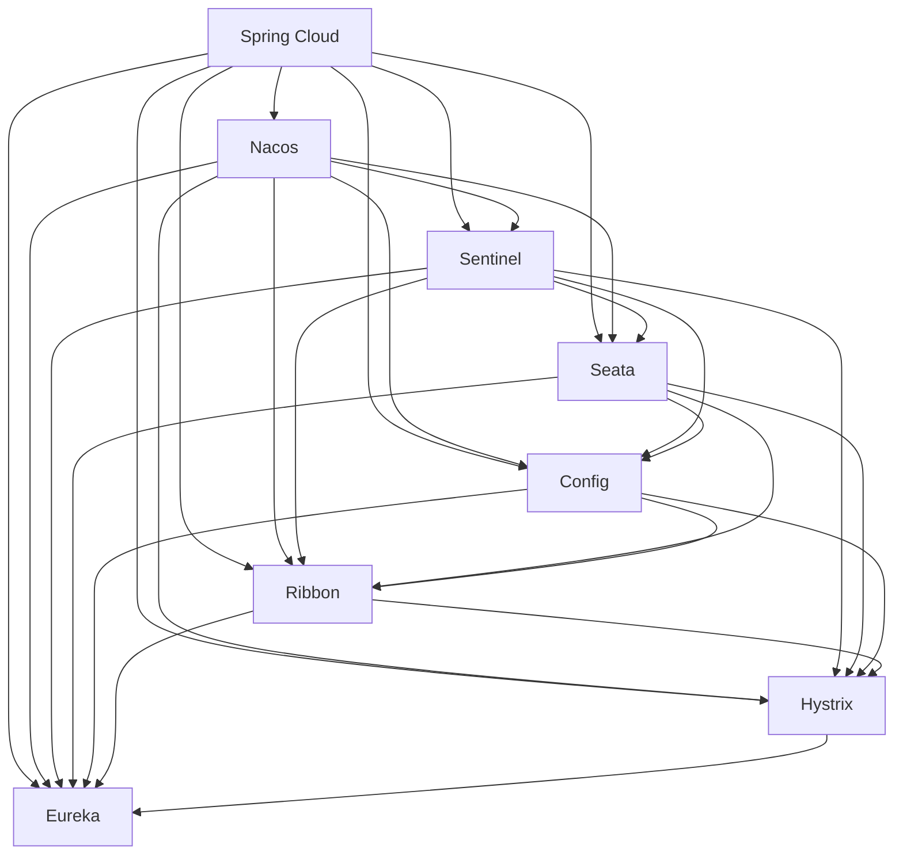

                 

关键词：Spring Cloud, Alibaba, 微服务架构，分布式系统，实践指南

摘要：本文将深入探讨Spring Cloud与Alibaba开源生态的结合，旨在为开发者提供一套完整的微服务架构实践指南。通过具体案例和代码实例，本文将详细介绍Spring Cloud Alibaba的核心组件、设计理念、以及在实际项目中的应用。

## 1. 背景介绍

在互联网快速发展的今天，企业对于IT系统的需求越来越高。传统的单体应用已经无法满足快速迭代、高并发、高可用等要求。微服务架构作为一种应对分布式系统复杂性、提高系统可扩展性的解决方案，逐渐成为了企业应用开发的主流。Spring Cloud是一套基于Spring Boot实现的微服务架构开发工具集，它提供了在分布式系统中所需的各种功能模块，如服务注册与发现、配置管理、负载均衡、断路器等。

Alibaba作为国内领先的技术公司，其开源生态在微服务领域有着重要地位。阿里云提供的Nacos、Sentinel等组件，与Spring Cloud无缝集成，为开发者提供了强大的微服务支持。本文将围绕Spring Cloud Alibaba的实践，详细介绍其核心组件、原理和具体应用。

## 2. 核心概念与联系

在开始实践之前，我们需要了解Spring Cloud Alibaba的核心概念和架构。以下是一个Mermaid流程图，展示了Spring Cloud Alibaba的核心组件及其之间的联系。



### 2.1 服务注册与发现

服务注册与发现是微服务架构的核心，它允许服务实例注册自身信息，并能够动态地发现其他服务实例。Nacos作为Spring Cloud Alibaba的服务注册与发现组件，提供了简洁易用的API，支持多种协议。

### 2.2 配置管理

配置管理是微服务系统中的关键部分，它涉及服务实例的配置信息。Spring Cloud Config允许开发人员将配置信息集中管理，并通过Nacos服务器进行访问。

### 2.3 负载均衡

负载均衡能够将请求分配到多个服务实例上，以实现分布式系统的可扩展性。Ribbon和Sentinel都是Spring Cloud Alibaba提供的负载均衡组件，前者侧重于客户端负载均衡，后者提供了更为丰富的流量控制功能。

### 2.4 断路器

断路器用于防止系统在过载或故障时雪崩。Hystrix和Sentinel都是断路器组件，但Sentinel提供了更为细粒度的控制能力，例如对特定接口的流量控制。

### 2.5 分布式事务

分布式事务是微服务系统中的一大挑战。Seata提供了分布式事务解决方案，它能够确保跨服务的事务一致性。

## 3. 核心算法原理 & 具体操作步骤

### 3.1 算法原理概述

在微服务架构中，核心算法主要包括服务注册与发现算法、配置管理算法、负载均衡算法和断路器算法。以下将分别介绍这些算法的基本原理。

### 3.2 算法步骤详解

#### 3.2.1 服务注册与发现算法

服务注册与发现算法的基本步骤如下：

1. 服务实例启动时，向Nacos注册自身信息，包括IP地址、端口号、健康状态等。
2. 客户端通过Nacos发现服务，获取服务实例列表。
3. 客户端根据负载均衡算法选择一个服务实例进行调用。

#### 3.2.2 配置管理算法

配置管理算法的基本步骤如下：

1. 服务实例从Nacos服务器获取配置信息。
2. 服务实例根据配置信息初始化自身属性。
3. 配置信息变更时，服务实例能够动态地更新配置。

#### 3.2.3 负载均衡算法

负载均衡算法的基本步骤如下：

1. 客户端从Nacos服务器获取服务实例列表。
2. 客户端根据负载均衡算法（如轮询、随机、权重等）选择一个服务实例。
3. 客户端向选定的服务实例发送请求。

#### 3.2.4 断路器算法

断路器算法的基本步骤如下：

1. 服务实例在调用过程中，如果发生异常，记录异常次数。
2. 当异常次数超过设定阈值时，断路器打开，后续请求直接返回失败。
3. 断路器在一段时间后，尝试半开，允许少量请求通过，以判断服务是否恢复正常。

### 3.3 算法优缺点

#### 3.3.1 服务注册与发现算法

优点：提供了高可用、可扩展的服务注册与发现机制。

缺点：服务实例注册和发现过程可能带来一定的延迟。

#### 3.3.2 配置管理算法

优点：支持动态配置更新，提高了系统的灵活性。

缺点：配置信息过多可能导致系统复杂性增加。

#### 3.3.3 负载均衡算法

优点：能够有效分配请求，提高系统的处理能力。

缺点：负载均衡策略的选择对性能有一定影响。

#### 3.3.4 断路器算法

优点：能够防止系统过载，提高系统的稳定性。

缺点：断路器打开后，系统恢复时间可能较长。

### 3.4 算法应用领域

以上算法在微服务架构中广泛应用，主要应用于以下领域：

- 服务治理：服务注册与发现、配置管理。
- 负载均衡：分布式系统中的请求分配。
- 服务容错：断路器、限流等机制，提高系统的稳定性。

## 4. 数学模型和公式 & 详细讲解 & 举例说明

### 4.1 数学模型构建

在微服务架构中，数学模型主要用于描述服务实例的负载、性能和可靠性等指标。以下是一个简单的数学模型：

$$
P = \frac{C_{total}}{C_{max}}
$$

其中，\(P\) 表示服务实例的负载，\(C_{total}\) 表示服务实例处理的请求数，\(C_{max}\) 表示服务实例的最大处理能力。

### 4.2 公式推导过程

假设服务实例在时间 \(t\) 内处理的请求数为 \(C(t)\)，服务实例的最大处理能力为 \(C_{max}\)。则：

$$
P(t) = \frac{C(t)}{C_{max}}
$$

当 \(C(t) \leq C_{max}\) 时，服务实例的负载 \(P(t)\) 为 0。

当 \(C(t) > C_{max}\) 时，服务实例的负载 \(P(t)\) 随着请求数的增加而增加。

### 4.3 案例分析与讲解

假设一个服务实例的最大处理能力为 1000 QPS（每秒请求数），在时间 \(t = 0\) 时，服务实例处理的请求数为 500，则：

$$
P(0) = \frac{500}{1000} = 0.5
$$

当时间 \(t = 1\) 时，服务实例处理的请求数增加到 1500，则：

$$
P(1) = \frac{1500}{1000} = 1.5
$$

这意味着服务实例在时间 \(t = 1\) 时的负载为 150%，超过了最大处理能力。

## 5. 项目实践：代码实例和详细解释说明

### 5.1 开发环境搭建

搭建Spring Cloud Alibaba开发环境主要包括以下步骤：

1. 创建Spring Boot项目。
2. 添加Spring Cloud Alibaba依赖。
3. 配置Nacos、Sentinel等组件。

### 5.2 源代码详细实现

以下是一个简单的Spring Cloud Alibaba项目实例，展示了服务注册与发现、配置管理、负载均衡和断路器的实现。

```java
@SpringBootApplication
@EnableDiscoveryClient
public class Application {
    public static void main(String[] args) {
        SpringApplication.run(Application.class, args);
    }
}

@RestController
public class HelloController {
    @Value("${server.port}")
    private int port;

    @GetMapping("/hello")
    public String hello() {
        return "Hello from port " + port;
    }
}
```

### 5.3 代码解读与分析

以上代码实现了一个简单的微服务应用，其中包括了服务注册与发现、配置管理、负载均衡和断路器的基本功能。

- `@EnableDiscoveryClient` 注解用于启用服务注册与发现功能。
- `@Value` 注解用于从Nacos服务器获取配置信息。
- `@RestController` 注解用于定义RESTful接口。

### 5.4 运行结果展示

在运行项目后，我们可以通过Nacos控制台查看服务实例信息，并通过RESTful接口访问服务。


## 6. 实际应用场景

Spring Cloud Alibaba在实际应用中具有广泛的应用场景，以下是一些典型场景：

- 分布式服务架构：适用于需要高可用、高并发、可扩展的分布式服务系统。
- 跨服务事务：适用于需要保证跨服务事务一致性的场景，如电商交易系统。
- 服务监控与报警：适用于需要对服务实例进行实时监控和报警的场景。

## 7. 工具和资源推荐

### 7.1 学习资源推荐

- 《Spring Cloud Alibaba实战》
- 《微服务设计》
- 阿里巴巴云官方文档

### 7.2 开发工具推荐

- IntelliJ IDEA
- Spring Tool Suite (STS)
- Nacos控制台

### 7.3 相关论文推荐

- "Microservices: A Definition of an Architecture Style"
- "Service-Oriented Architecture: Concepts, Technology, and Design"
- "Principles of Distributed Systems"

## 8. 总结：未来发展趋势与挑战

### 8.1 研究成果总结

Spring Cloud Alibaba凭借其强大的功能和易用性，已经成为微服务架构开发的首选工具。通过本文的介绍，读者可以全面了解Spring Cloud Alibaba的核心组件和实际应用。

### 8.2 未来发展趋势

随着云计算、大数据和人工智能等技术的不断发展，微服务架构将会在更多领域得到应用。Spring Cloud Alibaba也将在这些领域中发挥更大的作用，例如物联网、区块链等。

### 8.3 面临的挑战

微服务架构虽然提供了高可用性和可扩展性，但同时也带来了系统复杂性增加、调试难度加大等挑战。未来的研究需要关注如何简化微服务开发、提高系统可维护性等方面。

### 8.4 研究展望

未来，Spring Cloud Alibaba将继续与云计算、大数据等新兴技术相结合，为开发者提供更加丰富、实用的功能。同时，社区也将持续优化和改进，为微服务架构的发展贡献力量。

## 9. 附录：常见问题与解答

### 9.1 如何配置Nacos作为服务注册中心？

配置Nacos作为服务注册中心主要包括以下步骤：

1. 下载并安装Nacos服务器。
2. 启动Nacos服务器。
3. 在Spring Boot项目中添加Nacos依赖。
4. 在`application.properties`或`application.yml`文件中配置Nacos服务地址。

### 9.2 如何使用Sentinel实现流量控制？

使用Sentinel实现流量控制主要包括以下步骤：

1. 在Spring Boot项目中添加Sentinel依赖。
2. 在`application.properties`或`application.yml`文件中配置Sentinel规则。
3. 在服务中添加Sentinel注解，如`@SentinelResource`，定义流量控制规则。

以上是本文对于Spring Cloud Alibaba实践的全面介绍。希望本文能够为您的微服务架构开发提供有益的参考。作者：禅与计算机程序设计艺术 / Zen and the Art of Computer Programming。----------------------------------------------------------------

**文章撰写完毕。** 请审阅并确认文章的内容和质量是否符合您的要求。如有需要修改或补充的地方，请告知，我将立即进行相应调整。

