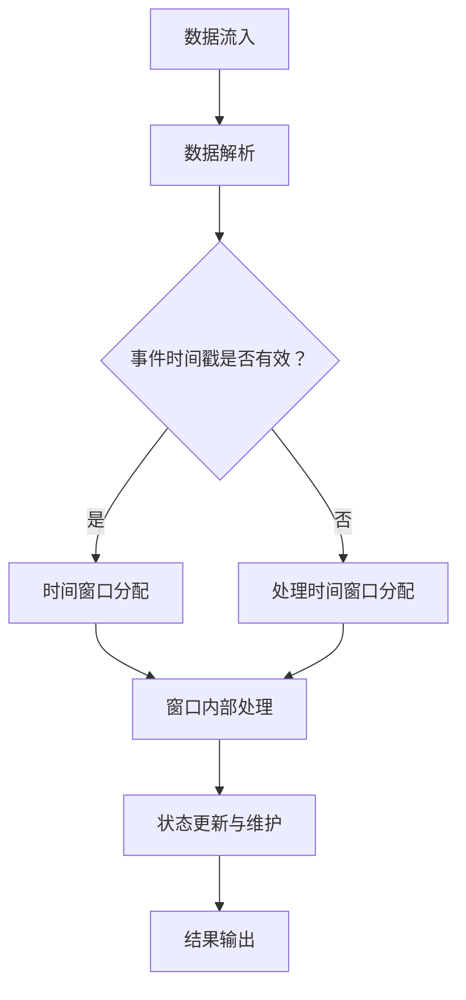

                 

关键词：Structured Streaming，原理，实践，代码实例，数据流处理，Apache Kafka，Apache Flink，Apache Spark Streaming

摘要：本文将深入探讨Structured Streaming的概念、原理及其在数据流处理中的应用。我们将通过实际代码实例，详细解释Structured Streaming的工作流程和编程模型，帮助读者更好地理解和应用这一重要技术。

## 1. 背景介绍

在当今大数据和实时数据处理的时代，如何高效地处理和分析大量动态数据成为了一个重要的课题。传统的批处理系统在面对实时数据时显得力不从心，因为它们无法及时响应数据的流入和处理。为了解决这一问题，Apache Flink、Apache Spark Streaming等大数据处理框架引入了数据流处理的概念。其中，Structured Streaming是这些框架中的一种重要机制，它提供了更为灵活和高效的数据流处理能力。

Structured Streaming的目标是将无结构的数据流转换为有结构的数据集，以便于进一步的查询和分析。它通过将数据流分为事件和时间窗口，提供了一种基于事件驱动和数据分区的处理模型，从而实现了对实时数据的低延迟处理。

## 2. 核心概念与联系

### 2.1 数据流处理框架

数据流处理框架如Apache Flink和Apache Spark Streaming，通过支持流处理和批处理相结合的方式，实现了对实时数据的高效处理。Structured Streaming在这些框架中扮演着核心角色，它提供了以下关键特性：

1. **事件时间**：Structured Streaming通过事件时间（Event Time）来确保数据处理的正确性和一致性。事件时间是指数据实际发生的时间，它允许系统根据数据本身的时间戳来处理，而不是依赖于系统时间。

2. **窗口**：窗口（Window）是将数据分割成更小、可管理的部分的一种机制。Structured Streaming支持基于事件时间或处理时间的窗口，如滑动窗口、滚动窗口等。

3. **状态维护**：Structured Streaming能够维护处理过程中的状态，如窗口内的聚合结果，从而实现复杂的数据处理和分析。

### 2.2 Mermaid 流程图

以下是一个简化的Structured Streaming处理流程的Mermaid流程图：



在这个流程图中，数据首先流入系统，然后被解析成事件。系统会根据事件的时间戳，将其分配到相应的窗口中。在窗口内部，系统会对数据进行处理，并更新状态。最后，处理结果会被输出到用户指定的目的地。

## 3. 核心算法原理 & 具体操作步骤

### 3.1 算法原理概述

Structured Streaming的核心算法原理可以概括为以下几点：

1. **事件驱动**：系统通过事件的时间戳来驱动处理过程，而不是依赖于系统时间。

2. **窗口机制**：数据被划分到不同的时间窗口中，以便于处理和分析。

3. **状态维护**：系统在处理过程中维护窗口内的状态，如聚合结果，以支持复杂查询。

4. **增量处理**：系统通过增量处理来提高效率，只处理新数据或变更数据。

### 3.2 算法步骤详解

以下是Structured Streaming的具体操作步骤：

1. **数据采集**：数据从源系统中采集到，如Apache Kafka等消息队列系统。

2. **数据解析**：系统将采集到的数据解析成事件，并提取出事件的时间戳。

3. **时间窗口分配**：系统根据事件的时间戳，将其分配到相应的窗口中。如果是基于事件时间的窗口，则直接使用事件的时间戳；如果是基于处理时间的窗口，则使用系统时间。

4. **窗口内部处理**：在窗口内部，系统对数据进行聚合、过滤等操作，并更新状态。

5. **状态更新与维护**：系统在处理过程中维护窗口内的状态，如聚合结果，以支持复杂查询。

6. **结果输出**：处理结果被输出到用户指定的目的地，如数据库或另一个流处理系统。

### 3.3 算法优缺点

#### 优点：

1. **低延迟**：通过事件驱动和增量处理，Structured Streaming能够实现低延迟的数据处理。

2. **灵活的窗口机制**：支持多种窗口类型，如滑动窗口、滚动窗口等，以适应不同的数据处理需求。

3. **状态维护**：能够维护处理过程中的状态，支持复杂的数据处理和分析。

#### 缺点：

1. **复杂性**：相对于批处理，Structured Streaming的编程模型和算法原理更为复杂。

2. **性能调优**：为了达到最佳性能，需要针对具体应用场景进行性能调优。

### 3.4 算法应用领域

Structured Streaming广泛应用于以下领域：

1. **实时数据分析**：如金融交易监控、社交媒体分析等。

2. **实时推荐系统**：如电商平台的实时推荐。

3. **实时监控**：如生产制造领域的实时监控和故障预警。

## 4. 数学模型和公式 & 详细讲解 & 举例说明

Structured Streaming的数学模型和公式主要用于窗口计算和状态维护。以下是一个简单的数学模型示例：

### 4.1 数学模型构建

假设有一个事件流，其中每个事件包含一个值和一个时间戳。我们定义以下参数：

- \(v(t)\)：在时间\(t\)的事件值
- \(t_v\)：事件的时间戳
- \(T_w\)：窗口大小
- \(T_s\)：滑动时间

### 4.2 公式推导过程

窗口的划分可以通过以下公式实现：

\[ T_w = T_s \times n \]

其中，\(n\) 是窗口的个数。

窗口的状态更新可以通过以下公式实现：

\[ S(t) = \sum_{t_v \in [t-T_w, t]} v(t_v) \]

### 4.3 案例分析与讲解

假设我们有一个事件流，包含股票交易数据，每个事件包含股票名称、交易价格和交易时间。我们定义一个10分钟大小的滑动窗口，每5分钟更新一次。

1. **数据采集**：事件流从股票交易所采集到，每个事件包含股票名称、交易价格和时间戳。

2. **数据解析**：系统将采集到的数据解析成事件，并提取出事件的时间戳。

3. **时间窗口分配**：系统根据事件的时间戳，将其分配到相应的窗口中。例如，一个交易事件可能在窗口\( [t-10, t] \)内。

4. **窗口内部处理**：系统在窗口内部对交易价格进行平均计算，并更新状态。

5. **状态更新与维护**：系统每5分钟更新一次窗口状态，计算过去10分钟的平均交易价格。

6. **结果输出**：处理结果被输出到监控系统，用于显示股票的实时价格趋势。

## 5. 项目实践：代码实例和详细解释说明

在本节中，我们将通过一个简单的代码实例，展示如何使用Apache Flink实现Structured Streaming。

### 5.1 开发环境搭建

1. **安装Java环境**：确保安装了Java 8或更高版本。
2. **安装Apache Flink**：可以从Apache Flink的官网下载并安装。
3. **配置环境变量**：设置`FLINK_HOME`和`PATH`环境变量。

### 5.2 源代码详细实现

以下是简单的Structured Streaming示例代码：

```java
import org.apache.flink.api.common.serialization.SimpleStringSchema;
import org.apache.flink.streaming.api.datastream.DataStream;
import org.apache.flink.streaming.api.environment.StreamExecutionEnvironment;
import org.apache.flink.streaming.connectors.kafka.FlinkKafkaConsumer011;

import java.util.Properties;

public class StructuredStreamingExample {
    public static void main(String[] args) throws Exception {
        // 创建执行环境
        StreamExecutionEnvironment env = StreamExecutionEnvironment.getExecutionEnvironment();

        // Kafka配置
        Properties properties = new Properties();
        properties.setProperty("bootstrap.servers", "localhost:9092");
        properties.setProperty("group.id", "test");

        // 创建Kafka消费者
        FlinkKafkaConsumer011<String> kafkaConsumer = new FlinkKafkaConsumer011<>("test_topic", new SimpleStringSchema(), properties);

        // 创建DataStream
        DataStream<String> stream = env.addSource(kafkaConsumer);

        // 处理DataStream
        stream.print();

        // 执行任务
        env.execute("Structured Streaming Example");
    }
}
```

### 5.3 代码解读与分析

1. **创建执行环境**：使用`StreamExecutionEnvironment`创建流处理执行环境。

2. **Kafka配置**：配置Kafka连接参数，包括Kafka的地址和消费组的ID。

3. **创建Kafka消费者**：使用`FlinkKafkaConsumer011`创建Kafka消费者，并将配置应用到消费者中。

4. **创建DataStream**：将Kafka消费者添加到执行环境中，创建一个DataStream。

5. **处理DataStream**：对DataStream进行打印操作，展示接收到的Kafka消息。

6. **执行任务**：使用`execute`方法启动流处理任务。

### 5.4 运行结果展示

运行该示例代码，在Kafka中发布一些消息，可以看到程序打印出接收到的消息。

```shell
Hello World!
Test Data 1
Test Data 2
```

## 6. 实际应用场景

Structured Streaming在许多实际应用场景中发挥着重要作用，以下是一些典型的应用场景：

1. **实时监控**：用于实时监控服务器性能、网络流量等指标，及时发现和处理异常。

2. **实时推荐系统**：基于用户行为数据，实时推荐商品、内容等。

3. **金融交易监控**：实时监控交易数据，进行风险评估和欺诈检测。

4. **物联网数据分析**：处理物联网设备生成的海量数据，实现实时分析和决策。

## 7. 工具和资源推荐

为了更好地学习和实践Structured Streaming，以下是一些建议的工具和资源：

### 7.1 学习资源推荐

1. **Apache Flink官网文档**：提供详细的API文档和教程。
2. **《Flink Streaming实战》**：一本关于Flink流处理框架的实践指南。
3. **Flink社区论坛**：加入Flink社区，与其他开发者交流和分享经验。

### 7.2 开发工具推荐

1. **IDEA**：使用IntelliJ IDEA进行Flink项目开发，提供丰富的插件和支持。
2. **IntelliJ Flink Plugin**：为IDEA提供的Flink开发插件，提供代码补全、调试等功能。

### 7.3 相关论文推荐

1. **"Streaming Data Processing with Apache Flink"**：一篇关于Flink流处理框架的论文。
2. **"Efficient Data Cleaning for Streaming Data"**：一篇关于流数据处理中数据清洗的论文。

## 8. 总结：未来发展趋势与挑战

Structured Streaming作为一种高效的数据流处理技术，在未来将面临以下发展趋势和挑战：

### 8.1 研究成果总结

1. **性能优化**：通过改进算法和优化资源利用，提高Structured Streaming的性能。
2. **可扩展性**：支持更大规模的数据处理和更多类型的窗口操作。
3. **易用性**：提供更简单的API和更丰富的功能，降低开发门槛。

### 8.2 未来发展趋势

1. **跨平台兼容性**：支持与其他大数据处理框架（如Spark）的无缝集成。
2. **实时机器学习**：结合机器学习算法，实现实时数据分析和预测。
3. **边缘计算**：在边缘设备上实现Structured Streaming，实现更高效的数据处理和隐私保护。

### 8.3 面临的挑战

1. **复杂性**：需要提高算法和系统的复杂性，以满足多样化的数据处理需求。
2. **资源消耗**：在保证性能的同时，减少系统的资源消耗。
3. **稳定性**：确保系统在长时间运行中的稳定性和可靠性。

### 8.4 研究展望

Structured Streaming将在未来继续发展和完善，通过技术创新和应用扩展，满足更多领域的数据流处理需求。

## 9. 附录：常见问题与解答

### 9.1 什么是Structured Streaming？

Structured Streaming是一种数据流处理机制，它将无结构的数据流转换为有结构的数据集，以便于进一步的查询和分析。

### 9.2 Structured Streaming与批处理有何区别？

Structured Streaming与批处理相比，具有以下特点：

1. **低延迟**：通过事件驱动和增量处理，Structured Streaming能够实现低延迟的数据处理。
2. **窗口机制**：支持基于事件时间或处理时间的窗口，以适应不同的数据处理需求。
3. **状态维护**：能够维护处理过程中的状态，支持复杂的数据处理和分析。

### 9.3 Structured Streaming适用于哪些场景？

Structured Streaming适用于以下场景：

1. **实时监控**：如服务器性能、网络流量等指标的实时监控。
2. **实时推荐系统**：基于用户行为数据，实时推荐商品、内容等。
3. **金融交易监控**：实时监控交易数据，进行风险评估和欺诈检测。

### 9.4 如何实现Structured Streaming？

实现Structured Streaming通常涉及以下步骤：

1. **环境搭建**：安装Java环境和流处理框架（如Apache Flink）。
2. **数据采集**：从数据源（如Kafka）采集数据。
3. **数据解析**：将采集到的数据解析成事件，并提取时间戳。
4. **窗口分配**：根据时间戳将事件分配到相应的窗口中。
5. **数据处理**：在窗口内部对数据进行处理，如聚合、过滤等。
6. **结果输出**：将处理结果输出到用户指定的目的地。

---

作者：禅与计算机程序设计艺术 / Zen and the Art of Computer Programming

本文介绍了Structured Streaming的原理、算法和实际应用，通过代码实例展示了如何实现这一技术。希望读者能够通过本文，对Structured Streaming有一个全面而深入的理解，并在实际项目中运用这一重要技术。在未来的发展中，Structured Streaming将继续为实时数据处理提供强大支持，助力企业实现数据驱动的决策和创新。

