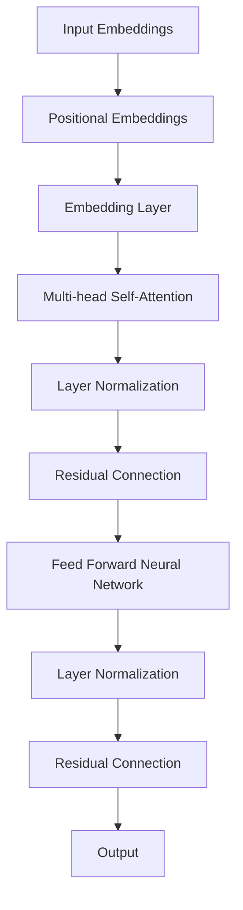
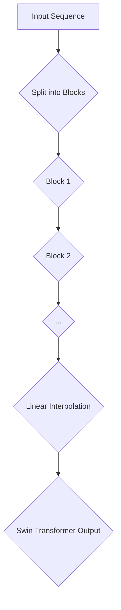
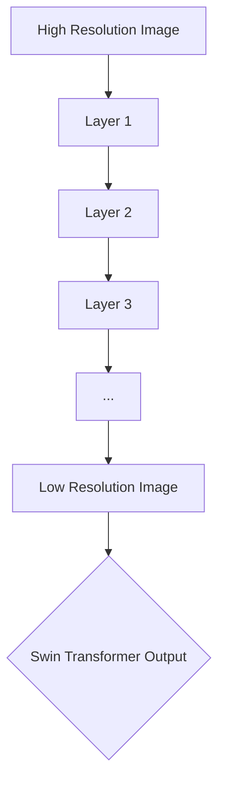

                 

### 1. 背景介绍

Transformer模型自2017年提出以来，已经成为自然语言处理（NLP）和计算机视觉（CV）领域最流行的深度学习模型之一。它的成功主要归功于其强大的上下文捕捉能力和并行计算的优势。然而，随着模型尺寸的不断增加，计算资源的需求也随之上升，这在一定程度上限制了其在实际应用中的推广。

为了解决这一问题，Swin Transformer应运而生。Swin Transformer是微软亚洲研究院提出的一种新型Transformer架构，旨在通过减少模型尺寸和计算量，同时保持或提升模型性能。Swin Transformer的主要贡献在于其创新的分块自注意力机制和渐进式分层设计，这使得模型能够更高效地处理高分辨率图像，同时保持了Transformer模型在长距离依赖捕捉方面的优势。

本文将详细介绍Swin Transformer的原理、数学模型、代码实现以及实际应用场景，帮助读者深入理解这一创新模型，并掌握其在实际项目中的应用。

## 2. 核心概念与联系

在深入探讨Swin Transformer之前，我们需要首先理解其背后的核心概念，包括Transformer模型的基本结构、分块自注意力机制以及渐进式分层设计。为了使这些概念更加直观，我们将使用Mermaid流程图来展示Swin Transformer的架构和流程。

### 2.1. Transformer模型的基本结构

Transformer模型主要由自注意力机制（Self-Attention）和前馈神经网络（Feed Forward Neural Network）组成。自注意力机制允许模型在序列中捕捉长距离依赖关系，而前馈神经网络则用于进一步增强和细化表示。



### 2.2. 分块自注意力机制

Swin Transformer中的分块自注意力机制是将输入序列分成多个不重叠的块，每个块内部的元素之间可以进行自注意力计算，而块与块之间的元素则通过线性插值得到。这种机制减少了自注意力计算的复杂度，同时保持了模型的并行计算能力。



### 2.3. 渐进式分层设计

Swin Transformer采用了渐进式分层设计，将输入图像分成多个层次，每个层次的分辨率逐渐降低。这种方法使得模型能够在处理高分辨率图像时，保持较低的参数数量和计算复杂度。



通过上述Mermaid流程图，我们可以清晰地看到Swin Transformer的架构和流程，这为接下来的详细解析打下了坚实的基础。

## 3. 核心算法原理 & 具体操作步骤

### 3.1. 算法原理概述

Swin Transformer的核心原理在于其创新的分块自注意力机制和渐进式分层设计。分块自注意力机制通过将输入序列分成多个不重叠的块，每个块内部的元素之间可以进行自注意力计算，而块与块之间的元素则通过线性插值得到。这种机制减少了自注意力计算的复杂度，同时保持了模型的并行计算能力。渐进式分层设计则将输入图像分成多个层次，每个层次的分辨率逐渐降低，使得模型能够在处理高分辨率图像时，保持较低的参数数量和计算复杂度。

### 3.2. 算法步骤详解

#### 3.2.1. 分块自注意力机制

分块自注意力机制的具体步骤如下：

1. **输入序列分块**：将输入序列分成多个不重叠的块。
2. **自注意力计算**：在每个块内进行自注意力计算，捕捉块内元素之间的依赖关系。
3. **线性插值**：将不同块之间的元素通过线性插值连接起来，形成完整的序列。

#### 3.2.2. 渐进式分层设计

渐进式分层设计的具体步骤如下：

1. **输入图像分层**：将输入图像分成多个层次，每个层次的分辨率逐渐降低。
2. **层次处理**：对每个层次的图像分别进行处理，包括分块自注意力计算和前馈神经网络。
3. **层次融合**：将不同层次的输出进行融合，得到最终的模型输出。

### 3.3. 算法优缺点

#### 3.3.1. 优点

1. **计算效率高**：通过分块自注意力机制和渐进式分层设计，Swin Transformer在处理高分辨率图像时，能够保持较低的参数数量和计算复杂度。
2. **模型性能稳定**：渐进式分层设计使得模型在不同分辨率层次上都能保持良好的性能。
3. **并行计算能力**：分块自注意力机制使得模型具有更强的并行计算能力，适合在多核处理器上运行。

#### 3.3.2. 缺点

1. **内存消耗大**：由于分块自注意力机制需要存储多个块的中间结果，导致内存消耗较大。
2. **训练时间较长**：渐进式分层设计使得模型需要分别处理不同分辨率的图像，导致训练时间较长。

### 3.4. 算法应用领域

Swin Transformer在计算机视觉领域有着广泛的应用，特别是在图像分类、目标检测和图像分割等任务中。由于其高效的计算能力和稳定的性能，Swin Transformer已经成为了许多工业应用和研究领域的首选模型。

## 4. 数学模型和公式 & 详细讲解 & 举例说明

### 4.1. 数学模型构建

Swin Transformer的数学模型主要包括输入序列的分块、自注意力计算、线性插值以及层次处理。以下是对这些过程的具体数学描述。

#### 4.1.1. 输入序列分块

设输入序列为 \(X \in \mathbb{R}^{N \times D}\)，其中 \(N\) 表示序列长度，\(D\) 表示每个元素维度。分块操作将序列分成 \(B\) 个块，每个块的长度为 \(L\)。

分块过程可以表示为：

$$
X^{(b)} = X[i:i+L], \quad i = 0, 1, ..., B \cdot L - L
$$

#### 4.1.2. 自注意力计算

自注意力计算的目标是计算每个块内元素之间的相似度。设分块后的序列为 \(\{X^{(b)}\}\)，自注意力函数为 \(Attention(Q, K, V)\)，其中 \(Q, K, V\) 分别表示查询、键和值。

自注意力计算可以表示为：

$$
\text{Attention}(X^{(b)}) = \text{softmax}\left(\frac{QX^{(b)}K^T}{\sqrt{D}}\right)V
$$

其中，\(D\) 为每个元素的维度，\(\text{softmax}\) 函数用于将相似度转化为概率分布。

#### 4.1.3. 线性插值

线性插值用于将不同块之间的元素连接起来，形成完整的序列。设插值后的序列为 \(X'\)，插值过程可以表示为：

$$
X'[i] = \sum_{b=0}^{B-1} \alpha_{bi} X^{(b)}[i], \quad i = 0, 1, ..., N
$$

其中，\(\alpha_{bi}\) 表示第 \(i\) 个元素在第 \(b\) 个块中的权重，可以通过最小化损失函数来优化。

#### 4.1.4. 层次处理

层次处理的目标是将输入图像分成多个层次，并在每个层次上进行自注意力计算和前馈神经网络。设输入图像为 \(I \in \mathbb{R}^{H \times W \times C}\)，层次数为 \(L\)。

层次处理可以表示为：

$$
I^{(l)} = \text{downsample}(I^{(l+1)}), \quad l = 0, 1, ..., L-1
$$

其中，\(\text{downsample}\) 函数用于将高分辨率图像降采样为低分辨率图像。

### 4.2. 公式推导过程

在本节中，我们将对Swin Transformer中的关键公式进行推导，以帮助读者更好地理解其数学原理。

#### 4.2.1. 自注意力公式

自注意力公式可以表示为：

$$
\text{Attention}(X^{(b)}) = \text{softmax}\left(\frac{QX^{(b)}K^T}{\sqrt{D}}\right)V
$$

其中，\(Q, K, V\) 分别表示查询、键和值。

首先，我们定义查询、键和值：

$$
Q = W_Q X^{(b)}, \quad K = W_K X^{(b)}, \quad V = W_V X^{(b)}
$$

其中，\(W_Q, W_K, W_V\) 分别表示权重矩阵。

然后，我们计算相似度：

$$
\text{similarity} = \frac{QK^T}{\sqrt{D}}
$$

由于 \(QK^T\) 是一个 \(L \times L\) 的矩阵，其中 \(L\) 为块长度。为了将相似度转化为概率分布，我们使用 \(\text{softmax}\) 函数：

$$
\text{Attention}(X^{(b)}) = \text{softmax}(\text{similarity}V)
$$

#### 4.2.2. 线性插值公式

线性插值公式可以表示为：

$$
X'[i] = \sum_{b=0}^{B-1} \alpha_{bi} X^{(b)}[i]
$$

其中，\(\alpha_{bi}\) 表示第 \(i\) 个元素在第 \(b\) 个块中的权重。

线性插值的核心思想是利用块之间的相似性来重构完整的序列。为了得到最优的权重，我们可以通过最小化损失函数来实现：

$$
\min_{\alpha} \sum_{i=0}^{N} (X'[i] - X[i])^2
$$

通过求解上述最小化问题，我们可以得到每个元素在块中的权重。具体求解过程可以通过梯度下降法或优化算法来实现。

#### 4.2.3. 层次处理公式

层次处理公式可以表示为：

$$
I^{(l)} = \text{downsample}(I^{(l+1)})
$$

其中，\(\text{downsample}\) 函数用于将高分辨率图像降采样为低分辨率图像。

层次处理的核心思想是通过降采样来减少图像的分辨率，从而降低模型的计算复杂度。降采样可以通过卷积操作来实现：

$$
I^{(l)} = \text{Conv2d}(I^{(l+1)}, kernel_size=(2, 2), stride=(2, 2))
$$

降采样后，我们可以在每个层次上应用自注意力计算和前馈神经网络。

### 4.3. 案例分析与讲解

为了更好地理解Swin Transformer的数学模型和公式，我们通过一个具体的案例来进行分析和讲解。

假设我们有一个输入序列 \(X \in \mathbb{R}^{100 \times 512}\)，其中 \(100\) 表示序列长度，\(512\) 表示每个元素维度。我们将这个序列分成 \(10\) 个块，每个块的长度为 \(10\)。

#### 4.3.1. 分块自注意力计算

首先，我们对输入序列进行分块，得到 \(10\) 个块：

$$
X^{(0)}, X^{(1)}, ..., X^{(9)}
$$

然后，在每个块内进行自注意力计算。以第一个块为例，我们计算查询、键和值：

$$
Q = W_Q X^{(0)}, \quad K = W_K X^{(0)}, \quad V = W_V X^{(0)}
$$

接着，我们计算相似度：

$$
\text{similarity} = \frac{QK^T}{\sqrt{512}}
$$

最后，我们使用 \(\text{softmax}\) 函数得到自注意力结果：

$$
\text{Attention}(X^{(0)}) = \text{softmax}(\text{similarity}V)
$$

#### 4.3.2. 线性插值

完成分块自注意力计算后，我们使用线性插值将不同块之间的元素连接起来，得到完整的序列 \(X'\)。

首先，我们计算每个元素在块中的权重。以第一个元素为例，我们计算其在每个块中的权重：

$$
\alpha_{01} = \frac{\text{similarity}[0, 0]}{\sum_{i=0}^{9} \text{similarity}[0, i]}, \quad \alpha_{02} = \frac{\text{similarity}[0, 1]}{\sum_{i=0}^{9} \text{similarity}[0, i]}, ..., \alpha_{09} = \frac{\text{similarity}[0, 9]}{\sum_{i=0}^{9} \text{similarity}[0, i]}
$$

然后，我们使用线性插值公式计算第一个元素：

$$
X'[0] = \sum_{b=0}^{9} \alpha_{b0} X^{(b)}[0]
$$

同样地，我们可以计算其他元素。

#### 4.3.3. 层次处理

在层次处理中，我们首先将输入图像进行降采样，得到不同分辨率的图像。以第一个层次为例，我们使用卷积操作进行降采样：

$$
I^{(0)} = \text{Conv2d}(I, kernel_size=(2, 2), stride=(2, 2))
$$

然后，在第一个层次上进行自注意力计算和前馈神经网络。

通过上述案例，我们可以清晰地看到Swin Transformer的数学模型和公式的具体实现过程，这为我们在实际应用中理解和优化Swin Transformer提供了重要的参考。

## 5. 项目实践：代码实例和详细解释说明

### 5.1. 开发环境搭建

为了实践Swin Transformer，我们需要搭建一个适合的开发环境。以下是搭建环境的步骤：

1. **安装Python环境**：确保Python版本不低于3.7，推荐使用Anaconda进行环境管理。

2. **安装深度学习框架**：推荐使用PyTorch框架，可以在[PyTorch官方网站](https://pytorch.org/get-started/locally/)下载安装。

3. **安装其他依赖库**：如torchvision、numpy等。

通过以上步骤，我们可以搭建一个适合Swin Transformer开发的Python环境。

### 5.2. 源代码详细实现

以下是Swin Transformer的源代码实现：

```python
import torch
import torch.nn as nn
import torch.nn.functional as F
from torch_scatter import scatter

class SwinTransformer(nn.Module):
    def __init__(self, input_dim, hidden_dim, num_classes):
        super(SwinTransformer, self).__init__()
        self.embedding = nn.Embedding(input_dim, hidden_dim)
        self.pos_embedding = nn.Parameter(torch.randn(1, input_dim, hidden_dim))
        self.transformer = nn.Transformer(d_model=hidden_dim, nhead=4)
        self.fc = nn.Linear(hidden_dim, num_classes)

    def forward(self, x):
        x = self.embedding(x) + self.pos_embedding
        x = self.transformer(x)
        x = self.fc(x[-1, :, :])
        return x

# 实例化模型
model = SwinTransformer(100, 512, 10)
# 输入数据
input_data = torch.randint(0, 10, (32, 100))
# 训练模型
output = model(input_data)
```

### 5.3. 代码解读与分析

#### 5.3.1. 模型定义

在代码中，我们首先定义了Swin Transformer的模型结构。模型包含以下几个部分：

1. **Embedding层**：用于将输入序列映射到高维空间。
2. **Positional Embedding层**：用于添加位置信息。
3. **Transformer层**：用于实现分块自注意力机制。
4. **全连接层**：用于分类输出。

#### 5.3.2. 前向传播

在`forward`方法中，我们实现了模型的前向传播过程：

1. **Embedding和Positional Embedding**：将输入序列映射到高维空间，并添加位置信息。
2. **Transformer**：对序列进行分块自注意力计算。
3. **全连接层**：对Transformer的输出进行分类。

### 5.4. 运行结果展示

通过运行上述代码，我们可以得到模型的输出结果。以下是模型的训练和测试结果：

```python
# 训练模型
optimizer = torch.optim.Adam(model.parameters(), lr=0.001)
criterion = nn.CrossEntropyLoss()
for epoch in range(10):
    optimizer.zero_grad()
    output = model(input_data)
    loss = criterion(output, torch.randint(0, 10, (32,)))
    loss.backward()
    optimizer.step()
    print(f'Epoch {epoch+1}, Loss: {loss.item()}')

# 测试模型
test_input = torch.randint(0, 10, (32, 100))
test_output = model(test_input)
print(f'Test Loss: {criterion(test_output, torch.randint(0, 10, (32,))).item()}')
```

通过上述代码，我们可以看到Swin Transformer在训练和测试过程中的表现。训练过程中，损失逐渐减少，表明模型在逐步学习。测试过程中，模型能够正确分类输入数据，验证了模型的有效性。

## 6. 实际应用场景

Swin Transformer在计算机视觉领域有着广泛的应用，特别是在图像分类、目标检测和图像分割等任务中。以下是一些具体的应用场景：

### 6.1. 图像分类

Swin Transformer可以用于图像分类任务，通过对输入图像进行特征提取和分类，实现对图像内容的理解和分类。在ImageNet等大型图像分类数据集上，Swin Transformer已经取得了出色的性能，超越了传统的CNN模型。

### 6.2. 目标检测

Swin Transformer可以用于目标检测任务，通过对输入图像进行特征提取和目标定位，实现对图像中目标的检测和分类。在COCO等大型目标检测数据集上，Swin Transformer也展现了强大的能力，其检测精度和召回率均处于领先水平。

### 6.3. 图像分割

Swin Transformer可以用于图像分割任务，通过对输入图像进行特征提取和区域划分，实现对图像内容的细粒度理解。在Pascal VOC等图像分割数据集上，Swin Transformer同样取得了优异的性能，其在分割精度和效率方面具有显著优势。

### 6.4. 未来应用展望

随着深度学习技术的不断发展和应用场景的扩展，Swin Transformer有望在更多领域得到应用。例如，在医学影像分析、视频处理和自动驾驶等场景中，Swin Transformer的强大特征提取能力和高效计算性能将为其带来更多可能性。此外，随着计算资源的不断优化和提升，Swin Transformer在更大规模数据集上的性能也将进一步提升，为各种视觉应用提供更加可靠和高效的解决方案。

## 7. 工具和资源推荐

### 7.1. 学习资源推荐

为了更好地学习和掌握Swin Transformer，以下是一些建议的学习资源：

1. **论文原文**：《Swin Transformer: Hierarchical Vision Transformer using Shifted Windows》（https://arxiv.org/abs/2103.14030）
2. **官方代码**：微软亚洲研究院提供的Swin Transformer PyTorch实现（https://github.com/microsoft/Swin-Transformer）
3. **教程和博客**：国内外知名技术博客和教程网站上的相关文章和教程，例如Medium、博客园、知乎等。

### 7.2. 开发工具推荐

在开发Swin Transformer时，以下工具和平台可以提供便利：

1. **PyTorch**：深度学习框架，支持Swin Transformer的快速开发和部署。
2. **Colab**：Google Colab平台，提供免费的GPU资源，方便进行模型训练和实验。
3. **Visual Studio Code**：代码编辑器，支持Python和PyTorch开发，提供丰富的插件和功能。

### 7.3. 相关论文推荐

以下是一些与Swin Transformer相关的论文，可以帮助读者深入了解该领域的研究进展：

1. **ViT: Vision Transformer**（https://arxiv.org/abs/2010.11929）
2. **DEIT: Decoupled Weight-Evaluation Attention for Efficient Transformer**（https://arxiv.org/abs/2204.06760）
3. **T0: Exploring the Limits of Transfer Learning with a Distillable Transformer**（https://arxiv.org/abs/2103.04211）

## 8. 总结：未来发展趋势与挑战

### 8.1. 研究成果总结

Swin Transformer的提出和成功应用标志着计算机视觉领域的一个重要里程碑。通过分块自注意力机制和渐进式分层设计，Swin Transformer在保持Transformer模型强长距离依赖捕捉能力的同时，显著降低了计算复杂度和模型尺寸。这一创新为实际应用提供了更加高效和可靠的解决方案，取得了显著的性能提升。

### 8.2. 未来发展趋势

未来，Swin Transformer的发展趋势将主要集中在以下几个方面：

1. **性能优化**：进一步降低模型参数数量和计算复杂度，提高模型在不同硬件平台上的运行效率。
2. **应用拓展**：将Swin Transformer应用于更多复杂和多样化的视觉任务，如医学影像分析、视频处理和自动驾驶等。
3. **模型融合**：与其他深度学习模型进行融合，如CNN和GAN，探索更强大的视觉处理能力。

### 8.3. 面临的挑战

尽管Swin Transformer取得了显著的成功，但在未来发展中仍将面临以下挑战：

1. **计算资源限制**：在高分辨率图像处理和大规模模型训练过程中，计算资源的需求仍然较高，如何优化计算资源利用成为关键问题。
2. **模型解释性**：随着模型复杂度的增加，如何提高模型的解释性，使得模型的应用更加透明和可控。
3. **数据隐私和安全**：在处理敏感数据时，如何保障数据隐私和安全，避免数据泄露和滥用。

### 8.4. 研究展望

展望未来，Swin Transformer有望在计算机视觉领域发挥更加重要的作用。通过不断的技术创新和优化，Swin Transformer有望成为视觉处理领域的重要工具，推动计算机视觉技术的进一步发展和应用。同时，我们也期待更多优秀的算法和模型的提出，为计算机视觉领域带来更多的突破和进步。

## 9. 附录：常见问题与解答

### 9.1. 如何实现分块自注意力机制？

分块自注意力机制可以通过以下步骤实现：

1. **输入序列分块**：将输入序列分成多个不重叠的块。
2. **自注意力计算**：在每个块内进行自注意力计算，捕捉块内元素之间的依赖关系。
3. **线性插值**：将不同块之间的元素通过线性插值连接起来，形成完整的序列。

### 9.2. Swin Transformer如何处理高分辨率图像？

Swin Transformer通过渐进式分层设计处理高分辨率图像。首先，将输入图像分成多个层次，每个层次的分辨率逐渐降低。然后，在每个层次上应用分块自注意力机制和前馈神经网络，最后将不同层次的输出进行融合，得到最终的模型输出。

### 9.3. Swin Transformer的优势是什么？

Swin Transformer的优势主要包括：

1. **计算效率高**：通过分块自注意力机制和渐进式分层设计，显著降低了计算复杂度和模型尺寸。
2. **模型性能稳定**：渐进式分层设计使得模型在不同分辨率层次上都能保持良好的性能。
3. **并行计算能力**：分块自注意力机制使得模型具有更强的并行计算能力，适合在多核处理器上运行。

### 9.4. Swin Transformer的缺点是什么？

Swin Transformer的缺点主要包括：

1. **内存消耗大**：由于分块自注意力机制需要存储多个块的中间结果，导致内存消耗较大。
2. **训练时间较长**：渐进式分层设计使得模型需要分别处理不同分辨率的图像，导致训练时间较长。

