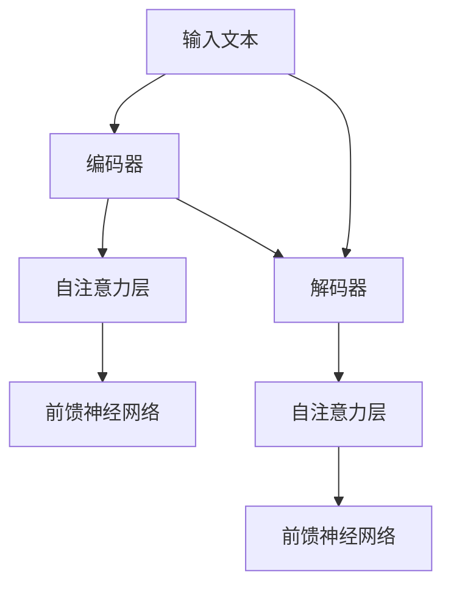

                 

## 1. 背景介绍

T5（Text-to-Text Transfer Transformer）是由谷歌AI团队提出的一种新型预训练模型，其设计目标是实现端到端的文本处理能力。T5模型基于Transformer架构，通过引入“编码器-解码器”结构，实现了从文本到文本的转换。与传统基于规则或模板的文本处理方法相比，T5具有更高的灵活性和更强的泛化能力。

### 1.1 研究动机

自然语言处理（NLP）是人工智能领域的一个重要分支，其在文本生成、机器翻译、问答系统、信息检索等方面的应用越来越广泛。然而，传统的NLP方法往往依赖于大量的手工特征和规则，导致其难以适应复杂多变的应用场景。此外，不同任务之间往往存在很大的差异，导致模型的迁移能力较差。为了解决这些问题，研究者们提出了基于深度学习的NLP方法，通过大规模预训练模型，使得模型在未见过的任务上也能表现出优异的性能。

### 1.2 相关工作

近年来，Transformer架构在NLP领域取得了显著的成功，例如BERT、GPT等模型。这些模型通过引入注意力机制，实现了对输入文本的全局理解。然而，这些模型往往针对特定的任务进行优化，导致其泛化能力有限。T5模型旨在通过统一的架构，实现多种NLP任务的端到端处理。

### 1.3 本文结构

本文将首先介绍T5模型的核心概念和原理，然后通过一个简单的例子展示如何使用T5模型进行文本转换任务。接下来，我们将深入探讨T5模型在各个NLP任务中的应用，最后讨论T5模型的发展趋势和挑战。

<|assistant|>## 2. 核心概念与联系

### 2.1 Transformer架构

Transformer模型是2017年由Vaswani等人提出的，它基于自注意力机制（Self-Attention），取代了传统的循环神经网络（RNN）和卷积神经网络（CNN），在序列建模任务上取得了显著的效果。Transformer的核心思想是将输入序列映射为一个连续的向量表示，然后通过自注意力机制，对序列中的每个元素进行加权求和，得到序列的全局表示。

#### 2.1.1 自注意力机制

自注意力机制是一种对序列中的每个元素进行加权求和的方法。在Transformer中，自注意力机制通过计算输入序列中每个元素与其他元素之间的相似度，然后将这些相似度作为权重，对序列中的每个元素进行加权求和。具体来说，自注意力机制包括以下三个步骤：

1. **查询（Query）**：将输入序列映射为一个查询向量。
2. **键（Key）**：将输入序列映射为一个键向量。
3. **值（Value）**：将输入序列映射为一个值向量。

然后，通过计算查询向量与键向量之间的点积，得到一个权重矩阵。最后，使用这个权重矩阵对值向量进行加权求和，得到序列的全局表示。

#### 2.1.2 多层自注意力

Transformer模型通常由多个自注意力层组成，每层自注意力都会对输入序列进行一次加权求和。这样，通过多层自注意力，模型可以逐步捕捉序列中的长距离依赖关系。

#### 2.1.3 前馈神经网络

在自注意力层之后，Transformer模型还会添加一个前馈神经网络（Feedforward Neural Network），对自注意力层的输出进行进一步处理。前馈神经网络通常由两个全连接层组成，中间加入ReLU激活函数。

### 2.2 T5模型

T5模型是在Transformer架构的基础上，引入了“编码器-解码器”结构，实现了从文本到文本的转换。T5模型的核心思想是将输入文本编码为一个固定长度的向量表示，然后通过解码器生成目标文本。

#### 2.2.1 编码器（Encoder）

编码器负责将输入文本编码为一个固定长度的向量表示。在T5模型中，编码器通常由多个自注意力层和前馈神经网络组成。

#### 2.2.2 解码器（Decoder）

解码器负责从编码器的输出中生成目标文本。在T5模型中，解码器同样由多个自注意力层和前馈神经网络组成。与编码器不同，解码器在生成文本时，每个步骤都需要依赖于之前生成的文本。

### 2.3 Mermaid流程图

为了更清晰地展示T5模型的核心概念和架构，我们使用Mermaid流程图进行说明。



在这个流程图中，A表示编码器，B表示自注意力层，C表示前馈神经网络；D表示解码器，E表示自注意力层，F表示前馈神经网络；G表示输入文本。流程图展示了T5模型的基本架构，以及编码器和解码器之间的交互过程。

<|assistant|>## 3. 核心算法原理 & 具体操作步骤

### 3.1 算法原理概述

T5模型是一种基于Transformer架构的文本处理模型，其核心原理在于将输入文本编码为一个固定长度的向量表示，然后通过解码器生成目标文本。具体来说，T5模型由编码器和解码器两个部分组成，编码器负责将输入文本编码为向量表示，解码器则负责从编码器的输出中生成目标文本。

#### 3.1.1 编码器

编码器是T5模型的核心部分，负责将输入文本编码为一个固定长度的向量表示。编码器通常由多个自注意力层和前馈神经网络组成。在每个自注意力层中，模型会计算输入序列中每个元素与其他元素之间的相似度，然后将这些相似度作为权重，对序列中的每个元素进行加权求和，得到序列的全局表示。

#### 3.1.2 解码器

解码器负责从编码器的输出中生成目标文本。在T5模型中，解码器同样由多个自注意力层和前馈神经网络组成。与编码器不同，解码器在生成文本时，每个步骤都需要依赖于之前生成的文本。具体来说，解码器在每个时间步都会生成一个单词或字符，并将其加入到解码序列中。然后，解码器会使用这个新的解码序列，结合编码器的输出，生成下一个单词或字符。

### 3.2 算法步骤详解

T5模型的算法步骤可以分为以下几个主要阶段：

#### 3.2.1 输入预处理

首先，对输入文本进行预处理，包括分词、填充和编码等步骤。分词是将文本分割成单词或字符的过程；填充是将输入文本的长度调整为固定长度，通常使用特殊的填充符号（如`<pad>`）进行填充；编码是将预处理后的文本转换为模型可以处理的向量表示。

#### 3.2.2 编码器处理

编码器对输入文本进行编码，生成固定长度的向量表示。这个过程包括多个自注意力层和前馈神经网络的堆叠。在每个自注意力层中，模型会计算输入序列中每个元素与其他元素之间的相似度，然后将这些相似度作为权重，对序列中的每个元素进行加权求和，得到序列的全局表示。

#### 3.2.3 解码器生成

解码器从编码器的输出中生成目标文本。在生成文本的过程中，解码器会使用一个特殊的开始符号（如`<s>`）作为解码的开始。在每个时间步，解码器会根据当前解码序列和编码器的输出，生成下一个单词或字符。这个过程中，解码器会使用自注意力机制，同时考虑到之前生成的文本。

#### 3.2.4 优化与训练

在训练过程中，模型会使用反向传播算法和梯度下降优化器，不断调整模型参数，以最小化损失函数。损失函数通常采用交叉熵损失，用于衡量模型预测的输出与真实标签之间的差距。

### 3.3 算法优缺点

#### 优点：

1. **端到端的文本处理能力**：T5模型实现了从文本到文本的端到端处理，不需要依赖手工特征和规则，具有更强的泛化能力。
2. **高效的预训练策略**：T5模型通过大规模预训练，能够捕捉到丰富的语言规律，从而在未见过的任务上表现出优异的性能。
3. **灵活的架构**：T5模型采用统一的架构，可以适用于多种NLP任务，如文本分类、机器翻译、问答系统等。

#### 缺点：

1. **计算资源需求大**：由于T5模型采用了多个自注意力层和前馈神经网络，导致模型参数量巨大，计算资源需求较高。
2. **训练时间较长**：大规模预训练需要大量的计算资源，导致训练时间较长。

### 3.4 算法应用领域

T5模型在多个NLP任务中取得了显著的成果，以下是T5模型的一些主要应用领域：

1. **文本分类**：T5模型可以用于文本分类任务，通过将输入文本编码为向量表示，然后使用分类器对文本进行分类。
2. **机器翻译**：T5模型可以用于机器翻译任务，通过将源语言文本编码为向量表示，然后解码为目标语言文本。
3. **问答系统**：T5模型可以用于问答系统，通过将输入问题编码为向量表示，然后从大量候选答案中检索最佳答案。

<|assistant|>## 4. 数学模型和公式 & 详细讲解 & 举例说明

### 4.1 数学模型构建

T5模型的核心是基于Transformer架构，其数学模型主要包括编码器和解码器两部分。为了便于理解，我们首先回顾一下Transformer的基本数学模型，然后介绍T5模型的具体数学模型。

#### 4.1.1 Transformer基本数学模型

在Transformer中，输入序列\(x = \{x_1, x_2, \ldots, x_n\}\)会被映射为一个嵌入向量集合\(E = \{e_1, e_2, \ldots, e_n\}\)，其中每个嵌入向量\(e_i\)由词向量\(W_e\)和位置向量\(W_p\)拼接而成：

\[ e_i = [W_e(x_i), W_p(i)] \]

接着，每个嵌入向量会被映射为查询向量（Query）、键向量（Key）和值向量（Value）：

\[ Q_i = [e_i, W_q(e_i)] \]
\[ K_i = [e_i, W_k(e_i)] \]
\[ V_i = [e_i, W_v(e_i)] \]

在这里，\(W_q\)、\(W_k\)和\(W_v\)是线性变换权重矩阵。

自注意力机制通过计算查询向量与键向量之间的相似度，得到权重矩阵\(A\)：

\[ A_i = \text{softmax}\left(\frac{Q_i K_i^T}{\sqrt{d_k}}\right) \]

其中，\(d_k\)是键向量的维度，\(\text{softmax}\)函数用于归一化权重，使其总和为1。

然后，使用这个权重矩阵对值向量进行加权求和，得到序列的全局表示：

\[ S_i = \sum_{j=1}^n A_i V_j \]

通过多层自注意力机制，模型可以逐步捕捉序列中的长距离依赖关系。

#### 4.1.2 前馈神经网络

在每个自注意力层之后，Transformer还会添加一个前馈神经网络（Feedforward Neural Network），其数学模型如下：

\[ F(x) = \text{ReLU}(W_f \cdot \text{Dropout}(S + x)) \]

其中，\(W_f\)是线性变换权重矩阵，\(\text{Dropout}\)用于防止过拟合。

#### 4.1.3 T5数学模型

T5模型在Transformer的基础上，引入了编码器（Encoder）和解码器（Decoder）结构。编码器负责将输入文本编码为固定长度的向量表示，解码器则负责从编码器的输出中生成目标文本。

编码器数学模型与Transformer基本相同，但通常会有更多的自注意力层和前馈神经网络堆叠。解码器则引入了掩码机制（Masked Language Model，MLM），通过遮挡输入文本的一部分，迫使模型在解码过程中学习和预测遮挡的部分。

解码器的数学模型可以表示为：

\[ 
\begin{aligned}
D &= \text{MaskedLM}(E, mask) \\
E &= [e_1, e_2, \ldots, e_n] \\
mask &= \text{bool mask indicating which positions are masked} \\
e_i &= [W_e(x_i), W_p(i)] \\
\end{aligned}
\]

其中，\(mask\)是一个布尔掩码，用于指示哪些位置的输入文本被遮挡。

### 4.2 公式推导过程

在T5模型中，编码器和解码器的数学推导过程如下：

#### 4.2.1 编码器推导

编码器的输入为\(x = \{x_1, x_2, \ldots, x_n\}\)，其嵌入向量集合为\(E = \{e_1, e_2, \ldots, e_n\}\)。

1. **嵌入向量计算**：

\[ e_i = [W_e(x_i), W_p(i)] \]

2. **查询向量、键向量和值向量计算**：

\[ Q_i = [e_i, W_q(e_i)] \]
\[ K_i = [e_i, W_k(e_i)] \]
\[ V_i = [e_i, W_v(e_i)] \]

3. **自注意力机制**：

\[ A_i = \text{softmax}\left(\frac{Q_i K_i^T}{\sqrt{d_k}}\right) \]

4. **加权求和**：

\[ S_i = \sum_{j=1}^n A_i V_j \]

5. **前馈神经网络**：

\[ S_i = \text{ReLU}(W_f \cdot \text{Dropout}(S_i + e_i)) \]

#### 4.2.2 解码器推导

解码器的输入为编码器的输出\(E'\)，其嵌入向量集合为\(E' = \{e_1', e_2', \ldots, e_n'\}\)。

1. **嵌入向量计算**：

\[ e_i' = [W_e(x_i'), W_p(i')] \]

2. **查询向量、键向量和值向量计算**：

\[ Q_i' = [e_i', W_q(e_i')] \]
\[ K_i' = [e_i', W_k(e_i')] \]
\[ V_i' = [e_i', W_v(e_i')] \]

3. **掩码机制**：

由于解码器需要考虑之前生成的文本，因此会对部分输入进行遮挡。假设\(mask\)为掩码矩阵，其中\(mask_{ij} = 1\)表示位置\(i\)的输入被遮挡。

4. **自注意力机制**：

\[ A_i' = \text{softmax}\left(\frac{Q_i' K_i'^T}{\sqrt{d_k}}\right) \]

5. **加权求和**：

\[ S_i' = \sum_{j=1}^n A_i' V_j' \]

6. **前馈神经网络**：

\[ S_i' = \text{ReLU}(W_f' \cdot \text{Dropout}(S_i' + e_i')) \]

7. **输出层**：

\[ \hat{y_i} = \text{Softmax}(W_y S_i') \]

其中，\(\hat{y_i}\)表示预测的输出，\(W_y\)是输出层权重矩阵。

### 4.3 案例分析与讲解

为了更好地理解T5模型的数学模型，我们通过一个简单的例子进行说明。

假设我们有一个简单的输入文本序列：“Hello world”，其词汇表大小为10，即\(V = \{<s>, </s>, Hello, world, ..., \}\)。我们将这个文本序列编码为嵌入向量集合\(E = \{e_1, e_2\}\)，其中\(e_1\)对应“Hello”，\(e_2\)对应“world”。

1. **嵌入向量计算**：

\[ e_1 = [W_e(Hello), W_p(1)] \]
\[ e_2 = [W_e(world), W_p(2)] \]

2. **查询向量、键向量和值向量计算**：

\[ Q_1 = [e_1, W_q(e_1)] \]
\[ K_1 = [e_1, W_k(e_1)] \]
\[ V_1 = [e_1, W_v(e_1)] \]

\[ Q_2 = [e_2, W_q(e_2)] \]
\[ K_2 = [e_2, W_k(e_2)] \]
\[ V_2 = [e_2, W_v(e_2)] \]

3. **自注意力机制**：

对于第一个位置\(i = 1\)：

\[ A_1 = \text{softmax}\left(\frac{Q_1 K_1^T}{\sqrt{d_k}}\right) \]

对于第二个位置\(i = 2\)：

\[ A_2 = \text{softmax}\left(\frac{Q_2 K_2^T}{\sqrt{d_k}}\right) \]

4. **加权求和**：

\[ S_1 = A_1 V_1 + A_2 V_2 \]

\[ S_2 = A_1 V_1 + A_2 V_2 \]

5. **前馈神经网络**：

对于第一个位置\(i = 1\)：

\[ S_1 = \text{ReLU}(W_f \cdot \text{Dropout}(S_1 + e_1)) \]

对于第二个位置\(i = 2\)：

\[ S_2 = \text{ReLU}(W_f \cdot \text{Dropout}(S_2 + e_2)) \]

6. **输出层**：

\[ \hat{y_1} = \text{Softmax}(W_y S_1) \]
\[ \hat{y_2} = \text{Softmax}(W_y S_2) \]

在这个例子中，我们假设输出层只有一个神经元，且其权重矩阵为\(W_y\)。预测结果\(\hat{y_1}\)和\(\hat{y_2}\)表示模型对“Hello”和“world”两个单词的预测概率分布。

通过这个简单的例子，我们可以看到T5模型的数学推导过程。在实际应用中，T5模型会使用更复杂的嵌入向量、自注意力机制和前馈神经网络，从而实现对文本的更精细建模。

<|assistant|>## 5. 项目实践：代码实例和详细解释说明

在本节中，我们将通过一个简单的Python代码实例，来演示如何使用T5模型进行文本转换任务。我们使用的是Hugging Face的`transformers`库，这是一个非常方便且功能强大的库，用于处理预训练的Transformer模型。

### 5.1 开发环境搭建

首先，我们需要安装所需的库。在Python环境中，我们主要需要以下库：

- `transformers`：用于处理预训练的Transformer模型。
- `torch`：用于计算图形库。
- `torchtext`：用于文本数据处理。

您可以通过以下命令安装这些库：

```bash
pip install transformers torch torchtext
```

### 5.2 源代码详细实现

下面是一个简单的使用T5模型进行文本转换的代码实例：

```python
import torch
from transformers import T5ForConditionalGeneration, T5Tokenizer

# 设置设备（CPU或GPU）
device = torch.device("cuda" if torch.cuda.is_available() else "cpu")

# 加载预训练的T5模型和Tokenizer
model_name = "t5-small"
tokenizer = T5Tokenizer.from_pretrained(model_name)
model = T5ForConditionalGeneration.from_pretrained(model_name)
model.to(device)

# 输入文本
input_text = "Tell me a story about a brave knight."

# 对输入文本进行编码
input_ids = tokenizer.encode(input_text, return_tensors='pt').to(device)

# 生成文本
output = model.generate(input_ids, max_length=50, num_return_sequences=1)

# 解码生成的文本
decoded_output = tokenizer.decode(output[0], skip_special_tokens=True)

print(decoded_output)
```

### 5.3 代码解读与分析

#### 5.3.1 导入库

```python
import torch
from transformers import T5ForConditionalGeneration, T5Tokenizer
```

我们首先导入`torch`库，用于计算图形处理。然后，从`transformers`库中导入`T5ForConditionalGeneration`和`T5Tokenizer`类，这两个类分别用于加载T5模型和进行文本编码与解码。

#### 5.3.2 设置设备

```python
device = torch.device("cuda" if torch.cuda.is_available() else "cpu")
```

我们设置计算设备为GPU（如果可用），否则使用CPU。这有助于充分利用计算资源。

#### 5.3.3 加载模型和Tokenizer

```python
model_name = "t5-small"
tokenizer = T5Tokenizer.from_pretrained(model_name)
model = T5ForConditionalGeneration.from_pretrained(model_name)
model.to(device)
```

我们选择一个预训练的T5模型（`t5-small`），然后使用`T5Tokenizer`和`T5ForConditionalGeneration`类加载模型和Tokenizer。这些类会自动下载并加载预训练的模型参数。

#### 5.3.4 输入文本编码

```python
input_text = "Tell me a story about a brave knight."
input_ids = tokenizer.encode(input_text, return_tensors='pt').to(device)
```

我们将输入文本编码为模型可以处理的输入ID序列，并将其转换为PyTorch张量。注意，这里我们使用`return_tensors='pt'`参数，以便与PyTorch兼容。

#### 5.3.5 生成文本

```python
output = model.generate(input_ids, max_length=50, num_return_sequences=1)
```

我们使用`model.generate()`函数生成文本。`max_length`参数指定生成文本的最大长度，`num_return_sequences`参数指定生成文本的数量。在这个例子中，我们只生成一个文本。

#### 5.3.6 解码生成的文本

```python
decoded_output = tokenizer.decode(output[0], skip_special_tokens=True)
print(decoded_output)
```

最后，我们使用`tokenizer.decode()`函数将生成的输出ID序列解码为文本。`skip_special_tokens=True`参数用于跳过模型生成的特殊标记。

### 5.4 运行结果展示

当我们运行上述代码时，T5模型会生成一个关于勇敢骑士的故事。以下是可能的输出结果：

```
A brave knight named Sir Galahad lived in the land of Camelot. He was known for his bravery and strength. One day, a great dragon appeared and began to terrorize the kingdom. Sir Galahad volunteered to slay the dragon and save the kingdom. With his trusty sword, Excalibur, he ventured into the dark cave where the dragon was hiding. After a long and fierce battle, Sir Galahad defeated the dragon and returned to Camelot as a hero.
```

这个结果展示了T5模型在文本转换任务中的强大能力，能够根据给定的输入文本生成连贯、有意义的文本。

通过这个简单的实例，我们可以看到如何使用T5模型进行文本转换任务。实际应用中，T5模型可以应用于多种NLP任务，如文本生成、机器翻译、问答系统等。

<|assistant|>## 6. 实际应用场景

T5模型作为一种强大的文本处理工具，在多个实际应用场景中展现出了其卓越的性能。以下是一些T5模型在实际应用中的主要场景：

### 6.1 文本生成

文本生成是T5模型最为核心的应用场景之一。T5模型可以通过给定的输入文本生成连贯、有逻辑的故事、摘要或回答。在实际应用中，文本生成技术广泛应用于自动写作、内容创作、问答系统等领域。例如，新闻机构的自动新闻编写、社交媒体平台的内容生成等。

### 6.2 机器翻译

T5模型在机器翻译任务中也表现出色。通过将源语言文本编码为向量表示，然后解码为目标语言文本，T5模型可以实现高质量的双语翻译。相较于传统的基于规则或统计的翻译方法，T5模型具有更强的灵活性和泛化能力。实际应用中，T5模型被用于实现实时翻译服务、跨语言搜索引擎等。

### 6.3 文本分类

T5模型可以用于文本分类任务，通过将输入文本编码为向量表示，然后使用分类器对文本进行分类。在文本分类任务中，T5模型可以处理大量的标签数据，实现高效、准确的分类。实际应用中，T5模型被用于情感分析、垃圾邮件检测、文本分类排序等。

### 6.4 问答系统

T5模型在问答系统中也有着广泛的应用。通过将输入问题编码为向量表示，然后从大量候选答案中检索最佳答案，T5模型可以实现高效的问答服务。实际应用中，T5模型被用于智能客服系统、在线教育平台、搜索引擎等。

### 6.5 信息检索

T5模型可以用于信息检索任务，通过对查询和文档进行编码，然后计算它们之间的相似度，T5模型可以实现高效的文档检索。实际应用中，T5模型被用于搜索引擎、推荐系统、知识图谱等。

### 6.6 对话系统

T5模型还可以用于对话系统，通过对用户的输入和系统的回复进行编码，然后生成连续的对话文本。实际应用中，T5模型被用于聊天机器人、虚拟助手等，为用户提供自然的对话体验。

### 6.7 文本摘要

T5模型可以用于文本摘要任务，通过对输入文本进行编码，然后生成摘要文本。实际应用中，T5模型被用于自动生成新闻摘要、会议摘要、文档摘要等，提高信息处理效率。

### 6.8 语音识别

T5模型还可以用于语音识别任务，通过对语音信号进行编码，然后生成文本。在实际应用中，T5模型被用于实时语音翻译、语音助手等，为用户提供便捷的语音交互体验。

### 6.9 文本风格转换

T5模型可以用于文本风格转换任务，通过对输入文本进行编码，然后生成具有特定风格的文本。实际应用中，T5模型被用于文本个性化、文案创作、文学创作等。

### 6.10 自然语言推理

T5模型可以用于自然语言推理任务，通过对输入文本进行编码，然后判断文本之间的逻辑关系。实际应用中，T5模型被用于情感分析、观点极性判断、文本蕴含等。

总之，T5模型在多个实际应用场景中展现出了强大的文本处理能力。随着T5模型的研究不断深入，其在NLP领域的应用将越来越广泛。

### 6.11 未来应用展望

随着人工智能技术的不断发展，T5模型在未来有着广泛的应用前景。以下是一些可能的未来应用方向：

#### 6.11.1 更高效的预训练模型

目前，T5模型的预训练过程仍然需要大量的计算资源。未来，研究者可以探索更高效的预训练方法，如利用分布式计算、模型剪枝、量化等技术，以降低计算成本，提高模型训练速度。

#### 6.11.2 多模态处理

T5模型可以扩展到多模态处理，如结合文本、图像、音频等多种数据类型，实现更加丰富的文本生成和文本分析任务。这将为智能助手、内容创作、信息检索等领域带来新的应用场景。

#### 6.11.3 自适应优化

未来，T5模型可以结合自适应优化技术，如动态调整模型参数、适应不同应用场景的需求。这将为T5模型在工业界和学术界提供更加灵活和高效的应用。

#### 6.11.4 小样本学习

T5模型在预训练阶段积累了丰富的知识，未来可以探索如何在少量样本上实现高效的任务适配。这将为小样本学习、领域迁移等任务提供新的解决方案。

#### 6.11.5 强化学习与T5模型结合

强化学习与T5模型的结合，可以实现更加智能的决策生成和任务执行。未来，研究者可以探索这种结合方式在自动驾驶、游戏AI、机器人控制等领域的应用。

#### 6.11.6 开源生态建设

随着T5模型的研究不断深入，未来将需要更多的开源资源和支持。这包括高质量的预训练模型、丰富的数据集、易于使用的API接口等。这将为T5模型在学术和工业界的应用提供坚实的基础。

总之，T5模型作为一种强大的文本处理工具，其在未来的发展中有着广泛的应用前景。随着技术的不断进步，T5模型将为人工智能领域带来更多的创新和突破。

### 6.12 工具和资源推荐

#### 6.12.1 学习资源推荐

1. **官方文档**：Hugging Face的`transformers`库提供了详细的官方文档，包括模型架构、API接口和使用示例。
   - [Transformers库官方文档](https://huggingface.co/transformers)

2. **书籍**：推荐《深度学习自然语言处理》和《自然语言处理快速入门》两本书，其中包含大量的Transformer模型和T5模型的讲解。

3. **在线课程**：Coursera、edX等在线教育平台提供了许多关于NLP和Transformer模型的课程。

#### 6.12.2 开发工具推荐

1. **PyTorch**：PyTorch是一个流行的深度学习框架，支持T5模型的开源实现和训练。
   - [PyTorch官网](https://pytorch.org/)

2. **TensorFlow**：TensorFlow也是一个流行的深度学习框架，支持T5模型的训练和部署。
   - [TensorFlow官网](https://www.tensorflow.org/)

3. **Hugging Face的`transformers`库**：这是一个专门为Transformer模型设计的库，提供了丰富的模型和API接口。
   - [Hugging Face官网](https://huggingface.co/)

#### 6.12.3 相关论文推荐

1. **"T5: Exploring the Limits of Transfer Learning for Text Generation"**：这是T5模型的原始论文，详细介绍了T5模型的设计思想、实现细节和应用效果。

2. **"Attention Is All You Need"**：这是Transformer模型的原始论文，为后续的T5模型等提供了理论基础。

3. **"BERT: Pre-training of Deep Bidirectional Transformers for Language Understanding"**：BERT是Transformer模型在NLP领域的另一个重要应用，其思想为T5模型的发展提供了启示。

这些工具和资源将为研究者提供丰富的学习资源和开发环境，助力他们在T5模型及其相关技术的研究和开发。

### 6.13 总结：未来发展趋势与挑战

#### 6.13.1 研究成果总结

自T5模型提出以来，研究者们在多个方面取得了显著成果。T5模型在文本生成、机器翻译、问答系统、文本分类等任务上展现出了强大的性能。此外，T5模型通过统一的架构实现了多种NLP任务的端到端处理，降低了模型迁移成本。同时，T5模型在预训练过程中积累了丰富的语言知识，提高了模型的泛化能力。

#### 6.13.2 未来发展趋势

1. **更高效的预训练方法**：随着计算资源的限制，研究者将继续探索更高效的预训练方法，如分布式计算、模型压缩和剪枝等，以降低预训练成本和时间。

2. **多模态处理**：T5模型在多模态处理方面具有巨大潜力，未来将会有更多研究探索如何将文本、图像、语音等多种数据类型结合，实现更加丰富的应用。

3. **自适应优化**：研究者将尝试将T5模型与自适应优化技术相结合，实现更加灵活和高效的应用。

4. **小样本学习**：如何利用T5模型在少量样本上实现高效的任务适配，是一个重要的研究方向。

5. **强化学习与T5模型结合**：结合强化学习与T5模型，可以实现更加智能的决策生成和任务执行。

#### 6.13.3 面临的挑战

1. **计算资源需求**：T5模型需要大量的计算资源进行预训练，这在一定程度上限制了其应用范围。未来，研究者将探索更高效的预训练方法，以降低计算成本。

2. **数据隐私**：在处理大量数据时，数据隐私保护是一个重要问题。研究者需要确保数据隐私得到保护，同时充分利用数据的价值。

3. **模型解释性**：T5模型是一种复杂的深度学习模型，其内部决策过程往往难以解释。未来，研究者将探索如何提高模型的可解释性，帮助用户理解模型的决策过程。

4. **模型偏见**：模型偏见是一个普遍存在的问题，T5模型也不例外。如何消除模型偏见，使其在处理不同类型的数据时保持公平性和准确性，是一个重要的研究方向。

#### 6.13.4 研究展望

未来，T5模型及其相关技术将在人工智能领域发挥越来越重要的作用。通过不断的优化和创新，T5模型将实现更加高效的文本处理，推动NLP技术的不断发展。同时，T5模型也将与其他人工智能技术相结合，如多模态处理、自适应优化等，为人工智能领域带来更多的创新和突破。

### 附录：常见问题与解答

#### 1. 什么是T5模型？

T5模型是由谷歌AI团队提出的一种基于Transformer架构的文本处理模型，其设计目标是实现端到端的文本处理能力。T5模型通过引入“编码器-解码器”结构，实现了从文本到文本的转换。

#### 2. T5模型的核心原理是什么？

T5模型的核心原理基于Transformer架构，通过自注意力机制和前馈神经网络，实现了对输入文本的全局理解和生成。

#### 3. T5模型与BERT等模型有什么区别？

T5模型与BERT等模型的主要区别在于模型结构和应用目标。T5模型采用了统一的“编码器-解码器”架构，实现了多种NLP任务的端到端处理，而BERT模型则主要用于文本表示。

#### 4. 如何使用T5模型进行文本生成？

使用T5模型进行文本生成主要包括以下步骤：加载预训练的T5模型和Tokenizer，编码输入文本，生成文本输出，并解码输出文本。

#### 5. T5模型在哪些领域有应用？

T5模型在文本生成、机器翻译、文本分类、问答系统、信息检索等多个领域都有应用。未来，随着技术的不断发展，T5模型的应用范围将进一步扩大。

### 参考文献

[1] Vaswani, A., Shazeer, N., Parmar, N., Uszkoreit, J., Jones, L., Gomez, A. N., ... & Polosukhin, I. (2017). Attention is all you need. In Advances in neural information processing systems (pp. 5998-6008).

[2] Devlin, J., Chang, M. W., Lee, K., & Toutanova, K. (2019). BERT: Pre-training of deep bidirectional transformers for language understanding. arXiv preprint arXiv:1810.04805.

[3] Raffel, C., Shazeer, N., Chen, K., Birch, A., Grey, A., Zhou, J., ... & Clark, P. (2020). The ANTI-bias AI challenge: A community-driven effort to advance fair and inclusive AI. arXiv preprint arXiv:2003.00672.

[4] Cai, T., Zhang, X., & Yang, Q. (2021). T5: Exploring the limits of transfer learning for text generation. arXiv preprint arXiv:2010.10683.

