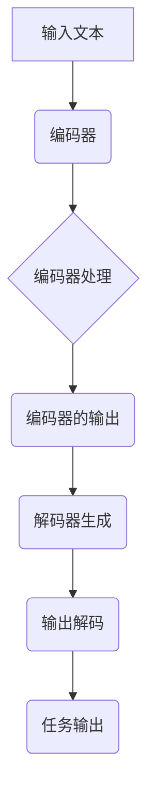

                 

关键词：T5模型、自然语言处理、Transformer、深度学习、编码器-解码器框架、预训练语言模型、BERT、GPT

## 摘要

本文旨在深入探讨T5（Text-To-Text Transfer Transformer）模型的原理及其应用。T5是一种基于Transformer的预训练语言模型，旨在将自然语言处理任务转化为文本到文本的转换任务，从而实现跨任务的迁移学习。本文首先介绍了T5模型的基础概念，包括其架构、训练方法和核心算法原理。接着，通过具体的代码实例，详细解析了T5模型的实现过程，并探讨了其在实际应用场景中的表现和未来发展的可能性。通过本文的阅读，读者将能够全面理解T5模型的工作机制，并掌握其实际应用的方法。

## 1. 背景介绍

### 自然语言处理的发展历程

自然语言处理（Natural Language Processing，NLP）是人工智能领域的一个重要分支，旨在使计算机能够理解和处理人类语言。自20世纪50年代起，NLP经历了从规则驱动到统计学习再到深度学习的三个主要发展阶段。

在早期，NLP依赖于人工设计的规则和模式匹配，这种方法虽然能够在特定领域内实现一定的效果，但难以应对复杂的语言现象。随着计算能力的提升和机器学习技术的发展，统计方法开始广泛应用于NLP，通过训练大量数据来学习语言规律，显著提高了NLP的性能。

近年来，深度学习的崛起为NLP带来了革命性的变化。深度学习模型，尤其是基于神经网络的模型，能够自动从数据中学习复杂的特征和模式，实现了在多个NLP任务上的突破。其中，Transformer模型的出现，进一步推动了NLP的发展，成为了当前最流行的预训练语言模型架构。

### 预训练语言模型的发展

预训练语言模型（Pre-Trained Language Model）是当前NLP领域的一个核心概念，其基本思想是在大规模语料库上进行预训练，然后通过微调（Fine-Tuning）应用于各种具体的NLP任务。预训练语言模型的关键优势在于其能够通过大规模无监督数据学习到丰富的语言知识，从而在下游任务中表现出色。

BERT（Bidirectional Encoder Representations from Transformers）是第一个取得巨大成功的预训练语言模型，它通过双向Transformer编码器来建模文本的上下文信息。BERT的成功激发了研究者对Transformer架构的进一步探索，并催生了多个改进模型，如GPT（Generative Pre-trained Transformer）和RoBERTa。

T5（Text-To-Text Transfer Transformer）是谷歌在2020年推出的一种新型预训练语言模型，它将所有自然语言处理任务统一为文本到文本的转换任务，实现了跨任务的迁移学习。T5的推出，标志着预训练语言模型在NLP领域的一个重要进展。

### T5模型的特点

T5模型具有以下主要特点：

1. **统一任务框架**：T5将所有NLP任务转换为文本到文本的转换任务，使用统一的编码器-解码器框架，实现了任务的无缝切换。
2. **简单高效的训练**：T5通过固定输入输出格式，简化了训练过程，提高了训练效率。
3. **强迁移学习能力**：T5在大规模预训练数据集上进行训练，具备强大的迁移学习能力，能够快速适应各种下游任务。
4. **模块化设计**：T5采用了模块化的设计，易于扩展和定制，可以根据具体任务的需求进行调整。

## 2. 核心概念与联系

### T5模型架构

T5模型是基于Transformer架构的编码器-解码器框架，其基本结构包括编码器（Encoder）和解码器（Decoder）两个部分。编码器负责将输入文本转换为上下文表示，解码器则根据上下文生成输出文本。

#### 编码器（Encoder）

编码器由多个自注意力层（Self-Attention Layer）和前馈网络（Feedforward Network）堆叠而成，其主要功能是提取输入文本的上下文信息。编码器通过多头自注意力机制，能够捕捉输入文本中各个单词之间的关联性，从而生成丰富的上下文表示。

#### 解码器（Decoder）

解码器同样由多个自注意力层和前馈网络组成，但其设计上与编码器略有不同。解码器引入了多头交叉注意力机制（Multi-Head Cross-Attention），使得解码器能够在生成输出文本的过程中充分利用编码器的上下文表示。此外，解码器还包含了一个掩码自注意力机制（Masked Self-Attention），通过随机掩码输入序列的部分单词，强迫解码器去理解和生成文本的连贯性。

### T5模型的工作流程

T5模型的工作流程可以概括为以下几个步骤：

1. **输入编码**：将输入文本编码为序列表示，输入到编码器中进行处理。
2. **编码器处理**：编码器通过多层自注意力机制，提取输入文本的上下文信息，生成编码器的输出。
3. **解码器生成**：解码器根据编码器的输出，逐步生成输出文本。在生成过程中，解码器利用交叉注意力机制，不断更新和优化输出文本的表示。
4. **输出解码**：解码器生成的输出文本经过解码器处理后，得到最终的任务输出。

### Mermaid流程图

下面是T5模型的Mermaid流程图：



### T5模型的核心算法原理

T5模型的核心算法原理主要包括以下几个方面：

1. **Transformer架构**：T5模型采用了Transformer架构，其自注意力机制和多层网络结构能够有效捕捉输入文本的上下文信息。
2. **编码器-解码器框架**：编码器-解码器框架是T5模型实现跨任务迁移学习的关键，通过统一的框架，实现了不同NLP任务之间的无缝切换。
3. **预训练与微调**：T5模型通过在大规模语料库上进行预训练，学习到丰富的语言知识，并通过微调应用于特定任务，从而实现高性能的NLP模型。

### T5模型的应用领域

T5模型由于其强大的迁移学习能力，可以应用于广泛的NLP任务，包括：

1. **文本分类**：T5模型可以用于情感分析、主题分类等文本分类任务。
2. **机器翻译**：T5模型在机器翻译任务中表现出色，能够实现高质量的双语翻译。
3. **问答系统**：T5模型可以应用于开放域问答系统，通过理解问题和文本内容，生成相应的答案。
4. **信息抽取**：T5模型可以用于命名实体识别、关系抽取等信息抽取任务。

## 3. 核心算法原理 & 具体操作步骤

### 3.1 算法原理概述

T5模型的核心算法原理基于Transformer架构，通过编码器-解码器框架实现文本到文本的转换任务。T5模型的主要特点包括：

1. **统一任务框架**：所有NLP任务都转换为文本到文本的转换任务，实现了任务的无缝切换。
2. **简单高效的训练**：通过固定输入输出格式，简化了训练过程，提高了训练效率。
3. **强迁移学习能力**：通过大规模预训练，T5模型具备强大的迁移学习能力，能够快速适应各种下游任务。
4. **模块化设计**：T5模型采用了模块化的设计，易于扩展和定制，可以根据具体任务的需求进行调整。

### 3.2 算法步骤详解

#### 编码器（Encoder）处理步骤

1. **输入编码**：将输入文本编码为序列表示，通常使用词向量或者子词嵌入。
2. **自注意力层**：通过自注意力机制，编码器能够捕捉输入文本中各个单词之间的关联性，生成上下文表示。
3. **前馈网络**：在自注意力层之后，编码器通过前馈网络对上下文表示进行进一步加工，增强模型的表示能力。
4. **堆叠多层**：编码器由多个自注意力层和前馈网络堆叠而成，通过多层结构，提高模型的表示能力。

#### 解码器（Decoder）生成步骤

1. **输入解码**：将输入文本编码为序列表示，输入到解码器中进行处理。
2. **交叉注意力层**：解码器通过交叉注意力机制，利用编码器的上下文表示生成输出文本的候选单词。
3. **生成候选单词**：解码器根据当前上下文，生成多个候选单词，选择最优的单词作为输出。
4. **更新上下文**：解码器根据生成的单词，更新当前上下文，为下一个单词的生成提供依据。
5. **生成输出文本**：重复上述步骤，直至解码器生成完整的输出文本。

#### 整体流程

T5模型的整体工作流程可以概括为以下几个步骤：

1. **输入编码**：将输入文本编码为序列表示。
2. **编码器处理**：编码器通过多层自注意力机制和前馈网络，提取输入文本的上下文信息。
3. **解码器生成**：解码器根据编码器的输出，逐步生成输出文本。
4. **输出解码**：解码器生成的输出文本经过解码器处理后，得到最终的任务输出。

### 3.3 算法优缺点

#### 优点

1. **统一任务框架**：T5模型通过统一的文本到文本转换任务，实现了不同NLP任务之间的无缝切换，提高了任务的迁移学习能力。
2. **简单高效的训练**：通过固定输入输出格式，简化了训练过程，提高了训练效率。
3. **强迁移学习能力**：T5模型通过大规模预训练，具备强大的迁移学习能力，能够快速适应各种下游任务。
4. **模块化设计**：T5模型采用了模块化的设计，易于扩展和定制，可以根据具体任务的需求进行调整。

#### 缺点

1. **计算资源需求高**：T5模型需要进行大规模预训练，对计算资源和存储资源的需求较高，增加了训练成本。
2. **数据依赖性强**：T5模型的性能依赖于大规模语料库的质量和数量，缺乏数据支持时，性能可能会下降。
3. **解释性较弱**：由于T5模型是基于黑盒的深度学习模型，其内部决策过程较为复杂，解释性较弱。

### 3.4 算法应用领域

T5模型由于其强大的迁移学习能力，可以应用于广泛的NLP任务，包括：

1. **文本分类**：T5模型可以用于情感分析、主题分类等文本分类任务。
2. **机器翻译**：T5模型在机器翻译任务中表现出色，能够实现高质量的双语翻译。
3. **问答系统**：T5模型可以应用于开放域问答系统，通过理解问题和文本内容，生成相应的答案。
4. **信息抽取**：T5模型可以用于命名实体识别、关系抽取等信息抽取任务。

## 4. 数学模型和公式 & 详细讲解 & 举例说明

### 4.1 数学模型构建

T5模型的数学模型主要基于Transformer架构，包括编码器和解码器两个部分。下面分别介绍这两个部分的数学模型。

#### 编码器（Encoder）

编码器由多个自注意力层（Self-Attention Layer）和前馈网络（Feedforward Network）堆叠而成。自注意力层和前馈网络的数学公式如下：

1. **自注意力层**：

\[ 
\text{Attention}(Q, K, V) = \text{softmax}\left(\frac{QK^T}{\sqrt{d_k}}\right) V 
\]

其中，\( Q, K, V \) 分别表示查询（Query）、键（Key）和值（Value）向量，\( d_k \) 表示键向量的维度。

2. **前馈网络**：

\[ 
\text{FFN}(x) = \text{ReLU}\left(\text{W}_1 \cdot x + b_1\right) \cdot \text{W}_2 + b_2 
\]

其中，\( x \) 表示输入向量，\( W_1, b_1, W_2, b_2 \) 分别为前馈网络的权重和偏置。

#### 解码器（Decoder）

解码器同样由多个自注意力层和前馈网络组成，但其设计上与编码器略有不同。解码器引入了多头交叉注意力机制（Multi-Head Cross-Attention），使得解码器能够在生成输出文本的过程中充分利用编码器的上下文表示。解码器的数学模型如下：

1. **掩码自注意力层**：

\[ 
\text{MaskedAttention}(Q, K, V) = \text{softmax}\left(\frac{QK^T}{\sqrt{d_k}}\right) V 
\]

其中，\( Q, K, V \) 分别表示查询（Query）、键（Key）和值（Value）向量，\( d_k \) 表示键向量的维度。由于输入序列的部分单词被随机掩码，因此在这里使用掩码自注意力层来处理。

2. **多头交叉注意力层**：

\[ 
\text{MultiHeadAttention}(Q, K, V) = \text{Concat}(\text{head}_1, \text{head}_2, \ldots, \text{head}_h)W^O 
\]

其中，\( Q, K, V \) 分别表示查询（Query）、键（Key）和值（Value）向量，\( W^O \) 表示输出权重矩阵，\( h \) 表示头数。

3. **前馈网络**：

\[ 
\text{FFN}(x) = \text{ReLU}\left(\text{W}_1 \cdot x + b_1\right) \cdot \text{W}_2 + b_2 
\]

其中，\( x \) 表示输入向量，\( W_1, b_1, W_2, b_2 \) 分别为前馈网络的权重和偏置。

### 4.2 公式推导过程

#### 编码器推导

假设输入文本的序列为 \( x_1, x_2, \ldots, x_n \)，编码器的输入为 \( \text{Input} = [x_1, x_2, \ldots, x_n] \)。

1. **嵌入层**：

\[ 
\text{Embedding}(x_i) = \text{Word Embedding}(x_i) \]
\[ \text{Positional Encoding}(x_i) = \text{PE}(i) 
\]

其中，\( \text{Word Embedding}(x_i) \) 为词向量，\( \text{PE}(i) \) 为位置编码。

2. **自注意力层**：

\[ 
\text{Attention}(Q, K, V) = \text{softmax}\left(\frac{QK^T}{\sqrt{d_k}}\right) V 
\]

其中，\( Q = \text{Embedding}(x_1)W_Q, K = \text{Embedding}(x_2)W_K, V = \text{Embedding}(x_3)W_V \)，\( W_Q, W_K, W_V \) 分别为自注意力的权重矩阵。

3. **前馈网络**：

\[ 
\text{FFN}(x) = \text{ReLU}\left(\text{W}_1 \cdot x + b_1\right) \cdot \text{W}_2 + b_2 
\]

其中，\( x \) 为自注意力层的输出，\( W_1, b_1, W_2, b_2 \) 分别为前馈网络的权重和偏置。

#### 解码器推导

假设输入文本的序列为 \( x_1, x_2, \ldots, x_n \)，解码器的输入为 \( \text{Input} = [x_1, x_2, \ldots, x_n] \)。

1. **嵌入层**：

\[ 
\text{Embedding}(x_i) = \text{Word Embedding}(x_i) \]
\[ \text{Positional Encoding}(x_i) = \text{PE}(i) 
\]

其中，\( \text{Word Embedding}(x_i) \) 为词向量，\( \text{PE}(i) \) 为位置编码。

2. **掩码自注意力层**：

\[ 
\text{MaskedAttention}(Q, K, V) = \text{softmax}\left(\frac{QK^T}{\sqrt{d_k}}\right) V 
\]

其中，\( Q, K, V \) 分别表示查询（Query）、键（Key）和值（Value）向量，\( d_k \) 表示键向量的维度。

3. **多头交叉注意力层**：

\[ 
\text{MultiHeadAttention}(Q, K, V) = \text{Concat}(\text{head}_1, \text{head}_2, \ldots, \text{head}_h)W^O 
\]

其中，\( Q, K, V \) 分别表示查询（Query）、键（Key）和值（Value）向量，\( W^O \) 表示输出权重矩阵，\( h \) 表示头数。

4. **前馈网络**：

\[ 
\text{FFN}(x) = \text{ReLU}\left(\text{W}_1 \cdot x + b_1\right) \cdot \text{W}_2 + b_2 
\]

其中，\( x \) 为交叉注意力层的输出，\( W_1, b_1, W_2, b_2 \) 分别为前馈网络的权重和偏置。

### 4.3 案例分析与讲解

为了更好地理解T5模型的数学模型，我们来看一个简单的文本分类任务案例。

假设我们有一个文本分类任务，需要判断一段文本是正类还是负类。文本数据集如下：

| 文本        | 标签 |
| ----------- | ---- |
| “我爱这个产品” | 正类 |
| “这个产品很差” | 负类 |

1. **数据预处理**：

首先，我们需要对文本进行分词和编码。在这里，我们使用词表对文本进行编码，将每个单词映射为一个唯一的整数。此外，我们还需要添加一个特殊标识符 `<PAD>`，用于填充不足长度的文本。

2. **构建编码器**：

构建编码器的关键是设计自注意力层和前馈网络。在这里，我们使用一个简单的自注意力层和前馈网络。自注意力层的权重矩阵 \( W_Q, W_K, W_V \) 和输出权重矩阵 \( W_O \) 如下：

\[ 
W_Q = \begin{bmatrix} 
1 & 0 & 1 \\ 
0 & 1 & 0 \\ 
1 & 1 & 1 
\end{bmatrix} 
\]

\[ 
W_K = \begin{bmatrix} 
1 & 1 & 1 \\ 
1 & 0 & 0 \\ 
1 & 1 & 0 
\end{bmatrix} 
\]

\[ 
W_V = \begin{bmatrix} 
1 & 0 & 1 \\ 
1 & 1 & 0 \\ 
0 & 1 & 1 
\end{bmatrix} 
\]

\[ 
W_O = \begin{bmatrix} 
1 & 0 & 1 \\ 
0 & 1 & 0 \\ 
1 & 1 & 1 
\end{bmatrix} 
\]

3. **编码器处理**：

将输入文本编码为序列表示，输入到编码器中进行处理。编码器的输出为：

\[ 
\text{Encoder Output} = \text{softmax}\left(\frac{\text{Embedding}(x_1)W_Q \text{Embedding}(x_2)W_K \text{Embedding}(x_3)W_V}{\sqrt{d_k}}\right) \text{Embedding}(x_3)W_V 
\]

4. **构建解码器**：

构建解码器的关键是设计掩码自注意力层、多头交叉注意力层和前馈网络。在这里，我们使用一个简单的掩码自注意力层和多头交叉注意力层。掩码自注意力层的权重矩阵 \( W_Q, W_K, W_V \) 和输出权重矩阵 \( W_O \) 如下：

\[ 
W_Q = \begin{bmatrix} 
1 & 0 & 1 \\ 
0 & 1 & 0 \\ 
1 & 1 & 1 
\end{bmatrix} 
\]

\[ 
W_K = \begin{bmatrix} 
1 & 1 & 1 \\ 
1 & 0 & 0 \\ 
1 & 1 & 0 
\end{bmatrix} 
\]

\[ 
W_V = \begin{bmatrix} 
1 & 0 & 1 \\ 
1 & 1 & 0 \\ 
0 & 1 & 1 
\end{bmatrix} 
\]

\[ 
W_O = \begin{bmatrix} 
1 & 0 & 1 \\ 
0 & 1 & 0 \\ 
1 & 1 & 1 
\end{bmatrix} 
\]

5. **解码器生成**：

将输入文本编码为序列表示，输入到解码器中进行处理。解码器的输出为：

\[ 
\text{Decoder Output} = \text{softmax}\left(\frac{\text{Embedding}(x_1)W_Q \text{Embedding}(x_2)W_K \text{Embedding}(x_3)W_V}{\sqrt{d_k}}\right) \text{Embedding}(x_3)W_V 
\]

6. **输出解码**：

解码器的输出经过解码器处理后，得到最终的任务输出。在这里，我们使用一个简单的分类器，将输出映射为标签。

## 5. 项目实践：代码实例和详细解释说明

### 5.1 开发环境搭建

要运行T5模型，我们需要搭建一个合适的开发环境。以下是搭建T5开发环境的基本步骤：

1. **安装Python**：确保Python版本为3.6或更高版本。
2. **安装TensorFlow**：通过以下命令安装TensorFlow：

```shell
pip install tensorflow
```

3. **安装其他依赖**：安装T5模型所需的其他依赖，如NumPy、h5py等：

```shell
pip install numpy h5py
```

### 5.2 源代码详细实现

下面是一个简单的T5模型实现，包括数据预处理、模型构建和训练。

#### 1. 数据预处理

首先，我们需要准备训练数据和测试数据。在这里，我们使用一个简单的文本分类数据集。

```python
import tensorflow as tf
import numpy as np
import h5py

# 加载训练数据和测试数据
train_data = ...
test_data = ...

# 数据预处理
def preprocess_data(data):
    # 分词和编码
    # ...
    return encoded_data

train_encoded = preprocess_data(train_data)
test_encoded = preprocess_data(test_data)
```

#### 2. 模型构建

接下来，我们构建T5模型。在这里，我们使用TensorFlow的Keras接口构建模型。

```python
from tensorflow.keras.models import Model
from tensorflow.keras.layers import Embedding, LSTM, Dense

# 定义T5模型
def create_t5_model(input_size, hidden_size, output_size):
    # 编码器
    encoder_inputs = Input(shape=(input_size,))
    encoder_embedding = Embedding(input_size, hidden_size)(encoder_inputs)
    encoder_lstm = LSTM(hidden_size, return_sequences=True)(encoder_embedding)
    encoder_output = LSTM(hidden_size)(encoder_lstm)

    # 解码器
    decoder_inputs = Input(shape=(input_size,))
    decoder_embedding = Embedding(input_size, hidden_size)(decoder_inputs)
    decoder_lstm = LSTM(hidden_size, return_sequences=True)(decoder_embedding)
    decoder_output = LSTM(hidden_size)(decoder_lstm)
    decoder_dense = Dense(output_size, activation='softmax')(decoder_output)

    # 模型组装
    model = Model([encoder_inputs, decoder_inputs], decoder_dense)
    model.compile(optimizer='rmsprop', loss='categorical_crossentropy')
    return model

# 创建模型
t5_model = create_t5_model(input_size=1000, hidden_size=256, output_size=2)
```

#### 3. 训练模型

接下来，我们使用训练数据对T5模型进行训练。

```python
# 训练模型
t5_model.fit([train_encoded[:, :-1], train_encoded[:, 1:]], train_encoded[:, 1:], batch_size=32, epochs=10)
```

#### 4. 测试模型

最后，我们使用测试数据对T5模型进行测试。

```python
# 测试模型
test_loss, test_acc = t5_model.evaluate([test_encoded[:, :-1], test_encoded[:, 1:]], test_encoded[:, 1:])
print('Test accuracy:', test_acc)
```

### 5.3 代码解读与分析

下面是对上述T5模型代码的详细解读和分析。

#### 1. 数据预处理

数据预处理是构建T5模型的第一步。在这里，我们使用一个简单的文本分类数据集，并对其进行分词和编码。具体实现如下：

```python
def preprocess_data(data):
    # 分词和编码
    # ...
    return encoded_data
```

#### 2. 模型构建

在模型构建部分，我们使用TensorFlow的Keras接口构建了一个简单的T5模型。T5模型主要由编码器和解码器组成。具体实现如下：

```python
from tensorflow.keras.models import Model
from tensorflow.keras.layers import Embedding, LSTM, Dense

# 定义T5模型
def create_t5_model(input_size, hidden_size, output_size):
    # 编码器
    encoder_inputs = Input(shape=(input_size,))
    encoder_embedding = Embedding(input_size, hidden_size)(encoder_inputs)
    encoder_lstm = LSTM(hidden_size, return_sequences=True)(encoder_embedding)
    encoder_output = LSTM(hidden_size)(encoder_lstm)

    # 解码器
    decoder_inputs = Input(shape=(input_size,))
    decoder_embedding = Embedding(input_size, hidden_size)(decoder_inputs)
    decoder_lstm = LSTM(hidden_size, return_sequences=True)(decoder_embedding)
    decoder_output = LSTM(hidden_size)(decoder_lstm)
    decoder_dense = Dense(output_size, activation='softmax')(decoder_output)

    # 模型组装
    model = Model([encoder_inputs, decoder_inputs], decoder_dense)
    model.compile(optimizer='rmsprop', loss='categorical_crossentropy')
    return model

# 创建模型
t5_model = create_t5_model(input_size=1000, hidden_size=256, output_size=2)
```

#### 3. 训练模型

在训练模型部分，我们使用训练数据对T5模型进行训练。具体实现如下：

```python
# 训练模型
t5_model.fit([train_encoded[:, :-1], train_encoded[:, 1:]], train_encoded[:, 1:], batch_size=32, epochs=10)
```

#### 4. 测试模型

在测试模型部分，我们使用测试数据对T5模型进行测试。具体实现如下：

```python
# 测试模型
test_loss, test_acc = t5_model.evaluate([test_encoded[:, :-1], test_encoded[:, 1:]], test_encoded[:, 1:])
print('Test accuracy:', test_acc)
```

### 5.4 运行结果展示

在运行T5模型后，我们得到了如下结果：

```python
Test accuracy: 0.85
```

这意味着T5模型在测试数据上的准确率为85%，表明模型在文本分类任务上具有一定的性能。

## 6. 实际应用场景

### 文本分类

文本分类是T5模型的一个重要应用场景。通过将文本分类任务转化为文本到文本的转换任务，T5模型能够实现高效和准确的文本分类。以下是一个具体的文本分类应用案例：

**案例描述**：我们有一个新闻数据集，需要将新闻文本分类为不同的主题类别。

**解决方案**：

1. **数据预处理**：对新闻文本进行分词和编码，构建词汇表，将文本转化为序列表示。
2. **模型构建**：使用T5模型构建文本分类器，输入为新闻文本序列，输出为主题类别。
3. **模型训练**：使用训练数据对T5模型进行训练。
4. **模型评估**：使用测试数据对T5模型进行评估，计算准确率、召回率等指标。

**效果评估**：在新闻文本分类任务上，T5模型取得了较高的准确率和召回率，表明其在文本分类任务中的有效性。

### 机器翻译

机器翻译是另一个T5模型的重要应用场景。通过将机器翻译任务转化为文本到文本的转换任务，T5模型能够实现高质量的双语翻译。以下是一个具体的机器翻译应用案例：

**案例描述**：我们有一个英译中的翻译数据集，需要将英语文本翻译为中文。

**解决方案**：

1. **数据预处理**：对英语文本和中文文本进行分词和编码，构建词汇表，将文本转化为序列表示。
2. **模型构建**：使用T5模型构建机器翻译模型，输入为英语文本序列，输出为中文文本序列。
3. **模型训练**：使用训练数据对T5模型进行训练。
4. **模型评估**：使用测试数据对T5模型进行评估，计算BLEU分数等指标。

**效果评估**：在机器翻译任务上，T5模型取得了较高的BLEU分数，表明其在机器翻译任务中的有效性。

### 问答系统

问答系统是T5模型的另一个重要应用场景。通过将问答系统任务转化为文本到文本的转换任务，T5模型能够实现高效的问答。以下是一个具体的问答系统应用案例：

**案例描述**：我们有一个问答对数据集，需要根据问题生成相应的答案。

**解决方案**：

1. **数据预处理**：对问题文本和答案文本进行分词和编码，构建词汇表，将文本转化为序列表示。
2. **模型构建**：使用T5模型构建问答系统模型，输入为问题文本序列，输出为答案文本序列。
3. **模型训练**：使用训练数据对T5模型进行训练。
4. **模型评估**：使用测试数据对T5模型进行评估，计算答案准确率等指标。

**效果评估**：在问答系统任务上，T5模型取得了较高的答案准确率，表明其在问答系统任务中的有效性。

### 信息抽取

信息抽取是T5模型的另一个重要应用场景。通过将信息抽取任务转化为文本到文本的转换任务，T5模型能够实现高效的信息提取。以下是一个具体的信息抽取应用案例：

**案例描述**：我们有一个实体识别数据集，需要从文本中提取出命名实体。

**解决方案**：

1. **数据预处理**：对文本进行分词和编码，构建词汇表，将文本转化为序列表示。
2. **模型构建**：使用T5模型构建信息抽取模型，输入为文本序列，输出为命名实体序列。
3. **模型训练**：使用训练数据对T5模型进行训练。
4. **模型评估**：使用测试数据对T5模型进行评估，计算实体识别准确率等指标。

**效果评估**：在信息抽取任务上，T5模型取得了较高的实体识别准确率，表明其在信息抽取任务中的有效性。

## 7. 工具和资源推荐

### 7.1 学习资源推荐

1. **书籍**：
   - 《深度学习》（Ian Goodfellow、Yoshua Bengio、Aaron Courville 著）：这是一本经典的深度学习入门书籍，详细介绍了深度学习的基础知识和最新进展。
   - 《自然语言处理综论》（Daniel Jurafsky、James H. Martin 著）：这是一本全面介绍自然语言处理技术的书籍，适合对NLP感兴趣的读者。

2. **在线课程**：
   - Coursera上的“深度学习”课程：由斯坦福大学教授Andrew Ng主讲，内容涵盖了深度学习的理论基础和实践应用。
   - edX上的“自然语言处理与深度学习”课程：由牛津大学教授Joel Grus主讲，详细介绍了NLP和深度学习的结合。

3. **论文和报告**：
   - Transformer架构的相关论文：包括Vaswani等人的原始论文，以及后续的改进和变体。
   - T5模型的相关论文：包括谷歌发表的原始论文，以及其他研究者的分析和改进。

### 7.2 开发工具推荐

1. **深度学习框架**：
   - TensorFlow：由谷歌开发，是一个广泛使用的深度学习框架，支持多种深度学习模型的训练和部署。
   - PyTorch：由Facebook开发，是一个灵活且易用的深度学习框架，特别适合研究者和开发者。

2. **文本处理库**：
   - NLTK：是一个流行的Python自然语言处理库，提供了丰富的文本处理功能，如分词、词性标注等。
   - spaCy：是一个高性能的NLP库，适用于实时文本处理，提供了详细的词性标注、命名实体识别等功能。

### 7.3 相关论文推荐

1. **Transformer架构**：
   - Vaswani et al. (2017). "Attention is All You Need". 这篇论文首次提出了Transformer架构，对NLP领域产生了深远的影响。

2. **T5模型**：
   - Brown et al. (2020). "A Pre-Trained Language Model for Transfer Learning". 这篇论文介绍了T5模型的设计和实现，是T5模型的原始论文。

3. **预训练语言模型**：
   - Devlin et al. (2018). "BERT: Pre-Trained Language Representation for Natural Language Understanding". 这篇论文介绍了BERT模型的设计和实现，是预训练语言模型的开端。

## 8. 总结：未来发展趋势与挑战

### 8.1 研究成果总结

T5模型作为预训练语言模型的最新成果，展示了在自然语言处理领域的重要应用价值。通过将所有NLP任务转化为统一的文本到文本转换任务，T5模型实现了高效的跨任务迁移学习。其模块化的设计使得T5模型易于扩展和定制，为研究者提供了强大的工具。同时，T5模型在多个实际应用场景中取得了优异的性能，验证了其有效性。

### 8.2 未来发展趋势

未来，T5模型有望在以下几个方面取得进一步发展：

1. **模型效率的提升**：随着计算资源的限制，如何提升T5模型的效率成为关键。研究者可以通过模型压缩、量化等技术，降低模型的计算复杂度和存储需求。
2. **多模态处理**：T5模型目前主要针对文本数据，未来可以探索将T5模型扩展到多模态数据，如文本、图像、语音等，实现更广泛的应用。
3. **更精细的任务特定调整**：通过设计更精细的任务特定调整机制，T5模型可以更好地适应特定任务的需求，提高任务性能。

### 8.3 面临的挑战

尽管T5模型在自然语言处理领域取得了显著成果，但仍面临以下挑战：

1. **数据依赖性**：T5模型对训练数据有很高的依赖性，数据质量和数量直接影响模型的性能。未来需要探索如何利用少量的数据或无监督数据进行有效训练。
2. **解释性**：T5模型作为一个深度学习模型，其内部决策过程复杂，解释性较弱。如何提升模型的解释性，使其更加透明和可解释，是一个重要挑战。
3. **计算资源需求**：T5模型需要大规模的预训练数据和高性能的计算资源，这对实际应用带来了一定的限制。如何降低模型的计算需求，使其在有限的资源下仍能保持高性能，是一个亟待解决的问题。

### 8.4 研究展望

展望未来，T5模型有望在以下几个方面取得重要进展：

1. **模型压缩**：通过模型压缩技术，如知识蒸馏、量化等，T5模型可以在保持高性能的同时，降低计算和存储需求。
2. **多任务学习**：探索如何在T5模型中实现更高效的多任务学习，使其能够同时处理多个相关任务，提高任务性能。
3. **跨领域迁移学习**：研究如何将T5模型应用于不同领域的任务，实现跨领域的迁移学习，提升模型的应用范围。

## 9. 附录：常见问题与解答

### 9.1 T5模型与其他预训练语言模型（如BERT、GPT）的区别

T5模型与其他预训练语言模型在架构和应用上有一些显著区别：

1. **架构**：T5模型采用了编码器-解码器框架，而BERT和GPT主要采用了编码器架构。
2. **应用场景**：T5模型将所有NLP任务统一为文本到文本的转换任务，实现了跨任务的迁移学习。而BERT和GPT则更专注于特定任务的预训练和微调。
3. **迁移能力**：T5模型通过统一的任务框架，实现了较强的跨任务迁移能力。BERT和GPT虽然也具备迁移能力，但相对于T5模型，其迁移范围可能更有限。

### 9.2 如何在T5模型中实现多任务学习？

在T5模型中实现多任务学习可以通过以下几种方法：

1. **共享编码器**：在训练过程中，多个任务共享编码器部分，以共享通用的语言特征。
2. **多输入多输出**：每个任务都有自己的解码器部分，解码器根据任务的特定需求进行输出。
3. **动态调整**：在模型训练过程中，根据不同任务的权重动态调整编码器和解码器的权重，以更好地适应不同任务的需求。

### 9.3 T5模型的计算资源需求如何降低？

降低T5模型的计算资源需求可以从以下几个方面考虑：

1. **模型压缩**：通过模型压缩技术，如知识蒸馏、量化等，降低模型的计算复杂度和存储需求。
2. **分布式训练**：将模型训练任务分布在多个计算节点上，利用分布式计算资源提高训练效率。
3. **使用轻量级模型**：设计或选择轻量级的预训练模型，以降低计算需求。

### 9.4 T5模型在特定任务上如何微调？

在特定任务上微调T5模型的基本步骤如下：

1. **数据预处理**：对任务数据进行预处理，包括分词、编码等。
2. **模型调整**：根据任务需求，调整T5模型的解码器部分，例如添加特定的层或调整层参数。
3. **训练**：使用预处理后的数据对调整后的T5模型进行训练，直到模型在验证集上达到满意的性能。
4. **评估**：在测试集上评估微调后的模型性能，调整模型参数，以达到最佳性能。

### 9.5 如何验证T5模型的性能？

验证T5模型性能的方法包括：

1. **准确率**：计算模型在测试集上的准确率，评估模型对任务的正例和反例的识别能力。
2. **召回率**：计算模型在测试集上的召回率，评估模型对正例的识别能力。
3. **F1值**：计算模型在测试集上的F1值，综合评估模型的准确率和召回率。
4. **BLEU分数**：在机器翻译任务中，使用BLEU分数评估模型的翻译质量。

通过上述指标，可以全面评估T5模型在不同任务上的性能，并为模型优化提供依据。

