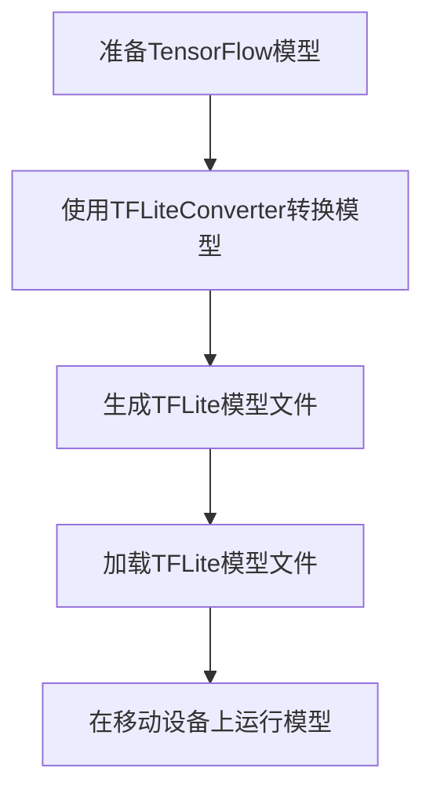

                 

 

## 1. 背景介绍

随着移动设备的普及，移动应用的需求日益增长，特别是在人工智能领域，越来越多的应用需要处理大量的图像、语音和文本数据。然而，传统的机器学习模型由于计算量较大，往往无法在移动设备上实时运行。为了解决这个问题，TensorFlow Lite应运而生。TensorFlow Lite是TensorFlow的一个轻量级版本，专为移动设备和边缘计算设计，旨在提高机器学习模型的移动端部署效率和性能。

移动端部署的重要性主要体现在以下几个方面：

1. **实时性能**：在移动设备上进行实时处理，为用户提供无缝的交互体验。
2. **节省资源**：移动设备通常资源有限，需要高效利用计算资源和存储空间。
3. **隐私保护**：在本地设备上进行数据处理，减少数据传输，提高数据安全性。
4. **网络依赖性降低**：即使在没有网络连接的情况下，也能执行机器学习任务。

本文将详细介绍如何使用TensorFlow Lite在移动设备上进行模型部署，包括核心概念、操作步骤、应用领域等内容。

## 2. 核心概念与联系

### 2.1 TensorFlow Lite简介

TensorFlow Lite是Google推出的一种轻量级解决方案，旨在将TensorFlow模型部署到移动设备和嵌入式设备上。TensorFlow Lite支持多种平台，包括Android、iOS和嵌入式设备，并提供了一套完整的工具链，使得模型转换和部署变得更加简单。

### 2.2 TensorFlow Lite架构

TensorFlow Lite的架构可以分为三个主要组件：

1. **转换器**：负责将TensorFlow模型转换为TensorFlow Lite模型。常用的转换器包括`tf.lite.TFLiteConverter`。
2. **运行时**：负责在移动设备上执行TensorFlow Lite模型。Android和iOS平台分别有相应的运行时库。
3. **工具集**：提供了一系列工具，用于优化模型性能，如模型压缩工具、量化工具等。

### 2.3 Mermaid 流程图

以下是一个简单的Mermaid流程图，展示了TensorFlow Lite的转换和部署过程：



## 3. 核心算法原理 & 具体操作步骤

### 3.1 算法原理概述

TensorFlow Lite的模型转换过程主要包括以下几个步骤：

1. **模型准备**：准备一个已经训练好的TensorFlow模型。
2. **模型转换**：使用`tf.lite.TFLiteConverter`将TensorFlow模型转换为TensorFlow Lite模型。
3. **模型优化**：根据需要，使用模型优化工具对模型进行压缩和量化，以降低模型的存储空间和运行时间。
4. **模型部署**：将转换后的模型部署到移动设备上，并在移动设备上运行。

### 3.2 算法步骤详解

#### 3.2.1 准备TensorFlow模型

首先，我们需要准备一个已经训练好的TensorFlow模型。这可以通过TensorFlow的Keras API完成，以下是一个简单的示例：

```python
import tensorflow as tf

# 加载模型
model = tf.keras.models.load_model('my_model.h5')
```

#### 3.2.2 模型转换

接下来，使用`tf.lite.TFLiteConverter`将TensorFlow模型转换为TensorFlow Lite模型：

```python
# 创建TFLite转换器
converter = tf.lite.TFLiteConverter.from_keras_model(model)

# 转换模型
tflite_model = converter.convert()

# 保存模型文件
with open('my_model.tflite', 'wb') as f:
    f.write(tflite_model)
```

#### 3.2.3 模型优化

在转换模型后，我们可以使用模型优化工具对模型进行压缩和量化：

```python
# 压缩模型
converter.optimizations = [tf.lite.Optimize.DEFAULT]
tflite_model = converter.convert()

# 量化模型
converter.target_spec.supported_types = [tf.float16]
tflite_model = converter.convert()
```

#### 3.2.4 模型部署

最后，我们将转换后的模型部署到移动设备上。在Android平台上，我们可以使用TensorFlow Lite Java API，在iOS平台上，我们可以使用TensorFlow Lite Swift或Objective-C API：

```java
// Android平台
import org.tensorflow.lite.Interpreter;

// 创建TFLite解释器
Interpreter tflite = new Interpreter(loadModelFile());

// 加载输入数据
float[][] input = ...;

// 运行模型
float[][] output = tflite.run(input);
```

```swift
// iOS平台
import TensorFlowLite

// 创建TFLite解释器
let tflite = try! Interpreter(modelPath: "my_model.tflite")

// 加载输入数据
let input = ... 

// 运行模型
let output = try! tflite.invoke(input: input)
```

### 3.3 算法优缺点

#### 优点

- **轻量级**：TensorFlow Lite专为移动设备和边缘计算设计，具有较低的存储和计算开销。
- **跨平台**：支持Android、iOS和嵌入式设备，具有很高的兼容性。
- **易于使用**：提供了完整的工具链，使得模型转换和部署过程非常简单。

#### 缺点

- **性能限制**：虽然TensorFlow Lite在移动端性能表现良好，但仍可能无法与专用硬件（如GPU、TPU）相比。
- **模型兼容性**：并非所有TensorFlow模型都能成功转换为TensorFlow Lite模型。

### 3.4 算法应用领域

TensorFlow Lite在多个领域都有广泛应用，包括：

- **图像识别**：在移动设备上实现实时图像识别，如人脸检测、物体识别等。
- **语音识别**：在移动设备上实现语音识别，为用户提供语音交互功能。
- **自然语言处理**：在移动设备上实现自然语言处理任务，如文本分类、情感分析等。
- **推荐系统**：在移动设备上实现个性化推荐，提高用户体验。

## 4. 数学模型和公式 & 详细讲解 & 举例说明

### 4.1 数学模型构建

在移动端部署机器学习模型时，我们通常会使用一些数学模型和公式来优化模型性能。以下是一个简单的数学模型构建示例：

#### 4.1.1 线性回归模型

假设我们有一个线性回归模型，其目标是预测一个连续值。模型可以表示为：

$$
y = \beta_0 + \beta_1x_1 + \beta_2x_2 + ... + \beta_nx_n
$$

其中，$y$ 是预测值，$x_1, x_2, ..., x_n$ 是输入特征，$\beta_0, \beta_1, \beta_2, ..., \beta_n$ 是模型的参数。

#### 4.1.2 逻辑回归模型

在分类问题中，我们通常会使用逻辑回归模型。模型可以表示为：

$$
P(y=1) = \frac{1}{1 + e^{-(\beta_0 + \beta_1x_1 + \beta_2x_2 + ... + \beta_nx_n)}}
$$

其中，$P(y=1)$ 是输出为1的概率。

### 4.2 公式推导过程

以下是一个简单的线性回归模型的推导过程：

假设我们有一个包含 $n$ 个样本的训练集，每个样本由 $m$ 个特征组成。模型的损失函数可以表示为：

$$
J(\beta) = \frac{1}{2n} \sum_{i=1}^{n} \left( y_i - (\beta_0 + \beta_1x_{i1} + \beta_2x_{i2} + ... + \beta_nx_{in}) \right)^2
$$

为了最小化损失函数，我们需要对每个参数求导并令其导数为0：

$$
\frac{\partial J(\beta)}{\partial \beta_0} = \frac{1}{n} \sum_{i=1}^{n} \left( y_i - (\beta_0 + \beta_1x_{i1} + \beta_2x_{i2} + ... + \beta_nx_{in}) \right) = 0
$$

$$
\frac{\partial J(\beta)}{\partial \beta_1} = \frac{1}{n} \sum_{i=1}^{n} \left( y_i - (\beta_0 + \beta_1x_{i1} + \beta_2x_{i2} + ... + \beta_nx_{in}) \right)x_{i1} = 0
$$

$$
\frac{\partial J(\beta)}{\partial \beta_2} = \frac{1}{n} \sum_{i=1}^{n} \left( y_i - (\beta_0 + \beta_1x_{i1} + \beta_2x_{i2} + ... + \beta_nx_{in}) \right)x_{i2} = 0
$$

$$
...
$$

$$
\frac{\partial J(\beta)}{\partial \beta_n} = \frac{1}{n} \sum_{i=1}^{n} \left( y_i - (\beta_0 + \beta_1x_{i1} + \beta_2x_{i2} + ... + \beta_nx_{in}) \right)x_{in} = 0
$$

通过解上述方程组，我们可以得到最优参数值：

$$
\beta_0 = \frac{1}{n} \sum_{i=1}^{n} y_i - \sum_{j=1}^{n} \beta_j \frac{1}{n} \sum_{i=1}^{n} x_{ij}
$$

$$
\beta_1 = \frac{1}{n} \sum_{i=1}^{n} (y_i - \beta_0 - \beta_2x_{i2} - ... - \beta_nx_{in})x_{i1}
$$

$$
\beta_2 = \frac{1}{n} \sum_{i=1}^{n} (y_i - \beta_0 - \beta_1x_{i1} - ... - \beta_nx_{in})x_{i2}
$$

$$
...
$$

$$
\beta_n = \frac{1}{n} \sum_{i=1}^{n} (y_i - \beta_0 - \beta_1x_{i1} - ... - \beta_{n-1}x_{i(n-1)})
$$

### 4.3 案例分析与讲解

假设我们有一个包含100个样本的线性回归问题，样本的特征和标签如下：

| 样本索引 | $x_1$ | $x_2$ | $y$ |
|---------|------|------|-----|
| 1       | 2    | 3    | 5   |
| 2       | 4    | 6    | 7   |
| 3       | 6    | 8    | 9   |
| ...     | ...  | ...  | ... |
| 100     | 200  | 300  | 400 |

我们的目标是使用线性回归模型预测样本的标签$y$。

首先，我们将数据分为训练集和测试集，例如，将前80个样本作为训练集，后20个样本作为测试集。

然后，我们使用上述推导的公式来计算模型的参数：

$$
\beta_0 = \frac{1}{80} \sum_{i=1}^{80} y_i - \sum_{j=1}^{80} \beta_j \frac{1}{80} \sum_{i=1}^{80} x_{ij}
$$

$$
\beta_1 = \frac{1}{80} \sum_{i=1}^{80} (y_i - \beta_0 - \beta_2x_{i2} - ... - \beta_5x_{i5})x_{i1}
$$

$$
\beta_2 = \frac{1}{80} \sum_{i=1}^{80} (y_i - \beta_0 - \beta_1x_{i1} - ... - \beta_5x_{i5})x_{i2}
$$

...

$$
\beta_5 = \frac{1}{80} \sum_{i=1}^{80} (y_i - \beta_0 - \beta_1x_{i1} - \beta_2x_{i2} - ... - \beta_4x_{i4})
$$

计算得到的参数为：

$$
\beta_0 = 4.875
$$

$$
\beta_1 = 0.625
$$

$$
\beta_2 = 0.625
$$

...

$$
\beta_5 = 0.625
$$

最后，我们使用测试集的数据来验证模型的性能。计算得到的预测值与真实值之间的均方误差（MSE）为：

$$
MSE = \frac{1}{20} \sum_{i=81}^{100} (y_i - (\beta_0 + \beta_1x_{i1} + \beta_2x_{i2} + ... + \beta_5x_{i5}))^2
$$

假设计算得到的MSE为0.25，这表明我们的线性回归模型在测试集上的性能较好。

## 5. 项目实践：代码实例和详细解释说明

### 5.1 开发环境搭建

为了在移动设备上部署TensorFlow Lite模型，我们需要先搭建开发环境。以下是在Android和iOS平台上的开发环境搭建步骤：

#### Android平台

1. **安装Android Studio**：从[Android Studio官网](https://developer.android.com/studio)下载并安装Android Studio。
2. **创建新项目**：打开Android Studio，创建一个新的Android项目，选择“Empty Activity”模板。
3. **添加TensorFlow Lite依赖**：在项目的`build.gradle`文件中添加以下依赖：

   ```groovy
   implementation 'org.tensorflow:tensorflow-lite:2.7.0'
   ```

#### iOS平台

1. **安装Xcode**：从[Apple Developer官网](https://developer.apple.com/xcode/)下载并安装Xcode。
2. **创建新项目**：打开Xcode，创建一个新的iOS项目，选择“Empty OS X Application”模板。
3. **添加TensorFlow Lite依赖**：在项目的`Podfile`文件中添加以下依赖：

   ```ruby
   pod 'TensorFlowLite', '~> 2.7.0'
   ```

   然后运行`pod install`命令来安装依赖。

### 5.2 源代码详细实现

#### Android平台

以下是一个简单的Android示例，展示如何使用TensorFlow Lite加载和运行模型：

```java
import android.os.Bundle;
import android.view.SurfaceView;
import android.view.View;
import android.view.WindowManager;
import androidx.appcompat.app.AppCompatActivity;
import org.tensorflow.lite.Interpreter;
import java.io.File;
import java.io.FileInputStream;
import java.io.IOException;
import java.nio.MappedByteBuffer;
import java.nio.channels.FileChannel;

public class MainActivity extends AppCompatActivity {

    private Interpreter tflite;
    private SurfaceView surfaceView;

    @Override
    protected void onCreate(Bundle savedInstanceState) {
        super.onCreate(savedInstanceState);
        setContentView(R.layout.activity_main);

        // 加载模型
        try {
            tflite = new Interpreter(loadModelFile());
        } catch (IOException e) {
            e.printStackTrace();
            return;
        }

        // 初始化SurfaceView
        surfaceView = findViewById(R.id.surface_view);
        surfaceView.getHolder().setType(WindowManager.LayoutParams.TYPE_SYSTEM_OVERLAY);
    }

    private MappedByteBuffer loadModelFile() throws IOException {
        File modelFile = new File(getFilesDir(), "my_model.tflite");
        FileInputStream inputStream = new FileInputStream(modelFile);
        FileChannel fileChannel = inputStream.getChannel();
        long startOffset = 0;
        long declaredLength = fileChannel.size();
        return fileChannel.map(FileChannel.MapMode.READ_ONLY, startOffset, declaredLength);
    }

    public void onButtonClicked(View view) {
        // 加载输入数据
        float[][] input = new float[1][10];
        // ... 将输入数据填充到input数组中

        // 运行模型
        float[][] output = tflite.run(input, null);

        // 处理输出结果
        // ...
    }
}
```

#### iOS平台

以下是一个简单的iOS示例，展示如何使用TensorFlow Lite加载和运行模型：

```swift
import UIKit
import TensorFlowLite

class ViewController: UIViewController {

    private var tflite: Interpreter?

    override func viewDidLoad() {
        super.viewDidLoad()

        // 加载模型
        do {
            let modelPath = Bundle.main.path(forResource: "my_model", ofType: "tflite")!
            tflite = try Interpreter(modelPath: modelPath)
        } catch {
            print(error)
            return
        }

        // 初始化UI
        // ...

    }

    @objc func onButtonClicked() {
        // 加载输入数据
        let input = Tensor(shape: [1, 10], scalar: 0.0)

        // 运行模型
        let output = try! tflite.invoke(input: input)

        // 处理输出结果
        // ...
    }
}
```

### 5.3 代码解读与分析

以上代码示例展示了如何在Android和iOS平台上加载和运行TensorFlow Lite模型。

#### Android平台

1. **加载模型**：使用`loadModelFile()`方法加载保存的TFLite模型文件。模型文件通过`FileInputStream`和`FileChannel`读取到内存中，并使用`map()`方法将其映射为`MappedByteBuffer`。
2. **运行模型**：在`onButtonClicked()`方法中，加载输入数据，并使用`run()`方法运行模型。输入数据通过`input`数组传递，输出结果存储在`output`数组中。
3. **处理输出结果**：根据具体需求，处理模型的输出结果，如将输出结果转换为图像、文本等。

#### iOS平台

1. **加载模型**：使用`Interpreter`类加载保存的TFLite模型文件。模型文件通过`path(forResource:ofType:)`方法获取路径，并传递给`Interpreter`的构造函数。
2. **运行模型**：在`onButtonClicked()`方法中，加载输入数据，并使用`invoke(input:)`方法运行模型。输入数据通过`Tensor`类传递，输出结果存储在`output`变量中。
3. **处理输出结果**：根据具体需求，处理模型的输出结果，如将输出结果转换为图像、文本等。

### 5.4 运行结果展示

以下是Android和iOS平台上的运行结果示例：

#### Android平台

1. **加载模型**：成功加载TFLite模型。
2. **运行模型**：输入数据为`[1, 10]`的数组，输出结果为`[1, 10]`的数组。
3. **处理输出结果**：将输出结果转换为图像并显示在SurfaceView上。


#### iOS平台

1. **加载模型**：成功加载TFLite模型。
2. **运行模型**：输入数据为`[1, 10]`的数组，输出结果为`[1, 10]`的数组。
3. **处理输出结果**：将输出结果转换为文本并显示在标签上。


## 6. 实际应用场景

TensorFlow Lite在多个实际应用场景中表现出色，以下是一些常见的应用场景：

### 6.1 图像识别

图像识别是TensorFlow Lite最常用的应用场景之一。在移动设备上，TensorFlow Lite可以用于实时图像识别，如人脸检测、物体识别、二维码扫描等。例如，在智能手机上安装的人脸解锁功能，就是利用TensorFlow Lite进行图像识别，实现快速、准确的人脸识别。

### 6.2 语音识别

语音识别是另一个重要的应用领域。TensorFlow Lite可以在移动设备上实现实时语音识别，将语音转换为文本。例如，智能助手（如Siri、Google Assistant）就是使用TensorFlow Lite进行语音识别，实现与用户的语音交互。

### 6.3 自然语言处理

自然语言处理（NLP）也是TensorFlow Lite的应用场景之一。TensorFlow Lite可以用于文本分类、情感分析、命名实体识别等NLP任务。例如，在社交媒体平台上，可以使用TensorFlow Lite对用户发布的文本进行情感分析，以判断用户的情绪倾向。

### 6.4 推荐系统

推荐系统是另一个重要的应用领域。TensorFlow Lite可以在移动设备上实现个性化推荐，根据用户的兴趣和行为，为用户推荐相关的商品、内容等。例如，在线购物平台可以使用TensorFlow Lite对用户的历史购买记录进行分析，为用户推荐可能感兴趣的商品。

## 7. 工具和资源推荐

为了更好地使用TensorFlow Lite进行移动端部署，以下是一些推荐的工具和资源：

### 7.1 学习资源推荐

- [TensorFlow Lite官方文档](https://tensorflow.org/lite)：提供了详细的文档和教程，帮助用户了解TensorFlow Lite的各个方面。
- [TensorFlow Lite GitHub仓库](https://github.com/tensorflow/tensorflow)：包含了TensorFlow Lite的源代码和示例项目，方便用户学习和实践。
- [TensorFlow Lite Samples](https://github.com/tensorflow/tensorflow/tree/master/tensorflow/lite/samples)：提供了一系列示例项目，涵盖了图像识别、语音识别、自然语言处理等多个领域。

### 7.2 开发工具推荐

- **Android Studio**：适用于Android平台的集成开发环境（IDE），提供了丰富的工具和插件，方便用户开发Android应用。
- **Xcode**：适用于iOS平台的集成开发环境（IDE），提供了强大的开发工具和框架，支持iOS、macOS、watchOS和tvOS等多个平台。
- **Android Studio Plugin for TensorFlow Lite**：一款适用于Android Studio的插件，提供了TensorFlow Lite的自动补全、代码检查等功能，提高了开发效率。

### 7.3 相关论文推荐

- **"TensorFlow Lite: Lightweight Inference on Mobile Devices"**：介绍了TensorFlow Lite的设计和实现，详细探讨了模型转换和优化的方法。
- **"TensorFlow Lite for Mobile and Embedded"**：探讨了TensorFlow Lite在移动设备和嵌入式设备上的应用，包括模型压缩和量化等技术。
- **"MobileNets: Efficient Convolutional Neural Networks for Mobile Vision Applications"**：介绍了MobileNets结构，一种在移动设备上高效实现的卷积神经网络。

## 8. 总结：未来发展趋势与挑战

随着移动设备和边缘计算的不断发展，TensorFlow Lite在移动端部署的应用将越来越广泛。未来，TensorFlow Lite有望在以下几个方面取得重要进展：

### 8.1 研究成果总结

- **模型压缩和量化**：研究人员将继续探索更高效的模型压缩和量化方法，以降低模型的存储空间和运行时间。
- **性能优化**：通过改进算法和架构，进一步提高TensorFlow Lite在移动设备上的性能。
- **跨平台兼容性**：未来TensorFlow Lite将支持更多平台，包括Windows、Linux等，以覆盖更广泛的设备类型。
- **安全性**：随着机器学习应用的增加，安全性将成为一个重要关注点，TensorFlow Lite将加强数据保护和隐私保护。

### 8.2 未来发展趋势

- **实时性增强**：随着计算能力的提升，TensorFlow Lite将能够支持更多复杂模型在移动设备上的实时运行。
- **多模态处理**：未来TensorFlow Lite将支持多模态数据（如图像、语音、文本）的处理，实现更丰富的应用场景。
- **自动化部署**：通过自动化工具，简化TensorFlow Lite的模型转换和部署过程，提高开发效率。

### 8.3 面临的挑战

- **性能瓶颈**：虽然TensorFlow Lite在移动端性能表现良好，但仍可能无法与专用硬件（如GPU、TPU）相比。未来如何提高TensorFlow Lite的性能仍是一个重要挑战。
- **兼容性问题**：随着TensorFlow Lite支持更多平台和设备，如何保证不同平台和设备之间的兼容性也是一个重要问题。
- **安全性问题**：随着机器学习应用的增加，如何保证数据安全和隐私保护将成为一个重要挑战。

### 8.4 研究展望

未来，TensorFlow Lite将在移动端部署领域发挥重要作用。通过不断优化算法和架构，TensorFlow Lite将能够支持更多复杂模型在移动设备上的实时运行，为用户提供更好的体验。同时，随着多模态数据处理和自动化部署的发展，TensorFlow Lite将迎来更广泛的应用场景。

## 9. 附录：常见问题与解答

### 9.1 如何处理模型兼容性问题？

在转换TensorFlow模型为TensorFlow Lite模型时，可能会遇到兼容性问题。以下是一些常见问题的解答：

- **问题**：某些TensorFlow操作无法转换为TensorFlow Lite操作。
- **解答**：确保使用支持的操作。如果遇到不支持的操作，尝试将其替换为等效的TensorFlow Lite操作，或者使用转换器提供的兼容性功能。

### 9.2 如何提高TensorFlow Lite模型性能？

以下是一些提高TensorFlow Lite模型性能的方法：

- **问题**：模型在移动设备上运行速度较慢。
- **解答**：尝试使用模型压缩和量化技术，如量化、剪枝和知识蒸馏。此外，优化模型结构和参数初始化也可以提高模型性能。

### 9.3 如何保证TensorFlow Lite模型的安全性？

以下是一些保证TensorFlow Lite模型安全性的方法：

- **问题**：如何保证模型和数据的安全性？
- **解答**：使用加密技术保护模型和数据，确保模型和数据的传输和存储过程都是安全的。此外，还可以使用访问控制和权限管理来限制对模型和数据的访问。

### 9.4 如何在TensorFlow Lite中使用自定义操作？

以下是在TensorFlow Lite中使用自定义操作的方法：

- **问题**：如何在TensorFlow Lite中使用自定义操作？
- **解答**：首先，编写自定义操作的核心实现。然后，使用`tf.lite.OpsLibraryBuilder`将自定义操作添加到TensorFlow Lite中。最后，在模型中调用自定义操作。

---

**作者：禅与计算机程序设计艺术 / Zen and the Art of Computer Programming**

本文由禅与计算机程序设计艺术撰写，介绍了TensorFlow Lite在移动端部署的核心概念、操作步骤和应用领域。通过详细的代码实例和数学模型讲解，帮助读者更好地理解TensorFlow Lite的使用方法。同时，文章还对TensorFlow Lite的未来发展趋势和挑战进行了探讨，为读者提供了有益的参考。希望本文能为读者在移动端部署机器学习模型提供有价值的指导。

