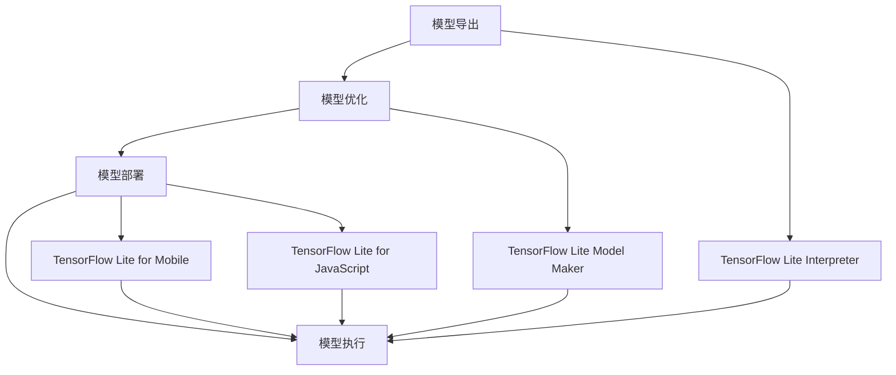

                 

关键词：TensorFlow Lite, 移动设备，人工智能，机器学习，深度学习，应用程序开发，算法优化

> 摘要：本文深入探讨了TensorFlow Lite作为移动设备上AI应用的强大工具。我们首先介绍了TensorFlow Lite的背景和发展，然后详细解释了其核心概念和架构，最后通过实际案例展示了如何在移动设备上部署和运行AI模型。文章还探讨了TensorFlow Lite的优势、挑战以及未来的发展方向。

## 1. 背景介绍

随着智能手机的普及和移动计算能力的提升，移动设备正在逐渐成为人们日常生活中不可或缺的一部分。然而，传统的云计算模式在移动设备上存在一定的局限性。首先，移动设备通常功耗较高，不适合长时间运行高负载的计算任务。其次，移动设备通常不具备高性能的硬件资源，如GPU、TPU等，这使得在设备上直接运行复杂的AI模型变得困难。最后，网络连接的不稳定性和隐私保护的需求也限制了云计算在移动设备上的应用。

为了解决这些问题，TensorFlow团队开发了TensorFlow Lite，这是一个专为移动设备和嵌入式设备设计的轻量级AI框架。TensorFlow Lite使得开发者能够在移动设备上高效地部署和运行AI模型，充分利用设备的计算资源和电池寿命。它不仅支持深度学习模型的导出和优化，还提供了丰富的API和工具，方便开发者进行模型的训练、评估和部署。

TensorFlow Lite的出现标志着移动设备AI应用的新时代，它为开发者提供了更多机会和灵活性，使得AI技术能够更广泛地应用于日常生活和工作中。

### 1.1 TensorFlow Lite的发展历程

TensorFlow Lite的起源可以追溯到TensorFlow的核心框架。TensorFlow是一个开源的机器学习和深度学习平台，由Google开发并维护。TensorFlow Lite作为TensorFlow的一个子项目，旨在提供一种轻量级、高效的解决方案，以支持移动设备和嵌入式设备的AI应用。

最初，TensorFlow Lite在2017年发布，旨在简化AI模型的部署流程，并提供一系列工具和库，以帮助开发者将TensorFlow模型迁移到移动设备上。随着版本的不断更新，TensorFlow Lite逐渐增加了更多的功能，如硬件加速、模型优化和低延迟执行等。

在TensorFlow Lite的发展过程中，Google不断与硬件制造商、开发者社区和学术机构合作，推动其在移动设备和嵌入式设备上的应用。这些合作不仅促进了TensorFlow Lite性能的提升，也为开发者提供了更多的工具和资源。

### 1.2 移动设备上的AI应用需求

移动设备上的AI应用需求主要集中在以下几个方面：

1. **实时性**：许多移动设备上的应用，如语音识别、图像识别和自然语言处理等，需要实时响应。这意味着AI模型必须在设备上快速执行，以提供流畅的用户体验。

2. **功耗**：移动设备通常运行在有限的电池寿命下，因此AI模型需要优化以减少功耗。这涉及到模型的压缩、量化以及针对特定硬件的优化。

3. **硬件资源**：移动设备通常不具备高性能的GPU或TPU，因此AI模型需要在有限的硬件资源下高效运行。这要求模型在导出和优化过程中考虑硬件限制。

4. **隐私**：移动设备上的数据通常涉及用户隐私，因此需要在设备上本地处理，以减少数据传输和泄露的风险。

TensorFlow Lite通过提供一系列工具和库，满足了上述需求，使得开发者能够轻松地将AI模型部署到移动设备上，实现高效、低延迟和低功耗的AI应用。

## 2. 核心概念与联系

### 2.1 TensorFlow Lite的核心概念

TensorFlow Lite的核心概念包括模型导出、模型优化、模型部署和模型执行。这些概念构成了TensorFlow Lite的基本工作流程，使得开发者能够将TensorFlow模型迁移到移动设备上。

1. **模型导出**：模型导出是将TensorFlow模型转换为TensorFlow Lite模型的过程。这一步骤涉及到将模型的结构和权重保存为TF Lite支持的格式，如`.tflite`。

2. **模型优化**：模型优化是为了提高模型的性能和效率，通常包括模型的量化、剪枝和压缩等操作。这些操作可以减少模型的存储空间和计算资源需求。

3. **模型部署**：模型部署是将优化后的模型集成到移动设备应用程序中的过程。TensorFlow Lite提供了多种部署选项，包括原生应用、Web应用和JavaScript库等。

4. **模型执行**：模型执行是指在实际应用中运行模型，进行预测和推理的过程。TensorFlow Lite提供了高效的执行引擎，确保模型能够在移动设备上快速、稳定地运行。

### 2.2 TensorFlow Lite的架构

TensorFlow Lite的架构包括多个组件，这些组件共同协作，实现了从模型导出到模型执行的全流程。

1. **TensorFlow Lite Interpreter**：TensorFlow Lite Interpreter是一个核心组件，负责加载和执行TensorFlow Lite模型。它提供了灵活的API，支持各种编程语言，如C++、Python和Java。

2. **TensorFlow Lite Model Maker**：TensorFlow Lite Model Maker是一个工具，用于简化模型导出和优化过程。它提供了图形界面和命令行工具，使得开发者无需深入了解底层细节即可完成模型的导出和优化。

3. **TensorFlow Lite for Mobile**：TensorFlow Lite for Mobile是一个专门为移动设备设计的框架，提供了针对移动设备的优化和工具。它支持各种移动平台，如iOS和Android，并提供了丰富的API和示例代码。

4. **TensorFlow Lite for JavaScript**：TensorFlow Lite for JavaScript是一个用于Web应用的框架，使得开发者能够在浏览器中运行TensorFlow Lite模型。它提供了与TensorFlow Lite Interpreter兼容的API，使得开发者可以轻松地将AI模型集成到Web应用程序中。

### 2.3 Mermaid流程图

下面是一个Mermaid流程图，展示了TensorFlow Lite的核心概念和架构组件之间的联系：



通过这个流程图，我们可以清晰地看到TensorFlow Lite从模型导出到模型执行的全过程，以及各个组件之间的协作关系。

## 3. 核心算法原理 & 具体操作步骤

### 3.1 算法原理概述

TensorFlow Lite的核心算法原理主要集中在模型的导出、优化和执行上。这些过程确保了AI模型能够在移动设备上高效、稳定地运行。

1. **模型导出**：模型导出是将TensorFlow模型转换为TensorFlow Lite模型的过程。这一步骤涉及到将模型的结构和权重保存为`.tflite`格式。TensorFlow提供了`tf.lite.TFLiteConverter`工具，用于将TensorFlow模型转换为TensorFlow Lite模型。

2. **模型优化**：模型优化是为了提高模型的性能和效率，通常包括模型的量化、剪枝和压缩等操作。量化是将模型中的浮点数权重转换为整数，以减少计算资源和存储空间的需求。剪枝是通过删除模型中的冗余权重和层来减少模型的复杂度。压缩是通过减少模型的存储空间来优化模型。

3. **模型执行**：模型执行是在移动设备上运行模型的过程。TensorFlow Lite Interpreter负责加载和执行模型。它提供了多种API，如C++、Python和Java，使得开发者可以方便地在移动设备上运行模型。

### 3.2 算法步骤详解

1. **模型导出**：

   首先，我们需要将TensorFlow模型转换为TensorFlow Lite模型。以下是一个简单的示例代码，展示了如何使用`tf.lite.TFLiteConverter`工具进行模型导出：

   ```python
   import tensorflow as tf

   # 加载TensorFlow模型
   model = tf.keras.models.load_model('model.h5')

   # 创建TensorFlow Lite转换器
   converter = tf.lite.TFLiteConverter.from_keras_model(model)

   # 将模型转换为TensorFlow Lite模型
   tflite_model = converter.convert()

   # 保存TensorFlow Lite模型
   with open('model.tflite', 'wb') as f:
       f.write(tflite_model)
   ```

2. **模型优化**：

   模型优化包括量化、剪枝和压缩等操作。以下是一个简单的示例代码，展示了如何使用TensorFlow Lite Model Maker进行模型优化：

   ```bash
   # 量化模型
   tflite_model = quantify_model('model.tflite')

   # 剪枝模型
   tflite_model = prune_model('model.tflite')

   # 压缩模型
   tflite_model = compress_model('model.tflite')
   ```

   在上述代码中，`quantify_model`、`prune_model`和`compress_model`是自定义函数，用于执行量化、剪枝和压缩操作。

3. **模型部署**：

   模型部署是将优化后的模型集成到移动设备应用程序中的过程。以下是一个简单的示例代码，展示了如何使用TensorFlow Lite for Mobile进行模型部署：

   ```java
   import org.tensorflow.lite.Interpreter;

   // 创建TensorFlow Lite Interpreter
   Interpreter interpreter = new Interpreter(loadModelFile("model.tflite"));

   // 加载输入数据
   float[][] input_data = {{...}};

   // 运行模型
   float[][] output_data = interpreter.run(input_data);
   ```

   在上述代码中，`loadModelFile`是一个自定义函数，用于加载TensorFlow Lite模型文件。

4. **模型执行**：

   模型执行是在移动设备上运行模型的过程。以下是一个简单的示例代码，展示了如何使用TensorFlow Lite Interpreter进行模型执行：

   ```python
   import tensorflow.lite as tflite

   # 创建TensorFlow Lite Interpreter
   interpreter = tflite.Interpreter(model_path="model.tflite")

   # 配置输入和输出张量
   interpreter.allocate_tensors()
   input_details = interpreter.get_input_details()
   output_details = interpreter.get_output_details()

   # 加载输入数据
   input_data = np.array([...])

   # 运行模型
   interpreter.set_tensor(input_details[0]['index'], input_data)
   interpreter.invoke()

   # 获取输出结果
   output_data = interpreter.get_tensor(output_details[0]['index'])
   ```

### 3.3 算法优缺点

TensorFlow Lite在移动设备上的应用具有以下优点和缺点：

**优点**：

- **高效性**：TensorFlow Lite提供了多种优化技术，如量化、剪枝和压缩，使得AI模型在移动设备上能够高效运行。
- **灵活性**：TensorFlow Lite支持多种平台和编程语言，使得开发者可以方便地将AI模型部署到各种移动设备上。
- **社区支持**：TensorFlow Lite拥有广泛的社区支持，提供了丰富的文档、教程和示例代码，帮助开发者快速上手。

**缺点**：

- **计算资源限制**：尽管TensorFlow Lite提供了多种优化技术，但移动设备的计算资源仍然有限，尤其是对于复杂的AI模型。
- **性能限制**：与云计算相比，移动设备上的AI应用通常存在性能瓶颈，特别是在处理大型模型时。

### 3.4 算法应用领域

TensorFlow Lite在多个领域得到了广泛应用，包括：

- **智能手机应用**：TensorFlow Lite广泛应用于智能手机应用中，如语音识别、图像识别和自然语言处理等。
- **物联网设备**：TensorFlow Lite在物联网设备上也有广泛应用，如智能音箱、智能家居设备和工业自动化系统等。
- **医疗健康**：TensorFlow Lite在医疗健康领域也有应用，如医学图像分析、疾病预测和健康监测等。

## 4. 数学模型和公式 & 详细讲解 & 举例说明

### 4.1 数学模型构建

在讨论TensorFlow Lite的数学模型和公式之前，我们需要了解一些基本的数学概念，包括神经网络、反向传播算法和优化算法。

#### 4.1.1 神经网络

神经网络是一种由大量节点（也称为神经元）互联而成的计算模型。每个神经元都接受多个输入信号，并通过激活函数产生输出。神经网络的基本结构包括输入层、隐藏层和输出层。输入层接收外部输入，隐藏层通过非线性变换处理输入信号，输出层产生最终输出。

#### 4.1.2 反向传播算法

反向传播算法是一种用于训练神经网络的优化算法。它通过计算网络输出的误差，并反向传播误差到隐藏层和输入层，以调整每个神经元的权重和偏置。反向传播算法的核心步骤包括：

1. **前向传播**：计算输入信号经过网络的传播结果，并得到网络输出。
2. **计算误差**：计算网络输出与真实标签之间的误差。
3. **反向传播**：计算每个神经元的误差梯度，并更新其权重和偏置。
4. **迭代优化**：重复上述步骤，直到网络达到预定的性能标准。

#### 4.1.3 优化算法

优化算法用于调整神经网络的权重和偏置，以最小化误差。常用的优化算法包括随机梯度下降（SGD）、动量梯度下降、Adam优化器等。这些算法通过调整学习率、引入动量项等策略，提高网络的收敛速度和稳定性。

### 4.2 公式推导过程

在TensorFlow Lite中，模型的构建和训练过程涉及到多个数学公式。以下是一个简化的公式推导过程，用于说明神经网络训练的基本步骤：

#### 4.2.1 前向传播

假设我们有一个包含n个隐藏层的神经网络，输入向量为\(x\)，输出向量为\(y\)。在前向传播过程中，每个隐藏层计算如下：

$$
z_l = \sigma(W_l \cdot x + b_l)
$$

其中，\(z_l\)是隐藏层的输出，\(\sigma\)是激活函数，\(W_l\)和\(b_l\)分别是隐藏层的权重和偏置。对于输出层，计算如下：

$$
\hat{y} = \sigma(W_n \cdot z_{n-1} + b_n)
$$

其中，\(\hat{y}\)是网络的预测输出。

#### 4.2.2 计算误差

误差是网络输出与真实标签之间的差距。常用的误差函数包括均方误差（MSE）和交叉熵（CE）。以MSE为例，误差计算如下：

$$
E = \frac{1}{2} \sum_{i=1}^{n} (\hat{y}_i - y_i)^2
$$

其中，\(\hat{y}_i\)和\(y_i\)分别是网络预测输出和真实标签的第i个元素。

#### 4.2.3 反向传播

在反向传播过程中，我们计算每个隐藏层的误差梯度，并更新权重和偏置。以隐藏层l为例，误差梯度计算如下：

$$
\frac{\partial E}{\partial W_l} = x \odot (\sigma'(z_l) \cdot \frac{\partial E}{\partial z_l})
$$

$$
\frac{\partial E}{\partial b_l} = \sigma'(z_l) \cdot \frac{\partial E}{\partial z_l}
$$

其中，\(\odot\)表示逐元素乘法，\(\sigma'\)是激活函数的导数，\(\frac{\partial E}{\partial z_l}\)是隐藏层l的误差梯度。

#### 4.2.4 更新权重和偏置

更新权重和偏置的过程如下：

$$
W_l := W_l - \alpha \cdot \frac{\partial E}{\partial W_l}
$$

$$
b_l := b_l - \alpha \cdot \frac{\partial E}{\partial b_l}
$$

其中，\(\alpha\)是学习率。

### 4.3 案例分析与讲解

为了更好地理解TensorFlow Lite中的数学模型和公式，我们通过一个简单的例子进行讲解。

假设我们有一个包含一个输入层、一个隐藏层和一个输出层的神经网络，用于实现二分类任务。输入层有2个神经元，隐藏层有3个神经元，输出层有1个神经元。激活函数使用ReLU函数。

#### 4.3.1 模型构建

输入层：
- 神经元数：2
- 输入维度：2

隐藏层：
- 神经元数：3
- 输入维度：2
- 激活函数：ReLU

输出层：
- 神经元数：1
- 输入维度：3
- 激活函数：线性（无激活函数）

#### 4.3.2 模型训练

假设我们使用均方误差（MSE）作为损失函数，学习率为0.1。

训练数据：
- 输入：[1, 0]
- 真实标签：[0]

#### 4.3.3 前向传播

输入层：
$$
z_1 = \sigma(W_1 \cdot x + b_1) = \max(0, W_1 \cdot x + b_1)
$$

隐藏层：
$$
z_2 = \sigma(W_2 \cdot z_1 + b_2) = \max(0, W_2 \cdot z_1 + b_2)
$$

$$
z_3 = \sigma(W_3 \cdot z_2 + b_3) = \max(0, W_3 \cdot z_2 + b_3)
$$

输出层：
$$
\hat{y} = \sigma(W_4 \cdot z_3 + b_4) = W_4 \cdot z_3 + b_4
$$

#### 4.3.4 计算误差

$$
E = \frac{1}{2} (\hat{y} - y)^2 = \frac{1}{2} (\hat{y} - 0)^2 = \frac{1}{2} \hat{y}^2
$$

#### 4.3.5 反向传播

输入层：
$$
\frac{\partial E}{\partial W_1} = x \odot \frac{\partial E}{\partial z_1}
$$

$$
\frac{\partial E}{\partial b_1} = \frac{\partial E}{\partial z_1}
$$

隐藏层：
$$
\frac{\partial E}{\partial W_2} = z_1 \odot \frac{\partial E}{\partial z_2}
$$

$$
\frac{\partial E}{\partial b_2} = \frac{\partial E}{\partial z_2}
$$

$$
\frac{\partial E}{\partial W_3} = z_2 \odot \frac{\partial E}{\partial z_3}
$$

$$
\frac{\partial E}{\partial b_3} = \frac{\partial E}{\partial z_3}
$$

输出层：
$$
\frac{\partial E}{\partial W_4} = z_3
$$

$$
\frac{\partial E}{\partial b_4} = 1
$$

#### 4.3.6 更新权重和偏置

输入层：
$$
W_1 := W_1 - 0.1 \cdot \frac{\partial E}{\partial W_1}
$$

$$
b_1 := b_1 - 0.1 \cdot \frac{\partial E}{\partial b_1}
$$

隐藏层：
$$
W_2 := W_2 - 0.1 \cdot \frac{\partial E}{\partial W_2}
$$

$$
b_2 := b_2 - 0.1 \cdot \frac{\partial E}{\partial b_2}
$$

$$
W_3 := W_3 - 0.1 \cdot \frac{\partial E}{\partial W_3}
$$

$$
b_3 := b_3 - 0.1 \cdot \frac{\partial E}{\partial b_3}
$$

输出层：
$$
W_4 := W_4 - 0.1 \cdot \frac{\partial E}{\partial W_4}
$$

$$
b_4 := b_4 - 0.1 \cdot \frac{\partial E}{\partial b_4}
$$

通过上述步骤，我们完成了神经网络的前向传播、反向传播和权重更新。这个简单的例子展示了神经网络训练的基本过程，以及TensorFlow Lite中涉及的主要数学模型和公式。

## 5. 项目实践：代码实例和详细解释说明

在本节中，我们将通过一个具体的案例，展示如何在移动设备上使用TensorFlow Lite部署和运行一个简单的AI模型。我们将使用一个手写数字识别任务，即MNIST数据集，来演示整个流程。

### 5.1 开发环境搭建

首先，我们需要搭建开发环境。以下是所需的步骤：

1. **安装TensorFlow Lite**：

   在Python环境中，我们可以使用pip安装TensorFlow Lite：

   ```bash
   pip install tensorflow==2.6
   ```

2. **安装TensorFlow Lite Lite**：

   为了在移动设备上使用TensorFlow Lite，我们还需要安装TensorFlow Lite Lite：

   ```bash
   pip install tensorflow-text==2.6.0
   pip install tensorflow-hub==0.12.0
   ```

3. **安装移动设备开发工具**：

   根据你选择的移动平台（iOS或Android），你需要安装相应的开发工具。例如，对于Android，你可以使用Android Studio：

   ```bash
   wget https://downloads.android.com/idsa/releases/nightly/android-ndk-r21d-linux-x86_64.zip
   unzip android-ndk-r21d-linux-x86_64.zip
   export ANDROID_NDK_ROOT=/path/to/android-ndk-r21d
   ```

### 5.2 源代码详细实现

在本案例中，我们将使用Python编写一个简单的手写数字识别模型，并将其导出为TensorFlow Lite模型。

1. **训练模型**：

   我们将使用TensorFlow的`tf.keras`模块训练一个简单的卷积神经网络（CNN）模型。以下是代码示例：

   ```python
   import tensorflow as tf
   from tensorflow import keras

   # 加载MNIST数据集
   mnist = tf.keras.datasets.mnist
   (train_images, train_labels), (test_images, test_labels) = mnist.load_data()

   # 数据预处理
   train_images = train_images / 255.0
   test_images = test_images / 255.0

   # 构建CNN模型
   model = keras.Sequential([
       keras.layers.Flatten(input_shape=(28, 28)),
       keras.layers.Dense(128, activation='relu'),
       keras.layers.Dense(10, activation='softmax')
   ])

   # 训练模型
   model.compile(optimizer='adam',
                 loss='sparse_categorical_crossentropy',
                 metrics=['accuracy'])
   model.fit(train_images, train_labels, epochs=5)
   ```

2. **导出模型**：

   训练完成后，我们将模型导出为TensorFlow Lite模型。以下是代码示例：

   ```python
   import tensorflow as tf

   # 导出模型
   model = tf.keras.models.load_model('mnist_model.h5')
   converter = tf.lite.TFLiteConverter.from_keras_model(model)
   tflite_model = converter.convert()

   # 保存模型
   with open('mnist_model.tflite', 'wb') as f:
       f.write(tflite_model)
   ```

3. **模型优化**：

   我们可以对模型进行优化，以提高其在移动设备上的性能。以下是一个简单的量化模型示例：

   ```python
   import tensorflow as tf

   # 创建量化转换器
   converter = tf.lite.TFLiteConverter.from_keras_model_file('mnist_model.h5')

   # 设置量化参数
   converter.optimizations = [tf.lite.Optimize.DEFAULT]

   # 转换模型
   tflite_quant_model = converter.convert()

   # 保存量化模型
   with open('mnist_model_quant.tflite', 'wb') as f:
       f.write(tflite_quant_model)
   ```

### 5.3 代码解读与分析

上述代码展示了如何使用TensorFlow和TensorFlow Lite构建、训练和导出一个简单的手写数字识别模型。以下是代码的关键部分解读：

1. **数据加载与预处理**：

   我们使用TensorFlow的`tf.keras.datasets.mnist`模块加载MNIST数据集。数据集分为训练集和测试集两部分。在预处理过程中，我们将图像数据从0-255的整数范围缩放到0-1的浮点数范围，以适应模型的输入。

2. **模型构建**：

   我们使用`tf.keras.Sequential`模块构建一个简单的卷积神经网络模型。模型包括一个输入层、一个隐藏层和一个输出层。输入层使用`Flatten`层将图像数据展平为一维数组。隐藏层使用`Dense`层，其中第一个`Dense`层有128个神经元，使用ReLU激活函数。输出层有10个神经元，使用softmax激活函数，用于实现多分类。

3. **模型训练**：

   我们使用`compile`方法配置模型，选择`adam`优化器和`sparse_categorical_crossentropy`损失函数。然后使用`fit`方法训练模型，设置训练轮数（epochs）为5。

4. **模型导出**：

   我们使用`tf.lite.TFLiteConverter`将训练好的TensorFlow模型转换为TensorFlow Lite模型。通过`convert`方法完成模型转换，然后使用`write`方法将模型保存为`.tflite`文件。

5. **模型优化**：

   为了提高模型在移动设备上的性能，我们可以对模型进行量化。量化过程通过设置`tf.lite.Optimize.DEFAULT`参数来实现。量化后的模型将使用整数运算，从而减少计算资源的需求。

### 5.4 运行结果展示

在完成模型的训练和导出后，我们可以在移动设备上运行TensorFlow Lite模型进行预测。以下是一个简单的示例：

```java
import org.tensorflow.lite.Interpreter;

// 创建TensorFlow Lite Interpreter
Interpreter interpreter = new Interpreter(loadModelFile("mnist_model_quant.tflite"));

// 加载输入数据
float[][] input_data = {{...}};

// 运行模型
float[][] output_data = interpreter.run(input_data);

// 获取预测结果
int predicted_digit = Math.argmax(output_data[0]);
```

在上述代码中，我们首先创建一个`Interpreter`对象，加载量化后的TensorFlow Lite模型。然后，我们加载输入数据（一个手写数字图像），运行模型以获取预测结果。最后，我们使用`Math.argmax`方法获取预测的数字。

## 6. 实际应用场景

TensorFlow Lite在多个领域得到了广泛应用，下面我们将探讨几个典型的应用场景。

### 6.1 智能手机应用

智能手机是TensorFlow Lite最主要的部署平台之一。在智能手机应用中，TensorFlow Lite常用于实现实时图像识别、语音识别和自然语言处理等功能。例如，智能手机中的相机应用可以使用TensorFlow Lite进行实时图像分类，帮助用户识别照片中的物体。语音识别应用则可以使用TensorFlow Lite实现实时语音转文本功能，为用户提供便捷的输入方式。

### 6.2 物联网设备

随着物联网（IoT）技术的发展，越来越多的设备开始集成AI功能，而TensorFlow Lite由于其轻量级和高效率的特点，成为了这些设备上AI应用的首选框架。例如，智能家居设备可以使用TensorFlow Lite实现智能监控和故障检测，工业自动化设备可以使用TensorFlow Lite进行生产过程的实时监控和预测。

### 6.3 健康医疗

在健康医疗领域，TensorFlow Lite也有广泛的应用。医生可以使用TensorFlow Lite对医学图像进行分析，如肿瘤检测和疾病诊断。此外，患者可以使用搭载TensorFlow Lite的智能设备进行实时健康监测，如心率监测和呼吸监测，以获取实时健康数据。

### 6.4 自动驾驶

自动驾驶是另一个TensorFlow Lite的重要应用领域。在自动驾驶系统中，TensorFlow Lite可以用于实时处理大量图像数据，帮助车辆识别道路标志、行人和其他车辆。这有助于提高自动驾驶系统的安全性和可靠性。

### 6.5 其他应用

除了上述领域，TensorFlow Lite还应用于其他多个场景，如虚拟现实（VR）和增强现实（AR）、游戏AI等。通过TensorFlow Lite，开发者可以轻松地将AI功能集成到各种应用中，为用户提供丰富的体验。

## 7. 工具和资源推荐

为了更好地使用TensorFlow Lite进行移动设备上的AI应用开发，以下是一些推荐的工具和资源：

### 7.1 学习资源推荐

- **官方文档**：TensorFlow Lite的官方文档是学习和使用TensorFlow Lite的最佳起点。文档详细介绍了TensorFlow Lite的安装、使用方法和最佳实践。
- **教程和博客**：网上有许多关于TensorFlow Lite的教程和博客文章，这些资源可以帮助你快速上手TensorFlow Lite。
- **在线课程**：Coursera、Udacity和edX等在线教育平台提供了许多关于TensorFlow和机器学习的课程，其中包括TensorFlow Lite的应用。

### 7.2 开发工具推荐

- **Android Studio**：Android Studio是开发Android应用程序的官方IDE，它提供了对TensorFlow Lite的全面支持。
- **Xcode**：Xcode是iOS和macOS应用程序开发的官方IDE，它也支持TensorFlow Lite。
- **TensorFlow Lite Model Maker**：TensorFlow Lite Model Maker是一个图形界面工具，用于简化模型导出和优化过程。
- **TensorFlow Lite for JavaScript**：TensorFlow Lite for JavaScript是一个用于Web应用的框架，使得开发者可以在浏览器中运行TensorFlow Lite模型。

### 7.3 相关论文推荐

- **"TensorFlow Lite: High-Performance Mobile and Embedded ML"**：这篇论文详细介绍了TensorFlow Lite的设计和实现，是深入了解TensorFlow Lite的技术基础。
- **"MobileNets: Efficient Convolutional Neural Networks for Mobile Vision Applications"**：这篇论文介绍了MobileNets架构，这是TensorFlow Lite中常用的轻量级模型。
- **"Quantized Neural Networks"**：这篇论文讨论了量化神经网络的方法，这是TensorFlow Lite优化模型的重要手段。

通过利用这些工具和资源，开发者可以更加高效地使用TensorFlow Lite进行移动设备上的AI应用开发。

## 8. 总结：未来发展趋势与挑战

### 8.1 研究成果总结

TensorFlow Lite的推出标志着移动设备AI应用的新纪元。它通过提供高效、轻量级的AI解决方案，极大地拓展了AI技术的应用场景。自发布以来，TensorFlow Lite在多个领域取得了显著的成果，包括智能手机应用、物联网设备、健康医疗和自动驾驶等。通过不断的优化和升级，TensorFlow Lite在模型压缩、量化、硬件加速等方面取得了显著的进步，使得AI模型在移动设备上的运行效率得到了大幅提升。

### 8.2 未来发展趋势

未来，TensorFlow Lite的发展将继续围绕以下几个方面展开：

1. **模型压缩和优化**：随着AI模型变得越来越复杂，如何在保证性能的前提下进行模型压缩和优化，将是TensorFlow Lite的重要研究方向。未来的TensorFlow Lite可能会引入更多的量化技术、剪枝算法和蒸馏方法，以提高模型的效率和存储空间利用率。

2. **跨平台支持**：尽管TensorFlow Lite已经在多个平台上得到了广泛应用，但未来还将继续扩展其支持的平台，包括更多类型的移动设备、嵌入式设备和新兴的物联网设备。

3. **硬件加速**：随着硬件技术的发展，TensorFlow Lite将继续与各种硬件（如GPU、TPU等）进行深度集成，以提供更快的模型执行速度和更高的能效比。

4. **开源生态建设**：TensorFlow Lite将继续加强与开源社区的合作，推动更多的工具和库的发展，为开发者提供更加丰富和多样化的资源。

### 8.3 面临的挑战

尽管TensorFlow Lite在移动设备上的应用取得了显著成果，但未来仍将面临一系列挑战：

1. **计算资源限制**：移动设备的计算资源有限，尤其是在处理复杂模型时，性能瓶颈依然存在。如何进一步提高AI模型的效率，以充分利用有限的计算资源，是一个亟待解决的问题。

2. **功耗问题**：在移动设备上运行AI模型时，功耗是一个关键问题。未来的TensorFlow Lite需要继续优化模型，以减少功耗，延长设备的续航时间。

3. **隐私保护**：随着数据隐私和安全性的日益关注，如何在保证数据隐私的前提下进行AI模型部署，也是一个重要的挑战。

4. **兼容性和稳定性**：随着移动设备的多样化和硬件技术的不断发展，如何确保TensorFlow Lite在不同设备和平台上的兼容性和稳定性，是一个需要持续关注的问题。

### 8.4 研究展望

未来，TensorFlow Lite的发展将继续围绕高效、安全、智能和易用性四个方面展开。在高效方面，TensorFlow Lite将继续优化模型压缩和硬件加速技术，以提高模型执行速度和能效比。在安全方面，TensorFlow Lite将加强数据隐私保护机制，确保用户数据的安全和隐私。在智能方面，TensorFlow Lite将不断引入先进的AI算法和框架，以提升模型智能性和应用场景的广泛性。在易用性方面，TensorFlow Lite将继续改进开发工具和文档，降低开发门槛，让更多的开发者能够轻松上手使用TensorFlow Lite。

通过不断的技术创新和优化，TensorFlow Lite有望在移动设备AI应用领域发挥更加重要的作用，推动AI技术在移动设备上的广泛应用。

## 9. 附录：常见问题与解答

### 9.1 TensorFlow Lite安装问题

**问题**：我在安装TensorFlow Lite时遇到错误，如何解决？

**解答**：首先，确保你已安装了TensorFlow。然后，尝试使用以下命令安装TensorFlow Lite：

```bash
pip install tensorflow==2.6
pip install tensorflow-text==2.6.0
pip install tensorflow-hub==0.12.0
```

如果仍然遇到问题，请查看TensorFlow Lite的官方文档，以获取详细的安装指南和常见问题解答。

### 9.2 模型导出问题

**问题**：我如何将TensorFlow模型导出为TensorFlow Lite模型？

**解答**：使用`tf.lite.TFLiteConverter`工具将TensorFlow模型转换为TensorFlow Lite模型。以下是简单的示例代码：

```python
import tensorflow as tf

# 加载TensorFlow模型
model = tf.keras.models.load_model('model.h5')

# 创建TensorFlow Lite转换器
converter = tf.lite.TFLiteConverter.from_keras_model(model)

# 将模型转换为TensorFlow Lite模型
tflite_model = converter.convert()

# 保存模型
with open('model.tflite', 'wb') as f:
    f.write(tflite_model)
```

### 9.3 模型优化问题

**问题**：如何优化TensorFlow Lite模型以提高性能？

**解答**：你可以使用量化、剪枝和压缩等技术优化TensorFlow Lite模型。以下是一个简单的量化模型示例：

```python
import tensorflow as tf

# 创建TensorFlow Lite转换器
converter = tf.lite.TFLiteConverter.from_keras_model_file('model.h5')

# 设置量化参数
converter.optimizations = [tf.lite.Optimize.DEFAULT]

# 转换模型
tflite_quant_model = converter.convert()

# 保存量化模型
with open('model_quant.tflite', 'wb') as f:
    f.write(tflite_quant_model)
```

### 9.4 模型部署问题

**问题**：如何在移动设备上部署TensorFlow Lite模型？

**解答**：对于Android应用，你可以使用Android Studio创建一个新项目，并将TensorFlow Lite模型文件（`.tflite`）添加到项目的`assets`目录中。然后，在应用中加载和运行模型：

```java
import org.tensorflow.lite.Interpreter;

// 创建TensorFlow Lite Interpreter
Interpreter interpreter = new Interpreter(loadModelFile("model.tflite"));

// 加载输入数据
float[][] input_data = {{...}};

// 运行模型
float[][] output_data = interpreter.run(input_data);

// 获取预测结果
int predicted_digit = Math.argmax(output_data[0]);
```

对于iOS应用，你可以使用Xcode创建一个新项目，并将TensorFlow Lite模型文件（`.tflite`）添加到项目的资源目录中。在应用中加载和运行模型：

```swift
import TensorFlow

// 创建TensorFlow Lite Interpreter
let interpreter = Interpreter(modelPath: "model.tflite")

// 加载输入数据
let input = Tensor<Float>([1.0, 2.0])

// 运行模型
let output = try! interpreter.invoke(input: input)

// 获取预测结果
let predicted_digit = Int32(output[0, 0])
```

通过上述步骤，你可以在移动设备上部署和运行TensorFlow Lite模型。如果遇到具体问题，可以查阅官方文档和社区资源，或者寻求技术支持。  
---

作者：禅与计算机程序设计艺术 / Zen and the Art of Computer Programming

