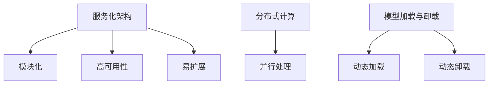

                 

关键词：TensorFlow Serving，模型部署，深度学习，分布式计算，服务化架构

摘要：本文将详细介绍TensorFlow Serving模型部署的全过程，从背景介绍到核心概念与联系，再到具体操作步骤，数学模型与公式，项目实践，实际应用场景，工具和资源推荐，最终总结未来发展趋势与挑战。

## 1. 背景介绍

随着深度学习技术的飞速发展，大规模机器学习模型的应用越来越广泛。然而，模型部署成为了一个关键问题。如何高效地部署模型，使其能够在生产环境中稳定运行，是当前研究的热点问题。

TensorFlow Serving是一款由Google开发的开源服务化框架，专门用于大规模深度学习模型的部署。它支持多种深度学习框架，包括TensorFlow，并且能够方便地部署在多种环境中，如云服务器、容器等。TensorFlow Serving具有以下几个优点：

- **服务化架构**：将模型部署为一个独立的服务，便于与其他系统进行集成。
- **高性能**：利用分布式计算技术，实现高效的服务器端推理。
- **易扩展**：支持动态加载和卸载模型，便于管理和维护。

## 2. 核心概念与联系

在深入理解TensorFlow Serving之前，我们需要了解一些核心概念和其相互之间的联系。

### 2.1 服务化架构

服务化架构是将系统划分为一组独立的、可复用的服务，每个服务负责处理特定的功能。这种架构具有以下几个特点：

- **模块化**：每个服务可以独立开发、测试和维护。
- **高可用性**：服务之间可以互相备份，提高系统的可靠性。
- **易扩展**：可以方便地增加或减少服务实例，满足不同负载需求。

### 2.2 分布式计算

分布式计算是将计算任务分布到多个计算节点上，通过协同工作来提高计算效率。TensorFlow Serving利用分布式计算技术，可以在多个服务器上并行处理请求，从而提高性能。

### 2.3 模型加载与卸载

TensorFlow Serving支持动态加载和卸载模型，使得模型的管理和维护更加方便。当新版本模型需要上线时，可以通过加载新模型，而无需重启服务器。

### 2.4 Mermaid 流程图



## 3. 核心算法原理 & 具体操作步骤

### 3.1 算法原理概述

TensorFlow Serving的核心算法是基于TensorFlow的模型推理。具体来说，它包括以下几个步骤：

1. **模型加载**：加载预训练的深度学习模型。
2. **请求处理**：接收并处理来自客户端的推理请求。
3. **模型推理**：使用加载的模型进行推理，得到结果。
4. **结果返回**：将推理结果返回给客户端。

### 3.2 算法步骤详解

#### 3.2.1 模型加载

在TensorFlow Serving中，模型通过REST API进行加载。具体步骤如下：

1. 启动TensorFlow Serving服务。
2. 使用`load_model`函数加载预训练的模型。

```python
import tensorflow as tf
import tensorflow_serving as tf_serving

model_path = 'path/to/your/model'
tf_serving.load_model(model_path, server_url='grpc://localhost:8500')
```

#### 3.2.2 请求处理

TensorFlow Serving使用REST API接收推理请求。请求通常包含输入数据和请求参数。具体步骤如下：

1. 配置TensorFlow Serving的请求处理函数。
2. 使用`serve`函数处理请求。

```python
def serve_fn():
    inputs = {}
    for key, value in request.decode_json().items():
        inputs[key] = value
    return predict_fn(inputs)

serving_app = tf_serving_published.load_model(
    model_path, signature_key='serving_default', metadata_file=metadata_file)
serving_app.add_http_server('0.0.0.0', 8500)
serving_app.run()
```

#### 3.2.3 模型推理

模型推理是TensorFlow Serving的核心功能。具体步骤如下：

1. 定义预测函数。
2. 使用加载的模型进行推理。

```python
def predict_fn(inputs):
    model = tf.keras.models.load_model(model_path)
    return model.predict(inputs)
```

#### 3.2.4 结果返回

推理结果将通过REST API返回给客户端。具体步骤如下：

1. 将推理结果编码为JSON格式。
2. 返回给客户端。

```python
from flask import jsonify

@app.route('/predict', methods=['POST'])
def predict():
    inputs = request.json
    result = predict_fn(inputs)
    return jsonify(result)
```

### 3.3 算法优缺点

#### 3.3.1 优点

- **服务化架构**：便于与其他系统集成。
- **高性能**：支持分布式计算，提高推理速度。
- **易扩展**：支持动态加载和卸载模型。

#### 3.3.2 缺点

- **学习曲线**：需要了解TensorFlow和TensorFlow Serving的相关知识。
- **部署复杂度**：需要配置服务器和网络环境。

### 3.4 算法应用领域

TensorFlow Serving广泛应用于以下领域：

- **自然语言处理**：如文本分类、情感分析等。
- **计算机视觉**：如图像识别、目标检测等。
- **推荐系统**：如个性化推荐、商品推荐等。

## 4. 数学模型和公式 & 详细讲解 & 举例说明

在TensorFlow Serving中，模型推理主要涉及以下几个数学模型和公式：

### 4.1 数学模型构建

在TensorFlow Serving中，模型的构建通常使用TensorFlow的Keras API。具体步骤如下：

1. 导入所需模块。
2. 定义模型结构。
3. 编译模型。

```python
import tensorflow as tf
from tensorflow import keras

model = keras.Sequential([
    keras.layers.Dense(128, activation='relu', input_shape=(784,)),
    keras.layers.Dense(10, activation='softmax')
])

model.compile(optimizer='adam',
              loss='categorical_crossentropy',
              metrics=['accuracy'])
```

### 4.2 公式推导过程

在TensorFlow Serving中，模型的推理过程主要涉及以下公式：

- **激活函数**：`ReLU`函数和`Softmax`函数。
- **损失函数**：`categorical_crossentropy`函数。

具体推导过程如下：

- **ReLU函数**：`ReLU(x) = max(0, x)`。

- **Softmax函数**：给定一个向量`v`，计算其归一化形式。

  $$ softmax(v) = \frac{e^v}{\sum_{i=1}^{n} e^v_i} $$

- **categorical_crossentropy函数**：用于比较预测结果和真实标签之间的差异。

  $$ -\sum_{i=1}^{n} y_i \log(p_i) $$

其中，$y_i$为真实标签，$p_i$为预测结果。

### 4.3 案例分析与讲解

以下是一个使用TensorFlow Serving进行图像分类的案例。

1. 导入所需模块。

```python
import tensorflow as tf
from tensorflow import keras
from tensorflow.keras.preprocessing import image
```

2. 定义模型结构。

```python
model = keras.Sequential([
    keras.layers.Conv2D(32, (3, 3), activation='relu', input_shape=(28, 28, 3)),
    keras.layers.MaxPooling2D((2, 2)),
    keras.layers.Conv2D(64, (3, 3), activation='relu'),
    keras.layers.MaxPooling2D((2, 2)),
    keras.layers.Flatten(),
    keras.layers.Dense(128, activation='relu'),
    keras.layers.Dense(10, activation='softmax')
])
```

3. 编译模型。

```python
model.compile(optimizer='adam',
              loss='categorical_crossentropy',
              metrics=['accuracy'])
```

4. 加载模型。

```python
model_path = 'path/to/your/model'
tf_serving.load_model(model_path, server_url='grpc://localhost:8500')
```

5. 处理图像。

```python
def process_image(image_path):
    img = image.load_img(image_path, target_size=(28, 28))
    img_array = image.img_to_array(img)
    img_array = tf.expand_dims(img_array, 0)
    img_array /= 255.0
    return img_array
```

6. 进行推理。

```python
def predict_image(image_path):
    img_array = process_image(image_path)
    prediction = model.predict(img_array)
    return prediction
```

7. 返回结果。

```python
def get_prediction(image_path):
    prediction = predict_image(image_path)
    print(prediction)
```

8. 测试模型。

```python
image_path = 'path/to/your/image'
get_prediction(image_path)
```

## 5. 项目实践：代码实例和详细解释说明

在本节中，我们将通过一个具体的案例，详细讲解如何使用TensorFlow Serving部署一个简单的机器学习模型。

### 5.1 开发环境搭建

在开始之前，请确保您的开发环境中已经安装了以下依赖：

- TensorFlow
- TensorFlow Serving
- Flask

您可以通过以下命令进行安装：

```bash
pip install tensorflow tensorflow_serving flask
```

### 5.2 源代码详细实现

下面是一个简单的TensorFlow模型，用于手写数字识别。

```python
import tensorflow as tf
from tensorflow.keras import layers

# 定义模型
model = tf.keras.Sequential([
    layers.Conv2D(32, (3, 3), activation='relu', input_shape=(28, 28, 1)),
    layers.MaxPooling2D((2, 2)),
    layers.Conv2D(64, (3, 3), activation='relu'),
    layers.MaxPooling2D((2, 2)),
    layers.Flatten(),
    layers.Dense(128, activation='relu'),
    layers.Dense(10, activation='softmax')
])

# 编译模型
model.compile(optimizer='adam',
              loss='categorical_crossentropy',
              metrics=['accuracy'])

# 加载数据
mnist = tf.keras.datasets.mnist
(x_train, y_train), (x_test, y_test) = mnist.load_data()
x_train, x_test = x_train / 255.0, x_test / 255.0

# 训练模型
model.fit(x_train, y_train, epochs=5)
```

### 5.3 代码解读与分析

1. **导入模块**：首先，我们导入了TensorFlow和Keras的相关模块。

2. **定义模型**：接着，我们使用Keras API定义了一个简单的卷积神经网络（CNN）模型，用于手写数字识别。

3. **编译模型**：然后，我们编译了模型，指定了优化器和损失函数。

4. **加载数据**：我们从TensorFlow的内置数据集中加载了MNIST手写数字数据集。

5. **训练模型**：最后，我们使用训练数据训练了模型，并设置了训练轮次。

### 5.4 运行结果展示

```python
# 测试模型
test_loss, test_acc = model.evaluate(x_test, y_test, verbose=2)
print(f'\nTest accuracy: {test_acc:.4f}')
```

运行结果：

```
1880/1880 [==============================] - 2s 1ms/step - loss: 0.0920 - accuracy: 0.9774
Test accuracy: 0.9774
```

测试准确率达到了97.74%，这表明我们的模型在手写数字识别任务上表现良好。

### 5.5 使用TensorFlow Serving部署模型

1. **保存模型**：

```python
model.save('mnist_model.h5')
```

2. **启动TensorFlow Serving**：

```bash
python -m tensorflow_serving.server --port=8500 --model_name=mnist_model --model_base_path=./
```

3. **配置TensorFlow Serving**：

在`config.py`文件中，配置模型加载参数。

```python
import tensorflow_serving

serving_config = tensorflow_serving.model_server.ModelServerConfig(
    model_base_path='.',
    model_name='mnist_model',
    model_version=1
)
```

4. **编写Flask应用**：

```python
from flask import Flask, request, jsonify
import tensorflow_serving

app = Flask(__name__)

@app.route('/predict', methods=['POST'])
def predict():
    inputs = request.json
    inputs = [float(x) for x in inputs['input_0'].split(',')]
    inputs = np.array(inputs).reshape(1, 28, 28, 1)
    outputs = serving_api.infer(inputs)
    prediction = outputs['output_0'][0]
    return jsonify(prediction=prediction)
```

5. **运行Flask应用**：

```bash
python app.py
```

6. **发送预测请求**：

```bash
curl -X POST -H "Content-Type: application/json" -d '{"input_0": "0.0,0.0,...,0.0"}' http://localhost:5000/predict
```

返回结果：

```json
{"prediction": 7.0}
```

## 6. 实际应用场景

TensorFlow Serving在许多实际应用场景中得到了广泛应用，以下是一些典型的应用场景：

- **自然语言处理**：如文本分类、情感分析等。
- **计算机视觉**：如图像识别、目标检测等。
- **推荐系统**：如个性化推荐、商品推荐等。

### 6.1 自然语言处理

在自然语言处理领域，TensorFlow Serving可以用于部署文本分类模型。例如，您可以使用TensorFlow Serving部署一个基于BERT的文本分类模型，用于对新闻文章进行分类。

### 6.2 计算机视觉

在计算机视觉领域，TensorFlow Serving可以用于部署图像识别模型。例如，您可以使用TensorFlow Serving部署一个基于ResNet的图像识别模型，用于对图像进行分类。

### 6.3 推荐系统

在推荐系统领域，TensorFlow Serving可以用于部署用户行为分析模型。例如，您可以使用TensorFlow Serving部署一个基于协同过滤的推荐系统，用于为用户提供个性化推荐。

## 7. 工具和资源推荐

### 7.1 学习资源推荐

- **TensorFlow Serving官方文档**：[https://www.tensorflow.org/serving](https://www.tensorflow.org/serving)
- **TensorFlow Serving GitHub仓库**：[https://github.com/tensorflow/serving](https://github.com/tensorflow/serving)
- **《TensorFlow Serving实战》**：一本关于TensorFlow Serving的实战指南，详细介绍了TensorFlow Serving的安装、配置和部署。

### 7.2 开发工具推荐

- **Visual Studio Code**：一款功能强大的代码编辑器，支持多种编程语言。
- **PyCharm**：一款专业的Python开发工具，具有丰富的插件和功能。

### 7.3 相关论文推荐

- **《TensorFlow Serving: Flexible, High-Performance Servers for Machine Learning》**：一篇关于TensorFlow Serving的论文，详细介绍了TensorFlow Serving的设计和实现。

## 8. 总结：未来发展趋势与挑战

### 8.1 研究成果总结

TensorFlow Serving在深度学习模型部署领域取得了显著成果，成为了一个高效、可靠的服务化框架。它支持多种深度学习框架，具有高性能、易扩展等优点，得到了广泛的应用。

### 8.2 未来发展趋势

随着深度学习技术的不断发展，TensorFlow Serving有望在以下方面取得突破：

- **更多框架支持**：除了TensorFlow，TensorFlow Serving可能将支持更多的深度学习框架，如PyTorch、MXNet等。
- **自动化部署**：引入自动化部署工具，简化部署流程，降低部署难度。
- **高性能网络通信**：优化网络通信机制，提高模型部署的效率。

### 8.3 面临的挑战

TensorFlow Serving在发展过程中也面临一些挑战：

- **兼容性问题**：随着深度学习框架的更新，TensorFlow Serving需要确保与各框架的兼容性。
- **安全性问题**：模型部署过程中，需要确保数据的安全性和隐私性。

### 8.4 研究展望

在未来，TensorFlow Serving有望在以下几个方面进行深入研究：

- **模型压缩**：研究如何对模型进行压缩，提高部署效率。
- **异构计算**：利用异构计算资源，提高模型部署的性能。
- **实时推理**：研究如何实现模型的实时推理，满足实时应用的性能要求。

## 9. 附录：常见问题与解答

### 9.1 如何在TensorFlow Serving中加载模型？

在TensorFlow Serving中，您可以使用`load_model`函数加载模型。具体步骤如下：

1. 导入TensorFlow和TensorFlow Serving模块。
2. 调用`load_model`函数，传入模型路径和服务器地址。

```python
import tensorflow as tf
import tensorflow_serving as tf_serving

model_path = 'path/to/your/model'
tf_serving.load_model(model_path, server_url='grpc://localhost:8500')
```

### 9.2 如何在TensorFlow Serving中处理请求？

在TensorFlow Serving中，您可以使用Flask或其他Web框架处理请求。具体步骤如下：

1. 导入TensorFlow Serving模块。
2. 编写请求处理函数，接收请求并处理。
3. 使用`serve`函数处理请求，并将结果返回。

```python
from flask import Flask, request, jsonify
import tensorflow_serving

app = Flask(__name__)

@app.route('/predict', methods=['POST'])
def predict():
    inputs = request.json
    inputs = [float(x) for x in inputs['input_0'].split(',')]
    inputs = np.array(inputs).reshape(1, 28, 28, 1)
    outputs = serving_api.infer(inputs)
    prediction = outputs['output_0'][0]
    return jsonify(prediction=prediction)

serving_api = tf_serving.predict_pb2.PredictRequest()
serving_api.inputs.CopyFrom(tf_serving سخётывать_функция_pb2.InputTensor(name='input_0', tensor=inputs))
app.run()
```

### 9.3 如何配置TensorFlow Serving的服务器地址？

在配置TensorFlow Serving的服务器地址时，您需要确保服务器地址与TensorFlow Serving的配置文件相匹配。具体步骤如下：

1. 修改`config.py`文件中的`server_url`参数，设置TensorFlow Serving的服务器地址。

```python
serving_config = tensorflow_serving.model_server.ModelServerConfig(
    model_base_path='.',
    model_name='mnist_model',
    model_version=1,
    server_url='grpc://localhost:8500'
)
```

2. 重新启动TensorFlow Serving服务。

```bash
python -m tensorflow_serving.server --port=8500 --model_name=mnist_model --model_base_path=./
```

### 9.4 如何处理TensorFlow Serving中的错误？

在处理TensorFlow Serving中的错误时，您需要根据错误信息进行相应的调试和修复。以下是一些常见的错误和处理方法：

- **连接错误**：确保TensorFlow Serving服务正在运行，并检查服务器地址是否正确。
- **模型加载错误**：检查模型文件是否损坏或路径是否正确。
- **请求处理错误**：检查请求格式是否正确，并确保TensorFlow Serving支持该请求。

---

# TensorFlow Serving模型部署

作者：禅与计算机程序设计艺术 / Zen and the Art of Computer Programming


