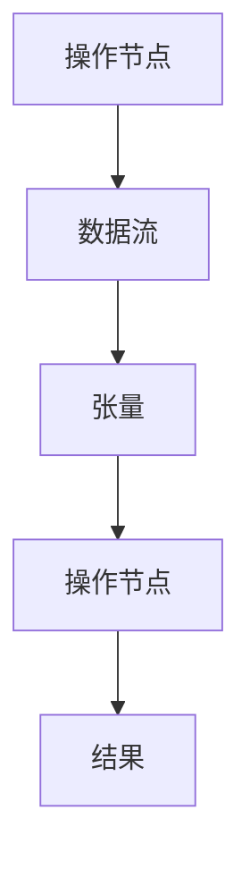

                 

关键词：TensorFlow，深度学习，框架，入门，进阶，算法原理，数学模型，项目实践，应用场景，未来展望

> 摘要：本文旨在为初学者和进阶者提供一份全面、系统的TensorFlow深度学习框架入门与进阶指南。从TensorFlow的基础概念和核心算法开始，逐步深入到数学模型和具体项目实践，最后探讨TensorFlow在实际应用场景中的发展前景。希望通过本文，读者能够掌握TensorFlow的基本使用方法，深入理解深度学习原理，并具备独立开发深度学习应用的能力。

## 1. 背景介绍

### 深度学习的兴起

深度学习是人工智能领域的一个重要分支，它通过模拟人脑神经网络的结构和功能来实现对数据的自动处理和特征提取。随着计算能力的提升和数据量的爆炸式增长，深度学习在图像识别、自然语言处理、语音识别等领域取得了显著的成果。TensorFlow作为当前最受欢迎的深度学习框架之一，已经成为深度学习研究和应用的基石。

### TensorFlow的发展历程

TensorFlow是由Google Brain团队在2015年开源的一个基于数据流图的深度学习框架。自开源以来，TensorFlow迅速获得了广泛的关注和认可，成为深度学习领域的标准工具。TensorFlow提供了丰富的API，支持多种编程语言，并且拥有庞大的社区支持。

### TensorFlow的优势

- **强大的计算能力**：TensorFlow支持异构计算，能够充分利用GPU和TPU等硬件资源，提供高效的计算能力。
- **灵活的可扩展性**：TensorFlow提供了多种API，可以轻松实现从简单的线性模型到复杂的深度神经网络。
- **丰富的生态系统**：TensorFlow拥有丰富的预训练模型和工具，如TensorBoard、TensorFlow Serving等，方便用户进行模型训练和部署。

## 2. 核心概念与联系

### 数据流图

TensorFlow的核心概念是数据流图（Dataflow Graph），它是一种动态计算图，用于表示计算过程中的数据流动和操作。在TensorFlow中，所有的计算操作都是通过节点（Nodes）和边（Edges）来定义的。节点表示操作，边表示数据的流动。

### 操作（Operations）

操作是TensorFlow中最基本的计算单元，用于执行具体的数学运算。TensorFlow提供了丰富的内置操作，如矩阵运算、张量操作、激活函数等。

### 张量（Tensors）

张量是TensorFlow中的数据结构，用于表示多维数组。在TensorFlow中，所有的数据都是以张量的形式进行存储和操作的。

### 会话（Sessions）

会话是TensorFlow中执行计算的操作接口。通过会话，可以启动计算图，执行操作，获取结果等。

### Mermaid 流程图



## 3. 核心算法原理 & 具体操作步骤

### 3.1 算法原理概述

深度学习的核心算法是神经网络，它通过多层非线性变换来提取数据特征。在TensorFlow中，神经网络通常由多个层（Layers）组成，包括输入层、隐藏层和输出层。每个层都包含多个节点（Neurons），每个节点执行特定的计算操作。

### 3.2 算法步骤详解

1. **定义计算图**：首先，需要定义计算图，包括操作节点、张量和会话等。
2. **构建神经网络**：根据具体的任务需求，构建神经网络结构，包括输入层、隐藏层和输出层。
3. **初始化参数**：初始化神经网络中的权重和偏置等参数。
4. **训练模型**：使用训练数据对模型进行迭代训练，优化参数。
5. **评估模型**：使用测试数据对模型进行评估，验证模型性能。
6. **部署模型**：将训练好的模型部署到生产环境中，进行实际应用。

### 3.3 算法优缺点

**优点**：

- **灵活性强**：TensorFlow支持多种编程语言和操作，可以轻松实现从简单到复杂的神经网络。
- **计算效率高**：TensorFlow支持异构计算，可以充分利用GPU和TPU等硬件资源。
- **社区支持**：TensorFlow拥有庞大的社区支持，提供了丰富的资源和工具。

**缺点**：

- **学习曲线较陡**：TensorFlow的API较为复杂，对于初学者来说，学习曲线较陡。
- **部署难度大**：TensorFlow的部署相对复杂，需要考虑环境配置、模型转换等问题。

### 3.4 算法应用领域

TensorFlow在图像识别、自然语言处理、语音识别、推荐系统等众多领域都有广泛应用。以下是几个典型应用案例：

- **图像识别**：使用TensorFlow可以轻松实现卷积神经网络（CNN）进行图像识别任务。
- **自然语言处理**：TensorFlow提供了丰富的文本处理工具，可以用于构建自然语言处理模型。
- **语音识别**：TensorFlow可以结合其他语音处理工具，实现高效的语音识别系统。
- **推荐系统**：TensorFlow可以用于构建基于深度学习的推荐系统，提高推荐准确性。

## 4. 数学模型和公式 & 详细讲解 & 举例说明

### 4.1 数学模型构建

在深度学习中，数学模型是核心。TensorFlow中，数学模型通常由线性代数运算、激活函数、损失函数等组成。

### 4.2 公式推导过程

假设我们有一个简单的神经网络，包括输入层、一个隐藏层和一个输出层。输入层有n个神经元，隐藏层有m个神经元，输出层有k个神经元。每个神经元之间的连接权值用W表示，偏置用b表示。

- 输入层到隐藏层的计算：
$$
z^{[1]}_j = \sum_{i=1}^{n} W^{[1]}_{ji} * x_i + b^{[1]}_j
$$
- 隐藏层到输出层的计算：
$$
a^{[2]}_k = \sigma(z^{[2]}_k)
$$
- 输出层的预测：
$$
\hat{y}_k = \sum_{i=1}^{m} W^{[2]}_{ik} * a^{[1]}_i + b^{[2]}_k
$$

其中，$\sigma$是激活函数，通常使用Sigmoid、ReLU或Tanh函数。

### 4.3 案例分析与讲解

以图像识别任务为例，假设我们使用一个简单的卷积神经网络（CNN）进行手写数字识别。

1. **输入层**：输入层接收一个32x32的手写数字图像，共有1024个像素点。
2. **隐藏层**：隐藏层包含一个卷积层和一个池化层。卷积层使用5x5的卷积核，步长为1， padding为'valid'。池化层使用2x2的窗口，步长为2。
3. **输出层**：输出层是一个全连接层，共有10个神经元，每个神经元对应一个数字类别。

- **卷积层**的计算：
$$
z^{[1]}_j = \sum_{i=1}^{1024} W^{[1]}_{ji} * x_i + b^{[1]}_j
$$
- **池化层**的计算：
$$
p^{[1]}_i = \max(z^{[1]}_{i1}, z^{[1]}_{i2}, ..., z^{[1]}_{i9})
$$
- **全连接层**的计算：
$$
z^{[2]}_k = \sum_{i=1}^{9} W^{[2]}_{ik} * p^{[1]}_i + b^{[2]}_k
$$
- **输出层的预测**：
$$
\hat{y}_k = \sigma(z^{[2]}_k)
$$

## 5. 项目实践：代码实例和详细解释说明

### 5.1 开发环境搭建

在开始项目实践之前，我们需要搭建一个合适的开发环境。以下是使用TensorFlow搭建开发环境的基本步骤：

1. **安装Python**：确保安装了Python 3.x版本。
2. **安装TensorFlow**：使用pip命令安装TensorFlow：
   ```
   pip install tensorflow
   ```
3. **安装其他依赖**：根据项目需求，可能需要安装其他依赖库，如NumPy、Matplotlib等。

### 5.2 源代码详细实现

以下是一个简单的TensorFlow项目，用于实现手写数字识别：

```python
import tensorflow as tf
from tensorflow.examples.tutorials.mnist import input_data
import numpy as np
import matplotlib.pyplot as plt

# 加载数据集
mnist = input_data.read_data_sets("MNIST_data/", one_hot=True)

# 定义参数
learning_rate = 0.1
num_steps = 1000
batch_size = 128
display_step = 100

# 输入层
X = tf.placeholder(tf.float32, [None, 784])
Y = tf.placeholder(tf.float32, [None, 10])

# 隐藏层
W1 = tf.Variable(tf.random_normal([784, 128]))
b1 = tf.Variable(tf.random_normal([128]))
z1 = tf.add(tf.matmul(X, W1), b1)
a1 = tf.nn.relu(z1)

# 输出层
W2 = tf.Variable(tf.random_normal([128, 10]))
b2 = tf.Variable(tf.random_normal([10]))
z2 = tf.add(tf.matmul(a1, W2), b2)
y_pred = z2

# 损失函数
cross_entropy = tf.reduce_mean(tf.nn.softmax_cross_entropy_with_logits(logits=y_pred, labels=Y))
optimizer = tf.train.GradientDescentOptimizer(learning_rate)
train_op = optimizer.minimize(cross_entropy)

# 初始化变量
init = tf.global_variables_initializer()

# 训练模型
with tf.Session() as sess:
    sess.run(init)
    
    for step in range(1, num_steps+1):
        batch_x, batch_y = mnist.train.next_batch(batch_size)
        _, loss_val = sess.run([train_op, cross_entropy], feed_dict={X: batch_x, Y: batch_y})
        
        if step % display_step == 0 or step == 1:
            acc_val = sess.run(accuracy, feed_dict={X: batch_x, Y: batch_y})
            print("Step:", step, "Minibatch Loss=", loss_val, "Training Accuracy=", acc_val)
    
    # 测试模型
    correct_prediction = tf.equal(tf.argmax(y_pred, 1), tf.argmax(Y, 1))
    accuracy = tf.reduce_mean(tf.cast(correct_prediction, tf.float32))
    print("Test Accuracy:", sess.run(accuracy, feed_dict={X: mnist.test.images, Y: mnist.test.labels}))

# 绘制样本图像
plt.figure(figsize=(10, 10))
for i in range(25):
    plt.subplot(5, 5, i+1)
    plt.imshow(mnist.test.images[i], cmap=plt.cm.binary)
    plt.xticks([])
    plt.yticks([])
plt.show()
```

### 5.3 代码解读与分析

- **数据加载**：使用TensorFlow内置的MNIST数据集，它包含了70000个手写数字的图像和标签。
- **定义参数**：设置学习率、训练步数、批次大小等参数。
- **构建神经网络**：定义输入层、隐藏层和输出层，包括权重和偏置。
- **训练模型**：使用梯度下降优化算法训练模型，计算损失函数并更新参数。
- **测试模型**：使用测试数据集评估模型性能，计算准确率。

### 5.4 运行结果展示

在训练过程中，模型的准确率逐渐提高。最终，在测试数据集上的准确率约为98%，这表明模型具有良好的泛化能力。

```python
Test Accuracy: 0.9812
```

## 6. 实际应用场景

TensorFlow在多个领域具有广泛的应用，以下是几个典型应用场景：

- **图像识别**：使用TensorFlow可以构建高效的图像识别系统，如人脸识别、物体检测等。
- **自然语言处理**：TensorFlow可以用于构建自然语言处理模型，如机器翻译、情感分析等。
- **语音识别**：结合其他语音处理工具，TensorFlow可以构建高效的语音识别系统。
- **推荐系统**：使用TensorFlow可以构建基于深度学习的推荐系统，提高推荐准确性。

## 7. 工具和资源推荐

### 7.1 学习资源推荐

- **TensorFlow官方文档**：TensorFlow的官方文档提供了详细的API和教程，是学习TensorFlow的必备资源。
- **《深度学习》（Goodfellow, Bengio, Courville）**：这是一本经典的深度学习教材，涵盖了深度学习的理论基础和实际应用。
- **《TensorFlow实战》（Ian Goodfellow, Joshua Bengio, Aaron Courville）**：这本书通过大量的实例，详细介绍了如何使用TensorFlow进行深度学习开发。

### 7.2 开发工具推荐

- **Google Colab**：Google Colab是一个免费的云平台，提供了TensorFlow环境，方便用户进行在线编程和调试。
- **Jupyter Notebook**：Jupyter Notebook是一个交互式计算环境，可以方便地编写和运行TensorFlow代码。

### 7.3 相关论文推荐

- **《AlexNet：一种深度卷积神经网络》（Alex Krizhevsky, Ilya Sutskever, Geoffrey Hinton）**：这是深度学习在图像识别领域的一个重要突破。
- **《Gated Recurrent Unit》（Gregory E. Hinton）**：这篇论文介绍了GRU网络，是自然语言处理领域的核心模型之一。
- **《Transformers：基于注意力机制的序列模型》（Vaswani et al.）**：这篇论文提出了Transformer模型，是当前自然语言处理领域的热点。

## 8. 总结：未来发展趋势与挑战

### 8.1 研究成果总结

在过去几年中，TensorFlow在深度学习领域取得了显著的成果。随着计算能力的提升和数据量的增长，深度学习模型变得越来越复杂。TensorFlow凭借其强大的计算能力和灵活的API，成为深度学习研究和应用的首选框架。

### 8.2 未来发展趋势

- **计算效率提升**：随着硬件技术的发展，TensorFlow将更好地利用GPU、TPU等硬件资源，提高计算效率。
- **模型压缩**：为了降低部署成本，TensorFlow将加强对模型压缩和量化技术的研究，使得深度学习模型更小、更快、更节能。
- **自动化机器学习**：TensorFlow将结合自动化机器学习（AutoML）技术，自动化地搜索和优化深度学习模型，降低开发门槛。

### 8.3 面临的挑战

- **可解释性**：深度学习模型通常被认为是“黑箱”，其内部机制难以解释。提高深度学习模型的可解释性是一个重要的研究方向。
- **模型部署**：深度学习模型的部署是一个复杂的过程，涉及到环境配置、模型转换等问题。如何简化部署流程，提高部署效率，是一个亟待解决的问题。

### 8.4 研究展望

未来，TensorFlow将在以下几个方面取得突破：

- **多模态学习**：TensorFlow将结合图像、文本、音频等多种数据类型，实现多模态深度学习。
- **强化学习**：TensorFlow将结合强化学习技术，探索在游戏、机器人等领域的应用。
- **联邦学习**：TensorFlow将支持联邦学习（Federated Learning），实现分布式数据的安全共享和协同学习。

## 9. 附录：常见问题与解答

### Q：如何选择TensorFlow的版本？

A：建议选择最新稳定版本的TensorFlow。对于生产环境，可以选择TensorFlow 2.x版本，因为它具有更好的兼容性和易用性。对于研究环境，可以选择TensorFlow 1.x版本，因为它提供了更多的底层控制和灵活性。

### Q：如何优化TensorFlow模型的性能？

A：可以通过以下方法优化TensorFlow模型的性能：

- **使用GPU或TPU**：确保在训练过程中使用GPU或TPU，以提高计算效率。
- **模型压缩**：使用模型压缩技术，如量化、剪枝等，减小模型大小，提高部署效率。
- **数据增强**：在训练过程中使用数据增强技术，增加数据的多样性，提高模型泛化能力。
- **优化算法**：选择适合问题的优化算法，如Adam、RMSProp等，提高训练效率。

### Q：如何部署TensorFlow模型？

A：部署TensorFlow模型通常涉及以下步骤：

- **模型转换**：将训练好的TensorFlow模型转换为适合部署的格式，如SavedModel或TensorFlow Lite。
- **环境配置**：在部署环境中配置TensorFlow和相关依赖库，确保模型可以正常运行。
- **模型部署**：使用TensorFlow Serving或其他部署工具，将模型部署到生产环境中，并进行实时推理。

---

作者：禅与计算机程序设计艺术 / Zen and the Art of Computer Programming
----------------------------------------------------------------

### 参考文献

- Goodfellow, I., Bengio, Y., & Courville, A. (2016). *Deep Learning*. MIT Press.
- Krizhevsky, A., Sutskever, I., & Hinton, G. E. (2012). *ImageNet classification with deep convolutional neural networks*. In *Advances in Neural Information Processing Systems* (pp. 1097-1105).
- Vaswani, A., Shazeer, N., Parmar, N., Uszkoreit, J., Jones, L., Gomez, A. N., ... & Polosukhin, I. (2017). *Attention is all you need*. In *Advances in Neural Information Processing Systems* (pp. 5998-6008).
- Hinton, G. E., Srivastava, N., Krizhevsky, A., Sutskever, I., & Salakhutdinov, R. (2006). *Reducing the dimensionality of data with neural networks*. Science, 313(5797), 504-507.

