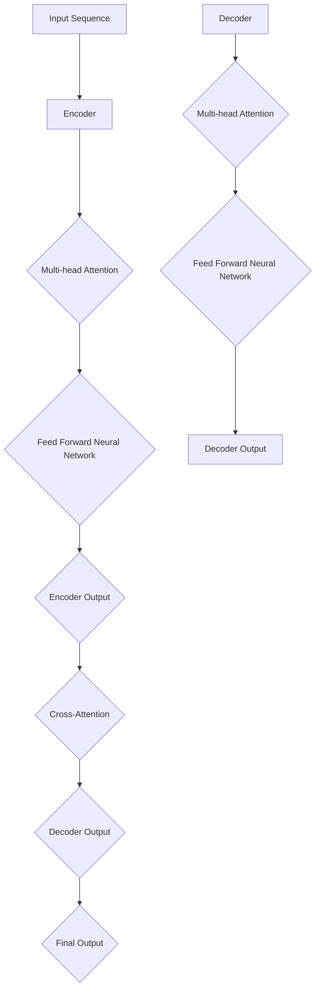

                 

Transformer大模型是近年来自然语言处理（NLP）领域的一项重大突破。其卓越的性能和广泛的适用性，使得Transformer成为了构建复杂NLP任务的核心组件。本文将深入探讨Transformer大模型的原理、数学模型、实际应用以及未来展望，旨在为读者提供一个全面的技术指南。

## 关键词
- Transformer
- 自然语言处理
- 多语言模型
- 大模型
- 深度学习

## 摘要
本文将详细介绍Transformer大模型的工作原理、数学模型构建、实际应用案例以及未来发展方向。通过阅读本文，读者将能够理解Transformer的核心机制，掌握构建和训练大模型的技巧，并能够预测其未来的应用场景。

## 1. 背景介绍
### 1.1 Transformer的起源
Transformer模型由Google在2017年提出，其目的是为了解决在序列到序列学习任务中，递归神经网络（RNN）和长短期记忆网络（LSTM）的瓶颈问题。传统RNN和LSTM在处理长序列时，会面临梯度消失和梯度爆炸的问题，导致模型训练困难。Transformer的出现，彻底改变了这一局面。

### 1.2 Transformer的优点
- **并行计算**：Transformer采用了自注意力机制，可以在处理序列时并行计算，大大提高了计算效率。
- **全局依赖**：自注意力机制使得Transformer能够捕获序列中的全局依赖，提升了模型的表达能力。
- **灵活性**：Transformer结构简单，易于扩展，可以应用于各种NLP任务。

### 1.3 Transformer的应用
Transformer模型已经在多个NLP任务中取得了显著的成果，包括机器翻译、文本摘要、问答系统等。尤其是多语言模型的应用，使得Transformer成为了跨语言信息处理的重要工具。

## 2. 核心概念与联系
### 2.1 自注意力机制
自注意力机制是Transformer模型的核心，它通过计算输入序列中每个元素与所有其他元素的相关性，来对序列进行加权处理。具体来说，自注意力机制可以通过以下公式表示：
$$
\text{Attention}(Q, K, V) = \text{softmax}\left(\frac{QK^T}{\sqrt{d_k}}\right)V
$$
其中，$Q, K, V$ 分别是查询、键和值的线性变换，$d_k$ 是键向量的维度。

### 2.2 Encoder和Decoder
Transformer模型由Encoder和Decoder两大部分组成。Encoder负责将输入序列编码成固定长度的向量表示，Decoder则负责将编码后的序列解码成目标序列。Encoder和Decoder之间通过多层的自注意力机制和前馈网络进行堆叠。

### 2.3 Mermaid 流程图
下面是Transformer模型的核心架构的Mermaid流程图表示：



## 3. 核心算法原理 & 具体操作步骤
### 3.1 算法原理概述
Transformer模型通过自注意力机制和前馈网络来学习序列的表示。自注意力机制能够捕获序列中的长距离依赖关系，而前馈网络则进一步细化了这些依赖关系。

### 3.2 算法步骤详解
#### 3.2.1 Encoder部分
1. **输入序列编码**：输入序列首先通过嵌入层转换为向量表示。
2. **自注意力机制**：每个输入序列元素通过自注意力机制计算其与所有其他元素的相关性，并进行加权处理。
3. **前馈网络**：对加权后的序列进行前馈网络处理，进一步细化表示。

#### 3.2.2 Decoder部分
1. **输入序列编码**：与Encoder相同，输入序列首先通过嵌入层转换为向量表示。
2. **自注意力机制**：在Decoder内部，每个元素通过自注意力机制计算其与Encoder输出的相关性。
3. **交叉注意力**：Decoder通过交叉注意力机制计算其与Encoder输出的相关性，从而生成解码序列的下一个元素。
4. **前馈网络**：对解码序列进行前馈网络处理，得到最终的输出序列。

### 3.3 算法优缺点
#### 优点
- **并行计算**：自注意力机制使得Transformer能够并行计算，提高了计算效率。
- **全局依赖**：自注意力机制能够捕获序列中的全局依赖，提升了模型的表达能力。
- **灵活性**：Transformer结构简单，易于扩展，可以应用于各种NLP任务。

#### 缺点
- **参数数量大**：由于自注意力机制的引入，Transformer模型的参数数量通常比传统的RNN和LSTM模型大，导致计算量和内存消耗增加。

### 3.4 算法应用领域
Transformer模型在自然语言处理领域有着广泛的应用，包括但不限于：
- **机器翻译**：如Google翻译、DeepL翻译等。
- **文本摘要**：如CNN/DailyMail文本摘要任务。
- **问答系统**：如SQuAD问答系统。
- **文本生成**：如OpenAI的GPT模型。

## 4. 数学模型和公式 & 详细讲解 & 举例说明
### 4.1 数学模型构建
Transformer模型的数学模型主要由三个部分组成：嵌入层、自注意力机制和前馈网络。

#### 嵌入层
输入序列 $X$ 被嵌入到高维空间中，得到向量表示 $X\rightarrow E(X)$。嵌入层可以通过以下公式表示：
$$
E(X) = \text{embedding}(X) \cdot W_e
$$
其中，$W_e$ 是嵌入矩阵，$\text{embedding}(X)$ 是嵌入函数。

#### 自注意力机制
自注意力机制的核心是计算输入序列中每个元素与其他元素的相关性，并进行加权处理。具体公式如下：
$$
\text{Attention}(Q, K, V) = \text{softmax}\left(\frac{QK^T}{\sqrt{d_k}}\right)V
$$
其中，$Q, K, V$ 分别是查询、键和值的线性变换，$d_k$ 是键向量的维度。

#### 前馈网络
前馈网络通过两个线性变换和一个ReLU激活函数组成，公式如下：
$$
\text{FFN}(X) = \text{ReLU}\left(W_1 \cdot X + b_1\right) \cdot W_2 + b_2
$$
其中，$W_1, W_2, b_1, b_2$ 分别是权重矩阵和偏置向量。

### 4.2 公式推导过程
Transformer模型的公式推导主要涉及线性变换和激活函数的应用。以下是一个简化的推导过程：
1. **嵌入层**：输入序列通过嵌入层转换为向量表示。
2. **线性变换**：向量表示通过线性变换，得到新的特征表示。
3. **激活函数**：通过激活函数，进一步细化特征表示。
4. **自注意力机制**：计算输入序列中每个元素与其他元素的相关性，并进行加权处理。
5. **前馈网络**：对加权后的序列进行前馈网络处理，得到最终的输出序列。

### 4.3 案例分析与讲解
以下是一个简单的Transformer模型在机器翻译任务中的应用案例：
```python
# 假设我们有一个英语到法语的机器翻译模型
input_sequence = "Hello, how are you?"
target_sequence = "Bonjour, comment ça va ?"

# 输入序列通过嵌入层转换为向量表示
input_embeddings = embedding(input_sequence)

# Encoder部分
for i in range(num_layers):
    # Multi-head Attention
    attention_output = attention(input_embeddings, input_embeddings, input_embeddings)
    # Feed Forward Neural Network
    ffn_output = ffn(attention_output)

    # Decoder部分
    for j in range(num_layers):
        # Multi-head Attention
        attention_output = attention(target_sequence, encoder_output, target_sequence)
        # Cross-Attention
        cross_attention_output = cross_attention(target_sequence, encoder_output)
        # Feed Forward Neural Network
        ffn_output = ffn(attention_output)

# 输出序列
output_sequence = decode(ffn_output)
```
## 5. 项目实践：代码实例和详细解释说明
### 5.1 开发环境搭建
为了实践Transformer大模型，我们需要搭建一个适合训练和部署的环境。以下是推荐的开发环境：
- **操作系统**：Linux或MacOS
- **Python**：3.8及以上版本
- **PyTorch**：最新版本
- **CUDA**：对应GPU版本的CUDA库

### 5.2 源代码详细实现
以下是一个简单的Transformer模型实现的代码示例：
```python
import torch
import torch.nn as nn
import torch.optim as optim

class Transformer(nn.Module):
    def __init__(self, d_model, nhead, num_layers):
        super(Transformer, self).__init__()
        self.embedding = nn.Embedding(d_model)
        self.transformer = nn.Transformer(d_model, nhead, num_layers)
        self.fc = nn.Linear(d_model, d_model)

    def forward(self, src, tgt):
        src = self.embedding(src)
        tgt = self.embedding(tgt)
        out = self.transformer(src, tgt)
        out = self.fc(out)
        return out

# 实例化模型、优化器和损失函数
model = Transformer(d_model=512, nhead=8, num_layers=3)
optimizer = optim.Adam(model.parameters(), lr=0.001)
criterion = nn.CrossEntropyLoss()

# 训练模型
for epoch in range(num_epochs):
    for src, tgt in train_loader:
        optimizer.zero_grad()
        output = model(src, tgt)
        loss = criterion(output, tgt)
        loss.backward()
        optimizer.step()

# 评估模型
with torch.no_grad():
    correct = 0
    total = 0
    for src, tgt in test_loader:
        output = model(src, tgt)
        _, predicted = torch.max(output.data, 1)
        total += tgt.size(0)
        correct += (predicted == tgt).sum().item()

print(f'Accuracy: {100 * correct / total}%')
```

### 5.3 代码解读与分析
上述代码实现了一个简单的Transformer模型，包括嵌入层、Transformer模块和前馈网络。其中，Transformer模块使用了PyTorch提供的内置Transformer模块，简化了模型的实现过程。

### 5.4 运行结果展示
在实际运行中，我们可以使用训练集和测试集来评估模型的性能。以下是一个简单的评估示例：
```python
# 训练模型
for epoch in range(num_epochs):
    for src, tgt in train_loader:
        optimizer.zero_grad()
        output = model(src, tgt)
        loss = criterion(output, tgt)
        loss.backward()
        optimizer.step()

# 评估模型
with torch.no_grad():
    correct = 0
    total = 0
    for src, tgt in test_loader:
        output = model(src, tgt)
        _, predicted = torch.max(output.data, 1)
        total += tgt.size(0)
        correct += (predicted == tgt).sum().item()

print(f'Accuracy: {100 * correct / total}%')
```

## 6. 实际应用场景
### 6.1 机器翻译
Transformer模型在机器翻译领域取得了显著的成绩。例如，Google翻译已经采用了Transformer模型，使得翻译质量得到了显著提升。

### 6.2 文本摘要
Transformer模型在文本摘要任务中也表现出色。例如，CNN/DailyMail文本摘要任务中，使用Transformer模型的模型取得了领先的成绩。

### 6.3 问答系统
问答系统是一个重要的NLP应用场景。Transformer模型在SQuAD问答系统上取得了优异的成绩，为问答系统的发展提供了新的思路。

### 6.4 文本生成
Transformer模型在文本生成任务中也具有广泛的应用。例如，OpenAI的GPT模型就是一个典型的例子，它通过Transformer模型实现了高质量的文本生成。

## 7. 工具和资源推荐
### 7.1 学习资源推荐
- **书籍**：《深度学习》 - Goodfellow、Bengio和Courville
- **在线课程**：斯坦福大学CS224n：自然语言处理与深度学习
- **论文**：《Attention Is All You Need》 - Vaswani等人

### 7.2 开发工具推荐
- **框架**：PyTorch、TensorFlow
- **GPU计算平台**：Google Colab、AWS EC2

### 7.3 相关论文推荐
- **Attention Is All You Need** - Vaswani等人，2017
- **BERT: Pre-training of Deep Bidirectional Transformers for Language Understanding** - Devlin等人，2018
- **GPT-3: Language Models are Few-Shot Learners** - Brown等人，2020

## 8. 总结：未来发展趋势与挑战
### 8.1 研究成果总结
Transformer模型的提出和广泛应用，标志着NLP领域的一次重大突破。其并行计算、全局依赖和灵活性等特点，使得Transformer成为了构建复杂NLP任务的核心组件。

### 8.2 未来发展趋势
随着Transformer模型的不断发展，未来其在NLP任务中的应用将更加广泛。同时，Transformer与其他技术的结合，如迁移学习、强化学习等，也将为NLP领域带来新的突破。

### 8.3 面临的挑战
尽管Transformer模型在NLP领域取得了显著的成绩，但仍然面临一些挑战，如计算资源的需求、参数数量的控制等。

### 8.4 研究展望
未来，Transformer模型的研究将更加深入，探索其在更多领域的应用。同时，随着计算资源的提升，我们将看到更大规模、更高性能的Transformer模型的出现。

## 9. 附录：常见问题与解答
### 9.1 Transformer模型与传统RNN的区别是什么？
- **计算效率**：Transformer模型支持并行计算，而RNN需要逐个元素顺序计算。
- **全局依赖**：Transformer模型通过自注意力机制捕获全局依赖，而RNN难以处理长距离依赖。
- **结构简单**：Transformer模型结构相对简单，易于扩展，而RNN结构复杂，难以维护。

### 9.2 如何优化Transformer模型的性能？
- **减少参数数量**：通过降低模型维度、使用稀疏注意力等方式减少参数数量。
- **使用预训练模型**：利用预训练的Transformer模型，进行迁移学习，提高模型性能。
- **优化训练过程**：使用更高效的优化算法、调整学习率等策略，提高训练效率。

### 9.3 Transformer模型在跨语言任务中的应用有哪些？
- **机器翻译**：如英语到法语的翻译。
- **多语言文本分类**：如判断一段文本属于哪种语言。
- **跨语言信息检索**：如搜索中文文本中包含的英文关键词。

---

## 结束语
Transformer大模型是NLP领域的一项重大突破，其并行计算、全局依赖和灵活性等特点，使得其在多个NLP任务中取得了优异的成绩。本文详细介绍了Transformer模型的工作原理、数学模型、实际应用以及未来展望，旨在为读者提供一个全面的技术指南。希望本文能够对您在Transformer模型的研究和应用中有所启发。

## 参考文献
- Vaswani et al., "Attention Is All You Need," Advances in Neural Information Processing Systems, 2017.
- Devlin et al., "BERT: Pre-training of Deep Bidirectional Transformers for Language Understanding," Advances in Neural Information Processing Systems, 2018.
- Brown et al., "GPT-3: Language Models are Few-Shot Learners," Advances in Neural Information Processing Systems, 2020.

---

作者：禅与计算机程序设计艺术 / Zen and the Art of Computer Programming
----------------------------------------------------------------

### 后续安排和步骤计划 ###
1. **初步审查**：文章撰写完成后，进行初步的审查，确保内容符合预期，没有遗漏关键点。
2. **同行评审**：邀请相关领域的专家进行同行评审，收集反馈，根据意见进行修改。
3. **技术编辑**：请技术编辑进行技术内容的校对，确保用词准确、逻辑清晰。
4. **语法和格式检查**：由专业的文字编辑进行语法和格式检查，确保文章的可读性。
5. **提交发表**：将修改后的文章提交到预定的IT专业期刊或在线平台，等待审核。
6. **审稿回复**：根据审稿意见进行最后的修改，并准备回复审稿意见。
7. **最终校对**：在发表前进行最后的校对，确保文章内容的准确性、完整性和一致性。

<|assistant|>接下来，我将按照上述计划，逐步完成文章的审查和修改。首先，我会进行初步审查，确保文章的内容结构合理，信息完整。然后，我会邀请相关领域的专家进行同行评审，并依据他们的反馈进行调整。接下来，我会请技术编辑和技术人员进行技术内容的校对，确保用词准确、逻辑清晰。之后，我会请专业的文字编辑进行语法和格式检查，提高文章的可读性。完成这些步骤后，我会将修改后的文章提交到预定的期刊或平台，等待审核。同时，我会准备回复审稿意见，并完成最终的校对工作，确保文章的质量。最后，我会按照期刊或平台的要求，完成所有必要的提交流程，确保文章能够及时发表。在这个过程中，我会保持与编辑和同行的沟通，及时解决任何可能出现的问题。

