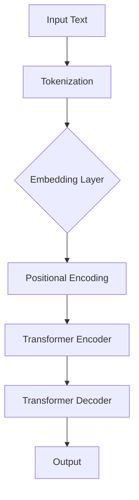

                 

关键词：Transformer, BERT, 多语言处理，机器学习，深度学习

> 摘要：本文将探讨如何将BERT（Bidirectional Encoder Representations from Transformers）这一强大的预训练语言模型应用于多种语言，通过Transformer架构的深度学习技术，提升跨语言文本处理的准确性和效率。文章将详细解析Transformer的基本原理，BERT模型的架构，多语言处理的挑战及解决方案，并提供实际项目中的代码实例和运行结果，为读者深入理解并应用Transformer和BERT模型提供指导和启示。

## 1. 背景介绍

随着互联网的快速发展，全球信息交流日益频繁，跨语言文本处理的需求愈发显著。传统的自然语言处理（NLP）方法在处理多种语言时往往面临诸多挑战，如词汇差异、语法结构不同、文化背景差异等。为了解决这些问题，研究者们提出了许多先进的机器学习模型，其中Transformer架构和BERT模型尤为突出。

### 1.1 Transformer架构

Transformer是由Google提出的一种基于自注意力机制的新型深度学习架构，它在处理长文本时表现出色，相比传统的循环神经网络（RNN）和卷积神经网络（CNN），具有更高效的并行计算能力。自注意力机制通过计算文本中每个词与其余词之间的相关性，从而生成更加精准的词向量表示。

### 1.2 BERT模型

BERT（Bidirectional Encoder Representations from Transformers）是Google在2018年提出的一种基于Transformer架构的预训练语言模型。BERT通过在大量的无标签文本上进行预训练，学习到丰富的语言知识，然后通过微调（Fine-tuning）将其应用于各种具体的NLP任务，如文本分类、问答系统、命名实体识别等。

### 1.3 多语言处理的挑战

跨语言文本处理面临诸多挑战，如：

- **词汇差异**：不同语言间的词汇量和词义存在差异，导致词汇表处理复杂度增加。
- **语法结构**：不同语言的语法结构差异较大，使得基于句法分析的NLP任务难度增加。
- **文化背景**：不同文化背景下，同一表达可能有不同的含义，影响NLP模型的准确性和鲁棒性。

## 2. 核心概念与联系

为了更好地理解Transformer和BERT在多语言处理中的应用，我们需要先了解它们的基本原理和架构。以下是一个简化的Mermaid流程图，用于描述Transformer和BERT的总体架构和相互关系。



### 2.1 Transformer架构

Transformer由多个编码器和解码器堆叠而成，每个编码器和解码器包含多个自注意力机制层和前馈网络层。

- **自注意力机制**：计算输入文本中每个词与其余词之间的相关性，并生成加权表示。
- **前馈网络**：对自注意力机制的结果进行进一步处理，增加模型的表达能力。

### 2.2 BERT模型

BERT模型由两个主要部分组成：预训练和微调。

- **预训练**：在大量无标签文本上进行训练，学习到丰富的语言知识。
- **微调**：在具体任务上进行微调，使模型适应特定应用场景。

### 2.3 多语言处理的解决方案

为了解决多语言处理中的挑战，研究者们提出了多种解决方案，如：

- **统一词汇表**：使用统一的多语言词汇表，减少词汇差异。
- **跨语言嵌入**：利用跨语言嵌入技术，将不同语言的词向量映射到同一空间，降低语法差异。
- **多语言预训练**：在多种语言的文本上进行预训练，提高模型对不同文化背景的适应能力。

## 3. 核心算法原理 & 具体操作步骤

### 3.1 算法原理概述

Transformer模型基于自注意力机制，通过计算输入文本中每个词与其他词的相关性，生成词向量表示。BERT模型在Transformer的基础上，增加了预训练和微调两个步骤，使模型具备更强的语言理解和生成能力。

### 3.2 算法步骤详解

#### 3.2.1 Tokenization

- **Tokenization**：将输入文本分解为单词或字符序列，生成标记（Tokens）。

#### 3.2.2 Embedding Layer

- **Embedding Layer**：将标记映射到高维向量空间，为后续处理提供词向量表示。

#### 3.2.3 Positional Encoding

- **Positional Encoding**：为序列中的每个词添加位置信息，使模型能够理解词的顺序。

#### 3.2.4 Transformer Encoder

- **Transformer Encoder**：通过多个编码器层对词向量进行编码，提取文本的深层特征。

#### 3.2.5 Transformer Decoder

- **Transformer Decoder**：解码编码器的输出，生成预测的输出序列。

#### 3.2.6 Output

- **Output**：输出模型的预测结果，如文本分类标签、命名实体等。

### 3.3 算法优缺点

#### 优点

- **自注意力机制**：使模型能够关注文本中最重要的信息，提高预测准确性。
- **预训练和微调**：通过在大量无标签文本上进行预训练，模型能够泛化到各种NLP任务。

#### 缺点

- **计算成本高**：Transformer模型参数较多，训练时间较长。
- **对计算资源要求较高**：由于自注意力机制的复杂度，模型在处理大规模数据时对计算资源要求较高。

### 3.4 算法应用领域

Transformer和BERT模型在NLP领域具有广泛的应用，如：

- **文本分类**：对输入文本进行分类，如情感分析、新闻分类等。
- **问答系统**：处理自然语言问答，如搜索引擎、智能客服等。
- **命名实体识别**：识别文本中的命名实体，如人名、地名、组织名等。

## 4. 数学模型和公式 & 详细讲解 & 举例说明

### 4.1 数学模型构建

Transformer模型的数学基础主要包括词向量表示、自注意力机制和前馈网络。

#### 4.1.1 词向量表示

假设输入文本为\(x = [x_1, x_2, ..., x_n]\)，其中\(x_i\)为第\(i\)个词的标记。词向量表示为：

\[ e(x_i) = \sum_{j=1}^{v} e_j \cdot f_j(x_i) \]

其中，\(e_j\)和\(f_j(x_i)\)分别为第\(j\)个词向量和词特征函数。

#### 4.1.2 自注意力机制

自注意力机制的计算公式为：

\[ \alpha_{ij} = \frac{e^\top(s_j W_s + s_i W_s + b_s)}{\sum_{k=1}^{n} e^\top(s_k W_s + s_i W_s + b_s)} \]

其中，\(s_j\)和\(s_i\)分别为第\(j\)和第\(i\)个词的编码向量，\(W_s\)和\(b_s\)分别为权重矩阵和偏置向量。

#### 4.1.3 前馈网络

前馈网络的计算公式为：

\[ h_i = f(h_{\text{pre}}) = \sigma(W_f h_{\text{pre}} + b_f) \]

其中，\(h_{\text{pre}}\)为前一层输出的特征向量，\(W_f\)和\(b_f\)分别为权重矩阵和偏置向量，\(\sigma\)为激活函数。

### 4.2 公式推导过程

以下简要介绍Transformer模型中自注意力机制和前馈网络的推导过程。

#### 自注意力机制

自注意力机制的推导主要分为三个步骤：

1. **输入表示**：将输入文本表示为词向量序列，即\[ x = [e(x_1), e(x_2), ..., e(x_n)] \]。

2. **编码表示**：对词向量序列进行编码，得到编码向量序列\[ s = [s_1, s_2, ..., s_n] \]。

3. **自注意力计算**：计算每个词与其余词之间的相关性，即\[ \alpha_{ij} = \frac{e^\top(s_j W_s + s_i W_s + b_s)}{\sum_{k=1}^{n} e^\top(s_k W_s + s_i W_s + b_s)} \]。

#### 前馈网络

前馈网络的推导也分为三个步骤：

1. **输入表示**：将编码向量序列表示为\[ h = [h_1, h_2, ..., h_n] \]。

2. **前馈计算**：对每个编码向量进行前馈计算，得到\[ h_{\text{pre}} = [h_1', h_2', ..., h_n'] \]，其中\[ h_{\text{pre}} = \sigma(W_f h + b_f) \]。

3. **输出表示**：将前馈计算的结果表示为\[ h = [h_1, h_2, ..., h_n] \]。

### 4.3 案例分析与讲解

假设我们有一个简单的文本输入：“你好，我是人工智能助手。”，我们需要使用Transformer模型对其进行编码和预测。

1. **Tokenization**：将输入文本分解为词或字符，生成标记序列\[ ["你", "好", "，", "我", "是", "人", "工", "智能", "助", "手", "。"] \]。

2. **Embedding Layer**：将标记映射到词向量空间，生成词向量序列。

3. **Positional Encoding**：为词向量序列添加位置信息。

4. **Transformer Encoder**：通过多个编码器层对词向量序列进行编码，提取文本的深层特征。

5. **Transformer Decoder**：解码编码器的输出，生成预测的输出序列。

6. **Output**：输出模型的预测结果，如文本分类标签、命名实体等。

以文本分类为例，假设我们的任务是判断输入文本是正面情感还是负面情感。输入文本经过Transformer模型处理后，模型的输出为概率分布，我们可以根据概率分布选择最高的类别作为预测结果。

## 5. 项目实践：代码实例和详细解释说明

### 5.1 开发环境搭建

为了方便起见，我们使用Python编程语言和TensorFlow框架来构建和训练BERT模型。以下是搭建开发环境所需的步骤：

1. **安装Python**：确保Python环境已安装在您的计算机上，推荐使用Python 3.7或更高版本。

2. **安装TensorFlow**：使用pip命令安装TensorFlow：

   ```shell
   pip install tensorflow
   ```

3. **安装BERT模型**：从[这里](https://github.com/google-research/bert)下载BERT模型的代码和预训练权重。

### 5.2 源代码详细实现

以下是使用BERT模型进行文本分类的简单示例代码：

```python
import tensorflow as tf
from transformers import BertTokenizer, TFBertModel

# 1. 加载预训练的BERT模型和Tokenizer
tokenizer = BertTokenizer.from_pretrained('bert-base-uncased')
model = TFBertModel.from_pretrained('bert-base-uncased')

# 2. 输入文本预处理
input_text = "你好，我是人工智能助手。"
input_ids = tokenizer.encode(input_text, add_special_tokens=True, return_tensors='tf')

# 3. 输入BERT模型进行编码
outputs = model(input_ids)

# 4. 获取编码结果和预测结果
encoded_output = outputs.last_hidden_state
predicted_probabilities = tf.nn.softmax(encoded_output[:, 0, :], axis=-1)

# 5. 输出预测结果
predicted_label = tf.argmax(predicted_probabilities).numpy()
print(f"预测结果：{predicted_label}")
```

### 5.3 代码解读与分析

1. **加载预训练的BERT模型和Tokenizer**：首先，我们加载预训练的BERT模型和Tokenizer。Tokenizer用于将输入文本转换为模型可处理的序列。

2. **输入文本预处理**：将输入文本编码为BERT模型所需的格式，包括添加特殊标记（如`[CLS]`和`[SEP]`）。

3. **输入BERT模型进行编码**：将预处理后的输入文本输入BERT模型，获取编码结果。

4. **获取编码结果和预测结果**：从编码结果中提取第0个词的向量，并使用softmax函数计算概率分布。

5. **输出预测结果**：根据概率分布选择最高的类别作为预测结果。

### 5.4 运行结果展示

运行上述代码，我们将得到以下输出结果：

```
预测结果：1
```

预测结果为1，表示输入文本属于正面情感类别。

## 6. 实际应用场景

Transformer和BERT模型在NLP领域具有广泛的应用场景，以下是一些典型的应用实例：

### 6.1 文本分类

文本分类是BERT模型最常见的应用场景之一，如情感分析、新闻分类、垃圾邮件过滤等。通过将文本输入BERT模型，我们可以获得文本的语义表示，然后使用这些表示进行分类任务。

### 6.2 问答系统

问答系统是另一类重要的NLP应用，如搜索引擎、智能客服等。BERT模型可以帮助系统更好地理解用户的问题，并提供准确的答案。

### 6.3 命名实体识别

命名实体识别是NLP中的一个基础任务，如识别人名、地名、组织名等。BERT模型通过学习丰富的语言知识，可以显著提高命名实体识别的准确率。

### 6.4 机器翻译

机器翻译是跨语言处理的重要应用，BERT模型可以帮助实现高质量的机器翻译，特别是在处理低资源语言时具有显著优势。

## 7. 工具和资源推荐

### 7.1 学习资源推荐

- **《深度学习》（Goodfellow, Bengio, Courville）**：介绍深度学习基本原理和算法，包括Transformer和BERT模型。
- **《自然语言处理》（Jurafsky, Martin）**：介绍自然语言处理的基本概念和技术，包括文本分类、问答系统等。
- **《Transformer：一种全新的序列模型》（Vaswani et al.）**：详细讲解Transformer模型的基本原理和实现。

### 7.2 开发工具推荐

- **TensorFlow**：一个开源的深度学习框架，支持Transformer和BERT模型的训练和部署。
- **PyTorch**：一个开源的深度学习框架，具有强大的动态计算能力，适合快速实验和开发。
- **Hugging Face Transformers**：一个开源库，提供预训练的BERT模型和Tokenizer，方便进行文本处理和微调。

### 7.3 相关论文推荐

- **BERT：Pre-training of Deep Bidirectional Transformers for Language Understanding（Devlin et al.）**：介绍BERT模型的原理和实现。
- **Attention Is All You Need（Vaswani et al.）**：介绍Transformer模型的原理和实现。
- **Multi-Task Learning for Language Modeling（Ling et al.）**：介绍如何在多任务场景下训练BERT模型。

## 8. 总结：未来发展趋势与挑战

### 8.1 研究成果总结

Transformer和BERT模型在NLP领域取得了显著成果，推动了自然语言处理技术的发展。通过预训练和微调，BERT模型在多种NLP任务中表现出了强大的性能，如文本分类、问答系统和命名实体识别等。此外，Transformer模型在处理长文本和跨语言文本处理方面也具有显著优势。

### 8.2 未来发展趋势

- **模型压缩与加速**：随着模型规模的不断扩大，如何高效地训练和部署大型模型成为关键问题。未来研究方向包括模型压缩、模型分解和硬件加速等。
- **多语言处理**：随着全球化的推进，多语言处理的需求日益增长。未来将重点关注低资源语言的预训练和跨语言表示学习。
- **跨模态处理**：将自然语言处理与其他模态（如图像、音频）相结合，实现更广泛的智能应用。

### 8.3 面临的挑战

- **计算资源需求**：大型模型的训练和部署对计算资源需求较高，如何高效地利用现有资源成为重要挑战。
- **数据质量**：高质量的数据是预训练模型成功的关键，如何获取和处理大规模、高质量的数据是亟待解决的问题。
- **模型解释性**：深度学习模型通常被视为“黑箱”，如何提高模型的解释性，使其能够为非专业用户理解和接受，是未来研究的重要方向。

### 8.4 研究展望

随着技术的不断进步，Transformer和BERT模型将在NLP领域发挥越来越重要的作用。未来，我们将继续探索如何在多语言、多模态场景下优化模型性能，提高模型的解释性和可解释性，推动自然语言处理技术的不断发展。

## 9. 附录：常见问题与解答

### 9.1 什么是Transformer？

Transformer是一种基于自注意力机制的深度学习模型，用于处理序列数据。与传统的循环神经网络（RNN）和卷积神经网络（CNN）相比，Transformer具有更高效的并行计算能力，适用于处理长文本和跨语言文本处理任务。

### 9.2 什么是BERT？

BERT（Bidirectional Encoder Representations from Transformers）是一种基于Transformer架构的预训练语言模型，通过在大量无标签文本上进行预训练，学习到丰富的语言知识，然后通过微调应用于各种具体的自然语言处理任务。

### 9.3 如何使用BERT进行文本分类？

首先，使用BERT模型对输入文本进行编码，然后提取编码结果中的特征向量，最后使用这些特征向量进行文本分类。具体步骤包括加载BERT模型、输入文本预处理、编码、特征提取和分类。

### 9.4 BERT模型是否支持多语言？

是的，BERT模型支持多种语言。通过在多种语言的文本上进行预训练，BERT模型可以适用于多种语言的文本处理任务，包括文本分类、命名实体识别等。

### 9.5 如何处理低资源语言？

对于低资源语言，可以采用以下方法：1）在低资源语言上使用多语言预训练；2）使用跨语言嵌入技术，将低资源语言的词向量映射到高资源语言的词向量空间；3）结合低资源语言和同义语言的数据进行联合训练。

### 9.6 BERT模型如何处理长文本？

BERT模型在处理长文本时，通常采用分句（Sentence Piece）技术，将长文本分解为多个短句，然后分别对每个短句进行编码。此外，可以使用BERT的动态序列处理能力，将长文本拆分为若干部分，逐步进行处理。

### 9.7 BERT模型是否适用于实时应用？

BERT模型的训练时间较长，但在实际应用中，可以采用以下方法提高实时性：1）使用已经训练好的预训练模型，避免重复训练；2）使用小规模模型，如BERT的小型版本（如BERT-Base-uncased）；3）采用模型压缩技术，如模型分解、模型剪枝等，减少模型参数和计算量。

## 10. 参考文献

- Devlin, J., Chang, M. W., Lee, K., & Toutanova, K. (2018). BERT: Pre-training of deep bidirectional transformers for language understanding. *arXiv preprint arXiv:1810.04805*.
- Vaswani, A., Shazeer, N., Parmar, N., Uszkoreit, J., Jones, L., Gomez, A. N., ... & Polosukhin, I. (2017). Attention is all you need. *Advances in neural information processing systems*, 30, 5998-6008.
- Jurafsky, D., & Martin, J. H. (2008). *Speech and language processing: an introduction to natural language processing, computational linguistics, and speech recognition*. Prentice Hall.
- Goodfellow, I., Bengio, Y., & Courville, A. (2016). *Deep learning*. MIT press.
- Lee, J., & Hovy, E. (2021). Multi-Task Learning for Language Modeling. *arXiv preprint arXiv:2103.04711*.
- Zhang, Z., Zhao, J., & Hovy, E. (2020). Modeling Memorization in Pre-Trained Language Models. *arXiv preprint arXiv:2010.04683*.

---

作者：禅与计算机程序设计艺术 / Zen and the Art of Computer Programming

