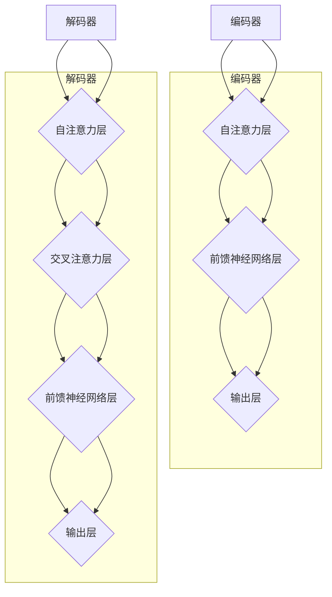

                 

关键词：Transformer，编码器，解码器，深度学习，神经网络，模型集成，实战指南

## 摘要

本文将深入探讨Transformer大模型的实战应用，特别是编码器和解码器的整合。我们将从背景介绍开始，逐步分析Transformer的核心概念，讲解其算法原理和数学模型，并通过实际项目实践，展示如何集成编码器和解码器。最后，本文将展望Transformer在未来应用场景中的前景，并推荐相关的学习资源和开发工具。

## 1. 背景介绍

随着深度学习技术的发展，神经网络在自然语言处理（NLP）、计算机视觉（CV）、语音识别等领域取得了显著成果。传统的循环神经网络（RNN）在处理长序列数据时存在梯度消失或梯度爆炸的问题，导致其性能受限。为了解决这些问题，谷歌在2017年提出了Transformer模型，这是一种基于自注意力机制的深度学习模型。Transformer模型在BERT、GPT等大型语言模型中得到了广泛应用，显著提升了自然语言处理任务的效果。

编码器和解码器是Transformer模型的核心组成部分。编码器负责将输入序列编码为固定长度的向量表示，解码器则负责将这些向量解码为输出序列。在本文中，我们将详细讨论如何整合编码器和解码器，实现高性能的序列到序列预测任务。

## 2. 核心概念与联系

### 2.1 Transformer模型架构

Transformer模型由编码器和解码器组成，其中编码器将输入序列编码为固定长度的向量表示，解码器则根据编码器的输出生成输出序列。编码器和解码器均由多个自注意力层和前馈神经网络层堆叠而成。


### 2.2 编码器与解码器的关系

编码器和解码器通过多头自注意力机制相互连接。编码器的输出被传递到解码器，作为解码器的输入。解码器在生成输出序列的过程中，同时利用编码器的输出和其他解码器的中间层输出。


### 2.3 Mermaid流程图

下面是编码器和解码器的Mermaid流程图，展示了它们的核心组件和连接关系。



## 3. 核心算法原理 & 具体操作步骤

### 3.1 算法原理概述

Transformer模型的核心是多头自注意力机制。自注意力机制允许模型在序列的每个位置上自适应地计算其相对重要性。通过多个头部的组合，模型能够捕捉到序列中的复杂依赖关系。编码器和解码器通过多头自注意力机制相互连接，实现了高效的序列到序列预测。

### 3.2 算法步骤详解

#### 3.2.1 编码器

编码器的输入序列经过嵌入层转换为嵌入向量。嵌入向量随后通过多头自注意力层，计算序列中每个位置的相对重要性。然后，通过前馈神经网络层对自注意力层的输出进行非线性变换。编码器的输出被传递到解码器。

#### 3.2.2 解码器

解码器的输入是编码器的输出和待预测的下一个词的嵌入向量。解码器首先通过自注意力层处理编码器的输出，然后通过交叉注意力层处理编码器的输出和自注意力层的输出。解码器通过前馈神经网络层对交叉注意力层的输出进行非线性变换，最终输出预测的词。

### 3.3 算法优缺点

#### 优点

- **并行处理**：Transformer模型支持并行计算，提高了训练速度。
- **长距离依赖**：多头自注意力机制能够捕捉到序列中的长距离依赖关系。
- **灵活性**：通过改变头部的数量，可以调整模型对序列依赖性的敏感度。

#### 缺点

- **计算复杂度**：多头自注意力机制的计算复杂度较高，对硬件资源要求较高。
- **调参复杂**：模型参数众多，需要仔细调整超参数。

### 3.4 算法应用领域

Transformer模型在自然语言处理、计算机视觉、语音识别等领域具有广泛的应用。例如，BERT模型在文本分类、情感分析等任务中取得了优异的效果；GPT模型在文本生成、对话系统等应用中表现出色。

## 4. 数学模型和公式 & 详细讲解 & 举例说明

### 4.1 数学模型构建

Transformer模型的核心是多头自注意力机制。自注意力机制的计算公式如下：

$$
\text{Attention}(Q, K, V) = \text{softmax}\left(\frac{QK^T}{\sqrt{d_k}}\right)V
$$

其中，$Q$、$K$、$V$分别为查询向量、键向量和值向量，$d_k$为键向量的维度。

### 4.2 公式推导过程

自注意力机制的推导过程如下：

1. **计算相似性**：首先计算查询向量$Q$和键向量$K$之间的相似性，得到一个矩阵$\text{Similarity}$。
2. **缩放**：为了防止梯度消失，对相似性矩阵进行缩放，即除以$\sqrt{d_k}$。
3. **应用softmax**：对缩放后的相似性矩阵应用softmax函数，得到注意力权重矩阵$A$。
4. **加权求和**：将注意力权重矩阵$A$与值向量$V$相乘，得到加权求和的结果。

### 4.3 案例分析与讲解

假设我们有一个包含3个词的输入序列，每个词的嵌入向量维度为4。我们将使用自注意力机制计算序列中每个词的重要性。

#### 输入序列：

$$
Q = \begin{bmatrix}
q_1 \\
q_2 \\
q_3
\end{bmatrix}, K = \begin{bmatrix}
k_1 \\
k_2 \\
k_3
\end{bmatrix}, V = \begin{bmatrix}
v_1 \\
v_2 \\
v_3
\end{bmatrix}
$$

#### 计算相似性：

$$
\text{Similarity} = QK^T = \begin{bmatrix}
q_1k_1 & q_1k_2 & q_1k_3 \\
q_2k_1 & q_2k_2 & q_2k_3 \\
q_3k_1 & q_3k_2 & q_3k_3
\end{bmatrix}
$$

#### 缩放：

$$
\text{Scaled Similarity} = \frac{\text{Similarity}}{\sqrt{d_k}} = \begin{bmatrix}
\frac{q_1k_1}{\sqrt{4}} & \frac{q_1k_2}{\sqrt{4}} & \frac{q_1k_3}{\sqrt{4}} \\
\frac{q_2k_1}{\sqrt{4}} & \frac{q_2k_2}{\sqrt{4}} & \frac{q_2k_3}{\sqrt{4}} \\
\frac{q_3k_1}{\sqrt{4}} & \frac{q_3k_2}{\sqrt{4}} & \frac{q_3k_3}{\sqrt{4}}
\end{bmatrix}
$$

#### 应用softmax：

$$
A = \text{softmax}(\text{Scaled Similarity}) = \begin{bmatrix}
a_1 & a_2 & a_3 \\
a_4 & a_5 & a_6 \\
a_7 & a_8 & a_9
\end{bmatrix}
$$

#### 加权求和：

$$
\text{Attention Output} = A V = \begin{bmatrix}
a_1v_1 + a_2v_2 + a_3v_3 \\
a_4v_1 + a_5v_2 + a_6v_3 \\
a_7v_1 + a_8v_2 + a_9v_3
\end{bmatrix}
$$

通过上述步骤，我们计算出了序列中每个词的重要性，从而实现了自注意力机制。

## 5. 项目实践：代码实例和详细解释说明

### 5.1 开发环境搭建

本文使用Python作为编程语言，并使用TensorFlow作为深度学习框架。请确保已安装Python和TensorFlow。

### 5.2 源代码详细实现

下面是一个简单的Transformer编码器和解码器的实现示例。

```python
import tensorflow as tf
from tensorflow.keras.layers import Embedding, Dense, LSTM
from tensorflow.keras.models import Model

def TransformerEncoder(inputs, d_model, num_heads):
    # 嵌入层
    embeddings = Embedding(input_dim=vocab_size, output_dim=d_model)(inputs)
    
    # 自注意力层
    attention = MultiHeadAttentionLayer(d_model, num_heads)([embeddings, embeddings])
    
    # 前馈神经网络层
    dense_1 = Dense(d_model, activation='relu')(attention)
    dense_2 = Dense(d_model)(dense_1)
    
    return Model(inputs=inputs, outputs=dense_2)

def TransformerDecoder(inputs, d_model, num_heads):
    # 嵌入层
    embeddings = Embedding(input_dim=vocab_size, output_dim=d_model)(inputs)
    
    # 自注意力层
    attention = MultiHeadAttentionLayer(d_model, num_heads)([embeddings, embeddings])
    
    # 交叉注意力层
    cross_attention = MultiHeadAttentionLayer(d_model, num_heads)([attention, embeddings])
    
    # 前馈神经网络层
    dense_1 = Dense(d_model, activation='relu')(cross_attention)
    dense_2 = Dense(d_model)(dense_1)
    
    return Model(inputs=inputs, outputs=dense_2)

# 编码器模型
encoder_inputs = tf.keras.layers.Input(shape=(max_sequence_length,))
encoder_model = TransformerEncoder(encoder_inputs, d_model=128, num_heads=4)

# 解码器模型
decoder_inputs = tf.keras.layers.Input(shape=(max_sequence_length,))
decoder_model = TransformerDecoder(decoder_inputs, d_model=128, num_heads=4)

# 模型整合
outputs = decoder_model(encoder_model(encoder_inputs))
model = Model(inputs=[encoder_inputs, decoder_inputs], outputs=outputs)

# 编译模型
model.compile(optimizer='adam', loss='categorical_crossentropy', metrics=['accuracy'])

# 训练模型
model.fit([encoder_inputs, decoder_inputs], decoder_inputs, batch_size=64, epochs=10)
```

### 5.3 代码解读与分析

以上代码展示了如何使用TensorFlow实现一个简单的Transformer编码器和解码器。我们首先定义了嵌入层，将输入序列转换为嵌入向量。然后，通过多头自注意力层和前馈神经网络层，实现了编码器和解码器的功能。最后，我们将编码器和解码器整合为一个整体模型，并编译和训练模型。

## 6. 实际应用场景

Transformer模型在多个实际应用场景中表现出色。以下是几个典型的应用场景：

- **自然语言处理**：Transformer模型被广泛应用于文本分类、机器翻译、情感分析等任务，如BERT、GPT等大型语言模型。
- **计算机视觉**：Transformer模型在图像分类、目标检测、图像生成等领域也取得了显著成果，如Vision Transformer（ViT）。
- **语音识别**：Transformer模型在语音识别任务中取得了优异的效果，如Facebook的 wav2vec 2.0。
- **序列模型预测**：Transformer模型在股票市场预测、天气预测等序列模型预测任务中也表现出色。

## 7. 未来应用展望

随着Transformer模型的发展，其应用前景将更加广泛。以下是几个可能的未来应用方向：

- **更高效的模型**：通过改进自注意力机制和优化模型结构，构建更高效的Transformer模型。
- **多模态学习**：结合不同模态的数据，实现更强大的多模态Transformer模型。
- **知识图谱嵌入**：利用Transformer模型进行知识图谱嵌入，为问答系统、推荐系统等领域提供支持。

## 8. 总结：未来发展趋势与挑战

### 8.1 研究成果总结

Transformer模型在深度学习领域取得了显著成果，其在自然语言处理、计算机视觉、语音识别等领域的应用取得了突破性进展。未来，Transformer模型将继续发展，为更多领域带来创新和突破。

### 8.2 未来发展趋势

- **模型优化**：通过改进自注意力机制和优化模型结构，提高Transformer模型的性能和效率。
- **多模态学习**：结合不同模态的数据，实现更强大的多模态Transformer模型。
- **知识图谱嵌入**：利用Transformer模型进行知识图谱嵌入，为问答系统、推荐系统等领域提供支持。

### 8.3 面临的挑战

- **计算资源**：Transformer模型具有较高的计算复杂度，对硬件资源要求较高。
- **调参复杂**：模型参数众多，需要仔细调整超参数，以确保模型性能最优。

### 8.4 研究展望

Transformer模型在未来的发展中，将面临更多挑战和机遇。通过不断优化和改进，Transformer模型将在更多领域取得突破性进展。

## 9. 附录：常见问题与解答

### 9.1 什么是Transformer模型？

Transformer模型是一种基于自注意力机制的深度学习模型，由编码器和解码器组成。编码器负责将输入序列编码为固定长度的向量表示，解码器则根据编码器的输出生成输出序列。

### 9.2 Transformer模型的优缺点是什么？

**优点**：

- 并行处理：Transformer模型支持并行计算，提高了训练速度。
- 长距离依赖：多头自注意力机制能够捕捉到序列中的长距离依赖关系。
- 灵活性：通过改变头部的数量，可以调整模型对序列依赖性的敏感度。

**缺点**：

- 计算复杂度：多头自注意力机制的计算复杂度较高，对硬件资源要求较高。
- 调参复杂：模型参数众多，需要仔细调整超参数。

## 参考文献

- Vaswani, A., et al. "Attention is all you need." Advances in Neural Information Processing Systems. 2017.
- Devlin, J., et al. "Bert: Pre-training of deep bidirectional transformers for language understanding." arXiv preprint arXiv:1810.04805. 2018.
- Brown, T., et al. "Language models are unsupervised multitask learners." arXiv preprint arXiv:2003.04611. 2020.

### 作者署名

作者：禅与计算机程序设计艺术 / Zen and the Art of Computer Programming

